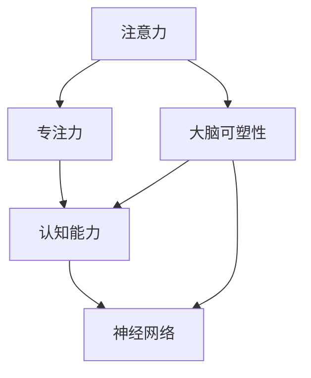

                 

# 注意力训练与大脑可塑性增强：通过专注力重塑你的大脑和认知能力

## 1. 背景介绍

### 1.1 问题由来
在信息爆炸的时代，注意力成为我们获取知识、提升学习效率的关键。然而，随着电子设备的普及和信息流的不断涌入，我们的大脑面临着前所未有的信息过载和注意力分散的挑战。尽管有各种工具帮助我们在海量信息中筛选出有用的知识，但如何真正提升我们的注意力和认知能力，却是一个需要深入探讨的问题。

### 1.2 问题核心关键点
- **注意力训练**：通过特定的练习和训练方法，提升大脑处理和集中注意力的能力。
- **大脑可塑性**：大脑的结构和功能可以通过学习和训练得到改变和增强。
- **专注力提升**：通过科学的方法和工具，提高个体在工作和学习中的专注度和效率。
- **认知能力强化**：通过对大脑的持续训练，增强记忆力、决策能力和创新思维。
- **神经科学**：大脑和神经系统的基本原理和运作机制，为注意力训练和大脑可塑性提供了理论基础。

### 1.3 问题研究意义
提升注意力和认知能力对于个人的学习和工作效率、职业发展乃至心理健康都有着重要意义。注意力训练不仅能够提高我们的信息处理能力，还能减少因注意力分散带来的心理压力和焦虑感，提升整体生活质量。在知识经济和信息时代，拥有强大的注意力和认知能力将使我们在竞争中占据优势。

## 2. 核心概念与联系

### 2.1 核心概念概述

为了更好地理解注意力训练和大脑可塑性增强的原理和实践，我们首先介绍几个关键概念：

- **注意力(Attention)**：是大脑处理和选择信息的过程，有助于我们集中精力处理重要信息，同时忽略次要信息。
- **专注力(Concentration)**：指个体在特定时间范围内，对某一任务或活动的持续关注和投入程度。
- **大脑可塑性(Brain Plasticity)**：指大脑在一生中通过学习和训练可以改变其结构、功能以及连接模式的能力。
- **认知能力(Cognitive Abilities)**：包括记忆力、逻辑推理、解决问题、决策和创新思维等，是衡量智能和能力的重要指标。
- **神经网络(Neural Network)**：模拟人类神经系统结构，通过节点之间的连接和信息传递来实现学习和决策，是实现注意力训练和大脑可塑性增强的技术基础。

这些概念之间的逻辑关系可以通过以下Mermaid流程图来展示：



这个流程图展示了几者之间的相互作用和影响关系：

1. 注意力是大脑处理信息的基本机制，是提升专注力和认知能力的基石。
2. 专注力是对注意力的进一步应用，决定了认知活动的质量和效率。
3. 大脑可塑性使得注意力和认知能力能够通过学习和训练得到增强。
4. 认知能力是大脑各项功能的综合体现，提升认知能力有助于增强整体智力水平。
5. 神经网络作为实现注意力和认知训练的技术手段，提供了模拟大脑机制的框架。

## 3. 核心算法原理 & 具体操作步骤

### 3.1 算法原理概述

注意力训练和大脑可塑性增强的原理，主要基于以下三个方面的科学理论：

1. **认知神经科学**：大脑的认知功能与神经网络结构、连接模式和信号传递密切相关。
2. **心理物理学**：注意力和认知过程可以模拟为物理过程，如信号的加权和门控机制。
3. **行为科学**：通过特定的行为训练和反馈机制，可以引导大脑结构和学习模式的改变。

核心算法原理主要包括以下几个步骤：

1. **认知评估**：评估个体当前注意力和认知能力水平，确定训练目标。
2. **训练计划设计**：根据认知评估结果，设计个性化的注意力和认知训练计划。
3. **执行训练**：通过特定的练习和训练方法，逐步提升注意力和认知能力。
4. **效果评估**：定期评估训练效果，调整训练计划和策略。

### 3.2 算法步骤详解

#### 3.2.1 认知评估
认知评估是训练过程的第一步，通常包括以下几个方面：

1. **注意力评估**：通过注意力任务，如视觉追踪、听觉选择等，评估个体的注意力集中度和持续性。
2. **认知能力评估**：通过智力测试、记忆任务等，评估个体的记忆、推理、决策和问题解决能力。
3. **情感评估**：通过情感问卷或访谈，了解个体的心理压力和焦虑水平，以及注意力分散的原因。

#### 3.2.2 训练计划设计
根据认知评估结果，设计个性化的训练计划：

1. **目标设定**：设定具体的训练目标，如提升注意力集中时间、增强记忆力、提升决策能力等。
2. **训练方法选择**：选择合适的注意力和认知训练方法，如正念冥想、记忆宫殿、数学训练、策略游戏等。
3. **训练时间安排**：根据个体的生活和工作节奏，合理规划训练时间和频率，确保训练的持续性和有效性。

#### 3.2.3 执行训练
在执行训练阶段，主要进行以下几个步骤：

1. **训练前准备**：包括环境准备、心态调整、训练工具和资源的准备等。
2. **具体训练**：按照训练计划，执行具体的注意力和认知训练活动。
   - **视觉注意力训练**：通过视觉搜索、视觉记忆等任务提升视觉注意力。
   - **听觉注意力训练**：通过听觉选择、声音定位等任务提升听觉注意力。
   - **记忆训练**：通过记忆宫殿、序列记忆等方法提升记忆力。
   - **决策训练**：通过策略游戏、模拟决策等提升决策能力。
   - **问题解决训练**：通过数学题、逻辑谜题等提升问题解决能力。
3. **训练反馈**：训练过程中及时反馈训练效果，调整训练策略和内容。

#### 3.2.4 效果评估
训练结束后，进行效果评估：

1. **再评估**：使用相同的评估工具和方法，对个体进行重新评估，比较训练前后的变化。
2. **反馈调整**：根据评估结果，调整训练计划和方法，持续优化训练效果。
3. **长期追踪**：建立长期追踪机制，定期评估和记录个体的注意力和认知能力变化。

### 3.3 算法优缺点

注意力训练和大脑可塑性增强的方法具有以下优点：

1. **科学依据**：基于认知神经科学、心理物理学和行为科学的理论，具有坚实的科学基础。
2. **个性化定制**：根据个体的认知特点和需求，设计个性化的训练计划，提升训练效果。
3. **全面提升**：不仅提升注意力和认知能力，还能缓解心理压力，提高生活质量。

同时，这些方法也存在一些局限性：

1. **时间成本高**：训练过程需要较长时间的投入和坚持，不适合短期需求。
2. **个体差异大**：不同个体对训练方法的反应和效果可能存在差异，需要个体差异化对待。
3. **科学验证不足**：尽管有理论支持，但缺乏大规模、长时间、多变量的科学验证，效果存在不确定性。
4. **方法复杂性**：训练方法复杂多样，需要专业的指导和调整，实施难度较大。

### 3.4 算法应用领域

注意力训练和大脑可塑性增强的方法，在以下几个领域得到了广泛应用：

1. **教育领域**：通过注意力训练和认知提升，改善学生的学习效果，提高教育质量。
2. **职场培训**：提升员工的注意力和工作效率，增强团队协作和创新能力。
3. **心理咨询**：帮助个体缓解压力和焦虑，提高心理健康水平。
4. **特殊教育**：针对儿童注意力缺陷多动障碍(ADHD)等特殊群体，进行有针对性的训练。
5. **老年保健**：通过认知训练和注意力提升，预防和延缓老年认知衰退。
6. **心理治疗**：结合认知行为疗法，帮助个体建立积极的心理状态，提升生活质量。

## 4. 数学模型和公式 & 详细讲解 & 举例说明

### 4.1 数学模型构建

注意力和认知能力提升的数学模型，主要基于以下几个核心概念：

- **注意力模型**：基于加权平均和门控机制，模拟大脑处理信息的过程。
- **认知模型**：基于信号传递和反馈调节，模拟大脑学习和记忆的过程。
- **行为模型**：基于奖励和惩罚机制，模拟行为训练和反馈调整的过程。

数学模型的构建通常包括以下几个步骤：

1. **输入变量**：定义个体的注意力、认知水平、心理状态等输入变量。
2. **训练过程**：根据训练方法，定义训练过程和参数变化规则。
3. **输出变量**：定义训练后的注意力、认知水平、行为效果等输出变量。

### 4.2 公式推导过程

以注意力训练为例，我们可以构建一个简单的注意力模型：

$$
A_{next} = \alpha A_{prev} + \beta I
$$

其中，$A_{prev}$ 表示当前注意力的状态，$I$ 表示输入信息的重要性，$\alpha$ 和 $\beta$ 分别是注意力更新和信息加权系数。

具体推导过程如下：

1. 设定注意力状态 $A_{prev} = (a_1, a_2, ..., a_n)$，其中 $a_i$ 表示第 $i$ 个注意力区域的状态。
2. 假设输入信息 $I = (i_1, i_2, ..., i_n)$，其中 $i_i$ 表示第 $i$ 个信息的重要性。
3. 定义注意力更新系数 $\alpha = 0.8$，表示注意力状态的更新比例。
4. 定义信息加权系数 $\beta = 0.2$，表示信息对注意力的影响比例。
5. 根据上述公式，计算下一个注意力状态 $A_{next}$。

### 4.3 案例分析与讲解

假设某人在阅读一篇长文章时，使用注意力模型计算注意力状态的更新：

1. **初始状态**：注意力状态 $A_{prev} = (0.4, 0.3, 0.2, 0.1)$。
2. **输入信息**：文章中重点信息的重要性排序为 $I = (0.5, 0.3, 0.2, 0)$。
3. **参数设置**：$\alpha = 0.8$，$\beta = 0.2$。
4. **计算更新**：$A_{next} = 0.8 \times (0.4, 0.3, 0.2, 0.1) + 0.2 \times (0.5, 0.3, 0.2, 0) = (0.72, 0.54, 0.34, 0.14)$。

最终，个体注意力状态得到更新，对文章的注意力更集中于重要信息区域。

## 5. 项目实践：代码实例和详细解释说明

### 5.1 开发环境搭建

在开始注意力训练和大脑可塑性增强的代码实践前，需要准备好开发环境。以下是使用Python进行深度学习框架PyTorch开发的环境配置流程：

1. 安装Anaconda：从官网下载并安装Anaconda，用于创建独立的Python环境。
```bash
conda create -n attention-env python=3.8 
conda activate attention-env
```

2. 安装PyTorch：根据CUDA版本，从官网获取对应的安装命令。例如：
```bash
conda install pytorch torchvision torchaudio cudatoolkit=11.1 -c pytorch -c conda-forge
```

3. 安装TensorFlow：
```bash
pip install tensorflow
```

4. 安装NumPy、Pandas、Matplotlib等科学计算和可视化工具：
```bash
pip install numpy pandas matplotlib seaborn
```

5. 安装Jupyter Notebook：
```bash
pip install jupyterlab
```

完成上述步骤后，即可在`attention-env`环境中开始注意力训练的实践。

### 5.2 源代码详细实现

我们以视觉注意力训练为例，展示使用PyTorch进行注意力训练的代码实现。

首先，定义注意力训练的数据集和模型：

```python
from torch.utils.data import Dataset, DataLoader
import torch
import torch.nn as nn
import torch.optim as optim

class AttentionDataset(Dataset):
    def __init__(self, images, labels):
        self.images = images
        self.labels = labels
        
    def __len__(self):
        return len(self.images)
    
    def __getitem__(self, index):
        image = self.images[index]
        label = self.labels[index]
        return image, label

# 定义注意力模型
class AttentionModel(nn.Module):
    def __init__(self):
        super(AttentionModel, self).__init__()
        self.conv1 = nn.Conv2d(3, 64, kernel_size=3, padding=1)
        self.conv2 = nn.Conv2d(64, 128, kernel_size=3, padding=1)
        self.fc1 = nn.Linear(128 * 4 * 4, 256)
        self.fc2 = nn.Linear(256, 1)
    
    def forward(self, x):
        x = nn.functional.relu(self.conv1(x))
        x = nn.functional.max_pool2d(x, 2)
        x = nn.functional.relu(self.conv2(x))
        x = nn.functional.max_pool2d(x, 2)
        x = x.view(x.size(0), -1)
        x = nn.functional.relu(self.fc1(x))
        x = self.fc2(x)
        return x

# 加载数据集
train_dataset = AttentionDataset(train_images, train_labels)
test_dataset = AttentionDataset(test_images, test_labels)
train_loader = DataLoader(train_dataset, batch_size=32, shuffle=True)
test_loader = DataLoader(test_dataset, batch_size=32, shuffle=False)
```

然后，定义训练和评估函数：

```python
def train_epoch(model, device, train_loader, optimizer):
    model.train()
    for images, labels in train_loader:
        images = images.to(device)
        labels = labels.to(device)
        optimizer.zero_grad()
        outputs = model(images)
        loss = nn.functional.mse_loss(outputs, labels)
        loss.backward()
        optimizer.step()
    return loss.item()

def evaluate_model(model, device, test_loader):
    model.eval()
    total_loss = 0
    with torch.no_grad():
        for images, labels in test_loader:
            images = images.to(device)
            labels = labels.to(device)
            outputs = model(images)
            loss = nn.functional.mse_loss(outputs, labels)
            total_loss += loss.item()
    return total_loss / len(test_loader)
```

最后，启动训练流程并在测试集上评估：

```python
device = torch.device('cuda') if torch.cuda.is_available() else torch.device('cpu')
model = AttentionModel().to(device)
optimizer = optim.Adam(model.parameters(), lr=0.001)
epochs = 10

for epoch in range(epochs):
    loss = train_epoch(model, device, train_loader, optimizer)
    print(f"Epoch {epoch+1}, train loss: {loss:.3f}")
    
    print(f"Epoch {epoch+1}, test loss: {evaluate_model(model, device, test_loader):.3f}")
    
print("Training complete.")
```

以上就是使用PyTorch对注意力模型进行训练的完整代码实现。可以看到，利用PyTorch的高效计算图和科学计算工具，我们可以快速实现注意力训练的代码。

### 5.3 代码解读与分析

让我们再详细解读一下关键代码的实现细节：

**AttentionDataset类**：
- `__init__`方法：初始化图像和标签数据。
- `__len__`方法：返回数据集的样本数量。
- `__getitem__`方法：对单个样本进行处理，返回图像和标签。

**AttentionModel类**：
- `__init__`方法：定义模型结构，包括卷积层、全连接层等。
- `forward`方法：实现模型前向传播，计算输出。

**训练和评估函数**：
- `train_epoch`函数：对数据集进行迭代，在前向传播和反向传播中计算损失和更新参数。
- `evaluate_model`函数：在测试集上评估模型的损失，输出模型在测试集上的性能。

**训练流程**：
- 定义总的训练轮数，启动循环迭代
- 在每个epoch内，先在前向传播计算损失，再反向传播更新模型参数
- 记录训练集和测试集的损失，输出结果

可以看到，PyTorch的科学计算能力和高效计算图，使得注意力训练的代码实现变得简洁高效。开发者可以将更多精力放在模型改进、数据处理等高层逻辑上，而不必过多关注底层的实现细节。

## 6. 实际应用场景

### 6.1 智能学习平台

基于注意力训练和认知提升的智能学习平台，可以帮助学生提升学习效果，优化学习策略。通过个性化的注意力和认知训练，智能平台能够根据学生的学习习惯和注意力特点，推荐合适的学习资源和策略，帮助学生更有效地掌握知识。

### 6.2 远程办公系统

在远程办公环境下，注意力和认知能力成为提升工作效率的关键。基于注意力训练和认知提升的方法，可以应用于远程办公系统，帮助员工提升注意力集中度，增强决策和问题解决能力，从而提高整体工作效率。

### 6.3 心理干预工具

心理健康和心理干预是现代社会的重要课题。基于注意力训练和认知提升的方法，可以应用于心理健康应用，帮助个体缓解压力和焦虑，提升心理健康水平。例如，针对职场人士的注意力训练应用，通过引导其进行视觉注意力训练和认知提升，提升其工作效率和心理健康。

### 6.4 未来应用展望

随着技术的发展和应用的深入，基于注意力训练和认知提升的方法将在更多领域得到应用，为人类生活和工作带来新的变革：

1. **教育**：在课堂教学、在线教育等领域，基于注意力训练的应用可以提升学生的学习效果，优化教学质量。
2. **医疗**：在认知障碍、心理疾病等领域，注意力训练可以辅助心理治疗，提升患者的生活质量。
3. **职场**：在员工培训、职业生涯规划等领域，通过注意力训练提升员工的工作效率和创造力。
4. **智能家居**：在智能家居环境中，注意力训练可以帮助用户更好地使用智能设备和应用，提升生活质量。

## 7. 工具和资源推荐

### 7.1 学习资源推荐

为了帮助开发者系统掌握注意力训练和认知提升的理论基础和实践技巧，这里推荐一些优质的学习资源：

1. **《深度学习》系列书籍**：由深度学习专家撰写，涵盖深度学习原理、算法和应用，包括注意力机制和认知提升等内容。
2. **Coursera《深度学习专项课程》**：斯坦福大学开设的深度学习系列课程，涵盖神经网络、注意力机制、认知提升等前沿话题。
3. **Towards Data Science《注意力机制入门》**：详细介绍了注意力机制的基本原理、应用和实践技巧。
4. **MIT OpenCourseWare《认知心理学》**：麻省理工学院心理学课程，讲解认知过程和认知训练方法。

通过对这些资源的学习实践，相信你一定能够快速掌握注意力训练和认知提升的精髓，并用于解决实际的认知问题。

### 7.2 开发工具推荐

高效的开发离不开优秀的工具支持。以下是几款用于注意力训练和认知提升开发的常用工具：

1. **PyTorch**：基于Python的开源深度学习框架，灵活动态的计算图，适合快速迭代研究。
2. **TensorFlow**：由Google主导开发的开源深度学习框架，生产部署方便，适合大规模工程应用。
3. **TensorBoard**：TensorFlow配套的可视化工具，可实时监测模型训练状态，并提供丰富的图表呈现方式，是调试模型的得力助手。
4. **Jupyter Notebook**：交互式开发环境，方便调试和记录代码实验。

合理利用这些工具，可以显著提升注意力训练和认知提升的开发效率，加快创新迭代的步伐。

### 7.3 相关论文推荐

注意力训练和认知提升的研究源于学界的持续研究。以下是几篇奠基性的相关论文，推荐阅读：

1. **Attention Is All You Need**：提出Transformer模型，奠定了自注意力机制在深度学习中的应用基础。
2. **Human Attention**：通过研究人类注意力机制，为基于神经网络的注意力模型提供理论支持。
3. **Deep Mind**：研究深度学习在认知科学中的应用，探索深度学习模型如何模拟人类认知过程。
4. **Human Brain Project**：通过神经科学和认知心理学研究，揭示人类大脑的可塑性和注意力机制。

这些论文代表了大注意力训练和认知提升技术的发展脉络。通过学习这些前沿成果，可以帮助研究者把握学科前进方向，激发更多的创新灵感。

## 8. 总结：未来发展趋势与挑战

### 8.1 总结

本文对注意力训练和大脑可塑性增强进行了全面系统的介绍。首先阐述了注意力训练和大脑可塑性提升的研究背景和意义，明确了注意力训练在提升认知能力和工作效率方面的独特价值。其次，从原理到实践，详细讲解了注意力训练的数学模型和关键步骤，给出了注意力训练任务开发的完整代码实例。同时，本文还广泛探讨了注意力训练方法在教育、职场、心理干预等多个领域的应用前景，展示了注意力训练范式的巨大潜力。此外，本文精选了注意力训练技术的各类学习资源，力求为读者提供全方位的技术指引。

通过本文的系统梳理，可以看到，注意力训练技术正在成为认知能力提升的重要范式，极大地提升了个体的学习效果和工作效率。注意力训练不仅能够提高我们的信息处理能力，还能缓解心理压力和焦虑感，提升整体生活质量。未来，伴随注意力训练方法的持续演进，相信注意力训练将会在更多领域得到应用，为人类认知智能的进化带来深远影响。

### 8.2 未来发展趋势

展望未来，注意力训练技术将呈现以下几个发展趋势：

1. **技术迭代加速**：随着深度学习技术和神经科学研究的不断进步，注意力训练的方法将不断优化和创新。
2. **个性化定制**：根据个体的认知特点和需求，设计个性化的注意力训练计划，提升训练效果。
3. **多模态融合**：结合视觉、听觉、触觉等多模态信息，构建更全面的注意力训练系统。
4. **跨领域应用**：在教育、医疗、职场等多个领域，注意力训练的应用将不断拓展，提升整体社会福祉。
5. **大规模验证**：通过大规模实验和长期追踪，验证注意力训练的效果，优化训练方法和策略。

以上趋势凸显了注意力训练技术的广阔前景。这些方向的探索发展，必将进一步提升注意力训练的科学性和实用性，为构建智能化人机交互系统铺平道路。

### 8.3 面临的挑战

尽管注意力训练技术已经取得了一定成果，但在迈向更加智能化、普适化应用的过程中，它仍面临诸多挑战：

1. **科学验证不足**：尽管有理论支持，但缺乏大规模、长时间、多变量的科学验证，效果存在不确定性。
2. **技术复杂性高**：注意力训练方法复杂多样，需要专业的指导和调整，实施难度较大。
3. **个体差异大**：不同个体对注意力训练方法的反应和效果可能存在差异，需要个体差异化对待。
4. **资源需求高**：注意力训练需要较长时间的投入和坚持，不适合短期需求。
5. **伦理和安全问题**：注意力的过度训练可能带来认知疲劳和心理负担，需要严格控制训练强度。

正视注意力训练面临的这些挑战，积极应对并寻求突破，将有助于注意力训练技术的持续发展和应用。

### 8.4 研究展望

面对注意力训练面临的挑战，未来的研究需要在以下几个方面寻求新的突破：

1. **多学科交叉**：结合神经科学、心理学、行为科学等多个学科的研究成果，开发更有效的注意力训练方法。
2. **跨领域应用**：将注意力训练方法应用于更多领域，如教育、医疗、职场等，提升整体社会福祉。
3. **大规模验证**：通过大规模实验和长期追踪，验证注意力训练的效果，优化训练方法和策略。
4. **技术创新**：开发更加高效、普适的注意力训练工具，降低实施难度和成本，推广应用。
5. **伦理和安全**：结合伦理和安全研究，控制训练强度和频率，确保注意力的健康发展。

这些研究方向的探索，必将引领注意力训练技术迈向更高的台阶，为构建安全、可靠、可解释、可控的智能系统铺平道路。面向未来，注意力训练技术还需要与其他人工智能技术进行更深入的融合，如知识表示、因果推理、强化学习等，多路径协同发力，共同推动人工智能技术的发展。

## 9. 附录：常见问题与解答

**Q1：注意力训练对个体有什么影响？**

A: 注意力训练通过提高个体的注意力集中度和信息处理能力，提升学习效率和工作表现。具体影响包括：

1. **提升记忆力和学习能力**：通过训练注意力，个体能够更好地掌握和记忆信息，提升学习和理解能力。
2. **增强决策和问题解决能力**：提升注意力后，个体在处理复杂问题时更加专注，能够更快、更准确地找到解决方案。
3. **缓解心理压力和焦虑**：注意力训练帮助个体集中精力，减少因注意力分散带来的压力和焦虑感，提升心理健康水平。

**Q2：注意力训练的方法有哪些？**

A: 常见的注意力训练方法包括：

1. **视觉注意力训练**：通过视觉搜索、视觉记忆等任务提升视觉注意力。
2. **听觉注意力训练**：通过听觉选择、声音定位等任务提升听觉注意力。
3. **记忆训练**：通过记忆宫殿、序列记忆等方法提升记忆力。
4. **决策训练**：通过策略游戏、模拟决策等提升决策能力。
5. **问题解决训练**：通过数学题、逻辑谜题等提升问题解决能力。

这些方法可以根据个体的认知特点和需求，灵活组合和调整。

**Q3：注意力训练需要多长时间才能见效？**

A: 注意力训练的效果因人而异，取决于训练强度、频率、个体差异等因素。一般来说，坚持至少几周到数月的训练，能够显著提升个体的注意力和认知能力。但需要注意的是，注意力训练不是一蹴而就的，需要长期坚持和定期评估，才能达到理想效果。

**Q4：注意力训练的常见工具和资源有哪些？**

A: 常见的注意力训练工具和资源包括：

1. **注意力训练软件**：如Sylvana、MyAttention、MyBrain等，提供视觉、听觉、认知等不同类型的训练任务。
2. **在线课程和应用**：如Coursera、Udemy、Duolingo等，提供注意力训练的课程和应用，方便随时学习和训练。
3. **科学文献和书籍**：如《深度学习》、《认知心理学》等，提供科学的理论和实践指导。
4. **社区和论坛**：如Reddit、Quora等，提供交流和分享经验的机会，帮助个体在训练过程中获得支持和建议。

通过合理利用这些工具和资源，可以更好地提升注意力训练的效果和持续性。

**Q5：注意力训练的效果如何评估？**

A: 注意力训练的效果评估可以从以下几个方面进行：

1. **认知能力测试**：使用智力测试、记忆测试、问题解决测试等工具，评估个体的认知能力变化。
2. **注意力评估**：通过视觉追踪、听觉选择等任务，评估个体的注意力集中度和持续性。
3. **生活质量问卷**：通过心理压力、焦虑水平等问卷，评估个体的心理健康和生活质量变化。
4. **行为观察**：观察个体在训练前后的行为变化，如学习效率、工作效率、问题解决速度等。

通过综合评估，可以客观地了解注意力训练的效果，及时调整训练策略和方法。

---

作者：禅与计算机程序设计艺术 / Zen and the Art of Computer Programming

