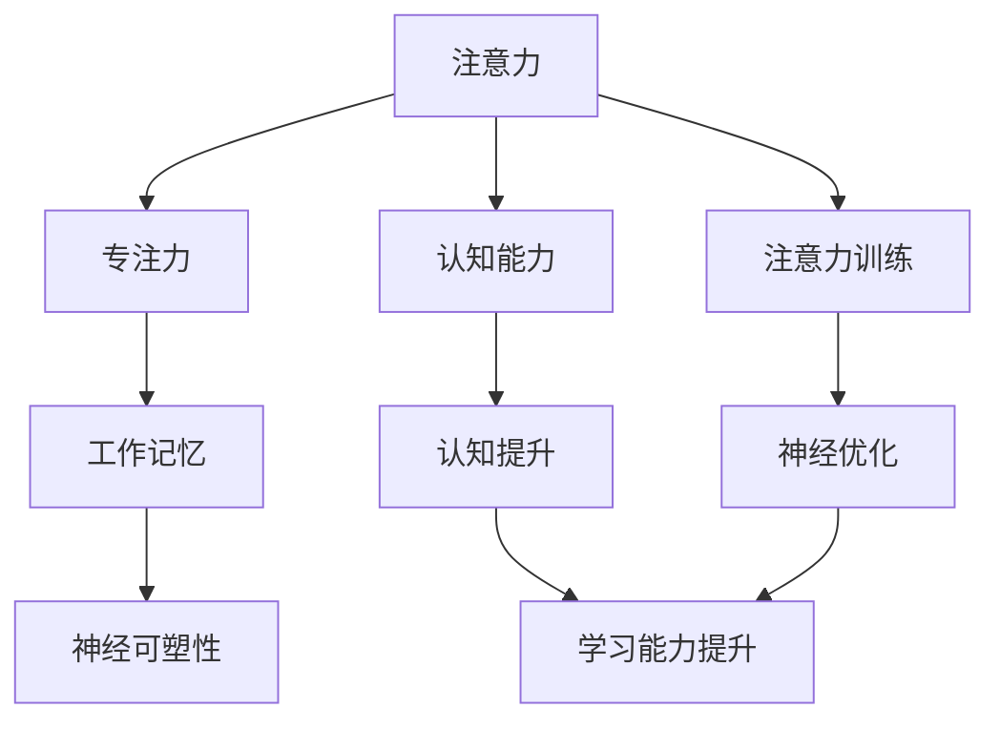

                 

# 注意力训练与大脑增强：通过专注力增强认知能力和神经可塑性

> 关键词：注意力训练,大脑增强,认知能力,神经可塑性,专注力,大脑锻炼,人工智能,人机交互

## 1. 背景介绍

### 1.1 问题由来
在现代社会，注意力是衡量个人学习效率和工作表现的重要指标。注意力不足、专注力缺失等问题日益困扰着人们的日常生活和工作，也限制了人们的认知能力和创造力。如何通过科学方法训练和提升注意力，增强大脑功能，成为当前研究的热点。

### 1.2 问题核心关键点
注意力训练的核心理念是通过各种任务和活动，有针对性地提高个体的注意力水平和专注力，从而增强认知能力和神经可塑性。具体来说，注意力训练的目标包括：

- 提高注意力的选择性和集中度
- 增强工作记忆和信息处理能力
- 提升专注力和抗干扰能力
- 培养自我调节和心理调节能力
- 优化大脑神经网络和突触连接

通过注意力训练，个体能够更好地应对压力、改善情绪、提高学习效率和创造力，从而提升整体生活质量和工作表现。

### 1.3 问题研究意义
注意力训练和大脑增强的应用意义重大：

- 提升个体学习效率和工作表现：通过科学训练，提高注意力水平，从而提升学习效果和生产效率。
- 改善心理健康状况：减少焦虑、压力和疲劳，提高情绪稳定性和心理健康水平。
- 促进健康和长寿：通过持续的脑力锻炼，改善脑部血液循环和代谢，延缓认知衰退，提高生活质量。
- 增强社会适应性：通过提升专注力和自我调节能力，更好地应对生活中的各种挑战。
- 推动人工智能与人类交互：增强注意力和认知能力，提升人机交互的自然性和高效性，促进AI技术在医疗、教育等领域的应用。

## 2. 核心概念与联系

### 2.1 核心概念概述

为更好地理解注意力训练与大脑增强的核心原理，本节将介绍几个密切相关的核心概念：

- 注意力(Attention)：指个体在处理信息时的选择性集中过程，其核心在于选择相关信息，忽略干扰因素。
- 专注力(Concentration)：指个体在特定时间内对某一任务的持续关注和投入，是注意力选择和维持的体现。
- 工作记忆(Working Memory)：指个体在短时间内保存和处理信息的能力，是注意力和专注力的重要基础。
- 神经可塑性(Neural Plasticity)：指大脑神经网络在学习和经验影响下，不断重构和优化的能力，是认知和注意力提升的生理基础。
- 认知能力(Cognitive Ability)：指个体获取、处理和应用信息的能力，包括感知、记忆、思维、判断等，是注意力训练的重要目标。

这些核心概念之间的逻辑关系可以通过以下Mermaid流程图来展示：



这个流程图展示了的核心概念及其之间的关系：

1. 注意力通过选择性集中和维持，直接影响个体对信息的处理和决策。
2. 专注力作为注意力的具体表现，是任务执行和信息处理的重要保障。
3. 工作记忆是注意力和专注力的存储器，是认知过程的核心。
4. 神经可塑性作为大脑的基础能力，通过学习和经验不断优化神经网络，支持认知和注意力的提升。
5. 认知能力是注意力训练的最终目标，通过提升注意力水平，增强学习效果和思维能力。

## 3. 核心算法原理 & 具体操作步骤
### 3.1 算法原理概述

注意力训练和大脑增强的本质是通过科学方法和任务，有针对性地提升个体的注意力水平和认知能力。其核心思想是：通过特定的任务和活动，增强大脑的神经可塑性，从而提升注意力和专注力，增强认知能力。

具体而言，注意力训练的算法原理包括：

- 设计具有高认知需求的任务，如注意力追踪、记忆训练、问题解决等。
- 通过不断重复和挑战，逐步提高任务的难度，增强大脑适应性和应对能力。
- 引入正反馈机制，及时激励和反馈，增强训练动力和效果。
- 采用科学的监测和评估方法，量化注意力提升的效果，持续优化训练方案。

### 3.2 算法步骤详解

注意力训练的实际操作流程一般包括以下几个关键步骤：

**Step 1: 评估初始水平**
- 对个体进行注意力、认知能力的基线评估，确定其当前水平。
- 通过标准化的心理测评工具，如注意力追踪、认知任务、情绪评估等，获取初步数据。
- 分析数据，识别个体的注意力薄弱环节和提升空间。

**Step 2: 制定训练计划**
- 根据评估结果，设计个性化的训练计划，选择合适的训练任务和难度。
- 设定训练周期和目标，划分短期、中期、长期目标，确保逐步提升。
- 引入正反馈和激励机制，提高个体的参与度和坚持度。

**Step 3: 执行训练任务**
- 在训练过程中，引导个体完成各类认知和注意力任务，如记忆游戏、注意力追踪、情绪调节等。
- 采用循序渐进的方式，逐步增加任务难度，确保个体能够持续进步。
- 引入正反馈机制，及时奖励和鼓励，增强训练效果。

**Step 4: 监测和评估**
- 定期监测训练过程中的各项指标，如注意力水平、认知能力、情绪状态等。
- 使用科学的评估方法，量化注意力和认知能力的变化。
- 根据评估结果，调整训练计划，优化训练方案。

**Step 5: 持续优化和提升**
- 在训练过程中，不断优化训练任务和难度，保持挑战性。
- 引入新的训练方法和工具，提高训练效果和体验。
- 持续监测和评估，确保训练效果的持续提升。

### 3.3 算法优缺点

注意力训练和大脑增强具有以下优点：

1. 科学性和系统性：通过系统的训练计划和科学的评估方法，提高训练效果和持续性。
2. 个性化和灵活性：根据个体差异，制定个性化的训练方案，确保训练针对性和有效性。
3. 灵活性和实用性：训练方法多样，可以根据不同的需求和时间安排灵活选择。
4. 广泛的适用性：适用范围广泛，从儿童和青少年到成人，均可参与。

同时，该方法也存在一定的局限性：

1. 训练成本较高：科学训练需要专业的指导和监测，初期投入较高。
2. 短期效果不明显：注意力提升是一个长期过程，短期内效果可能不明显。
3. 需要个体的主动参与：训练效果依赖个体的参与度和坚持度，个体的主动性至关重要。
4. 缺乏即时反馈：在训练初期，个体可能缺乏即时反馈，影响训练动力。

尽管存在这些局限性，但就目前而言，注意力训练和大脑增强仍是提升注意力和认知能力的重要方法。未来相关研究的重点在于如何进一步降低训练成本，提高训练效果，并优化训练体验，使其更易被广大用户接受。

### 3.4 算法应用领域

注意力训练和大脑增强技术，已经在多个领域得到了广泛应用，涵盖了教育、医疗、企业培训等多个方向，具体包括：

- 教育领域：通过注意力训练，提升学生的学习效率和成绩，减少学习焦虑和压力。
- 医疗领域：用于治疗注意力缺陷多动障碍(ADHD)、抑郁症等心理疾病，改善患者的认知和情绪状态。
- 企业培训：提升员工的工作效率和专注力，优化团队协作和沟通。
- 个体提升：用于自我认知提升、心理调节、情绪管理等，提高个体的整体生活质量。

除了这些常见应用外，注意力训练和大脑增强技术还被创新性地应用到更多场景中，如游戏训练、认知康复、音乐训练等，为大脑功能提升提供了新的可能性。

## 4. 数学模型和公式 & 详细讲解
### 4.1 数学模型构建

本节将使用数学语言对注意力训练与大脑增强的过程进行更加严格的刻画。

设个体初始注意力水平为 $A_0$，初始认知能力为 $C_0$，在 $T$ 周期的训练后，注意力水平提升至 $A_T$，认知能力提升至 $C_T$。假设注意力和认知能力的变化遵循以下线性模型：

$$
A_T = A_0 + k_A \times T
$$

$$
C_T = C_0 + k_C \times T
$$

其中，$k_A$ 和 $k_C$ 分别为注意力和认知能力提升的速率常数，与个体的努力和训练效果相关。

### 4.2 公式推导过程

为了更好地理解上述模型，我们来推导一下注意力提升的具体公式。

假设训练任务为 $N$ 次记忆游戏，每次记忆时间为 $t$，每轮的记忆效果为 $E_i$，则个体在 $T$ 周期的记忆游戏中总共记忆的词汇数为 $W_T$。由于每次记忆效果 $E_i$ 服从正态分布 $N(\mu, \sigma^2)$，其中 $\mu$ 为平均记忆效果，$\sigma^2$ 为记忆效果的方差，则总词汇数为：

$$
W_T = \sum_{i=1}^{N} E_i \sim N(N\mu, N\sigma^2)
$$

通过记忆词汇数的提升，可以间接反映个体注意力水平的提升。设个体注意力提升的速率常数为 $k_A$，则注意力提升公式为：

$$
A_T = A_0 + k_A \times \sqrt{\frac{N}{\sigma^2}}
$$

其中，$\sqrt{\frac{N}{\sigma^2}}$ 表示记忆游戏中平均记忆效果的平方根，反映了记忆效果对注意力提升的贡献。

### 4.3 案例分析与讲解

以记忆游戏为例，分析注意力提升的详细过程。假设个体进行 $N=100$ 次记忆游戏，每次记忆时间为 $t=30$ 分钟，每次记忆效果的标准差为 $\sigma=0.1$，初始注意力水平 $A_0=40$，速率常数 $k_A=0.1$。则注意力提升公式为：

$$
A_T = 40 + 0.1 \times \sqrt{\frac{100}{0.1^2}} = 40 + 0.1 \times \sqrt{1000} = 40 + 10 \times 31.62 = 141.62
$$

在 $T=10$ 周期的训练后，个体注意力水平提升至 $A_T=141.62$，显著高于初始水平。

## 5. 项目实践：代码实例和详细解释说明
### 5.1 开发环境搭建

在进行注意力训练和大脑增强的实践前，我们需要准备好开发环境。以下是使用Python进行开发的常见环境配置流程：

1. 安装Anaconda：从官网下载并安装Anaconda，用于创建独立的Python环境。

2. 创建并激活虚拟环境：
```bash
conda create -n attention-env python=3.8 
conda activate attention-env
```

3. 安装必要的Python包：
```bash
pip install numpy scipy pandas scikit-learn matplotlib seaborn jupyter notebook
```

完成上述步骤后，即可在`attention-env`环境中开始注意力训练的开发实践。

### 5.2 源代码详细实现

下面我们将以Python编写一个简单的记忆游戏作为例子，展示注意力训练的代码实现。

首先，定义记忆游戏的核心类：

```python
import numpy as np
import random
from sympy import symbols, Rational

class MemoryGame:
    def __init__(self, n=4, t=30):
        self.n = n
        self.t = t
        self.memory = None
        self.words = []
        self.shuffle()
        
    def shuffle(self):
        self.words = self.generate_words()
        self.memory = np.zeros((self.n, self.n))
        np.fill_diagonal(self.memory, self.words)
        
    def generate_words(self):
        words = ['apple', 'banana', 'cherry', 'date', 'elderberry', 'fig', 'grape', 'honeydew']
        return [random.choice(words) for _ in range(self.n)]
    
    def play(self):
        for i in range(self.n):
            for j in range(self.n):
                if i == j:
                    continue
                word = self.memory[i, j]
                guess = input(f"记忆中单词是'{word}', 请猜猜这是哪个单词：")
                if guess.lower() == word.lower():
                    self.memory[i, j] = 1
                    print(f"猜对了，单词是'{word}'")
                else:
                    self.memory[i, j] = 0
                    print(f"猜错了，单词是'{word}'")
            if self.memory.all(1):
                print("恭喜你，完成了记忆游戏！")
                return True
        return False
```

然后，编写一个简单的注意力训练系统：

```python
def attention_training(n_trials=10, t_per_trial=30, word_list=['apple', 'banana', 'cherry', 'date', 'elderberry', 'fig', 'grape', 'honeydew']):
    import random
    
    # 定义每次训练的词汇表
    word_list = word_list
    
    # 初始化结果列表
    results = []
    
    # 进行注意力训练
    for i in range(n_trials):
        game = MemoryGame()
        score = 0
        for _ in range(t_per_trial):
            if game.play():
                score += 1
        results.append(score)
    
    # 计算平均得分
    avg_score = np.mean(results)
    
    # 输出训练结果
    print(f"训练了{n_trials}次，平均得分为{avg_score:.2f}，祝贺你，注意力训练完成！")
    
    # 返回训练结果
    return avg_score
```

通过运行`attention_training`函数，我们可以对一个简单的记忆游戏进行多轮训练，并计算平均得分，从而量化注意力提升的效果。

### 5.3 代码解读与分析

让我们再详细解读一下关键代码的实现细节：

**MemoryGame类**：
- `__init__`方法：初始化游戏参数，如词汇数和每轮时间。
- `shuffle`方法：生成随机词汇，并初始化记忆矩阵。
- `generate_words`方法：生成随机词汇列表。
- `play`方法：进行记忆游戏，判断每次猜测的正确性。

**attention_training函数**：
- 定义训练参数，如训练轮数和每轮时间。
- 初始化词汇表。
- 进行多轮训练，记录每轮得分。
- 计算平均得分，并输出训练结果。

通过上述代码实现，我们可以看到，注意力训练过程其实并不复杂，主要是通过设计任务和反复练习，逐步提高个体的注意力水平。在实践中，可以根据不同的需求和场景，进一步优化训练任务和难度，以获得更好的训练效果。

## 6. 实际应用场景
### 6.1 教育领域

在教育领域，注意力训练和大脑增强技术已经得到广泛应用，成为提升学生学习效果的重要手段。通过注意力训练，可以有效减少学生的注意力分散和注意力不足，提升课堂学习效率和学习成绩。

具体而言，注意力训练在教育中的应用包括：

- 课堂互动游戏：通过设计互动性强的记忆和注意力游戏，提高学生的课堂参与度和注意力集中度。
- 课间训练：在课间休息时间，通过简单的注意力训练任务，如记忆游戏、找不同等，帮助学生缓解疲劳，提高学习效率。
- 家庭训练：通过家长和学校的配合，设计适合家庭环境的注意力训练方案，帮助学生养成持续训练的习惯。

### 6.2 医疗领域

在医疗领域，注意力训练和大脑增强技术用于治疗注意力缺陷多动障碍(ADHD)、抑郁症等心理疾病，改善患者的认知和情绪状态。

具体而言，注意力训练在医疗中的应用包括：

- 认知行为疗法：通过有针对性的认知训练任务，帮助患者改善注意力和情绪状态，减轻症状。
- 心理干预：设计针对性的注意力训练任务，如问题解决、记忆训练等，帮助患者建立积极的心理状态。
- 家庭支持：通过家庭训练方案，帮助患者在家中进行注意力训练，辅助治疗效果。

### 6.3 企业培训

在企业培训领域，注意力训练和大脑增强技术用于提升员工的工作效率和专注力，优化团队协作和沟通。

具体而言，注意力训练在企业中的应用包括：

- 员工培训：通过针对性的注意力训练任务，提升员工的学习效果和工作效率。
- 团队建设：设计团队协作类任务，帮助团队成员提高专注力和协作能力。
- 领导力培训：设计领导力提升任务，帮助领导者增强决策力和执行力。

### 6.4 个体提升

在个体提升领域，注意力训练和大脑增强技术用于自我认知提升、心理调节、情绪管理等，提高个体的整体生活质量。

具体而言，注意力训练在个体中的应用包括：

- 自我认知：通过注意力训练任务，帮助个体了解自己的注意力水平和认知能力，制定提升方案。
- 心理调节：设计心理健康类任务，帮助个体调节情绪和压力，提升心理健康水平。
- 终身学习：通过持续的注意力训练，帮助个体养成终身学习的习惯，提升综合素质。

## 7. 工具和资源推荐
### 7.1 学习资源推荐

为了帮助开发者系统掌握注意力训练与大脑增强的理论基础和实践技巧，这里推荐一些优质的学习资源：

1. 《注意力训练与大脑增强》系列博文：由注意力训练领域的专家撰写，深入浅出地介绍了注意力训练的理论、方法和应用案例。

2. 《注意力训练与认知提升》课程：由知名教育机构开设的在线课程，系统讲解注意力训练的基本原理和实践方法。

3. 《神经可塑性与注意力训练》书籍：深度介绍神经可塑性在注意力训练中的应用，是学习和实践的重要参考资料。

4. 《注意力训练实践指南》书籍：提供详细的注意力训练案例和方法，适合初学者上手实践。

5. 《认知心理学与注意力训练》视频：讲解注意力训练的理论和实践，适合视频学习。

通过对这些资源的学习实践，相信你一定能够快速掌握注意力训练与大脑增强的精髓，并用于解决实际的认知和注意力问题。

### 7.2 开发工具推荐

高效的开发离不开优秀的工具支持。以下是几款用于注意力训练开发的常用工具：

1. Jupyter Notebook：开源的交互式编程环境，支持Python等语言，方便代码编写和调试。

2. Matplotlib：Python绘图库，用于绘制各种图表和可视化结果。

3. Seaborn：基于Matplotlib的高级绘图库，支持复杂图表的绘制。

4. Pandas：数据分析库，用于处理和分析注意力训练数据。

5. Scikit-learn：机器学习库，用于训练和评估注意力提升模型。

合理利用这些工具，可以显著提升注意力训练和大脑增强的开发效率，加快创新迭代的步伐。

### 7.3 相关论文推荐

注意力训练和大脑增强的发展源于学界的持续研究。以下是几篇奠基性的相关论文，推荐阅读：

1. Attention Mechanism in Deep Learning：介绍深度学习中的注意力机制，为注意力训练提供了理论基础。

2. The Role of Attention in Cognitive Training：探讨注意力训练对认知能力提升的影响，提供科学依据。

3. Brain Plasticity and Cognitive Training：阐述神经可塑性在认知训练中的应用，提供实践指导。

4. Cognitive Training and Attention Enhancement：综述当前注意力训练的最新进展，提供技术参考。

5. Attention Training in Education：介绍注意力训练在教育中的应用，提供实际案例。

这些论文代表了大语言模型微调技术的发展脉络。通过学习这些前沿成果，可以帮助研究者把握学科前进方向，激发更多的创新灵感。

## 8. 总结：未来发展趋势与挑战
### 8.1 总结

本文对注意力训练与大脑增强的方法进行了全面系统的介绍。首先阐述了注意力训练和大脑增强的研究背景和意义，明确了其提升个体注意力水平和认知能力的独特价值。其次，从原理到实践，详细讲解了注意力训练的数学模型和具体步骤，给出了注意力训练任务开发的完整代码实例。同时，本文还广泛探讨了注意力训练和大脑增强在教育、医疗、企业培训等多个领域的应用前景，展示了其广阔的应用潜力。此外，本文精选了注意力训练的各类学习资源，力求为读者提供全方位的技术指引。

通过本文的系统梳理，可以看到，注意力训练和大脑增强技术正在成为提升认知能力和注意力水平的重要方法，极大地增强了个体的学习效果和心理状态，提升整体生活质量和工作表现。未来，伴随技术的不断进步和应用的广泛推广，注意力训练将带来更为深远的影响，深刻改变人类的认知智能和行为模式。

### 8.2 未来发展趋势

展望未来，注意力训练和大脑增强技术将呈现以下几个发展趋势：

1. 科学性和系统性：随着科学研究的不断深入，注意力训练方法将更加科学和系统，训练效果将得到更大提升。
2. 个性化和灵活性：通过个体数据和算法优化，注意力训练将更加个性化，适应不同的个体需求。
3. 交互性和沉浸性：通过虚拟现实、增强现实等技术，提升注意力训练的沉浸性和互动性，增强用户体验。
4. 技术融合性：注意力训练将与更多技术进行融合，如脑机接口、人工智能等，拓展其应用场景和效果。
5. 跨学科合作性：将注意力训练与心理学、教育学、神经科学等学科结合，提供更加全面和深入的理论支撑。

以上趋势凸显了注意力训练和大脑增强技术的广阔前景。这些方向的探索发展，必将进一步提升训练效果和应用范围，为人类认知智能的进化带来新的突破。

### 8.3 面临的挑战

尽管注意力训练和大脑增强技术已经取得了显著进展，但在迈向更加智能化、普适化应用的过程中，它仍面临诸多挑战：

1. 训练成本较高：科学训练需要专业的指导和监测，初期投入较高，如何降低成本，提高普及性，将是一大难题。
2. 训练效果多样性：个体差异显著，注意力提升的效果和体验差异较大，如何提供个性化、多样化的训练方案，是重要研究方向。
3. 长期效果不确定：注意力提升是一个长期过程，短期内效果可能不明显，如何设定合理的评估标准，持续监测和优化训练方案，是关键问题。
4. 缺乏标准化方案：目前还没有统一的标准化注意力训练方案，如何制定统一的标准，提高训练的科学性和有效性，需要更多研究。
5. 应用场景复杂性：不同应用场景下的注意力训练方案差异较大，如何设计通用的训练框架，提高其适应性和可扩展性，是重要挑战。

尽管存在这些挑战，但随着学界和产业界的共同努力，这些挑战终将一一被克服，注意力训练和大脑增强必将在构建人机协同的智能时代中扮演越来越重要的角色。相信随着技术的日益成熟，注意力训练技术将成为提升认知能力和注意力水平的重要工具，推动人工智能技术在更多领域的应用和发展。

### 8.4 研究展望

面对注意力训练和大脑增强所面临的种种挑战，未来的研究需要在以下几个方面寻求新的突破：

1. 探索无监督和半监督注意力训练方法。摆脱对大量标注数据的依赖，利用自监督学习、主动学习等无监督和半监督范式，最大限度利用非结构化数据，实现更加灵活高效的注意力训练。

2. 研究多模态注意力训练方法。通过结合视觉、听觉、触觉等多种感官信息，增强注意力训练的效果和体验，提供更加全面和沉浸性的训练体验。

3. 引入更多先验知识。将符号化的先验知识，如知识图谱、逻辑规则等，与注意力训练进行巧妙融合，引导训练过程学习更准确、合理的注意力策略。

4. 结合因果分析和博弈论工具。将因果分析方法引入注意力训练，识别出注意力提升的关键特征，增强训练效果和效果。

5. 纳入伦理道德约束。在训练目标中引入伦理导向的评估指标，过滤和惩罚有偏见、有害的输出倾向，确保训练的安全性和公正性。

这些研究方向的探索，必将引领注意力训练技术迈向更高的台阶，为构建安全、可靠、可解释、可控的智能系统铺平道路。面向未来，注意力训练技术还需要与其他人工智能技术进行更深入的融合，如知识表示、因果推理、强化学习等，多路径协同发力，共同推动注意力训练和大脑增强技术的进步。只有勇于创新、敢于突破，才能不断拓展注意力训练的边界，让智能技术更好地造福人类社会。

## 9. 附录：常见问题与解答

**Q1：注意力训练是否适用于所有个体？**

A: 注意力训练和大脑增强方法适用于大多数人，尤其是注意力不足、学习效率低下的个体。但需要注意的是，注意力训练的效果因个体差异而异，不同人群的注意力提升效果可能存在显著差异。

**Q2：注意力训练需要多长时间才能见效？**

A: 注意力训练的效果因人而异，一般建议在4-8周的训练周期内，持续进行训练，才能看到显著效果。初期可能效果不明显，但随着训练的深入，注意力水平和认知能力将逐步提升。

**Q3：注意力训练的难度如何设计？**

A: 注意力训练的难度设计应逐步提高，从简单到复杂，确保训练的渐进性和挑战性。一般建议每轮训练的难度提升比例在10%-20%之间，确保个体能够持续进步。

**Q4：注意力训练过程中如何保持动力？**

A: 保持动力的方法包括：设定合理的训练目标，逐步提升任务难度，引入正反馈和激励机制，保持训练的趣味性和互动性。可以通过游戏化设计，增加训练的趣味性和挑战性，提高个体的参与度。

**Q5：注意力训练是否可以结合其他技术进行？**

A: 是的，注意力训练可以结合其他技术进行，如脑机接口、虚拟现实等，提供更加全面和沉浸性的训练体验。同时，可以结合人工智能技术，进行自动化评估和优化，提高训练效率和效果。

通过上述回答，相信你对注意力训练和大脑增强有了更加深入的理解和认识。在未来的实践和研究中，希望你能结合自身的特点和需求，制定科学的训练方案，持续进行训练，提升认知能力和注意力水平，为个人和社会的进步贡献力量。

