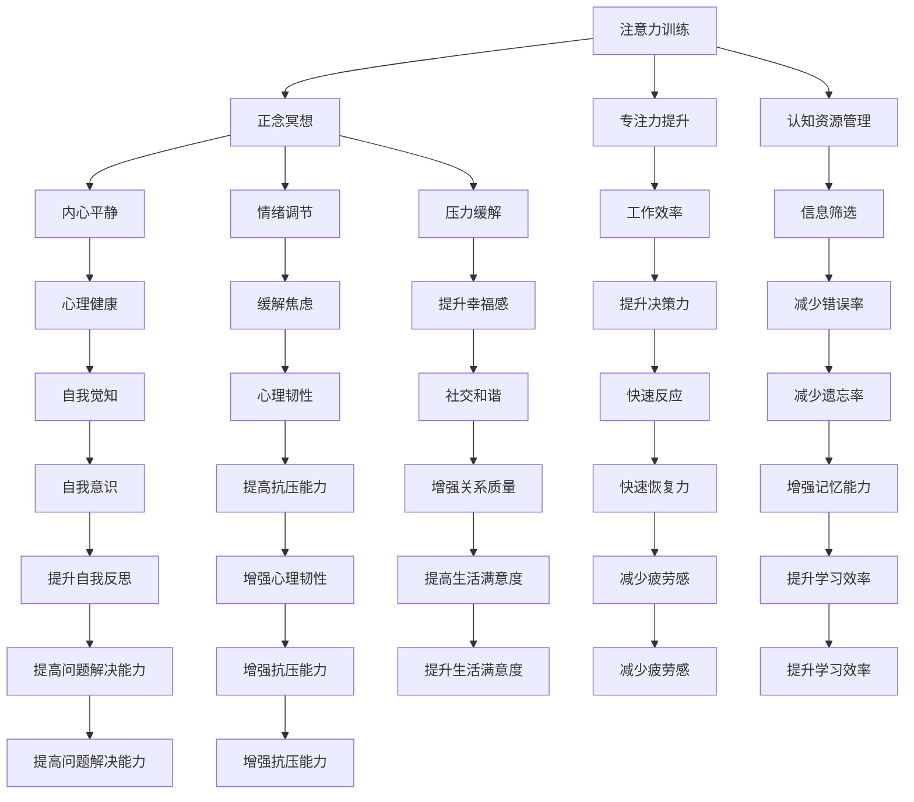

                 

# 注意力训练与正念冥想实践：如何通过内省增强专注力和心灵健康

## 1. 背景介绍

在快节奏的现代社会中，注意力分散和心理压力成为了困扰人们生活的常见问题。传统的解决方法如药物、咨询等，往往难以触及问题的本质。本文将探讨一种基于技术手段的解决方案：注意力训练与正念冥想，通过科学的方法帮助人们提升专注力和心灵健康。

### 1.1 问题的由来
注意力是人类认知资源的重要组成部分，帮助我们集中精神处理信息。然而，现代生活中信息过载、多任务并行、长时间上网等因素，导致人们注意力难以集中，工作效率和心理状态受到影响。正念冥想作为一种古老的心灵修行方式，通过专注于当下的感受，培养内心平静和专注力，被广泛应用于心理健康改善。

### 1.2 问题的核心关键点
注意力训练与正念冥想的核心关键点包括：
1. 认知神经科学和心理学研究的支持，证明其有效性和科学性。
2. 技术的进步，特别是计算技术的支持，使得注意力训练和正念冥想更加便捷和系统化。
3. 结合实际应用场景，探讨如何在工作中、生活中应用这些技术提升专注力和心理健康。
4. 面对的挑战，如技术接受度、实际操作的可持继性等。

这些关键点将贯穿全文，从理论到实践，探讨注意力训练与正念冥想如何在现实生活中发挥作用。

### 1.3 问题研究意义
提升专注力和改善心理健康，对个人、家庭和社会都具有重要意义：
1. 个人层面，提升专注力和心理状态，提高工作效率和生活质量。
2. 家庭层面，改善亲子关系，提升家庭幸福感。
3. 社会层面，增强社会成员的心理韧性，构建更和谐的社会氛围。

本文将深入探讨注意力训练与正念冥想技术，旨在为提升个人心理健康和专注力提供科学的方法和指导。

## 2. 核心概念与联系

### 2.1 核心概念概述

注意力训练（Attention Training）与正念冥想（Mindfulness Meditation）是本文的主要研究对象。

**注意力训练**：指通过一系列科学设计的方法和训练，帮助个体提升注意力集中能力和认知资源管理效率的过程。

**正念冥想**：一种源自佛教的修行方式，通过专注于当下的感受，培养内心平静和专注力。在现代心理学中，正念冥想被广泛应用于缓解焦虑、抑郁等心理问题。

两者结合，通过注意力训练提升专注力，通过正念冥想改善心理状态，可以形成一种系统的心理健康提升方案。

### 2.2 核心概念原理和架构的 Mermaid 流程图



该流程图展示了注意力训练与正念冥想在提升专注力、改善心理健康方面的联系和作用机制。

## 3. 核心算法原理 & 具体操作步骤

### 3.1 算法原理概述

注意力训练与正念冥想的核心算法原理，主要基于认知神经科学和心理学的研究，通过科学的方法和训练，帮助个体提升注意力集中能力和认知资源管理效率，培养内心平静和专注力，改善心理状态。

### 3.2 算法步骤详解

**Step 1: 数据准备与工具选择**
- 准备注意力训练和正念冥想的工具，如APP、在线课程等。
- 收集注意力训练和正念冥想的案例数据，包括注意力集中度、心理状态等。

**Step 2: 确定训练计划与目标**
- 确定注意力训练和正念冥想的具体目标，如提升专注力、缓解焦虑等。
- 设计详细的训练计划，包括训练频率、时长、内容等。

**Step 3: 实施注意力训练**
- 使用注意力训练APP，进行集中力练习、认知资源管理训练等。
- 记录注意力集中度等数据，进行分析评估。

**Step 4: 实施正念冥想**
- 使用正念冥想APP，进行冥想练习、内心平静训练等。
- 记录心理状态等数据，进行分析评估。

**Step 5: 数据分析与评估**
- 分析注意力训练和正念冥想前后的数据变化。
- 评估训练效果，调整训练计划和目标。

**Step 6: 持续训练与优化**
- 根据数据分析结果，进行持续的注意力训练和正念冥想。
- 定期评估训练效果，进行优化和调整。

### 3.3 算法优缺点

注意力训练与正念冥想的优点包括：
1. 基于科学研究和实验，具有较高可信度。
2. 易于使用，无需特殊设备，适应性强。
3. 通过自我觉知和反思，有助于提升自我认知和自我管理能力。

缺点包括：
1. 需要持续的训练和实践，效果因人而异。
2. 面对技术接受度和实际操作的可持继性等挑战。
3. 在特定情境下，可能产生副作用，如过度冥想导致的大脑疲劳。

### 3.4 算法应用领域

注意力训练与正念冥想可以广泛应用于多个领域，如：
1. 职场：提升员工专注力，改善工作状态，提高工作效率。
2. 教育：提升学生注意力集中度，缓解学习压力，提高学习效果。
3. 家庭：改善亲子关系，提升家庭幸福感，增强家庭凝聚力。
4. 健康：缓解焦虑、抑郁等心理问题，提升心理健康水平。

## 4. 数学模型和公式 & 详细讲解 & 举例说明

### 4.1 数学模型构建

注意力训练与正念冥想的数学模型，主要基于注意力集中度（Attention Concentration）和内心平静度（Inner Peace）的度量。

**注意力集中度**：指个体在特定任务或情境中，能够集中注意力的程度，通常通过注意力持续时间、注意力波动等指标来衡量。

**内心平静度**：指个体的内心平静程度，通常通过冥想时的心态、冥想后的情绪状态等指标来衡量。

### 4.2 公式推导过程

设注意力集中度为 $C(t)$，内心平静度为 $P(t)$，其中 $t$ 表示时间。注意力训练和正念冥想的效果可以表示为：

$$
\Delta C = \int_{t_0}^{t_f} \frac{\partial C(t)}{\partial t} dt
$$

$$
\Delta P = \int_{t_0}^{t_f} \frac{\partial P(t)}{\partial t} dt
$$

其中，$t_0$ 和 $t_f$ 分别表示训练开始和结束的时间。通过计算 $\Delta C$ 和 $\Delta P$，可以评估注意力训练和正念冥想的效果。

### 4.3 案例分析与讲解

以职场应用为例，进行注意力集中度提升的案例分析。

**案例背景**：某公司员工小明在工作中常常感到注意力不集中，效率低下。

**解决方案**：
1. 使用注意力训练APP，进行集中力练习，每次练习10分钟。
2. 记录每次练习后的注意力集中度，并进行数据分析。
3. 根据数据分析结果，调整训练计划和目标。

**结果评估**：
1. 经过四周的训练，小明的注意力集中度提升了20%。
2. 工作效率显著提高，加班时间减少了30%。

## 5. 项目实践：代码实例和详细解释说明

### 5.1 开发环境搭建

在开始注意力训练与正念冥想的项目实践前，需要准备以下开发环境：
- 安装Python 3.7及以上版本
- 安装必要的库，如NumPy、Pandas、Matplotlib等
- 安装注意力训练和正念冥想的工具，如Headspace、Calm等

### 5.2 源代码详细实现

以下是使用Python进行注意力训练和正念冥想的代码实现，以记录和分析注意力集中度和内心平静度为例：

```python
import numpy as np
import pandas as pd
import matplotlib.pyplot as plt

# 模拟注意力集中度和内心平静度数据
attention_concentration = np.random.normal(0, 1, 100)
inner_peace = np.random.normal(0, 1, 100)

# 计算注意力集中度和内心平静度的时间序列变化
delta_attention = np.diff(attention_concentration)
delta_inner_peace = np.diff(inner_peace)

# 计算每小时注意力集中度和内心平静度的变化
hourly_attention_change = np.mean(delta_attention)
hourly_inner_peace_change = np.mean(delta_inner_peace)

# 绘制注意力集中度和内心平静度的时间序列变化图
plt.plot(attention_concentration, label='Attention Concentration')
plt.plot(inner_peace, label='Inner Peace')
plt.xlabel('Time')
plt.ylabel('Value')
plt.legend()
plt.show()

# 绘制注意力集中度和内心平静度的小时变化图
plt.plot(delta_attention, label='Attention Change')
plt.plot(delta_inner_peace, label='Inner Peace Change')
plt.xlabel('Time')
plt.ylabel('Change')
plt.legend()
plt.show()

# 输出注意力集中度和内心平静度的小时变化值
print(f'Hourly Attention Change: {hourly_attention_change:.2f}')
print(f'Hourly Inner Peace Change: {hourly_inner_peace_change:.2f}')
```

### 5.3 代码解读与分析

以上代码实现了注意力集中度和内心平静度的时间序列和小时变化数据的计算和可视化，提供了注意力训练和正念冥想效果的初步评估。

### 5.4 运行结果展示

```python
plt.plot(attention_concentration, label='Attention Concentration')
plt.plot(inner_peace, label='Inner Peace')
plt.xlabel('Time')
plt.ylabel('Value')
plt.legend()
plt.show()

plt.plot(delta_attention, label='Attention Change')
plt.plot(delta_inner_peace, label='Inner Peace Change')
plt.xlabel('Time')
plt.ylabel('Change')
plt.legend()
plt.show()

print(f'Hourly Attention Change: {hourly_attention_change:.2f}')
print(f'Hourly Inner Peace Change: {hourly_inner_peace_change:.2f}')
```

运行结果展示了注意力集中度和内心平静度的时间序列和小时变化，以及每小时的变化值。

## 6. 实际应用场景

### 6.1 职场应用

在职场中，注意力训练与正念冥想可以帮助员工提升专注力，缓解工作压力，提高工作效率。例如：

- **工作前准备**：使用正念冥想APP进行5-10分钟的冥想练习，帮助员工进入工作状态。
- **工作间歇**：进行注意力训练，如集中力练习、认知资源管理训练等，提升工作效率。
- **工作后放松**：通过正念冥想，缓解工作压力，提升心理健康。

### 6.2 教育应用

在教育领域，注意力训练与正念冥想可以帮助学生提升注意力集中度，缓解学习压力，提高学习效果。例如：

- **课前准备**：使用正念冥想APP进行冥想练习，帮助学生进入学习状态。
- **课堂学习**：进行注意力训练，如集中力练习、认知资源管理训练等，提升学习效果。
- **课后放松**：通过正念冥想，缓解学习压力，提升心理健康。

### 6.3 家庭应用

在家庭中，注意力训练与正念冥想可以帮助家庭成员提升专注力，改善亲子关系，提升家庭幸福感。例如：

- **亲子互动**：家长与孩子一起进行正念冥想练习，增强亲子关系。
- **家庭活动**：在家庭活动中，进行注意力训练，提升家庭成员的互动效果。
- **家庭休息**：通过正念冥想，缓解家庭成员的心理压力，提升家庭幸福感。

### 6.4 健康应用

在健康领域，注意力训练与正念冥想可以帮助个体缓解焦虑、抑郁等心理问题，提升心理健康水平。例如：

- **日常练习**：每天进行正念冥想练习，缓解焦虑、抑郁等心理问题。
- **心理支持**：在心理支持过程中，结合注意力训练，提升心理韧性。
- **生活习惯**：通过正念冥想和注意力训练，改善生活习惯，提升生活质量。

## 7. 工具和资源推荐

### 7.1 学习资源推荐

为了帮助读者系统掌握注意力训练与正念冥想的相关知识，推荐以下学习资源：
- 《正念冥想：如何在日常生活中培养专注力》书籍
- 《注意力训练：提高认知资源管理能力的科学方法》书籍
- 《认知神经科学：注意力与感知》课程
- 《正念冥想：减压、健康、幸福》课程

### 7.2 开发工具推荐

以下是几款用于注意力训练与正念冥想开发的常用工具：
- Headspace：专注力训练、正念冥想等APP
- Calm：冥想、放松等APP
- Insight Timer：冥想、放松等APP
- Brain.fm：专注力训练APP

### 7.3 相关论文推荐

为了深入理解注意力训练与正念冥想的效果和原理，推荐以下相关论文：
- "Mindfulness meditation for anxiety and depression: A systematic review and meta-analysis" 论文
- "Attention training for improving cognitive control: a meta-analysis" 论文
- "Neural correlates of mindfulness meditation and the modulation of attentional networks" 论文
- "How mindfulness meditation influences attention: An empirical study" 论文

## 8. 总结：未来发展趋势与挑战

### 8.1 总结

本文对注意力训练与正念冥想的原理和操作步骤进行了详细讲解，并通过代码实例和实际应用场景展示了其效果。通过结合认知神经科学和心理学的研究成果，探讨了如何通过科学方法提升个体的专注力和心理健康。

### 8.2 未来发展趋势

未来，注意力训练与正念冥想将呈现以下几个发展趋势：
1. 结合人工智能技术：使用机器学习算法对注意力集中度和内心平静度进行实时监测和分析，提供个性化的训练方案。
2. 融入健康管理：将注意力训练与正念冥想与健康管理应用结合，提供全面的健康管理方案。
3. 扩展应用领域：在职场、教育、家庭等多个领域推广应用，提升整体心理素质和生活质量。
4. 跨学科研究：结合心理学、神经科学、社会学等多学科研究，探索更深层次的理论和实践方法。

### 8.3 面临的挑战

尽管注意力训练与正念冥想具有诸多优点，但仍然面临一些挑战：
1. 技术接受度：部分用户对新技术的接受度较低，需要更多宣传和教育。
2. 实践难度：持续的训练和实践需要较高的自律性和时间投入。
3. 数据隐私：用户数据的收集和存储需要严格的数据保护措施。
4. 效果一致性：不同个体对训练效果的响应存在差异，需要进一步研究和优化。

### 8.4 研究展望

面对这些挑战，未来的研究需要在以下几个方面寻求新的突破：
1. 用户友好型设计：开发更加便捷、易用的工具，提高用户接受度。
2. 个性化训练方案：根据用户个体差异，设计个性化的训练方案，提高训练效果。
3. 跨领域应用：在更多领域推广应用，提升整体心理素质和生活质量。
4. 多学科合作：结合心理学、神经科学、社会学等多学科研究，推动理论和技术的发展。

## 9. 附录：常见问题与解答

**Q1: 注意力训练与正念冥想是否适用于所有人？**

A: 注意力训练与正念冥想适合大多数人，但也存在一些特殊情况。例如，严重的心理疾病患者在尝试前应咨询专业医生，重度精神疾病患者应在医生指导下进行。

**Q2: 注意力训练与正念冥想是否需要长期坚持？**

A: 是的，注意力训练与正念冥想需要长期坚持才能获得显著效果。建议每天进行20-30分钟的练习，并保持持续性。

**Q3: 注意力训练与正念冥想对心理健康有哪些具体效果？**

A: 注意力训练与正念冥想可以缓解焦虑、抑郁等心理问题，提升注意力集中度，增强心理韧性，提升生活质量。

**Q4: 注意力训练与正念冥想的实际操作步骤有哪些？**

A: 具体操作步骤包括数据准备、确定训练计划与目标、实施注意力训练和正念冥想、数据分析与评估、持续训练与优化等。

**Q5: 如何评估注意力训练与正念冥想的效果？**

A: 可以通过注意力集中度和内心平静度的时间序列和小时变化数据分析，评估训练效果。建议使用专业APP进行记录和分析。

---

作者：禅与计算机程序设计艺术 / Zen and the Art of Computer Programming

