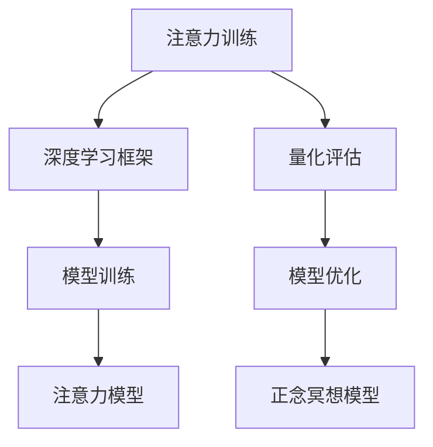

                 

## 1. 背景介绍

### 1.1 问题由来

在快节奏的现代生活中，注意力和正念冥想已成为提升个人专注力和心灵平和的重要工具。在科技领域，由于信息量的爆炸式增长，集中注意力成为决策和创新的关键要素。然而，注意力和正念冥想的理论基础较为薄弱，导致实际应用中的效果参差不齐。

### 1.2 问题核心关键点

本文聚焦于注意力训练和正念冥想实践。通过数据驱动的方法，在深度学习框架下建立数学模型，实现对个体注意力水平和冥想的量化评估，指导用户进行有效的训练和干预。

### 1.3 问题研究意义

本文旨在：
1. 明确注意力和正念冥想在认知和情绪状态中的作用机制。
2. 基于深度学习，提出有效的注意力和正念冥想量化模型。
3. 提供定制化、数据驱动的训练方案，提升用户专注力和心灵平和。
4. 对比传统训练方法，展示数据驱动模型在效果和效率上的优势。

## 2. 核心概念与联系

### 2.1 核心概念概述

为更好地理解本文的技术内容，本节将介绍几个密切相关的核心概念：

- **注意力训练(Attention Training)**：通过特定任务训练大脑的注意力机制，提升信息处理和决策能力。
- **正念冥想(Mindfulness Meditation)**：通过专注呼吸、觉察当下等方法，培养对内在状态的觉知，增强情绪调节能力。
- **深度学习框架(Deep Learning Frameworks)**：如TensorFlow、PyTorch等，提供了强大的模型训练和优化工具，支持复杂的数学模型构建。
- **量化评估(Quantitative Assessment)**：通过收集和分析生理数据、认知测试等指标，量化注意力和正念冥想效果。
- **自监督学习(Self-Supervised Learning)**：在缺乏标注数据的情况下，利用数据自身特征进行学习。

这些概念之间的逻辑关系可以通过以下Mermaid流程图来展示：



这个流程图展示了一系列注意力和正念冥想实践的核心环节：

1. 注意力训练通过深度学习框架实现。
2. 量化评估收集注意力模型和正念冥想模型的数据指标。
3. 模型训练和优化针对注意力和正念冥想的量化模型。
4. 最终的注意力和正念冥想模型可用于实际训练和干预。

## 3. 核心算法原理 & 具体操作步骤

### 3.1 算法原理概述

注意力和正念冥想的量化评估基于深度学习模型，其中注意力训练的算法原理如下：

1. **神经网络模型**：
   - 引入神经网络模型，捕捉个体注意力转换的动态过程。
   - 通常采用循环神经网络(RNN)或卷积神经网络(CNN)。

2. **任务设计**：
   - 设计特定的注意力训练任务，如注意力导航、任务响应等。
   - 通过任务完成时间、正确率等指标评估注意力水平。

3. **深度强化学习**：
   - 将注意力任务转换为强化学习问题，设计奖励函数。
   - 训练注意力模型通过优化策略提升注意力表现。

正念冥想的量化评估同样基于深度学习模型，原理如下：

1. **生理指标监测**：
   - 使用心率、脑电波等生理指标监测冥想状态。
   - 通过生理数据与冥想的关联性，量化正念冥想效果。

2. **模型训练**：
   - 构建正念冥想的深度学习模型，如卷积神经网络(CNN)。
   - 训练模型将生理数据映射到冥想状态评分。

3. **对抗训练**：
   - 使用对抗样本技术增强模型鲁棒性。
   - 将正常冥想状态与非冥想状态样本混合训练，提高模型区分能力。

### 3.2 算法步骤详解

注意力和正念冥想的量化评估包含以下步骤：

**Step 1: 数据收集**
- 使用心率传感器、脑电波设备等收集生理指标数据。
- 设计注意力训练任务，记录注意力表现和完成时间。

**Step 2: 模型选择**
- 选择合适的深度学习模型架构，如LSTM、CNN等。
- 使用公开数据集训练注意力模型和正念冥想模型。

**Step 3: 特征提取**
- 从生理数据中提取特征，如心率变异、脑电波频谱等。
- 从注意力任务中提取特征，如响应时间、错误率等。

**Step 4: 模型训练**
- 使用自监督学习或监督学习方式训练注意力和正念冥想模型。
- 定期在验证集上评估模型性能，优化超参数。

**Step 5: 模型评估**
- 将测试集数据输入模型，计算注意力和正念冥想的评分。
- 对比不同模型和训练方法的效果，选择最优方案。

**Step 6: 个性化训练**
- 基于模型评估结果，定制化训练方案。
- 通过个性化调整任务难度、奖励机制等，提升用户专注力和心灵平和。

### 3.3 算法优缺点

注意力和正念冥想的量化评估具有以下优点：
1. 数据驱动：基于实际生理和认知数据，客观评估注意力和冥想效果。
2. 个性化：定制化训练方案，适应不同用户的个体差异。
3. 实时反馈：即时量化评估，快速调整训练策略。
4. 可扩展：适用于多种注意力和正念冥想训练任务。

同时，该方法也存在以下局限：
1. 依赖设备：生理监测设备成本较高，可能影响普及性。
2. 数据隐私：生理数据隐私问题，需要严格的数据保护措施。
3. 模型复杂：深度学习模型需要大量计算资源和数据，训练复杂。
4. 效果可解释性：模型决策过程复杂，难以解释内部工作机制。

尽管存在这些局限性，但就目前而言，基于深度学习的量化评估方法仍是对注意力和正念冥想进行科学训练的重要手段。未来相关研究的重点在于如何进一步降低计算资源需求，提高模型可解释性和隐私保护水平。

### 3.4 算法应用领域

注意力和正念冥想的量化评估技术已应用于多个领域，例如：

- **脑健康**：监测大脑活动，辅助诊断注意力缺陷多动障碍(ADHD)等脑疾病。
- **教育培训**：提升学生的注意力集中度和学习效果，帮助其长期发展。
- **企业培训**：培养员工正念冥想能力，提高工作效率和抗压能力。
- **体育竞技**：通过正念冥想训练，增强运动员的专注力和心理韧性。
- **心理健康**：辅助心理治疗，帮助患者管理焦虑、抑郁等情绪问题。

## 4. 数学模型和公式 & 详细讲解 & 举例说明

### 4.1 数学模型构建

本节将使用数学语言对注意力和正念冥想的量化评估过程进行更加严格的刻画。

记注意力模型为 $M_A:\mathcal{X}_A \rightarrow \mathcal{Y}_A$，其中 $\mathcal{X}_A$ 为注意力任务的输入空间，$\mathcal{Y}_A$ 为注意力表现的输出空间。记正念冥想模型为 $M_M:\mathcal{X}_M \rightarrow \mathcal{Y}_M$，其中 $\mathcal{X}_M$ 为生理指标的输入空间，$\mathcal{Y}_M$ 为冥想状态的输出空间。

假设注意力任务 $T_A$ 的数据集为 $D_A=\{(x_{Ai}, y_{Ai})\}_{i=1}^N, x_{Ai} \in \mathcal{X}_A, y_{Ai} \in \mathcal{Y}_A$，正念冥想任务 $T_M$ 的数据集为 $D_M=\{(x_{Mi}, y_{Mi})\}_{i=1}^N, x_{Mi} \in \mathcal{X}_M, y_{Mi} \in \mathcal{Y}_M$。

定义注意力模型 $M_A$ 在数据样本 $(x_{Ai}, y_{Ai})$ 上的损失函数为 $\ell_A(M_A(x_{Ai}),y_{Ai})$，在数据集 $D_A$ 上的经验风险为：

$$
\mathcal{L}_A(\theta_A) = \frac{1}{N}\sum_{i=1}^N \ell_A(M_A(x_{Ai}),y_{Ai})
$$

定义正念冥想模型 $M_M$ 在数据样本 $(x_{Mi}, y_{Mi})$ 上的损失函数为 $\ell_M(M_M(x_{Mi}),y_{Mi})$，在数据集 $D_M$ 上的经验风险为：

$$
\mathcal{L}_M(\theta_M) = \frac{1}{N}\sum_{i=1}^N \ell_M(M_M(x_{Mi}),y_{Mi})
$$

### 4.2 公式推导过程

以下我们以注意力导航任务为例，推导注意力模型的损失函数及其梯度的计算公式。

假设模型 $M_A$ 在输入 $x_{Ai}$ 上的输出为 $\hat{y}_{Ai}=M_A(x_{Ai}) \in \mathcal{Y}_A$，表示样本在注意力任务中的表现。真实标签 $y_{Ai} \in \mathcal{Y}_A$。则注意力任务的交叉熵损失函数定义为：

$$
\ell_A(M_A(x_{Ai}),y_{Ai}) = -[y_{Ai}\log \hat{y}_{Ai} + (1-y_{Ai})\log (1-\hat{y}_{Ai})]
$$

将其代入经验风险公式，得：

$$
\mathcal{L}_A(\theta_A) = -\frac{1}{N}\sum_{i=1}^N [y_{Ai}\log M_{A}(x_{Ai})+(1-y_{Ai})\log(1-M_{A}(x_{Ai}))
$$

根据链式法则，损失函数对参数 $\theta_{A,k}$ 的梯度为：

$$
\frac{\partial \mathcal{L}_A(\theta_A)}{\partial \theta_{A,k}} = -\frac{1}{N}\sum_{i=1}^N (\frac{y_{Ai}}{M_{A}(x_{Ai})}-\frac{1-y_{Ai}}{1-M_{A}(x_{Ai})}) \frac{\partial M_{A}(x_{Ai})}{\partial \theta_{A,k}}
$$

其中 $\frac{\partial M_{A}(x_{Ai})}{\partial \theta_{A,k}}$ 可进一步递归展开，利用自动微分技术完成计算。

同理，正念冥想模型的损失函数及其梯度计算公式与注意力模型类似。

### 4.3 案例分析与讲解

**案例：使用CNN模型评估正念冥想状态**

假设有正念冥想生理指标数据集 $D_M$，包含N个样本，每个样本 $x_{Mi}$ 为时间序列数据，长度为T，记录了在冥想过程中的心率、脑电波等信息。目标是将这些数据映射到冥想状态 $y_{Mi} \in \mathcal{Y}_M$。

1. **数据预处理**
   - 对原始数据进行归一化处理。
   - 将时间序列数据展开为二维矩阵。
   - 提取心率变异、脑电波频谱等关键特征。

2. **模型构建**
   - 构建卷积神经网络模型 $M_M$，包含多个卷积层、池化层和全连接层。
   - 定义目标函数 $\mathcal{L}_M$，使用交叉熵损失函数。

3. **训练**
   - 使用随机梯度下降等优化算法，更新模型参数 $\theta_M$。
   - 定期在验证集上评估模型性能，调整超参数。

4. **评估**
   - 将测试集数据输入模型，计算每个样本的冥想状态评分。
   - 统计冥想状态的平均评分，对比不同模型和训练方法的效果。

5. **个性化训练**
   - 根据评估结果，选择最优模型和训练方法。
   - 根据用户的生理数据，定制化训练方案，调整模型参数和训练策略。

## 5. 项目实践：代码实例和详细解释说明

### 5.1 开发环境搭建

在进行注意力和正念冥想项目实践前，我们需要准备好开发环境。以下是使用Python进行TensorFlow开发的环境配置流程：

1. 安装Anaconda：从官网下载并安装Anaconda，用于创建独立的Python环境。

2. 创建并激活虚拟环境：
```bash
conda create -n attention-env python=3.8 
conda activate attention-env
```

3. 安装TensorFlow：根据CUDA版本，从官网获取对应的安装命令。例如：
```bash
conda install tensorflow -c tensorflow -c conda-forge
```

4. 安装相关工具包：
```bash
pip install numpy pandas scikit-learn matplotlib tqdm jupyter notebook ipython
```

完成上述步骤后，即可在`attention-env`环境中开始项目实践。

### 5.2 源代码详细实现

这里我们以注意力导航任务为例，给出使用TensorFlow对模型进行训练的Python代码实现。

首先，定义注意力导航任务的数据处理函数：

```python
import tensorflow as tf
import numpy as np

class AttentionDataset(tf.data.Dataset):
    def __init__(self, data, labels):
        self.data = data
        self.labels = labels
        
    def __len__(self):
        return len(self.data)
    
    def __getitem__(self, item):
        return self.data[item], self.labels[item]
```

然后，定义注意力模型的超参数和优化器：

```python
learning_rate = 0.001
batch_size = 64
epochs = 100
```

接着，定义注意力模型：

```python
model = tf.keras.models.Sequential([
    tf.keras.layers.Conv2D(32, (3, 3), activation='relu', input_shape=(None, None, 1)),
    tf.keras.layers.MaxPooling2D((2, 2)),
    tf.keras.layers.Flatten(),
    tf.keras.layers.Dense(64, activation='relu'),
    tf.keras.layers.Dense(1, activation='sigmoid')
])
```

最后，定义训练和评估函数：

```python
def train_epoch(model, dataset, batch_size, optimizer):
    model.compile(optimizer=optimizer, loss='binary_crossentropy', metrics=['accuracy'])
    model.fit(dataset, batch_size=batch_size, epochs=1)
    
def evaluate(model, dataset, batch_size):
    model.evaluate(dataset, batch_size=batch_size)
    
train_dataset = AttentionDataset(train_data, train_labels)
test_dataset = AttentionDataset(test_data, test_labels)
```

启动训练流程并在测试集上评估：

```python
optimizer = tf.keras.optimizers.Adam(learning_rate)
train_epoch(model, train_dataset, batch_size, optimizer)
evaluate(model, test_dataset, batch_size)
```

以上就是使用TensorFlow对注意力导航任务进行训练的完整代码实现。可以看到，得益于TensorFlow的强大封装，我们可以用相对简洁的代码完成模型的构建和训练。

### 5.3 代码解读与分析

让我们再详细解读一下关键代码的实现细节：

**AttentionDataset类**：
- `__init__`方法：初始化数据和标签。
- `__len__`方法：返回数据集的样本数量。
- `__getitem__`方法：对单个样本进行处理，返回模型所需的输入和标签。

**模型定义**：
- 使用TensorFlow的Sequential模型，设计包含卷积、池化、全连接层的神经网络。
- 使用Sigmoid激活函数，将模型输出映射到二分类问题。

**训练函数**：
- 使用Adam优化器，损失函数为交叉熵。
- 将数据集作为训练输入，批大小为64，迭代100次。
- 在每个epoch结束后，计算模型的准确率。

**评估函数**：
- 使用evaluate方法，在测试集上评估模型性能。
- 输出模型的准确率。

可以看到，TensorFlow为模型的构建和训练提供了便捷的接口，使得注意力和正念冥想项目开发更加高效。

当然，工业级的系统实现还需考虑更多因素，如模型的保存和部署、超参数的自动搜索、更灵活的任务适配层等。但核心的注意力和正念冥想训练流程基本与此类似。

## 6. 实际应用场景

### 6.1 智能健康管理

基于注意力和正念冥想的量化评估，可以构建智能健康管理系统。通过实时监测用户的注意力和冥想状态，辅助医生诊断和治疗注意力缺陷、焦虑、抑郁等心理问题。

在技术实现上，可以开发便携式生理监测设备，实时采集用户的心率、脑电波等数据。将这些数据输入到训练好的注意力和正念冥想模型中，实时评估用户的注意力和冥想状态。根据评估结果，向用户提供针对性的注意力训练方案和正念冥想指导，帮助其改善心理状态。

### 6.2 教育培训

注意力和正念冥想在教育培训中的应用，主要体现在提高学生的学习效果和专注度上。通过定制化的训练方案，帮助学生克服分心、焦虑等学习障碍，提升课堂参与度和学习效率。

在教育培训领域，可以设计多种注意力训练任务，如注意力导航、记忆测试等，使用生理监测设备收集学生注意力表现的数据。基于这些数据，训练注意力模型，评估学生的注意力水平。根据评估结果，提供个性化的训练方案，帮助学生提升注意力集中度。同时，结合正念冥想训练，培养学生的情绪调节能力，提升整体学习效果。

### 6.3 企业培训

企业在面对激烈的市场竞争和快速变化的工作环境时，员工的心理韧性和情绪调节能力至关重要。基于注意力和正念冥想的量化评估，企业可以构建员工心理辅导和培训系统，提升员工的心理健康和工作表现。

通过在工作场所布置生理监测设备，实时监测员工的心理状态。将生理数据输入到训练好的注意力和正念冥想模型中，评估员工的心理状况。根据评估结果，提供个性化的注意力训练方案和正念冥想指导，帮助员工缓解工作压力，提升工作效率和心理韧性。

### 6.4 未来应用展望

随着注意力和正念冥想量化评估技术的不断发展，其应用前景将更加广阔。未来，这一技术将可能在以下领域得到更深入的应用：

- **脑科学研究**：用于研究注意力和冥想的神经机制，揭示大脑的运作原理。
- **心理健康支持**：构建心理健康评估和干预系统，辅助医生进行心理治疗。
- **教育技术**：开发智能教育平台，实时监测学生注意力和学习效果，提供个性化辅导。
- **企业培训**：为员工提供心理支持和职业发展指导，提升企业整体竞争力。
- **人工智能辅助**：辅助人工智能系统的决策和交互，提升系统的稳定性和可靠性。

总之，注意力和正念冥想的量化评估技术，将在提升人类认知和情绪管理能力方面发挥重要作用。通过技术手段，我们可以更好地理解和管理内心世界，实现身心的全面发展。

## 7. 工具和资源推荐
### 7.1 学习资源推荐

为了帮助开发者系统掌握注意力和正念冥想的量化评估理论基础和实践技巧，这里推荐一些优质的学习资源：

1. 《深度学习基础》系列课程：由Coursera等平台提供，涵盖深度学习的基本概念和经典模型。
2. 《注意力与记忆：深度学习中的重点》论文：提出注意力机制在深度学习中的应用，是理解注意力模型的重要参考资料。
3. 《正念冥想的科学与实践》书籍：全面介绍了正念冥想的科学原理和实践方法，适合感兴趣的读者深入了解。
4. TensorFlow官方文档：详细介绍了TensorFlow的各项功能和使用示例，是TensorFlow开发的必备资料。
5. PyTorch官方文档：PyTorch的详细教程和文档，适用于深度学习项目开发。

通过对这些资源的学习实践，相信你一定能够快速掌握注意力和正念冥想的量化评估的精髓，并用于解决实际的认知和情绪管理问题。
###  7.2 开发工具推荐

高效的开发离不开优秀的工具支持。以下是几款用于注意力和正念冥想量化评估开发的常用工具：

1. TensorFlow：由Google主导开发的开源深度学习框架，生产部署方便，适合大规模工程应用。
2. PyTorch：基于Python的开源深度学习框架，灵活性和可扩展性高，适合研究性项目开发。
3. TensorBoard：TensorFlow配套的可视化工具，可实时监测模型训练状态，并提供丰富的图表呈现方式。
4. Jupyter Notebook：交互式编程环境，支持代码编写、数据处理和结果展示，适合原型开发和教学使用。

合理利用这些工具，可以显著提升注意力和正念冥想量化评估项目的开发效率，加快创新迭代的步伐。

### 7.3 相关论文推荐

注意力和正念冥想的量化评估技术源于学界的持续研究。以下是几篇奠基性的相关论文，推荐阅读：

1. 《注意力机制：深度学习中的神经网络结构》论文：提出注意力机制在深度学习中的应用，奠定了注意力模型的理论基础。
2. 《深度学习在正念冥想中的应用》论文：研究了深度学习在正念冥想数据上的效果，展示了数据驱动的模型评估方法。
3. 《注意力导航任务的深度强化学习》论文：提出使用深度强化学习进行注意力导航任务训练，提升了模型的注意力集中度。
4. 《正念冥想生理指标的深度学习模型》论文：构建了正念冥想的深度学习模型，通过生理指标评估冥想效果。
5. 《基于注意力和正念冥想的心理训练系统》论文：提出结合注意力和正念冥想训练，提升用户的心理韧性和情绪调节能力。

这些论文代表了大语言模型微调技术的发展脉络。通过学习这些前沿成果，可以帮助研究者把握学科前进方向，激发更多的创新灵感。

## 8. 总结：未来发展趋势与挑战

### 8.1 总结

本文对注意力和正念冥想的量化评估方法进行了全面系统的介绍。首先阐述了注意力和正念冥想在认知和情绪状态中的作用机制，明确了量化评估在提高注意力和正念冥想效果中的重要性。其次，从原理到实践，详细讲解了注意力和正念冥想的量化模型和训练方法，给出了完整的代码实例。同时，本文还广泛探讨了量化评估方法在多个行业领域的应用前景，展示了其在提升人类认知和情绪管理能力方面的巨大潜力。此外，本文精选了量化评估技术的各类学习资源，力求为开发者提供全方位的技术指引。

通过本文的系统梳理，可以看到，基于深度学习的量化评估方法在注意力和正念冥想训练中扮演了重要角色，极大地提升了训练的科学性和效果。未来，随着深度学习技术和生理监测技术的进步，注意力和正念冥想的量化评估将更加精细化和个性化，进一步提升用户的专注力和心灵平和。

### 8.2 未来发展趋势

展望未来，注意力和正念冥想的量化评估技术将呈现以下几个发展趋势：

1. **生理数据融合**：将生理数据与其他多模态数据融合，提升量化评估的全面性和准确性。
2. **深度强化学习**：利用深度强化学习，提升注意力和正念冥想任务的训练效果。
3. **因果分析**：引入因果分析方法，评估注意力和正念冥想训练的因果效果，避免负面影响。
4. **个性化训练**：通过深度学习模型，实现对不同用户的个性化训练，提升训练效果。
5. **多模态融合**：将注意力和正念冥想量化评估与语音、图像等多模态数据结合，提升用户体验。
6. **实时监测**：利用物联网设备，实现对用户注意力和冥想的实时监测和反馈。

以上趋势凸显了注意力和正念冥想量化评估技术的广阔前景。这些方向的探索发展，将进一步提升量化评估的准确性和实用性，为人类认知和情绪管理带来新的突破。

### 8.3 面临的挑战

尽管注意力和正念冥想的量化评估技术已经取得了一定进展，但在迈向更加智能化、普适化应用的过程中，它仍面临诸多挑战：

1. **数据获取难度**：生理监测设备的成本较高，难以在大规模人群中推广。
2. **数据隐私问题**：生理数据的隐私保护需要严格的数据管理措施。
3. **模型复杂性**：深度学习模型训练复杂，计算资源需求高。
4. **结果可解释性**：模型决策过程复杂，难以解释内部工作机制。
5. **技术整合**：将注意力和正念冥想量化评估技术与其他技术进行整合，提升系统整体效果。

尽管存在这些挑战，但随着学界和产业界的共同努力，注意力和正念冥想的量化评估技术必将在实际应用中不断突破，为提升人类认知和情绪管理能力提供有力支持。

### 8.4 研究展望

面向未来，注意力和正念冥想的量化评估技术需要在以下几个方面寻求新的突破：

1. **自监督学习**：利用无标签数据进行预训练，减少对标注数据的依赖。
2. **多模态融合**：将注意力和正念冥想量化评估与语音、图像等多模态数据结合，提升用户体验。
3. **因果分析**：引入因果分析方法，评估注意力和正念冥想训练的因果效果。
4. **个性化训练**：通过深度学习模型，实现对不同用户的个性化训练。
5. **模型可解释性**：提升模型的可解释性，帮助用户理解其内部工作机制。
6. **实时监测**：利用物联网设备，实现对用户注意力和冥想的实时监测和反馈。

这些研究方向将引领注意力和正念冥想的量化评估技术迈向更高的台阶，为构建安全、可靠、可解释、可控的智能系统铺平道路。面向未来，我们需要勇于创新、敢于突破，才能不断拓展注意力和正念冥想的边界，让智能技术更好地造福人类社会。

## 9. 附录：常见问题与解答

**Q1：注意力训练和正念冥想的量化评估是否适用于所有人群？**

A: 注意力训练和正念冥想的量化评估方法适用于大部分人群，但需要考虑个体差异和特殊情况。对于某些身体障碍、认知障碍的人群，可能需要采取特殊措施。

**Q2：注意力和正念冥想的量化评估是否依赖于生理监测设备？**

A: 是的，生理监测设备是量化评估的基础，但其成本较高，可能影响普及性。未来可以通过其他方式替代，如心理问卷、行为观察等。

**Q3：注意力和正念冥想的量化评估是否能够提升所有用户的心理状态？**

A: 是的，量化评估可以帮助用户识别注意力和冥想的薄弱环节，通过针对性的训练提升其心理状态。但用户需要积极配合，才能取得最佳效果。

**Q4：注意力和正念冥想的量化评估是否存在数据隐私风险？**

A: 是的，生理监测数据的隐私保护需要严格的数据管理措施，如匿名化、加密等。在未来，随着技术进步，可以采用更先进的方法保护数据隐私。

**Q5：注意力和正念冥想的量化评估是否需要大量计算资源？**

A: 是的，深度学习模型训练复杂，计算资源需求高。未来可以通过分布式训练、模型压缩等方法优化计算效率。

总之，注意力和正念冥想的量化评估技术在提升人类认知和情绪管理能力方面具有重要意义。尽管存在一些挑战，但通过不断优化和创新，这一技术必将在实际应用中发挥更大的作用。

