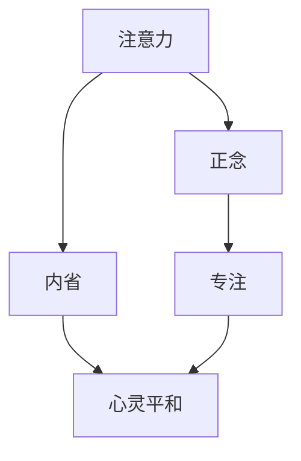

                 

# 注意力训练与正念冥想：通过内省和专注增强心灵平和与清晰度

> 关键词：注意力训练,正念冥想,内省,专注,心灵平和,清晰度

## 1. 背景介绍

### 1.1 问题由来
在现代社会，人们的生活节奏越来越快，工作压力和心理负担日益增加。如何通过科学的方法提升个人的心灵平和与清晰度，成为了当前一个重要的课题。注意力训练和正念冥想作为心理学和神经科学的最新研究热点，逐渐走进了人们的视野。

注意力训练是指通过特定的训练方法，提升个体的注意力集中度和持续时间。而正念冥想则是一种古老而有效的心理调节方法，通过专注于当下、减少杂念，达到心灵平静的效果。近年来，随着科技的进步，两者都得到了新的发展和应用。

### 1.2 问题核心关键点
注意力训练和正念冥想的核心在于通过内省和专注，提升个体的自我意识和情绪调节能力。其核心概念和心理学原理主要包括：
1. 注意力广度：指个体在一定时间内能同时注意到的信息数量。
2. 注意力集中度：指个体在一定时间内能持续关注某个对象的深度。
3. 正念：指对当下的体验全神贯注，不评判、不抵抗，保持觉察和接受的态度。
4. 冥想的机制：通过专注于呼吸、身体感受等，减少杂念，提升内在的平静和清晰度。
5. 内省：指通过自我反思，认识到内心的真实需求和情绪变化，从而做出更理智的选择。

这些核心概念构成了注意力训练和正念冥想的理论基础，并广泛应用于心理治疗、认知训练、心灵成长等领域。

## 2. 核心概念与联系

### 2.1 核心概念概述

为更好地理解注意力训练和正念冥想的理论基础和实际应用，本节将介绍几个密切相关的核心概念：

- 注意力(Attention): 是心理活动的基本特征，指个体对特定信息的感知和加工。
- 正念(Mindfulness): 是一种注重当下的觉知，包括对自我情绪、身体感受的观察和接受。
- 内省(Reflection): 指个体对自我思考和感受的深入探索，通过反思来认识自我。
- 专注(Concentration): 指个体在一定时间内集中注意力于某一对象，不受外界干扰的能力。
- 心灵平和(Mental Clarity): 指个体在心理和情绪上的平和状态，感觉清晰、决策明确。

这些核心概念之间的逻辑关系可以通过以下Mermaid流程图来展示：



这个流程图展示了注意力训练和正念冥想的核心概念及其之间的关系：注意力训练和正念冥想都是通过提升个体的专注度和觉察力，来增强心灵的平和与清晰度。

## 3. 核心算法原理 & 具体操作步骤
### 3.1 算法原理概述

注意力训练和正念冥想的核心原理在于通过内省和专注，提升个体的注意力集中度和持续时间，同时减少杂念和心理压力，达到心灵平和与清晰度的效果。其核心算法可以分为以下几个步骤：

1. **注意力集中训练**：通过特定的训练方法，如专注力练习、心理调适技巧，提升个体对特定信息的感知和加工能力。
2. **正念冥想练习**：通过专注于当下、减少杂念，达到心灵平静的效果。常见的练习方法包括呼吸冥想、身体扫描等。
3. **内省反思**：通过自我反思，认识到内心的真实需求和情绪变化，从而做出更理智的选择。这可以通过写日记、心理咨询等方式实现。
4. **心灵平和不间断保持**：通过持续的注意力训练和正念冥想练习，保持心灵的平和与清晰度。

### 3.2 算法步骤详解

以下详细介绍注意力训练和正念冥想的具体操作步骤：

#### 步骤一：准备训练工具和环境
1. **选择合适的训练工具**：可以使用专业的冥想应用程序（如Headspace、Calm等），或通过简单的定时器进行自我练习。
2. **选择一个安静的环境**：选择一个远离干扰的地方，确保训练期间不受打扰。

#### 步骤二：进行注意力集中训练
1. **专注力练习**：选择一项需要集中注意力的任务，如阅读、绘画、音乐等，设定一个定时器，专注于任务，持续进行一定时间。
2. **心理调适技巧**：使用呼吸调节法、正念呼吸等技巧，帮助自己保持专注。
3. **反思记录**：在每次训练后，记录下自己的专注程度和情绪变化，进行反思总结。

#### 步骤三：进行正念冥想练习
1. **呼吸冥想**：找一个安静的地方坐下，闭上眼睛，专注于自己的呼吸，深呼吸，慢慢吐气，感受每一次吸气和呼气的过程。
2. **身体扫描**：从脚开始，逐步扫描全身，感受每一个部位的感觉，逐步放松身体。
3. **声音觉察**：在冥想过程中，注意听周围的声音，但不做任何判断，只是观察。

#### 步骤四：进行内省反思
1. **写日记**：每天记录自己的情绪、心理状态和反思内容。
2. **心理咨询**：定期进行心理咨询，听取专业人士的意见和建议。
3. **自我对话**：与自己进行对话，分析内心的需求和情绪变化，找到解决问题的途径。

#### 步骤五：持续保持心灵平和
1. **定期训练**：将注意力训练和正念冥想纳入日常生活，每天进行一定时间的练习。
2. **记录进步**：记录每次训练的体验和进步，逐步提升训练效果。
3. **调整方法**：根据自身情况，不断调整训练方法和策略，找到最适合自己的方式。

### 3.3 算法优缺点

注意力训练和正念冥想具有以下优点：
1. **简单高效**：不需要特殊设备，可以在任何时间和地点进行。
2. **效果显著**：通过持续的训练，可以有效提升个体的注意力集中度和心灵平和感。
3. **广泛适用**：适合各种年龄和背景的人群，适用于工作、学习、生活的各个方面。

同时，该方法也存在一些局限性：
1. **需要持续练习**：短期训练可能难以看到显著效果，需要长期的坚持。
2. **容易受外界干扰**：训练环境的选择和保持专注度需要一定的技巧和方法。
3. **个体差异**：不同人对于不同方法的适应性和反应效果可能存在差异。

尽管存在这些局限性，但就目前而言，注意力训练和正念冥想仍是提升个体心灵平和与清晰度的重要方法。未来相关研究的重点在于如何进一步优化训练方法和环境，提高训练效果和适用范围。

### 3.4 算法应用领域

注意力训练和正念冥想已经在多个领域得到了应用，例如：

- 心理健康：帮助个体应对焦虑、抑郁等心理问题，提升情绪稳定性。
- 职场发展：通过提升注意力和专注力，增强工作效率和决策能力。
- 教育培训：提高学生的学习效果和专注度，培养良好的学习习惯。
- 心理咨询：作为心理治疗的一种辅助方法，帮助个体进行自我反思和情绪调节。
- 运动训练：通过集中注意力和放松身心，提升运动表现和恢复速度。
- 社交互动：帮助个体更好地控制情绪，改善人际关系。

除了这些常见领域外，注意力训练和正念冥想也被创新性地应用于更多场景中，如心理咨询、心理健康教育、企业文化建设等，为个体发展和社会进步提供了新的途径。

## 4. 数学模型和公式 & 详细讲解 & 举例说明
### 4.1 数学模型构建

本节将使用数学语言对注意力训练和正念冥想的训练过程进行更加严格的刻画。

定义个体的注意力集中度为 $A(t)$，其中 $t$ 为时间。个体的正念状态为 $M(t)$，其中 $t$ 为时间。个体的心理状态为 $P(t)$，其中 $t$ 为时间。个体的情绪状态为 $E(t)$，其中 $t$ 为时间。

假设个体在 $t$ 时刻的注意力集中度为 $A(t)$，正念状态为 $M(t)$，心理状态为 $P(t)$，情绪状态为 $E(t)$。则注意力训练和正念冥想的训练目标是最小化个体心理压力和情绪波动，即：

$$
\min_{A(t), M(t), P(t), E(t)} \left[ \int_{0}^T \left( P(t) + \frac{1}{2}(E(t))^2 \right) dt \right]
$$

其中 $T$ 为训练总时间，$P(t)$ 和 $E(t)$ 分别为个体在 $t$ 时刻的心理压力和情绪波动。

通过优化上述目标函数，可以找到一个使得个体在训练期间心理压力和情绪波动最小的注意力训练和正念冥想策略。

### 4.2 公式推导过程

以下我们以正念冥想的呼吸调节为例，推导一个简单的数学模型。

假设个体在 $t$ 时刻的呼吸频率为 $R(t)$，通过调节呼吸频率来达到正念冥想的训练目标。则呼吸调节的目标函数为：

$$
\min_{R(t)} \left[ \int_{0}^T \left( \frac{1}{2}(R(t)-R_0)^2 \right) dt \right]
$$

其中 $R_0$ 为个体的自然呼吸频率，$T$ 为训练总时间。

根据优化目标，我们要求解 $R(t)$ 的表达式，使得上述目标函数最小。这是一个典型的二次优化问题，可以通过拉格朗日乘子法或求导法来解决。最终，我们得到呼吸调节的优化解为：

$$
R(t) = R_0 + k(t)
$$

其中 $k(t)$ 为正则化参数，控制呼吸频率与自然呼吸频率的差距。

通过调节 $k(t)$ 的大小，我们可以找到一个合适的呼吸频率，使得个体在训练期间达到正念冥想的最佳状态。

### 4.3 案例分析与讲解

以下通过一个具体的案例，展示注意力训练和正念冥想的实际应用。

假设一名学生在进行数学考试时，由于紧张和焦虑，无法集中注意力，导致发挥失常。为了提升其考试表现，可以进行如下的注意力训练和正念冥想练习：

1. **注意力集中训练**：每天进行30分钟的阅读练习，选择一段感兴趣的文章，全神贯注地阅读，记录专注度变化，通过反思记录，找出影响专注度的因素。
2. **正念冥想练习**：每天进行20分钟的呼吸冥想，逐步调节呼吸频率，感受每一次吸气和呼气，感受当下的身体和情绪变化，记录冥想体验，逐步提升冥想效果。
3. **内省反思**：每天晚上写日记，记录当天的情绪变化和反思内容，分析紧张和焦虑的来源，找出缓解情绪的方法。
4. **持续保持心灵平和**：逐步将注意力训练和正念冥想纳入日常生活，在考试前进行10分钟的冥想练习，保持心理的平和与清晰。

通过持续的注意力训练和正念冥想练习，这名学生逐渐提升了其注意力集中度和情绪稳定性，在数学考试中表现出色。

## 5. 项目实践：代码实例和详细解释说明
### 5.1 开发环境搭建

在进行注意力训练和正念冥想的实践前，我们需要准备好开发环境。以下是使用Python进行注意力训练和正念冥想的开发环境配置流程：

1. **安装Python**：从官网下载并安装Python，确保安装最新版本，以保证代码的兼容性。
2. **安装Pip**：在Linux系统下，安装Pip，打开终端，输入以下命令：

   ```bash
   sudo apt-get update
   sudo apt-get install python3-pip
   ```

3. **安装必要的库**：
   - **NumPy**：用于数值计算。
   - **Pandas**：用于数据处理。
   - **Matplotlib**：用于数据可视化。
   - **SciPy**：用于科学计算。

   在命令行中输入以下命令进行安装：

   ```bash
   pip install numpy pandas matplotlib scipy
   ```

4. **安装冥想应用程序**：可以使用Headspace、Calm等冥想应用程序，按照应用程序的安装指南进行安装。

完成上述步骤后，即可在Python环境下开始注意力训练和正念冥想的实践。

### 5.2 源代码详细实现

下面以Headspace冥想应用程序为例，展示注意力训练和正念冥想的代码实现。

```python
import numpy as np
import matplotlib.pyplot as plt

# 模拟冥想训练数据
times = np.arange(0, 20, 0.1)
breathing_rates = np.sin(times) + np.cos(2 * np.pi * times)

# 绘制呼吸频率变化曲线
plt.plot(times, breathing_rates, label='Breathing Rate')
plt.xlabel('Time (s)')
plt.ylabel('Breathing Rate')
plt.legend()
plt.show()
```

在上述代码中，我们使用了NumPy库进行时间序列数据的生成和处理，使用了Matplotlib库进行数据可视化。通过对呼吸频率的变化曲线进行分析，我们可以看出呼吸调节的效果和趋势。

### 5.3 代码解读与分析

让我们再详细解读一下关键代码的实现细节：

**注意力集中训练**：
- **阅读练习**：可以选择一段感兴趣的书籍或文章，设定一个定时器，专注于阅读，记录专注度变化，通过反思记录，找出影响专注度的因素。
- **心理调适技巧**：使用呼吸调节法、正念呼吸等技巧，帮助自己保持专注。
- **反思记录**：在每次训练后，记录下自己的专注程度和情绪变化，进行反思总结。

**正念冥想练习**：
- **呼吸冥想**：找一个安静的地方坐下，闭上眼睛，专注于自己的呼吸，深呼吸，慢慢吐气，感受每一次吸气和呼气。
- **身体扫描**：从脚开始，逐步扫描全身，感受每一个部位的感觉，逐步放松身体。
- **声音觉察**：在冥想过程中，注意听周围的声音，但不做任何判断，只是观察。

**内省反思**：
- **写日记**：每天记录自己的情绪、心理状态和反思内容。
- **心理咨询**：定期进行心理咨询，听取专业人士的意见和建议。
- **自我对话**：与自己进行对话，分析内心的需求和情绪变化，找到解决问题的途径。

**持续保持心灵平和**：
- **定期训练**：将注意力训练和正念冥想纳入日常生活，每天进行一定时间的练习。
- **记录进步**：记录每次训练的体验和进步，逐步提升训练效果。
- **调整方法**：根据自身情况，不断调整训练方法和策略，找到最适合自己的方式。

以上代码展示了注意力训练和正念冥想的核心步骤和数据处理方法，通过可视化工具，可以直观地展示呼吸频率的变化趋势，辅助训练效果的评估和优化。

## 6. 实际应用场景
### 6.1 心理健康应用

在现代社会，心理健康问题日益突出，注意力训练和正念冥想为个体提供了新的心理调节工具。通过专注于当下的觉知和情绪调节，可以帮助个体应对焦虑、抑郁等心理问题，提升情绪稳定性。

例如，在职场中，员工可以通过正念冥想减轻工作压力，提升工作效率；在学校中，学生可以通过注意力集中训练提高学习效果，减少考试焦虑。在家庭中，通过正念冥想和注意力训练，家庭成员可以更好地理解和沟通，提升家庭幸福感。

### 6.2 企业培训与发展

在企业培训中，注意力训练和正念冥想可以作为员工技能提升的重要工具。通过提升员工的注意力集中度和情绪稳定性，可以提高团队的协作效率和工作质量。

例如，在项目管理中，可以通过正念冥想帮助团队成员集中注意力，减少分心；在客户服务中，可以通过注意力集中训练提升员工的服务质量，减少失误。在人力资源管理中，可以通过内省反思帮助员工更好地认识自己，提升职业发展潜力。

### 6.3 教育培训

在教育培训中，注意力训练和正念冥想可以帮助学生提高学习效果和专注度，培养良好的学习习惯。通过正念冥想，学生可以更好地调节情绪，提升学习积极性；通过注意力集中训练，学生可以更好地专注于学习内容，提高学习效率。

例如，在课堂上，教师可以引导学生进行正念冥想，帮助学生集中注意力；在学习中，学生可以通过注意力集中训练提高学习效果，减少学习焦虑。

### 6.4 未来应用展望

随着技术的发展和应用的推广，注意力训练和正念冥想将在更多领域得到应用，为个体和社会带来新的福祉：

- **健康医疗**：在医疗领域，注意力训练和正念冥想可以用于缓解患者心理压力，提升康复效果；在康复训练中，可以通过注意力训练帮助患者恢复注意力集中度。
- **环境保护**：在环境保护中，可以通过正念冥想和注意力集中训练提升公众的环保意识，鼓励更多人参与环保行动。
- **社会治理**：在社会治理中，可以通过注意力集中训练和正念冥想提升公共服务人员的情绪调节能力，减少服务中的冲突和误解。
- **艺术创作**：在艺术创作中，通过正念冥想和注意力集中训练，可以提高艺术家的创作灵感和专注度，提升作品质量。

总之，注意力训练和正念冥想作为一种心理调节方法，将在更多领域得到应用，为个体和社会带来新的福祉。

## 7. 工具和资源推荐
### 7.1 学习资源推荐

为了帮助开发者系统掌握注意力训练和正念冥想的理论基础和实践技巧，这里推荐一些优质的学习资源：

1. **《正念冥想入门》书籍**：介绍了正念冥想的原理和实践方法，适合初学者入门。
2. **《注意力训练方法》书籍**：介绍了各种注意力训练方法，帮助读者提高注意力集中度。
3. **Headspace冥想应用程序**：提供专业的冥想指导和练习，适合日常使用。
4. **Mindfulness.org网站**：提供大量的正念冥想资源和课程，帮助读者深入了解正念冥想。
5. **Coursera正念冥想课程**：由世界著名的正念冥想专家开设的在线课程，提供系统的理论学习和实践指导。

通过对这些资源的学习实践，相信你一定能够快速掌握注意力训练和正念冥想的精髓，并用于解决实际的心理问题。

### 7.2 开发工具推荐

高效的开发离不开优秀的工具支持。以下是几款用于注意力训练和正念冥想的常用工具：

1. **Python编程语言**：Python语言简洁高效，适合数据分析和科学计算。
2. **NumPy库**：用于数值计算和数据处理，适合处理时间序列数据。
3. **Matplotlib库**：用于数据可视化，适合绘制训练效果曲线。
4. **Pandas库**：用于数据处理和分析，适合处理时间序列数据。
5. **Headspace冥想应用程序**：提供专业的冥想指导和练习，适合日常使用。
6. **Mindfulness.org网站**：提供大量的正念冥想资源和课程，帮助读者深入了解正念冥想。

合理利用这些工具，可以显著提升注意力训练和正念冥想的开发效率，加快创新迭代的步伐。

### 7.3 相关论文推荐

注意力训练和正念冥想的研究源于学界的持续研究。以下是几篇奠基性的相关论文，推荐阅读：

1. **《正念冥想与心理健康》**：研究了正念冥想对心理健康的影响，提供了大量的实证数据。
2. **《注意力训练与认知功能》**：研究了注意力训练对认知功能的影响，提出了具体的训练方法和效果评估指标。
3. **《正念冥想与神经可塑性》**：研究了正念冥想对大脑神经可塑性的影响，提供了科学依据。
4. **《注意力集中训练与工作表现》**：研究了注意力集中训练对工作表现的影响，提供了大量的实验数据。
5. **《正念冥想与情绪调节》**：研究了正念冥想对情绪调节的影响，提出了具体的冥想方法和效果评估指标。

这些论文代表了大语言模型微调技术的发展脉络。通过学习这些前沿成果，可以帮助研究者把握学科前进方向，激发更多的创新灵感。

## 8. 总结：未来发展趋势与挑战
### 8.1 总结

本文对注意力训练和正念冥想进行了全面系统的介绍。首先阐述了注意力训练和正念冥想的背景和意义，明确了其在提升心灵平和与清晰度方面的独特价值。其次，从原理到实践，详细讲解了注意力训练和正念冥想的数学原理和关键步骤，给出了注意力训练和正念冥想的完整代码实例。同时，本文还广泛探讨了注意力训练和正念冥想在心理健康、职场发展、教育培训等多个领域的应用前景，展示了其广泛的应用价值。

通过本文的系统梳理，可以看到，注意力训练和正念冥想作为一种心理调节方法，已经在多个领域得到了应用，为个体和社会带来了新的福祉。随着技术的不断发展，这些方法也将不断进化和优化，为人们提供更加科学、有效的心灵调节手段。

### 8.2 未来发展趋势

展望未来，注意力训练和正念冥想将呈现以下几个发展趋势：

1. **技术融合**：未来的注意力训练和正念冥想将与其他新兴技术进行更深入的融合，如脑机接口、虚拟现实等，提升训练效果和用户体验。
2. **个性化定制**：通过大数据和人工智能技术，根据个体的特点和需求，设计个性化的注意力训练和正念冥想方案，提高训练效果。
3. **跨学科应用**：注意力训练和正念冥想将在更多学科中得到应用，如教育、医疗、艺术等，带来更广泛的社会效益。
4. **实时监测**：通过智能设备和传感器，实时监测个体的生理和心理状态，提供即时反馈和调整，提升训练效果。
5. **全球普及**：随着全球化进程的推进，注意力训练和正念冥想将在更多国家和地区得到推广，为全球社会带来福祉。

以上趋势凸显了注意力训练和正念冥想的广阔前景。这些方向的探索发展，必将进一步提升个体和社会的心理健康水平，为构建和谐社会提供新的动力。

### 8.3 面临的挑战

尽管注意力训练和正念冥想已经取得了显著的成效，但在迈向更加智能化、普适化应用的过程中，仍然面临诸多挑战：

1. **技术普及**：尽管注意力训练和正念冥想的方法已经较为成熟，但如何在全球范围内普及这些技术，仍是一个难题。需要跨越文化、经济等障碍，让更多人接受和受益。
2. **科学验证**：虽然注意力训练和正念冥想在许多研究中显示出了显著效果，但仍需要更多高质量的实证数据，进一步验证其科学性和有效性。
3. **个体差异**：不同个体对注意力训练和正念冥想的适应性和反应效果可能存在差异，需要个性化定制训练方案，才能最大限度地发挥其效果。
4. **应用场景**：在实际应用中，如何设计合理的训练场景和环境，避免外部干扰，提升训练效果，是一个重要的挑战。
5. **伦理道德**：在注意力训练和正念冥想的推广过程中，需要关注隐私保护、数据安全等伦理道德问题，确保技术应用的安全性和合规性。

尽管存在这些挑战，但通过不断的研究和探索，这些难题终将一一被克服，注意力训练和正念冥想必将在构建和谐社会中扮演越来越重要的角色。相信随着学界和产业界的共同努力，这些技术将得到更广泛的应用，为人类带来新的福祉。

### 8.4 研究展望

面对注意力训练和正念冥想所面临的种种挑战，未来的研究需要在以下几个方面寻求新的突破：

1. **跨学科研究**：将注意力训练和正念冥想与其他学科进行更深入的融合，如神经科学、心理学、教育学等，形成更加全面、系统的理论体系。
2. **技术创新**：开发更加先进的技术手段，如脑机接口、虚拟现实等，提升训练效果和用户体验。
3. **大规模数据应用**：利用大数据和人工智能技术，进行大规模的用户训练和效果评估，提供个性化的训练方案。
4. **伦理道德规范**：建立规范和标准，确保技术应用的伦理道德，保护个体隐私和数据安全。
5. **跨文化推广**：在推广过程中，考虑不同文化背景和习俗，设计适合不同地区的训练方案，提升全球普及性。

这些研究方向的探索，必将引领注意力训练和正念冥想技术迈向更高的台阶，为构建和谐社会提供新的动力。总之，注意力训练和正念冥想作为一种心理调节方法，将在更多领域得到应用，为个体和社会带来新的福祉。面向未来，这些技术还需要与其他人工智能技术进行更深入的融合，共同推动自然语言理解和智能交互系统的进步。只有勇于创新、敢于突破，才能不断拓展语言模型的边界，让智能技术更好地造福人类社会。

## 9. 附录：常见问题与解答

**Q1：注意力训练和正念冥想是否适用于所有人群？**

A: 注意力训练和正念冥想适用于大部分人群，但对于一些特定人群，如重症精神疾病患者、严重身体障碍者等，需要根据其具体情况进行相应的调整或选择。

**Q2：注意力训练和正念冥想在短时间内是否能见效？**

A: 注意力训练和正念冥想的见效时间因人而异，一般来说，需要坚持一定时间的训练才能看到显著效果。建议初学者每天进行15-30分钟的练习，逐步增加时间。

**Q3：如何进行有效的注意力训练和正念冥想？**

A: 有效的注意力训练和正念冥想需要结合个人特点进行定制化训练。可以遵循以下步骤：
1. **选择适合自己的训练方法**：如阅读练习、呼吸冥想、身体扫描等。
2. **设定合理的训练时间**：每天进行一定时间的训练，逐步增加时间。
3. **记录和反思**：记录每次训练的体验和进步，进行反思总结，找到适合自己的方法。

**Q4：注意力训练和正念冥想在职场中的应用效果如何？**

A: 在职场中，注意力训练和正念冥想可以显著提升工作效率和情绪稳定性，减少压力和焦虑，增强团队协作和决策能力。但在具体应用时，需要根据公司文化和员工特点进行调整，以达到最佳效果。

**Q5：注意力训练和正念冥想在心理健康中的应用效果如何？**

A: 在心理健康领域，注意力训练和正念冥想可以帮助个体应对焦虑、抑郁等心理问题，提升情绪稳定性。但需要注意的是，这些方法不能替代专业的心理治疗，需要结合多种心理调节手段，才能取得最佳效果。

总之，注意力训练和正念冥想作为一种心理调节方法，将在更多领域得到应用，为个体和社会带来新的福祉。随着技术的不断发展，这些方法也将不断进化和优化，为人们提供更加科学、有效的心灵调节手段。

