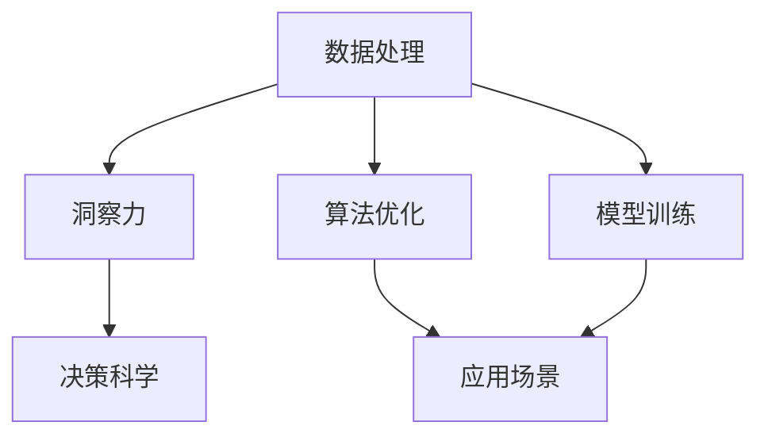

                 

# 洞察力与决策科学：从数据到智慧的转化

> 关键词：洞察力,决策科学,数据处理,智慧转化,算法优化,应用场景,模型训练

## 1. 背景介绍

### 1.1 问题由来
在信息爆炸的时代，数据无处不在，但如何从海量数据中提炼出有价值的洞察力，并将其转化为科学的决策，是摆在企业和研究者面前的重大挑战。传统的数据分析方法往往只关注于数据的描述性统计，缺乏对深层次模式和因果关系的探究。与此同时，人工智能技术的兴起，为从数据到决策的转化提供了新的可能性。

### 1.2 问题核心关键点
该问题聚焦于如何通过人工智能技术，将数据转化为智慧，进而支撑科学决策。其中关键在于：
- 如何从数据中发现深层次的模式和关系
- 如何将数据转化为可供理解和决策的洞察力
- 如何通过优化算法提升决策的科学性和准确性
- 如何将算法应用于不同场景，解决实际问题

### 1.3 问题研究意义
通过对数据到洞察力再到决策的转化过程的深入研究，可以为企业的决策制定提供科学依据，提升决策的精度和效率。有助于企业在激烈的市场竞争中占据优势，实现持续的业务增长和创新。同时，这种研究方法也有助于科学研究和公共政策的制定，推动社会的进步和发展。

## 2. 核心概念与联系

### 2.1 核心概念概述

为更好地理解数据到决策的转化过程，本节将介绍几个核心概念及其之间的联系：

- 数据处理(Data Processing)：指通过一系列算法和技术，对原始数据进行清洗、整理、转换，提取有价值信息的过程。

- 洞察力(Insight)：指从数据中发现的深层次模式、趋势、关联等，可以指导企业制定战略决策，优化业务流程。

- 决策科学(Decision Science)：指基于数据、模型和算法，对复杂决策问题进行科学分析和优化的方法论。

- 算法优化(Algorithm Optimization)：指通过模型选择、超参数调优、特征工程等手段，提升模型预测准确性和效率的过程。

- 应用场景(Use Case)：指将算法应用于特定业务场景，解决具体问题的实践案例。

- 模型训练(Model Training)：指通过给定数据集，训练出能对新数据进行准确预测的机器学习模型。

这些核心概念之间的逻辑关系可以通过以下Mermaid流程图来展示：



这个流程图展示了一系列从数据处理到洞察力再到决策科学的过程：

1. 通过数据处理技术，从原始数据中提取有价值的信息。
2. 利用算法优化技术，选择和优化合适的模型，获得洞察力。
3. 将模型应用于实际业务场景，解决具体问题，进行科学决策。

## 3. 核心算法原理 & 具体操作步骤

### 3.1 算法原理概述

数据到决策的转化过程，本质上是一个基于数据的洞察力发现和应用过程。其核心算法可以概括为以下几个步骤：

1. 数据收集和预处理：收集相关的数据，并进行清洗、处理，保证数据的质量。
2. 特征工程：通过特征选择、构建、变换等技术，提取对决策有重要影响的特征。
3. 模型选择和训练：选择合适的机器学习模型，并在训练数据上训练得到模型。
4. 模型评估和优化：使用验证集对模型进行评估，通过超参数调优、模型融合等手段提升模型性能。
5. 模型部署与应用：将训练好的模型部署到生产环境，应用于实际的决策场景。

### 3.2 算法步骤详解

以下是具体的算法步骤详解：

**Step 1: 数据收集与预处理**

- 数据收集：收集与业务相关的数据，如销售数据、客户反馈、社交媒体数据等。
- 数据清洗：删除缺失值、异常值，处理重复数据，确保数据质量。
- 数据转换：标准化数据格式，如将文本数据转换为数值向量，便于模型处理。

**Step 2: 特征工程**

- 特征选择：通过统计分析和领域知识，选择对目标变量有显著影响的特征。
- 特征构建：构建新的特征，如时间序列特征、交互特征等。
- 特征变换：通过归一化、编码、降维等技术，提高特征的表现力。

**Step 3: 模型选择与训练**

- 模型选择：根据问题类型，选择适合的机器学习模型，如回归、分类、聚类等。
- 模型训练：使用训练数据集，对模型进行训练，调整模型参数。

**Step 4: 模型评估与优化**

- 模型评估：使用验证集对模型进行评估，计算评价指标如准确率、召回率、F1值等。
- 超参数调优：通过网格搜索、贝叶斯优化等方法，优化模型超参数。
- 模型融合：通过集成学习技术，结合多个模型，提高预测准确性。

**Step 5: 模型部署与应用**

- 模型部署：将训练好的模型部署到生产环境，如服务器、数据库等。
- 模型应用：使用模型对新数据进行预测，支持决策制定。

### 3.3 算法优缺点

数据到决策转化的算法具有以下优点：

- 准确性高：基于数据的模型预测往往比人工决策更准确，特别是复杂问题。
- 可扩展性强：机器学习模型可以处理大规模数据集，适用于不同规模和复杂度的决策场景。
- 自动化程度高：自动化算法可以自动处理和分析数据，提升决策效率。

同时，算法也存在一些缺点：

- 依赖高质量数据：模型的准确性依赖于数据的质量和完整性，数据偏差会影响模型效果。
- 需要专业知识：模型选择、特征工程、超参数调优等环节需要专业知识，普通员工难以操作。
- 解释性不足：复杂的机器学习模型往往难以解释其内部工作机制，可能影响决策的信任度。

### 3.4 算法应用领域

数据到决策转化的算法在多个领域得到了广泛应用，例如：

- 金融分析：使用模型预测股票价格、风险评估、信用评分等，帮助银行和金融机构做出决策。
- 市场营销：通过客户行为分析，预测客户购买意向，优化营销策略。
- 健康医疗：分析患者病历数据，预测疾病风险，辅助医生制定治疗方案。
- 供应链管理：使用模型预测需求变化，优化库存管理，提高供应链效率。
- 智能制造：通过数据分析优化生产流程，提升生产效率和产品质量。

## 4. 数学模型和公式 & 详细讲解 & 举例说明

### 4.1 数学模型构建

本节将使用数学语言对数据到决策转化的算法过程进行更加严格的刻画。

设原始数据集为 $D=\{(x_i,y_i)\}_{i=1}^N$，其中 $x_i \in \mathcal{X}$ 为输入特征， $y_i \in \mathcal{Y}$ 为目标变量。假设选择的机器学习模型为 $M_{\theta}$，其中 $\theta$ 为模型参数。

定义模型的经验风险为：

$$
\mathcal{L}(\theta) = \frac{1}{N}\sum_{i=1}^N \ell(M_{\theta}(x_i),y_i)
$$

其中 $\ell$ 为损失函数，衡量模型的预测与真实值之间的差异。

模型的目标是最小化经验风险，即找到最优参数 $\theta^*$：

$$
\theta^* = \mathop{\arg\min}_{\theta} \mathcal{L}(\theta)
$$

在实践中，我们通常使用梯度下降等优化算法来近似求解上述最优化问题。设 $\eta$ 为学习率，$\lambda$ 为正则化系数，则参数的更新公式为：

$$
\theta \leftarrow \theta - \eta \nabla_{\theta}\mathcal{L}(\theta) - \eta\lambda\theta
$$

其中 $\nabla_{\theta}\mathcal{L}(\theta)$ 为损失函数对参数 $\theta$ 的梯度，可通过反向传播算法高效计算。

### 4.2 公式推导过程

以下我们以线性回归模型为例，推导最小二乘法（L2）损失函数及其梯度的计算公式。

设模型 $M_{\theta}$ 在输入 $x$ 上的输出为 $\hat{y}=M_{\theta}(x)=\theta^Tx$，其中 $\theta \in \mathbb{R}^d$ 为模型参数。真实标签 $y \in \mathbb{R}$。则线性回归的L2损失函数定义为：

$$
\ell(M_{\theta}(x),y) = \frac{1}{2}(y - \theta^Tx)^2
$$

将其代入经验风险公式，得：

$$
\mathcal{L}(\theta) = \frac{1}{2N}\sum_{i=1}^N (y_i - \theta^Tx_i)^2
$$

根据链式法则，损失函数对参数 $\theta_k$ 的梯度为：

$$
\frac{\partial \mathcal{L}(\theta)}{\partial \theta_k} = -\frac{1}{N}\sum_{i=1}^N (y_i - \theta^Tx_i)x_{ik}
$$

其中 $x_{ik}$ 为输入特征的第 $k$ 个分量。

在得到损失函数的梯度后，即可带入参数更新公式，完成模型的迭代优化。重复上述过程直至收敛，最终得到适应数据集的最优模型参数 $\theta^*$。

### 4.3 案例分析与讲解

假设我们要对一家电商平台的销售额进行预测，原始数据集 $D=\{(x_i,y_i)\}_{i=1}^N$ 包括时间、广告投放量、促销活动等特征，以及对应的销售额 $y_i$。

**Step 1: 数据收集与预处理**

- 数据收集：从电商平台获取历史销售数据，包括时间戳、广告投放量、促销活动等。
- 数据清洗：删除缺失值、异常值，处理重复数据。
- 数据转换：将时间戳转换为日期格式，对广告投放量和促销活动进行归一化。

**Step 2: 特征工程**

- 特征选择：选择对销售额有显著影响的特征，如广告投放量、促销活动。
- 特征构建：构建新的特征，如广告投放量和促销活动的交互特征。
- 特征变换：对广告投放量和促销活动进行归一化，将数据转换为数值向量。

**Step 3: 模型选择与训练**

- 模型选择：选择线性回归模型，使用训练数据集对模型进行训练。
- 模型训练：使用梯度下降法，最小化L2损失函数，调整模型参数。

**Step 4: 模型评估与优化**

- 模型评估：使用验证集对模型进行评估，计算R2、RMSE等指标。
- 超参数调优：通过网格搜索，优化学习率、正则化系数等超参数。
- 模型融合：通过集成多个线性回归模型，提高预测准确性。

**Step 5: 模型部署与应用**

- 模型部署：将训练好的模型部署到生产环境，如服务器、数据库等。
- 模型应用：使用模型对新数据进行预测，辅助电商平台的库存管理和促销策略制定。

## 5. 项目实践：代码实例和详细解释说明

### 5.1 开发环境搭建

在进行数据到决策转化的实践前，我们需要准备好开发环境。以下是使用Python进行Scikit-learn开发的环境配置流程：

1. 安装Anaconda：从官网下载并安装Anaconda，用于创建独立的Python环境。

2. 创建并激活虚拟环境：
```bash
conda create -n sklearn-env python=3.8 
conda activate sklearn-env
```

3. 安装Scikit-learn：
```bash
pip install scikit-learn
```

4. 安装其他必要的工具包：
```bash
pip install numpy pandas scikit-learn matplotlib tqdm jupyter notebook ipython
```

完成上述步骤后，即可在`sklearn-env`环境中开始实践。

### 5.2 源代码详细实现

这里我们以线性回归模型为例，给出使用Scikit-learn进行数据处理的完整代码实现。

```python
import numpy as np
from sklearn.model_selection import train_test_split
from sklearn.linear_model import LinearRegression
from sklearn.metrics import r2_score, mean_squared_error

# 数据加载
data = np.loadtxt('sales_data.csv', delimiter=',')
X = data[:, :-1]  # 特征
y = data[:, -1]    # 目标变量

# 数据预处理
X_train, X_test, y_train, y_test = train_test_split(X, y, test_size=0.2, random_state=42)

# 模型训练
model = LinearRegression()
model.fit(X_train, y_train)

# 模型评估
y_pred = model.predict(X_test)
r2 = r2_score(y_test, y_pred)
mse = mean_squared_error(y_test, y_pred)

print(f'R^2: {r2:.3f}, MSE: {mse:.3f}')
```

### 5.3 代码解读与分析

让我们再详细解读一下关键代码的实现细节：

**数据加载和预处理**

- `np.loadtxt`函数用于从文本文件中加载数据，支持逗号分隔的CSV格式。
- `train_test_split`函数用于将数据集划分为训练集和测试集，随机划分，比例为80:20。
- `X[:, :-1]`和`y[:, -1]`用于提取特征和目标变量，切片操作可减少代码冗余。

**模型训练**

- `LinearRegression`类用于构建线性回归模型，`fit`方法用于训练模型，调整参数。

**模型评估**

- `predict`方法用于对测试集进行预测，生成预测值。
- `r2_score`和`mean_squared_error`函数分别用于计算R2和MSE，评估模型性能。

**代码运行**

- `r2`和`mse`的值表示模型的拟合程度和预测精度，通过打印输出结果，我们可以直观地了解模型效果。

## 6. 实际应用场景

### 6.1 金融分析

在金融领域，数据到决策的转化至关重要。例如，使用机器学习模型对股票价格进行预测，可以辅助投资者做出买卖决策，降低市场风险。通过分析历史交易数据、公司财报、新闻等，构建预测模型，从而对股票未来的走势进行预测。

### 6.2 市场营销

市场营销部门经常需要根据客户数据进行分析和预测，以优化广告投放策略。通过收集客户的历史行为数据，构建预测模型，可以预测客户的购买意向和反应，进而调整广告投放策略，提升广告效果。

### 6.3 健康医疗

在健康医疗领域，数据分析可以用于疾病预测和患者管理。通过分析患者的病历数据、医疗记录等，构建预测模型，可以预测患者的病情变化和风险，辅助医生制定治疗方案，提高诊疗水平。

### 6.4 智能制造

在智能制造领域，数据分析可以用于优化生产流程和设备维护。通过分析生产数据、设备运行数据等，构建预测模型，可以预测设备故障、优化生产流程，提高生产效率和产品质量。

### 6.5 未来应用展望

未来，数据到决策的转化技术将进一步发展和成熟，具体趋势包括：

1. 多模态数据融合：结合视觉、语音、文本等多种数据类型，构建更加全面、准确的模型。
2. 自动化特征工程：通过自动化特征选择和构建，降低人工干预，提升模型效果。
3. 实时数据处理：使用流式处理技术，实时分析数据，做出动态决策。
4. 可解释性增强：通过模型可解释性技术，提高决策的透明度和信任度。
5. 跨领域应用：将数据到决策的转化技术应用于更多领域，如交通、能源等，推动跨领域的创新和进步。

## 7. 工具和资源推荐

### 7.1 学习资源推荐

为帮助开发者系统掌握数据到决策转化的理论和实践，这里推荐一些优质的学习资源：

1. 《机器学习实战》：作者Peter Harrington，全面介绍机器学习的基本概念和实践方法，适合入门学习。

2. 《Python机器学习》：作者Sebastian Raschka，详细讲解了Python中的机器学习库，包括Scikit-learn、TensorFlow等。

3. 《深度学习》：作者Ian Goodfellow，全面介绍了深度学习的基础理论和算法，适合深入学习。

4. Kaggle：数据科学竞赛平台，提供大量真实数据集和开源代码，帮助开发者实践和提升技能。

5. Coursera：在线课程平台，提供斯坦福大学、密歇根大学等名校的机器学习课程，系统学习理论知识。

通过这些学习资源的学习实践，相信你一定能够快速掌握数据到决策转化的精髓，并用于解决实际的业务问题。

### 7.2 开发工具推荐

高效的开发离不开优秀的工具支持。以下是几款用于数据到决策转化开发的常用工具：

1. Scikit-learn：Python中的机器学习库，提供了多种常用模型和算法，易于上手。

2. TensorFlow：由Google主导开发的深度学习框架，支持大规模模型训练和部署。

3. PyTorch：由Facebook开发的深度学习框架，支持动态图和静态图两种计算模型。

4. Weights & Biases：模型训练的实验跟踪工具，可以记录和可视化模型训练过程中的各项指标，方便对比和调优。

5. TensorBoard：TensorFlow配套的可视化工具，可实时监测模型训练状态，并提供丰富的图表呈现方式。

6. Jupyter Notebook：交互式编程环境，支持代码编写、数据可视化等，方便调试和协作。

合理利用这些工具，可以显著提升数据到决策转化的开发效率，加快创新迭代的步伐。

### 7.3 相关论文推荐

数据到决策转化的研究源于学界的持续研究。以下是几篇奠基性的相关论文，推荐阅读：

1. Machine Learning: A Probabilistic Perspective：Tom Mitchell，系统介绍机器学习的基本理论和算法，适合深入理解。

2. The Elements of Statistical Learning：Christopher Bishop，全面讲解统计学习的基础理论和算法，适合理论研究。

3. Large-Scale Parallel Training for Natural Language Processing：Azure团队，介绍在大规模数据集上训练语言模型的技术，适合实际应用。

4. Predictive Data Science：Joachim Weickert，系统介绍预测建模的理论与实践，适合实战操作。

5. Explainable AI：Joseph J. Kim，探讨机器学习模型的可解释性，适合理解模型决策过程。

这些论文代表了大数据到决策转化的发展脉络。通过学习这些前沿成果，可以帮助研究者把握学科前进方向，激发更多的创新灵感。

## 8. 总结：未来发展趋势与挑战

### 8.1 总结

本文对数据到决策转化的算法过程进行了全面系统的介绍。首先阐述了数据到决策转化的研究背景和意义，明确了数据到洞察力再到决策的转化路径。其次，从原理到实践，详细讲解了算法的各个环节，给出了数据处理、模型训练的完整代码实例。同时，本文还广泛探讨了算法在金融、市场营销、健康医疗等领域的实际应用，展示了算法的广泛适用性。此外，本文精选了数据处理和模型训练的各类学习资源，力求为读者提供全方位的技术指引。

通过本文的系统梳理，可以看到，数据到决策转化的算法正在成为数据分析和决策科学的重要工具，极大地拓展了数据应用的边界，提升了决策的科学性和准确性。未来，伴随数据量的不断增长和技术手段的不断进步，数据到决策的转化必将在更多领域得到应用，为数据驱动决策提供新的可能性。

### 8.2 未来发展趋势

展望未来，数据到决策转化的算法将呈现以下几个发展趋势：

1. 自动化程度提升：自动化特征工程、自动化模型选择等技术将进一步提升决策的效率和精度。

2. 跨领域应用拓展：将数据到决策的转化技术应用于更多领域，如交通、能源、环境等，推动跨领域的创新和进步。

3. 实时处理能力增强：使用流式处理技术，实时分析数据，做出动态决策，提升决策的时效性。

4. 可解释性增强：通过模型可解释性技术，提高决策的透明度和信任度，降低决策的不确定性。

5. 多模态数据融合：结合视觉、语音、文本等多种数据类型，构建更加全面、准确的模型，提升决策的全面性。

这些趋势凸显了数据到决策转化技术的广阔前景，将进一步提升数据分析和决策的智能化水平，为社会的进步和发展提供新的动力。

### 8.3 面临的挑战

尽管数据到决策转化的算法已经取得了瞩目成就，但在迈向更加智能化、普适化应用的过程中，它仍面临着诸多挑战：

1. 数据质量和多样性：高质量、多样化的数据是算法有效性的前提，但数据获取和处理往往存在困难。

2. 模型复杂性：大规模、复杂模型的训练和优化需要高计算资源和专业技能，降低了算法的可操作性。

3. 模型可解释性：复杂模型往往难以解释其内部工作机制，影响决策的信任度和可解释性。

4. 模型偏见和鲁棒性：模型可能存在数据偏见，影响决策的公平性和鲁棒性。

5. 数据隐私和安全：数据泄露和隐私保护问题，需要技术手段和法规保障。

6. 数据存储和传输：大规模数据集的存储和传输需要高效的解决方案，降低计算成本。

正视这些挑战，积极应对并寻求突破，将是大数据到决策转化技术走向成熟的必由之路。相信随着学界和产业界的共同努力，这些挑战终将一一被克服，数据到决策的转化必将在构建智慧社会中扮演越来越重要的角色。

### 8.4 研究展望

面对大数据到决策转化所面临的种种挑战，未来的研究需要在以下几个方面寻求新的突破：

1. 数据采集与预处理技术：研究高效、自动化的数据采集和预处理技术，降低数据获取成本和处理难度。

2. 自动化特征工程：研究自动化特征选择和构建方法，降低人工干预，提升模型效果。

3. 跨领域知识整合：研究跨领域知识图谱、逻辑规则等与机器学习模型的融合技术，提升决策的全面性和准确性。

4. 模型可解释性增强：研究模型可解释性技术，提高决策的透明度和信任度。

5. 数据隐私和安全保障：研究数据隐私保护技术和法规，确保数据的安全性和合规性。

6. 实时处理与决策优化：研究实时数据处理技术和决策优化算法，提升决策的时效性和质量。

这些研究方向的探索，必将引领大数据到决策转化技术的进一步发展，为智慧社会构建更加智能、高效的决策系统。面向未来，数据到决策转化技术还需要与其他人工智能技术进行更深入的融合，如知识表示、因果推理、强化学习等，多路径协同发力，共同推动数据驱动决策的进步。

## 9. 附录：常见问题与解答

**Q1：数据到决策的转化技术是否适用于所有业务场景？**

A: 数据到决策的转化技术在绝大多数业务场景中都具有广泛的应用前景。但具体应用效果和适用性，还需考虑数据的质量、业务的复杂度等因素。在数据量较小、业务规则复杂的情况下，数据到决策的转化可能需要更多的人工干预和领域知识。

**Q2：如何选择适合的数据到决策的转化方法？**

A: 选择数据到决策的转化方法时，需考虑以下因素：
1. 业务类型：不同业务类型适合不同的模型，如回归适用于预测连续变量，分类适用于预测离散变量。
2. 数据类型：不同数据类型适合不同的模型，如文本数据适合NLP模型，图像数据适合计算机视觉模型。
3. 数据规模：数据规模较大时，可以考虑分布式训练和大规模数据集处理技术。
4. 计算资源：计算资源有限时，可以考虑轻量级模型和参数高效优化技术。

**Q3：如何提高数据到决策的转化算法的可解释性？**

A: 提高算法的可解释性可以从以下几个方面入手：
1. 使用可解释性较强的模型，如决策树、线性回归等。
2. 对模型进行解释，如SHAP、LIME等方法，解释模型预测结果。
3. 使用可视化工具，如TensorBoard、Weights & Biases等，可视化模型训练过程和结果。
4. 编写代码解释模型决策过程，提高算法的透明度和可理解性。

**Q4：数据到决策的转化过程中需要注意哪些问题？**

A: 数据到决策的转化过程中需要注意以下问题：
1. 数据质量和完整性：确保数据的质量和完整性，删除异常值和缺失值。
2. 模型选择和调参：选择合适的模型，并调整超参数，提升模型效果。
3. 模型评估和验证：使用验证集评估模型效果，防止过拟合。
4. 模型部署和应用：将模型部署到生产环境，并在使用中注意监控和优化。

**Q5：数据到决策的转化算法在实际应用中如何迭代优化？**

A: 数据到决策的转化算法的迭代优化可以遵循以下步骤：
1. 收集更多数据：通过实时数据采集和预处理，收集更多数据，提升模型效果。
2. 模型选择和调参：根据最新数据，选择和调优模型，提升模型性能。
3. 特征工程和数据处理：通过特征工程和数据处理技术，提取更有用的特征，提升模型效果。
4. 模型评估和验证：使用新数据评估模型效果，防止过拟合。
5. 模型部署和应用：将新模型部署到生产环境，并在使用中不断优化。

## 附录：常见问题与解答

通过本文的系统梳理，可以看到，数据到决策的转化技术正在成为数据分析和决策科学的重要工具，极大地拓展了数据应用的边界，提升了决策的科学性和准确性。未来，伴随数据量的不断增长和技术手段的不断进步，数据到决策的转化必将在更多领域得到应用，为数据驱动决策提供新的可能性。

作者：禅与计算机程序设计艺术 / Zen and the Art of Computer Programming

