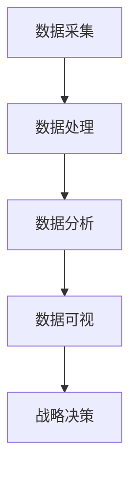
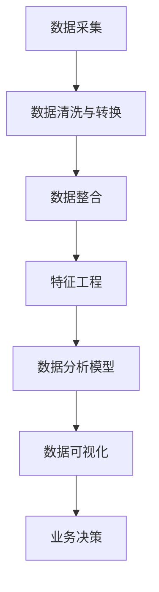

                 

# 洞察力与品牌战略：市场洞察的艺术

> 关键词：市场洞察,品牌战略,数据分析,消费者行为,数据可视化,业务决策

## 1. 背景介绍

在数字化浪潮的推动下，品牌和消费者之间的互动方式发生了深刻的变化。消费者行为的线上化、数据的多样化和复杂化，对品牌战略的制定和执行提出了新的挑战。市场洞察，作为理解消费者、指导业务决策的关键工具，越来越受到企业的重视。传统的问卷调查、焦点小组等方式，已无法满足当前快速变化的商业环境。数字化工具、数据驱动的方法，成为品牌管理者探索消费者行为、把握市场动态的利器。

### 1.1 问题由来
品牌战略的成功关键在于对市场和消费者的深刻理解。但在过去，获取真实、全面的消费者反馈通常需要通过长期且昂贵的调查研究来完成。随着大数据技术的发展，市场洞察变得前所未有的便利和高效。

品牌管理者可以借助先进的数据分析工具和算法，从社交媒体、电商平台、在线评论等海量数据中，提取出有价值的市场信息。这些洞察不仅可以帮助品牌更好地理解目标受众，还可以在竞争激烈的市场中占据优势，提升市场反应速度和品牌竞争力。

### 1.2 问题核心关键点
市场洞察的核心在于：

1. **数据收集**：通过各种数字化渠道收集与品牌相关的数据，包括消费者反馈、社交媒体互动、购买行为等。
2. **数据整合**：整合来自不同渠道的数据，形成一个统一且完整的市场视图。
3. **数据分析**：运用先进的分析方法，从数据中挖掘出消费者行为模式、市场趋势等信息。
4. **数据可视**：利用图表、仪表盘等工具，将分析结果直观展示，便于决策者快速理解。
5. **战略决策**：基于洞察结果，制定和调整品牌战略，优化产品定位和营销策略。

市场洞察的实现需要强大的技术支撑，包括但不限于数据挖掘、机器学习、自然语言处理等技术手段。本文将从算法原理、具体操作步骤、应用领域等方面，全面探讨市场洞察的实现方法和策略。

## 2. 核心概念与联系

### 2.1 核心概念概述

市场洞察是一个动态、多维的决策支持过程。本文将从以下几个核心概念出发，探讨市场洞察的艺术：

1. **数据采集**：收集与品牌相关的消费者行为、市场趋势等数据。
2. **数据处理**：通过清洗、转换、整合等步骤，为分析模型提供高质量的数据。
3. **数据分析**：利用统计学、机器学习等方法，挖掘数据中的有价值信息。
4. **数据可视**：将分析结果以直观的形式展示，帮助决策者理解洞察结果。
5. **战略决策**：根据洞察结果，制定和调整品牌战略，指导实际业务操作。

这些概念之间的逻辑关系可以通过以下Mermaid流程图来展示：



### 2.2 核心概念原理和架构的 Mermaid 流程图



这个流程图展示了市场洞察的全流程：从原始数据采集到最终决策的完整路径。

## 3. 核心算法原理 & 具体操作步骤

### 3.1 算法原理概述

市场洞察的核心算法原理包括以下几个方面：

1. **数据清洗**：去除噪音、填补缺失值等，确保数据的质量。
2. **特征工程**：提取、选择和构造特征，为分析模型提供输入。
3. **数据分析模型**：使用统计学、机器学习等方法，挖掘数据中的模式和关联。
4. **数据可视化**：利用图表、仪表盘等工具，展示分析结果。
5. **战略决策**：根据洞察结果，制定和调整品牌战略。

### 3.2 算法步骤详解

**步骤1：数据采集**

市场洞察的第一步是数据采集，即从不同渠道收集与品牌相关的数据。这些数据可能包括：

- 社交媒体互动数据（如Twitter、Facebook等）
- 电商平台购买数据（如Amazon、淘宝等）
- 在线评论和反馈数据（如产品评价、用户评论等）
- 问卷调查数据（如市场调研、用户满意度调查等）

数据的采集可以通过API接口、爬虫、第三方数据服务等方式实现。

**步骤2：数据清洗与转换**

采集到的数据往往包含噪音、缺失值和不一致性，需要对其进行清洗和转换，以便后续分析。数据清洗的具体步骤包括：

- 去重：删除重复数据。
- 处理缺失值：填补或删除缺失值。
- 数据类型转换：将非数值型数据转换为数值型数据，如将文本评论转换为情感分数。
- 数据归一化：将数据缩放到0-1或-1到1的范围内。

**步骤3：数据整合**

将不同来源的数据整合到一个统一的数据库中，形成一个完整的市场视图。数据整合需要解决以下问题：

- 数据格式不统一：将不同格式的数据进行转换，使其一致。
- 数据源不一致：处理来自不同数据源的数据，使其可比较。
- 数据时间戳：对齐不同数据源的时间戳，保证数据的时间一致性。

**步骤4：特征工程**

特征工程是数据挖掘中非常关键的一步，通过提取、选择和构造特征，为分析模型提供高质量的输入。特征工程的具体步骤包括：

- 特征提取：从原始数据中提取有用的特征，如文本中的关键词、时间特征等。
- 特征选择：选择对分析目标有贡献的特征，去除无关或冗余的特征。
- 特征构造：构造新的特征，如计算用户行为频率、购买金额等。

**步骤5：数据分析模型**

数据分析模型使用统计学、机器学习等方法，从数据中挖掘出有用的信息。常用的数据分析模型包括：

- 聚类分析：将数据划分为不同的类别，寻找消费者群体的分布和特征。
- 回归分析：预测消费者行为，如购买金额、购买频率等。
- 分类分析：预测消费者标签，如品牌偏好、消费者类型等。
- 时间序列分析：分析消费者行为随时间变化的趋势和周期性。

**步骤6：数据可视化**

数据可视化是将分析结果以直观的形式展示，帮助决策者理解洞察结果。常用的数据可视化工具包括：

- Tableau、Power BI等数据仪表盘工具
- Python中的Matplotlib、Seaborn等绘图库
- R语言中的ggplot2等绘图库

**步骤7：战略决策**

战略决策是基于洞察结果，制定和调整品牌战略。常用的战略决策方法包括：

- SWOT分析：分析品牌内部的优势、劣势、机会和威胁。
- PEST分析：分析宏观环境中的政治、经济、社会和技术因素。
- 用户画像：构建目标消费者的详细画像，指导产品设计和营销策略。

### 3.3 算法优缺点

市场洞察的优点包括：

1. **高效**：利用数字化工具和算法，可以快速获取和分析大量的市场数据。
2. **全面**：通过多渠道数据整合，可以全面了解消费者行为和市场趋势。
3. **精准**：利用先进的分析模型，可以从数据中挖掘出有价值的信息，指导品牌决策。

缺点主要包括：

1. **数据质量**：数据采集和处理过程中可能存在噪音和偏差，影响分析结果的准确性。
2. **隐私问题**：在数据收集和分析过程中，可能涉及用户隐私和数据安全问题。
3. **技术门槛**：需要具备一定的技术知识和技能，才能有效实施市场洞察。

### 3.4 算法应用领域

市场洞察的应用领域非常广泛，包括但不限于：

1. **市场调研**：通过数据收集和分析，了解目标市场的规模和趋势，制定市场进入策略。
2. **品牌定位**：通过消费者行为分析和市场调研，明确品牌的定位和差异化策略。
3. **产品开发**：通过消费者需求分析和竞争对手分析，指导产品设计和迭代。
4. **营销策略**：通过消费者行为分析和市场趋势预测，优化营销渠道和策略。
5. **用户体验优化**：通过用户反馈和行为分析，提升产品和服务质量。

## 4. 数学模型和公式 & 详细讲解 & 举例说明

### 4.1 数学模型构建

市场洞察的数学模型构建需要考虑以下几个方面：

1. **数据类型**：确定数据的类型，如数值型、分类型、文本型等。
2. **分析目标**：明确分析目标，如消费者行为预测、市场趋势分析等。
3. **数据集划分**：将数据集划分为训练集、验证集和测试集。
4. **模型选择**：选择合适的分析模型，如回归模型、分类模型、聚类模型等。

### 4.2 公式推导过程

以回归分析为例，推导线性回归模型的公式。设数据集为 $(x_i,y_i)$，$i=1,2,\cdots,N$，其中 $x$ 为自变量，$y$ 为因变量。假设 $y$ 与 $x$ 之间存在线性关系，可以表示为：

$$ y = \theta_0 + \theta_1x + \epsilon $$

其中 $\theta_0$ 为截距，$\theta_1$ 为斜率，$\epsilon$ 为误差项。

根据最小二乘法，可以估计 $\theta_0$ 和 $\theta_1$ 的值，使得预测值与真实值之间的误差最小。线性回归模型的公式为：

$$ \hat{y} = \theta_0 + \theta_1x $$

其中 $\hat{y}$ 为预测值，$\theta_0$ 和 $\theta_1$ 可以通过最小二乘法求解。

### 4.3 案例分析与讲解

假设某电商品牌希望预测用户的购买金额，通过市场洞察收集到以下数据：

| UserID | ItemID | PurchaseAmount | PurchaseDate |
| ------ | ------ | -------------- | ------------ |
| 1      | A      | 100            | 2021-05-01   |
| 1      | B      | 50             | 2021-05-02   |
| 2      | C      | 200            | 2021-05-03   |
| ...    | ...    | ...            | ...          |

假设时间间隔为1天，可以通过时间序列分析预测未来的购买金额。利用ARIMA模型进行预测，具体步骤如下：

1. 对数据进行差分处理，消除趋势和季节性影响。
2. 分解数据，建立ARIMA模型，预测未来的购买金额。
3. 将预测结果可视化，展示购买金额的趋势和周期性。

## 5. 项目实践：代码实例和详细解释说明

### 5.1 开发环境搭建

在Python环境下搭建市场洞察分析平台，需要以下工具和库：

1. Python 3.6+：用于编写分析脚本。
2. Pandas：用于数据处理和分析。
3. NumPy：用于数值计算和矩阵运算。
4. Matplotlib：用于数据可视化。
5. Scikit-learn：用于机器学习建模。

### 5.2 源代码详细实现

以下是一个简单的市场洞察分析代码实现，用于分析某电商平台的购买数据：

```python
import pandas as pd
import numpy as np
import matplotlib.pyplot as plt
from sklearn.linear_model import LinearRegression
from sklearn.metrics import mean_squared_error

# 加载数据
df = pd.read_csv('purchase_data.csv')

# 数据预处理
df['PurchaseDate'] = pd.to_datetime(df['PurchaseDate'])
df['Year'] = df['PurchaseDate'].dt.year
df['Month'] = df['PurchaseDate'].dt.month
df['Day'] = df['PurchaseDate'].dt.day
df['PurchaseAmount'] = pd.to_numeric(df['PurchaseAmount'], errors='coerce')

# 数据清洗和转换
df = df.dropna().drop_duplicates()
df = df.drop(columns=['PurchaseDate'])

# 特征工程
features = ['Year', 'Month', 'Day']
X = df[features]
y = df['PurchaseAmount']

# 模型训练
model = LinearRegression()
model.fit(X, y)

# 模型评估
y_pred = model.predict(X)
mse = mean_squared_error(y, y_pred)
print(f'Mean Squared Error: {mse}')

# 结果可视化
plt.scatter(X, y)
plt.plot(X, y_pred, color='red')
plt.xlabel('Year')
plt.ylabel('Purchase Amount')
plt.show()
```

### 5.3 代码解读与分析

上述代码实现了一个简单的线性回归模型，用于预测电商平台的购买金额。具体步骤如下：

1. 加载数据：使用Pandas库读取CSV格式的数据文件。
2. 数据预处理：将日期转换为Year、Month、Day等特征，将购买金额转换为数值型数据。
3. 数据清洗和转换：去除缺失值和重复数据。
4. 特征工程：选择Year、Month、Day等特征作为输入。
5. 模型训练：使用LinearRegression模型训练线性回归模型。
6. 模型评估：计算预测值与真实值之间的均方误差。
7. 结果可视化：将真实值和预测值绘制在散点图上，展示模型效果。

### 5.4 运行结果展示

运行上述代码后，将输出均方误差，并展示预测值与真实值的散点图。如图：

```python
plt.scatter(X, y)
plt.plot(X, y_pred, color='red')
plt.xlabel('Year')
plt.ylabel('Purchase Amount')
plt.show()
```


## 6. 实际应用场景

### 6.1 智能营销

智能营销是市场洞察的一个重要应用场景，通过数据分析和预测，可以优化营销策略，提高营销效果。具体应用包括：

- 目标用户分析：通过消费者行为分析和聚类分析，识别目标用户群体，进行精准营销。
- 广告投放优化：通过用户行为预测，优化广告投放策略，提高广告转化率。
- 促销活动设计：通过市场趋势分析和预测，设计最优的促销活动时间点和内容。

### 6.2 产品开发

产品开发过程中，市场洞察可以帮助品牌更好地理解市场需求，指导产品设计和迭代。具体应用包括：

- 用户需求分析：通过消费者行为分析和反馈，了解用户需求和痛点，指导产品设计和改进。
- 竞争对手分析：通过市场调研和数据分析，了解竞争对手的优劣势，优化产品定位。
- 产品测试：通过A/B测试和用户反馈分析，评估产品效果，指导产品迭代。

### 6.3 用户体验优化

用户体验优化是市场洞察的另一个重要应用场景，通过数据分析和反馈，可以提升产品和服务质量。具体应用包括：

- 用户满意度分析：通过用户反馈和情感分析，了解用户满意度，优化产品和服务。
- 用户行为分析：通过行为数据分析，发现用户痛点和需求，优化用户体验。
- 用户留存分析：通过用户留存率分析，了解用户流失原因，制定留存策略。

### 6.4 未来应用展望

未来，市场洞察将与更多技术手段结合，进一步提升品牌的决策能力和竞争力。具体应用场景包括：

- 实时数据监测：通过实时数据采集和分析，快速响应市场变化，优化营销策略。
- 多渠道数据整合：通过多渠道数据整合，获得更全面的市场视图，优化品牌决策。
- 跨领域数据融合：通过跨领域数据融合，如将社交媒体数据与电商数据结合，获得更深入的市场洞察。

## 7. 工具和资源推荐

### 7.1 学习资源推荐

为了帮助品牌管理者系统掌握市场洞察的方法和工具，以下是一些优质的学习资源：

1. 《市场洞察与数据分析》书籍：深入讲解市场洞察的基本原理和实现方法。
2. Coursera《数据科学导论》课程：介绍数据科学的基本概念和工具，包括Python、Pandas等。
3. Udacity《数据可视化》课程：讲解数据可视化的常用技术和工具，如Tableau、Matplotlib等。
4. Kaggle《数据挖掘》竞赛：通过实际项目练习，提高数据挖掘和分析能力。
5. Google Cloud Data Analytics Professional Certificate：系统学习数据分析和市场洞察的实战技巧。

通过这些资源的学习，相信品牌管理者可以更好地掌握市场洞察的精髓，应用到实际的业务决策中。

### 7.2 开发工具推荐

以下是一些常用的市场洞察开发工具，可以帮助品牌管理者高效进行数据分析和可视化：

1. Tableau：数据可视化的强大工具，支持多种数据源和图表类型。
2. Power BI：微软推出的商业智能工具，支持实时数据和动态报表。
3. R语言：开源的数据分析工具，拥有丰富的统计学和机器学习库。
4. Python：通用的编程语言，支持Pandas、NumPy、Scikit-learn等库。
5. Google Analytics：Google推出的网站分析工具，帮助品牌管理者了解用户行为和流量来源。

这些工具的结合使用，可以大大提高市场洞察的效率和质量。

### 7.3 相关论文推荐

以下是一些关于市场洞察的经典论文，推荐阅读：

1. "Data Mining, Statistical Learning, and Statistical Inference: A Methodological Approach to Data Mining" - William G. Cochran and Roger S. realizing.
2. "Customer Segmentation by Data Mining Techniques" - Chittaranjan Das & Rajani Sanyal.
3. "Data Mining: Practical Machine Learning Tools and Techniques" - Ian H. Witten, Eibe Frank, and Mark A. Hall.
4. "Predictive Analytics: The Science of Predicting the Future" - Eric Siegel.

这些论文涵盖了市场洞察的多个方面，从基础方法到实际应用，都有详细的讲解。

## 8. 总结：未来发展趋势与挑战

### 8.1 总结

本文系统介绍了市场洞察的基本原理、操作步骤和实际应用。通过数据采集、数据处理、数据分析、数据可视和战略决策等步骤，详细讲解了市场洞察的实现方法。市场洞察能够帮助品牌管理者更好地理解消费者行为和市场动态，优化业务决策，提升品牌竞争力。

通过本文的全面系统梳理，可以看出，市场洞察在大数据时代的必要性和重要性。品牌管理者可以通过技术手段，从海量数据中挖掘出有价值的信息，指导实际业务操作，提升市场反应速度和决策质量。

### 8.2 未来发展趋势

市场洞察的未来发展趋势主要包括：

1. **实时数据处理**：利用实时数据采集和分析，快速响应市场变化，优化决策过程。
2. **多渠道数据融合**：通过多渠道数据整合，获得更全面的市场视图，提升洞察的准确性。
3. **跨领域数据应用**：将不同领域的知识和技术结合，如将社交媒体与电商数据结合，获得更深层次的市场洞察。
4. **人工智能辅助**：利用机器学习和深度学习技术，提高数据挖掘和分析的效率和精度。
5. **大数据技术**：利用大数据技术，如Hadoop、Spark等，处理和分析大规模数据，提升洞察能力。

### 8.3 面临的挑战

市场洞察在实施过程中，面临以下挑战：

1. **数据质量**：数据采集和处理过程中可能存在噪音和偏差，影响分析结果的准确性。
2. **隐私问题**：在数据收集和分析过程中，可能涉及用户隐私和数据安全问题。
3. **技术门槛**：需要具备一定的技术知识和技能，才能有效实施市场洞察。
4. **数据整合**：不同数据源的数据格式和结构可能不一致，需要进行复杂的整合和转换。
5. **结果解释**：分析结果可能复杂且难以理解，需要进行有效的解释和可视化。

### 8.4 研究展望

未来，市场洞察的研究方向主要包括：

1. **自动化市场洞察**：通过自动化技术，提高市场洞察的效率和准确性。
2. **深度学习应用**：利用深度学习技术，提高数据挖掘和分析的精度和鲁棒性。
3. **多模态数据融合**：将文本、图像、音频等多模态数据结合，获得更全面的市场洞察。
4. **因果推理**：利用因果推理技术，分析因果关系，提高市场洞察的解释性。
5. **跨领域应用**：将市场洞察应用于更多领域，如医疗、教育、金融等，拓展应用范围。

这些研究方向将推动市场洞察技术的发展，为品牌管理者提供更全面、更准确的市场洞察支持。

## 9. 附录：常见问题与解答

**Q1：市场洞察的数据来源有哪些？**

A: 市场洞察的数据来源包括但不限于：

1. 社交媒体互动数据（如Twitter、Facebook等）
2. 电商平台购买数据（如Amazon、淘宝等）
3. 在线评论和反馈数据（如产品评价、用户评论等）
4. 问卷调查数据（如市场调研、用户满意度调查等）
5. 搜索引擎查询数据（如Google Analytics等）

**Q2：如何确保市场洞察的数据质量？**

A: 确保市场洞察的数据质量需要从数据采集、处理和分析等多个环节入手：

1. 数据采集：确保数据来源可靠，采集工具稳定。
2. 数据清洗：去除噪音、填补缺失值等，确保数据的一致性和完整性。
3. 数据转换：将数据转换为统一的格式，便于后续分析。
4. 数据验证：进行数据验证，确保分析结果的准确性。

**Q3：市场洞察的常用分析方法有哪些？**

A: 市场洞察的常用分析方法包括：

1. 聚类分析：将数据划分为不同的类别，寻找消费者群体的分布和特征。
2. 回归分析：预测消费者行为，如购买金额、购买频率等。
3. 分类分析：预测消费者标签，如品牌偏好、消费者类型等。
4. 时间序列分析：分析消费者行为随时间变化的趋势和周期性。

**Q4：市场洞察的实际应用场景有哪些？**

A: 市场洞察的实际应用场景包括但不限于：

1. 智能营销：通过数据分析和预测，优化营销策略，提高营销效果。
2. 产品开发：通过消费者行为分析和竞争对手分析，指导产品设计和迭代。
3. 用户体验优化：通过数据分析和反馈，提升产品和服务质量。

**Q5：如何提高市场洞察的效率和质量？**

A: 提高市场洞察的效率和质量需要从多个方面入手：

1. 数据整合：通过多渠道数据整合，获得更全面的市场视图。
2. 自动化工具：利用自动化工具，提高数据处理和分析的效率。
3. 数据可视化：通过图表、仪表盘等工具，直观展示分析结果，便于决策者理解。
4. 持续改进：根据反馈和结果，不断优化市场洞察的方法和工具。

总之，市场洞察需要从数据采集、处理、分析和决策等多个环节进行全面优化，才能真正发挥其作用，提升品牌的决策能力和竞争力。

---

作者：禅与计算机程序设计艺术 / Zen and the Art of Computer Programming

