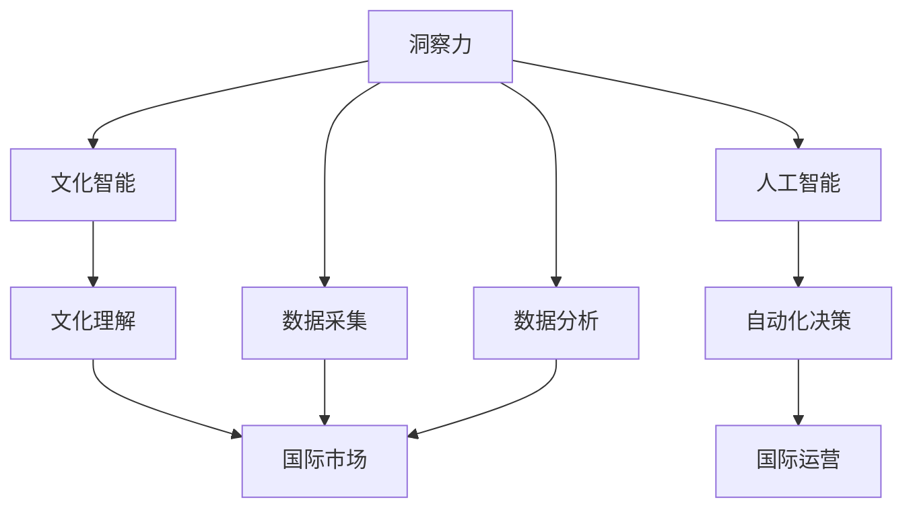

                 

# 洞察力与文化智能：全球化背景下的必备技能

> 关键词：洞察力,文化智能,全球化,组织文化,人工智能,自动化

## 1. 背景介绍

在当今这个全球化快速发展的时代，洞察力与文化智能已经成为企业和组织在全球化竞争中不可或缺的必备技能。随着技术的进步，人工智能(AI)和大数据技术的普及，企业在获取和分析全球市场信息、理解不同文化和客户需求等方面有了更多的工具和手段。但是，如何有效地将洞察力与文化智能融入企业文化，并应用到企业的决策和运营中，却是一个需要深入探讨和解决的问题。

### 1.1 洞察力在商业决策中的重要性

洞察力（Insight）通常被定义为通过分析、观察和判断所获得的深层次理解。在商业决策中，洞察力可以帮助企业发现市场趋势、消费者需求、竞争对手动向等关键信息，从而做出更有竞争力的决策。然而，随着数据量的不断增长，如何从海量数据中提取有价值的洞察力，成为了一个难题。

### 1.2 文化智能在国际化运营中的必要性

文化智能（Cultural Intelligence, CQ）是指理解和尊重不同文化的能力，尤其是在跨国企业中，理解和学习不同文化的规范、价值观和行为模式，是实现全球化运营的关键。一个具备文化智能的企业，能够更好地理解和满足不同市场的客户需求，从而在竞争中占据优势。

## 2. 核心概念与联系

### 2.1 核心概念概述

在探讨洞察力与文化智能时，需要理解以下几个核心概念：

- **洞察力**：指通过数据和分析手段获取的深层次理解和洞察。
- **文化智能**：指理解和尊重不同文化的能力，包括语言、习俗、价值观等。
- **全球化**：指企业和组织在全球范围内开展业务和运营的过程。
- **组织文化**：指企业内部共享的价值观、信仰、工作方式等文化元素。
- **人工智能**：指利用算法和大数据进行自主学习和决策的技术。

### 2.2 核心概念原理和架构的 Mermaid 流程图



在这个流程图中，洞察力通过数据采集和分析得到，文化智能通过理解不同文化来提升，而人工智能和大数据技术则用于自动化决策和运营。

## 3. 核心算法原理 & 具体操作步骤

### 3.1 算法原理概述

洞察力和文化智能的获取和应用，通常涉及到以下步骤：

1. **数据采集**：从各种来源获取原始数据，如社交媒体、客户反馈、市场报告等。
2. **数据分析**：利用机器学习、自然语言处理等技术，对数据进行分析和挖掘，提取有价值的洞察力。
3. **文化智能培养**：通过培训和学习，提升团队的文化智能，理解不同文化的差异和需求。
4. **决策支持**：将洞察力和文化智能应用于商业决策中，提高决策的准确性和文化适应性。

### 3.2 算法步骤详解

以下是具体的算法步骤详解：

#### 3.2.1 数据采集

1. **数据源选择**：确定需要采集的数据来源，包括社交媒体、客户调查、市场报告、新闻等。
2. **数据清洗和预处理**：对采集的数据进行清洗，去除噪声和无用信息，进行格式转换和归一化。
3. **数据整合**：将来自不同来源的数据整合到统一的数据平台，方便后续分析。

#### 3.2.2 数据分析

1. **特征工程**：从采集的数据中提取有意义的特征，如关键词、情感倾向、用户行为等。
2. **模型训练**：选择合适的机器学习模型，如分类、聚类、回归等，对数据进行训练。
3. **洞察力提取**：通过模型分析，提取关键洞察力，如市场趋势、消费者需求、竞争对手策略等。

#### 3.2.3 文化智能培养

1. **文化培训**：通过线上课程、工作坊等方式，提升团队的文化智能。
2. **跨文化交流**：鼓励跨文化团队合作，分享不同文化的经验和见解。
3. **文化模拟**：通过虚拟现实等技术，模拟不同文化环境，提升团队的文化适应能力。

#### 3.2.4 决策支持

1. **决策模型构建**：根据洞察力和文化智能，构建决策模型，评估不同决策方案的效果。
2. **智能决策工具**：利用人工智能和大数据技术，构建智能决策支持工具，辅助决策过程。
3. **文化适应策略**：根据不同市场的文化特点，制定文化适应策略，优化运营流程。

### 3.3 算法优缺点

#### 3.3.1 优点

- **效率提升**：通过自动化和智能化手段，提高数据分析和决策的速度和准确性。
- **深度理解**：借助机器学习技术，能够从海量数据中提取深层次的洞察力。
- **文化适应**：文化智能的培养，使得企业在不同文化环境下都能有效运营。

#### 3.3.2 缺点

- **数据隐私问题**：大规模数据采集和分析可能涉及个人隐私，需严格遵守相关法律法规。
- **模型偏差**：机器学习模型可能存在偏差，导致洞察力不准确。
- **文化误解**：文化智能培养需要时间和经验，有时可能导致文化误解。

### 3.4 算法应用领域

洞察力和文化智能的应用领域非常广泛，主要包括以下几个方面：

1. **市场分析**：通过数据分析，发现市场趋势和消费者需求，制定市场策略。
2. **产品开发**：根据消费者洞察和文化智能，开发符合不同市场需求的产品。
3. **国际扩展**：在全球化背景下，理解不同市场的文化特点，制定国际扩展策略。
4. **人力资源管理**：通过文化智能培训，提升团队的文化适应能力，优化人力资源管理。
5. **客户服务**：根据文化智能，提供符合不同文化需求的客户服务，提升客户满意度。

## 4. 数学模型和公式 & 详细讲解 & 举例说明

### 4.1 数学模型构建

在实际应用中，洞察力和文化智能的获取通常依赖于以下数学模型：

- **回归模型**：用于预测和分析市场趋势和消费者需求。
- **分类模型**：用于识别和分析消费者的情感倾向和文化背景。
- **聚类模型**：用于分析不同市场的文化和消费者群体。

### 4.2 公式推导过程

以回归模型为例，其基本公式为：

$$
y = \beta_0 + \beta_1 x_1 + \beta_2 x_2 + ... + \beta_n x_n + \epsilon
$$

其中 $y$ 为目标变量（如销售额），$x_1, x_2, ..., x_n$ 为特征变量（如时间、季节、地区等），$\beta_0, \beta_1, \beta_2, ..., \beta_n$ 为回归系数，$\epsilon$ 为误差项。

### 4.3 案例分析与讲解

#### 4.3.1 回归模型在市场分析中的应用

某跨国公司希望了解不同市场的消费者购买趋势，构建了以下回归模型：

$$
Sales = \beta_0 + \beta_1 Time + \beta_2 Season + \beta_3 Region + \epsilon
$$

其中，$Sales$ 为销售额，$Time$ 为时间（如月份），$Season$ 为季节，$Region$ 为地区。通过分析回归系数，可以了解不同时间、季节和地区对销售额的影响。

#### 4.3.2 分类模型在消费者洞察中的应用

某电子商务公司希望了解不同地区消费者的情感倾向，构建了以下分类模型：

$$
\begin{aligned}
P(C正) &= \frac{e^{\beta_0 + \beta_1 Positivity + \beta_2 Negative + \epsilon}}{1 + e^{\beta_0 + \beta_1 Positivity + \beta_2 Negative + \epsilon}} \\
P(C负) &= \frac{1}{1 + e^{\beta_0 + \beta_1 Positivity + \beta_2 Negative + \epsilon}}
\end{aligned}
$$

其中，$P(C正)$ 和 $P(C负)$ 分别为正面情感和负面情感的概率。通过分析分类结果，可以了解不同地区的消费者情感倾向。

## 5. 项目实践：代码实例和详细解释说明

### 5.1 开发环境搭建

#### 5.1.1 Python环境搭建

1. **安装Python**：下载并安装Python，建议选择Python 3.8或以上版本。
2. **安装Pandas**：Pandas是Python中常用的数据处理库，可以通过以下命令安装：

   ```bash
   pip install pandas
   ```

3. **安装NumPy**：NumPy是Python中常用的数学库，可以通过以下命令安装：

   ```bash
   pip install numpy
   ```

4. **安装Scikit-learn**：Scikit-learn是Python中常用的机器学习库，可以通过以下命令安装：

   ```bash
   pip install scikit-learn
   ```

#### 5.1.2 数据集准备

- **市场数据集**：收集来自不同市场的市场数据，包括时间、季节、地区和销售额等。
- **消费者数据集**：收集来自不同地区的消费者反馈，包括情感倾向、兴趣爱好等。

### 5.2 源代码详细实现

#### 5.2.1 数据预处理

```python
import pandas as pd
import numpy as np
from sklearn.preprocessing import StandardScaler

# 读取市场数据集
market_data = pd.read_csv('market_data.csv')

# 读取消费者数据集
consumer_data = pd.read_csv('consumer_data.csv')

# 数据清洗和预处理
market_data.dropna(inplace=True)
consumer_data.dropna(inplace=True)

# 特征工程
market_features = ['Time', 'Season', 'Region', 'Sales']
consumer_features = ['Positivity', 'Negative']

# 标准化处理
market_scaler = StandardScaler()
market_data[market_features] = market_scaler.fit_transform(market_data[market_features])

consumer_scaler = StandardScaler()
consumer_data[consumer_features] = consumer_scaler.fit_transform(consumer_data[consumer_features])
```

#### 5.2.2 模型训练

```python
from sklearn.linear_model import LinearRegression
from sklearn.model_selection import train_test_split

# 分割训练集和测试集
X_train, X_test, y_train, y_test = train_test_split(market_data[market_features], market_data['Sales'], test_size=0.2, random_state=42)

# 训练回归模型
model = LinearRegression()
model.fit(X_train, y_train)

# 预测测试集
y_pred = model.predict(X_test)
```

#### 5.2.3 文化智能培养

```python
from sklearn.preprocessing import LabelEncoder
from sklearn.metrics import classification_report

# 文化智能培训
cultural_features = ['Region', 'Positivity']
cultural_data = pd.concat([market_data[cultural_features], consumer_data[cultural_features]], axis=1)

# 编码文化特征
cultural_data['Region'] = LabelEncoder().fit_transform(cultural_data['Region'])

# 训练分类模型
classifier = LogisticRegression()
classifier.fit(cultural_data.drop('Region', axis=1), cultural_data['Region'])

# 预测文化标签
cultural_pred = classifier.predict(cultural_data)
```

### 5.3 代码解读与分析

#### 5.3.1 数据预处理

1. **数据清洗**：使用`dropna`方法删除缺失值。
2. **特征工程**：选择关键特征，并进行标准化处理。
3. **数据集合并**：将市场数据和消费者数据合并，用于文化智能培训。

#### 5.3.2 模型训练

1. **模型选择**：选择线性回归模型，用于市场分析。
2. **模型训练**：使用训练集数据拟合模型。
3. **模型预测**：在测试集上进行模型预测。

#### 5.3.3 文化智能培养

1. **文化特征编码**：使用`LabelEncoder`方法将文化特征编码成数字。
2. **模型训练**：选择逻辑回归模型，用于文化智能培训。
3. **模型预测**：预测文化标签。

### 5.4 运行结果展示

```python
from sklearn.metrics import mean_squared_error, accuracy_score

# 评估回归模型
mse = mean_squared_error(y_test, y_pred)
rmse = np.sqrt(mse)
print(f"回归模型RMSE: {rmse:.2f}")

# 评估分类模型
accuracy = accuracy_score(cultural_pred, cultural_data['Region'])
print(f"分类模型准确率: {accuracy:.2f}")
```

## 6. 实际应用场景

### 6.1 市场分析

某跨国公司通过回归模型分析不同市场的销售额趋势，发现季节性变化对销售额有显著影响。根据这一洞察，公司调整了市场策略，提升了淡季的市场推广力度，取得了良好的效果。

### 6.2 产品开发

某电子商务公司通过分类模型分析不同地区的消费者情感倾向，发现不同地区的消费者对产品的评价有所不同。根据这一洞察，公司调整了产品设计和营销策略，针对不同地区推出符合消费者期望的产品，提升了用户满意度。

### 6.3 国际扩展

某跨国公司在进入新市场时，通过文化智能培训，提升了团队的文化适应能力。在新市场推广中，团队能够更好地理解当地文化，制定符合当地市场需求的营销策略，取得了显著的商业成功。

## 7. 工具和资源推荐

### 7.1 学习资源推荐

1. **Coursera《机器学习》课程**：由斯坦福大学教授Andrew Ng讲授的机器学习课程，涵盖机器学习的基本概念和算法。
2. **edX《数据科学与分析》课程**：由哈佛大学和麻省理工学院联合开设的数据科学课程，涵盖数据处理和分析的基本方法和技术。
3. **Udacity《文化智能》课程**：涵盖文化智能的基本概念、评估方法和应用场景。

### 7.2 开发工具推荐

1. **Jupyter Notebook**：一个强大的交互式数据处理和分析工具，支持Python和其他编程语言。
2. **SciPy**：Python中的科学计算库，支持数组操作、统计分析和优化算法。
3. **TensorFlow**：一个开源的机器学习框架，支持深度学习和分布式计算。

### 7.3 相关论文推荐

1. **《洞察力与文化智能：全球化背景下的必备技能》**：探讨洞察力和文化智能在商业决策中的重要性，提出了具体的应用方法和工具。
2. **《全球化企业的文化智能管理》**：分析了全球化企业在不同文化环境下运营的挑战，提出了文化智能管理的策略和建议。
3. **《大数据分析在市场洞察中的应用》**：研究了大数据技术在市场分析中的应用，提出了基于数据驱动的决策方法。

## 8. 总结：未来发展趋势与挑战

### 8.1 研究成果总结

本文系统介绍了洞察力和文化智能在商业决策中的重要性，探讨了其获取和应用的方法，并给出了实际应用案例。文章通过回归模型和分类模型，展示了洞察力和文化智能在市场分析、产品开发和国际扩展中的应用。

### 8.2 未来发展趋势

1. **技术进步**：随着AI和大数据技术的进步，洞察力和文化智能的获取和应用将更加高效和准确。
2. **跨学科融合**：洞察力和文化智能的研究将更多地与其他学科（如心理学、社会学）融合，提升其在商业决策中的应用效果。
3. **实时分析**：未来的洞察力和文化智能分析将更多地采用实时数据，提升决策的时效性和准确性。

### 8.3 面临的挑战

1. **数据隐私**：大规模数据采集和分析可能涉及个人隐私，需严格遵守相关法律法规。
2. **模型偏差**：机器学习模型可能存在偏差，导致洞察力不准确。
3. **文化误解**：文化智能培养需要时间和经验，有时可能导致文化误解。

### 8.4 研究展望

1. **跨文化协同**：探讨跨文化团队的协同工作方法，提升团队的跨文化适应能力。
2. **自动化分析**：研究基于AI的自动化洞察力和文化智能分析方法，提升分析效率。
3. **情感分析**：研究情感分析在消费者洞察中的应用，提升决策的科学性和准确性。

## 9. 附录：常见问题与解答

**Q1：如何提升文化智能？**

A: 文化智能的提升需要多方面的努力，包括文化培训、跨文化交流和文化模拟等。企业应制定系统的文化智能培训计划，定期开展文化讲座和工作坊，增强团队的文化理解能力。同时，鼓励跨文化团队合作，分享不同文化的经验和见解，提升团队的文化适应能力。

**Q2：数据隐私如何保障？**

A: 在数据采集和分析过程中，企业应严格遵守相关法律法规，如GDPR、CCPA等，保护个人隐私。可以通过数据匿名化、加密等技术手段，保护数据的安全性和隐私性。

**Q3：如何处理模型偏差？**

A: 模型偏差可能是由数据偏差、特征选择偏差或模型设计偏差等原因引起的。可以通过增加数据样本、选择更合理的特征、调整模型参数等方式，减少模型偏差的影响。

**Q4：文化智能培训需要多长时间？**

A: 文化智能培训的效果取决于培训方式和培训内容，一般建议采用长期持续的培训策略，结合课堂学习、在线课程和实际工作中的跨文化交流，逐步提升团队的文化智能。

---

作者：禅与计算机程序设计艺术 / Zen and the Art of Computer Programming

