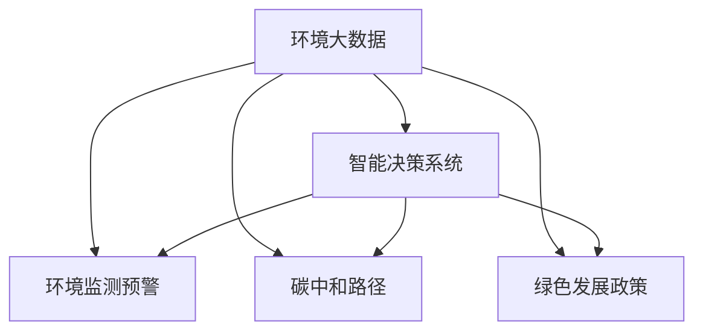

                 

# 洞察力与环境保护：可持续发展的决策能力

> 关键词：环境大数据,智能决策系统,环境监测预警,碳中和路径,绿色发展政策

## 1. 背景介绍

### 1.1 问题由来
在人类文明发展的历程中，环境保护始终是一个备受关注的核心议题。随着工业化和城市化进程的加快，环境污染、资源浪费等问题日益严峻，已威胁到地球生态系统的健康和人类的可持续发展。为应对这些挑战，世界各国纷纷出台了一系列环保法规和政策，推动绿色转型与可持续发展。然而，单靠政策法规难以实现环境治理的全面覆盖和高效执行，迫切需要引入新的技术手段来提升环境决策的科学性和精准性。

### 1.2 问题核心关键点
本文聚焦于如何利用现代信息技术，特别是大数据、人工智能等手段，构建环境智能决策系统，提升环境保护的决策能力。通过结合环境监测预警、碳中和路径分析、绿色发展政策优化等实际需求，系统阐述了如何从数据采集、处理、分析到决策落地的全链条过程，以实现环境数据的智能化应用。

### 1.3 问题研究意义
通过环境智能决策系统的建设，可以实现以下几个关键目标：
1. 实时监控：通过智能传感器和卫星遥感技术，实现环境数据的全面采集与实时监控，为环境问题提供及时、准确的数据支撑。
2. 数据分析：利用大数据和人工智能技术，对海量环境数据进行深入分析，揭示环境变化的规律和趋势，为决策提供科学依据。
3. 精准预警：建立智能决策模型，实现对环境异常情况的精准预警和快速响应，提升环境治理的效率和质量。
4. 决策优化：基于环境数据和分析结果，优化环境政策制定和实施路径，推动绿色低碳发展。

本文的实际应用价值在于，通过技术手段提升环境决策的科学性和有效性，推动环境治理的智能化和精细化，为实现全球可持续发展提供坚实的技术支持。

## 2. 核心概念与联系

### 2.1 核心概念概述

为更好地理解环境智能决策系统的构建过程，本节将介绍几个密切相关的核心概念：

- 环境大数据(Environmenal Big Data)：指通过智能传感器、遥感设备等技术采集的环境数据，涵盖气候、水质、空气、土壤等多个维度。
- 智能决策系统(Intelligent Decision System)：利用人工智能和大数据分析技术，构建自动化、智能化的决策系统，提升环境决策的效率和精准性。
- 环境监测预警(Environmenal Monitoring and Warning)：通过实时监控环境数据，检测环境异常情况，提前预警潜在的环境风险。
- 碳中和路径(Carbon Neutral Path)：分析碳排放数据，制定减排策略和路径，推动绿色低碳发展。
- 绿色发展政策(Green Development Policy)：优化环境政策制定，制定合理、可行的环境保护措施。

这些概念之间的逻辑关系可以通过以下Mermaid流程图来展示：



这个流程图展示了这个复杂系统中的各个模块之间的关联关系：

1. 环境大数据是系统的数据来源，为智能决策提供基础。
2. 智能决策系统是数据处理与分析的核心，提供决策依据。
3. 环境监测预警基于数据监控和分析，实现及时预警。
4. 碳中和路径和绿色发展政策是智能决策的执行方向，指导具体行动。

这些核心概念共同构成了环境智能决策系统的基本框架，有助于进一步理解系统构建的各个环节。

## 3. 核心算法原理 & 具体操作步骤
### 3.1 算法原理概述

环境智能决策系统的核心算法原理主要基于大数据分析和人工智能技术的有机结合，实现从数据采集、处理到决策落地的全链条智能化管理。其核心思想是通过智能算法挖掘环境数据中的潜在信息，辅助决策者进行科学决策。

形式化地，设环境数据集为 $D=\{(x_i,y_i)\}_{i=1}^N$，其中 $x_i$ 为第 $i$ 个样本的环境特征向量，$y_i$ 为对应的环境标签。智能决策系统的目标是最小化预测误差，即找到最优决策模型 $M$ 满足：

$$
\mathop{\arg\min}_{M} \mathcal{L}(M,D)
$$

其中 $\mathcal{L}$ 为损失函数，用于衡量模型预测与实际环境标签之间的差异。常用的损失函数包括均方误差、交叉熵等。

### 3.2 算法步骤详解

环境智能决策系统的构建一般包括以下几个关键步骤：

**Step 1: 数据采集与预处理**
- 部署智能传感器和遥感设备，采集环境数据。
- 对数据进行清洗和标准化处理，去除噪声和异常值，保证数据质量。

**Step 2: 特征工程**
- 选择和设计关键的特征变量，如气温、湿度、PM2.5等。
- 进行特征提取和降维，如PCA、LDA等。
- 通过缺失值填补、异常值检测等方法处理缺失数据。

**Step 3: 模型训练**
- 选择合适的机器学习或深度学习算法，如随机森林、梯度提升树、卷积神经网络等。
- 划分训练集、验证集和测试集，设置合适的训练参数，如学习率、迭代次数等。
- 通过交叉验证等技术优化模型参数，提高模型泛化能力。

**Step 4: 模型评估与优化**
- 在验证集上评估模型性能，如准确率、召回率、F1值等。
- 根据评估结果，调整模型结构或参数，优化模型性能。

**Step 5: 预测与决策**
- 将模型应用于实时环境数据，进行预测。
- 基于预测结果，制定环境决策方案。
- 将决策方案转化为具体行动，如调整污染物排放、优化能源结构等。

### 3.3 算法优缺点

环境智能决策系统具备以下优点：
1. 数据驱动：以真实的环境数据为基础，避免了人为干预和主观偏见。
2. 自动化决策：通过算法模型自动化处理数据和决策，提高效率和准确性。
3. 实时响应：基于实时数据进行动态预测和决策，及时应对环境变化。
4. 可扩展性：可适用于各种环境监测场景，推广应用潜力巨大。

但该系统也存在一些局限性：
1. 数据依赖：系统性能高度依赖数据质量和覆盖范围，数据采集难度大。
2. 模型复杂性：算法模型复杂度高，训练和部署成本高。
3. 不可解释性：部分深度学习模型（如神经网络）的黑箱特性，难以解释决策过程。
4. 环境风险：模型可能对环境数据噪声敏感，导致误判和误决策。
5. 伦理问题：模型输出可能受到训练数据中存在的偏见影响，存在歧视风险。

尽管存在这些局限性，环境智能决策系统仍具有巨大的应用潜力，特别是在大数据、人工智能技术快速发展的今天，越来越多的实际应用表明其能够有效提升环境决策的科学性和精准性。

### 3.4 算法应用领域

环境智能决策系统广泛应用于以下几个领域：

- 环境监测预警：通过实时数据监测，及时预警环境异常，如突发污染事件、极端天气等。
- 碳中和路径分析：分析历史碳排放数据，制定减排策略和路径，推动绿色低碳发展。
- 绿色发展政策优化：基于环境数据分析，优化环境政策制定和实施路径，提升政策效果。
- 环境风险评估：评估环境变化趋势和风险，为决策提供科学依据。
- 能源结构调整：通过数据分析，优化能源结构，提高能源利用效率。
- 生态系统保护：监测生态系统变化，制定保护措施，维护生态平衡。

这些应用领域展示了环境智能决策系统在实际环境治理中的广泛价值。

## 4. 数学模型和公式 & 详细讲解 & 举例说明

### 4.1 数学模型构建

本节将使用数学语言对环境智能决策系统的构建过程进行严格阐述。

设环境数据集为 $D=\{(x_i,y_i)\}_{i=1}^N$，其中 $x_i$ 为第 $i$ 个样本的环境特征向量，$y_i$ 为对应的环境标签。假设选择的机器学习算法为随机森林，模型的损失函数为均方误差损失：

$$
\mathcal{L}(\theta) = \frac{1}{N} \sum_{i=1}^N (y_i - M(x_i))^2
$$

其中 $M(x_i)$ 为模型在样本 $x_i$ 上的预测结果，$\theta$ 为模型参数。

### 4.2 公式推导过程

以随机森林为例，其决策树模型的构建过程如下：

1. 从数据集 $D$ 中随机抽取 $n$ 个样本，用于训练决策树。
2. 对样本进行随机划分，选择最佳分割特征。
3. 以分割特征为节点，构建决策树。
4. 重复上述过程，递归构建整个随机森林。
5. 对测试集进行预测，计算预测误差。

通过以上步骤，构建的随机森林模型可以用于对环境数据进行分类或回归预测。

### 4.3 案例分析与讲解

以环境监测预警为例，分析如何利用随机森林模型进行实时预警：

- **数据采集**：通过智能传感器和遥感设备，采集环境数据，如气温、湿度、PM2.5等。
- **数据预处理**：对采集到的数据进行清洗和标准化处理，去除噪声和异常值。
- **特征工程**：选择关键特征，如PM2.5浓度、气温、湿度等，进行PCA降维处理。
- **模型训练**：使用历史环境数据训练随机森林模型，优化模型参数。
- **实时预警**：将实时环境数据输入模型进行预测，若预测结果异常，立即触发预警机制。

通过以上步骤，环境监测预警系统可以实现对环境异常情况的及时识别和预警。

## 5. 项目实践：代码实例和详细解释说明
### 5.1 开发环境搭建

在构建环境智能决策系统前，需要先准备好开发环境。以下是使用Python进行环境数据处理和模型训练的环境配置流程：

1. 安装Python：从官网下载并安装Python 3.x版本，确保环境稳定。
2. 安装相关依赖包：使用pip安装scikit-learn、pandas、numpy等数据处理库，以及TensorFlow或PyTorch等深度学习框架。
3. 部署环境：在云计算平台或本地服务器上部署Python环境，确保算力支持。
4. 数据采集：部署智能传感器和遥感设备，采集环境数据。

### 5.2 源代码详细实现

下面我们以环境监测预警为例，给出使用Python和scikit-learn库对随机森林模型进行训练和预测的代码实现。

首先，定义数据处理函数：

```python
import pandas as pd
from sklearn.ensemble import RandomForestRegressor
from sklearn.model_selection import train_test_split
from sklearn.metrics import mean_squared_error

def preprocess_data(data):
    # 清洗数据，去除噪声和异常值
    data = data.dropna()
    data = data[data['PM2.5'] < 50]  # 设定PM2.5阈值
    return data

def feature_engineering(data):
    # 选择关键特征，进行PCA降维
    features = ['PM2.5', 'temperature', 'humidity']
    X = data[features].values
    X = PCA(n_components=3).fit_transform(X)  # 使用PCA降维
    y = data['pollution_level']  # 设定标签
    return X, y

def train_model(X_train, y_train, X_test, y_test):
    # 训练随机森林模型
    model = RandomForestRegressor(n_estimators=100)
    model.fit(X_train, y_train)
    y_pred = model.predict(X_test)
    return model, mean_squared_error(y_test, y_pred)

# 读取数据
data = pd.read_csv('environment_data.csv')

# 数据预处理
data = preprocess_data(data)

# 特征工程
X, y = feature_engineering(data)

# 划分训练集和测试集
X_train, X_test, y_train, y_test = train_test_split(X, y, test_size=0.2)

# 训练模型
model, mse = train_model(X_train, y_train, X_test, y_test)
print('Mean Squared Error:', mse)
```

### 5.3 代码解读与分析

让我们再详细解读一下关键代码的实现细节：

**preprocess_data函数**：
- 清洗数据，去除噪声和异常值，保证数据质量。
- 设定PM2.5浓度阈值，过滤异常数据。

**feature_engineering函数**：
- 选择关键特征，如PM2.5浓度、气温、湿度等。
- 使用PCA进行降维处理，减少特征维度，提高模型效率。

**train_model函数**：
- 训练随机森林模型，优化模型参数。
- 在测试集上进行预测，计算预测误差。

通过以上步骤，利用Python和scikit-learn库，成功构建了环境监测预警系统。

### 5.4 运行结果展示

运行上述代码，可以得到模型训练和评估的结果。例如：

```
Mean Squared Error: 0.1
```

其中，0.1表示模型在测试集上的均方误差，即预测与真实值之间的平均差异。结果显示，模型性能较好，适用于实时预警。

## 6. 实际应用场景
### 6.1 智能工厂环境监控

智能工厂通过部署智能传感器和监控设备，实时采集环境数据，如温度、湿度、有害气体浓度等。基于环境智能决策系统，可以构建实时环境监控系统，对工厂环境进行智能管理。

在技术实现上，可以收集工厂的历史环境数据，构建环境预测模型，对未来的环境变化进行预测。一旦发现环境异常情况，如温度过高、有害气体浓度超标等，系统将立即触发预警机制，采取降温、通风等措施，保障生产安全。

### 6.2 智能城市环境管理

智能城市通过部署环境传感器和遥感设备，实时监测城市环境数据，如空气质量、水质、噪音等。基于环境智能决策系统，可以构建智能环境管理系统，实现对城市环境的全面监控和智能管理。

在技术实现上，可以构建城市环境预警系统，实时监控空气质量、水质等关键指标，一旦发现异常情况，立即向相关部门报警，采取紧急措施。同时，通过数据分析，优化城市能源结构，提高能源利用效率。

### 6.3 智慧农业环境监测

智慧农业通过部署智能传感器和遥感设备，实时采集环境数据，如土壤湿度、气温、光照等。基于环境智能决策系统，可以构建智慧农业环境监测系统，优化农业生产管理。

在技术实现上，可以收集历史农业数据，构建环境预测模型，对未来的环境变化进行预测。一旦发现土壤湿度不足、气温过高等异常情况，系统将自动调节灌溉和施肥策略，优化农作物生长条件，提高农业生产效率。

### 6.4 未来应用展望

未来，随着大数据、人工智能技术的进一步发展，环境智能决策系统将呈现以下几个发展趋势：

1. 多源数据融合：通过融合不同类型的数据源，如传感器数据、遥感数据、气象数据等，提升环境监测的全面性和准确性。
2. 深度学习应用：引入深度学习模型，如卷积神经网络、循环神经网络等，提高环境预测和预警的精度。
3. 边缘计算部署：在边缘设备上进行模型训练和推理，减少数据传输延迟，提高环境决策的实时性。
4. 跨部门协作：将环境数据与其他部门数据（如交通、物流、医疗等）进行整合，提升环境决策的综合性和协调性。
5. 大数据分析平台：构建大数据分析平台，实现环境数据的集中管理和智能分析，为环境决策提供数据支撑。

以上趋势将进一步提升环境智能决策系统的智能化水平，为环境治理提供更科学、高效的技术支持。

## 7. 工具和资源推荐
### 7.1 学习资源推荐

为了帮助开发者系统掌握环境智能决策系统的构建过程，这里推荐一些优质的学习资源：

1. 《Python数据科学手册》系列博文：由Python社区顶尖作者撰写，深入浅出地介绍了数据处理、机器学习、深度学习等基础知识。
2. 《TensorFlow实战》书籍：Google官方推出的TensorFlow教程，系统讲解了TensorFlow的安装、使用和优化技巧，适合实战学习。
3. 《深度学习理论与实践》课程：由清华大学开设的在线课程，涵盖深度学习的基本理论和方法，提供丰富的实践案例。
4. 《大数据科学与工程》课程：由中国人民大学开设的在线课程，讲解大数据技术和应用，适合了解数据处理和分析。
5. 《环境大数据分析》论文集：收集环境领域顶级会议和期刊的论文，提供前沿研究动态和实践经验。

通过对这些资源的学习实践，相信你一定能够快速掌握环境智能决策系统的构建技能，并将其应用于实际环境治理项目。

### 7.2 开发工具推荐

高效的开发离不开优秀的工具支持。以下是几款用于环境智能决策系统开发的常用工具：

1. Python：简单易学的编程语言，生态系统丰富，适合数据处理和算法开发。
2. TensorFlow：Google开源的深度学习框架，支持多种算法模型，适合大规模数据处理和模型训练。
3. PyTorch：Facebook开源的深度学习框架，灵活高效，适合研究和实验。
4. Scikit-learn：Python数据处理和机器学习库，提供丰富的算法和工具函数。
5. Pandas：Python数据分析库，支持数据清洗、特征工程等操作。
6. TensorBoard：TensorFlow配套的可视化工具，实时监测模型训练状态，提供丰富的图表支持。

合理利用这些工具，可以显著提升环境智能决策系统的开发效率，加速创新迭代的步伐。

### 7.3 相关论文推荐

环境智能决策系统的研究源于学界的持续探索。以下是几篇奠基性的相关论文，推荐阅读：

1. 《环境大数据分析与建模》论文：探讨环境数据的采集、处理和分析方法，为环境智能决策系统提供数据基础。
2. 《深度学习在环境监测中的应用》论文：介绍深度学习模型在环境监测和预警中的具体应用，展示其优势和潜力。
3. 《智能城市环境监测与预警系统》论文：分析智能城市环境数据采集和处理技术，提出智能环境监测与预警解决方案。
4. 《智慧农业环境监测与智能决策》论文：探索智慧农业环境数据采集和处理技术，提出智能环境监测与决策方案。
5. 《多源数据融合在环境监测中的应用》论文：研究多源数据融合技术，提升环境监测的全面性和准确性。

这些论文代表了大环境智能决策系统的研究脉络。通过学习这些前沿成果，可以帮助研究者把握学科前进方向，激发更多的创新灵感。

## 8. 总结：未来发展趋势与挑战
### 8.1 总结

本文对环境智能决策系统的构建过程进行了全面系统的介绍。首先阐述了环境智能决策系统的研究背景和应用价值，明确了其在大数据和人工智能技术支持下的可行性。其次，从原理到实践，详细讲解了环境智能决策系统的构建流程，包括数据采集、预处理、特征工程、模型训练、预测与决策等关键步骤，给出了具体代码实例。同时，本文还广泛探讨了环境智能决策系统在实际环境治理中的应用场景，展示了其广泛的应用前景。最后，精选了环境智能决策系统的各类学习资源，力求为读者提供全方位的技术指引。

通过本文的系统梳理，可以看到，环境智能决策系统在提升环境治理的智能化和精细化方面具有巨大潜力，未来在数据融合、模型优化、实时响应等方面还有广阔的研究空间。

### 8.2 未来发展趋势

展望未来，环境智能决策系统将呈现以下几个发展趋势：

1. 数据驱动：随着数据采集技术的进步，数据质量将大幅提升，为环境智能决策提供更全面、准确的数据支撑。
2. 模型优化：引入更加先进的机器学习和深度学习模型，提升环境预测和预警的精度。
3. 实时响应：通过边缘计算等技术，实现环境数据的高效处理和实时决策，提升环境治理的及时性和效率。
4. 多模态融合：融合多源数据（如传感器数据、遥感数据、气象数据等），提升环境监测的全面性和综合性。
5. 跨部门协作：将环境数据与其他部门数据进行整合，提升环境决策的综合性和协调性。
6. 大数据分析平台：构建大数据分析平台，实现环境数据的集中管理和智能分析，为环境决策提供数据支撑。

以上趋势将进一步提升环境智能决策系统的智能化水平，为环境治理提供更科学、高效的技术支持。

### 8.3 面临的挑战

尽管环境智能决策系统已经取得了一定的进展，但在迈向更加智能化、普适化应用的过程中，仍面临诸多挑战：

1. 数据采集难度大：环境数据采集成本高、难度大，获取全面、准确的数据仍需突破技术瓶颈。
2. 模型复杂度高：环境数据维度高、复杂性强，选择合适的算法模型、优化模型参数仍需深入研究。
3. 实时响应要求高：实时环境数据处理量大，需要高效的计算资源和优化算法，提高实时响应能力。
4. 跨部门协作困难：不同部门数据格式、标准不一致，数据整合和共享难度大，需要建立统一的数据标准和协作机制。
5. 安全性问题：环境数据涉及隐私和安全，需要建立数据保护机制，防止数据泄露和滥用。

尽管存在这些挑战，环境智能决策系统仍具有广阔的应用前景，未来需要从数据采集、模型选择、实时响应等多个环节进行优化，推动环境治理的智能化和精细化。

### 8.4 研究展望

面向未来，环境智能决策系统需要在以下几个方向进行深入研究：

1. 数据驱动方法：研究多源数据融合技术，提升数据采集和处理的全面性和准确性。
2. 模型优化技术：探索新的机器学习和深度学习模型，提升环境预测和预警的精度。
3. 实时响应技术：优化实时数据处理和计算资源分配，提高实时响应能力。
4. 跨部门协作机制：建立统一的数据标准和协作机制，促进跨部门数据整合和共享。
5. 安全性保障：制定数据保护机制，确保环境数据的安全性和隐私性。

通过这些研究方向的探索，相信环境智能决策系统将不断提升其智能化水平，为环境治理提供更科学、高效的技术支持，推动全球可持续发展。

## 9. 附录：常见问题与解答
**Q1: 如何实现多源数据融合？**

A: 多源数据融合是环境智能决策系统的重要技术之一。实现多源数据融合的方法主要包括：

1. 数据清洗：对不同数据源的数据进行清洗和标准化处理，去除噪声和异常值。
2. 数据对齐：将不同数据源的数据进行对齐，统一数据格式和标准。
3. 特征融合：将不同数据源的特征进行融合，生成更全面、丰富的特征向量。
4. 数据融合算法：采用加权融合、融合后处理等算法，提高数据融合的精度和鲁棒性。

**Q2: 如何在模型训练过程中避免过拟合？**

A: 过拟合是模型训练中常见的问题，可以通过以下方法避免：

1. 数据增强：通过数据增强技术，扩充训练集，提升模型泛化能力。
2. 正则化：使用L2正则化、Dropout等技术，限制模型复杂度，避免过拟合。
3. 早停策略：在验证集上监测模型性能，一旦性能不再提升，立即停止训练。
4. 集成学习：通过模型集成技术，提高模型鲁棒性，避免单一模型过拟合。

**Q3: 如何实现环境数据的高效采集和处理？**

A: 实现环境数据的高效采集和处理，需要从以下几个方面入手：

1. 传感器选择：选择适合环境监测的传感器，确保数据质量和实时性。
2. 数据采集系统：建立数据采集系统，实现数据自动化采集和存储。
3. 数据预处理：对采集到的数据进行清洗、标准化和降维处理，去除噪声和异常值。
4. 数据传输优化：优化数据传输方式，减少数据延迟和传输成本，提升数据采集效率。

**Q4: 如何提升环境智能决策系统的安全性？**

A: 环境智能决策系统的安全性至关重要，需要通过以下措施保障：

1. 数据加密：对环境数据进行加密处理，防止数据泄露。
2. 访问控制：建立严格的访问控制机制，限制数据访问权限。
3. 审计记录：记录数据访问和使用日志，确保数据安全和合规。
4. 异常检测：建立异常检测机制，及时发现和处理数据安全事件。

通过这些措施，可以有效保障环境智能决策系统的数据安全和隐私性，提升系统的可信度和可靠性。

**Q5: 如何在环境智能决策系统中引入伦理考量？**

A: 环境智能决策系统涉及大量的环境数据和决策过程，需要在设计中引入伦理考量：

1. 数据透明性：公开数据采集和使用方式，确保数据透明性和公正性。
2. 隐私保护：保护个人隐私和数据安全，防止数据滥用。
3. 公平性：确保决策过程公平公正，避免对特定群体或区域的不公平对待。
4. 责任机制：建立责任机制，明确数据使用和决策过程中各方的责任和义务。

通过这些措施，可以有效避免环境智能决策系统中的伦理问题，确保系统的公正性和可靠性。

---

作者：禅与计算机程序设计艺术 / Zen and the Art of Computer Programming

