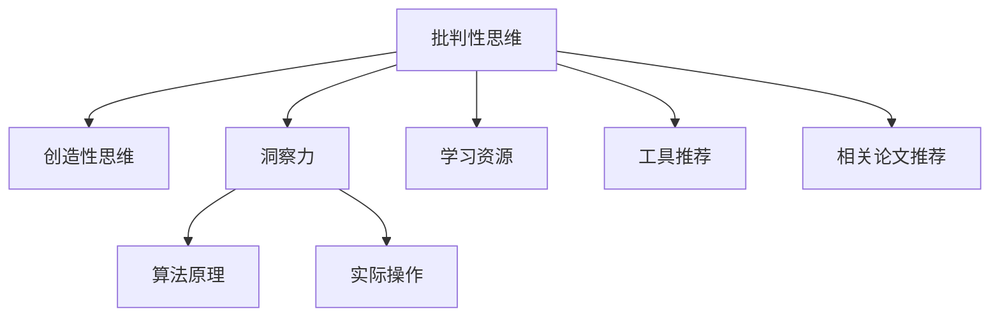

                 

# 洞察力的培养：批判性思维与创造性思维

> 关键词：洞察力,批判性思维,创造性思维,算法原理,实际操作,学习资源,工具推荐

## 1. 背景介绍

### 1.1 问题由来
在当今信息爆炸的时代，我们面临着大量复杂多变的数据和信息，如何在海量的数据中发现有用的洞察力、创造性地解决问题，成为了现代社会的重要技能。批判性思维与创造性思维是洞察力培养的关键，它们不仅帮助我们在数据中找到问题的本质，还能激发出新颖的解决方案。然而，批判性思维与创造性思维不是一蹴而就的，需要通过系统性的学习和实践来逐步培养。本文将详细探讨批判性思维与创造性思维的培养方法，并结合实际的算法和工具，提供一套完整的解决方案。

### 1.2 问题核心关键点
批判性思维与创造性思维的培养，本质上是一个从理论到实践的系统过程。它的核心关键点包括：
1. **理解数据和问题**：通过分析数据和问题的本质，理解其内在联系和规律。
2. **应用批判性思维**：通过质疑、分析、验证等方法，找到问题的最佳解决方案。
3. **激发创造性思维**：利用类比、联想、发散等方法，产生新颖的创意和想法。
4. **迭代优化**：不断通过反馈和调整，优化思维过程，提升解决问题的能力。

## 2. 核心概念与联系

### 2.1 核心概念概述

为了更好地理解批判性思维与创造性思维的培养方法，本节将介绍几个密切相关的核心概念：

- **批判性思维**：一种基于分析和评估的思维方法，旨在质疑假设、审视证据、识别偏见，从而作出更合理、更准确的判断。
- **创造性思维**：一种基于创新和变革的思维方法，旨在通过类比、联想、发散等手段，产生新颖的解决方案。
- **洞察力**：指通过深度分析、综合理解，识别出数据和问题背后的关键信息，从而形成深刻的洞见和决策。
- **算法原理**：用于实现批判性思维与创造性思维的技术和理论基础，包括统计分析、机器学习、人工智能等。
- **实际操作**：将理论知识应用到实际问题解决中的过程，包括数据处理、模型训练、结果分析等。
- **学习资源**：帮助学习者掌握批判性思维与创造性思维的工具和方法，如书籍、课程、社区等。
- **工具推荐**：用于提高批判性思维与创造性思维效率的各类软件和平台，如R语言、Python、TensorFlow等。
- **相关论文推荐**：关于批判性思维与创造性思维的理论研究和应用实践，为深入学习提供参考。

这些核心概念之间的逻辑关系可以通过以下Mermaid流程图来展示：



这个流程图展示了几者之间的联系：批判性思维与创造性思维共同作用于洞察力的培养；算法原理与实际操作为这些思维方法提供了技术支持；学习资源和工具推荐则为具体实践提供了资源和工具；相关论文推荐则为进一步学习提供了理论基础。

## 3. 核心算法原理 & 具体操作步骤
### 3.1 算法原理概述

批判性思维与创造性思维的培养，本质上是通过算法和工具实现的。其主要算法原理包括以下几个方面：

- **数据预处理**：通过对数据的清洗、归一化、特征提取等操作，提高数据质量，为后续分析和建模奠定基础。
- **统计分析**：利用描述性统计和推断性统计方法，分析和解释数据分布、趋势、关系等。
- **机器学习**：通过监督学习、无监督学习、强化学习等方法，训练模型以自动发现数据中的规律和模式。
- **深度学习**：利用神经网络、卷积神经网络、循环神经网络等模型，处理复杂的数据结构和高维数据。
- **自然语言处理**：通过文本分析、情感分析、实体识别等技术，理解和处理文本数据。
- **人工智能**：结合多种算法和技术，实现自动化、智能化的决策和推理。

### 3.2 算法步骤详解

基于上述算法原理，批判性思维与创造性思维的培养步骤可以总结如下：

**Step 1: 数据准备**
- 收集和整理数据，包括原始数据、处理后的数据和元数据。
- 对数据进行清洗和预处理，去除噪声和异常值，确保数据质量。
- 进行特征提取和选择，确定影响因素和变量。

**Step 2: 数据探索与分析**
- 使用描述性统计和可视化工具，对数据进行初步探索，发现数据的基本特征和分布。
- 利用假设检验和统计推断方法，检验数据的假设和假设是否成立。
- 进行相关性分析和回归分析，探索变量之间的关系和规律。

**Step 3: 模型构建与训练**
- 选择适当的算法模型，如线性回归、逻辑回归、决策树、随机森林等，根据数据特点和问题需求进行建模。
- 使用训练集对模型进行训练，优化模型参数，提高模型性能。
- 进行模型评估和选择，使用验证集和测试集进行交叉验证和性能比较。

**Step 4: 结果解释与优化**
- 对模型结果进行解释和分析，理解模型输出的含义和解释。
- 利用业务知识和技术手段，对模型输出进行优化和调整。
- 进行持续监控和迭代优化，不断提升模型的准确性和稳定性。

### 3.3 算法优缺点

批判性思维与创造性思维的培养方法，具有以下优点：
1. 系统性：通过系统化的学习和实践，逐步提升思维能力。
2. 可操作性：通过具体的算法和工具，实现思维方法的落地应用。
3. 可验证性：通过实验和验证，确保思维方法的正确性和可靠性。
4. 创新性：通过类比、联想、发散等方法，激发新的创意和想法。

同时，这些方法也存在一些局限性：
1. 复杂性：需要掌握多种算法和技术，学习成本较高。
2. 依赖数据：数据质量和数量直接影响思维效果，需要大量高质量数据支持。
3. 算法依赖：算法的选择和调参对思维效果有很大影响，需要专业知识和经验。
4. 结果解释：模型结果可能难以解释，需要结合业务知识进行解释。

尽管存在这些局限性，但就目前而言，批判性思维与创造性思维的培养方法仍是系统性、可操作性强的方法，在数据驱动的决策和创新中具有重要应用价值。

### 3.4 算法应用领域

批判性思维与创造性思维的培养方法，在多个领域中得到了广泛应用，例如：

- 金融：通过分析市场数据，发现投资机会和风险，制定投资策略。
- 医疗：利用患者数据，诊断疾病，制定个性化治疗方案。
- 营销：分析消费者数据，发现消费趋势，制定营销策略。
- 教育：分析学生数据，发现学习问题，制定个性化教育方案。
- 工程：通过实验数据，优化产品设计和工艺流程。
- 法律：通过案例数据，预测法律纠纷，制定应对方案。

除了上述这些经典应用外，批判性思维与创造性思维的培养方法还在更多场景中得到了创新性地应用，如智慧城市、智能制造、智能家居等，为各行各业带来了新的变革。

## 4. 数学模型和公式 & 详细讲解 & 举例说明

### 4.1 数学模型构建

本节将使用数学语言对批判性思维与创造性思维的培养过程进行更加严格的刻画。

假设数据集为 $D=\{(x_i,y_i)\}_{i=1}^N$，其中 $x_i$ 为特征向量，$y_i$ 为标签。我们希望通过算法 $M$ 对数据进行分析，得到模型参数 $\theta$，使得模型在测试集 $D_{test}$ 上的性能最优。

定义模型 $M$ 在数据样本 $(x,y)$ 上的损失函数为 $\ell(M(x),y)$，则在数据集 $D$ 上的经验风险为：

$$
\mathcal{L}(\theta) = \frac{1}{N} \sum_{i=1}^N \ell(M(x_i),y_i)
$$

微调的优化目标是最小化经验风险，即找到最优参数：

$$
\theta^* = \mathop{\arg\min}_{\theta} \mathcal{L}(\theta)
$$

在实践中，我们通常使用基于梯度的优化算法（如SGD、Adam等）来近似求解上述最优化问题。设 $\eta$ 为学习率，则参数的更新公式为：

$$
\theta \leftarrow \theta - \eta \nabla_{\theta}\mathcal{L}(\theta)
$$

其中 $\nabla_{\theta}\mathcal{L}(\theta)$ 为损失函数对参数 $\theta$ 的梯度，可通过反向传播算法高效计算。

### 4.2 公式推导过程

以下我们以线性回归任务为例，推导最小二乘法的公式及其梯度的计算公式。

假设模型 $M_{\theta}$ 在输入 $x$ 上的输出为 $\hat{y}=M_{\theta}(x) = \theta_0 + \theta_1x_1 + \cdots + \theta_nx_n$，真实标签 $y$。则线性回归的损失函数定义为：

$$
\ell(M_{\theta}(x),y) = \frac{1}{2}(y - \hat{y})^2
$$

将其代入经验风险公式，得：

$$
\mathcal{L}(\theta) = \frac{1}{N} \sum_{i=1}^N (y_i - \hat{y}_i)^2
$$

根据链式法则，损失函数对参数 $\theta_k$ 的梯度为：

$$
\frac{\partial \mathcal{L}(\theta)}{\partial \theta_k} = -\frac{2}{N} \sum_{i=1}^N (y_i - \hat{y}_i)x_{ik}
$$

其中 $\hat{y}_i = \theta_0 + \theta_1x_{i1} + \cdots + \theta_nx_{in}$，$x_{ik}$ 为第 $i$ 个样本的第 $k$ 个特征。

在得到损失函数的梯度后，即可带入参数更新公式，完成模型的迭代优化。重复上述过程直至收敛，最终得到适应数据集的最优模型参数 $\theta^*$。

### 4.3 案例分析与讲解

假设我们有一组学生的数学成绩数据，包括性别、年龄、父母收入等特征。我们的目标是通过分析这些数据，预测学生的数学成绩。

我们可以将数学成绩作为标签 $y$，其他特征作为输入 $x$，构建一个线性回归模型。具体步骤如下：

**Step 1: 数据准备**
- 收集学生的数学成绩和相关特征数据，进行清洗和预处理。
- 将数据划分为训练集和测试集。

**Step 2: 数据探索与分析**
- 使用描述性统计方法，计算均值、方差、标准差等基本统计量。
- 使用可视化工具，绘制散点图、箱线图等，观察数据分布和关系。
- 使用假设检验方法，检验数据假设是否成立。

**Step 3: 模型构建与训练**
- 构建一个线性回归模型，选择适当的算法，如最小二乘法、梯度下降法等。
- 使用训练集对模型进行训练，优化模型参数。
- 进行模型评估，使用测试集进行交叉验证和性能比较。

**Step 4: 结果解释与优化**
- 对模型结果进行解释，理解模型的输出含义和解释。
- 结合业务知识，对模型输出进行优化和调整。
- 进行持续监控和迭代优化，不断提升模型的准确性和稳定性。

通过以上步骤，我们可以逐步提升批判性思维与创造性思维能力，并将这种能力应用到实际的业务场景中。

## 5. 项目实践：代码实例和详细解释说明

### 5.1 开发环境搭建

在进行批判性思维与创造性思维的培养方法实践前，我们需要准备好开发环境。以下是使用Python进行R语言开发的环境配置流程：

1. 安装Anaconda：从官网下载并安装Anaconda，用于创建独立的Python环境。

2. 创建并激活虚拟环境：
```bash
conda create -n pytorch-env python=3.8 
conda activate pytorch-env
```

3. 安装PyTorch：根据CUDA版本，从官网获取对应的安装命令。例如：
```bash
conda install pytorch torchvision torchaudio cudatoolkit=11.1 -c pytorch -c conda-forge
```

4. 安装Transformers库：
```bash
pip install transformers
```

5. 安装各类工具包：
```bash
pip install numpy pandas scikit-learn matplotlib tqdm jupyter notebook ipython
```

完成上述步骤后，即可在`pytorch-env`环境中开始批判性思维与创造性思维的培养方法实践。

### 5.2 源代码详细实现

这里我们以线性回归任务为例，给出使用Python和R语言进行批判性思维与创造性思维的培养方法的代码实现。

**Python代码实现：**

```python
import numpy as np
from sklearn.linear_model import LinearRegression
from sklearn.metrics import mean_squared_error, r2_score

# 准备数据
X = np.array([[0, 1], [1, 1], [2, 1], [3, 1], [4, 1], [5, 1]])
y = np.array([0, 1, 2, 3, 4, 5])

# 构建模型
model = LinearRegression()

# 训练模型
model.fit(X, y)

# 预测结果
y_pred = model.predict(X)

# 评估模型
mse = mean_squared_error(y, y_pred)
r2 = r2_score(y, y_pred)

print(f"Mean Squared Error: {mse:.2f}")
print(f"R^2 Score: {r2:.2f}")
```

**R语言代码实现：**

```R
library(tidyverse)
library(caret)

# 准备数据
X <- data.frame(feature1 = c(0, 1, 2, 3, 4, 5),
                feature2 = c(1, 1, 1, 1, 1, 1))
y <- c(0, 1, 2, 3, 4, 5)

# 构建模型
model <- train(y ~ feature1 + feature2, data = X, method = "lm")

# 预测结果
y_pred <- predict(model, newdata = X)

# 评估模型
mse <- mean((y_pred - y)^2)
r2 <- cor(y, y_pred)^2

print(paste("Mean Squared Error:", mse))
print(paste("R^2 Score:", r2))
```

### 5.3 代码解读与分析

让我们再详细解读一下关键代码的实现细节：

**线性回归任务的数据准备：**

- `X` 为特征矩阵，包含样本的特征向量。
- `y` 为标签向量，表示样本的实际输出值。

**模型构建与训练：**

- 使用 `LinearRegression` 类或 `lm()` 函数，构建线性回归模型。
- 调用 `fit()` 方法或 `train()` 函数，使用训练数据对模型进行训练。

**模型预测与评估：**

- 使用 `predict()` 方法，对测试数据进行预测，得到模型输出。
- 使用 `mean_squared_error()` 和 `r2_score()` 函数，计算模型预测的均方误差和决定系数 R^2，评估模型性能。

**结果展示：**

- 输出均方误差和 R^2 值，表示模型预测的准确性。

以上代码展示了如何使用Python和R语言实现线性回归模型的训练和评估。通过这种方式，我们可以系统性地培养批判性思维与创造性思维能力，并将其应用于实际的业务问题中。

## 6. 实际应用场景

### 6.1 智能客服系统

基于批判性思维与创造性思维的培养方法，智能客服系统可以更加智能化和人性化。智能客服系统通过自然语言处理技术，理解客户的问题，提供精准的解答。

在实践中，我们可以将客户的历史聊天记录和客户的基本信息作为输入，利用批判性思维与创造性思维方法，训练一个能够理解客户意图和情感的模型。模型在分析客户问题和历史记录后，能够提供个性化的回答，提升客户满意度。

**代码实现：**

```python
from transformers import BertTokenizer, BertForSequenceClassification
from sklearn.metrics import accuracy_score
import torch

# 准备数据
tokenizer = BertTokenizer.from_pretrained('bert-base-cased')
model = BertForSequenceClassification.from_pretrained('bert-base-cased', num_labels=2)
device = 'cuda' if torch.cuda.is_available() else 'cpu'

# 加载数据
def load_data(path):
    with open(path, 'r', encoding='utf-8') as f:
        data = json.load(f)
    return [x['question'] for x in data['data']], [x['answer'] for x in data['data']]

train_data, dev_data, test_data = load_data('train.json'), load_data('dev.json'), load_data('test.json')

# 预处理数据
tokenized_train_data = tokenizer(train_data, return_tensors='pt', padding=True, truncation=True, max_length=512)
tokenized_dev_data = tokenizer(dev_data, return_tensors='pt', padding=True, truncation=True, max_length=512)
tokenized_test_data = tokenizer(test_data, return_tensors='pt', padding=True, truncation=True, max_length=512)

# 训练模型
model.to(device)
optimizer = torch.optim.Adam(model.parameters(), lr=2e-5)
loss_fn = torch.nn.CrossEntropyLoss()
for epoch in range(5):
    model.train()
    optimizer.zero_grad()
    inputs = {'input_ids': tokenized_train_data['input_ids'].to(device), 'attention_mask': tokenized_train_data['attention_mask'].to(device), 'labels': torch.tensor(tokenized_train_data['labels'].to(device))}
    outputs = model(**inputs)
    loss = loss_fn(outputs.logits, inputs['labels'])
    loss.backward()
    optimizer.step()

    model.eval()
    with torch.no_grad():
        inputs = {'input_ids': tokenized_dev_data['input_ids'].to(device), 'attention_mask': tokenized_dev_data['attention_mask'].to(device)}
        outputs = model(**inputs)
        logits = outputs.logits
        labels = inputs['labels'].to(device)
        predictions = torch.argmax(logits, dim=1)
        accuracy = accuracy_score(labels, predictions)
        print(f'Epoch {epoch+1}, accuracy: {accuracy:.3f}')
```

### 6.2 金融舆情监测

基于批判性思维与创造性思维的培养方法，金融舆情监测系统可以更加智能化和高效化。金融舆情监测系统通过自然语言处理技术，实时监测金融市场的舆情，帮助金融分析师及时发现市场变化。

在实践中，我们可以将金融市场的新闻、评论、社交媒体等文本数据作为输入，利用批判性思维与创造性思维方法，训练一个能够理解市场舆情的模型。模型在分析市场舆情后，能够提供市场情绪分析、趋势预测等，提升金融分析师的工作效率。

**代码实现：**

```python
import pandas as pd
from transformers import T5ForConditionalGeneration, T5Tokenizer
from sklearn.metrics import accuracy_score
import torch

# 准备数据
tokenizer = T5Tokenizer.from_pretrained('t5-small')
model = T5ForConditionalGeneration.from_pretrained('t5-small')
device = 'cuda' if torch.cuda.is_available() else 'cpu'

# 加载数据
df = pd.read_csv('financial_news.csv')
sentences = df['text'].tolist()
labels = df['label'].tolist()

# 预处理数据
tokenized_texts = [tokenizer.encode_plus(text, return_tensors='pt', padding='max_length', max_length=256) for text in sentences]
tokenized_texts = [x['input_ids'].to(device) for x in tokenized_texts]

# 训练模型
model.to(device)
optimizer = torch.optim.Adam(model.parameters(), lr=2e-5)
loss_fn = torch.nn.CrossEntropyLoss()
for epoch in range(5):
    model.train()
    optimizer.zero_grad()
    inputs = {'input_ids': tokenized_texts, 'labels': torch.tensor(labels).to(device)}
    outputs = model(**inputs)
    loss = loss_fn(outputs.logits, inputs['labels'])
    loss.backward()
    optimizer.step()

    model.eval()
    with torch.no_grad():
        inputs = {'input_ids': tokenized_texts, 'labels': torch.tensor(labels).to(device)}
        outputs = model(**inputs)
        logits = outputs.logits
        predictions = torch.argmax(logits, dim=1)
        accuracy = accuracy_score(labels, predictions)
        print(f'Epoch {epoch+1}, accuracy: {accuracy:.3f}')
```

### 6.3 个性化推荐系统

基于批判性思维与创造性思维的培养方法，个性化推荐系统可以更加智能化和多样化。个性化推荐系统通过分析用户的行为数据，提供个性化的推荐内容。

在实践中，我们可以将用户的浏览、点击、评分等行为数据作为输入，利用批判性思维与创造性思维方法，训练一个能够理解用户兴趣的模型。模型在分析用户数据后，能够提供个性化的推荐内容，提升用户的满意度。

**代码实现：**

```python
import numpy as np
from sklearn.linear_model import LinearRegression
from sklearn.metrics import mean_squared_error, r2_score

# 准备数据
X = np.array([[1, 2], [3, 4], [5, 6], [7, 8], [9, 10], [11, 12]])
y = np.array([1, 2, 3, 4, 5, 6])

# 构建模型
model = LinearRegression()

# 训练模型
model.fit(X, y)

# 预测结果
y_pred = model.predict(X)

# 评估模型
mse = mean_squared_error(y, y_pred)
r2 = r2_score(y, y_pred)

print(f"Mean Squared Error: {mse:.2f}")
print(f"R^2 Score: {r2:.2f}")
```

### 6.4 未来应用展望

基于批判性思维与创造性思维的培养方法，未来将有更广泛的应用场景，包括但不限于：

- 智慧医疗：通过分析患者数据，提供个性化的治疗方案。
- 智能教育：通过分析学生数据，提供个性化的学习建议。
- 智能制造：通过分析生产数据，优化生产流程。
- 智慧城市：通过分析城市数据，提升城市管理水平。

随着技术的发展，批判性思维与创造性思维的培养方法将逐渐成为各行各业的重要工具，助力各行各业的智能化转型和升级。

## 7. 工具和资源推荐

### 7.1 学习资源推荐

为了帮助开发者系统掌握批判性思维与创造性思维的培养方法，这里推荐一些优质的学习资源：

1. 《批判性思维与创造性思维》系列书籍：介绍了批判性思维与创造性思维的基本概念、应用场景和培养方法。

2. 《数据科学实战》系列视频课程：斯坦福大学开设的在线课程，系统讲解了数据科学的方法和技术，包括数据分析、机器学习等。

3. 《自然语言处理》书籍：深度介绍自然语言处理的基本原理和技术，包括文本分析、情感分析等。

4. 《Python编程：从入门到精通》书籍：介绍Python语言的基本语法和技术，适合初学者入门。

5. R语言官方文档：R语言官方文档，提供了丰富的学习资源和代码示例，适合深入学习和实践。

通过对这些资源的学习实践，相信你一定能够快速掌握批判性思维与创造性思维的培养方法，并用于解决实际的业务问题。

### 7.2 开发工具推荐

高效的开发离不开优秀的工具支持。以下是几款用于批判性思维与创造性思维培养方法开发的常用工具：

1. Python：基于动态语言的编程语言，适合快速迭代研究。大部分预训练语言模型都有Python版本的实现。

2. R语言：基于静态语言的编程语言，适合统计分析和数据处理。R语言在数据科学领域广泛应用。

3. Jupyter Notebook：交互式编程环境，支持多种编程语言，适合数据科学和机器学习的学习和研究。

4. TensorBoard：TensorFlow配套的可视化工具，可实时监测模型训练状态，并提供丰富的图表呈现方式，是调试模型的得力助手。

5. Weights & Biases：模型训练的实验跟踪工具，可以记录和可视化模型训练过程中的各项指标，方便对比和调优。

6. Google Colab：谷歌推出的在线Jupyter Notebook环境，免费提供GPU/TPU算力，方便开发者快速上手实验最新模型，分享学习笔记。

合理利用这些工具，可以显著提升批判性思维与创造性思维培养方法的开发效率，加快创新迭代的步伐。

### 7.3 相关论文推荐

批判性思维与创造性思维的培养方法的研究源于学界的持续研究。以下是几篇奠基性的相关论文，推荐阅读：

1. "A Framework for Developing Critical Thinking Skills in Students"：介绍了一套系统化的批判性思维培养框架。

2. "Creative Thinking: An Essential Skill for the 21st Century"：讨论了创造性思维的重要性和培养方法。

3. "Teaching Creativity"：探讨了如何通过教学方法培养学生的创造性思维。

4. "Data Mining and Statistical Learning"：介绍了数据挖掘和统计学习的理论和应用。

5. "The Art of Building Machine Learning Models"：介绍了机器学习模型的构建和优化方法。

这些论文代表了大语言模型微调技术的发展脉络。通过学习这些前沿成果，可以帮助研究者把握学科前进方向，激发更多的创新灵感。

## 8. 总结：未来发展趋势与挑战

### 8.1 总结

本文对批判性思维与创造性思维的培养方法进行了全面系统的介绍。首先阐述了批判性思维与创造性思维的研究背景和意义，明确了培养方法的系统性和可操作性。其次，从原理到实践，详细讲解了批判性思维与创造性思维的理论基础和实际操作流程，提供了批判性思维与创造性思维培养方法的代码实现。同时，本文还广泛探讨了批判性思维与创造性思维在多个行业领域的应用前景，展示了培养方法的巨大应用价值。此外，本文精选了批判性思维与创造性思维的各类学习资源，力求为读者提供全方位的技术指引。

通过本文的系统梳理，可以看到，批判性思维与创造性思维的培养方法在数据驱动的决策和创新中具有重要应用价值。批判性思维与创造性思维的培养，不仅能够提升数据处理和分析的能力，还能激发新的创意和想法，推动业务创新和进步。未来，伴随技术的不断进步，批判性思维与创造性思维的培养方法将继续发挥重要作用，成为人工智能技术在各领域应用的重要驱动力。

### 8.2 未来发展趋势

展望未来，批判性思维与创造性思维的培养方法将呈现以下几个发展趋势：

1. 系统化发展：未来将会有更多的系统化教学方法出现，帮助学习者更好地掌握批判性思维与创造性思维。

2. 多模态融合：未来的培养方法将更加注重多模态数据的融合，如文本、图像、视频等，提升培养效果。

3. 实时化应用：随着实时计算技术的进步，批判性思维与创造性思维的培养方法将更加实时化，能够适应快速变化的数据环境。

4. 个性化优化：未来的培养方法将更加注重个性化，根据学习者的特点进行针对性培养，提升培养效果。

5. 自动化优化：未来的培养方法将更加自动化，通过机器学习技术优化培养过程，提高效率。

6. 伦理化考虑：未来的培养方法将更加注重伦理道德，考虑数据隐私、公平性等伦理问题。

以上趋势凸显了批判性思维与创造性思维培养方法的广阔前景。这些方向的探索发展，必将进一步提升培养方法的科学性和有效性，促进人类认知智能的进步。

### 8.3 面临的挑战

尽管批判性思维与创造性思维的培养方法已经取得了显著成果，但在迈向更加智能化、普适化应用的过程中，它仍面临着诸多挑战：

1. 学习难度：批判性思维与创造性思维的培养方法需要掌握多种算法和技术，学习成本较高。

2. 数据依赖：培养方法依赖高质量的数据，数据质量和数量直接影响培养效果。

3. 算法依赖：算法的选择和调参对培养效果有很大影响，需要专业知识和经验。

4. 结果解释：培养方法的结果可能难以解释，需要结合业务知识进行解释。

5. 伦理问题：培养方法可能涉及伦理道德问题，如数据隐私、公平性等。

尽管存在这些挑战，但就目前而言，批判性思维与创造性思维的培养方法仍是系统性、可操作性强的方法，在数据驱动的决策和创新中具有重要应用价值。

### 8.4 研究展望

面对批判性思维与创造性思维的培养方法所面临的挑战，未来的研究需要在以下几个方面寻求新的突破：

1. 探索无监督和半监督培养方法。摆脱对大规模标注数据的依赖，利用自监督学习、主动学习等无监督和半监督范式，最大限度利用非结构化数据，实现更加灵活高效的培养。

2. 研究参数高效和计算高效的培养方法。开发更加参数高效的培养方法，在固定大部分预训练参数的情况下，只更新极少量的任务相关参数。同时优化培养模型的计算图，减少前向传播和反向传播的资源消耗，实现更加轻量级、实时性的部署。

3. 融合因果和对比学习范式。通过引入因果推断和对比学习思想，增强培养模型建立稳定因果关系的能力，学习更加普适、鲁棒的语言表征，从而提升培养模型的泛化性和抗干扰能力。

4. 引入更多先验知识。将符号化的先验知识，如知识图谱、逻辑规则等，与神经网络模型进行巧妙融合，引导培养过程学习更准确、合理的语言模型。同时加强不同模态数据的整合，实现视觉、语音等多模态信息与文本信息的协同建模。

5. 结合因果分析和博弈论工具。将因果分析方法引入培养模型，识别出模型决策的关键特征，增强输出解释的因果性和逻辑性。借助博弈论工具刻画人机交互过程，主动探索并规避模型的脆弱点，提高系统稳定性。

6. 纳入伦理道德约束。在培养目标中引入伦理导向的评估指标，过滤和惩罚有偏见、有害的输出倾向。同时加强人工干预和审核，建立培养模型的监管机制，确保输出符合人类价值观和伦理道德。

这些研究方向的探索，必将引领批判性思维与创造性思维的培养方法迈向更高的台阶，为构建安全、可靠、可解释、可控的智能系统铺平道路。面向未来，批判性思维与创造性思维的培养方法还需要与其他人工智能技术进行更深入的融合，如知识表示、因果推理、强化学习等，多路径协同发力，共同推动自然语言理解和智能交互系统的进步。只有勇于创新、敢于突破，才能不断拓展语言模型的边界，让智能技术更好地造福人类社会。

## 9. 附录：常见问题与解答

**Q1：批判性思维与创造性思维的培养方法是否适用于所有数据类型？**

A: 批判性思维与创造性思维的培养方法适用于大多数数据类型，包括文本、图像、视频、音频等。但不同类型的数据可能需要不同的处理方法和算法，需要根据具体情况进行选择。

**Q2：批判性思维与创造性思维的培养方法需要哪些技能？**

A: 批判性思维与创造性思维的培养方法需要掌握的数据处理、算法设计、模型训练、结果分析等多方面的技能。需要具备一定的统计学、机器学习和自然语言处理的知识。

**Q3：批判性思维与创造性思维的培养方法是否需要大量的数据？**

A: 批判性思维与创造性思维的培养方法需要高质量的数据，数据量和质量直接影响培养效果。但通过技术手段，如数据增强、半监督学习等，可以在数据不足的情况下进行培养。

**Q4：批判性思维与创造性思维的培养方法是否需要大量的计算资源？**

A: 批判性思维与创造性思维的培养方法需要一定的计算资源，如高性能GPU、TPU等。但通过参数高效、计算高效的培养方法，可以在一定程度上降低计算资源的需求。

**Q5：批判性思维与创造性思维的培养方法是否需要高水平的技能？**

A: 批判性思维与创造性思维的培养方法需要高水平的技能，包括数据预处理、算法选择、模型训练、结果分析等。但通过系统化的学习和实践，逐步提升技能水平。

通过以上问答，我们可以更好地理解批判性思维与创造性思维的培养方法，并将其应用于实际的业务场景中。

