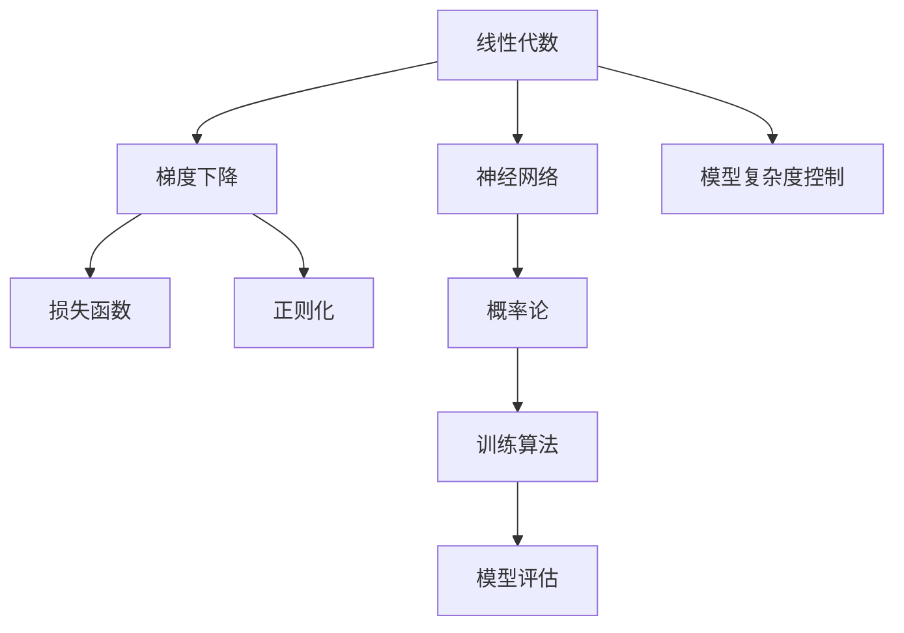

                 

# 深度学习中的数学基础：线性代数和概率论

> 关键词：深度学习,线性代数,概率论,神经网络,梯度下降,损失函数,正则化

## 1. 背景介绍

深度学习作为当前AI领域的核心技术之一，已经成功应用于图像识别、语音识别、自然语言处理等领域。而深度学习的底层是复杂数学模型，尤其是线性代数和概率论，作为其数学基础，对理解深度学习至关重要。

本文将深入探讨线性代数和概率论的基本概念，并结合深度学习的实际应用场景，详细讲解如何在深度学习中应用这些数学知识。通过深入理解数学基础，读者将能够更好地掌握深度学习技术的原理和应用，并能够在实际项目中灵活运用。

## 2. 核心概念与联系

### 2.1 核心概念概述

为了更好地理解线性代数和概率论在深度学习中的作用，本节将介绍几个密切相关的核心概念：

- 线性代数：研究向量、矩阵、张量等几何对象及其运算的数学分支，是深度学习中神经网络结构、权重更新等关键操作的基础。
- 概率论：研究随机变量及其概率分布的数学分支，是深度学习中训练算法、模型评估等核心环节的基础。
- 神经网络：由多个线性变换和激活函数堆叠构成的层次结构，通过反向传播算法实现梯度更新，实现数据到标签的映射。
- 梯度下降：基于损失函数，通过计算梯度更新参数的一种优化算法，是深度学习中模型训练的核心。
- 损失函数：用于衡量模型预测结果与真实标签之间的差异，指导模型参数更新，是深度学习中训练和评估的依据。
- 正则化：通过在损失函数中加入惩罚项，抑制过拟合现象，是深度学习中模型复杂度控制的有效手段。

这些核心概念之间的逻辑关系可以通过以下Mermaid流程图来展示：



这个流程图展示了大语言模型的核心概念及其之间的关系：

1. 线性代数通过神经网络定义矩阵和向量运算，为深度学习的底层构建提供支持。
2. 梯度下降利用概率论的统计性质，指导神经网络的参数更新，从而优化模型性能。
3. 损失函数衡量模型的预测准确性，是评估和优化模型的重要工具。
4. 正则化通过引入概率论的规则，限制模型参数的大小，避免过拟合。
5. 神经网络结合线性代数和概率论，实现从输入到输出的映射。
6. 训练算法和模型评估依赖概率论的分布理论，确保模型学习的稳定性和泛化能力。

这些概念共同构成了深度学习的数学基础，使得深度学习技术得以在实际应用中不断迭代和优化。

## 3. 核心算法原理 & 具体操作步骤

### 3.1 算法原理概述

深度学习的核心算法原理可以简单概括为：通过构建神经网络模型，利用线性代数的矩阵运算和概率论的统计特性，对输入数据进行拟合，从而实现从输入到输出的映射。

具体而言，深度学习模型通常由多个线性变换和激活函数堆叠构成，每个线性变换可以表示为：

$$
X \rightarrow WX + b
$$

其中，$X$ 是输入数据，$W$ 是权重矩阵，$b$ 是偏置向量。整个神经网络通过多次线性变换和激活函数操作，最终输出预测结果。

深度学习的训练过程则通过反向传播算法实现，核心步骤如下：

1. 前向传播：将输入数据输入网络，计算每个神经元的输出。
2. 计算损失函数：将网络输出与真实标签比较，计算损失值。
3. 反向传播：计算损失函数对每个参数的梯度，更新权重和偏置。
4. 重复步骤1-3，直至收敛。

### 3.2 算法步骤详解

接下来，将详细介绍深度学习模型训练的详细步骤，包括前向传播、损失函数、反向传播和优化器等内容。

**3.2.1 前向传播**

前向传播是深度学习模型的一个关键步骤，具体步骤如下：

1. 将输入数据 $X$ 输入网络，依次计算每个神经元的输出。
2. 将计算结果作为下一层的输入，继续计算。
3. 直到计算到最后一层，得到最终输出 $Y$。

前向传播的计算过程可以表示为：

$$
X_1 = W_1X + b_1
$$
$$
X_2 = W_2X_1 + b_2
$$
$$
...
$$
$$
Y = W_nX_{n-1} + b_n
$$

其中，$X_i$ 表示第 $i$ 层的输入，$W_i$ 表示第 $i$ 层的权重矩阵，$b_i$ 表示第 $i$ 层的偏置向量，$n$ 表示网络的深度。

**3.2.2 损失函数**

深度学习的训练目标是通过最小化损失函数，使模型输出逼近真实标签。常见的损失函数包括交叉熵损失、均方误差损失等。以交叉熵损失为例：

$$
L = -\frac{1}{N}\sum_{i=1}^N \sum_{j=1}^C y_j\log p_j
$$

其中，$y$ 表示真实标签，$p$ 表示模型预测概率分布，$C$ 表示类别数，$N$ 表示样本数。

**3.2.3 反向传播**

反向传播是深度学习训练的核心步骤，具体步骤如下：

1. 计算损失函数对每个参数的梯度。
2. 根据梯度更新权重和偏置。
3. 重复步骤1-2，直至收敛。

反向传播的计算过程可以表示为：

$$
\frac{\partial L}{\partial W_i} = \frac{\partial L}{\partial Z_i}\frac{\partial Z_i}{\partial W_i}
$$
$$
\frac{\partial L}{\partial b_i} = \frac{\partial L}{\partial Z_i}\frac{\partial Z_i}{\partial b_i}
$$

其中，$Z_i$ 表示第 $i$ 层的输出。

**3.2.4 优化器**

优化器是深度学习训练的另一个重要组件，负责根据梯度更新参数。常见的优化器包括随机梯度下降(SGD)、动量(Momentum)、自适应学习率(Adagrad、Adam等)等。以Adam优化器为例：

$$
m_t = \beta_1m_{t-1} + (1-\beta_1)g_t
$$
$$
v_t = \beta_2v_{t-1} + (1-\beta_2)g_t^2
$$
$$
\hat{m}_t = \frac{m_t}{1-\beta_1^t}
$$
$$
\hat{v}_t = \frac{v_t}{1-\beta_2^t}
$$
$$
\theta_t = \theta_{t-1} - \frac{\eta}{\sqrt{\hat{v}_t}+\epsilon}\hat{m}_t
$$

其中，$g_t$ 表示梯度，$\beta_1$ 和 $\beta_2$ 表示指数衰减率，$\eta$ 表示学习率，$\epsilon$ 表示数值稳定项。

### 3.3 算法优缺点

深度学习的算法原理具有以下优点：

1. 能够处理高维、复杂的数据，如图像、语音等。
2. 通过神经网络的多层结构，可以自动学习数据中的复杂特征，实现从输入到输出的映射。
3. 具有很强的泛化能力，能够适应大规模数据集的训练。
4. 通过反向传播算法，能够高效地更新模型参数，快速收敛。

同时，深度学习的算法原理也存在以下缺点：

1. 需要大量的数据和计算资源，训练成本较高。
2. 模型复杂度较高，难以解释其内部工作机制。
3. 过拟合风险较大，需要引入正则化等技术进行抑制。
4. 对初始参数的设置较为敏感，需要进行多次实验调整。

尽管存在这些缺点，但深度学习算法原理在实际应用中仍然取得了巨大的成功，展现了其强大的建模能力和应用潜力。

### 3.4 算法应用领域

深度学习的算法原理广泛应用于图像识别、语音识别、自然语言处理等领域，具体包括：

- 图像识别：通过卷积神经网络(CNN)等模型，将图像像素转化为高维特征，实现图像分类、目标检测等任务。
- 语音识别：通过循环神经网络(RNN)等模型，将音频信号转化为文字，实现语音识别、说话人识别等任务。
- 自然语言处理：通过序列模型等模型，将文本转化为向量，实现机器翻译、情感分析、文本生成等任务。
- 推荐系统：通过协同过滤、深度学习等模型，为用户推荐个性化内容，实现电商推荐、新闻推荐等任务。

除了上述这些经典应用外，深度学习的算法原理还在医疗、金融、游戏等多个领域得到广泛应用，推动了各个行业的智能化转型。

## 4. 数学模型和公式 & 详细讲解 & 举例说明

### 4.1 数学模型构建

深度学习模型通常由多个线性变换和激活函数堆叠构成，其中线性变换可以表示为矩阵乘法：

$$
XW^T + b
$$

其中，$X$ 表示输入数据，$W$ 表示权重矩阵，$b$ 表示偏置向量。通过多次线性变换和激活函数操作，可以实现复杂的多层神经网络结构。

### 4.2 公式推导过程

以神经网络的前向传播和反向传播为例，详细推导其公式：

**前向传播：**

前向传播的计算过程可以表示为：

$$
Z_1 = W_1X + b_1
$$
$$
A_1 = f(Z_1)
$$
$$
Z_2 = W_2A_1 + b_2
$$
$$
A_2 = f(Z_2)
$$
$$
...
$$
$$
Z_n = W_nA_{n-1} + b_n
$$
$$
Y = f(Z_n)
$$

其中，$Z_i$ 表示第 $i$ 层的输出，$A_i$ 表示第 $i$ 层的激活函数输出。

**反向传播：**

反向传播的计算过程可以表示为：

$$
\frac{\partial L}{\partial Z_n} = \frac{\partial L}{\partial Y}\frac{\partial Y}{\partial Z_n}
$$
$$
\frac{\partial L}{\partial A_n} = \frac{\partial L}{\partial Z_n}\frac{\partial Z_n}{\partial A_n}
$$
$$
\frac{\partial L}{\partial W_n} = \frac{\partial L}{\partial Z_n}\frac{\partial Z_n}{\partial A_{n-1}}\frac{\partial A_{n-1}}{\partial Z_{n-1}}\frac{\partial Z_{n-1}}{\partial W_n}
$$
$$
\frac{\partial L}{\partial b_n} = \frac{\partial L}{\partial Z_n}\frac{\partial Z_n}{\partial A_{n-1}}
$$

其中，$\frac{\partial L}{\partial Z_n}$ 表示第 $n$ 层对损失函数的梯度，$\frac{\partial Z_n}{\partial A_{n-1}}$ 表示第 $n$ 层输出对第 $n-1$ 层激活函数的梯度。

### 4.3 案例分析与讲解

以图像分类任务为例，详细讲解深度学习模型的前向传播和反向传播：

**前向传播：**

假设输入图像为 $X$，输出标签为 $y$，模型由两个卷积层和一个全连接层构成，具体步骤如下：

1. 第一层卷积操作：$XW_1 + b_1$。
2. 第一层激活函数：$Z_1 = f(Z_1)$。
3. 第二层卷积操作：$Z_1W_2 + b_2$。
4. 第二层激活函数：$Z_2 = f(Z_2)$。
5. 全连接操作：$Z_2W_3 + b_3$。
6. 输出层操作：$Z_3 = f(Z_3)$。

**反向传播：**

假设损失函数为交叉熵损失，具体步骤如下：

1. 计算输出层对损失函数的梯度：$\frac{\partial L}{\partial Z_3} = y - Y$。
2. 计算全连接层的梯度：$\frac{\partial L}{\partial Z_3}\frac{\partial Z_3}{\partial A_2}\frac{\partial A_2}{\partial Z_2}\frac{\partial Z_2}{\partial W_3}\frac{\partial W_3}{\partial Z_2}$。
3. 计算第二层激活函数的梯度：$\frac{\partial L}{\partial Z_2}\frac{\partial Z_2}{\partial A_1}\frac{\partial A_1}{\partial Z_1}\frac{\partial Z_1}{\partial W_2}\frac{\partial W_2}{\partial Z_1}$。
4. 计算第一层卷积层的梯度：$\frac{\partial L}{\partial Z_1}\frac{\partial Z_1}{\partial A_0}\frac{\partial A_0}{\partial X}\frac{\partial X}{\partial W_1}\frac{\partial W_1}{\partial Z_1}$。
5. 更新权重和偏置：$\theta_1 = \theta_1 - \eta\frac{\partial L}{\partial Z_1}\frac{\partial Z_1}{\partial A_0}\frac{\partial A_0}{\partial X}\frac{\partial X}{\partial W_1}\frac{\partial W_1}{\partial Z_1}$。

通过以上推导，可以更好地理解深度学习模型的前向传播和反向传播过程，以及其在实际应用中的具体实现。

## 5. 项目实践：代码实例和详细解释说明

### 5.1 开发环境搭建

在进行深度学习项目实践前，需要搭建相应的开发环境，以下是一个基于PyTorch的Python开发环境的搭建步骤：

1. 安装Python：下载并安装Python 3.x版本，并设置环境变量。
2. 安装PyTorch：从官网下载安装PyTorch包，并添加到Python环境。
3. 安装其他依赖包：安装Pillow、numpy、scipy、matplotlib等依赖包，用于数据处理和可视化。
4. 创建虚拟环境：使用virtualenv或conda创建虚拟环境，以避免不同项目之间的依赖冲突。

### 5.2 源代码详细实现

以图像分类任务为例，详细讲解PyTorch中深度学习模型的实现：

```python
import torch
import torch.nn as nn
import torch.optim as optim
from torchvision import datasets, transforms

# 定义模型
class Net(nn.Module):
    def __init__(self):
        super(Net, self).__init__()
        self.conv1 = nn.Conv2d(1, 32, 3, 1)
        self.conv2 = nn.Conv2d(32, 64, 3, 1)
        self.dropout1 = nn.Dropout2d(0.25)
        self.dropout2 = nn.Dropout2d(0.5)
        self.fc1 = nn.Linear(9216, 128)
        self.fc2 = nn.Linear(128, 10)

    def forward(self, x):
        x = self.conv1(x)
        x = nn.functional.relu(x)
        x = self.conv2(x)
        x = nn.functional.relu(x)
        x = nn.functional.max_pool2d(x, 2)
        x = self.dropout1(x)
        x = torch.flatten(x, 1)
        x = self.fc1(x)
        x = nn.functional.relu(x)
        x = self.dropout2(x)
        x = self.fc2(x)
        output = nn.functional.log_softmax(x, dim=1)
        return output

# 加载数据集
train_dataset = datasets.MNIST(root='data', train=True, transform=transforms.ToTensor(), download=True)
test_dataset = datasets.MNIST(root='data', train=False, transform=transforms.ToTensor(), download=True)

# 定义数据加载器
train_loader = torch.utils.data.DataLoader(train_dataset, batch_size=64, shuffle=True)
test_loader = torch.utils.data.DataLoader(test_dataset, batch_size=64, shuffle=False)

# 定义模型和优化器
model = Net()
optimizer = optim.Adam(model.parameters(), lr=0.001)
criterion = nn.CrossEntropyLoss()

# 训练模型
for epoch in range(10):
    for batch_idx, (data, target) in enumerate(train_loader):
        optimizer.zero_grad()
        output = model(data)
        loss = criterion(output, target)
        loss.backward()
        optimizer.step()
        if (batch_idx+1) % 100 == 0:
            print('Train Epoch: {} [{}/{} ({:.0f}%)]\tLoss: {:.6f}'.format(
                epoch+1, batch_idx * len(data), len(train_loader.dataset),
                100. * batch_idx / len(train_loader), loss.item()))

# 测试模型
with torch.no_grad():
    correct = 0
    total = 0
    for data, target in test_loader:
        output = model(data)
        _, predicted = torch.max(output.data, 1)
        total += target.size(0)
        correct += (predicted == target).sum().item()

    print('Accuracy of the network on the test images: {} %'.format(100 * correct / total))
```

在这个代码中，我们首先定义了一个简单的卷积神经网络模型，包含两个卷积层、两个Dropout层和两个全连接层。然后，我们加载了MNIST数据集，定义了数据加载器和优化器，并进行了模型训练和测试。通过上述代码，读者可以更好地理解深度学习模型的构建和训练过程。

### 5.3 代码解读与分析

在实际应用中，深度学习模型的实现还需要考虑以下因素：

- 模型架构的设计：合理设计模型的深度、宽度和结构，避免过拟合和欠拟合。
- 数据预处理：对输入数据进行归一化、标准化等预处理操作，提升模型训练效果。
- 超参数调整：调整学习率、批大小、迭代次数等超参数，优化模型性能。
- 模型保存和部署：将训练好的模型保存为pickle或ONNX格式，方便后续的部署和使用。

以上这些因素都会影响模型的训练效果和应用性能，因此在实际项目中需要仔细设计和调试。

## 6. 实际应用场景

### 6.1 医疗图像识别

深度学习在医疗图像识别领域得到了广泛应用，如病理图像分类、X光影像分析等。以病理图像分类为例，深度学习模型可以通过对大量病理切片数据进行训练，自动分类不同的病理类型，辅助医生进行诊断和治疗决策。

### 6.2 自动驾驶

深度学习在自动驾驶领域也有重要应用，如目标检测、车道保持、交通标志识别等。通过深度学习模型对摄像头、雷达等传感器数据进行分析和处理，实现车辆的自动驾驶功能，提升了驾驶安全性。

### 6.3 金融风控

深度学习在金融风控领域也有广泛应用，如信用评分、欺诈检测等。通过深度学习模型对用户行为数据进行分析，自动评估用户的信用风险和欺诈行为，提升金融机构的风险管理能力。

### 6.4 未来应用展望

未来，深度学习的数学基础将继续发挥重要作用，推动更多领域的应用发展：

1. 医疗影像分析：深度学习将帮助医生实现病理图像的自动分类和诊断，提升医疗服务的质量和效率。
2. 自动驾驶：深度学习将助力自动驾驶技术的成熟，实现更安全、高效的驾驶体验。
3. 金融风控：深度学习将提高金融机构的风险评估能力，降低金融风险。
4. 智能家居：深度学习将推动智能家居技术的进步，提升家庭生活的智能化水平。
5. 个性化推荐：深度学习将帮助电商平台实现个性化推荐，提升用户体验和满意度。

## 7. 工具和资源推荐

### 7.1 学习资源推荐

为了更好地理解深度学习的数学基础，以下推荐一些优质的学习资源：

1. 《深度学习》课程：斯坦福大学吴恩达教授主讲，系统讲解深度学习的理论基础和实际应用。
2. 《神经网络与深度学习》书籍：Michael Nielsen所著，详细讲解深度学习的原理和实现。
3. 《Python深度学习》书籍：Francois Chollet所著，详细介绍深度学习模型的构建和训练。
4. Coursera深度学习课程：Google深度学习团队主讲，涵盖深度学习的基本概念和前沿技术。
5. Kaggle竞赛：参加Kaggle深度学习竞赛，实战练习深度学习模型的构建和优化。

### 7.2 开发工具推荐

深度学习项目开发离不开优秀的工具支持，以下是几款常用的工具：

1. PyTorch：Facebook开源的深度学习框架，支持动态计算图，灵活高效。
2. TensorFlow：Google开源的深度学习框架，生产部署方便，生态丰富。
3. Keras：深度学习的高层次API，易于使用，支持多种后端引擎。
4. Jupyter Notebook：交互式编程环境，支持多种编程语言，方便调试和实验。
5. NVIDIA GPU：高性能计算平台，加速深度学习模型的训练和推理。

### 7.3 相关论文推荐

深度学习的数学基础研究是不断演进的，以下推荐几篇经典的学术论文：

1. LeCun et al.《Backpropagation: Application to Handwritten Zerotraining a Multilayered Neural Network》：深度学习反向传播算法的经典论文。
2. Hinton et al.《A Learning Algorithm for Deep Neural Networks》：深度学习模型的基础理论框架。
3. Goodfellow et al.《Deep Learning》：深度学习领域的经典教材，涵盖深度学习的基本概念和应用。
4. Bengio et al.《Representation Learning: A Review and New Perspectives》：深度学习模型表征学习的综述论文。
5. Simonyan et al.《Very Deep Convolutional Networks for Large-Scale Image Recognition》：深度卷积神经网络的经典论文。

这些论文代表了大深度学习领域的最新研究进展，值得深入学习和理解。

## 8. 总结：未来发展趋势与挑战

### 8.1 研究成果总结

本文深入探讨了线性代数和概率论在深度学习中的作用，详细讲解了深度学习的算法原理和实践技巧。通过数学模型的构建和公式推导，读者可以更好地理解深度学习模型的实现过程，并在实际项目中灵活应用。

### 8.2 未来发展趋势

未来，深度学习的数学基础将继续推动技术的进步，具体趋势包括：

1. 模型结构的复杂化：深度学习模型的结构将越来越复杂，包含更多层和更广泛的特征。
2. 数据的多样化：深度学习将处理更多类型的数据，如图像、语音、文本等。
3. 模型的自动化：深度学习模型的构建和优化将更多地依赖自动化工具和算法，减少人工干预。
4. 算法的融合：深度学习算法将与更多领域的技术融合，如自然语言处理、计算机视觉、语音识别等。
5. 应用的泛化：深度学习将在更多领域得到应用，如医疗、金融、智能家居等。

### 8.3 面临的挑战

深度学习虽然取得了显著进展，但在实际应用中仍面临诸多挑战：

1. 数据隐私和安全：深度学习模型需要大量标注数据，存在数据隐私和安全风险。
2. 模型复杂度高：深度学习模型的复杂度高，难以解释其内部工作机制。
3. 训练成本高：深度学习模型的训练需要高性能计算资源，成本较高。
4. 模型泛化能力不足：深度学习模型在特定领域的数据上表现良好，但泛化能力有限。
5. 数据质量问题：深度学习模型对数据质量敏感，低质量数据会影响模型性能。

### 8.4 研究展望

为了应对这些挑战，未来需要在以下方向进行深入研究：

1. 数据隐私保护：研究数据隐私保护技术，如差分隐私、联邦学习等，确保数据安全。
2. 模型解释性：研究模型解释性方法，如可视化、可解释性模型等，提升模型的可解释性。
3. 训练效率优化：研究训练效率优化技术，如模型压缩、混合精度训练等，降低训练成本。
4. 模型泛化能力提升：研究模型泛化能力提升方法，如迁移学习、自监督学习等，增强模型泛化能力。
5. 数据质量提升：研究数据质量提升技术，如数据增强、数据清洗等，提高数据质量。

通过这些研究方向的探索，相信深度学习技术将进一步提升其应用价值和普及度，为更多领域带来变革性影响。

## 9. 附录：常见问题与解答

**Q1：深度学习中的数学基础是什么？**

A: 深度学习的数学基础主要包括线性代数和概率论。线性代数提供了矩阵运算和向量空间的基础，是深度学习模型的核心。概率论提供了随机变量的统计特性，是深度学习训练和评估的基础。

**Q2：深度学习模型如何利用线性代数和概率论？**

A: 深度学习模型通过矩阵运算和概率统计，对输入数据进行拟合，实现从输入到输出的映射。线性代数提供了矩阵乘法、向量空间等基本运算，帮助模型构建和更新。概率论提供了损失函数、梯度计算等统计特性，指导模型训练和优化。

**Q3：深度学习模型有哪些经典应用？**

A: 深度学习模型在图像识别、语音识别、自然语言处理等领域都有广泛应用。例如，卷积神经网络(CNN)用于图像分类和目标检测，循环神经网络(RNN)用于语音识别和文本生成，深度学习模型用于推荐系统和医疗影像分析等。

**Q4：深度学习面临的主要挑战是什么？**

A: 深度学习面临的主要挑战包括数据隐私和安全、模型复杂度高、训练成本高、模型泛化能力不足、数据质量问题等。这些问题需要从数据处理、模型构建、训练优化等多个角度进行全面解决。

**Q5：未来深度学习的趋势和挑战是什么？**

A: 未来深度学习的趋势包括模型结构复杂化、数据多样化、模型自动化、算法融合、应用泛化等。主要挑战包括数据隐私和安全、模型解释性、训练效率、模型泛化能力、数据质量等。需要在多个方向进行深入研究，以推动深度学习的持续发展和应用。

通过本文的系统梳理，读者可以更好地理解深度学习的数学基础和应用，掌握深度学习模型的构建和训练技巧，为实际项目提供指导。希望读者能够在深度学习的研究和应用中不断探索和创新，推动人工智能技术的不断进步。

