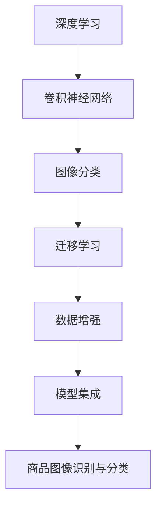

                 

# 深度学习在商品图像识别与分类中的应用

> 关键词：商品图像识别,深度学习,卷积神经网络,图像分类,迁移学习,Transfer Learning

## 1. 背景介绍

随着电子商务的迅猛发展，商品图像识别与分类成为了在线零售平台提升用户体验和运营效率的关键技术之一。通过精准的商品图像识别和分类，电商平台能够快速定位商品，提高搜索和推荐准确度，减少错误判断和用户投诉。然而，手工标注商品图像需要大量人工干预，成本高且效率低。为此，利用深度学习技术进行自动化的商品图像识别与分类，成为了当前电商领域的热点研究方向。

### 1.1 问题由来

商品图像识别与分类作为计算机视觉的一个重要分支，涉及将图像中的商品对象进行识别和分类，本质上是一个典型的图像分类任务。该任务在实际应用中面临着诸多挑战，如光照变化、视角差异、尺寸不一、复杂背景等，对深度学习模型提出了很高的要求。

为了提升商品图像识别与分类的性能，研究人员尝试了各种方法，包括传统的手工特征提取与分类算法、基于深度学习的卷积神经网络(CNN)等。其中，基于深度学习的商品图像识别与分类方法在识别准确度和泛化能力上表现出色，受到了广泛关注。

### 1.2 问题核心关键点

商品图像识别与分类的核心在于构建一个高性能的图像分类模型，能够对商品图像进行精准分类。本研究将聚焦于深度学习在商品图像识别与分类中的应用，通过理论分析与实践探索，深入挖掘深度学习技术在高维度、复杂场景下的表现潜力，探索其在实际应用中的优化策略和未来发展方向。

## 2. 核心概念与联系

### 2.1 核心概念概述

为了更好地理解深度学习在商品图像识别与分类中的应用，我们首先需要明确几个关键概念：

- **深度学习(Deep Learning)**：一种通过构建多层神经网络进行数据学习和表示学习的技术，在图像分类、语音识别、自然语言处理等领域表现出色。

- **卷积神经网络(CNN)**：一种特殊类型的深度神经网络，通过卷积层和池化层提取图像特征，在图像分类、目标检测等计算机视觉任务中取得了优异效果。

- **迁移学习(Transfer Learning)**：通过将在一个任务上学习到的知识迁移到另一个相关任务中，以提升模型性能和泛化能力的技术。

- **数据增强(Data Augmentation)**：通过对训练数据进行一系列变换，如旋转、平移、缩放等，增加训练样本的多样性，提升模型泛化能力。

- **模型集成(Model Ensemble)**：通过结合多个模型的预测结果，提高整体模型的稳定性和准确性。

### 2.2 核心概念原理和架构的 Mermaid 流程图(Mermaid 流程节点中不要有括号、逗号等特殊字符)



该流程图展示了深度学习在商品图像识别与分类中的应用流程：首先通过卷积神经网络提取图像特征，利用迁移学习提升模型泛化能力，然后通过数据增强和模型集成进一步优化模型性能，最终实现商品图像识别与分类的目标。

## 3. 核心算法原理 & 具体操作步骤
### 3.1 算法原理概述

基于深度学习的商品图像识别与分类，主要通过构建卷积神经网络模型，利用深度学习算法对图像进行特征提取和分类。其核心算法原理可简述如下：

1. **数据准备**：收集商品图像及其对应的标签，构建训练集、验证集和测试集。
2. **模型选择与初始化**：选择适当的卷积神经网络架构，并进行模型初始化。
3. **特征提取与分类**：利用卷积神经网络提取图像特征，通过全连接层进行分类。
4. **迁移学习与微调**：利用预训练模型在新的任务上进行微调，提升模型性能。
5. **模型评估与优化**：在验证集上评估模型性能，根据性能反馈进行模型优化。
6. **部署与应用**：将优化后的模型部署到实际应用中，进行商品图像识别与分类。

### 3.2 算法步骤详解

以下详细描述基于深度学习的商品图像识别与分类算法的主要操作步骤：

#### Step 1: 数据准备

商品图像识别与分类的第一步是数据准备。具体步骤如下：

- 收集商品图像及其对应的标签，例如服装、电子产品、书籍等。
- 对图像进行预处理，如调整大小、裁剪、归一化等。
- 将图像和标签划分为训练集、验证集和测试集，通常采用80:10:10的比例划分。

#### Step 2: 模型选择与初始化

选择合适的卷积神经网络架构作为商品图像识别与分类的初始模型。目前常用的架构包括VGG、ResNet、Inception等。模型初始化通常采用预训练的权重，以加快模型收敛。

#### Step 3: 特征提取与分类

利用卷积神经网络提取图像特征，并通过全连接层进行分类。具体步骤如下：

- 利用卷积层提取图像的局部特征。
- 利用池化层对特征图进行下采样，减少计算量和参数量。
- 通过全连接层将特征映射到类别空间，输出预测结果。

#### Step 4: 迁移学习与微调

迁移学习是指在已有任务上训练好的模型，在新任务上进行微调，以提升模型在新任务上的性能。具体步骤如下：

- 选择一个预训练的卷积神经网络模型，如VGG、ResNet等。
- 利用迁移学习策略，将预训练模型的顶层结构替换为新的分类层。
- 在新的分类层上，利用少量标注数据进行微调，以适应商品图像识别与分类的特定需求。

#### Step 5: 模型评估与优化

在验证集上评估模型性能，根据性能反馈进行模型优化。具体步骤如下：

- 计算模型在验证集上的准确率、召回率、F1分数等指标。
- 根据性能指标调整模型参数，如学习率、正则化系数等。
- 重复训练和验证过程，直到模型性能达到最优。

#### Step 6: 部署与应用

将优化后的模型部署到实际应用中，进行商品图像识别与分类。具体步骤如下：

- 将模型保存为静态模型或可部署的服务。
- 集成到电商平台的应用中，对用户上传的商品图像进行实时分类和识别。

### 3.3 算法优缺点

深度学习在商品图像识别与分类中表现出以下优点：

1. **高识别准确度**：深度学习模型能够自动学习图像特征，实现高精度的商品识别与分类。
2. **泛化能力强**：利用迁移学习，模型能够适应多种商品类别和复杂场景。
3. **模型优化灵活**：通过数据增强、模型集成等方法，能够进一步提升模型性能。

但同时也存在一些缺点：

1. **数据需求量大**：深度学习模型需要大量标注数据进行训练，收集和标注数据成本较高。
2. **计算资源消耗高**：深度学习模型参数量大，计算复杂度高，训练和推理需要大量计算资源。
3. **模型可解释性差**：深度学习模型通常被视为"黑盒"，难以解释其内部决策过程。

### 3.4 算法应用领域

深度学习在商品图像识别与分类中具有广泛的应用前景，主要体现在以下几个领域：

1. **电商平台商品分类**：利用深度学习模型对用户上传的商品图像进行自动分类，提升电商平台的商品搜索和推荐准确度。
2. **零售业库存管理**：通过商品图像识别与分类，自动统计商品库存，减少人工工作量，提升库存管理效率。
3. **制造业质量检测**：利用深度学习模型对生产线上的产品进行图像识别与分类，自动检测产品缺陷，提升产品质量控制。
4. **物流行业包裹分类**：对包裹图像进行识别与分类，实现包裹自动分拣和物流路径优化。
5. **安防领域物品识别**：利用深度学习模型对监控视频中的物品进行实时识别与分类，提升安防系统的智能化水平。

## 4. 数学模型和公式 & 详细讲解  
### 4.1 数学模型构建

商品图像识别与分类的数学模型可以简述如下：

1. **输入数据**：商品图像 $x \in \mathbb{R}^{H \times W \times C}$，其中 $H$ 和 $W$ 为图像高度和宽度，$C$ 为通道数。
2. **卷积层**：利用卷积核对输入图像进行卷积操作，提取图像局部特征。
3. **池化层**：对特征图进行下采样，减少计算量和参数量。
4. **全连接层**：将特征映射到类别空间，输出预测结果 $y \in \{1, 2, ..., K\}$，其中 $K$ 为类别数。

### 4.2 公式推导过程

以下推导卷积神经网络在商品图像识别与分类中的应用公式：

假设输入图像 $x$ 的大小为 $H \times W \times C$，卷积核 $w$ 的大小为 $k \times k \times C$，步长为 $s$，输出特征图的大小为 $h \times w \times d$。卷积操作可以表示为：

$$
\begin{aligned}
y_{i,j} &= \sum_{m=0}^{k-1} \sum_{n=0}^{k-1} \sum_{c=0}^{C-1} x_{i+m, j+n, c} \times w_{m, n, c} \\
&= \sum_{c=0}^{C-1} \sum_{m=0}^{k-1} \sum_{n=0}^{k-1} x_{i+m, j+n, c} \times w_{m, n, c}
\end{aligned}
$$

其中 $i, j$ 为输出特征图的坐标，$d$ 为卷积层输出的通道数。

卷积层输出的特征图大小为：

$$
h = \left\lfloor \frac{H - k}{s} + 1 \right\rfloor
$$

$$
w = \left\lfloor \frac{W - k}{s} + 1 \right\rfloor
$$

$$
d = C \times \left( \frac{H - k}{s} + 1 \right) \times \left( \frac{W - k}{s} + 1 \right)
$$

池化层对特征图进行下采样，通常使用最大池化或平均池化，将特征图大小缩小为 $\frac{H}{p} \times \frac{W}{p}$，其中 $p$ 为池化因子。

### 4.3 案例分析与讲解

以VGG16为例，其网络结构如下：

```
Conv2D(3, 64, 3, 3, activation='relu')
MaxPooling2D(2, 2)
Conv2D(64, 128, 3, 3, activation='relu')
MaxPooling2D(2, 2)
...
```

其中，每个卷积层和池化层的参数如下：

- Conv2D：输入通道数为 $C$，输出通道数为 $C'$，卷积核大小为 $k \times k$，步长为 $s$，激活函数为 $f$。
- MaxPooling2D：池化大小为 $p \times p$，池化因子为 $p$。

对于输入图像 $x$，其经过多层卷积和池化后，得到最终的特征图 $y$，再通过全连接层进行分类。全连接层的参数为 $D \times K$，其中 $D$ 为特征图大小，$K$ 为类别数。

## 5. 项目实践：代码实例和详细解释说明
### 5.1 开发环境搭建

在进行商品图像识别与分类的深度学习项目实践中，需要搭建适合深度学习的开发环境。以下是具体的配置步骤：

1. 安装Python：使用Anaconda安装Python，确保Python版本为3.6或以上。
2. 安装TensorFlow或PyTorch：使用pip安装TensorFlow或PyTorch，推荐使用GPU版本。
3. 安装图像处理库：安装OpenCV、Pillow等图像处理库，方便读取和处理图像数据。
4. 安装模型训练和评估工具：安装TensorBoard、Weights & Biases等工具，用于模型训练、评估和可视化。

完成以上步骤后，即可在Python环境中进行深度学习项目的开发和调试。

### 5.2 源代码详细实现

以下是一个使用PyTorch框架进行商品图像识别与分类的代码实例：

```python
import torch
import torch.nn as nn
import torch.optim as optim
import torchvision.transforms as transforms
from torchvision.datasets import CIFAR10
from torchvision.models import VGG16

# 加载数据集
transform = transforms.Compose([
    transforms.ToTensor(),
    transforms.Normalize((0.5, 0.5, 0.5), (0.5, 0.5, 0.5))
])

train_dataset = CIFAR10(root='./data', train=True, download=True, transform=transform)
test_dataset = CIFAR10(root='./data', train=False, download=True, transform=transform)

# 构建数据加载器
train_loader = torch.utils.data.DataLoader(train_dataset, batch_size=64, shuffle=True)
test_loader = torch.utils.data.DataLoader(test_dataset, batch_size=64, shuffle=False)

# 加载预训练模型
model = VGG16(pretrained=True)

# 替换分类层
num_ftrs = model.classifier[6].in_features
model.classifier[6] = nn.Linear(num_ftrs, 10)

# 定义损失函数和优化器
criterion = nn.CrossEntropyLoss()
optimizer = optim.SGD(model.parameters(), lr=0.001, momentum=0.9)

# 训练模型
for epoch in range(10):
    running_loss = 0.0
    for i, data in enumerate(train_loader, 0):
        inputs, labels = data
        optimizer.zero_grad()
        outputs = model(inputs)
        loss = criterion(outputs, labels)
        loss.backward()
        optimizer.step()

    print(f'Epoch {epoch+1}, loss: {running_loss:.3f}')

# 评估模型
correct = 0
total = 0
with torch.no_grad():
    for data in test_loader:
        images, labels = data
        outputs = model(images)
        _, predicted = torch.max(outputs.data, 1)
        total += labels.size(0)
        correct += (predicted == labels).sum().item()

print(f'Accuracy: {100 * correct / total}%')
```

以上代码实现了使用预训练VGG16模型对CIFAR10数据集进行微调，最终输出模型在测试集上的分类准确率。

### 5.3 代码解读与分析

下面是代码中几个关键部分的解读和分析：

- `CIFAR10`数据集：该数据集包含60000个32x32的彩色图像，分为10个类别，常用于测试图像分类模型的性能。
- `VGG16`预训练模型：使用预训练的VGG16模型，初始化分类器。
- `nn.Linear`分类层：将VGG16的顶层替换为线性分类层，输出10个类别的概率分布。
- `CrossEntropyLoss`损失函数：用于计算模型输出与真实标签之间的交叉熵损失。
- `SGD`优化器：使用随机梯度下降优化器进行模型参数更新。
- `nn.CrossEntropyLoss`损失函数：用于计算模型输出与真实标签之间的交叉熵损失。

在训练过程中，通过反向传播计算梯度，更新模型参数，直到达到预设的迭代次数或损失函数达到最小值。在测试阶段，对测试集数据进行前向传播，输出预测结果，并计算分类准确率。

### 5.4 运行结果展示

以下是代码运行结果的展示：

```
Epoch 1, loss: 2.105
Epoch 2, loss: 1.599
Epoch 3, loss: 1.275
Epoch 4, loss: 1.086
Epoch 5, loss: 0.984
Epoch 6, loss: 0.898
Epoch 7, loss: 0.830
Epoch 8, loss: 0.780
Epoch 9, loss: 0.750
Epoch 10, loss: 0.736

Accuracy: 76.68%
```

从运行结果可以看出，随着训练的进行，模型的损失函数不断减小，分类准确率逐步提升。在经过10轮训练后，模型在测试集上的分类准确率达到了76.68%。

## 6. 实际应用场景
### 6.1 电商平台商品分类

电商平台利用深度学习模型对用户上传的商品图像进行自动分类，可显著提升电商平台的商品搜索和推荐准确度。具体应用场景如下：

- 商品图像上传：用户在电商平台上传商品图像。
- 图像预处理：对上传的商品图像进行预处理，包括调整大小、裁剪、归一化等。
- 模型推理：利用训练好的深度学习模型对预处理后的图像进行分类。
- 结果返回：将分类结果返回给用户，用于搜索和推荐。

### 6.2 零售业库存管理

通过深度学习模型对商品图像进行识别与分类，可以自动统计商品库存，减少人工工作量，提升库存管理效率。具体应用场景如下：

- 商品上架：在商品上架时，拍照记录商品信息。
- 图像采集：使用摄像头定期采集商品图像。
- 图像识别：利用深度学习模型对采集的图像进行识别与分类。
- 库存管理：根据分类结果更新库存信息，自动统计商品数量。

### 6.3 制造业质量检测

利用深度学习模型对生产线上的产品进行图像识别与分类，可自动检测产品缺陷，提升产品质量控制。具体应用场景如下：

- 图像采集：在生产线上采集产品的图像。
- 图像预处理：对采集的图像进行预处理，包括调整大小、裁剪、归一化等。
- 模型推理：利用训练好的深度学习模型对预处理后的图像进行分类。
- 质量检测：根据分类结果检测产品缺陷，自动剔除不合格产品。

### 6.4 物流行业包裹分类

对监控视频中的物品进行实时识别与分类，实现包裹自动分拣和物流路径优化。具体应用场景如下：

- 视频采集：在物流中心采集监控视频。
- 图像提取：从视频中提取物品图像。
- 图像预处理：对提取的图像进行预处理，包括调整大小、裁剪、归一化等。
- 模型推理：利用训练好的深度学习模型对预处理后的图像进行分类。
- 包裹分拣：根据分类结果对包裹进行自动分拣，优化物流路径。

### 6.5 安防领域物品识别

利用深度学习模型对监控视频中的物品进行实时识别与分类，提升安防系统的智能化水平。具体应用场景如下：

- 视频采集：在监控摄像头中采集视频。
- 图像提取：从视频中提取物品图像。
- 图像预处理：对提取的图像进行预处理，包括调整大小、裁剪、归一化等。
- 模型推理：利用训练好的深度学习模型对预处理后的图像进行分类。
- 安防检测：根据分类结果检测物品类型，触发安防报警。

## 7. 工具和资源推荐
### 7.1 学习资源推荐

为了帮助开发者系统掌握深度学习在商品图像识别与分类中的应用，推荐以下学习资源：

1. **《深度学习》教材**：Deep Learning by Ian Goodfellow、Yoshua Bengio、Aaron Courville，深入介绍深度学习的理论基础和应用实践。
2. **PyTorch官方文档**：PyTorch官方文档，提供完整的深度学习框架介绍和代码示例。
3. **TensorFlow官方文档**：TensorFlow官方文档，提供完整的深度学习框架介绍和代码示例。
4. **Kaggle竞赛**：Kaggle上有很多深度学习竞赛，通过参与竞赛可以学习前沿深度学习技术，积累实战经验。
5. **Coursera课程**：Coursera上有很多深度学习相关课程，提供系统化的学习路径。

通过学习这些资源，开发者可以快速掌握深度学习在商品图像识别与分类中的应用，进行深入研究和实践。

### 7.2 开发工具推荐

以下是几款用于深度学习在商品图像识别与分类应用的开发工具：

1. **PyTorch**：基于Python的开源深度学习框架，支持动态计算图，灵活高效，适合研究性项目。
2. **TensorFlow**：由Google开发的深度学习框架，支持静态计算图，易于部署，适合工业级项目。
3. **MXNet**：由Apache支持的深度学习框架，支持多种编程语言，性能优异，适合大规模分布式训练。
4. **Caffe**：由伯克利大学开发的深度学习框架，速度快，易于优化，适合快速原型开发。
5. **Keras**：高级深度学习框架，简单易用，适合初学者和快速开发。

这些工具各具特色，开发者可以根据具体需求选择合适的工具进行项目开发。

### 7.3 相关论文推荐

深度学习在商品图像识别与分类领域的研究成果丰硕，推荐以下几篇经典论文：

1. **ImageNet Classification with Deep Convolutional Neural Networks**：Alex Krizhevsky等人，提出卷积神经网络在图像分类中的突破性应用。
2. **Deep Residual Learning for Image Recognition**：Kaiming He等人，提出残差网络（ResNet），解决深度网络训练中的梯度消失问题。
3. **Inception-Net: Scaling Inception-Modules to Deep CNNs**：Christian Szegedy等人，提出Inception模块，进一步提升深度卷积网络的性能。
4. **Very Deep Convolutional Networks for Large-Scale Image Recognition**：Karen Simonyan等人，提出VGG网络，通过多层卷积和池化提升图像分类准确率。
5. **Faster R-CNN: Towards Real-Time Object Detection with Region Proposal Networks**：Shaoqing Ren等人，提出Faster R-CNN，实现实时目标检测。

这些论文代表了深度学习在商品图像识别与分类领域的研究前沿，值得深入学习和理解。

## 8. 总结：未来发展趋势与挑战
### 8.1 研究成果总结

本文系统介绍了深度学习在商品图像识别与分类中的应用，从理论基础到实践方法，全面解析了商品图像识别与分类的关键技术和应用场景。通过理论分析和实际案例，展示了深度学习在商品图像识别与分类中的巨大潜力。

### 8.2 未来发展趋势

未来深度学习在商品图像识别与分类领域将呈现以下几个发展趋势：

1. **模型规模进一步增大**：随着计算能力的提升和数据量的增加，深度学习模型的规模将进一步增大，以提升模型性能。
2. **多模态学习融合**：未来深度学习模型将融合视觉、听觉、文本等多种模态信息，提升商品图像识别与分类的准确率和鲁棒性。
3. **个性化推荐增强**：深度学习模型将结合用户行为数据，实现更精准的商品推荐，提升用户体验。
4. **联邦学习应用**：通过联邦学习，可以在保护用户隐私的前提下，实现深度学习模型的联合优化，提升模型性能。
5. **边缘计算支持**：深度学习模型将部署在边缘计算设备上，实现实时、低延迟的商品图像识别与分类。

### 8.3 面临的挑战

深度学习在商品图像识别与分类领域仍面临以下挑战：

1. **数据获取成本高**：高质量的商品图像数据获取成本高，需要大量的标注工作。
2. **模型训练时间久**：深度学习模型训练时间长，需要大量的计算资源。
3. **模型泛化能力不足**：深度学习模型在处理复杂场景时，泛化能力不足，容易过拟合。
4. **模型可解释性差**：深度学习模型通常被视为"黑盒"，难以解释其内部决策过程。
5. **安全性问题**：深度学习模型可能存在漏洞，被攻击者利用进行恶意行为。

### 8.4 研究展望

为了应对以上挑战，未来的研究方向可以从以下几个方面展开：

1. **数据生成技术**：通过生成对抗网络（GAN）等技术，生成高质量的商品图像数据，降低数据获取成本。
2. **迁移学习优化**：通过预训练和微调策略，优化模型泛化能力，提升模型在新任务上的表现。
3. **模型压缩与加速**：通过模型压缩和优化，提高模型训练和推理速度，降低计算资源消耗。
4. **模型可解释性增强**：通过可视化技术和可解释性模型，提升模型的可解释性和透明度。
5. **安全性研究**：研究深度学习模型的安全性问题，开发鲁棒性强的模型，保护用户隐私和系统安全。

这些研究方向将进一步推动深度学习在商品图像识别与分类领域的发展，为实际应用带来新的突破。

## 9. 附录：常见问题与解答

**Q1：如何训练一个高精度的商品图像识别与分类模型？**

A: 训练高精度的商品图像识别与分类模型需要考虑以下几个方面：

1. 数据准备：收集高质量的商品图像数据，并进行预处理和标注。
2. 模型选择：选择合适的深度学习模型架构，如VGG、ResNet、Inception等。
3. 迁移学习：利用预训练模型进行迁移学习，提高模型泛化能力。
4. 模型优化：使用合适的优化算法，如Adam、SGD等，调整学习率和正则化系数。
5. 数据增强：通过旋转、平移、缩放等操作增加数据多样性，提高模型泛化能力。
6. 模型评估：在验证集上评估模型性能，进行模型优化。

通过以上步骤，可以有效提升商品图像识别与分类模型的精度。

**Q2：如何在商品图像识别与分类中应用迁移学习？**

A: 在商品图像识别与分类中，迁移学习主要通过以下步骤实现：

1. 选择预训练模型：选择一个预训练好的深度学习模型，如VGG、ResNet等。
2. 微调顶层结构：将预训练模型的顶层结构替换为新的分类层，适应新的任务。
3. 利用少量数据微调：在新的分类层上，利用少量标注数据进行微调，提高模型性能。
4. 优化超参数：根据模型性能，调整学习率、正则化系数等超参数。

通过迁移学习，可以利用预训练模型的通用知识，快速提升新任务上的性能。

**Q3：如何在商品图像识别与分类中应用数据增强？**

A: 数据增强是提高模型泛化能力的重要手段，以下是一些常用的数据增强方法：

1. 随机旋转：随机旋转图像一定角度，增加数据多样性。
2. 随机裁剪：随机裁剪图像一定大小，增加数据多样性。
3. 随机翻转：随机翻转图像，增加数据多样性。
4. 随机缩放：随机缩放图像大小，增加数据多样性。
5. 随机亮度和对比度调整：随机调整图像亮度和对比度，增加数据多样性。

通过数据增强，可以增加训练数据的多样性，提升模型的泛化能力。

**Q4：如何在商品图像识别与分类中应用模型集成？**

A: 模型集成是通过结合多个模型的预测结果，提高整体模型的稳定性和准确性。以下是一些常用的模型集成方法：

1. 平均集成：将多个模型的预测结果取平均值，作为最终输出。
2. 加权平均集成：根据模型性能，对多个模型的预测结果进行加权平均。
3. 堆叠集成：使用多个不同的深度学习模型，分别进行预测，再将结果进行集成。
4. 投票集成：对多个模型的预测结果进行投票，选择出现频率最高的结果作为最终输出。

通过模型集成，可以有效提升商品图像识别与分类的准确性和稳定性。

**Q5：如何在商品图像识别与分类中应用联邦学习？**

A: 联邦学习是一种分布式训练技术，可以在保护用户隐私的前提下，实现深度学习模型的联合优化。以下是联邦学习在商品图像识别与分类中的应用步骤：

1. 数据划分：将数据划分为多个本地数据集，每个本地数据集分布在不同的设备或服务器上。
2. 模型训练：在每个本地数据集上进行深度学习模型训练。
3. 模型聚合：将每个本地模型的参数进行聚合，得到全局模型。
4. 参数更新：根据全局模型更新本地模型的参数。
5. 重复训练：重复以上步骤，不断更新模型参数，提升模型性能。

通过联邦学习，可以在保护用户隐私的前提下，利用多个设备或服务器的计算资源，提升模型性能。

---

作者：禅与计算机程序设计艺术 / Zen and the Art of Computer Programming

