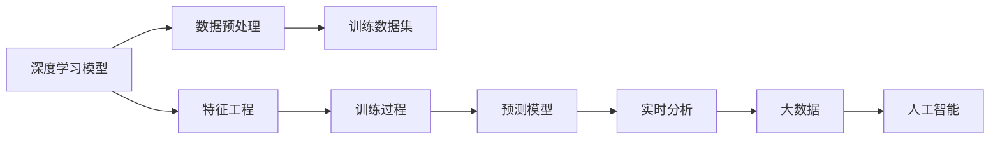
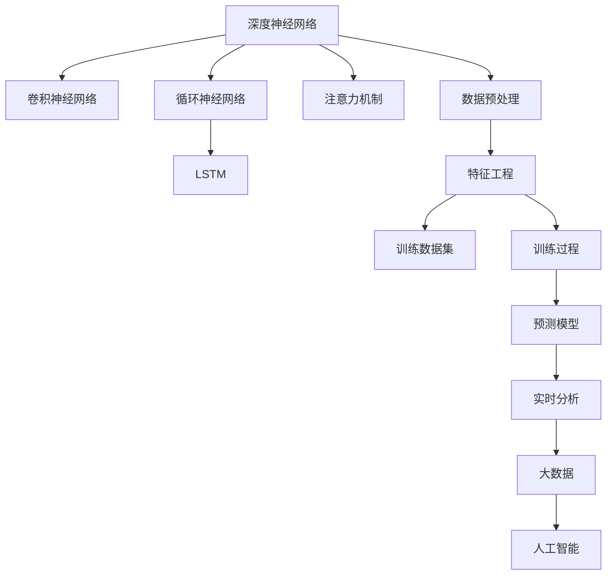

                 

# 深度学习在知识发现中的应用

> 关键词：深度学习,知识发现,数据挖掘,特征工程,预测模型,实时分析,大数据,人工智能

## 1. 背景介绍

### 1.1 问题由来

在当今信息爆炸的时代，如何从海量数据中高效、准确地挖掘出有价值的知识，成为众多企业、研究机构和政府部门关注的重点。传统的统计分析和规则提取方法虽然有效，但面对复杂且多变的现实问题，显得力不从心。而深度学习作为一种强有力的数据驱动模型，正逐渐成为知识发现和数据挖掘领域的新宠。

深度学习通过构建多层非线性变换，能够自动从数据中学习到抽象的特征表示，并通过反向传播算法优化模型参数，从而获得更高精度的预测和分类结果。这种端到端的学习方式，使其在自然语言处理、图像识别、语音识别、推荐系统等领域大放异彩，为知识发现和数据挖掘提供了新的工具和方法。

### 1.2 问题核心关键点

1. **深度学习模型**：深度神经网络(DNN)、卷积神经网络(CNN)、循环神经网络(RNN)、长短期记忆网络(LSTM)、注意力机制(Attention)等。
2. **知识发现**：从数据中挖掘出有价值的知识，如模式、规律、关联等。
3. **数据挖掘**：从原始数据中提取有用信息的过程。
4. **特征工程**：通过特征选择、特征提取、特征组合等手段，提高数据表示的质量。
5. **预测模型**：基于训练数据构建的预测模型，用于预测新数据。
6. **实时分析**：在数据流中实时分析和处理数据，快速响应需求。
7. **大数据**：数据量极大且复杂，难以用传统方法处理的超大规模数据集。
8. **人工智能(AI)**：通过模拟人类智能行为，实现对数据的自主理解和推理。

这些关键点构成了深度学习在知识发现和数据挖掘中的核心框架，其逻辑关系可以通过以下Mermaid流程图来展示：



## 2. 核心概念与联系

### 2.1 核心概念概述

深度学习在知识发现中的应用，主要包括以下几个关键概念：

- **深度神经网络(DNN)**：具有多个隐层的多层神经网络，能够自动学习数据的复杂特征表示。
- **卷积神经网络(CNN)**：专门用于图像处理的深度学习模型，通过卷积操作提取局部特征。
- **循环神经网络(RNN)**：适用于序列数据的深度学习模型，通过时间步递归计算，能够处理变长序列。
- **长短期记忆网络(LSTM)**：一种特殊的RNN，通过门控机制解决长期依赖问题。
- **注意力机制(Attention)**：一种机制，使模型能够关注输入序列的不同部分，提高模型表现。
- **数据预处理**：包括数据清洗、特征选择、特征缩放、数据增强等，准备输入深度学习模型的数据。
- **特征工程**：通过手工设计或自动学习，构建更有信息量的数据表示。
- **训练数据集**：包含标注样本的数据集，用于训练深度学习模型。
- **训练过程**：通过反向传播算法更新模型参数，使得模型在训练集上表现最优。
- **预测模型**：通过训练得到的模型，用于对新数据进行预测。
- **实时分析**：对实时数据流进行实时分析和处理，快速响应需求。
- **大数据**：超大规模且复杂的数据集，需要先进的数据处理技术。
- **人工智能**：通过深度学习实现对数据的自主理解和推理。

这些概念之间的逻辑关系可以通过以下Mermaid流程图来展示：



## 3. 核心算法原理 & 具体操作步骤

### 3.1 算法原理概述

深度学习在知识发现中的应用，主要基于以下几个原理：

1. **特征学习**：深度学习模型通过自动学习输入数据的高层次特征表示，从而发现数据中的潜在模式和结构。
2. **参数优化**：通过反向传播算法，深度学习模型能够自动优化参数，使得模型在训练数据上表现最优。
3. **迁移学习**：利用预训练模型和任务相关数据，通过微调或迁移学习的方式，提高模型的泛化能力和性能。
4. **模型集成**：通过集成多个模型，可以提高预测准确度和鲁棒性。
5. **实时处理**：通过增量学习和在线学习，可以在数据流上实现实时分析和处理。

### 3.2 算法步骤详解

深度学习在知识发现中的应用，一般包括以下关键步骤：

**Step 1: 数据收集与预处理**
- 收集相关领域的数据，包括文本、图像、音频等。
- 进行数据清洗，去除噪声和异常值。
- 进行数据增强，增加数据集的多样性。
- 进行数据标注，为模型提供监督信号。

**Step 2: 特征工程**
- 通过特征选择、特征提取、特征组合等手段，提高数据表示的质量。
- 设计特征向量的稀疏表示，减少维度。
- 引入高维特征，增加信息量。
- 应用降维技术，如主成分分析(PCA)、线性判别分析(LDA)等。

**Step 3: 模型构建与训练**
- 选择合适的深度学习模型，如DNN、CNN、RNN等。
- 构建模型架构，设计模型的输入、输出和隐藏层。
- 选择合适的损失函数，如交叉熵、均方误差等。
- 选择合适的优化器，如SGD、Adam、RMSprop等。
- 设置学习率、批大小、迭代轮数等超参数。
- 进行模型训练，更新模型参数。

**Step 4: 模型评估与优化**
- 在验证集上评估模型性能，选择最优模型。
- 使用交叉验证等技术，提高模型泛化能力。
- 进行模型集成，提升模型鲁棒性。
- 进行模型调优，如调整超参数、增加正则化等。

**Step 5: 知识发现与应用**
- 构建预测模型，对新数据进行预测。
- 进行实时分析，对数据流进行实时处理。
- 进行知识提取，挖掘数据中的规律和模式。
- 进行可视化分析，展示数据中的知识结构。

### 3.3 算法优缺点

深度学习在知识发现中的应用，具有以下优点：

1. **自动化特征提取**：能够自动学习数据的高层次特征表示，减少了人工特征工程的复杂度。
2. **高效处理大规模数据**：适用于大数据集和复杂数据类型，能够快速处理大量数据。
3. **鲁棒性强**：通过正则化、Dropout等技术，提高了模型的泛化能力和鲁棒性。
4. **预测精度高**：深度学习模型能够学习复杂的非线性关系，提高预测精度。

同时，深度学习在知识发现中也有以下局限性：

1. **模型复杂度高**：深度学习模型参数量庞大，训练和推理开销较大。
2. **计算资源需求高**：需要高性能计算设备和充足的内存空间。
3. **过拟合风险高**：数据集较小或特征选择不合理时，容易发生过拟合。
4. **可解释性差**：深度学习模型往往是黑盒模型，难以解释其内部工作机制。
5. **数据需求高**：需要大量标注数据进行训练，数据标注成本高。

### 3.4 算法应用领域

深度学习在知识发现中的应用，主要涵盖以下几个领域：

1. **自然语言处理(NLP)**：文本分类、情感分析、机器翻译、问答系统等。
2. **计算机视觉(CV)**：图像分类、目标检测、图像生成、图像分割等。
3. **语音识别(SR)**：语音识别、语音合成、语音情感分析等。
4. **推荐系统**：商品推荐、用户推荐、内容推荐等。
5. **健康医疗**：医学影像分析、疾病诊断、基因组分析等。
6. **金融分析**：股票预测、风险评估、信用评分等。
7. **交通监控**：交通流量预测、事故检测、行为分析等。

这些应用领域涉及了数据挖掘和知识发现的各个方面，展示了深度学习模型的广泛适用性和强大能力。

## 4. 数学模型和公式 & 详细讲解 & 举例说明

### 4.1 数学模型构建

深度学习在知识发现中的应用，主要涉及以下几个数学模型：

1. **卷积神经网络(CNN)**
   - 输入：$x \in \mathbb{R}^{m \times n \times k}$
   - 输出：$y \in \mathbb{R}^{c}$
   - 模型：$y = W*x + b$
   - 损失函数：$L(y, \hat{y}) = \frac{1}{2}(y - \hat{y})^2$

2. **循环神经网络(RNN)**
   - 输入：$x_t \in \mathbb{R}^{n}$
   - 输出：$y_t \in \mathbb{R}^{c}$
   - 模型：$y_t = \sigma(W*x_t + U*y_{t-1} + b)$
   - 损失函数：$L(y, \hat{y}) = \frac{1}{N}\sum_{t=1}^{N}(y_t - \hat{y}_t)^2$

3. **长短期记忆网络(LSTM)**
   - 输入：$x_t \in \mathbb{R}^{n}$
   - 输出：$y_t \in \mathbb{R}^{c}$
   - 模型：$y_t = \sigma(W*x_t + U*y_{t-1} + b)$
   - 损失函数：$L(y, \hat{y}) = \frac{1}{N}\sum_{t=1}^{N}(y_t - \hat{y}_t)^2$

### 4.2 公式推导过程

以卷积神经网络为例，推导其基本数学模型和公式：

假设输入数据为 $x \in \mathbb{R}^{m \times n \times k}$，卷积层的核参数为 $W \in \mathbb{R}^{k \times f \times f}$，输出为 $y \in \mathbb{R}^{m \times n \times c}$，其中 $f$ 为核大小，$c$ 为输出通道数。

卷积操作定义为：
$$
y_{ij} = \sum_{p=0}^{k-1} \sum_{q=0}^{k-1} W_{pq} * x_{p+1+(i-f) \cdot s: p+1+(i+1) \cdot s} * q+1+(j-f) \cdot s
$$
其中 $s$ 为步长。

卷积层的参数优化目标为：
$$
\min_{W} \frac{1}{N} \sum_{i=1}^{N} \| y - \hat{y} \|^2
$$

通过反向传播算法，可以求得 $W$ 的更新公式：
$$
W \leftarrow W - \eta \nabla_{W} \mathcal{L}
$$

其中 $\eta$ 为学习率，$\nabla_{W} \mathcal{L}$ 为损失函数对 $W$ 的梯度，可以通过链式法则计算得到。

### 4.3 案例分析与讲解

以手写数字识别为例，分析CNN模型的应用：

1. **数据准备**
   - 收集手写数字图像数据集。
   - 将图像进行预处理，如归一化、裁剪、旋转等。

2. **模型构建**
   - 构建一个包含3个卷积层和3个池化层的CNN模型。
   - 第一层卷积核大小为 $5 \times 5$，输出通道数为32。
   - 第二层卷积核大小为 $5 \times 5$，输出通道数为64。
   - 第三层卷积核大小为 $5 \times 5$，输出通道数为128。

3. **训练过程**
   - 设置学习率为0.01，批大小为64。
   - 使用随机梯度下降算法，迭代1000次。
   - 在验证集上进行评估，选择最优模型。

4. **模型评估**
   - 在测试集上进行测试，评估模型的准确率。
   - 使用混淆矩阵和ROC曲线展示模型性能。

## 5. 项目实践：代码实例和详细解释说明

### 5.1 开发环境搭建

要进行深度学习项目实践，需要搭建合适的开发环境。以下是使用Python进行TensorFlow和Keras开发的环境配置流程：

1. 安装Anaconda：从官网下载并安装Anaconda，用于创建独立的Python环境。

2. 创建并激活虚拟环境：
```bash
conda create -n tf-env python=3.8 
conda activate tf-env
```

3. 安装TensorFlow：
```bash
conda install tensorflow -c conda-forge
```

4. 安装Keras：
```bash
pip install keras
```

5. 安装各类工具包：
```bash
pip install numpy pandas scikit-learn matplotlib tqdm jupyter notebook ipython
```

完成上述步骤后，即可在`tf-env`环境中开始项目实践。

### 5.2 源代码详细实现

下面我们以手写数字识别为例，给出使用Keras进行CNN模型构建和训练的PyTorch代码实现。

```python
from keras.datasets import mnist
from keras.models import Sequential
from keras.layers import Conv2D, MaxPooling2D, Flatten, Dense
from keras.optimizers import RMSprop

# 加载手写数字数据集
(x_train, y_train), (x_test, y_test) = mnist.load_data()

# 数据预处理
x_train = x_train.reshape(-1, 28, 28, 1) / 255.0
x_test = x_test.reshape(-1, 28, 28, 1) / 255.0

# 构建CNN模型
model = Sequential()
model.add(Conv2D(32, (5, 5), activation='relu', input_shape=(28, 28, 1)))
model.add(MaxPooling2D((2, 2)))
model.add(Conv2D(64, (5, 5), activation='relu'))
model.add(MaxPooling2D((2, 2)))
model.add(Flatten())
model.add(Dense(10, activation='softmax'))

# 编译模型
model.compile(loss='categorical_crossentropy', optimizer=RMSprop(lr=0.001), metrics=['accuracy'])

# 训练模型
model.fit(x_train, y_train, epochs=10, batch_size=64, validation_data=(x_test, y_test))

# 评估模型
model.evaluate(x_test, y_test)
```

### 5.3 代码解读与分析

让我们再详细解读一下关键代码的实现细节：

**数据准备**：
- 使用Keras自带的MNIST数据集，加载手写数字图像和标注数据。
- 对图像进行预处理，归一化到0-1之间，并将其转换为4维张量。

**模型构建**：
- 构建一个包含3个卷积层和3个池化层的CNN模型。
- 第一层卷积核大小为 $5 \times 5$，输出通道数为32。
- 第二层卷积核大小为 $5 \times 5$，输出通道数为64。
- 第三层卷积核大小为 $5 \times 5$，输出通道数为128。
- 最后添加一个全连接层，输出10个类别的概率。

**模型编译**：
- 使用交叉熵损失函数和RMSprop优化器。
- 设置学习率为0.001。
- 设置验证集为测试集。

**模型训练**：
- 对训练集进行迭代训练，每次迭代64个样本。
- 迭代10次，并在验证集上进行评估。
- 获取最优模型。

**模型评估**：
- 在测试集上进行测试，输出准确率和损失值。

## 6. 实际应用场景

### 6.1 智能推荐系统

深度学习在智能推荐系统中的应用，通过学习用户的历史行为数据，可以挖掘出用户的兴趣偏好和行为模式，从而推荐出更符合用户需求的商品、内容或服务。目前，基于深度学习的推荐系统已经广泛应用于电商、视频、新闻等领域。

具体而言，可以收集用户的历史点击、浏览、评分、收藏等行为数据，构建用户-物品关联矩阵。在此基础上，使用深度学习模型进行用户嵌入和物品嵌入的表示学习，通过预测用户对物品的评分或点击概率，实现推荐排序。使用模型在测试集上的表现，可以评估推荐系统的精度和覆盖率。

### 6.2 医学影像分析

深度学习在医学影像分析中的应用，通过学习医学影像中的特征和模式，可以辅助医生进行疾病诊断、病理分析等工作。目前，基于深度学习的医学影像分析已经应用于乳腺癌检测、肺结节分析、脑部病变识别等领域。

具体而言，可以收集大量医学影像数据，如X光片、CT扫描、MRI等，构建医学影像数据集。使用深度学习模型，如卷积神经网络、循环神经网络等，对医学影像进行特征提取和分类。通过在标注数据上进行训练和微调，可以提高模型的诊断精度和泛化能力。

### 6.3 自然语言处理(NLP)

深度学习在自然语言处理中的应用，通过学习自然语言的语义和语法规则，可以自动进行文本分类、情感分析、机器翻译等工作。目前，基于深度学习的NLP技术已经广泛应用于聊天机器人、智能客服、文本摘要等领域。

具体而言，可以收集大量文本数据，如新闻、评论、社交媒体等，构建标注数据集。使用深度学习模型，如卷积神经网络、循环神经网络等，对文本进行特征提取和分类。通过在标注数据上进行训练和微调，可以提高模型的分类精度和生成能力。

## 7. 工具和资源推荐

### 7.1 学习资源推荐

为了帮助开发者系统掌握深度学习在知识发现中的应用，这里推荐一些优质的学习资源：

1. 《深度学习》系列书籍：由深度学习奠基人Ian Goodfellow、Yoshua Bengio和Aaron Courville联合撰写，系统介绍了深度学习的基本原理和应用。
2. 《TensorFlow官方文档》：包含丰富的TensorFlow教程和示例代码，适合初学者和进阶者学习。
3. 《Keras官方文档》：包含详细的Keras教程和示例代码，适合初学者快速上手。
4. Coursera深度学习课程：由斯坦福大学Andrew Ng教授讲授，涵盖深度学习的基本概念和应用。
5. DeepLearning.AI深度学习专项课程：由Deeplearning.ai提供，涵盖深度学习的基本原理和应用。

通过对这些资源的学习实践，相信你一定能够快速掌握深度学习在知识发现中的应用，并用于解决实际的NLP问题。

### 7.2 开发工具推荐

高效的开发离不开优秀的工具支持。以下是几款用于深度学习知识发现开发的常用工具：

1. TensorFlow：由Google主导开发的深度学习框架，生产部署方便，适合大规模工程应用。
2. PyTorch：由Facebook开发的深度学习框架，灵活动态的计算图，适合快速迭代研究。
3. Keras：由Francois Chollet开发的高级深度学习框架，使用简单易学，适合快速原型开发。
4. Weights & Biases：模型训练的实验跟踪工具，可以记录和可视化模型训练过程中的各项指标，方便对比和调优。
5. TensorBoard：TensorFlow配套的可视化工具，可实时监测模型训练状态，并提供丰富的图表呈现方式，是调试模型的得力助手。

合理利用这些工具，可以显著提升深度学习知识发现任务的开发效率，加快创新迭代的步伐。

### 7.3 相关论文推荐

深度学习在知识发现中的应用，源于学界的持续研究。以下是几篇奠基性的相关论文，推荐阅读：

1. ImageNet Classification with Deep Convolutional Neural Networks（AlexNet论文）：提出卷积神经网络，引入ReLU激活函数，在ImageNet数据集上取得优异表现。
2. AlexNet: One Million Training Examples for Large Scale Image Classification（AlexNet论文续集）：进一步优化AlexNet模型，使其在ImageNet数据集上取得更好表现。
3. Deep Residual Learning for Image Recognition（ResNet论文）：提出残差网络，解决深度网络训练中的梯度消失问题，使得网络可以更深更广。
4. Bidirectional Long Short-Term Memory Networks for Language Modeling（LSTM论文）：提出长短期记忆网络，解决循环神经网络中的长期依赖问题。
5. Attention is All You Need（Transformer论文）：提出Transformer模型，引入自注意力机制，解决深度网络中的顺序关系问题。

这些论文代表了大深度学习在知识发现和数据挖掘中的发展脉络。通过学习这些前沿成果，可以帮助研究者把握学科前进方向，激发更多的创新灵感。

## 8. 总结：未来发展趋势与挑战

### 8.1 总结

本文对深度学习在知识发现中的应用进行了全面系统的介绍。首先阐述了深度学习的基本原理和应用背景，明确了其在知识发现中的核心作用。其次，从原理到实践，详细讲解了深度学习模型的构建和训练过程，给出了深度学习知识发现项目开发的完整代码实例。同时，本文还广泛探讨了深度学习在多个行业领域的应用前景，展示了深度学习模型的广泛适用性和强大能力。

通过本文的系统梳理，可以看到，深度学习在知识发现中的应用已经取得了显著进展，正在成为数据挖掘和知识发现的重要工具。未来，随着深度学习模型的不断改进和优化，其应用范围和性能将进一步拓展，带来更多的创新和突破。

### 8.2 未来发展趋势

展望未来，深度学习在知识发现中的应用将呈现以下几个发展趋势：

1. **模型结构更加复杂**：未来的深度学习模型将更加复杂和强大，能够处理更复杂的数据类型和更大规模的数据集。
2. **算法优化更加高效**：未来的深度学习算法将更加高效和优化，能够实现更快速的数据处理和模型训练。
3. **数据驱动更加智能**：未来的深度学习模型将更加智能和自适应，能够从数据中自动学习和优化。
4. **应用场景更加广泛**：未来的深度学习模型将应用于更多行业和领域，如医疗、金融、交通等，带来更多的创新和突破。
5. **多模态融合更加深入**：未来的深度学习模型将融合多种数据类型，如图像、视频、语音等，实现更全面和深入的数据理解。

以上趋势凸显了深度学习在知识发现中的广阔前景。这些方向的探索发展，必将进一步提升深度学习模型的性能和应用范围，为数据挖掘和知识发现带来更多的创新和突破。

### 8.3 面临的挑战

尽管深度学习在知识发现中已经取得了瞩目成就，但在迈向更加智能化、普适化应用的过程中，它仍面临着诸多挑战：

1. **模型规模庞大**：深度学习模型往往参数量巨大，训练和推理开销较大。需要高性能计算设备和充足的内存空间。
2. **计算资源需求高**：深度学习模型需要大量的计算资源进行训练和推理，数据标注成本高。
3. **过拟合风险高**：数据集较小或特征选择不合理时，容易发生过拟合。需要更多的正则化和模型优化技术。
4. **可解释性差**：深度学习模型往往是黑盒模型，难以解释其内部工作机制。需要更多的模型可视化和技术手段。
5. **数据需求高**：深度学习模型需要大量的标注数据进行训练，数据标注成本高。需要更多的数据自动标注和数据增强技术。
6. **安全性和隐私保护**：深度学习模型可能会学习到有偏见和有害的信息，需要更多的隐私保护和伦理约束。

正视深度学习在知识发现中面临的这些挑战，积极应对并寻求突破，将是大数据时代智能数据处理的必然选择。相信随着学界和产业界的共同努力，这些挑战终将一一被克服，深度学习模型必将在构建智能数据处理系统方面发挥更大的作用。

### 8.4 研究展望

未来的研究需要在以下几个方面寻求新的突破：

1. **无监督和半监督学习**：探索无监督和半监督学习范式，摆脱对大量标注数据的依赖，利用自监督学习、主动学习等方法，提高模型的泛化能力和鲁棒性。
2. **跨领域迁移学习**：探索跨领域迁移学习方法，提高模型的迁移能力和泛化能力，降低对特定领域数据的依赖。
3. **高效计算和模型优化**：开发更加高效和优化的深度学习算法，减少计算资源需求，提高模型训练和推理速度。
4. **模型压缩和稀疏化**：开发模型压缩和稀疏化技术，减少模型参数量，提高模型可部署性和推理效率。
5. **数据自动标注和增强**：探索数据自动标注和增强技术，降低数据标注成本，提高数据集的多样性和质量。
6. **模型解释和可解释性**：开发更多的模型解释和可解释性技术，提高模型的透明度和可信度。

这些研究方向的探索，必将引领深度学习在知识发现和数据挖掘中迈向更高的台阶，为构建智能数据处理系统铺平道路。面向未来，深度学习模型需要与其他人工智能技术进行更深入的融合，如知识表示、因果推理、强化学习等，多路径协同发力，共同推动数据挖掘和知识发现的进步。只有勇于创新、敢于突破，才能不断拓展深度学习模型的边界，让智能数据处理技术更好地服务于人类社会。

## 9. 附录：常见问题与解答

**Q1：深度学习在知识发现中的核心优势是什么？**

A: 深度学习的核心优势在于其强大的特征学习能力和泛化能力。深度学习模型能够自动从数据中学习到高层次的特征表示，挖掘出数据中的潜在模式和结构，从而发现数据中的知识。此外，深度学习模型还可以通过大量的标注数据进行优化，提高模型的泛化能力和精度。

**Q2：深度学习在知识发现中面临的主要挑战是什么？**

A: 深度学习在知识发现中面临的主要挑战包括模型规模庞大、计算资源需求高、过拟合风险高、可解释性差、数据需求高和安全性和隐私保护等。这些问题需要通过模型优化、计算资源提升、正则化技术、模型解释和跨领域迁移学习等方法来解决。

**Q3：如何选择合适的深度学习模型？**

A: 选择合适的深度学习模型需要根据具体的任务需求和数据特点进行。例如，对于图像分类任务，可以使用卷积神经网络；对于序列数据处理任务，可以使用循环神经网络和长短期记忆网络；对于推荐系统任务，可以使用深度推荐模型等。同时，还需要考虑模型的可解释性、可部署性和计算效率等因素。

**Q4：如何提高深度学习模型的泛化能力？**

A: 提高深度学习模型的泛化能力需要从多个方面入手。例如，可以通过增加数据集的多样性、引入正则化技术、进行数据增强、使用模型集成等方法来提高模型的泛化能力。此外，还需要在模型设计和训练过程中注重模型的鲁棒性和可解释性。

**Q5：深度学习在知识发现中的应用前景如何？**

A: 深度学习在知识发现中的应用前景非常广阔。未来的深度学习模型将应用于更多行业和领域，如医疗、金融、交通等，带来更多的创新和突破。同时，随着深度学习技术的不断改进和优化，其应用范围和性能将进一步拓展，带来更多的创新和突破。

作者：禅与计算机程序设计艺术 / Zen and the Art of Computer Programming

