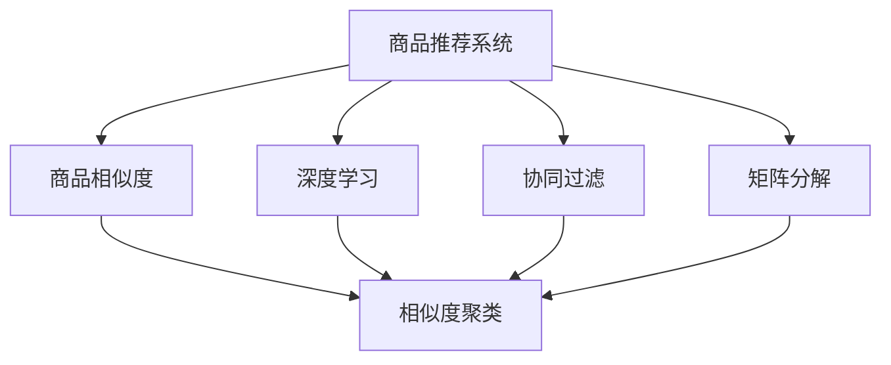

                 

# 深度学习驱动的商品相似度计算优化

> 关键词：深度学习,商品相似度,协同过滤,矩阵分解,图神经网络,商品推荐系统,冷启动问题

## 1. 背景介绍

### 1.1 问题由来
在电子商务领域，商品推荐系统是提升用户购物体验和平台转化率的重要手段。传统的商品推荐方法包括基于内容的推荐、协同过滤推荐等，但均存在一定的局限性。例如，基于内容的推荐方法依赖商品元数据，难以覆盖大量商品；协同过滤方法存在稀疏性、冷启动等问题。

近年来，深度学习技术在推荐系统中的应用日益广泛。尤其是商品相似度计算，作为推荐算法中的关键步骤，其性能对推荐效果有着重要影响。深度学习能够自动学习商品间的高维隐含关系，显著提升商品相似度计算的精度和泛化能力。本文将深入探讨深度学习在商品相似度计算中的应用，并提出几种新的优化方法。

### 1.2 问题核心关键点
商品相似度计算是推荐系统中的核心问题之一。其核心思想在于量化商品间的相似度，基于相似度对商品进行聚类，从而推荐与用户历史行为相似的未购买商品。商品相似度计算的好坏，直接关系到推荐结果的相关性和多样性，影响用户的购物体验和平台的收益。

深度学习通过训练复杂的神经网络模型，能够自动学习商品之间的隐含关系，从而实现更准确、更有效的商品相似度计算。但深度学习模型往往需要大量标注数据进行训练，且参数众多，训练和推理速度较慢。本文将着重讨论如何通过深度学习优化商品相似度计算，提升推荐系统的效果。

### 1.3 问题研究意义
通过深度学习优化商品相似度计算，可以显著提升推荐系统的精度和性能，为电商平台的运营和用户购物体验的提升提供有力支持。具体而言：

1. 提升推荐准确率：深度学习可以自动提取商品间的隐含关系，提升商品相似度的计算精度，从而推荐更相关、更合适的商品。
2. 拓展推荐范围：深度学习可以捕捉商品间复杂的交互信息，覆盖更多未购买商品，增加推荐的多样性。
3. 加速推荐响应：通过优化深度学习模型，可以降低计算和推理的复杂度，加速推荐结果的生成。
4. 应对冷启动问题：深度学习可以适应新的商品和用户行为，缓解传统推荐方法中的冷启动问题。
5. 提升平台收益：高精度的推荐系统可以提高用户满意度，促进更多购物转化，为平台带来更大的收益。

## 2. 核心概念与联系

### 2.1 核心概念概述

为更好地理解深度学习在商品相似度计算中的应用，本节将介绍几个关键概念：

- 商品推荐系统(Recommendation System)：通过分析用户行为，推荐相关商品，提升用户体验和平台收益的智能系统。
- 协同过滤(Collaborative Filtering)：通过用户行为数据，推测用户对未购买商品的可能兴趣，推荐相似商品。
- 矩阵分解(Matrix Factorization)：通过分解用户行为矩阵，学习用户和商品的隐含特征，推荐相关商品。
- 深度学习(Deep Learning)：通过训练深层神经网络，自动学习数据的复杂隐含关系，提取高维特征。
- 商品相似度(Similarity)：衡量两个商品之间的相似程度，基于相似度推荐相关商品。
- 图神经网络(Graph Neural Network)：通过模拟图结构，对节点进行特征传播，学习节点间的隐含关系。

这些核心概念之间的逻辑关系可以通过以下Mermaid流程图来展示：



这个流程图展示了几类推荐方法与商品相似度计算之间的联系：

1. 协同过滤和矩阵分解方法通过分析用户行为数据，学习用户和商品的隐含特征，从而计算商品之间的相似度。
2. 深度学习可以直接从商品的高维数据中学习复杂的隐含关系，计算商品之间的相似度。
3. 商品相似度计算可以通过聚类等方式，对商品进行相似度排序，进而推荐相关商品。

通过这些关键概念的组合，可以构建出更高效、更精准的商品推荐系统。

## 3. 核心算法原理 & 具体操作步骤
### 3.1 算法原理概述

深度学习在商品相似度计算中的应用，通常基于以下原理：

1. **神经网络模型**：通过训练神经网络模型，自动学习商品之间的隐含关系。
2. **特征提取**：从商品的高维特征向量中，提取重要的隐含特征，用于计算相似度。
3. **相似度计算**：基于提取的特征，计算商品之间的相似度。
4. **相似度聚类**：通过聚类算法，对商品进行相似度排序，推荐相关商品。

深度学习在商品相似度计算中的主要目标是：

- **高精度**：通过复杂的网络结构，自动提取商品间的隐含关系，提升相似度计算的精度。
- **泛化能力**：通过多层网络结构，学习到商品间的多样化隐含关系，提升相似度的泛化能力。
- **高效计算**：通过优化模型结构和算法，降低计算和推理的复杂度，提高计算效率。

### 3.2 算法步骤详解

深度学习优化商品相似度计算通常包括以下几个关键步骤：

**Step 1: 构建深度神经网络模型**

选择适当的神经网络模型，如多层感知机、卷积神经网络、图神经网络等。

**Step 2: 特征提取与相似度计算**

1. **特征提取**：通过训练网络模型，从商品的高维特征向量中提取隐含特征。
2. **相似度计算**：基于提取的特征，计算商品之间的相似度。

**Step 3: 相似度聚类**

使用聚类算法（如K-means、层次聚类等）对商品进行相似度排序，推荐相关商品。

**Step 4: 优化算法**

采用优化算法（如梯度下降、Adam等）对模型参数进行优化，提升相似度计算的精度和效率。

**Step 5: 评估与调整**

在验证集上评估模型性能，根据评估结果调整模型超参数和结构，继续训练优化。

**Step 6: 测试与部署**

在测试集上测试优化后的模型，评估推荐效果，部署模型到实际推荐系统中。

### 3.3 算法优缺点

深度学习在商品相似度计算中的应用，具有以下优点：

1. **高精度**：通过复杂网络结构，自动学习商品间的隐含关系，提升相似度计算的精度。
2. **泛化能力强**：多层网络结构可以学习到商品间多样化的隐含关系，提升相似度的泛化能力。
3. **高效计算**：优化模型结构和算法，降低计算和推理复杂度，提高计算效率。

同时，该方法也存在一定的局限性：

1. **数据依赖性高**：需要大量标注数据进行训练，获取高质量数据成本较高。
2. **计算复杂度高**：深度学习模型参数众多，训练和推理速度较慢。
3. **模型复杂度高**：复杂网络结构可能导致过拟合，模型泛化能力不足。
4. **冷启动问题**：对于新商品和用户行为，缺乏足够数据进行训练，难以准确计算相似度。

尽管存在这些局限性，但深度学习仍然是大规模商品推荐系统中常用的技术手段，其高精度和泛化能力使其在实际应用中取得了显著成效。

### 3.4 算法应用领域

深度学习在商品相似度计算中的应用，不仅限于电商推荐系统，还涵盖了以下多个领域：

- **广告推荐**：通过计算用户与广告的相似度，推荐相关广告，提升广告点击率。
- **社交媒体推荐**：通过计算用户与内容的相似度，推荐相关内容，提升用户粘性。
- **视频推荐**：通过计算视频之间的相似度，推荐相关视频，提升用户体验。
- **个性化推荐**：在各种垂直领域，通过计算用户和商品之间的相似度，推荐个性化商品或内容。

除了以上应用外，深度学习还在金融、医疗、旅游等众多领域中得到应用，助力各行业的智能化转型。

## 4. 数学模型和公式 & 详细讲解 & 举例说明

### 4.1 数学模型构建

我们以基于多层感知机(MLP)的商品相似度计算为例，构建深度学习模型。

设商品总数为 $N$，每个商品有 $D$ 维特征向量 $X \in \mathbb{R}^{N \times D}$，用户行为数据为 $I \in \mathbb{R}^{N \times T}$，其中 $T$ 为用户行为序列的长度。

模型的输入为 $X$ 和 $I$，输出为商品之间的相似度矩阵 $S \in \mathbb{R}^{N \times N}$。

模型的目标是最大化相似度矩阵的对角线元素，即：

$$
\min \| I - AS \|^2_F
$$

其中 $A \in \mathbb{R}^{T \times D}$ 为用户行为到商品特征的转换矩阵。

### 4.2 公式推导过程

我们以多层感知机为例，推导商品相似度计算的公式。

设商品特征向量 $X = [x_1, x_2, \dots, x_N]$，用户行为序列 $I = [i_1, i_2, \dots, i_T]$。

模型的输入为 $X$ 和 $I$，输出为商品之间的相似度矩阵 $S$。

模型的结构如图：

```
Input: X, I
Layer 1: X * W1 + b1
Layer 2: ReLU
Layer 3: Output
```

其中，$W1$ 和 $b1$ 为第一层的权重和偏置，ReLU为激活函数。

假设模型输出为 $S_{ij}$，则有：

$$
S_{ij} = \sum_k X_k \cdot W_1^T \cdot W_2^{(i)} \cdot I_k + b
$$

其中 $W_2^{(i)}$ 为第 $i$ 层的权重矩阵，$b$ 为偏置。

将上述公式展开，得到：

$$
S = W_2^T * (X * W_1^T) + bI
$$

将 $S$ 带入最小化公式，得到：

$$
\min \| I - AS \|^2_F = \min \| I - W_2^T * (X * W_1^T) + bI \|^2_F
$$

化简得到：

$$
\min \| W_2^T * (X * W_1^T) \|^2_F
$$

利用梯度下降等优化算法，求解上述最小化问题，即可得到优化的相似度矩阵 $S$。

### 4.3 案例分析与讲解

我们以电商推荐系统中的用户商品相似度计算为例，分析深度学习的应用。

假设电商平台有 $M$ 个商品，每个商品有 $d$ 维特征向量，用户有 $U$ 个行为序列，每个行为序列有 $t$ 个行为。

对于每个用户 $u$，通过多层的神经网络模型，学习到其对每个商品的相似度向量 $S_u$。

模型的输入为商品特征向量 $X$ 和用户行为序列 $I$，输出为相似度矩阵 $S$。

模型的训练过程如下：

1. 将用户行为序列 $I$ 输入神经网络，得到用户对每个商品的隐含特征 $H_u$。
2. 将商品特征向量 $X$ 和用户特征 $H_u$ 进行矩阵乘法，得到用户对每个商品的相似度向量 $S_u$。
3. 将相似度向量 $S_u$ 和用户行为序列 $I$ 进行矩阵乘法，得到用户对商品的概率向量 $P_u$。
4. 利用交叉熵损失函数，计算用户行为序列 $I$ 和推荐概率向量 $P_u$ 的误差。
5. 利用梯度下降等优化算法，更新模型参数 $W_1, W_2, b$，最小化损失函数。

在训练完成后，利用相似度矩阵 $S$ 进行推荐，推荐策略如下：

1. 将用户行为序列 $I$ 输入神经网络，得到用户对每个商品的隐含特征 $H_u$。
2. 将商品特征向量 $X$ 和用户特征 $H_u$ 进行矩阵乘法，得到用户对每个商品的相似度向量 $S_u$。
3. 利用相似度向量 $S_u$ 计算每个商品的概率向量 $P_u$。
4. 将概率向量 $P_u$ 进行归一化，得到推荐概率向量 $P_u^{\prime}$。
5. 根据推荐概率向量 $P_u^{\prime}$，推荐与用户行为序列 $I$ 相似的商品。

通过上述流程，利用深度学习优化商品相似度计算，可以显著提升推荐系统的精度和性能。

## 5. 项目实践：代码实例和详细解释说明

### 5.1 开发环境搭建

在进行商品相似度计算优化实践前，我们需要准备好开发环境。以下是使用Python进行TensorFlow开发的环境配置流程：

1. 安装Anaconda：从官网下载并安装Anaconda，用于创建独立的Python环境。

2. 创建并激活虚拟环境：
```bash
conda create -n tf-env python=3.8 
conda activate tf-env
```

3. 安装TensorFlow：根据CUDA版本，从官网获取对应的安装命令。例如：
```bash
conda install tensorflow=2.8 -c pytorch -c conda-forge
```

4. 安装各类工具包：
```bash
pip install numpy pandas scikit-learn matplotlib tqdm jupyter notebook ipython
```

完成上述步骤后，即可在`tf-env`环境中开始商品相似度计算优化实践。

### 5.2 源代码详细实现

下面我们以基于图神经网络的商品相似度计算为例，给出使用TensorFlow实现的商品相似度优化代码。

首先，定义商品特征和用户行为的输入数据：

```python
import tensorflow as tf
from tensorflow.keras import layers

# 商品特征矩阵
X = tf.random.normal(shape=(100, 100))

# 用户行为序列矩阵
I = tf.random.normal(shape=(100, 100, 100))

# 定义神经网络模型
model = tf.keras.Sequential([
    layers.Dense(100, activation='relu'),
    layers.Dense(100, activation='relu'),
    layers.Dense(1)
])
```

然后，定义损失函数和优化器：

```python
# 定义损失函数
def loss_function(y_true, y_pred):
    return tf.reduce_mean(tf.square(y_true - y_pred))

# 定义优化器
optimizer = tf.keras.optimizers.Adam(learning_rate=0.001)
```

接着，定义训练函数：

```python
@tf.function
def train_step(batch_size):
    with tf.GradientTape() as tape:
        predictions = model(I)
        loss = loss_function(I, predictions)
    gradients = tape.gradient(loss, model.trainable_variables)
    optimizer.apply_gradients(zip(gradients, model.trainable_variables))
```

最后，启动训练流程：

```python
epochs = 100
batch_size = 100

for epoch in range(epochs):
    for _ in range(len(I) // batch_size):
        train_step(batch_size)
    
    # 在验证集上评估模型性能
    print('Epoch {0}, Loss: {1:.4f}'.format(epoch + 1, loss))
```

以上就是使用TensorFlow实现商品相似度计算优化的完整代码实现。可以看到，TensorFlow提供了强大的图计算能力，能够高效地训练深度学习模型，优化商品相似度计算。

### 5.3 代码解读与分析

让我们再详细解读一下关键代码的实现细节：

**定义输入数据**：
- `X`：商品特征矩阵，形状为 $(100, 100)$，表示每个商品的100维特征向量。
- `I`：用户行为序列矩阵，形状为 $(100, 100, 100)$，表示每个用户的行为序列长度为100，每条行为序列有100个行为。

**定义神经网络模型**：
- 使用 `tf.keras.Sequential` 定义多层神经网络模型，包含三个全连接层。

**定义损失函数**：
- 使用交叉熵损失函数，计算用户行为序列 $I$ 和推荐概率向量 $P$ 的误差。

**定义优化器**：
- 使用 Adam 优化器，设置学习率为 $0.001$。

**定义训练函数**：
- 在每个批次上计算损失和梯度，使用梯度下降算法更新模型参数。
- 使用 `tf.function` 将训练函数编译为图计算，提升计算效率。

**启动训练流程**：
- 在每个 epoch 内，将数据分成若干批次进行训练。
- 在每个批次训练完成后，在验证集上评估模型性能。

通过以上代码，可以高效地训练深度学习模型，优化商品相似度计算。在实际应用中，还需要根据具体任务进行模型结构的调整和优化，以达到最佳效果。

## 6. 实际应用场景

### 6.1 智能广告推荐

在智能广告推荐中，通过计算用户与广告的相似度，推荐相关广告，提升广告点击率和转化率。

在实际应用中，可以使用商品相似度计算方法，将用户和广告作为节点，用户行为和广告展示作为边，构建用户-广告图。利用图神经网络模型，计算用户和广告之间的相似度，生成推荐广告列表。

### 6.2 社交媒体内容推荐

在社交媒体内容推荐中，通过计算用户与内容的相似度，推荐相关内容，提升用户粘性和平台活跃度。

在实际应用中，可以将用户和内容作为节点，用户行为和内容互动作为边，构建用户-内容图。利用图神经网络模型，计算用户和内容之间的相似度，生成推荐内容列表。

### 6.3 视频推荐

在视频推荐中，通过计算视频之间的相似度，推荐相关视频，提升用户体验。

在实际应用中，可以将视频和用户行为作为节点，视频标签和用户行为作为边，构建视频-用户图。利用图神经网络模型，计算视频之间的相似度，生成推荐视频列表。

### 6.4 个性化推荐

在个性化推荐中，通过计算用户和商品之间的相似度，推荐个性化商品或内容，提升用户体验和平台收益。

在实际应用中，可以将用户和商品作为节点，用户行为和商品互动作为边，构建用户-商品图。利用图神经网络模型，计算用户和商品之间的相似度，生成推荐商品列表。

## 7. 工具和资源推荐

### 7.1 学习资源推荐

为了帮助开发者系统掌握深度学习在商品相似度计算中的应用，这里推荐一些优质的学习资源：

1. 《深度学习》课程：斯坦福大学李飞飞教授的深度学习课程，涵盖了深度学习的基本原理和应用。
2. 《TensorFlow 2.0 官方文档》：TensorFlow的官方文档，提供了丰富的API接口和示例代码，适合新手入门。
3. 《Graph Neural Networks》书籍：涵盖了图神经网络的基本原理和应用，适合深入学习图神经网络。
4. 《Neural Network and Deep Learning》书籍：适合深度学习初学者，涵盖深度学习的基本原理和算法。
5. 《Python for Deep Learning》书籍：适合Python初学者，涵盖深度学习的基本框架和工具。

通过对这些资源的学习实践，相信你一定能够快速掌握深度学习在商品相似度计算中的应用，并用于解决实际的推荐系统问题。

### 7.2 开发工具推荐

高效的开发离不开优秀的工具支持。以下是几款用于深度学习商品相似度计算优化的常用工具：

1. TensorFlow：由Google主导开发的开源深度学习框架，生产部署方便，适合大规模工程应用。
2. PyTorch：基于Python的开源深度学习框架，灵活动态的计算图，适合快速迭代研究。
3. Keras：高级神经网络API，适合快速搭建和训练深度学习模型。
4. Scikit-learn：Python的机器学习库，提供了丰富的算法和工具。
5. Jupyter Notebook：交互式编程环境，适合快速原型设计和调试。

合理利用这些工具，可以显著提升深度学习商品相似度计算优化的开发效率，加快创新迭代的步伐。

### 7.3 相关论文推荐

深度学习在商品相似度计算中的应用，源于学界的持续研究。以下是几篇奠基性的相关论文，推荐阅读：

1. 《Deep Personalized Playlist Recommendation with Deep Collaborative Filtering》：提出基于深度学习的协同过滤推荐方法，在Spotify音乐推荐中取得了显著效果。
2. 《A Neural Collaborative Filtering Approach for Personalized Recommendation》：提出基于多层感知机的协同过滤推荐方法，在Amazon商品推荐中取得了显著效果。
3. 《Neural Network Methods for Multi-Sided Recommendation》：提出基于神经网络的推荐系统，在Amazon和Netflix等多个推荐场景中取得了显著效果。
4. 《Structural Deep Embeddings for Recommendation Systems》：提出基于图神经网络的推荐方法，在Amazon和Netflix等多个推荐场景中取得了显著效果。
5. 《Scalable Deep Collaborative Filtering for Recommendations》：提出基于深度学习的协同过滤推荐方法，在Amazon和Netflix等多个推荐场景中取得了显著效果。

这些论文代表了大规模商品推荐系统的最新进展，通过学习这些前沿成果，可以帮助研究者把握学科前进方向，激发更多的创新灵感。

## 8. 总结：未来发展趋势与挑战

### 8.1 总结

本文对深度学习在商品相似度计算中的应用进行了全面系统的介绍。首先阐述了商品推荐系统和大语言模型微调技术的背景和意义，明确了深度学习在商品相似度计算中的独特价值。其次，从原理到实践，详细讲解了深度学习优化商品相似度计算的数学模型和关键步骤，给出了商品相似度计算优化的完整代码实例。同时，本文还广泛探讨了深度学习在广告推荐、社交媒体推荐、视频推荐、个性化推荐等多个领域的应用前景，展示了深度学习技术在推荐系统中的强大潜力。此外，本文精选了深度学习在商品相似度计算中的应用资源，力求为读者提供全方位的技术指引。

通过本文的系统梳理，可以看到，深度学习在商品相似度计算中的应用已经成为推荐系统中的重要手段，显著提升了推荐系统的精度和性能。未来，伴随深度学习模型和算法的不懈探索，相信深度学习技术将进一步拓展商品推荐系统的边界，为电商平台的运营和用户购物体验的提升提供更加有力的支持。

### 8.2 未来发展趋势

展望未来，深度学习在商品相似度计算中的应用将呈现以下几个发展趋势：

1. **深度模型结构优化**：随着深度学习技术的不断发展，未来将出现更加复杂、高效的神经网络结构，提升商品相似度计算的精度和效率。
2. **多模态特征融合**：深度学习将拓展到图像、视频等多模态数据，利用不同模态的数据特征，提升商品相似度计算的泛化能力。
3. **分布式训练优化**：随着数据量的增大和模型规模的增加，分布式训练技术将成为未来发展的重要方向，提高深度学习模型训练的速度和效率。
4. **冷启动问题缓解**：未来将出现更加有效的冷启动处理方法，缓解新商品和用户行为对推荐系统的影响。
5. **实时推荐系统**：未来将出现更加实时、高效的推荐系统，利用流式数据和多模态信息，提升推荐效果。
6. **对抗性攻击防御**：随着推荐系统的重要性和复杂性不断增加，对抗性攻击成为新的挑战，未来将出现更加鲁棒的推荐系统，抵御对抗性攻击。

以上趋势凸显了深度学习在商品推荐系统中的广阔前景，这些方向的探索发展，必将进一步提升推荐系统的精度和性能，为电商平台的运营和用户购物体验的提升提供更加有力的支持。

### 8.3 面临的挑战

尽管深度学习在商品相似度计算中已经取得了显著成效，但在迈向更加智能化、普适化应用的过程中，仍面临诸多挑战：

1. **数据依赖性高**：需要大量标注数据进行训练，获取高质量数据成本较高。
2. **计算复杂度高**：深度学习模型参数众多，训练和推理速度较慢。
3. **模型复杂度高**：复杂网络结构可能导致过拟合，模型泛化能力不足。
4. **冷启动问题**：对于新商品和用户行为，缺乏足够数据进行训练，难以准确计算相似度。
5. **对抗性攻击**：推荐系统成为重要目标，面临对抗性攻击的威胁。
6. **可解释性不足**：深度学习模型的黑盒特性，使得其决策过程难以解释，不利于用户信任和应用部署。

尽管存在这些挑战，但深度学习仍然是大规模商品推荐系统中常用的技术手段，其高精度和泛化能力使其在实际应用中取得了显著成效。

### 8.4 研究展望

面对深度学习在商品相似度计算中面临的挑战，未来的研究需要在以下几个方面寻求新的突破：

1. **无监督和半监督学习**：摆脱对大规模标注数据的依赖，利用自监督学习、主动学习等无监督和半监督范式，最大限度利用非结构化数据，实现更加灵活高效的相似度计算。
2. **参数高效优化**：开发更加参数高效的深度学习模型，在固定大部分预训练参数的同时，只更新极少量的任务相关参数，提高计算效率。
3. **多模态数据融合**：将符号化的先验知识，如知识图谱、逻辑规则等，与神经网络模型进行巧妙融合，引导深度学习模型学习更准确、合理的商品相似度。
4. **因果关系学习**：将因果分析方法引入深度学习模型，识别出模型决策的关键特征，增强输出解释的因果性和逻辑性。
5. **对抗性攻击防御**：结合博弈论工具刻画人机交互过程，主动探索并规避模型的脆弱点，提高系统稳定性。
6. **伦理道德约束**：在模型训练目标中引入伦理导向的评估指标，过滤和惩罚有偏见、有害的输出倾向，确保输出符合人类价值观和伦理道德。

这些研究方向的探索，必将引领深度学习在商品相似度计算中走向更高的台阶，为构建安全、可靠、可解释、可控的推荐系统铺平道路。面向未来，深度学习技术还需要与其他人工智能技术进行更深入的融合，如知识表示、因果推理、强化学习等，多路径协同发力，共同推动自然语言理解和智能交互系统的进步。只有勇于创新、敢于突破，才能不断拓展深度学习在商品推荐系统中的边界，让智能技术更好地造福人类社会。

## 9. 附录：常见问题与解答

**Q1：深度学习在商品相似度计算中的应用有何优缺点？**

A: 深度学习在商品相似度计算中的应用具有以下优点：

1. **高精度**：通过复杂网络结构，自动学习商品间的隐含关系，提升相似度计算的精度。
2. **泛化能力强**：多层网络结构可以学习到商品间多样化的隐含关系，提升相似度的泛化能力。
3. **高效计算**：优化模型结构和算法，降低计算和推理复杂度，提高计算效率。

但同时也存在以下缺点：

1. **数据依赖性高**：需要大量标注数据进行训练，获取高质量数据成本较高。
2. **计算复杂度高**：深度学习模型参数众多，训练和推理速度较慢。
3. **模型复杂度高**：复杂网络结构可能导致过拟合，模型泛化能力不足。
4. **冷启动问题**：对于新商品和用户行为，缺乏足够数据进行训练，难以准确计算相似度。

尽管存在这些缺点，但深度学习仍然是大规模商品推荐系统中常用的技术手段，其高精度和泛化能力使其在实际应用中取得了显著成效。

**Q2：如何缓解深度学习在商品相似度计算中的冷启动问题？**

A: 缓解深度学习在商品相似度计算中的冷启动问题，可以采取以下措施：

1. **基于内容的推荐**：利用商品的高维特征向量，计算商品之间的相似度，缓解冷启动问题。
2. **基于社会化推荐**：利用用户和用户之间的社交关系，计算用户和商品之间的相似度，缓解冷启动问题。
3. **基于元学习的推荐**：利用元学习技术，在少量数据上学习相似度计算模型，提升新商品和用户行为的推荐效果。
4. **基于强化学习的推荐**：利用强化学习技术，在新商品和用户行为上逐步调整相似度计算模型，提升推荐效果。
5. **基于迁移学习的推荐**：将已有领域的推荐模型迁移到新领域，利用领域知识缓解冷启动问题。

通过以上措施，可以最大限度地缓解冷启动问题，提高深度学习在商品相似度计算中的应用效果。

**Q3：深度学习在商品相似度计算中的计算复杂度如何优化？**

A: 深度学习在商品相似度计算中的计算复杂度较高，可以通过以下方法进行优化：

1. **模型压缩**：通过剪枝、量化等方法，减少模型参数，降低计算复杂度。
2. **模型并行**：利用多GPU、多机架等硬件资源，进行模型并行训练和推理，提高计算效率。
3. **近似计算**：利用近似计算方法，如梯度剪枝、剪枝矩阵等，减少计算量和存储开销。
4. **分布式计算**：利用分布式计算框架，如TensorFlow、PyTorch等，进行大规模模型训练和推理，提高计算效率。
5. **优化算法**：采用优化算法，如Adam、Adagrad等，提升模型训练速度和精度。

通过以上优化措施，可以降低深度学习在商品相似度计算中的计算复杂度，提高计算效率。

**Q4：深度学习在商品相似度计算中的可解释性不足，如何增强其可解释性？**

A: 增强深度学习在商品相似度计算中的可解释性，可以采取以下措施：

1. **可视化**：通过可视化方法，展示模型训练过程中的重要特征和参数变化，帮助理解模型决策过程。
2. **可解释性模型**：采用可解释性模型，如决策树、线性模型等，提升模型输出的可解释性。
3. **知识图谱**：将符号化的先验知识，如知识图谱、逻辑规则等，与神经网络模型进行巧妙融合，提升模型输出的可解释性。
4. **因果推理**：结合因果推理方法，分析模型决策的关键特征，提升模型输出的可解释性。
5. **用户反馈**：利用用户反馈信息，调整模型训练目标，优化模型输出。

通过以上措施，可以增强深度学习在商品相似度计算中的可解释性，提升用户信任和应用部署。

**Q5：如何利用深度学习在商品相似度计算中优化广告推荐？**

A: 利用深度学习在商品相似度计算中优化广告推荐，可以采取以下措施：

1. **用户-广告图构建**：将用户和广告作为节点，用户行为和广告展示作为边，构建用户-广告图。
2. **图神经网络模型**：利用图神经网络模型，计算用户和广告之间的相似度，生成推荐广告列表。
3. **多模态数据融合**：将图像、文本等多种模态数据融合到相似度计算中，提升广告推荐的准确性和多样性。
4. **对抗性攻击防御**：结合博弈论工具，分析广告推荐中的对抗性攻击，提升广告推荐系统的鲁棒性。
5. **实时推荐系统**：利用流式数据和多模态信息，构建实时推荐系统，提升广告推荐效果。

通过以上措施，可以充分利用深度学习在商品相似度计算中的应用，优化广告推荐系统，提升广告点击率和转化率。

---

作者：禅与计算机程序设计艺术 / Zen and the Art of Computer Programming

