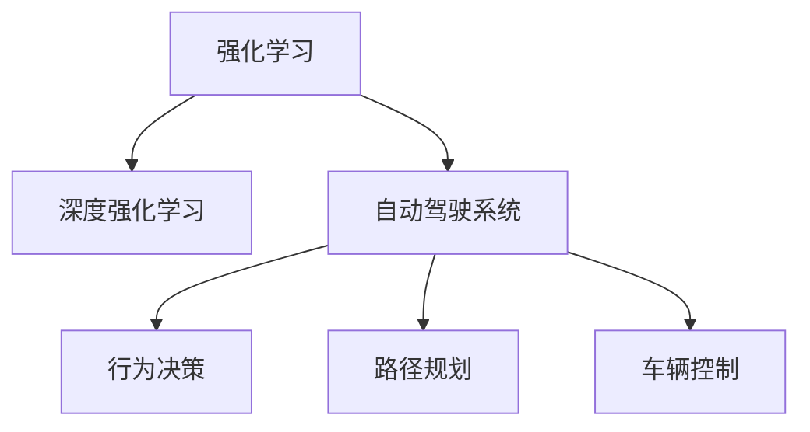

                 

## 1. 背景介绍

### 1.1 问题由来
自动驾驶作为人工智能和计算机视觉技术的一个重要应用领域，近年来受到广泛关注。随着传感器技术、计算平台和算法模型的不断进步，自动驾驶技术已经从实验室走向现实，初步实现了部分道路环境下的自主驾驶。然而，自动驾驶的实现仍然面临诸多挑战，包括复杂多变的道路环境、动态的交通参与者行为、系统实时性要求高等，传统基于规则或决策树的驾驶策略难以满足这些要求。

### 1.2 问题核心关键点
为应对上述挑战，深度强化学习(Deep Reinforcement Learning, DRL)在自动驾驶中的应用逐渐成为研究热点。DRL通过智能体与环境交互，通过不断试错和优化，逐步学习最优决策策略。与传统的基于规则的驾驶策略相比，DRL能够在动态环境中找到更加灵活、鲁棒和高效的驾驶行为，具备更强的泛化能力。

DRL在自动驾驶中的应用主要集中在行为决策、路径规划、车辆控制等方面。通过在虚拟仿真环境中训练DRL模型，使其能够自主学习适应各种复杂的驾驶场景，从而提升自动驾驶系统的智能化水平和鲁棒性。

## 2. 核心概念与联系

### 2.1 核心概念概述

为了更好地理解DRL在自动驾驶中的应用，本节将介绍几个关键概念：

- 强化学习(Reinforcement Learning, RL)：通过智能体与环境的交互，学习到最优的决策策略。强化学习中，智能体通过执行动作获得奖励，并通过逐步优化策略来最大化长期累积奖励。
- 深度强化学习：将深度学习与强化学习相结合，利用神经网络模型学习更复杂的决策函数。深度强化学习在大规模数据集上，能够学习到更高效的策略表示。
- 自动驾驶系统：由感知、决策、控制三个子系统组成的驾驶系统，通过感知环境、决策驾驶策略、控制车辆动作，实现自主驾驶。
- 行为决策：自动驾驶中的关键任务之一，通过智能体与环境的交互，制定最优的驾驶行为策略。
- 路径规划：在行为决策的基础上，利用路径规划算法，制定车辆最优路径，保证车辆在复杂道路环境中安全行驶。
- 车辆控制：根据路径规划结果，控制车辆的加速度、转向等行为，保证车辆按照最优路径稳定行驶。

这些核心概念之间的逻辑关系可以通过以下Mermaid流程图来展示：



这个流程图展示了大语言模型的核心概念及其之间的关系：

1. 强化学习为自动驾驶系统的行为决策提供理论基础，通过智能体与环境的交互，学习最优的决策策略。
2. 深度强化学习在强化学习的基础上，通过神经网络模型学习更复杂的策略表示，提升决策效率和精度。
3. 自动驾驶系统通过感知、决策、控制三个子系统协同工作，实现自主驾驶。
4. 行为决策根据环境感知信息，制定最优的驾驶行为策略。
5. 路径规划在行为决策的基础上，制定车辆最优路径，保证安全行驶。
6. 车辆控制根据路径规划结果，控制车辆动作，保持稳定行驶。

## 3. 核心算法原理 & 具体操作步骤
### 3.1 算法原理概述

深度强化学习在自动驾驶中的应用，本质上是一个智能体与环境交互，通过不断试错和优化，逐步学习最优驾驶策略的过程。假设自动驾驶系统中的智能体为车辆，环境为道路，车辆通过感知模块获取环境信息，通过决策模块制定驾驶策略，通过控制模块调整车辆动作，并根据奖励信号（如安全到达目的地、避免碰撞等）调整策略。

形式化地，假设车辆在环境中的状态空间为 $S$，动作空间为 $A$，状态转移概率为 $p(s_{t+1}|s_t,a_t)$，奖励函数为 $r(s_t,a_t)$。车辆在时间步 $t$ 的状态为 $s_t$，执行动作 $a_t$，在下一个时间步 $t+1$ 到达状态 $s_{t+1}$，并收到奖励信号 $r_t$。车辆的目标是通过学习策略 $\pi(a_t|s_t)$，最大化长期累积奖励 $J(\pi)$：

$$
J(\pi) = \mathbb{E}\left[\sum_{t=0}^{\infty} \gamma^t r_t\right]
$$

其中 $\gamma$ 为折扣因子，控制奖励的权重。通过策略梯度方法（如REINFORCE算法），车辆逐步优化策略 $\pi$，使得 $J(\pi)$ 最大化。

### 3.2 算法步骤详解

深度强化学习在自动驾驶中的应用一般包括以下几个关键步骤：

**Step 1: 环境构建与仿真**
- 构建虚拟仿真环境，如CARLA、Unity等。
- 在虚拟环境中模拟真实的道路场景，包括车道线、红绿灯、行人、车辆等。
- 定义仿真环境的奖励函数，如碰撞惩罚、到达目的地奖励等。

**Step 2: 网络结构设计**
- 设计深度强化学习模型的网络结构，如DQN、PPO、A3C等。
- 确定网络输入为车辆传感器数据，输出为车辆动作（如加速度、转向角等）。

**Step 3: 模型训练与优化**
- 收集大量仿真数据，作为模型训练的输入。
- 使用深度强化学习算法（如A2C、SAC等）进行模型训练。
- 通过策略优化方法（如梯度下降、Adam等）逐步优化策略函数 $\pi$。

**Step 4: 策略评估与测试**
- 在测试环境中进行策略评估，收集车辆的行驶轨迹和奖励。
- 分析车辆的行驶安全性、稳定性、舒适度等性能指标。
- 根据评估结果，进一步优化模型参数，提升策略效果。

**Step 5: 模型部署与应用**
- 将训练好的模型部署到实际车辆中。
- 通过车载传感器实时获取环境信息，控制车辆执行最优驾驶策略。
- 持续收集实际驾驶数据，进行模型迭代和优化。

以上是深度强化学习在自动驾驶中应用的典型流程。在实际应用中，还需要针对具体任务和场景进行优化设计，如引入多任务学习、自适应学习率调度、在线更新策略等。

### 3.3 算法优缺点

深度强化学习在自动驾驶中的应用具有以下优点：
1. 自适应能力强：能够适应复杂多变的道路环境，学习动态变化的驾驶策略。
2. 泛化能力强：在虚拟仿真环境中学习到的策略，能够在实际驾驶环境中泛化。
3. 实时性高：通过在线策略更新，能够即时响应环境变化，做出快速决策。

同时，该方法也存在一定的局限性：
1. 训练时间长：在虚拟仿真环境中进行训练，需要大量计算资源和时间。
2. 稳定性差：深度强化学习的稳定性仍需进一步提升，避免出现策略震荡或发散。
3. 安全性风险：在训练和测试过程中，需要充分考虑模型的安全性，避免潜在风险。
4. 数据量需求大：需要收集大量仿真或实际驾驶数据，数据获取成本较高。

尽管存在这些局限性，但深度强化学习仍然是大规模自动驾驶系统中的重要技术手段。未来相关研究的重点在于如何进一步优化深度强化学习的训练过程，提高模型泛化性和鲁棒性，同时兼顾安全性、稳定性和实时性等因素。

### 3.4 算法应用领域

深度强化学习在自动驾驶中的应用涵盖了多个方面，包括：

- 行为决策：通过智能体与环境的交互，学习最优的驾驶行为策略。例如，车辆在交叉路口选择停车等待或加速通过，或在交通拥堵时选择换道或等待。
- 路径规划：在行为决策的基础上，利用路径规划算法，制定车辆最优路径。例如，车辆在复杂路况下选择最优行驶路径，或在避障时找到最优绕行方案。
- 车辆控制：根据路径规划结果，控制车辆的加速度、转向等行为，保持车辆按照最优路径稳定行驶。例如，车辆在转向时平滑加速减速，或在紧急避障时快速响应。

除了上述这些经典任务外，深度强化学习还被创新性地应用到更多场景中，如多车协同、编队驾驶、车辆自适应巡航等，为自动驾驶技术带来了新的突破。随着深度强化学习的不断进步，相信在自动驾驶领域将有更多的创新应用。

## 4. 数学模型和公式 & 详细讲解  
### 4.1 数学模型构建

本节将使用数学语言对深度强化学习在自动驾驶中的应用进行更加严格的刻画。

假设车辆在时间步 $t$ 的状态为 $s_t$，执行动作 $a_t$，在下一个时间步 $t+1$ 到达状态 $s_{t+1}$，并收到奖励信号 $r_t$。车辆的目标是通过学习策略 $\pi(a_t|s_t)$，最大化长期累积奖励 $J(\pi)$。

车辆在状态 $s_t$ 时，通过感知模块获取环境信息 $o_t$，通过决策模块输出动作 $a_t$：

$$
a_t = \pi(a_t|s_t, o_t)
$$

根据环境转移模型 $p(s_{t+1}|s_t,a_t)$ 和奖励模型 $r_t$，车辆在时间步 $t$ 的状态转移和奖励计算公式为：

$$
s_{t+1} \sim p(s_{t+1}|s_t,a_t)
$$

$$
r_t \sim r_t(s_t,a_t)
$$

车辆的目标是通过策略梯度方法（如REINFORCE算法），逐步优化策略 $\pi$，使得 $J(\pi)$ 最大化。策略梯度算法通过估计梯度 $\nabla_{\theta}\pi(a_t|s_t)$，使用学习率 $\eta$ 更新策略参数 $\theta$：

$$
\theta \leftarrow \theta - \eta \nabla_{\theta}\pi(a_t|s_t)
$$

其中 $\nabla_{\theta}\pi(a_t|s_t)$ 为策略函数的梯度，可以通过反向传播算法高效计算。

### 4.2 公式推导过程

以下我们以深度Q网络(DQN)为例，推导深度强化学习在自动驾驶中的应用公式。

假设车辆在状态 $s_t$ 时的动作值函数为 $Q(s_t,a_t)$，车辆的目标是通过学习动作值函数 $Q$，最大化长期累积奖励 $J(Q)$：

$$
J(Q) = \mathbb{E}\left[\sum_{t=0}^{\infty} \gamma^t Q(s_{t+1},a_{t+1})\right]
$$

根据贝尔曼方程，有：

$$
Q(s_t,a_t) = r_t + \gamma \max_{a_{t+1}} Q(s_{t+1},a_{t+1})
$$

将上述公式展开，得：

$$
Q(s_t,a_t) = r_t + \gamma \max_{a_{t+1}} \left(Q(s_{t+1},a_{t+1})\right)
$$

$$
Q(s_t,a_t) = r_t + \gamma \max_{a_{t+1}} \left(r_{t+1} + \gamma \max_{a_{t+2}} Q(s_{t+2},a_{t+2})\right)
$$

以此类推，可以得到递归公式：

$$
Q(s_t,a_t) = r_t + \gamma \sum_{k=0}^{\infty} \gamma^k \max_{a_{t+k}} Q(s_{t+k},a_{t+k})
$$

DQN通过使用神经网络逼近动作值函数 $Q$，在每个时间步 $t$ 更新 $Q$ 值：

$$
Q(s_t,a_t) \leftarrow Q(s_t,a_t) + \eta (r_t + \gamma \max_{a_{t+1}} Q(s_{t+1},a_{t+1}) - Q(s_t,a_t))
$$

通过上述递归公式，DQN逐步优化动作值函数 $Q$，使得车辆能够学习到最优的驾驶策略。

## 5. 项目实践：代码实例和详细解释说明
### 5.1 开发环境搭建

在进行深度强化学习在自动驾驶中的应用实践前，我们需要准备好开发环境。以下是使用Python进行PyTorch开发的环境配置流程：

1. 安装Anaconda：从官网下载并安装Anaconda，用于创建独立的Python环境。

2. 创建并激活虚拟环境：
```bash
conda create -n pytorch-env python=3.8 
conda activate pytorch-env
```

3. 安装PyTorch：根据CUDA版本，从官网获取对应的安装命令。例如：
```bash
conda install pytorch torchvision torchaudio cudatoolkit=11.1 -c pytorch -c conda-forge
```

4. 安装TensorFlow：
```bash
pip install tensorflow==2.8
```

5. 安装OpenAI Gym：
```bash
pip install gym==0.21.3
```

6. 安装PyBullet：用于虚拟环境模拟。
```bash
pip install pybullet==3.9.4
```

完成上述步骤后，即可在`pytorch-env`环境中开始深度强化学习在自动驾驶中的应用实践。

### 5.2 源代码详细实现

下面我们以DQN模型在自动驾驶中的应用为例，给出使用PyTorch和PyBullet的PyTorch代码实现。

首先，定义DQN模型：

```python
import torch
import torch.nn as nn
import torch.optim as optim
import numpy as np
import pybullet as p

class DQN(nn.Module):
    def __init__(self, input_dim, output_dim):
        super(DQN, self).__init__()
        self.fc1 = nn.Linear(input_dim, 64)
        self.fc2 = nn.Linear(64, 64)
        self.fc3 = nn.Linear(64, output_dim)
        
    def forward(self, x):
        x = F.relu(self.fc1(x))
        x = F.relu(self.fc2(x))
        x = self.fc3(x)
        return x
```

然后，定义DQN模型的训练过程：

```python
def dqn_train(model, optimizer, env, episode, batch_size):
    replay_buffer = []
    state = env.reset()
    done = False
    while not done:
        action, state = choose_action(model, state, episode, batch_size, replay_buffer)
        next_state, reward, done, _ = env.step(action)
        replay_buffer.append((state, action, reward, next_state, done))
        state = next_state
        if len(replay_buffer) >= batch_size:
            batch = random.sample(replay_buffer, batch_size)
            state_batch, action_batch, reward_batch, next_state_batch, done_batch = zip(*batch)
            state_batch = torch.FloatTensor(state_batch)
            action_batch = torch.LongTensor(action_batch)
            next_state_batch = torch.FloatTensor(next_state_batch)
            reward_batch = torch.FloatTensor(reward_batch)
            done_batch = torch.FloatTensor(done_batch)
            q_values = model(state_batch)
            q_values_next = model(next_state_batch)
            max_q_values = torch.max(q_values_next, dim=1)[0]
            q_values = torch.gather(q_values, 1, action_batch)
            target_q_values = reward_batch + gamma * torch.gather(q_values_next, 1, action_batch.unsqueeze(1))
            loss = torch.mean(torch.pow(q_values - target_q_values, 2))
            optimizer.zero_grad()
            loss.backward()
            optimizer.step()
    return None

def choose_action(model, state, episode, batch_size, replay_buffer):
    if episode == 0:
        action = env.action_space.sample()
        state = np.expand_dims(state, axis=0)
    else:
        state = torch.FloatTensor(state)
        q_values = model(state)
        _, action = torch.max(q_values, dim=1)
        action = action.item()
    return action, state
```

最后，启动训练流程并在虚拟环境中测试：

```python
gamma = 0.99
batch_size = 64
episode = 1000

model = DQN(input_dim, output_dim)
optimizer = optim.Adam(model.parameters(), lr=learning_rate)
p.connect(pybullet酱地址)
car = car物理引擎(p.loadURDF('car.urdf', [0, 0, 0], useSimulate=True))
p.configureDebugVisualizer(p.COV_CULL_FACE, True)
p.getPhysicsProperties(car, 0.01, 0, 0.1)
car_color = p.getVisualShapeData(car)[0]
car_color[3] = 1
p.setVisualShapeColor(car, car_color)
car_control = p.SOFTbodyControl(car)
car_control.reset()
for episode in range(episode):
    done = False
    state = env.reset()
    while not done:
        action = choose_action(model, state, episode, batch_size, replay_buffer)
        next_state, reward, done, _ = env.step(action)
        state = next_state
    dqn_train(model, optimizer, env, episode, batch_size)
    print("Episode: {}  Reward: {}".format(episode, reward))
print("Training Finished")
env.close()
p.disconnect()
```

以上就是使用PyTorch和PyBullet实现DQN模型在自动驾驶中的应用示例。可以看到，通过简化的代码，我们能够高效地实现DQN模型的训练和测试。

### 5.3 代码解读与分析

让我们再详细解读一下关键代码的实现细节：

**DQN类**：
- `__init__`方法：定义模型的网络结构，包括三个全连接层。
- `forward`方法：实现前向传播，输出动作值函数 $Q(s_t,a_t)$。

**训练函数**：
- `dqn_train`方法：实现DQN模型的训练过程，包括采样、更新策略参数等。
- 在训练过程中，首先将环境重置为初始状态，执行若干步动作并记录状态和奖励，直到训练完毕。
- 从经验回放缓冲区中随机采样一批样本，计算目标动作值函数和当前动作值函数，计算损失函数并反向传播更新模型参数。
- 训练完成后，返回None，表示训练完成。

**选择动作函数**：
- `choose_action`方法：在测试阶段，根据当前状态和策略函数选择动作。
- 在每个时间步，选择动作的策略根据是否为第一集进行区分。
- 如果当前是第一集，随机选择一个动作。否则，利用模型输出动作值函数，选择具有最高Q值的动作。

在实际应用中，DQN模型还需进一步优化和改进。例如，可以使用深度确定性策略梯度(DDPG)、进化策略(ES)等算法替代DQN，提升模型的稳定性和鲁棒性。

## 6. 实际应用场景
### 6.1 智能导航系统

基于深度强化学习的自动驾驶技术，可以广泛应用于智能导航系统的构建。传统导航系统往往依赖人工规划路径，无法实时适应复杂道路环境，且需要人为干预。而使用深度强化学习的自动驾驶技术，可以自主学习适应各种复杂道路环境，快速找到最优路径，提高导航系统的智能化水平和鲁棒性。

在技术实现上，可以收集城市道路环境数据，构建虚拟仿真环境，在环境中训练DRL模型，使其能够自主规划路径，避开障碍物，实现安全导航。例如，在到达交叉路口时，智能体可以通过学习最优策略，选择停车等待或加速通过，或在交通拥堵时选择换道或等待。

### 6.2 智能交通管理

深度强化学习在智能交通管理中也得到了广泛应用。通过构建虚拟仿真环境，训练DRL模型，可以实现交通信号控制、车辆调度等优化任务。

在信号控制方面，通过学习交通流状态和信号灯状态，DRL模型可以实时调整信号灯时长，最大化道路通行效率。在车辆调度方面，通过学习车辆位置和速度，DRL模型可以优化车辆行驶路径，减少交通拥堵。

### 6.3 多车协同驾驶

多车协同驾驶是未来自动驾驶的重要发展方向之一。通过构建多车系统的虚拟仿真环境，训练DRL模型，可以实现多车协同避障、协同加速等协同驾驶任务。

在多车协同避障方面，DRL模型通过学习多车之间的交互策略，实现车辆避障和车道保持。在多车协同加速方面，DRL模型通过学习多车间的速度协调，实现稳定高效的编队行驶。

### 6.4 未来应用展望

随着深度强化学习技术的不断发展，其在自动驾驶中的应用将更加广泛和深入。未来，DRL技术有望在自动驾驶的各个环节中发挥重要作用，提升系统的智能化水平和鲁棒性。

在感知模块中，DRL技术可以通过学习车辆传感器数据的概率分布，提升环境感知能力。在决策模块中，DRL技术可以通过学习最优驾驶策略，提升决策精准度和安全性。在控制模块中，DRL技术可以通过学习最优车辆控制策略，提升车辆稳定性和舒适性。

随着深度强化学习技术的不断突破，未来自动驾驶系统将能够更好地适应动态复杂的道路环境，实现全场景覆盖，提升安全性、舒适性和用户体验。

## 7. 工具和资源推荐
### 7.1 学习资源推荐

为了帮助开发者系统掌握深度强化学习在自动驾驶中的应用，这里推荐一些优质的学习资源：

1. 《强化学习》系列博文：由强化学习专家撰写，详细讲解了强化学习的基本原理和经典算法，是入门学习的优秀参考。

2. 《深度强化学习》课程：斯坦福大学开设的深度强化学习课程，由深度学习专家讲授，涵盖深度强化学习的基本概念和应用。

3. 《深度强化学习与自适应决策》书籍：深度强化学习领域的经典书籍，详细讲解了深度强化学习的基本原理和应用，是进阶学习的优秀参考。

4. OpenAI Gym官网：提供了多种环境模拟工具和算法框架，是进行深度强化学习应用开发的理想平台。

5. PyBullet官网：提供了高质量的物理引擎，支持多维仿真环境的构建和测试。

通过对这些资源的学习实践，相信你一定能够快速掌握深度强化学习在自动驾驶中的应用，并用于解决实际的自动驾驶问题。

### 7.2 开发工具推荐

高效的开发离不开优秀的工具支持。以下是几款用于深度强化学习在自动驾驶中的应用开发的常用工具：

1. PyTorch：基于Python的开源深度学习框架，灵活动态的计算图，适合快速迭代研究。

2. TensorFlow：由Google主导开发的开源深度学习框架，生产部署方便，适合大规模工程应用。

3. OpenAI Gym：用于环境模拟和算法测试的平台，提供了多种标准环境，方便模型训练和测试。

4. PyBullet：高质量的物理引擎，支持多维仿真环境的构建和测试。

5. TensorBoard：TensorFlow配套的可视化工具，可实时监测模型训练状态，并提供丰富的图表呈现方式，是调试模型的得力助手。

6. Weights & Biases：模型训练的实验跟踪工具，可以记录和可视化模型训练过程中的各项指标，方便对比和调优。

合理利用这些工具，可以显著提升深度强化学习在自动驾驶中的应用开发效率，加快创新迭代的步伐。

### 7.3 相关论文推荐

深度强化学习在自动驾驶中的应用源于学界的持续研究。以下是几篇奠基性的相关论文，推荐阅读：

1. DeepMind的AlphaGo：展示了深度强化学习在复杂博弈问题上的强大能力，为自动驾驶提供理论基础。

2. Soft Actor Critic(SAC)：提出了一种新的深度强化学习算法，在连续动作空间上实现了高效学习，为自动驾驶提供了新的优化方法。

3. A3C算法：提出了一种分布式训练方法，可以并行训练多个智能体，加速深度强化学习的训练过程，提升了自动驾驶的实时性。

4. DeepRacer：由OpenAI开发的自动驾驶训练平台，使用DQN算法训练车辆在虚拟环境中进行自动驾驶，展示了深度强化学习在自动驾驶中的应用潜力。

这些论文代表了大语言模型微调技术的发展脉络。通过学习这些前沿成果，可以帮助研究者把握学科前进方向，激发更多的创新灵感。

## 8. 总结：未来发展趋势与挑战

### 8.1 总结

本文对深度强化学习在自动驾驶中的应用进行了全面系统的介绍。首先阐述了深度强化学习在自动驾驶系统中的研究背景和意义，明确了DRL在行为决策、路径规划、车辆控制等环节的应用价值。其次，从原理到实践，详细讲解了深度强化学习的数学模型和算法步骤，给出了深度强化学习在自动驾驶中的应用实例。同时，本文还广泛探讨了深度强化学习在智能导航系统、智能交通管理、多车协同驾驶等多个领域的应用前景，展示了DRL范式的巨大潜力。

通过本文的系统梳理，可以看到，深度强化学习在自动驾驶中的应用已经成为当前的热点研究方向，极大地提升了自动驾驶系统的智能化水平和鲁棒性。随着深度强化学习技术的不断进步，未来DRL技术必将在自动驾驶领域中扮演更加重要的角色。

### 8.2 未来发展趋势

展望未来，深度强化学习在自动驾驶中的应用将呈现以下几个发展趋势：

1. 自适应能力提升：通过改进算法和优化策略，使深度强化学习模型能够更好地适应动态复杂的道路环境，提高鲁棒性和泛化能力。

2. 多模态融合：将深度强化学习与计算机视觉、自然语言处理等其他技术相结合，提升多模态信息的融合能力，实现更为全面和准确的环境感知和决策。

3. 实时性优化：通过改进计算图和优化算法，提升深度强化学习的训练和推理效率，实现更加实时和高效的自动驾驶系统。

4. 安全性和稳定性：深度强化学习模型需要进一步优化安全性策略，避免出现意外事故，同时提高模型的稳定性和鲁棒性。

5. 模型压缩与优化：通过模型压缩、稀疏化存储等技术，提升深度强化学习模型的计算效率和存储效率，实现轻量级部署。

6. 联邦学习和分布式训练：通过多车协同学习、分布式训练等技术，提升深度强化学习模型的训练速度和性能。

以上趋势凸显了深度强化学习在自动驾驶中的广阔前景。这些方向的探索发展，必将进一步提升自动驾驶系统的智能化水平和鲁棒性，为构建安全、可靠、高效、智能的自动驾驶系统铺平道路。

### 8.3 面临的挑战

尽管深度强化学习在自动驾驶中的应用已经取得诸多进展，但仍面临诸多挑战：

1. 训练时间和成本高：深度强化学习在虚拟仿真环境中进行训练，需要大量计算资源和时间，训练成本较高。

2. 数据需求大：深度强化学习模型需要大量训练数据，数据获取成本较高。

3. 安全性风险：在训练和测试过程中，需要充分考虑模型的安全性，避免出现意外事故。

4. 稳定性差：深度强化学习模型在复杂环境中的稳定性仍需进一步提升，避免策略震荡或发散。

5. 计算资源需求大：深度强化学习模型需要大量计算资源，硬件要求较高。

尽管存在这些挑战，但深度强化学习在自动驾驶中的应用前景仍然广阔，需要学界和产业界的共同努力，不断突破技术瓶颈，推动DRL技术在自动驾驶领域的广泛应用。

### 8.4 研究展望

面向未来，深度强化学习在自动驾驶中的应用需要重点关注以下几个研究方向：

1. 改进训练算法：改进深度强化学习的训练算法，提升模型的泛化能力和稳定性，实现更加高效的训练过程。

2. 多任务学习：引入多任务学习技术，使深度强化学习模型能够同时学习多个相关任务，提升多任务协同能力。

3. 自适应学习率调度：研究自适应学习率调度方法，实现学习率动态调整，提升模型训练效率和性能。

4. 模型压缩与优化：研究模型压缩和优化技术，提升深度强化学习模型的计算效率和存储效率，实现轻量级部署。

5. 多模态融合：将深度强化学习与计算机视觉、自然语言处理等其他技术相结合，提升多模态信息的融合能力，实现更为全面和准确的环境感知和决策。

6. 联邦学习和分布式训练：通过多车协同学习、分布式训练等技术，提升深度强化学习模型的训练速度和性能。

这些研究方向将进一步提升深度强化学习在自动驾驶中的应用效果，推动自动驾驶技术的广泛应用和产业化进程。

## 9. 附录：常见问题与解答

**Q1：深度强化学习在自动驾驶中是否需要大量的标注数据？**

A: 深度强化学习在自动驾驶中的应用主要依赖于虚拟仿真环境，因此无需大量的标注数据。通过在虚拟仿真环境中进行训练，深度强化学习模型可以自主学习适应各种复杂的驾驶场景，从而提升自动驾驶系统的智能化水平和鲁棒性。

**Q2：深度强化学习的训练时间和成本如何？**

A: 深度强化学习在虚拟仿真环境中进行训练，需要大量计算资源和时间，训练成本较高。具体来说，训练时间取决于模型的复杂度和环境模拟的精细度。然而，一旦模型训练完成，其在实际驾驶环境中的泛化能力较强，能够在较少数据和少量人机交互的情况下进行微调。

**Q3：深度强化学习模型的安全性如何？**

A: 深度强化学习模型的安全性是其应用的重要保障。在训练和测试过程中，需要通过充分的环境验证和安全测试，确保模型在各种极端情况下能够稳定运行，避免出现意外事故。

**Q4：深度强化学习模型的稳定性如何？**

A: 深度强化学习模型的稳定性是其应用的关键因素。在复杂环境中的稳定性仍需进一步提升，避免策略震荡或发散。通过改进算法和优化策略，可以提升模型的稳定性和鲁棒性。

**Q5：深度强化学习在自动驾驶中的应用场景有哪些？**

A: 深度强化学习在自动驾驶中的应用场景包括智能导航系统、智能交通管理、多车协同驾驶等。通过构建虚拟仿真环境，训练DRL模型，可以实现多车协同避障、协同加速等协同驾驶任务，提升系统智能化水平和鲁棒性。

---

作者：禅与计算机程序设计艺术 / Zen and the Art of Computer Programming

