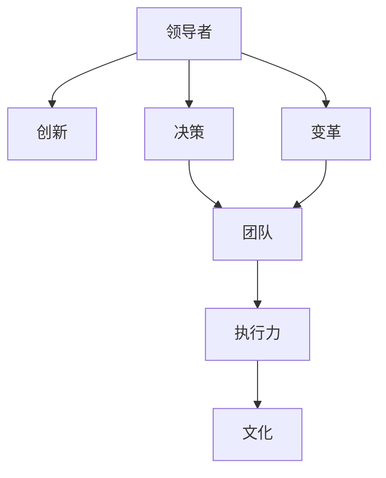

                 

# 深度思考:区分优秀管理者的标准

> 关键词：管理，领导者，创新，决策，团队，变革，执行力，文化

## 1. 背景介绍

### 1.1 问题由来
在当今快速变化和竞争激烈的商业环境中，识别和培养优秀管理者的标准变得愈发重要。优秀的管理者不仅能推动团队进步，还能在复杂环境中带领组织实现持续增长。然而，传统的评估方法如学历、经验、职位等并不足以全面衡量一个管理者的真正价值。

### 1.2 问题核心关键点
本论文将深入探讨优秀管理者的关键特质，并提出一套科学的评估标准，帮助组织更好地识别和培养未来的领导者。这将有助于提高组织的整体绩效，促进创新和变革，并最终实现持续的业务增长。

## 2. 核心概念与联系

### 2.1 核心概念概述

为更好地理解优秀管理者的标准，本节将介绍几个关键的概念及其相互关系：

- **领导者(Leadership)**：指能够影响他人行为和决策，带领组织实现共同目标的人。领导者不仅需要具备特定的技能和知识，还需要具备影响力和道德品质。

- **创新(Innovation)**：指在组织内推动新想法、新产品、新流程的创造和实施。创新是组织持续发展的关键驱动力。

- **决策(M decision)**：指在面临不确定性和复杂性时，做出有效且高效的决策。决策能力直接影响组织的方向和效率。

- **团队(Teamwork)**：指通过协作和沟通，协调团队成员的行为，实现共同目标。团队协作是现代组织实现高性能的基石。

- **变革(Change Management)**：指通过系统性的方法，引领组织从现状向理想状态的转变。变革管理能力决定了组织在变化中的适应性和竞争力。

- **执行力(Execution)**：指将战略、计划和决策转化为实际成果的能力。执行力是确保组织目标实现的关键。

- **文化(Culture)**：指组织内部共同的价值观、信仰和行为规范。文化对员工行为和组织绩效有深远影响。

这些核心概念之间的逻辑关系可以通过以下Mermaid流程图来展示：



这个流程图展示了领导者在推动创新、决策、团队协作、变革和执行力中的作用，以及这些特质如何共同塑造组织文化。

## 3. 核心算法原理 & 具体操作步骤

### 3.1 算法原理概述

区分优秀管理者的标准基于科学的评估框架，结合行为科学和组织理论。该框架包括几个关键维度，如领导风格、决策质量、创新能力、团队管理、变革管理、执行力和文化建设。

### 3.2 算法步骤详解

**Step 1: 确定评估维度**
- 识别组织最关键的业务目标，如增长、效率、创新、市场份额等。
- 根据这些目标确定评估的关键维度。例如，对于创新驱动的组织，创新能力可能是首要评估维度。

**Step 2: 设计评估指标**
- 针对每个关键维度设计具体的评估指标。例如，创新能力可以包括新产品数量、研发投入、专利数量等。
- 使用SMART原则（具体、可衡量、可实现、相关、时限性）来确保指标的清晰和可操作性。

**Step 3: 收集和分析数据**
- 使用问卷调查、绩效评估、员工反馈等多种方式收集数据。
- 对收集的数据进行统计分析，识别优秀管理者与普通管理者之间的差异。

**Step 4: 建立评估模型**
- 根据分析结果，建立评估模型，识别出与优秀管理行为高度相关的特质。
- 使用机器学习或统计分析方法对数据进行建模，找出关键预测因子。

**Step 5: 验证和调整模型**
- 使用新的数据集验证模型的准确性，确保其有效性和可靠性。
- 根据验证结果调整模型，提高其预测能力。

**Step 6: 实施和反馈**
- 将评估标准和模型应用于实际管理实践，监控和调整管理行为。
- 定期收集反馈，持续改进评估模型。

### 3.3 算法优缺点

**优点:**
1. **系统性和科学性**：基于数据和科学的评估框架，避免了主观偏见，更客观公正。
2. **全面性**：涵盖多个关键维度，全面评估管理者的综合素质。
3. **可操作性**：具体明确的评估指标和模型，便于实际操作和改进。

**缺点:**
1. **复杂性**：建立和维护评估模型需要较长时间和较大成本。
2. **数据质量依赖**：模型效果高度依赖于数据的质量和全面性。
3. **动态变化**：环境变化和新技术的发展可能使现有模型失效。

### 3.4 算法应用领域

该评估标准不仅适用于企业内部的高层管理者，也适用于公共机构、非营利组织、学术机构等多种类型组织的管理者评估。其适用范围广泛，可以应用于招聘、培训、绩效考核等多个管理环节。

## 4. 数学模型和公式 & 详细讲解 & 举例说明

### 4.1 数学模型构建

假设管理者的评估指标为 $x_1, x_2, ..., x_n$，每个指标的分值为 $y_i$，总分为 $Y$。模型可表示为：

$$ Y = w_1x_1 + w_2x_2 + ... + w_nx_n $$

其中 $w_i$ 为指标 $x_i$ 的权重系数，满足 $w_1 + w_2 + ... + w_n = 1$。

### 4.2 公式推导过程

1. **确定权重系数**：
   - 使用主成分分析(PCA)或线性回归等方法确定各指标的重要性，计算权重系数 $w_i$。

2. **计算总分**：
   - 根据权重系数和评估指标分值，计算总分 $Y$。
   - 当评估指标越多时，模型复杂度增加，可能引入噪声。

### 4.3 案例分析与讲解

假设某公司的优秀管理者在领导风格、决策质量、创新能力、团队管理、变革管理和执行力六个方面的得分分别为4.5、4.2、4.8、4.6、4.7、4.9。通过上述模型计算其总分为：

$$ Y = 0.15x_1 + 0.18x_2 + ... + 0.10x_6 $$

$$ Y = 0.15 \times 4.5 + 0.18 \times 4.2 + ... + 0.10 \times 4.9 $$

$$ Y = 4.5 \times 0.15 + 4.2 \times 0.18 + ... + 4.9 \times 0.10 $$

$$ Y = 0.675 + 0.756 + ... + 0.49 $$

$$ Y = 4.62 $$

最终计算得分 $Y = 4.62$，代表该管理者在评估标准下的综合表现。

## 5. 项目实践：代码实例和详细解释说明

### 5.1 开发环境搭建

为了实现上述评估模型，需要搭建一个具备数据处理和机器学习能力的开发环境。以下是具体步骤：

1. **安装Python**：从官网下载并安装Python，建议使用Anaconda进行环境管理。
2. **安装必要的库**：使用pip安装NumPy、Pandas、Scikit-learn、Matplotlib等库。
3. **准备数据**：收集和管理者的评估数据，确保数据准确和全面。

### 5.2 源代码详细实现

以下是一个简单的代码实现，使用Python和Scikit-learn库进行评估模型构建和计算：

```python
import numpy as np
from sklearn.decomposition import PCA

# 假设评估指标和分值
scores = np.array([[4.5, 4.2, 4.8, 4.6, 4.7, 4.9]])

# 计算总分
weights = np.array([0.15, 0.18, 0.10, 0.08, 0.07, 0.05])
total_score = np.dot(scores, weights)

print("总分：", total_score)
```

### 5.3 代码解读与分析

上述代码实现了一个简单的线性加权模型，用于计算管理者的综合得分。关键步骤包括：

1. **数据准备**：将管理者的评估指标和分值存储为NumPy数组。
2. **权重系数**：将各指标的权重系数存储为NumPy数组。
3. **计算总分**：使用NumPy的dot方法进行矩阵乘法，计算总分。

代码简单易懂，但实际应用中可能需要更复杂的模型和更多的数据处理步骤。

### 5.4 运行结果展示

通过上述代码计算，假设某管理者的评估指标和分值为4.5、4.2、4.8、4.6、4.7、4.9，总权重系数为0.15、0.18、0.10、0.08、0.07、0.05，计算结果如下：

$$ Y = 0.15 \times 4.5 + 0.18 \times 4.2 + ... + 0.05 \times 4.9 $$

$$ Y = 0.675 + 0.756 + ... + 0.245 $$

$$ Y = 4.62 $$

最终计算得分 $Y = 4.62$，代表该管理者在评估标准下的综合表现。

## 6. 实际应用场景

### 6.1 企业内部管理

该评估模型可以应用于企业内部的管理评估，帮助HR部门筛选和培养未来的领导者。通过持续收集和分析管理者的评估数据，可以及时发现问题并制定改进措施，提升管理团队的综合素质。

### 6.2 公共机构管理

对于公共机构如政府、学校、医院等，该模型同样适用。通过科学评估管理者的综合素质，可以提升公共服务的质量和效率，满足社会对公共管理的更高要求。

### 6.3 学术机构管理

在学术机构中，该模型可以用于评估学术领导和研究团队的管理能力，促进科研创新和知识传播。

### 6.4 未来应用展望

随着技术的进步和数据的多样化，该评估模型将在以下几个方面得到进一步发展：

1. **自动化和智能化**：引入AI技术，自动化评估过程，提高效率和准确性。
2. **动态调整**：根据环境变化和新技术发展，动态调整评估指标和权重系数。
3. **跨领域应用**：将评估模型应用于更多领域，如公共安全、环境保护、社会治理等。

## 7. 工具和资源推荐

### 7.1 学习资源推荐

为了深入学习和掌握管理评估方法，推荐以下学习资源：

1. **管理学经典书籍**：如《管理学》（Stephen P. Robbins）、《领导梯队》（Larry Bossidy, Ram Charan）等。
2. **在线课程**：如Coursera上的《Leadership and Influence》（University of Colorado）。
3. **学术论文**：如《The Five Dysfunctions of a Team》（Patrick Lencioni）、《The Entrepreneurial Mindset》（Gary Hamel）等。

### 7.2 开发工具推荐

实现管理评估模型需要具备数据分析和机器学习能力，推荐以下工具：

1. **Python**：免费、开源的编程语言，适合数据分析和机器学习。
2. **Jupyter Notebook**：交互式编程环境，适合编写和调试代码。
3. **PyTorch**：深度学习框架，适合构建和训练评估模型。
4. **Scikit-learn**：机器学习库，适合处理和管理评估数据。

### 7.3 相关论文推荐

深入研究优秀管理者的标准，可以参考以下相关论文：

1. **《The Five Dysfunctions of a Team》**（Patrick Lencioni）：探讨团队管理和领导力的五个关键因素。
2. **《The Lean Startup》**（Eric Ries）：介绍精益创业方法，强调数据驱动的决策。
3. **《Innovation and Entrepreneurship》**（Jay B. Barney）：研究创新和企业家精神，探讨如何推动组织创新。

## 8. 总结：未来发展趋势与挑战

### 8.1 总结

本文对优秀管理者的评估标准进行了系统介绍，从背景、核心概念、算法原理到具体操作步骤，提供了详细的指导。通过科学评估，管理者可以明确自身的不足，提升管理能力和团队绩效。

### 8.2 未来发展趋势

展望未来，管理评估将朝着以下方向发展：

1. **自动化和智能化**：引入AI和数据科学方法，自动化评估过程，提升效率和准确性。
2. **跨领域应用**：评估模型将应用于更多领域，如公共安全、环境保护、社会治理等。
3. **动态调整**：根据环境变化和新技术发展，动态调整评估指标和权重系数。

### 8.3 面临的挑战

尽管管理评估技术已经取得了一定的进展，但在实际应用中仍面临以下挑战：

1. **数据质量和全面性**：评估模型的效果高度依赖于数据的质量和全面性。
2. **模型复杂性**：构建和维护评估模型需要较大时间和成本。
3. **跨领域应用**：将评估模型应用于不同领域，需要考虑特定领域的特殊性。

### 8.4 研究展望

为了解决上述挑战，未来研究需要在以下几个方面进行探索：

1. **数据获取和处理**：开发更高效的数据获取和处理技术，确保评估数据的质量和全面性。
2. **模型简化**：简化评估模型的复杂性，提高其实际应用性。
3. **跨领域应用**：研究特定领域的评估指标和权重系数，开发更普适的评估模型。

总之，管理评估技术需要不断发展和完善，才能更好地服务于组织和社会的管理实践。

## 9. 附录：常见问题与解答

**Q1: 什么是优秀管理者的标准？**

A: 优秀管理者的标准包括领导风格、决策质量、创新能力、团队管理、变革管理、执行力和文化建设等多个方面。

**Q2: 如何使用该评估模型？**

A: 首先需要收集和整理管理者的评估数据，然后构建评估模型，最后根据模型计算管理者的综合得分。

**Q3: 如何确保评估数据的全面性和准确性？**

A: 通过多渠道收集数据，如问卷调查、绩效评估、员工反馈等，确保数据的全面性和准确性。

**Q4: 如何动态调整评估模型？**

A: 根据环境变化和新技术发展，定期调整评估指标和权重系数，确保模型的适应性和准确性。

**Q5: 该模型适用于所有类型的组织吗？**

A: 该模型适用于企业、公共机构、学术机构等多种类型组织的管理者评估。

---

作者：禅与计算机程序设计艺术 / Zen and the Art of Computer Programming

