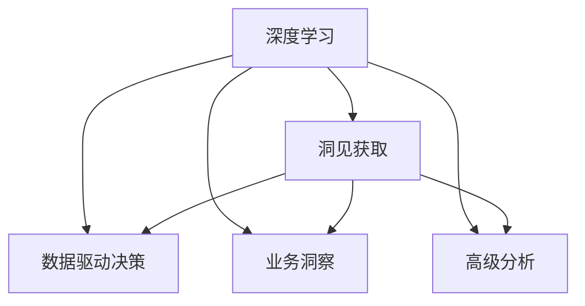

                 

# 深度思考:管理者获取洞见的能力

> 关键词：管理者, 深度学习, 洞见获取, 数据驱动决策, 人工智能, 业务洞察, 高级分析

## 1. 背景介绍

### 1.1 问题由来

在快速变化的市场环境中，管理者需要时刻把握最新趋势，做出明智的决策。然而，信息的海量化和复杂化让管理者难以从中提取有价值的洞见。传统的基于经验或者直觉的管理决策方法越来越难以满足现代管理的需求。因此，管理者亟需借助先进的技术手段，特别是深度学习和大数据技术，来提升自身的洞察力，从而做出更加精准、高效的决策。

### 1.2 问题核心关键点

深度学习在数据分析和模式识别方面的强大能力，让管理者能够从海量数据中快速识别出有价值的洞见。然而，深度学习模型的黑箱特性使得其结果难以解释，这给决策者带来了一定的困惑。因此，管理者需要在获取洞见的同时，掌握一定的深度学习知识，以便于理解模型的输出，做出更加科学合理的决策。

## 2. 核心概念与联系

### 2.1 核心概念概述

为更好地理解深度学习在管理者获取洞见中的应用，本节将介绍几个密切相关的核心概念：

- **深度学习**：一种基于多层神经网络的机器学习方法，通过大量数据训练，能够自动提取特征，并进行高级模式识别和分类。
- **洞见获取**：从大量数据中，提取有价值的信息和知识，供决策者参考。
- **数据驱动决策**：利用数据和分析模型，指导企业战略决策，提升决策的科学性和精确性。
- **业务洞察**：通过深度分析，挖掘企业运营中的关键信息和趋势，帮助优化管理流程和提升绩效。
- **高级分析**：利用大数据和机器学习技术，进行复杂的数据挖掘和预测分析，为企业提供战略参考。

这些核心概念之间的逻辑关系可以通过以下Mermaid流程图来展示：



这个流程图展示了这个核心概念框架，从深度学习到洞见获取，再到数据驱动决策和业务洞察等各个环节，构成了深度学习在管理者获取洞见中的完整应用链条。

## 3. 核心算法原理 & 具体操作步骤
### 3.1 算法原理概述

管理者获取洞见的核心算法是深度学习，特别是卷积神经网络(CNN)和循环神经网络(RNN)等结构。这些算法通过多层神经网络，自动学习数据的特征表示，并进行复杂的模式识别和分类。

具体而言，深度学习模型的训练流程包括以下几个关键步骤：

1. **数据准备**：收集、清洗和预处理数据，确保数据质量。
2. **模型训练**：使用深度学习框架，如TensorFlow或PyTorch，构建和训练模型。
3. **模型评估**：使用测试数据集评估模型性能，调整模型参数。
4. **模型应用**：将训练好的模型应用于实际问题，提取洞见。

### 3.2 算法步骤详解

以下是使用深度学习模型进行洞见获取的详细步骤：

**Step 1: 数据准备**

1. 数据收集：收集相关数据源，如销售记录、客户反馈、市场调研报告等。
2. 数据清洗：去除噪声和异常值，确保数据质量。
3. 数据预处理：进行标准化、归一化、降维等操作，便于模型训练。

**Step 2: 模型训练**

1. 选择合适的深度学习模型：如CNN、RNN、LSTM等。
2. 设置训练参数：如学习率、批大小、迭代轮数等。
3. 训练模型：使用深度学习框架，对模型进行训练。
4. 调整模型参数：根据模型性能，调整超参数，优化模型。

**Step 3: 模型评估**

1. 使用测试数据集评估模型：计算模型在测试集上的准确率、召回率、F1值等指标。
2. 调整模型参数：根据评估结果，调整超参数，优化模型。

**Step 4: 模型应用**

1. 应用模型提取洞见：将训练好的模型应用于实际问题，提取关键洞见。
2. 分析洞见：利用数据分析工具，如Tableau、Power BI等，进行数据可视化，挖掘关键信息。
3. 制定决策：根据洞见，制定科学合理的决策。

### 3.3 算法优缺点

深度学习模型在洞见获取中具有以下优点：

1. 自动化特征提取：能够自动学习数据的高级特征，无需手动提取。
2. 高精度预测：在处理大规模数据时，具有较高的准确率和召回率。
3. 可解释性强：利用深度学习工具，如TensorBoard、Netron等，可以可视化模型结构，解释模型输出。
4. 灵活性高：适用于各种数据类型，如图像、文本、时间序列等。

同时，深度学习模型也存在以下局限性：

1. 数据依赖性强：深度学习模型依赖大量标注数据，数据质量直接影响模型性能。
2. 计算资源消耗大：深度学习模型参数量大，训练和推理耗时较长。
3. 黑箱特性：深度学习模型结构复杂，难以解释其内部工作机制。
4. 过拟合风险：在数据量不足时，容易发生过拟合，导致模型泛化能力差。

尽管存在这些局限性，但深度学习模型在洞见获取中的应用前景仍然广阔。管理者在应用过程中，需要结合自身实际需求，选择合适的模型和技术，最大化利用深度学习带来的优势。

### 3.4 算法应用领域

深度学习在管理者获取洞见中的应用，可以广泛涵盖以下几个领域：

1. **销售分析**：通过分析销售数据，挖掘销售趋势、客户偏好等关键信息，帮助优化销售策略。
2. **客户细分**：利用客户数据，进行客户分群和个性化营销，提升客户满意度。
3. **风险管理**：分析市场数据，识别潜在风险和机会，制定风险管理策略。
4. **产品优化**：通过客户反馈和市场调研数据，优化产品设计和性能，提升用户体验。
5. **运营优化**：分析运营数据，优化流程和资源配置，提高运营效率。
6. **市场预测**：利用历史数据，进行市场趋势预测，指导市场战略。

## 4. 数学模型和公式 & 详细讲解 & 举例说明

### 4.1 数学模型构建

在深度学习中，常用的数学模型包括多层感知器(MLP)、卷积神经网络(CNN)和循环神经网络(RNN)等。以下以CNN为例，说明数学模型的构建。

假设输入数据为 $x \in \mathbb{R}^{n}$，输出标签为 $y \in \{0,1\}$。则CNN模型结构如下：

```
输入层
|
| -卷积层 - 激活层 - 池化层 - 全连接层 - 输出层
```

其中，卷积层用于提取特征，激活层用于引入非线性关系，池化层用于降维，全连接层用于输出预测结果。

### 4.2 公式推导过程

以下是CNN模型的详细公式推导：

- **卷积层**：
  $$
  C_k(x) = \sum_{i=1}^n \sum_{j=1}^n w_{ij} x_{ij} + b_k
  $$
  其中，$w_{ij}$ 为卷积核参数，$b_k$ 为偏置参数。

- **激活层**：
  $$
  h_k(x) = \max(0, C_k(x))
  $$

- **池化层**：
  $$
  P_k(x) = \max(C_k(x))
  $$

- **全连接层**：
  $$
  Z_k = \sum_{i=1}^n w_i h_{ki} + b_k
  $$

- **输出层**：
  $$
  y = \sigma(Z_k)
  $$
  其中，$\sigma$ 为sigmoid激活函数。

### 4.3 案例分析与讲解

以一个简单的图像分类任务为例，说明深度学习模型的应用过程。

1. **数据准备**：收集一组手写数字图片，并将其标准化处理。
2. **模型训练**：构建一个包含卷积层、激活层和池化层的CNN模型，使用训练集进行训练，调整超参数。
3. **模型评估**：使用测试集评估模型性能，调整超参数。
4. **模型应用**：应用训练好的模型，对新的手写数字图片进行分类，提取关键洞见。

## 5. 项目实践：代码实例和详细解释说明
### 5.1 开发环境搭建

在进行深度学习项目实践前，我们需要准备好开发环境。以下是使用Python进行TensorFlow开发的流程：

1. 安装Anaconda：从官网下载并安装Anaconda，用于创建独立的Python环境。
2. 创建并激活虚拟环境：
```bash
conda create -n tf-env python=3.7 
conda activate tf-env
```
3. 安装TensorFlow：根据CUDA版本，从官网获取对应的安装命令。例如：
```bash
conda install tensorflow tensorflow-gpu -c conda-forge -c nvidia
```
4. 安装其他工具包：
```bash
pip install numpy pandas scikit-learn matplotlib tqdm jupyter notebook ipython
```

完成上述步骤后，即可在`tf-env`环境中开始项目开发。

### 5.2 源代码详细实现

这里我们以手写数字分类任务为例，给出使用TensorFlow构建CNN模型的代码实现。

首先，定义数据处理函数：

```python
import tensorflow as tf
from tensorflow.keras import layers

def data_preprocessing(data):
    # 对数据进行标准化处理
    return (data - 128) / 128
```

然后，定义模型：

```python
model = tf.keras.Sequential([
    layers.Conv2D(32, 3, activation='relu', input_shape=(28, 28, 1)),
    layers.MaxPooling2D(),
    layers.Flatten(),
    layers.Dense(10, activation='softmax')
])
```

接着，定义训练和评估函数：

```python
def train_model(model, data, epochs=5, batch_size=64):
    # 定义损失函数和优化器
    loss_fn = tf.keras.losses.SparseCategoricalCrossentropy()
    optimizer = tf.keras.optimizers.Adam()

    # 训练模型
    for epoch in range(epochs):
        for batch in data:
            inputs, labels = batch
            with tf.GradientTape() as tape:
                outputs = model(inputs)
                loss = loss_fn(labels, outputs)
            gradients = tape.gradient(loss, model.trainable_variables)
            optimizer.apply_gradients(zip(gradients, model.trainable_variables))

    # 评估模型
    test_loss = tf.keras.metrics.Mean()
    test_accuracy = tf.keras.metrics.SparseCategoricalAccuracy()
    for batch in data:
        inputs, labels = batch
        outputs = model(inputs)
        test_loss(loss_fn(labels, outputs))
        test_accuracy(labels, outputs)
    print(f'Test Loss: {test_loss.result()}, Test Accuracy: {test_accuracy.result()}')

# 加载数据集
mnist = tf.keras.datasets.mnist
(x_train, y_train), (x_test, y_test) = mnist.load_data()
x_train = data_preprocessing(x_train)
x_test = data_preprocessing(x_test)
```

最后，启动训练流程：

```python
train_model(model, (x_train, y_train))
```

以上是一个简单的TensorFlow代码实例，展示了从数据预处理到模型训练的完整流程。

### 5.3 代码解读与分析

让我们再详细解读一下关键代码的实现细节：

**data_preprocessing函数**：
- 对输入数据进行标准化处理，将数据缩放到均值为0，标准差为1。

**model模型定义**：
- 定义了一个包含卷积层、池化层和全连接层的CNN模型。

**train_model函数**：
- 定义了模型损失函数和优化器，并在每个epoch内对模型进行训练。
- 在训练过程中，计算损失函数，并使用梯度下降法更新模型参数。
- 最后，在测试集上评估模型性能。

**数据加载**：
- 使用TensorFlow内置的MNIST数据集，进行数据预处理和加载。

可以看到，TensorFlow的Keras API使得模型构建和训练过程变得简洁高效，开发者可以将更多精力放在数据处理和模型改进上。

当然，在工业级的系统实现中，还需要考虑更多因素，如模型的保存和部署、超参数的自动搜索、更加灵活的任务适配层等。但核心的深度学习范式基本与此类似。

## 6. 实际应用场景
### 6.1 智能客服系统

基于深度学习技术，智能客服系统能够处理大量的客户咨询，提升客户体验。具体而言，可以通过训练深度学习模型，从历史客服数据中挖掘出常见问题、答案模板等关键信息，自动生成回复，提高客服响应速度和准确率。

### 6.2 金融舆情监测

金融行业需要实时监控市场舆情，以便及时应对负面信息传播，规避金融风险。利用深度学习模型，可以分析新闻、社交媒体等大量数据，挖掘市场情绪和舆情变化趋势，及时预警潜在风险。

### 6.3 个性化推荐系统

推荐系统需要处理海量用户行为数据，挖掘用户兴趣和行为模式。通过深度学习模型，可以从用户浏览、点击、评分等行为中提取特征，进行个性化推荐，提升用户体验。

### 6.4 未来应用展望

深度学习在管理者获取洞见中的应用前景广阔，未来还将不断拓展和深化。

1. **自动化决策支持**：通过深度学习模型，实现自动化的决策支持，提升决策速度和准确性。
2. **跨领域应用**：深度学习模型可以应用于不同领域，如医疗、教育、交通等，为管理者提供多领域洞见。
3. **实时监控与预警**：利用深度学习技术，实现实时监控和预警，及时发现问题并采取措施。
4. **多模态融合**：将深度学习与语音、图像、文本等多种数据源进行融合，提升洞见获取的全面性和准确性。
5. **大数据处理**：利用深度学习技术，处理海量数据，挖掘出更多有价值的信息。

深度学习在大数据和人工智能时代的应用前景广阔，管理者需要不断学习和掌握相关技术，以便更好地应用深度学习，提升自身洞见获取能力。

## 7. 工具和资源推荐
### 7.1 学习资源推荐

为了帮助开发者系统掌握深度学习在管理者获取洞见中的应用，这里推荐一些优质的学习资源：

1. 《深度学习》系列书籍：由深度学习领域专家撰写，详细介绍了深度学习的基本概念和算法，适合初学者入门。
2. CS231n《卷积神经网络》课程：斯坦福大学开设的经典课程，讲解了CNN等深度学习模型的构建和应用。
3. 《TensorFlow实战》书籍：由TensorFlow官方推荐，详细介绍了TensorFlow的使用方法和实践案例，适合TensorFlow初学者。
4. Coursera深度学习专项课程：由深度学习领域的知名学者开设的系列课程，涵盖深度学习的基本原理和应用。
5. Kaggle竞赛平台：提供丰富的数据集和竞赛项目，帮助开发者实践和提升深度学习技能。

通过对这些资源的学习实践，相信你一定能够快速掌握深度学习在管理者获取洞见中的应用方法，并用于解决实际的商业问题。

### 7.2 开发工具推荐

高效的开发离不开优秀的工具支持。以下是几款用于深度学习开发的常用工具：

1. TensorFlow：由Google主导开发的开源深度学习框架，生产部署方便，适合大规模工程应用。
2. PyTorch：基于Python的开源深度学习框架，灵活性高，适合研究和小规模应用。
3. Keras：基于TensorFlow的高级API，简化模型构建过程，适合初学者和快速原型开发。
4. Jupyter Notebook：开源的交互式计算环境，支持多种编程语言和工具，方便开发者实验和共享代码。
5. Weights & Biases：模型训练的实验跟踪工具，可以记录和可视化模型训练过程中的各项指标，方便对比和调优。

合理利用这些工具，可以显著提升深度学习项目的开发效率，加快创新迭代的步伐。

### 7.3 相关论文推荐

深度学习在管理者获取洞见中的应用已经取得了一定的研究成果。以下是几篇代表性的相关论文，推荐阅读：

1. "ImageNet Classification with Deep Convolutional Neural Networks"：AlexNet论文，提出了深度卷积神经网络结构，开创了深度学习时代。
2. "Deep Learning for Healthcare Decision Support"：利用深度学习技术，在医疗决策支持中的应用，展示了深度学习在医疗领域的重要价值。
3. "Customer Churn Prediction with Deep Learning"：通过深度学习模型，对客户流失进行预测，展示了深度学习在客户管理中的应用。
4. "Sentiment Analysis with Deep Learning"：利用深度学习模型，进行情感分析，展示了深度学习在文本分析中的应用。
5. "Reinforcement Learning for Resource Optimization"：通过深度强化学习，优化资源配置，展示了深度学习在运营管理中的应用。

这些论文代表了大深度学习在管理者获取洞见中的发展脉络。通过学习这些前沿成果，可以帮助研究者把握学科前进方向，激发更多的创新灵感。

## 8. 总结：未来发展趋势与挑战
### 8.1 研究成果总结

深度学习在管理者获取洞见中的应用已经取得了一定的成果，主要体现在以下几个方面：

1. **模型性能提升**：深度学习模型在处理大规模数据时，具有较高的准确率和召回率，能够快速提取有价值的信息。
2. **应用场景丰富**：深度学习模型可以应用于多个领域，如销售分析、客户细分、风险管理等，提供科学合理的洞见。
3. **自动化程度提高**：深度学习模型的自动化特征提取和复杂模式识别，大大提升了洞见获取的效率和质量。

### 8.2 未来发展趋势

展望未来，深度学习在管理者获取洞见中的应用将呈现以下几个发展趋势：

1. **模型复杂度提升**：深度学习模型的结构将更加复杂，参数量将进一步增加，能够处理更加复杂的数据模式。
2. **跨领域融合**：深度学习模型将与其他技术进行更多融合，如强化学习、符号计算等，拓展应用场景。
3. **实时化处理**：深度学习模型将更加注重实时性，能够快速处理动态数据，提供实时洞见。
4. **数据源多样化**：深度学习模型将处理多种数据源，如语音、图像、文本等，提升洞见获取的全面性。
5. **自动化决策支持**：深度学习模型将更加自动化，能够辅助管理者进行科学决策。

### 8.3 面临的挑战

尽管深度学习在管理者获取洞见中的应用已经取得一定的进展，但在实际应用中仍面临诸多挑战：

1. **数据质量问题**：深度学习模型依赖大量标注数据，数据质量直接影响模型性能。如何提升数据质量，是深度学习应用的重要挑战。
2. **模型解释性**：深度学习模型的黑箱特性，使得其结果难以解释，给决策者带来了一定的困惑。如何提高模型可解释性，是深度学习应用的重要课题。
3. **资源消耗大**：深度学习模型参数量大，训练和推理耗时较长，如何优化资源消耗，提高模型效率，是深度学习应用的重要研究方向。
4. **过拟合风险**：在数据量不足时，深度学习模型容易发生过拟合，导致模型泛化能力差。如何避免过拟合，提高模型泛化能力，是深度学习应用的重要挑战。

### 8.4 研究展望

面对深度学习在管理者获取洞见中的应用，未来的研究需要在以下几个方面寻求新的突破：

1. **数据增强技术**：利用数据增强技术，扩充训练数据，提高模型泛化能力。
2. **模型可解释性**：利用可视化工具，解释深度学习模型的内部机制，提升模型的可解释性。
3. **多模态融合**：将深度学习与其他技术进行融合，提升模型全面性。
4. **自动化决策支持**：开发更加自动化的决策支持系统，提升管理者的决策效率。

这些研究方向的探索，必将引领深度学习在管理者获取洞见中的应用，提升管理者的决策效率和科学性。面向未来，深度学习在管理者获取洞见中还有巨大的潜力和发展空间，值得我们不断探索和创新。

## 9. 附录：常见问题与解答

**Q1：深度学习模型是否适用于所有商业场景？**

A: 深度学习模型适用于各种商业场景，如销售分析、客户细分、风险管理等，但需要根据具体场景进行优化和调整。对于一些特殊场景，如医疗、金融等，需要结合领域知识，进一步提升模型的准确性和可解释性。

**Q2：深度学习模型的解释性如何提升？**

A: 深度学习模型的解释性可以通过以下方法提升：
1. 利用可视化工具，解释模型的内部机制，如TensorBoard。
2. 利用可解释性方法，如LIME、SHAP等，解释模型的预测结果。
3. 引入符号计算，将深度学习模型的输出映射到符号化表示，提升可解释性。

**Q3：深度学习模型如何避免过拟合？**

A: 避免深度学习模型过拟合的方法包括：
1. 数据增强，扩充训练数据集。
2. 正则化方法，如L2正则、Dropout等。
3. 早停机制，当模型在验证集上表现不佳时，停止训练。
4. 模型裁剪，去除不必要的层和参数，提高模型泛化能力。

**Q4：如何提高深度学习模型的实时性？**

A: 提高深度学习模型的实时性可以通过以下方法：
1. 模型压缩，将浮点模型转为定点模型，压缩存储空间。
2. 模型并行，利用分布式计算，提高模型计算效率。
3. 硬件优化，使用GPU、TPU等高性能设备，提升模型推理速度。

这些方法可以结合使用，最大化提升深度学习模型的实时性，适应实际应用需求。

**Q5：深度学习模型在商业应用中需要注意哪些问题？**

A: 在商业应用中，深度学习模型需要注意以下问题：
1. 数据隐私：确保数据隐私和安全，避免数据泄露。
2. 模型公平性：避免模型偏见，确保公平性。
3. 模型可解释性：提升模型可解释性，确保决策透明。
4. 模型稳定性：确保模型在多种场景下表现稳定。
5. 模型可维护性：确保模型易于维护和更新，适应业务变化。

这些问题的解决，需要从数据、模型、工程等多个层面进行综合考虑，确保深度学习模型在商业应用中的高效性和可靠性。

---

作者：禅与计算机程序设计艺术 / Zen and the Art of Computer Programming

