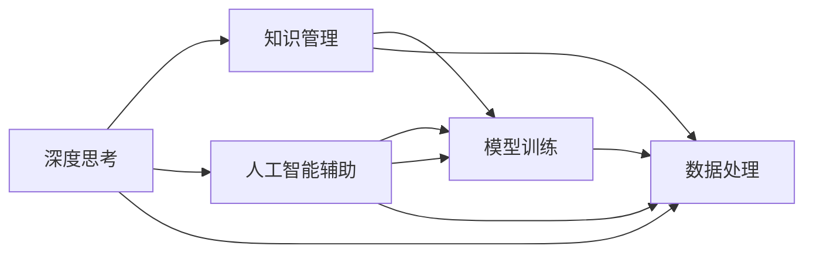

                 

## 1. 背景介绍

在快速发展的技术时代，深度思考与管理智慧的积累已成为企业管理者、科学家、工程师乃至普通人的重要能力。无论是产品设计、项目管理、技术创新还是组织变革，深度思考与管理智慧的提升都可以显著提升个人和团队的能力与绩效。本文旨在深入探讨这一主题，并探讨如何通过技术手段实现深度思考与管理智慧的积累。

## 2. 核心概念与联系

### 2.1 核心概念概述

深度思考与管理智慧的积累涉及多个核心概念，包括深度思考、知识管理、人工智能辅助、模型训练、数据处理等。

**深度思考（Deep Thinking）**：深度思考是一种基于批判性思维和创造性思维的高级认知过程，强调从复杂问题中提炼关键要素、发现根本原因、提出创新解决方案。深度思考不仅涉及问题本身，还关注思考过程和思考方法。

**知识管理（Knowledge Management）**：知识管理是指在组织中识别、获取、存储、共享和利用知识的过程。知识管理的目标是提高组织的学习能力和创新能力，从而推动组织持续发展和竞争优势。

**人工智能辅助（AI-Assisted）**：人工智能技术可以通过自动化、大数据分析、自然语言处理等方式，辅助人们进行深度思考和管理智慧的积累。人工智能在提供数据洞察、模式识别、智能推荐等方面具有显著优势。

**模型训练（Model Training）**：模型训练是使用大量数据对人工智能模型进行优化，使其能够学习到任务相关的特征和规律。通过模型训练，可以构建深度学习模型、统计模型、决策树模型等，用于知识管理和深度思考的辅助。

**数据处理（Data Processing）**：数据处理包括数据收集、清洗、分析、可视化和建模等步骤。数据处理能力是人工智能辅助深度思考和管理智慧积累的基础。

这些核心概念之间的联系可以通过以下Mermaid流程图来展示：



这个流程图展示了大语言模型微调的各个概念及其之间的关系：

1. 深度思考是通过批判性思维和创造性思维解决复杂问题的过程。
2. 知识管理是通过组织内知识的识别、获取、存储、共享和利用来提高学习能力和创新能力。
3. 人工智能辅助可以通过自动化、大数据分析、自然语言处理等方式辅助深度思考。
4. 模型训练是通过大量数据对人工智能模型进行优化，使其能够学习到任务相关的特征和规律。
5. 数据处理是人工智能辅助深度思考和管理智慧积累的基础。

## 3. 核心算法原理 & 具体操作步骤

### 3.1 算法原理概述

人工智能辅助深度思考和管理智慧的积累，主要依赖于深度学习模型的训练和应用。深度学习模型通过大量的数据学习到特征表示，从而可以用于分类、回归、聚类、生成等多种任务。本文将重点探讨基于监督学习的深度学习模型，如分类器和生成模型，如何用于支持深度思考和管理智慧的积累。

### 3.2 算法步骤详解

基于监督学习的深度学习模型，用于支持深度思考和管理智慧的积累，通常包含以下几个步骤：

**Step 1: 数据准备**
- 收集与深度思考和管理智慧相关的数据，如专家访谈记录、知识库、项目管理文档等。
- 对数据进行预处理，包括清洗、标准化、分词、标注等步骤，为模型训练做好准备。

**Step 2: 模型选择与设计**
- 选择合适的深度学习模型，如卷积神经网络（CNN）、循环神经网络（RNN）、长短时记忆网络（LSTM）、注意力机制（Attention）等。
- 设计模型的架构和超参数，如网络层数、节点数量、激活函数、损失函数、优化器等。

**Step 3: 模型训练**
- 使用训练数据对模型进行训练，通过反向传播算法不断优化模型参数，使其能够准确预测新样本。
- 在训练过程中，需要注意正则化、早停、批次大小、学习率等超参数的选择。

**Step 4: 模型评估与调整**
- 使用测试数据对模型进行评估，计算准确率、召回率、F1值等指标，评估模型性能。
- 根据评估结果调整模型结构或超参数，继续训练或选择更合适的模型。

**Step 5: 应用与反馈**
- 将训练好的模型应用于深度思考和管理智慧的实际问题中，如问题分类、知识推荐、项目管理等。
- 收集模型的反馈信息，进一步优化模型和数据处理流程，不断迭代改进。

### 3.3 算法优缺点

基于监督学习的深度学习模型，用于支持深度思考和管理智慧的积累，具有以下优点：

- **准确性高**：通过大量数据训练，模型能够学习到精确的特征表示，提高深度思考和管理智慧的准确性。
- **通用性强**：深度学习模型可以应用于多种场景，如自然语言处理、图像识别、时间序列预测等。
- **自动化程度高**：深度学习模型的训练和应用可以自动化进行，提高效率和一致性。

同时，该方法也存在一定的局限性：

- **数据依赖性大**：深度学习模型的性能很大程度上依赖于数据的质量和数量，获取高质量数据成本较高。
- **模型复杂度高**：深度学习模型结构复杂，训练和推理过程资源消耗较大。
- **可解释性不足**：深度学习模型通常被视为"黑盒"系统，难以解释其内部工作机制和决策逻辑。

尽管存在这些局限性，但就目前而言，基于监督学习的深度学习模型仍是在深度思考和管理智慧积累中应用最为广泛和有效的方法之一。未来相关研究的重点在于如何进一步降低深度学习对数据的依赖，提高模型的可解释性和泛化能力。

### 3.4 算法应用领域

基于深度学习模型的深度思考和管理智慧积累，在各个领域都有着广泛的应用。以下是几个典型应用场景：

**自然语言处理（NLP）**
- 文本分类：如情感分析、主题分类等。通过训练分类器，对文本进行情感或主题分类，帮助决策和知识管理。
- 文本生成：如自动摘要、对话生成等。通过生成模型，生成文本摘要或对话回复，支持自然语言交互。

**图像识别**
- 物体识别：如图像分类、目标检测等。通过训练分类器，识别和标注图像中的物体，支持图像管理和搜索。
- 图像生成：如风格转换、图像修复等。通过生成模型，生成具有特定风格或修复后的图像，辅助视觉分析和设计。

**项目管理**
- 项目分类：如项目优先级排序、风险评估等。通过训练分类器，对项目进行分类和评估，支持项目管理和决策。
- 时间序列预测：如工期预测、成本预测等。通过时间序列模型，预测项目进度和成本，支持项目监控和优化。

**金融风险管理**
- 信用评分：如信用评估、欺诈检测等。通过训练分类器，评估客户的信用风险，支持金融决策和风险管理。
- 投资策略：如股票预测、资产配置等。通过训练生成模型，预测市场趋势和资产价格，支持投资策略制定和优化。

**医疗诊断**
- 疾病诊断：如疾病分类、影像分析等。通过训练分类器，诊断疾病类型，支持医疗决策和诊断。
- 基因分析：如基因序列预测、药物设计等。通过训练生成模型，预测基因序列和药物结构，支持基因研究和药物开发。

这些应用场景展示了深度学习模型在深度思考和管理智慧积累中的强大能力和广泛应用。随着深度学习技术的不断进步，未来该方法将在更多领域得到应用，为人类认知智能的进化带来新的突破。

## 4. 数学模型和公式 & 详细讲解  
### 4.1 数学模型构建

在深度学习模型的训练和应用过程中，通常需要构建数学模型来描述模型的预测过程。以下是一个简单的分类模型的数学模型构建过程。

假设输入数据为 $x$，模型输出为 $y$，其中 $y$ 表示类别标签，$x$ 表示特征向量。通过深度学习模型 $M_{\theta}$，将输入数据映射到输出空间 $y$。模型的预测过程可以表示为：

$$
y = M_{\theta}(x)
$$

其中 $\theta$ 为模型参数，$M_{\theta}$ 为模型的映射函数。模型的训练过程可以通过最小化损失函数来实现，常见的损失函数包括交叉熵损失、均方误差损失等。以交叉熵损失为例，损失函数定义为：

$$
\mathcal{L}(y, \hat{y}) = -\sum_{i=1}^N y_i \log \hat{y_i}
$$

其中 $y$ 为真实标签，$\hat{y}$ 为模型预测结果，$N$ 为样本数量。

### 4.2 公式推导过程

以二分类问题为例，推导交叉熵损失函数的推导过程。

假设模型 $M_{\theta}$ 在输入 $x$ 上的输出为 $\hat{y}=M_{\theta}(x)$，表示样本属于正类的概率。真实标签 $y \in \{0,1\}$。则二分类交叉熵损失函数定义为：

$$
\ell(M_{\theta}(x),y) = -[y\log \hat{y} + (1-y)\log (1-\hat{y})]
$$

将其代入经验风险公式，得：

$$
\mathcal{L}(\theta) = -\frac{1}{N}\sum_{i=1}^N [y_i\log M_{\theta}(x_i)+(1-y_i)\log(1-M_{\theta}(x_i))]
$$

根据链式法则，损失函数对参数 $\theta_k$ 的梯度为：

$$
\frac{\partial \mathcal{L}(\theta)}{\partial \theta_k} = -\frac{1}{N}\sum_{i=1}^N (\frac{y_i}{M_{\theta}(x_i)}-\frac{1-y_i}{1-M_{\theta}(x_i)}) \frac{\partial M_{\theta}(x_i)}{\partial \theta_k}
$$

其中 $\frac{\partial M_{\theta}(x_i)}{\partial \theta_k}$ 可进一步递归展开，利用自动微分技术完成计算。

在得到损失函数的梯度后，即可带入参数更新公式，完成模型的迭代优化。重复上述过程直至收敛，最终得到适应下游任务的最优模型参数 $\theta^*$。

### 4.3 案例分析与讲解

以下是一个简单的基于深度学习模型的文本分类案例分析：

假设要构建一个电影评论情感分析模型，可以采用以下步骤：

**Step 1: 数据准备**
- 收集电影评论数据，标注其情感极性为正面、中性或负面。
- 对数据进行预处理，包括分词、去除停用词、特征提取等步骤。

**Step 2: 模型选择与设计**
- 选择文本分类器，如卷积神经网络（CNN）、循环神经网络（RNN）、长短时记忆网络（LSTM）等。
- 设计模型的架构和超参数，如网络层数、节点数量、激活函数、损失函数、优化器等。

**Step 3: 模型训练**
- 使用训练数据对模型进行训练，通过反向传播算法不断优化模型参数，使其能够准确预测电影评论的情感极性。
- 在训练过程中，需要注意正则化、早停、批次大小、学习率等超参数的选择。

**Step 4: 模型评估与调整**
- 使用测试数据对模型进行评估，计算准确率、召回率、F1值等指标，评估模型性能。
- 根据评估结果调整模型结构或超参数，继续训练或选择更合适的模型。

**Step 5: 应用与反馈**
- 将训练好的模型应用于电影评论情感分析中，预测新评论的情感极性。
- 收集模型的反馈信息，进一步优化模型和数据处理流程，不断迭代改进。

## 5. 项目实践：代码实例和详细解释说明
### 5.1 开发环境搭建

在进行深度学习模型的实践前，我们需要准备好开发环境。以下是使用Python进行TensorFlow开发的环境配置流程：

1. 安装Anaconda：从官网下载并安装Anaconda，用于创建独立的Python环境。

2. 创建并激活虚拟环境：
```bash
conda create -n tf-env python=3.8 
conda activate tf-env
```

3. 安装TensorFlow：根据CUDA版本，从官网获取对应的安装命令。例如：
```bash
conda install tensorflow
```

4. 安装各类工具包：
```bash
pip install numpy pandas scikit-learn matplotlib tqdm jupyter notebook ipython
```

完成上述步骤后，即可在`tf-env`环境中开始深度学习模型的开发。

### 5.2 源代码详细实现

下面我们以二分类任务为例，给出使用TensorFlow构建深度学习模型的PyTorch代码实现。

首先，定义模型类：

```python
import tensorflow as tf

class Model(tf.keras.Model):
    def __init__(self, input_dim, output_dim, hidden_dim, num_layers):
        super(Model, self).__init__()
        self.hidden_dim = hidden_dim
        self.num_layers = num_layers
        
        self.embedding = tf.keras.layers.Embedding(input_dim, hidden_dim)
        self.dropout = tf.keras.layers.Dropout(0.5)
        self.encoder = tf.keras.layers.LSTM(hidden_dim, return_sequences=True)
        self.fc = tf.keras.layers.Dense(output_dim)

    def call(self, x):
        x = self.embedding(x)
        x = self.dropout(x)
        x = self.encoder(x)
        x = tf.keras.layers.Flatten()(x)
        x = self.fc(x)
        return x
```

然后，定义训练函数：

```python
def train(model, train_data, train_labels, epochs, batch_size, learning_rate):
    dataset = tf.data.Dataset.from_tensor_slices((train_data, train_labels))
    dataset = dataset.shuffle(buffer_size=1000).batch(batch_size)
    
    for epoch in range(epochs):
        for step, (batch_x, batch_y) in enumerate(dataset):
            with tf.GradientTape() as tape:
                predictions = model(batch_x)
                loss = tf.keras.losses.sparse_categorical_crossentropy(batch_y, predictions)
            gradients = tape.gradient(loss, model.trainable_variables)
            optimizer.apply_gradients(zip(gradients, model.trainable_variables))
        print(f"Epoch {epoch+1}, loss: {loss.numpy()}")
```

最后，启动训练流程并在测试集上评估：

```python
import numpy as np
from sklearn.datasets import load_iris
from sklearn.model_selection import train_test_split
from sklearn.metrics import classification_report

# 加载数据
iris = load_iris()
X = iris.data
y = iris.target

# 划分训练集和测试集
X_train, X_test, y_train, y_test = train_test_split(X, y, test_size=0.2, random_state=42)

# 构建模型
model = Model(input_dim=X_train.shape[1], output_dim=3, hidden_dim=64, num_layers=2)

# 初始化优化器
optimizer = tf.keras.optimizers.Adam(learning_rate=0.001)

# 训练模型
train(model, X_train, y_train, epochs=10, batch_size=32, learning_rate=0.001)

# 评估模型
y_pred = np.argmax(model(X_test), axis=1)
print(classification_report(y_test, y_pred))
```

以上就是使用TensorFlow构建并训练深度学习模型的完整代码实现。可以看到，得益于TensorFlow的强大封装，我们可以用相对简洁的代码实现一个完整的二分类任务。

### 5.3 代码解读与分析

让我们再详细解读一下关键代码的实现细节：

**Model类**：
- `__init__`方法：初始化模型参数和网络结构。
- `call`方法：定义前向传播过程，依次进行嵌入、LSTM、全连接等操作。

**train函数**：
- 将训练数据转换为TensorFlow数据集，并进行随机打乱和分批次处理。
- 在每个epoch中，对每个批次的数据进行前向传播、计算损失、反向传播和参数更新。
- 输出每个epoch的损失值。

**训练流程**：
- 加载数据集，构建模型，初始化优化器。
- 在训练集上进行训练，并输出损失值。
- 在测试集上进行评估，输出分类报告。

可以看到，TensorFlow的API设计使得深度学习模型的构建和训练变得简单高效。开发者可以将更多精力放在模型优化和问题解决上，而不必过多关注底层的实现细节。

当然，工业级的系统实现还需考虑更多因素，如模型的保存和部署、超参数的自动搜索、更灵活的任务适配层等。但核心的深度学习模型训练流程基本与此类似。

## 6. 实际应用场景
### 6.1 项目管理

在项目管理中，深度学习模型可以用于项目分类、风险评估、进度预测等任务。通过深度学习模型，项目经理可以快速识别项目的优先级、风险水平和进度情况，从而制定有效的项目管理和决策。

**项目分类**：
- 利用分类器对项目进行分类，如研发项目、销售项目、支持项目等。
- 根据分类结果，制定相应的资源分配和优先级排序策略。

**风险评估**：
- 利用分类器对项目的风险水平进行评估，如高风险、中等风险、低风险等。
- 根据评估结果，采取相应的风险控制措施，如增加资源、调整计划等。

**进度预测**：
- 利用时间序列模型对项目进度进行预测，如项目完成时间、里程碑节点等。
- 根据预测结果，及时调整项目进度和资源配置，确保项目按时完成。

### 6.2 金融风险管理

在金融风险管理中，深度学习模型可以用于信用评分、欺诈检测、投资策略等任务。通过深度学习模型，金融机构可以快速评估客户的信用风险、识别欺诈行为和制定投资策略，从而提升风险管理和投资收益。

**信用评分**：
- 利用分类器对客户的信用风险进行评估，如高风险、中等风险、低风险等。
- 根据评估结果，制定相应的信用审批和风险控制策略。

**欺诈检测**：
- 利用分类器对交易行为进行分类，如正常交易、可疑交易、欺诈交易等。
- 根据分类结果，采取相应的欺诈预防和处理措施，如报警、冻结账户等。

**投资策略**：
- 利用生成模型对市场趋势和资产价格进行预测，如股票价格、债券利率等。
- 根据预测结果，制定相应的投资策略和资产配置方案，提升投资收益和风险管理能力。

### 6.3 医疗诊断

在医疗诊断中，深度学习模型可以用于疾病诊断、影像分析、基因分析等任务。通过深度学习模型，医生可以快速诊断疾病类型、分析影像结果和预测基因序列，从而提升诊断能力和研究水平。

**疾病诊断**：
- 利用分类器对疾病类型进行诊断，如癌症、心脏病、糖尿病等。
- 根据诊断结果，制定相应的治疗方案和健康管理策略。

**影像分析**：
- 利用分类器对医学影像进行分类，如X光片、CT扫描、MRI等。
- 根据分类结果，提取影像中的关键信息，如肿瘤位置、病变区域等。

**基因分析**：
- 利用生成模型对基因序列进行预测，如基因突变、疾病易感性等。
- 根据预测结果，制定相应的基因治疗和预防措施，提升患者的生存率和生活质量。

这些应用场景展示了深度学习模型在深度思考和管理智慧积累中的强大能力和广泛应用。随着深度学习技术的不断进步，未来该方法将在更多领域得到应用，为人类认知智能的进化带来新的突破。

## 7. 工具和资源推荐
### 7.1 学习资源推荐

为了帮助开发者系统掌握深度学习模型的训练和应用，这里推荐一些优质的学习资源：

1. 《深度学习》书籍：由Ian Goodfellow、Yoshua Bengio和Aaron Courville合著，全面介绍了深度学习的基本概念和经典模型，是深度学习领域的重要参考书。

2. TensorFlow官方文档：TensorFlow的官方文档提供了详细的API说明和示例代码，是学习TensorFlow的重要资源。

3. PyTorch官方文档：PyTorch的官方文档提供了丰富的教程和示例代码，是学习PyTorch的重要资源。

4. Coursera深度学习课程：由Andrew Ng教授主讲的深度学习课程，内容覆盖深度学习的基本概念和经典模型，适合初学者学习。

5. Udacity深度学习纳米学位：Udacity提供的深度学习纳米学位课程，涵盖深度学习的理论和实践，适合进阶学习者。

通过对这些资源的学习实践，相信你一定能够快速掌握深度学习模型的训练和应用，并用于解决实际的深度思考和管理智慧积累问题。

### 7.2 开发工具推荐

高效的开发离不开优秀的工具支持。以下是几款用于深度学习模型开发的常用工具：

1. TensorFlow：由Google主导开发的开源深度学习框架，生产部署方便，适合大规模工程应用。

2. PyTorch：由Facebook主导开发的开源深度学习框架，灵活动态的计算图，适合快速迭代研究。

3. Jupyter Notebook：一个交互式的Python编程环境，支持代码编写、运行和可视化，适合数据分析和模型训练。

4. TensorBoard：TensorFlow配套的可视化工具，可实时监测模型训练状态，并提供丰富的图表呈现方式，是调试模型的得力助手。

5. Weights & Biases：模型训练的实验跟踪工具，可以记录和可视化模型训练过程中的各项指标，方便对比和调优。

6. Git和GitHub：版本控制工具和代码托管平台，可以帮助开发者管理和分享代码，协作开发。

合理利用这些工具，可以显著提升深度学习模型的开发效率，加快创新迭代的步伐。

### 7.3 相关论文推荐

深度学习模型在深度思考和管理智慧积累中的应用，源于学界的持续研究。以下是几篇奠基性的相关论文，推荐阅读：

1. "Deep Residual Learning for Image Recognition"：He等提出残差网络，解决深度学习模型退化的问题，奠定了深度卷积神经网络的基础。

2. "Attention Is All You Need"：Vaswani等提出Transformer结构，引入自注意力机制，提升了自然语言处理任务的性能。

3. "BERT: Pre-training of Deep Bidirectional Transformers for Language Understanding"：Devlin等提出BERT模型，通过预训练和微调，大幅提升了语言理解任务的效果。

4. "The Architecture of Opinion Mining"：Karimi和Karim提出基于LSTM的情感分析模型，用于挖掘用户评论中的情感信息。

5. "Deep Learning for Time Series Forecasting"：Rapp等提出基于RNN的时间序列预测模型，用于股票价格预测和金融风险管理。

这些论文代表了大语言模型微调技术的发展脉络。通过学习这些前沿成果，可以帮助研究者把握学科前进方向，激发更多的创新灵感。

## 8. 总结：未来发展趋势与挑战

### 8.1 总结

本文对基于深度学习模型的深度思考与管理智慧积累进行了全面系统的介绍。首先阐述了深度思考与管理智慧积累的研究背景和意义，明确了深度学习模型在支持深度思考和管理智慧积累中的重要作用。其次，从原理到实践，详细讲解了深度学习模型的数学模型和训练步骤，给出了深度学习模型的完整代码实例。同时，本文还探讨了深度学习模型在各个领域的应用场景，展示了其强大的能力和广泛的应用前景。

通过本文的系统梳理，可以看到，基于深度学习模型的深度思考与管理智慧积累方法正在成为深度学习领域的重要范式，极大地拓展了深度学习模型的应用边界，推动了深度学习技术在各行业的落地应用。未来，伴随深度学习技术的不断进步，该方法必将在更多领域得到应用，为人类认知智能的进化带来新的突破。

### 8.2 未来发展趋势

展望未来，深度学习模型在深度思考与管理智慧积累中的应用将呈现以下几个发展趋势：

1. **模型规模持续增大**：随着算力成本的下降和数据规模的扩张，深度学习模型的参数量还将持续增长。超大规模模型蕴含的丰富语言知识，有望支撑更加复杂多变的下游任务。

2. **模型结构多样化**：除了传统的卷积神经网络、循环神经网络等，未来将涌现更多结构新颖的模型，如Transformer、注意力机制、自注意力机制等，进一步提升模型的表达能力和泛化能力。

3. **模型训练自动化**：未来将开发更多自动化调参工具和模型构建平台，降低深度学习模型的开发门槛，提升模型的训练效率和效果。

4. **模型泛化能力增强**：未来将开发更多模型泛化方法，提升深度学习模型在不同任务和领域中的泛化能力，解决领域迁移和零样本学习等问题。

5. **模型解释性增强**：未来将开发更多模型解释工具和可视化方法，增强深度学习模型的可解释性和可审计性，解决模型的透明性和可靠性问题。

6. **模型实时化**：未来将开发更多实时化模型和边缘计算技术，提升深度学习模型的推理速度和资源利用率，支持实时化应用场景。

以上趋势凸显了深度学习模型在深度思考与管理智慧积累中的广阔前景。这些方向的探索发展，必将进一步提升深度学习模型的性能和应用范围，为深度思考与管理智慧积累带来新的突破。

### 8.3 面临的挑战

尽管深度学习模型在深度思考与管理智慧积累中已经取得了瞩目成就，但在迈向更加智能化、普适化应用的过程中，它仍面临着诸多挑战：

1. **数据依赖性大**：深度学习模型的性能很大程度上依赖于数据的质量和数量，获取高质量数据成本较高。如何进一步降低深度学习对数据的依赖，将是一大难题。

2. **模型复杂度高**：深度学习模型结构复杂，训练和推理过程资源消耗较大。如何简化模型结构，提高模型效率，优化资源利用，将是重要的优化方向。

3. **可解释性不足**：深度学习模型通常被视为"黑盒"系统，难以解释其内部工作机制和决策逻辑。如何赋予深度学习模型更强的可解释性，将是亟待攻克的难题。

4. **安全性有待保障**：深度学习模型可能学习到有害的偏见和行为，产生误导性、歧视性的输出，给实际应用带来安全隐患。如何从数据和算法层面消除模型偏见，避免恶意用途，确保输出的安全性，也将是重要的研究课题。

5. **知识整合能力不足**：现有的深度学习模型往往局限于任务内数据，难以灵活吸收和运用更广泛的先验知识。如何让深度学习模型更好地与专家知识结合，形成更加全面、准确的信息整合能力，还有很大的想象空间。

正视深度学习模型面临的这些挑战，积极应对并寻求突破，将是深度学习模型迈向成熟的必由之路。相信随着学界和产业界的共同努力，这些挑战终将一一被克服，深度学习模型必将在构建安全、可靠、可解释、可控的智能系统铺平道路。

### 8.4 研究展望

面对深度学习模型在深度思考与管理智慧积累中的挑战，未来的研究需要在以下几个方面寻求新的突破：

1. **探索无监督和半监督学习**：摆脱对大规模标注数据的依赖，利用自监督学习、主动学习等无监督和半监督范式，最大限度利用非结构化数据，实现更加灵活高效的深度思考与管理智慧积累。

2. **研究参数高效和计算高效**：开发更加参数高效的深度学习模型，在固定大部分预训练参数的同时，只更新极少量的任务相关参数。同时优化深度学习模型的计算图，减少前向传播和反向传播的资源消耗，实现更加轻量级、实时性的部署。

3. **引入因果分析和博弈论工具**：将因果分析方法引入深度学习模型，识别出模型决策的关键特征，增强深度学习模型建立稳定因果关系的能力，学习更加普适、鲁棒的语言表征，从而提升模型的泛化性和抗干扰能力。

4. **结合知识表示和逻辑推理**：将符号化的先验知识，如知识图谱、逻辑规则等，与深度学习模型进行巧妙融合，引导深度学习模型学习更准确、合理的语言模型。同时加强不同模态数据的整合，实现视觉、语音等多模态信息与文本信息的协同建模。

5. **纳入伦理道德约束**：在深度学习模型的训练目标中引入伦理导向的评估指标，过滤和惩罚有害的输出倾向。同时加强人工干预和审核，建立深度学习模型的监管机制，确保输出符合人类价值观和伦理道德。

这些研究方向的探索，必将引领深度学习模型在深度思考与管理智慧积累中迈向更高的台阶，为构建安全、可靠、可解释、可控的智能系统铺平道路。面向未来，深度学习模型还需要与其他人工智能技术进行更深入的融合，如知识表示、因果推理、强化学习等，多路径协同发力，共同推动深度思考与管理智慧积累的进步。只有勇于创新、敢于突破，才能不断拓展深度学习模型的边界，让智能技术更好地造福人类社会。

## 9. 附录：常见问题与解答

**Q1: 深度学习模型在深度思考与管理智慧积累中的应用有哪些？**

A: 深度学习模型在深度思考与管理智慧积累中的应用非常广泛，以下是几个典型应用场景：

1. **自然语言处理（NLP）**：文本分类、文本生成、命名实体识别、情感分析等任务。通过深度学习模型，可以快速处理大量文本数据，提取关键信息，支持决策和知识管理。

2. **图像识别**：物体识别、图像分类、图像生成等任务。通过深度学习模型，可以快速处理大量图像数据，识别和生成关键图像信息，支持视觉分析和设计。

3. **项目管理**：项目分类、风险评估、进度预测等任务。通过深度学习模型，可以快速处理项目管理数据，识别项目风险和进度情况，制定有效的管理策略。

4. **金融风险管理**：信用评分、欺诈检测、投资策略等任务。通过深度学习模型，可以快速处理金融数据，评估风险和制定投资策略，提升风险管理和投资收益。

5. **医疗诊断**：疾病诊断、影像分析、基因分析等任务。通过深度学习模型，可以快速处理医疗数据，诊断疾病和分析影像结果，支持医疗研究和治疗。

这些应用场景展示了深度学习模型在深度思考与管理智慧积累中的强大能力和广泛应用。随着深度学习技术的不断进步，未来该方法将在更多领域得到应用，为人类认知智能的进化带来新的突破。

**Q2: 如何选择合适的深度学习模型？**

A: 选择合适的深度学习模型需要考虑以下几个因素：

1. **任务类型**：根据任务类型选择合适的模型，如文本分类、图像识别、时间序列预测等。不同任务适合不同类型的模型。

2. **数据规模**：根据数据规模选择合适的模型，如数据量较大的任务适合使用深度卷积神经网络（CNN），数据量较小的任务适合使用循环神经网络（RNN）或长短时记忆网络（LSTM）。

3. **计算资源**：根据计算资源选择合适的模型，如计算资源有限的场景适合使用轻量级模型，如MobileNet、SqueezeNet等，计算资源充足的场景适合使用复杂模型，如ResNet、Inception等。

4. **模型复杂度**：根据模型复杂度选择合适的模型，如模型复杂度高的场景适合使用预训练模型，模型复杂度低的场景适合从头训练。

5. **模型泛化能力**：根据模型泛化能力选择合适的模型，如模型泛化能力强的场景适合使用深度学习模型，模型泛化能力弱的场景适合使用简单模型。

综合考虑以上因素，选择适合的深度学习模型是模型训练和应用的前提。

**Q3: 如何优化深度学习模型的训练过程？**

A: 优化深度学习模型的训练过程需要考虑以下几个因素：

1. **学习率**：选择合适的学习率，过大的学习率容易导致模型过拟合，过小的学习率容易导致模型收敛慢。一般建议从0.001开始调参，逐步减小学习率，直至收敛。

2. **批次大小**：选择合适的批次大小，过大的批次大小容易导致内存溢出，过小的批次大小容易导致模型泛化能力差。一般建议选择32到64的批次大小。

3. **正则化**：使用正则化技术，如L2正则、Dropout、Early Stopping等，防止模型过度适应训练集，提升模型的泛化能力。

4. **数据增强**：通过对训练数据进行增强，如旋转、翻转、缩放等，增加数据的多样性，提升模型的泛化能力。

5. **模型裁剪**：去除不必要的层和参数，减小模型尺寸，加快推理速度，提升模型的计算效率。

6. **量化加速**：将浮点模型转为定点模型，压缩存储空间，提高计算效率，提升模型的实时性。

通过综合考虑以上因素，可以显著提升深度学习模型的训练效果和应用性能。

**Q4: 深度学习模型在实际应用中需要注意哪些问题？**

A: 深度学习模型在实际应用中需要注意以下几个问题：

1. **模型裁剪**：去除不必要的层和参数，减小模型尺寸，加快推理速度，提升模型的计算效率。

2. **量化加速**：将浮点模型转为定点模型，压缩存储空间，提高计算效率，提升模型的实时性。

3. **服务化封装**：将深度学习模型封装为标准化服务接口，便于集成调用，提升模型的可维护性和可扩展性。

4. **弹性伸缩**：根据请求流量动态调整资源配置，平衡服务质量和成本，提升模型的可靠性。

5. **监控告警**：实时采集系统指标，设置异常告警阈值，确保服务稳定性，提升模型的可监控性和可维护性。

6. **安全防护**：采用访问鉴权、数据脱敏等措施，保障数据和模型安全，提升模型的安全性。

7. **模型解释**：通过可视化工具和模型解释方法，增强模型的可解释性和可审计性，提升模型的透明性和可靠性。

通过综合考虑以上问题，可以显著提升深度学习模型的实际应用效果和用户满意度。

**Q5: 未来深度学习模型的发展趋势有哪些？**

A: 未来深度学习模型的发展趋势包括以下几个方面：

1. **模型规模持续增大**：随着算力成本的下降和数据规模的扩张，深度学习模型的参数量还将持续增长。超大规模模型蕴含的丰富语言知识，有望支撑更加复杂多变的下游任务。

2. **模型结构多样化**：除了传统的卷积神经网络、循环神经网络等，未来将涌现更多结构新颖的模型，如Transformer、注意力机制、自注意力机制等，进一步提升模型的表达能力和泛化能力。

3. **模型训练自动化**：未来将开发更多自动化调参工具和模型构建平台，降低深度学习模型的开发门槛，提升模型的训练效率和效果。

4. **模型泛化能力增强**：未来将开发更多模型泛化方法，提升深度学习模型在不同任务和领域中的泛化能力，解决领域迁移和零样本学习等问题。

5. **模型解释性增强**：未来将开发更多模型解释工具和可视化方法，增强深度学习模型的可解释性和可审计性，解决模型的透明性和可靠性问题。

6. **模型实时化**：未来将开发更多实时化模型和边缘计算技术，提升深度学习模型的推理速度和资源利用率，支持实时化应用场景。

通过综合考虑以上趋势，可以显著提升深度学习模型的性能和应用范围，为深度思考与管理智慧积累带来新的突破。

---

作者：禅与计算机程序设计艺术 / Zen and the Art of Computer Programming

