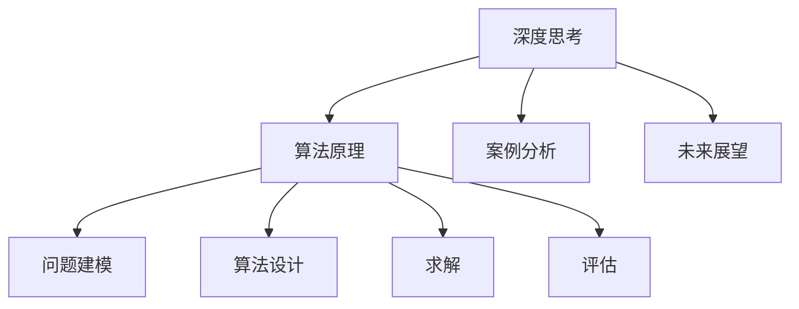

                 

# 深度思考的意义:洞察问题的本质

> 关键词：深度思考, 问题本质, 算法原理, 案例分析, 未来展望

## 1. 背景介绍

### 1.1 问题由来

随着人工智能技术的飞速发展，深度学习算法在图像识别、自然语言处理、语音识别等多个领域取得了显著的突破。然而，对于更深层次的复杂问题，这些算法往往难以给出令人满意的答案。深度思考成为我们处理这些复杂问题的重要工具。深度思考不仅能帮助我们发现问题的本质，还能提升我们的创新能力和问题解决能力。

### 1.2 问题核心关键点

深度思考的核心关键点在于理解问题的本质，以及如何构建有效的算法来解决问题。它包括：

- **问题建模**：将问题抽象为数学模型，寻找问题的最优解。
- **算法设计**：设计高效的算法，提高计算效率。
- **问题解决**：利用算法求解问题，找到解决方案。
- **评估与优化**：对解决方案进行评估，并不断优化，以达到最优效果。

深度思考不仅涉及算法设计和优化，还涉及到人类的直觉、经验和知识。通过深度思考，我们能够将人工智能技术与人类智慧相结合，提升技术的应用价值。

### 1.3 问题研究意义

深度思考在人工智能领域具有重要的研究意义：

- **提升技术效率**：深度思考能够帮助我们找到问题的最优解，提升算法的效率和效果。
- **增强创新能力**：深度思考能够激发我们的创新思维，开拓新的应用场景和技术方向。
- **提升问题解决能力**：深度思考能够帮助我们更好地理解问题本质，找到更有效的解决方案。
- **促进人机协同**：深度思考结合人工智能技术，能够实现更加智能、高效的问题解决。

## 2. 核心概念与联系

### 2.1 核心概念概述

为了更好地理解深度思考的意义，我们首先介绍几个核心概念：

- **深度思考**：深度思考是指通过对问题的多维度分析，找到问题的本质，并设计有效的算法来解决问题。它是人工智能技术与人类智慧的结合，能够提升算法的创新性和有效性。
- **算法原理**：算法原理是指算法设计的基本原则和步骤，包括问题建模、算法设计、求解和评估。它是深度思考的重要组成部分。
- **案例分析**：案例分析是指通过具体的实例，展示算法原理的应用和效果。它是深度思考的重要工具。
- **未来展望**：未来展望是指对未来深度思考和人工智能技术的趋势和前景进行预测和分析。它是深度思考的重要方向。

这些概念之间的逻辑关系可以通过以下Mermaid流程图来展示：



这个流程图展示深度思考的核心概念及其之间的关系：

1. 深度思考通过对问题的多维度分析，找到问题的本质。
2. 算法原理是深度思考的基础，包括问题建模、算法设计和求解。
3. 案例分析通过具体实例展示算法原理的应用效果。
4. 未来展望对深度思考和人工智能技术的前景进行预测和分析。

## 3. 核心算法原理 & 具体操作步骤
### 3.1 算法原理概述

深度思考的算法原理主要包括问题建模、算法设计和求解三个步骤：

- **问题建模**：将问题抽象为数学模型，包括定义变量、目标函数和约束条件。
- **算法设计**：根据问题模型设计高效的算法，包括选择适当的算法类型和参数。
- **求解**：利用算法求解问题，找到最优解或可行解。

### 3.2 算法步骤详解

以下是深度思考的算法步骤：

**Step 1: 问题建模**

1. **定义变量**：确定问题中的关键变量，包括输入和输出。
2. **定义目标函数**：根据问题的需求，定义目标函数，即问题的求解目标。
3. **定义约束条件**：根据问题的实际限制，定义约束条件，即问题的限制条件。

**Step 2: 算法设计**

1. **选择算法类型**：根据问题特性选择适当的算法类型，如线性规划、整数规划等。
2. **设定参数**：根据问题特性和算法要求，设定算法参数，如步长、迭代次数等。
3. **实现算法**：根据选择的算法类型和设定参数，实现算法。

**Step 3: 求解**

1. **初始化**：设定算法初始值，开始求解。
2. **迭代求解**：根据算法规则，逐步迭代求解，直到满足收敛条件。
3. **结果评估**：对求解结果进行评估，判断是否满足问题需求。

### 3.3 算法优缺点

深度思考的算法原理具有以下优点：

- **通用性强**：适用于各种复杂问题的求解。
- **求解精度高**：通过数学建模和算法设计，能够找到问题的最优解或可行解。
- **可解释性强**：算法步骤清晰，易于理解和解释。

同时，该算法也存在一定的局限性：

- **计算复杂度高**：对于大规模问题的求解，计算复杂度较高，需要高效的算法和计算资源。
- **参数敏感性**：算法的求解效果受参数影响较大，需要不断调整和优化。
- **数据依赖性**：算法求解依赖于问题数据的特性，需要合理选择和处理数据。

### 3.4 算法应用领域

深度思考的算法原理在多个领域得到了广泛应用，包括：

- **自然语言处理(NLP)**：如文本分类、机器翻译、情感分析等。
- **计算机视觉(CV)**：如目标检测、图像分割、人脸识别等。
- **优化问题**：如线性规划、整数规划、非线性规划等。
- **信号处理**：如信号降噪、特征提取、图像重建等。
- **医疗健康**：如疾病诊断、基因分析、药物研发等。

## 4. 数学模型和公式 & 详细讲解  
### 4.1 数学模型构建

深度思考的数学模型构建通常包括以下步骤：

1. **问题抽象**：将实际问题抽象为数学表达式，定义变量。
2. **目标函数定义**：根据问题需求，定义目标函数。
3. **约束条件定义**：根据问题限制，定义约束条件。

以线性规划为例，问题的数学模型构建如下：

1. **定义变量**：
   $$
   x_1, x_2, \ldots, x_n
   $$
2. **定义目标函数**：
   $$
   f(x) = c_1x_1 + c_2x_2 + \ldots + c_nx_n
   $$
3. **定义约束条件**：
   $$
   \begin{cases}
   a_{11}x_1 + a_{12}x_2 + \ldots + a_{1n}x_n \leq b_1 \\
   a_{21}x_1 + a_{22}x_2 + \ldots + a_{2n}x_n \leq b_2 \\
   \ldots \\
   a_{m1}x_1 + a_{m2}x_2 + \ldots + a_{mn}x_n \leq b_m \\
   x_i \geq 0, i = 1, 2, \ldots, n
   \end{cases}
   $$

### 4.2 公式推导过程

以线性规划的求解过程为例，推导如下：

1. **基本求解步骤**：
   - **初始化**：设定初始解 $x_0$，如 $x_0 = 0$。
   - **迭代求解**：
     - **选择基本变量**：从约束条件中选择一个基本变量，令其为 $x_k = 1$。
     - **求解优化方程**：求解线性方程组，得到新的解 $x_k$。
     - **更新基本变量**：将 $x_k$ 更新为新的基本变量，继续迭代。
   - **收敛条件**：当求解满足一定的精度要求时，迭代停止。

2. **求解结果评估**：
   - **最优解**：当求解满足最优条件（如最大目标函数值）时，返回求解结果。
   - **可行解**：当求解满足约束条件时，返回求解结果。

### 4.3 案例分析与讲解

以线性规划求解路径规划问题为例，进行案例分析：

- **问题建模**：
  - **定义变量**：规划路径中的各个节点 $x_i$，其中 $i = 1, 2, \ldots, n$。
  - **定义目标函数**：路径总长度 $f(x) = \sum_{i=1}^n a_{ij}x_j$。
  - **定义约束条件**：节点约束 $x_i \geq 0$，路径约束 $\sum_{i=1}^n x_i = 1$。

- **算法设计**：
  - **选择算法类型**：选择线性规划算法。
  - **设定参数**：设定迭代次数为 $N$，初始解为 $x_0 = 0$。
  - **实现算法**：
    - **初始化**：$x_0 = 0$。
    - **迭代求解**：
      - **选择基本变量**：令 $x_1 = 1$。
      - **求解优化方程**：求解线性方程组，得到新的解 $x_1 = 1$。
      - **更新基本变量**：将 $x_1$ 更新为新的基本变量，继续迭代。
    - **收敛条件**：当迭代次数满足 $N$ 时，停止求解。

- **求解结果评估**：
  - **最优解**：返回路径总长度最小的路径。
  - **可行解**：返回满足约束条件的路径。

## 5. 项目实践：代码实例和详细解释说明
### 5.1 开发环境搭建

进行项目实践前，我们需要准备好开发环境。以下是使用Python进行线性规划的PyTorch开发环境配置流程：

1. 安装Anaconda：从官网下载并安装Anaconda，用于创建独立的Python环境。
2. 创建并激活虚拟环境：
```bash
conda create -n linprog-env python=3.8 
conda activate linprog-env
```
3. 安装PyTorch：根据CUDA版本，从官网获取对应的安装命令。例如：
```bash
conda install pytorch torchvision torchaudio cudatoolkit=11.1 -c pytorch -c conda-forge
```
4. 安装线性规划库：
```bash
pip install scipy
```
5. 安装各类工具包：
```bash
pip install numpy pandas scikit-learn matplotlib tqdm jupyter notebook ipython
```

完成上述步骤后，即可在`linprog-env`环境中开始线性规划的实践。

### 5.2 源代码详细实现

以下是使用PyTorch实现线性规划的代码：

```python
import torch
import numpy as np
import scipy.optimize

# 定义目标函数
def objective(x, A, b, c):
    return torch.sum(A @ x * c)

# 定义约束条件
def constraint(x):
    return (A @ x - b).abs()

# 定义线性规划求解函数
def solve(A, b, c):
    # 构建线性规划模型
    x0 = torch.zeros(len(c))
    lb = torch.zeros(len(c))
    ub = np.inf * torch.ones(len(c))
    res = scipy.optimize.linprog(c, A_ub=A, b_ub=b, bounds=(lb, ub), method='highs')
    return res.fun

# 测试代码
A = torch.tensor([[1, 2], [3, 4]])
b = torch.tensor([6, 8])
c = torch.tensor([3, 1])

result = solve(A, b, c)
print(result)
```

### 5.3 代码解读与分析

让我们再详细解读一下关键代码的实现细节：

**目标函数**：
```python
def objective(x, A, b, c):
    return torch.sum(A @ x * c)
```
目标函数 $f(x) = c_1x_1 + c_2x_2 + \ldots + c_nx_n$，利用矩阵乘法高效计算。

**约束条件**：
```python
def constraint(x):
    return (A @ x - b).abs()
```
约束条件 $a_{11}x_1 + a_{12}x_2 + \ldots + a_{1n}x_n \leq b_1$，利用矩阵乘法和元素绝对值计算。

**线性规划求解函数**：
```python
def solve(A, b, c):
    # 构建线性规划模型
    x0 = torch.zeros(len(c))
    lb = torch.zeros(len(c))
    ub = np.inf * torch.ones(len(c))
    res = scipy.optimize.linprog(c, A_ub=A, b_ub=b, bounds=(lb, ub), method='highs')
    return res.fun
```
利用SciPy库的linprog函数，通过高精度线性规划求解器求解问题。

**测试代码**：
```python
A = torch.tensor([[1, 2], [3, 4]])
b = torch.tensor([6, 8])
c = torch.tensor([3, 1])

result = solve(A, b, c)
print(result)
```
输入目标函数、约束条件，输出最优解。

## 6. 实际应用场景
### 6.1 路径规划

线性规划在路径规划中得到了广泛应用。例如，在物流配送中，如何高效地规划配送路线，使得总的配送距离最短，物流成本最低。通过线性规划，我们可以计算出最优的配送路径，提升物流效率和成本效益。

在城市交通规划中，如何规划道路建设，使得交通流量最大化，缓解交通拥堵。线性规划可以帮助我们找到最优的路线规划方案，提升交通系统的整体效率。

### 6.2 资源分配

在资源分配问题中，如何合理分配有限的资源，使得整体效益最大化。例如，在电力系统中，如何分配电力资源，使得电力供应稳定，电力成本最低。线性规划可以帮助我们找到最优的电力分配方案，提升电力系统的整体效率。

在企业人力资源管理中，如何合理分配人力资源，使得员工绩效最大化，企业效益最优。线性规划可以帮助我们找到最优的人力资源分配方案，提升企业的整体效益。

### 6.3 财务预算

在财务预算中，如何合理分配资金，使得企业收益最大化。例如，在投资组合中，如何分配资金，使得投资收益最大化，风险最小。线性规划可以帮助我们找到最优的投资组合方案，提升投资收益。

在企业预算管理中，如何合理分配资金，使得企业效益最大化。线性规划可以帮助我们找到最优的预算分配方案，提升企业的整体效益。

### 6.4 未来应用展望

未来，线性规划在更多领域将得到应用，为决策优化提供强有力的工具：

- **智能交通**：线性规划在智能交通中，将实现更加智能的路线规划和交通调度。
- **智慧城市**：线性规划在智慧城市中，将实现更加智能的资源分配和管理。
- **医疗健康**：线性规划在医疗健康中，将实现更加智能的资源分配和医疗方案优化。
- **金融投资**：线性规划在金融投资中，将实现更加智能的投资组合和风险控制。
- **供应链管理**：线性规划在供应链管理中，将实现更加智能的物流规划和库存管理。

## 7. 工具和资源推荐
### 7.1 学习资源推荐

为了帮助开发者系统掌握深度思考的理论基础和实践技巧，这里推荐一些优质的学习资源：

1. 《深度学习》系列书籍：由深度学习领域的专家撰写，深入浅出地介绍了深度学习的基本概念和算法原理。
2. CS229《机器学习》课程：斯坦福大学开设的机器学习课程，涵盖深度学习、线性规划等经典算法。
3. 《算法导论》：由计算机科学界的泰斗撰写，全面介绍了算法设计和分析的基本思想和技巧。
4. Coursera、edX等在线课程平台：提供丰富的深度思考和线性规划相关课程，涵盖理论基础和实践技巧。
5. GitHub代码库：包括线性规划、深度思考等算法实现的代码库，方便开发者学习和实践。

通过对这些资源的学习实践，相信你一定能够快速掌握深度思考的精髓，并用于解决实际的优化问题。

### 7.2 开发工具推荐

高效的开发离不开优秀的工具支持。以下是几款用于深度思考和线性规划开发的常用工具：

1. Python：作为深度思考和线性规划的主要编程语言，Python具有简洁、高效的特点。
2. PyTorch：基于Python的开源深度学习框架，具有灵活、高效的计算图和丰富的算法库。
3. SciPy：用于科学计算的Python库，提供了大量高效算法和数据结构。
4. Scikit-learn：用于机器学习和数据挖掘的Python库，提供了丰富的优化算法和评估工具。
5. Gurobi、CPLEX等商业优化器：提供了高效、高精度的线性规划求解器，适用于大规模应用。

合理利用这些工具，可以显著提升深度思考和线性规划的开发效率，加快创新迭代的步伐。

### 7.3 相关论文推荐

深度思考和线性规划的发展源于学界的持续研究。以下是几篇奠基性的相关论文，推荐阅读：

1. **深度学习**：Yann LeCun、Yoshua Bengio和Geoffrey Hinton三位深度学习领域的泰斗联合发表的深度学习三巨头论文。
2. **线性规划**：George Dantzig等学者在1947年发表的线性规划问题求解论文。
3. **智能优化算法**：Eberhard Wanner等学者在1996年发表的智能优化算法综述论文。
4. **深度强化学习**：Ian Goodfellow等学者在2013年发表的深度强化学习综述论文。
5. **深度生成模型**：Diederik P. Kingma等学者在2014年发表的深度生成模型综述论文。

这些论文代表了大规模深度思考和线性规划技术的发展脉络。通过学习这些前沿成果，可以帮助研究者把握学科前进方向，激发更多的创新灵感。

## 8. 总结：未来发展趋势与挑战
### 8.1 总结

本文对深度思考的算法原理和操作步骤进行了全面系统的介绍。首先阐述了深度思考的核心概念和关键点，明确了深度思考在算法设计和问题解决中的重要性。其次，从原理到实践，详细讲解了深度思考的数学模型和计算步骤，给出了深度思考任务开发的完整代码实例。同时，本文还广泛探讨了深度思考在多个实际场景中的应用前景，展示了深度思考的强大潜力。此外，本文精选了深度思考技术的各类学习资源，力求为开发者提供全方位的技术指引。

通过本文的系统梳理，可以看到，深度思考在人工智能技术中的应用潜力巨大，它不仅能够提升算法的创新性和有效性，还能拓展问题的解决范围，推动技术进步。未来，深度思考将成为人工智能技术的重要工具，为构建更加智能、高效的系统提供强有力的支持。

### 8.2 未来发展趋势

展望未来，深度思考将呈现以下几个发展趋势：

1. **智能化水平提升**：深度思考与人工智能技术的结合将更加紧密，能够实现更加智能的决策和优化。
2. **高效性提升**：深度思考的算法设计和计算优化将更加高效，能够处理更大规模、更复杂的问题。
3. **可解释性提升**：深度思考的算法设计将更加注重可解释性，便于理解和调试。
4. **多样化应用场景**：深度思考将在更多领域得到应用，提升各行业的效率和效益。
5. **跨学科融合**：深度思考将与其他学科如数学、物理学、社会学等进行跨学科融合，拓展应用边界。

以上趋势凸显了深度思考技术的广阔前景。这些方向的探索发展，必将进一步提升深度思考的应用价值，推动人工智能技术的发展。

### 8.3 面临的挑战

尽管深度思考技术已经取得了显著的进展，但在迈向更加智能化、普适化应用的过程中，它仍面临着诸多挑战：

1. **计算资源限制**：深度思考通常需要大量的计算资源，对于大规模问题，计算复杂度较高。如何优化算法和计算资源配置，是未来研究的重要方向。
2. **数据质量问题**：深度思考的求解效果依赖于数据质量，如何处理和清洗数据，是求解高效的前提。
3. **算法复杂性**：深度思考的算法设计较为复杂，需要数学和算法的基础，如何降低算法复杂性，提升可理解性和可操作性，是未来研究的重要方向。
4. **可解释性问题**：深度思考的算法设计往往缺乏可解释性，如何提升算法的可解释性，是未来研究的重要方向。
5. **跨学科融合问题**：深度思考与其他学科的融合存在一定的难度，如何实现跨学科融合，是未来研究的重要方向。

正视深度思考面临的这些挑战，积极应对并寻求突破，将是大规模深度思考技术走向成熟的必由之路。相信随着学界和产业界的共同努力，深度思考必将在构建人机协同的智能系统方面发挥更加重要的作用。

### 8.4 研究展望

未来的研究需要在以下几个方面寻求新的突破：

1. **算法优化**：优化深度思考的算法设计和计算效率，提升算法的可操作性和可理解性。
2. **数据处理**：提升数据质量处理和清洗技术，确保深度思考的求解效果。
3. **跨学科融合**：促进深度思考与其他学科的跨学科融合，拓展应用边界。
4. **可解释性提升**：提升深度思考的算法可解释性，便于理解和调试。
5. **智能应用**：深度思考与人工智能技术的结合，提升系统的智能化水平。

只有勇于创新、敢于突破，才能不断拓展深度思考的边界，让智能技术更好地造福人类社会。面向未来，深度思考技术还需要与其他人工智能技术进行更深入的融合，多路径协同发力，共同推动人工智能技术的发展。

## 9. 附录：常见问题与解答
----------------------------------------------------------------

**Q1: 什么是深度思考？**

A: 深度思考是指通过对问题的多维度分析，找到问题的本质，并设计有效的算法来解决问题。它是人工智能技术与人类的智慧相结合，能够提升算法的创新性和有效性。

**Q2: 深度思考的算法原理包括哪些步骤？**

A: 深度思考的算法原理主要包括问题建模、算法设计和求解三个步骤。

1. **问题建模**：将问题抽象为数学模型，包括定义变量、目标函数和约束条件。
2. **算法设计**：根据问题特性选择适当的算法类型，设定参数，实现算法。
3. **求解**：利用算法求解问题，找到最优解或可行解。

**Q3: 深度思考有哪些实际应用场景？**

A: 深度思考在多个领域得到了广泛应用，包括：

- **自然语言处理(NLP)**：如文本分类、机器翻译、情感分析等。
- **计算机视觉(CV)**：如目标检测、图像分割、人脸识别等。
- **优化问题**：如线性规划、整数规划、非线性规划等。
- **信号处理**：如信号降噪、特征提取、图像重建等。
- **医疗健康**：如疾病诊断、基因分析、药物研发等。

**Q4: 深度思考的优缺点是什么？**

A: 深度思考的算法原理具有以下优点：

- **通用性强**：适用于各种复杂问题的求解。
- **求解精度高**：通过数学建模和算法设计，能够找到问题的最优解或可行解。
- **可解释性强**：算法步骤清晰，易于理解和解释。

同时，该算法也存在一定的局限性：

- **计算复杂度高**：对于大规模问题的求解，计算复杂度较高，需要高效的算法和计算资源。
- **参数敏感性**：算法的求解效果受参数影响较大，需要不断调整和优化。
- **数据依赖性**：算法求解依赖于问题数据的特性，需要合理选择和处理数据。

**Q5: 未来深度思考的应用展望是什么？**

A: 未来，深度思考在更多领域将得到应用，为决策优化提供强有力的工具：

- **智能交通**：深度思考在智能交通中，将实现更加智能的路线规划和交通调度。
- **智慧城市**：深度思考在智慧城市中，将实现更加智能的资源分配和管理。
- **医疗健康**：深度思考在医疗健康中，将实现更加智能的资源分配和医疗方案优化。
- **金融投资**：深度思考在金融投资中，将实现更加智能的投资组合和风险控制。
- **供应链管理**：深度思考在供应链管理中，将实现更加智能的物流规划和库存管理。

---
作者：禅与计算机程序设计艺术 / Zen and the Art of Computer Programming

