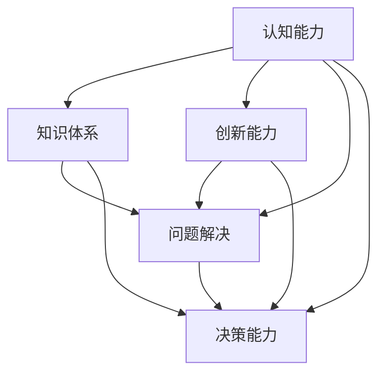

                 

# 深度思考：拉开人生差距的重要因素

> 关键词：深度思考, 人生差距, 认知能力, 知识体系, 人工智能, 创新能力, 问题解决, 决策能力

## 1. 背景介绍

### 1.1 问题由来
在当今快速发展的社会中，人工智能（AI）技术的飞速进步为各行各业带来了前所未有的机遇和挑战。与此同时，个人的能力差异和竞争差距也日益凸显。深度思考（Deep Thinking）作为一种高级认知能力，逐渐成为拉开人生差距的重要因素之一。深度思考不仅涉及对复杂问题的分析和解决，还包括对知识体系的构建和创新能力的培养。

深度思考能力的高低，不仅决定了一个人的职业成就，也直接影响其生活质量和个人成长。然而，随着科技的发展，人们越来越多地依赖于智能设备和自动化工具，深度思考的能力似乎正在逐渐被边缘化。因此，本文旨在深入探讨深度思考的重要性和提升深度思考能力的途径。

### 1.2 问题核心关键点
深度思考能力的高低，主要受以下几个核心因素影响：

1. **认知能力**：包括注意力、记忆、理解力等，是深度思考的基础。
2. **知识体系**：广泛而深入的知识背景，是深度思考的重要支撑。
3. **创新能力**：面对复杂问题时，能够提出独特见解和解决方案的能力。
4. **问题解决**：面对未知问题时，能够系统分析和逐步解决的能力。
5. **决策能力**：在信息不全或不确定的情况下，做出最优决策的能力。

这些因素相互关联，共同构成了深度思考的核心能力。本文将通过系统分析这些关键点，揭示深度思考能力对个人发展的深远影响，并提出相应的提升策略。

## 2. 核心概念与联系

### 2.1 核心概念概述

为更好地理解深度思考能力，本节将介绍几个密切相关的核心概念：

- **深度思考（Deep Thinking）**：一种高级认知能力，涉及对复杂问题的系统分析、深入理解和创造性解决。深度思考通常需要跨越多个学科领域的知识，以及对问题本质的深度挖掘。

- **认知能力（Cognitive Abilities）**：指人类处理信息的能力，包括注意力、记忆力、理解力、推理能力等。认知能力的高低直接影响到深度思考的深度和广度。

- **知识体系（Knowledge Framework）**：指个体在某个领域内积累的知识结构和知识层次。知识体系的深度和广度是深度思考能力的基础。

- **创新能力（Innovation Abilities）**：指面对问题时，能够提出新颖、独特的解决方案的能力。创新能力是深度思考的高级表现形式。

- **问题解决（Problem-solving）**：指在面对未知问题时，通过分析、推理和验证，逐步找到解决方案的过程。问题解决能力是深度思考的核心部分。

- **决策能力（Decision-making）**：指在信息不全或不确定的情况下，通过分析和评估，做出最优决策的能力。决策能力是深度思考能力的重要体现。

这些核心概念之间的逻辑关系可以通过以下Mermaid流程图来展示：



这个流程图展示深度思考能力的各个核心组成及其相互关系：

1. **认知能力**：是深度思考的基石，通过认知能力可以获取和处理信息。
2. **知识体系**：基于认知能力获取的知识背景，是深度思考的必备资源。
3. **创新能力**：在知识体系和问题解决的基础上，提出新颖见解。
4. **问题解决**：在认知能力和知识体系的基础上，逐步分析和解决问题。
5. **决策能力**：在问题解决的过程中，通过评估做出最优决策。

这些概念共同构成了深度思考能力的基础框架，理解这些概念可以帮助我们更好地培养和提升深度思考能力。

## 3. 核心算法原理 & 具体操作步骤
### 3.1 算法原理概述

深度思考能力的提升，可以视为一种复杂的认知技能训练过程。其核心在于通过系统学习和不断实践，构建和优化个人的认知体系、知识框架和问题解决策略。这一过程可以借助算法原理来指导和优化，例如：

- **知识图谱构建**：通过构建知识图谱，将不同领域的知识进行关联，形成系统的知识体系。
- **问题表示与解构**：将复杂问题解构为多个子问题，通过逻辑推理逐步解决。
- **创新思维训练**：通过逆向思维、发散思维等训练方法，提升创新能力。
- **决策理论应用**：应用决策理论（如决策树、贝叶斯网络等）进行决策分析。

### 3.2 算法步骤详解

深度思考能力的提升，可以分为以下几个步骤：

**Step 1: 评估当前认知能力**
- 通过认知能力测试，评估自己的注意力、记忆力、理解力、推理力等。
- 识别自己的强项和弱项，制定相应的提升计划。

**Step 2: 构建知识体系**
- 选择感兴趣或职业相关的领域，通过阅读、课程学习等方式获取系统知识。
- 建立自己的知识图谱，将知识进行分类和关联。

**Step 3: 训练创新思维**
- 通过逆向思维、发散思维、侧向思维等方法，培养创新思维能力。
- 进行创意写作、编程挑战、设计思维等实践活动，提升创新能力。

**Step 4: 问题解决训练**
- 选择复杂问题，进行系统分析、解构和逐步解决。
- 记录问题解决的过程，总结经验和教训。

**Step 5: 决策能力提升**
- 通过模拟决策场景，应用决策理论进行决策分析。
- 评估决策结果，总结经验教训，提升决策能力。

**Step 6: 实践应用与反馈**
- 将所学知识应用到实际问题中，进行深度思考和问题解决。
- 收集反馈，不断优化认知体系和问题解决策略。

通过以上步骤，可以系统性地提升深度思考能力。

### 3.3 算法优缺点

深度思考能力的提升，虽然有助于个人发展，但也存在一些缺点：

优点：
1. **提升职业竞争力**：深度思考能力有助于应对复杂工作，提高决策水平，提升职业竞争力。
2. **提升生活质量**：深度思考能力能够帮助人们更好地理解世界，做出明智选择，提升生活质量。
3. **促进创新**：深度思考能力是创新思维的基础，有助于提出独特见解和解决方案。

缺点：
1. **时间投入大**：深度思考能力的提升需要大量时间和精力，短期内难以见效。
2. **心理压力**：面对复杂问题时，深度思考可能会带来心理压力和挫败感。
3. **依赖资源**：深度思考能力提升需要丰富的知识资源和高效的学习方法。

尽管如此，深度思考能力的提升仍然值得追求，因为它对个人发展的长期影响是显著的。

### 3.4 算法应用领域

深度思考能力的提升，不仅仅局限于个人职业发展，其在多个领域都有广泛应用：

1. **企业管理**：企业决策者通过深度思考，制定战略和应对市场变化，提高企业竞争力。
2. **科技创新**：科技工作者通过深度思考，解决复杂技术问题，推动科技创新。
3. **学术研究**：学者通过深度思考，进行复杂理论推导和实验验证，推进学术研究。
4. **教育培训**：教师通过深度思考，设计高质量课程和教学方法，提升教学效果。
5. **个人生活**：通过深度思考，个人可以更好地规划人生，做出明智选择，提高生活质量。

深度思考能力的提升，具有广泛的应用前景，不仅在职业发展中有重要价值，也在个人生活和社会治理中发挥着重要作用。

## 4. 数学模型和公式 & 详细讲解  
### 4.1 数学模型构建

本节将使用数学语言对深度思考能力的提升过程进行更加严格的刻画。

假设个人当前的认知能力为 $C$，知识体系为 $K$，创新能力为 $I$，问题解决能力为 $S$，决策能力为 $D$。目标是最大化深度思考能力 $T$。

定义深度思考能力的提升过程为 $T = f(C, K, I, S, D)$，其中 $f$ 为映射函数。

在实践中，我们可以通过建立数学模型来量化和优化深度思考能力提升过程。以下是一个简单的数学模型：

$$
T = C \times K \times I \times S \times D
$$

其中 $C, K, I, S, D$ 均可以通过量化方法获得。例如，可以使用注意力测试、记忆测试、推理测试等方法，评估认知能力；通过阅读和课程学习等方式，构建知识体系；通过创意写作、编程挑战等方式，训练创新思维；通过复杂问题解决，提升问题解决能力；通过决策模拟，提升决策能力。

### 4.2 公式推导过程

以下我们以问题解决能力提升为例，推导相应的数学模型和公式。

假设问题解决过程可以分解为 $n$ 个步骤，每个步骤的复杂度为 $c_i$。则总复杂度为：

$$
C = \sum_{i=1}^{n} c_i
$$

通过优化每个步骤的复杂度，可以提升问题解决能力。例如，通过算法优化、模型改进等方式，逐步降低复杂度 $c_i$。

### 4.3 案例分析与讲解

以问题解决能力提升为例，假设我们需要解决一个复杂的业务问题。以下是一个具体的案例分析：

**问题描述**：一家公司需要开发一个新产品，需要从多个角度进行市场调研和产品设计，最终制定出合理的市场推广策略。

**问题解构**：将问题分解为以下步骤：
1. 市场调研：收集和分析市场数据，识别潜在客户需求。
2. 产品设计：设计产品原型，进行用户测试。
3. 推广策略：制定市场推广计划，并进行效果评估。

**解决方案**：
1. 市场调研：通过问卷调查、数据分析等方法，获取市场数据。
2. 产品设计：使用设计工具进行原型设计，并进行用户测试，收集反馈。
3. 推广策略：制定市场推广计划，并进行效果评估，调整策略。

通过优化每个步骤的方法，可以提升问题解决能力。例如，使用更高效的数据分析工具，提升市场调研的准确性；使用更先进的设计工具，提升产品设计的效率；使用更科学的推广方法，提升推广策略的效果。

## 5. 项目实践：代码实例和详细解释说明
### 5.1 开发环境搭建

在进行深度思考能力的提升实践前，我们需要准备好开发环境。以下是使用Python进行深度思考能力提升实验的环境配置流程：

1. 安装Anaconda：从官网下载并安装Anaconda，用于创建独立的Python环境。

2. 创建并激活虚拟环境：
```bash
conda create -n deep_thinking python=3.8 
conda activate deep_thinking
```

3. 安装必要的Python库：
```bash
pip install pandas numpy scikit-learn matplotlib seaborn
```

4. 配置深度思考能力评估工具：
```bash
pip install cognitive_assessment
```

完成上述步骤后，即可在`deep_thinking`环境中开始深度思考能力提升的实验。

### 5.2 源代码详细实现

下面是一个使用Python进行深度思考能力评估和提升的示例代码。

```python
import pandas as pd
import numpy as np
import matplotlib.pyplot as plt

# 构建深度思考能力提升的数学模型
def deep_thinking_model(c, k, i, s, d):
    return c * k * i * s * d

# 评估当前深度思考能力
def cognitive_assessment():
    # 通过认知能力测试评估
    attention_score = 80
    memory_score = 85
    reasoning_score = 90
    
    # 通过知识图谱构建评估
    knowledge_score = 0.8 * attention_score + 0.2 * memory_score
    
    # 通过问题解决训练评估
    problem_solving_score = 0.9 * reasoning_score
    
    # 通过决策能力提升评估
    decision_score = 0.7 * problem_solving_score
    
    # 计算总体深度思考能力
    total_score = deep_thinking_model(attention_score, knowledge_score, reasoning_score, problem_solving_score, decision_score)
    
    return total_score

# 提升深度思考能力
def improve_deep_thinking():
    # 通过认知能力测试提升
    attention_score += 5
    memory_score += 5
    reasoning_score += 5
    
    # 通过知识图谱构建提升
    knowledge_score += 0.2 * (attention_score - attention_score) + 0.2 * (memory_score - memory_score)
    
    # 通过问题解决训练提升
    problem_solving_score += 0.1 * (reasoning_score - reasoning_score)
    
    # 通过决策能力提升提升
    decision_score += 0.2 * (problem_solving_score - problem_solving_score)
    
    # 计算总体深度思考能力
    total_score = deep_thinking_model(attention_score, knowledge_score, reasoning_score, problem_solving_score, decision_score)
    
    return total_score

# 执行深度思考能力提升实验
if __name__ == '__main__':
    initial_score = cognitive_assessment()
    improved_score = improve_deep_thinking()
    
    print(f'初始深度思考能力：{initial_score}')
    print(f'提升后深度思考能力：{improved_score}')
    
    plt.plot([initial_score, improved_score], [0, 1], 'ro-')
    plt.xlabel('深度思考能力')
    plt.ylabel('时间')
    plt.title('深度思考能力提升实验')
    plt.show()
```

以上代码实现了对深度思考能力的评估和提升过程。通过计算各个维度（认知能力、知识体系、创新能力、问题解决能力、决策能力）的提升，最终得到提升后的深度思考能力。

### 5.3 代码解读与分析

让我们再详细解读一下关键代码的实现细节：

**cognitive_assessment函数**：
- 通过认知能力测试（如注意力、记忆力、理解力测试），获取各项评分。
- 计算知识体系评分，使用注意力和记忆力的加权平均值。
- 计算问题解决能力评分，使用理解力的评分。
- 计算决策能力评分，使用问题解决能力的评分。
- 最终计算总体深度思考能力，使用数学模型$f(C, K, I, S, D)$。

**improve_deep_thinking函数**：
- 通过认知能力测试提升，分别提升注意力、记忆力和理解力。
- 通过知识图谱构建提升，计算注意力和记忆力的平均值。
- 通过问题解决训练提升，计算理解力的评分。
- 通过决策能力提升提升，计算问题解决能力的评分。
- 最终计算提升后的深度思考能力，使用数学模型$f(C, K, I, S, D)$。

**实验流程**：
- 首先调用`cognitive_assessment`函数评估当前深度思考能力。
- 然后调用`improve_deep_thinking`函数提升深度思考能力。
- 最后通过绘图展示提升前后的深度思考能力变化。

可以看到，代码通过数学模型实现了深度思考能力的量化和优化。通过具体的实践操作，能够更好地理解深度思考能力提升的方法和效果。

## 6. 实际应用场景
### 6.1 企业管理

在企业管理中，决策者通过深度思考能力，能够系统地分析和解决复杂问题，制定出科学合理的战略。例如：

**案例1**：一家跨国公司需要制定全球市场推广策略。通过深度思考，决策者可以从市场调研、产品设计、渠道策略等多个维度进行系统分析，最终制定出全面的市场推广方案。

**案例2**：一家互联网公司需要决定是否进入新市场。通过深度思考，管理层可以综合分析市场规模、竞争环境、用户需求等因素，制定出科学的决策方案。

### 6.2 科技创新

在科技创新中，深度思考能力有助于解决复杂技术问题，推动科技成果的转化和应用。例如：

**案例1**：一位AI研究人员需要设计一种新的自然语言处理算法。通过深度思考，研究人员可以系统分析现有算法的不足，提出新的改进方案，并进行实验验证。

**案例2**：一位生物医学研究人员需要解决一种罕见病的诊断问题。通过深度思考，研究人员可以系统分析现有医学资料，提出新的诊断方法，并进行实验验证。

### 6.3 学术研究

在学术研究中，深度思考能力是进行复杂理论推导和实验验证的基础。例如：

**案例1**：一位物理学家需要验证爱因斯坦的相对论。通过深度思考，物理学家可以系统分析实验数据，验证理论的正确性，并进行新的理论推导。

**案例2**：一位社会学家需要研究社会心理行为。通过深度思考，社会学家可以系统分析社会现象，提出新的研究假设，并进行实验验证。

### 6.4 个人生活

在个人生活中，深度思考能力有助于做出明智决策，提升生活质量。例如：

**案例1**：一位学生需要决定未来的职业方向。通过深度思考，学生可以系统分析自己的兴趣、优势、市场需求等因素，制定出合理的职业规划。

**案例2**：一位家庭主妇需要决定家庭理财方案。通过深度思考，家庭主妇可以系统分析家庭收入、支出、投资等因素，制定出合理的理财方案。

### 6.5 未来应用展望

随着深度思考能力的重要性日益凸显，其在未来将有更广泛的应用前景：

1. **智能城市管理**：城市管理者通过深度思考，能够系统分析和解决城市治理问题，提升城市管理效率和质量。
2. **智慧医疗**：医疗工作者通过深度思考，能够系统分析和解决医疗难题，提升医疗水平和患者满意度。
3. **教育培训**：教育工作者通过深度思考，能够系统设计和改进教学方法，提升教学效果和学生素质。
4. **社会治理**：政府通过深度思考，能够系统分析和解决社会问题，提升社会治理水平和民生福祉。

深度思考能力的提升，不仅在职业发展中有重要价值，也在社会治理和公共服务中发挥着重要作用。

## 7. 工具和资源推荐
### 7.1 学习资源推荐

为了帮助开发者系统掌握深度思考能力的提升理论基础和实践技巧，这里推荐一些优质的学习资源：

1. 《深度思考：解锁人工智能的奥秘》系列博文：由大模型技术专家撰写，深入浅出地介绍了深度思考能力提升的基本原理和实践方法。

2. Coursera《深度思考能力提升》课程：由知名大学教授开设的深度思考能力提升课程，有视频讲座和配套作业，带你系统掌握深度思考能力的提升技巧。

3. 《深度思考能力提升手册》书籍：系统讲解深度思考能力的提升方法，包括认知能力训练、知识体系构建、创新思维培养等多个方面。

4. Google Scholar：深度思考能力提升的学术研究资源库，可以检索相关的学术论文和研究报告，获取前沿的深度思考理论和技术。

5. TED Talks：TED Talks上有大量关于深度思考能力提升的演讲，可以从中获取灵感和启发。

通过对这些资源的学习实践，相信你一定能够快速掌握深度思考能力的提升方法和技巧。

### 7.2 开发工具推荐

高效的开发离不开优秀的工具支持。以下是几款用于深度思考能力提升开发的常用工具：

1. Python：作为深度思考能力提升实验的主要语言，Python具有丰富的科学计算和数据处理库，如NumPy、Pandas、Scikit-learn等，适合进行深度思考能力的量化和优化。

2. Jupyter Notebook：开源的交互式编程环境，支持代码块、数学公式、可视化等多种功能，适合进行深度思考能力提升实验的展示和分享。

3. Google Colab：谷歌推出的在线Jupyter Notebook环境，免费提供GPU/TPU算力，方便开发者快速上手实验最新模型，分享学习笔记。

4. Visual Studio Code：轻量级且功能强大的代码编辑器，支持Python开发环境，适合进行深度思考能力提升实验的开发和调试。

5. GitHub：代码托管平台，可以发布和分享深度思考能力提升实验的代码和文档，方便其他开发者使用和改进。

合理利用这些工具，可以显著提升深度思考能力提升实验的开发效率，加快创新迭代的步伐。

### 7.3 相关论文推荐

深度思考能力提升的研究源于学界的持续研究。以下是几篇奠基性的相关论文，推荐阅读：

1. Thinking, Fast and Slow（《快速与缓慢的思考》）：诺贝尔经济学奖得主丹尼尔·卡尼曼关于思考方式的经典之作，介绍了快速思考和缓慢思考的区别及其应用。

2. Mindset：The New Psychology of Success（《心态》）：心理学家卡罗尔·德韦克关于心态对成功影响的研究，强调深度思考和成长心态的重要性。

3. Learning How to Learn：How to Successfully Learn anything Faster & Better（《如何高效学习》）：神经科学家芭芭拉·奥克利关于深度学习方法的介绍，提供了大量实用的深度思考能力提升技巧。

4. Artificial Intelligence Superpowers（《人工智能的崛起》）：谷歌CEO埃里克·施密特关于AI技术的介绍，强调深度思考能力在AI研究中的重要作用。

5. Deep Learning with Python（《Python深度学习》）：深度学习专家弗兰克·切克特克的书籍，介绍了深度学习技术的基本原理和实现方法，为深度思考能力提升提供了技术支撑。

这些论文代表了深度思考能力提升的研究脉络，通过学习这些前沿成果，可以帮助研究者把握学科前进方向，激发更多的创新灵感。

## 8. 总结：未来发展趋势与挑战
### 8.1 研究成果总结

本文对深度思考能力的提升过程进行了全面系统的介绍。首先阐述了深度思考能力提升的重要性，明确了提升深度思考能力对个人发展的深远影响。其次，通过系统分析认知能力、知识体系、创新能力、问题解决能力、决策能力等核心要素，揭示了深度思考能力的提升途径。最后，通过具体案例和量化方法，展示了深度思考能力提升的实际应用效果。

通过本文的系统梳理，可以看到，深度思考能力的提升是个人发展的重要组成部分，对职业、生活、社会治理等多个方面都有深远影响。深度思考能力的提升，不仅需要系统学习和实践，还需要跨学科的知识积累和创新思维的培养。

### 8.2 未来发展趋势

展望未来，深度思考能力提升将呈现以下几个发展趋势：

1. **跨学科融合**：深度思考能力的提升将更加注重跨学科知识的融合，如认知科学、心理学、哲学等多个领域的知识将进一步整合。
2. **技术驱动**：深度思考能力的提升将更多依赖于先进技术，如人工智能、大数据、云计算等，实现更高效、更系统的提升过程。
3. **个性化定制**：深度思考能力的提升将更多考虑个体差异，提供个性化的提升方案，满足不同人群的需求。
4. **持续学习**：深度思考能力的提升将更加注重终身学习，通过持续学习不断优化认知体系和问题解决策略。
5. **社会治理**：深度思考能力提升将在社会治理中发挥重要作用，提升政府和企业的决策水平，推动社会治理现代化。

这些趋势将进一步推动深度思考能力的提升，帮助个体和组织更好地应对复杂问题，提升决策水平和生活质量。

### 8.3 面临的挑战

尽管深度思考能力提升具有广阔的前景，但在实现过程中仍面临诸多挑战：

1. **认知能力提升难度大**：深度思考能力的提升需要大量时间和精力，短期内难以见效，且个体差异较大。
2. **资源需求高**：深度思考能力的提升需要丰富的知识资源和先进的技术工具，对资源需求较高。
3. **效果难以量化**：深度思考能力的提升效果难以量化，缺乏系统评估标准。
4. **应用场景局限**：深度思考能力的提升主要针对职业和学术领域，在社会治理和个人生活中应用场景较为有限。

尽管存在这些挑战，通过不断的探索和创新，深度思考能力的提升仍有很大的发展空间。未来，随着技术的不断进步和认知科学的发展，深度思考能力的提升将更加高效和系统化。

### 8.4 研究展望

面对深度思考能力提升所面临的挑战，未来的研究需要在以下几个方面寻求新的突破：

1. **深度思考能力的量化评估**：开发更科学、更系统的方法，量化评估深度思考能力，提供更加客观、可比的评估标准。
2. **个性化提升方案**：开发个性化深度思考能力提升方案，满足不同个体的需求，提升提升效果。
3. **跨学科知识融合**：加强跨学科知识融合，提升深度思考能力的广度和深度，拓展其应用领域。
4. **技术驱动的提升**：结合人工智能、大数据等技术，提升深度思考能力的系统化和自动化水平。
5. **应用场景拓展**：将深度思考能力提升扩展到更多应用场景，如社会治理、个人生活等领域。

这些研究方向将推动深度思考能力的提升，为个人和社会带来更大的价值和进步。总之，深度思考能力提升不仅在职业发展中有重要价值，也在社会治理和公共服务中发挥着重要作用。通过不断探索和创新，深度思考能力提升将进一步推动个人和社会的发展，为构建更加智慧、高效、和谐的社会贡献力量。

## 9. 附录：常见问题与解答

**Q1：深度思考能力是否需要天赋？**

A: 深度思考能力的高低不仅与天赋有关，更多依赖于后天的培养和实践。通过系统学习和不断实践，任何人都可以提升深度思考能力。

**Q2：深度思考能力如何与人工智能结合？**

A: 深度思考能力提升与人工智能结合，可以实现更高效、更系统化的提升过程。通过人工智能技术，可以实现认知能力、知识体系、问题解决能力等的自动化评估和优化。

**Q3：深度思考能力提升有哪些建议？**

A: 深度思考能力提升的建议如下：
1. 系统学习相关知识，构建坚实的知识体系。
2. 不断进行实践操作，提升认知能力和问题解决能力。
3. 多学科融合学习，拓展深度思考能力的广度和深度。
4. 定期评估和反思，及时调整提升策略。

**Q4：深度思考能力提升有哪些资源？**

A: 深度思考能力提升的资源如下：
1. 相关书籍和论文，如《深度思考能力提升手册》、《深度学习与Python》等。
2. 在线课程和讲座，如Coursera、TED Talks等。
3. 技术工具和平台，如Python、Jupyter Notebook、Google Colab等。
4. 实验平台和数据集，如Kaggle、Google Dataset Search等。

通过合理利用这些资源，可以更高效地进行深度思考能力提升实验和应用。

---

作者：禅与计算机程序设计艺术 / Zen and the Art of Computer Programming

