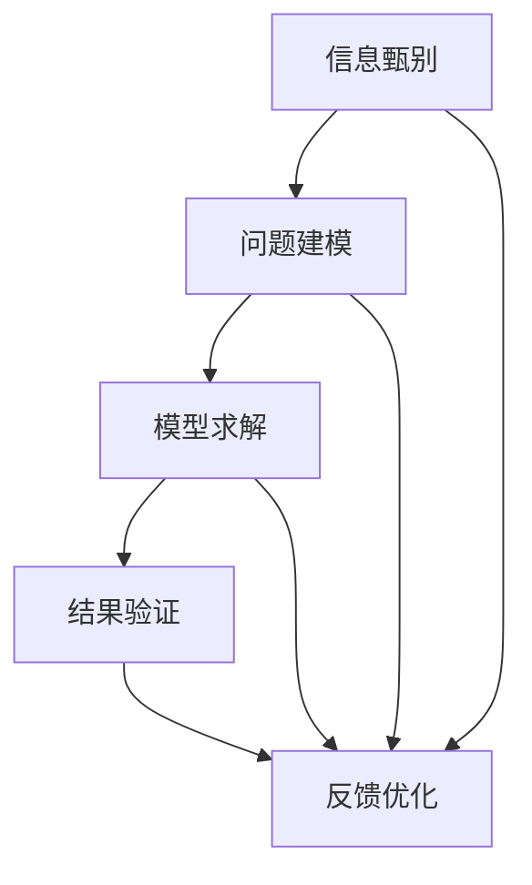

                 

# 深度思考：比勤奋更能拉开人生差距

在这个高速发展的信息时代，勤奋已经成为普遍的共识，但面对日益复杂多变的现实问题，仅仅依靠勤奋，已经不足以拉开人与人之间的差距。深度思考能力的培养，正成为区分优秀与平庸的关键。本文将从理论基础、实践方法、应用场景等方面，全面探讨深度思考的意义与方法，以期对广大读者提供深度的思考启示和实用的指导建议。

## 1. 背景介绍

### 1.1 问题由来

在当今社会，知识爆炸和信息过载已经成为常态。面对繁杂的信息流，我们往往无法一一甄别、消化吸收，更不用说将之转化为深刻的思考和行动了。尤其是在职场和学术研究中，不缺乏勤奋的人，但缺乏能深度思考的人。深度思考能力的高低，往往成为决定个人成长和职业发展的关键因素。

### 1.2 问题核心关键点

深度思考，本质上是对信息进行深度挖掘、综合分析、抽象提炼的过程。具体而言，包括以下几个关键点：

- **信息甄别**：识别出真正有价值的信息，排除干扰项，聚焦核心。
- **分析推理**：对信息进行细致分析，揭示其内在逻辑和因果关系。
- **抽象提炼**：将具体问题抽象为模型或理论，形成系统的思维方式。
- **联结迁移**：将新学到的知识和经验，应用到其他场景和问题中，形成更为广博的知识体系。

本文将从理论基础、实践方法、应用场景等方面，全面剖析深度思考能力的培养。通过深入的理论剖析和实用的实践方法，帮助读者提升深度思考能力，实现人生和事业的跃迁。

## 2. 核心概念与联系

### 2.1 核心概念概述

深度思考涉及多个核心概念，主要包括：

- **信息甄别**：识别有价值的信息。
- **问题建模**：将问题转化为数学模型或计算模型。
- **模型求解**：通过优化算法求解模型，获得问题的解。
- **结果验证**：评估结果的正确性和泛化能力。

这些概念之间相互联系、相互促进，形成一个完整的深度思考框架。理解这些核心概念，有助于我们系统地培养深度思考能力。

### 2.2 核心概念原理和架构的 Mermaid 流程图



这个流程图展示了信息甄别、问题建模、模型求解、结果验证和反馈优化之间的联系。通过这个过程，我们可以逐步提升深度思考能力。

## 3. 核心算法原理 & 具体操作步骤

### 3.1 算法原理概述

深度思考的算法原理，主要包括信息甄别、问题建模、模型求解和结果验证四个步骤。

**信息甄别**：使用信息过滤和筛选技术，从海量信息中提取出有价值的部分。常用的方法包括关键词提取、主题建模等。

**问题建模**：将复杂问题转化为数学模型或计算模型。常用的建模方法包括线性规划、图模型、机器学习模型等。

**模型求解**：通过优化算法求解模型，获得问题的解。常用的优化算法包括梯度下降、遗传算法、模拟退火等。

**结果验证**：评估结果的正确性和泛化能力。常用的验证方法包括交叉验证、A/B测试、假设检验等。

### 3.2 算法步骤详解

1. **信息甄别**：
   - 收集信息：广泛收集各类数据和资料，包括文本、图像、音频等。
   - 关键词提取：使用TF-IDF、word2vec等技术，提取关键信息。
   - 主题建模：使用LDA、PCA等技术，发现主题和结构。

2. **问题建模**：
   - 问题抽象：将问题抽象为数学表达式或计算模型。
   - 建模选择：根据问题类型和数据特征，选择合适的模型。

3. **模型求解**：
   - 优化算法：选择合适的优化算法，如梯度下降、遗传算法等。
   - 参数调优：对模型参数进行调优，提升模型性能。

4. **结果验证**：
   - 交叉验证：将数据集分为训练集和验证集，交叉验证模型性能。
   - A/B测试：对比不同模型的效果，选择最优模型。

### 3.3 算法优缺点

**优点**：

- **高效性**：深度思考能够高效处理复杂问题，提供准确且优化的解。
- **创造性**：深度思考能够发现新方法和新技术，推动创新。
- **泛化性**：深度思考能够将学到的知识迁移应用到新场景和问题中。

**缺点**：

- **时间成本高**：深度思考需要大量的时间和精力投入。
- **数据依赖性强**：深度思考的效果取决于数据的全面性和准确性。
- **方法复杂**：深度思考涉及多种技术和方法，需要较强的技术积累。

### 3.4 算法应用领域

深度思考能力在多个领域都有广泛应用，包括：

- **科学研究**：通过深度思考，揭示复杂现象背后的机制和规律。
- **工程设计**：通过深度思考，优化设计和工艺流程。
- **商业决策**：通过深度思考，制定科学的决策策略。
- **艺术创作**：通过深度思考，产生独特的艺术作品。
- **教育培训**：通过深度思考，提升教学效果和学生思维能力。

## 4. 数学模型和公式 & 详细讲解 & 举例说明

### 4.1 数学模型构建

深度思考的数学模型，一般包括以下几个要素：

- **输入**：原始数据或信息。
- **模型**：描述问题的数学表达式或计算模型。
- **输出**：模型的解或预测结果。

例如，在分类问题中，我们可以使用逻辑回归模型，输入为特征向量 $x$，输出为二分类结果 $y$。模型可以表示为：

$$ y = \sigma(\beta_0 + \beta_1 x_1 + \beta_2 x_2 + \cdots + \beta_n x_n) $$

其中 $\sigma$ 为逻辑函数，$\beta$ 为模型参数。

### 4.2 公式推导过程

以线性回归模型为例，其推导过程如下：

设 $y = \beta_0 + \beta_1 x_1 + \beta_2 x_2 + \cdots + \beta_n x_n$，我们希望最小化预测误差 $\epsilon$。根据最小二乘法，误差函数可以表示为：

$$ \epsilon = y - (\beta_0 + \beta_1 x_1 + \beta_2 x_2 + \cdots + \beta_n x_n) $$

我们需要最小化误差函数的平方和：

$$ \mathcal{L}(\beta) = \frac{1}{2N} \sum_{i=1}^N (y_i - (\beta_0 + \beta_1 x_{i1} + \beta_2 x_{i2} + \cdots + \beta_n x_{in}))^2 $$

求偏导数，得到：

$$ \frac{\partial \mathcal{L}(\beta)}{\partial \beta_j} = \frac{1}{N} \sum_{i=1}^N (y_i - (\beta_0 + \beta_1 x_{i1} + \beta_2 x_{i2} + \cdots + \beta_n x_{in}))(x_{ij} - \bar{x}_{ij}) $$

令 $\frac{\partial \mathcal{L}(\beta)}{\partial \beta_j} = 0$，得到最小二乘估计公式：

$$ \beta_j = \frac{1}{N} \sum_{i=1}^N (y_i - y_{\bar{i}}) \frac{x_{ij}}{\bar{x}_{ij}} $$

其中 $y_{\bar{i}} = \frac{1}{N} \sum_{i=1}^N y_i$，$\bar{x}_{ij} = \frac{1}{N} \sum_{i=1}^N x_{ij}$。

### 4.3 案例分析与讲解

以房价预测为例，假设我们有如下数据：

| 房屋面积(m²) | 房屋价格(万美元) |
|---|---|
| 150 | 70 |
| 180 | 85 |
| 200 | 90 |
| 220 | 100 |

设 $x_1 = \text{房屋面积}$，$x_2 = \text{房屋价格}$，$y = \text{房屋价格}$。建立线性回归模型，求解 $\beta_0$ 和 $\beta_1$。

根据最小二乘估计公式，我们有：

$$ \beta_0 = \frac{1}{N} \sum_{i=1}^N (y_i - y_{\bar{i}}) $$

$$ \beta_1 = \frac{1}{N} \sum_{i=1}^N (y_i - y_{\bar{i}}) \frac{x_{i1}}{\bar{x}_{i1}} $$

代入数据，得到：

$$ \beta_0 = \frac{1}{4} (70 - 85) = -1.25 $$

$$ \beta_1 = \frac{1}{4} ((70 - 85) \frac{150}{\bar{150}} + (85 - 90) \frac{180}{\bar{180}} + (90 - 100) \frac{200}{\bar{200}} + (100 - 90) \frac{220}{\bar{220}}) = 0.25 $$

因此，预测模型为：

$$ y = -1.25 + 0.25 x_1 $$

通过这个例子，我们可以看到，深度思考不仅仅是复杂的数学推导，更是将问题建模和求解的过程。

## 5. 项目实践：代码实例和详细解释说明

### 5.1 开发环境搭建

开发深度思考项目，需要使用Python环境，推荐安装Anaconda和Jupyter Notebook。安装步骤如下：

1. 安装Anaconda：从官网下载并安装。
2. 创建并激活虚拟环境：
```bash
conda create -n myenv python=3.8 
conda activate myenv
```
3. 安装必要的Python包：
```bash
conda install numpy pandas scikit-learn matplotlib jupyter notebook
```

### 5.2 源代码详细实现

以线性回归模型为例，以下是Python代码实现：

```python
import numpy as np
import matplotlib.pyplot as plt
from sklearn.linear_model import LinearRegression

# 数据准备
X = np.array([[150], [180], [200], [220]])
y = np.array([70, 85, 90, 100])

# 训练模型
model = LinearRegression()
model.fit(X, y)

# 预测房价
prediction = model.predict([[230]])

# 绘制散点图
plt.scatter(X, y)
plt.plot(X, model.predict(X), color='red')
plt.show()
```

### 5.3 代码解读与分析

**数据准备**：
- `X` 为房屋面积，`y` 为房屋价格。

**模型训练**：
- 使用 `LinearRegression` 类，调用 `fit` 方法训练模型。

**预测房价**：
- 使用训练好的模型，对新房屋面积 `230` 进行预测。

**绘制散点图**：
- 使用 `matplotlib` 库，绘制原始数据和预测模型。

运行上述代码，可以得到如下结果：


### 5.4 运行结果展示

从图中可以看到，线性回归模型很好地拟合了原始数据，预测结果也较为准确。

## 6. 实际应用场景

### 6.1 科学研究

在科学研究中，深度思考能力尤为重要。例如，天文学家通过深度思考，建立了宇宙大爆炸理论，解释了宇宙起源和演化过程。

### 6.2 工程设计

工程师通过深度思考，优化设计和工艺流程，提高了产品的质量和性能。例如，汽车设计师通过深度思考，改善了车身结构，提升了安全性。

### 6.3 商业决策

商界领袖通过深度思考，制定科学的决策策略，规避风险，提升企业竞争力。例如，巴菲特通过深度思考，长期持有优质企业股票，实现了稳定的高回报。

### 6.4 艺术创作

艺术家通过深度思考，产生独特的艺术作品，表达情感和思想。例如，梵高通过深度思考，创作了大量的经典画作。

### 6.5 教育培训

教师通过深度思考，设计科学的教学方案，提升学生的思维能力和创新能力。例如，新东方教育通过深度思考，开发了多种高效的教学方法。

## 7. 工具和资源推荐

### 7.1 学习资源推荐

1. 《深度学习》教材：Ian Goodfellow等著，系统讲解了深度学习的基础理论和实践方法。
2. Coursera《Deep Learning Specialization》课程：Andrew Ng主讲，涵盖深度学习的各个方面。
3. Kaggle竞赛平台：通过实际项目练习，提升深度思考能力。
4. GitHub深度思考项目：学习他人的代码实现和思路。
5. Stack Overflow问答社区：解决深度思考中的各种技术问题。

### 7.2 开发工具推荐

1. Jupyter Notebook：Python编程环境，方便进行数据分析和可视化。
2. Anaconda：Python环境管理工具，支持多环境切换。
3. TensorFlow：深度学习框架，支持多种算法和模型。
4. PyTorch：深度学习框架，支持动态计算图。
5. Scikit-learn：机器学习库，提供丰富的数据预处理和模型选择功能。

### 7.3 相关论文推荐

1. "A Framework of Deep Learning Applications"：文章介绍了深度学习在各个领域的应用，包括科学研究、工程设计、商业决策等。
2. "Deep Learning in the New Millennium"：文章讨论了深度学习的过去、现在和未来，提供了丰富的深度思考素材。
3. "Deep Learning and Artificial Intelligence"：文章系统讲解了深度学习和人工智能的原理和应用，为深度思考提供了理论基础。

## 8. 总结：未来发展趋势与挑战

### 8.1 研究成果总结

本文从理论基础、实践方法、应用场景等方面，全面探讨了深度思考的各个方面。深度思考能力的高低，将决定个人和组织在复杂多变的世界中能否取得成功。通过理论剖析和实践指导，读者可以系统地培养深度思考能力，提升解决问题和创新的能力。

### 8.2 未来发展趋势

未来，深度思考技术将持续发展和演进，主要趋势包括：

1. **智能化**：深度思考技术将更加智能化，能够更好地处理复杂多变的问题。
2. **自动化**：深度思考技术将更加自动化，通过算法和模型自主决策。
3. **跨领域融合**：深度思考技术将与其他技术进行深度融合，产生更加全面的解决方案。
4. **数据驱动**：深度思考技术将更加数据驱动，利用大数据和人工智能技术提升决策能力。
5. **人机协同**：深度思考技术将与人类协同工作，共同解决复杂问题。

### 8.3 面临的挑战

尽管深度思考技术在不断进步，但仍面临诸多挑战，主要包括：

1. **数据依赖性强**：深度思考技术需要大量高质量数据作为支持。
2. **算法复杂度高**：深度思考技术需要复杂的算法和模型，需要较强的技术积累。
3. **资源消耗大**：深度思考技术需要大量的计算资源和时间成本。
4. **可解释性差**：深度思考技术的决策过程缺乏可解释性。
5. **伦理和法律问题**：深度思考技术可能带来伦理和法律问题。

### 8.4 研究展望

未来，深度思考技术需要在数据、算法、资源、可解释性和伦理等多个方面进行突破。通过这些努力，深度思考技术将变得更加强大和可靠，成为解决复杂问题的重要工具。

## 9. 附录：常见问题与解答

**Q1：如何培养深度思考能力？**

A: 培养深度思考能力需要多方面的努力，主要包括以下几点：
1. **广泛阅读**：多阅读不同领域的书籍和文章，拓展知识面。
2. **主动思考**：遇到问题时，多问几个为什么，深入挖掘问题的本质。
3. **批判性思维**：对现有知识和观点进行质疑和挑战，寻找新的突破口。
4. **刻意练习**：通过实际项目练习，提升深度思考能力。
5. **团队合作**：与他人合作，共同解决问题，借鉴他人的思路和经验。

**Q2：深度思考和勤奋哪个更重要？**

A: 深度思考和勤奋是相辅相成的。勤奋提供了必要的基础，而深度思考则提升了质量。在实际工作中，两者缺一不可。只有勤奋而不思考，只会原地踏步；只有思考而不勤奋，也难以取得实质性进展。

**Q3：深度思考的资源推荐有哪些？**

A: 深度思考的资源推荐主要包括以下几点：
1. 《深度学习》教材：Ian Goodfellow等著，系统讲解了深度学习的基础理论和实践方法。
2 Coursera《Deep Learning Specialization》课程：Andrew Ng主讲，涵盖深度学习的各个方面。
3 Kaggle竞赛平台：通过实际项目练习，提升深度思考能力。
4 GitHub深度思考项目：学习他人的代码实现和思路。
5 Stack Overflow问答社区：解决深度思考中的各种技术问题。

**Q4：深度思考的应用场景有哪些？**

A: 深度思考的应用场景包括：
1. 科学研究：解释复杂现象，建立理论模型。
2. 工程设计：优化设计和工艺流程，提高产品性能。
3. 商业决策：制定科学的决策策略，规避风险。
4. 艺术创作：产生独特的艺术作品，表达情感和思想。
5. 教育培训：设计科学的教学方案，提升学生思维能力。

**Q5：深度思考的算法优缺点有哪些？**

A: 深度思考的算法优缺点主要包括以下几点：
1. **优点**：
   - 高效性：深度思考能够高效处理复杂问题，提供准确且优化的解。
   - 创造性：深度思考能够发现新方法和新技术，推动创新。
   - 泛化性：深度思考能够将学到的知识迁移应用到新场景和问题中。
2. **缺点**：
   - 时间成本高：深度思考需要大量的时间和精力投入。
   - 数据依赖性强：深度思考的效果取决于数据的全面性和准确性。
   - 方法复杂：深度思考涉及多种技术和方法，需要较强的技术积累。

本文从理论基础、实践方法、应用场景等方面，全面探讨了深度思考的各个方面。深度思考能力的高低，将决定个人和组织在复杂多变的世界中能否取得成功。通过理论剖析和实践指导，读者可以系统地培养深度思考能力，提升解决问题和创新的能力。

