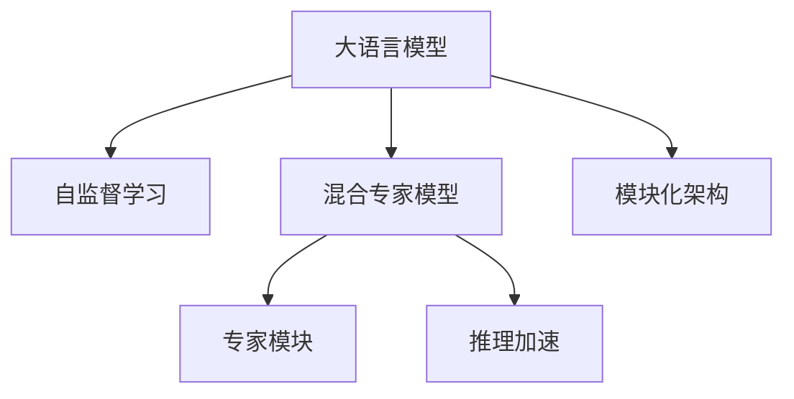
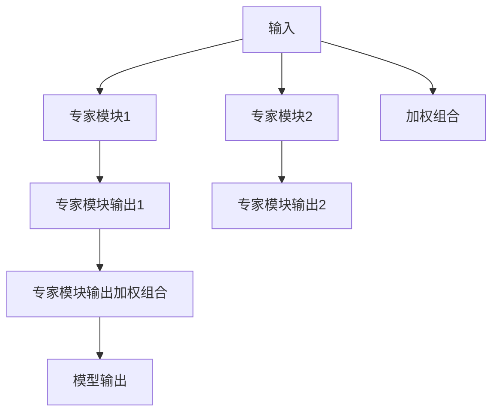

                 

# 混合专家模型（MoE）：提高LLM效率的新方向

> 关键词：混合专家模型,LLM,大语言模型,高效计算,深度学习,自监督学习,模块化架构,推理加速

## 1. 背景介绍

### 1.1 问题由来
近年来，随着深度学习技术的飞速发展，大规模语言模型（Large Language Models, LLMs）在自然语言处理（NLP）领域取得了巨大突破。这些模型通过在海量无标签文本数据上进行自监督预训练，学习到了丰富的语言知识和常识，具备强大的语言理解和生成能力。然而，由于模型规模庞大，对计算资源和存储空间的要求极高，大语言模型（Large Language Models, LLMs）在实际应用中面临着高昂的运营成本。

此外，现有的LLM模型在推理过程中往往需要全量计算，这不仅消耗大量的计算资源，且推理速度较慢，难以满足实时应用的需求。因此，如何提高LLM的效率，使其在保持强大语言能力的同时，能够更加经济高效地运行，成为当前研究的热点问题。

### 1.2 问题核心关键点
本节将介绍一种能够有效提高LLM效率的新方法：混合专家模型（Mixture-of-Experts, MoE）。混合专家模型是一种模块化的架构，通过将复杂的计算任务分解为多个简单任务，每个任务由一个独立的专家模块处理，从而实现高效的推理计算。

## 2. 核心概念与联系

### 2.1 核心概念概述

为更好地理解混合专家模型，本节将介绍几个关键概念：

- 混合专家模型（MoE）：一种通过将复杂任务分解为多个简单任务，每个任务由一个独立的专家模块处理的深度学习架构。每个专家模块是一个小型神经网络，通过少量参数进行自监督预训练，具备一定的知识表达能力。

- 大语言模型（LLM）：指通过大规模自监督预训练获得广泛语言知识的大规模神经网络模型，如BERT、GPT等。

- 自监督学习（Self-Supervised Learning）：一种通过无标签数据进行训练的深度学习范式，通过设计自动化的预训练任务，让模型自动学习输入数据的内在结构。

- 模块化架构（Modular Architecture）：一种将大系统分解为多个独立、可复用模块的架构设计思想，有助于提升系统的灵活性和可扩展性。

- 推理加速（Inference Acceleration）：通过优化模型结构和计算方式，提高模型推理速度和效率，降低计算资源的消耗。

- 深度学习（Deep Learning）：一种基于神经网络的机器学习方法，通过多层次的非线性变换提取输入数据的高级特征。

这些概念之间的逻辑关系可以通过以下Mermaid流程图来展示：



这个流程图展示了大语言模型和混合专家模型的核心概念及其之间的关系：

1. 大语言模型通过自监督学习获得基础能力。
2. 混合专家模型将大语言模型分解为多个独立模块，每个模块具备一定的知识表达能力。
3. 每个专家模块通过自监督学习进行训练，提高模块的独立性和可复用性。
4. 推理加速优化模型结构和计算方式，提升模型推理速度。
5. 模块化架构设计使大语言模型更加灵活可扩展。

## 3. 核心算法原理 & 具体操作步骤
### 3.1 算法原理概述

混合专家模型（MoE）是一种通过将复杂任务分解为多个简单任务，每个任务由一个独立的专家模块处理的深度学习架构。其核心思想是：将大语言模型的计算任务分解为多个子任务，每个子任务由一个专家模块处理，通过并行计算的方式，大幅提升模型的推理效率。

形式化地，设大语言模型为 $M_{\theta}$，其中 $\theta$ 为模型参数。混合专家模型的计算流程如图1所示，具体步骤如下：

1. 将输入 $x$ 送入不同的专家模块 $E_1, E_2, ..., E_n$，获得 $n$ 个输出 $z_1, z_2, ..., z_n$。
2. 对每个专家模块的输出 $z_i$ 进行加权组合，得到模型最终的输出 $y$。
3. 将最终输出 $y$ 作为模型对输入 $x$ 的预测结果。

其中，专家模块 $E_i$ 的输出 $z_i$ 可以表示为：

$$ z_i = \sigma(W_i \cdot x + b_i) $$

其中，$W_i$ 和 $b_i$ 为专家模块的权重和偏置参数。

### 3.2 算法步骤详解

混合专家模型的具体实现步骤如下：

**Step 1: 模型初始化**
- 首先，将大语言模型 $M_{\theta}$ 的参数初始化为一个较小的值。
- 然后，随机初始化每个专家模块的参数 $W_i$ 和 $b_i$。

**Step 2: 自监督预训练**
- 使用大语言模型的自监督预训练任务，如语言建模、掩码语言建模等，对每个专家模块进行自监督预训练。
- 优化每个专家模块的损失函数，使其能够较好地预测输入数据的分布。

**Step 3: 专家模块融合**
- 将每个专家模块的输出 $z_i$ 进行加权组合，得到最终的输出 $y$。
- 优化加权组合的权重 $\alpha_i$，使得模型输出 $y$ 能够尽可能地接近真实标签 $y^*$。

**Step 4: 推理加速**
- 通过优化专家模块的计算图，减少全量计算，降低计算资源的消耗。
- 使用分布式计算技术，并行处理多个专家模块的计算，提高推理速度。

**Step 5: 模型评估与优化**
- 在测试集上评估混合专家模型的性能，对比微调前后的精度提升。
- 根据评估结果，调整专家模块的数量、参数、权重等，优化模型性能。

### 3.3 算法优缺点

混合专家模型（MoE）作为一种提升大语言模型效率的方法，具有以下优点：

1. **高效计算**：通过将大语言模型的计算任务分解为多个简单任务，每个任务由一个独立的专家模块处理，可以大幅提升推理效率，降低计算资源的消耗。
2. **模块化设计**：每个专家模块独立训练，可以提升系统的灵活性和可扩展性，方便进行模块更新和维护。
3. **可解释性强**：通过控制每个专家模块的输出权重，可以清晰地解释模型在不同任务上的表现，提高模型的可解释性。

同时，混合专家模型也存在一定的局限性：

1. **模型复杂度较高**：由于需要设计多个专家模块，模型的整体复杂度较高，需要更多的存储空间和计算资源。
2. **训练时间较长**：由于每个专家模块需要单独训练，整体训练时间较长，需要更多的时间和计算资源。
3. **模型泛化能力有限**：由于专家模块是随机初始化的，模型的泛化能力可能受到初始化参数的影响。

尽管存在这些局限性，但混合专家模型仍然是一种非常有潜力的方法，可以提升大语言模型的效率和灵活性，从而更好地适应实际应用需求。

### 3.4 算法应用领域

混合专家模型（MoE）作为一种提高大语言模型效率的方法，已经在多个领域得到了应用，例如：

- 自然语言处理（NLP）：在机器翻译、文本分类、情感分析等NLP任务中，通过混合专家模型可以显著提升推理速度和效率，降低计算资源消耗。
- 图像处理：在图像分类、目标检测等图像任务中，通过混合专家模型可以提升模型推理速度，满足实时应用需求。
- 语音识别：在语音识别任务中，通过混合专家模型可以提升模型推理速度，提高语音识别的实时性和准确性。
- 推荐系统：在推荐系统中，通过混合专家模型可以提高模型推理速度，实现更高效的个性化推荐。

## 4. 数学模型和公式 & 详细讲解 & 举例说明
### 4.1 数学模型构建

本节将使用数学语言对混合专家模型进行更加严格的刻画。

设大语言模型为 $M_{\theta}$，其中 $\theta$ 为模型参数。设专家模块数量为 $n$，每个专家模块的参数为 $W_i$ 和 $b_i$，权重为 $\alpha_i$。混合专家模型的计算过程如图2所示：



**Step 1: 专家模块输出**
专家模块 $E_i$ 的输出可以表示为：

$$ z_i = \sigma(W_i \cdot x + b_i) $$

其中，$\sigma$ 为激活函数，如ReLU、Sigmoid等。

**Step 2: 专家模块输出加权组合**
将每个专家模块的输出 $z_i$ 进行加权组合，得到最终的输出 $y$：

$$ y = \sum_{i=1}^n \alpha_i \cdot z_i $$

其中，权重 $\alpha_i$ 可以通过softmax函数计算：

$$ \alpha_i = \frac{e^{z_i}}{\sum_{j=1}^n e^{z_j}} $$

**Step 3: 模型输出**
最终的输出 $y$ 作为模型对输入 $x$ 的预测结果：

$$ y = \sum_{i=1}^n \alpha_i \cdot z_i $$

### 4.2 公式推导过程

以下我们以文本分类任务为例，推导混合专家模型的推理过程及其梯度计算公式。

假设模型 $M_{\theta}$ 在输入 $x$ 上的输出为 $\hat{y}=M_{\theta}(x)$，真实标签 $y \in \{0,1\}$。则二分类交叉熵损失函数定义为：

$$ \ell(M_{\theta}(x),y) = -[y\log \hat{y} + (1-y)\log (1-\hat{y})] $$

根据混合专家模型的计算过程，模型输出 $y$ 可以表示为：

$$ y = \sum_{i=1}^n \alpha_i \cdot z_i $$

其中，专家模块的输出 $z_i$ 可以表示为：

$$ z_i = \sigma(W_i \cdot x + b_i) $$

将上述公式代入损失函数，得：

$$ \mathcal{L}(\theta, \alpha) = -\frac{1}{N}\sum_{i=1}^N \sum_{j=1}^n \alpha_j \cdot [y_i \log \sigma(W_j \cdot x_i + b_j) + (1-y_i)\log(1-\sigma(W_j \cdot x_i + b_j))] $$

为了最大化模型输出与真实标签的一致性，需要最小化损失函数 $\mathcal{L}(\theta, \alpha)$。对模型参数 $\theta$ 和权重 $\alpha$ 分别求偏导，得到损失函数对模型参数的梯度：

$$ \frac{\partial \mathcal{L}}{\partial \theta} = -\frac{1}{N}\sum_{i=1}^N \sum_{j=1}^n \alpha_j \cdot (y_i - \sigma(W_j \cdot x_i + b_j)) \cdot \frac{\partial \sigma(W_j \cdot x_i + b_j)}{\partial \theta} $$

将上述公式代入专家模块输出 $z_i$，并使用链式法则计算偏导数，得：

$$ \frac{\partial \mathcal{L}}{\partial \theta} = -\frac{1}{N}\sum_{i=1}^N \sum_{j=1}^n \alpha_j \cdot (y_i - \sigma(W_j \cdot x_i + b_j)) \cdot \frac{\partial \sigma(W_j \cdot x_i + b_j)}{\partial W_j} \cdot \frac{\partial W_j}{\partial \theta} $$

最终，可以写出混合专家模型推理过程的梯度计算公式，用于模型优化：

$$ \frac{\partial \mathcal{L}}{\partial \theta} = -\frac{1}{N}\sum_{i=1}^N \sum_{j=1}^n \alpha_j \cdot (y_i - \sigma(W_j \cdot x_i + b_j)) \cdot \frac{\partial \sigma(W_j \cdot x_i + b_j)}{\partial W_j} \cdot \frac{\partial W_j}{\partial \theta} $$

### 4.3 案例分析与讲解

在实际应用中，混合专家模型常常被应用于文本分类、图像分类、语音识别等任务。以下我们以文本分类任务为例，给出一个混合专家模型的实际应用案例。

假设我们要对一段文本进行情感分类，即判断文本的情感极性（正面、中性、负面）。我们将文本分类任务分解为多个子任务，每个子任务对应一个专家模块，每个专家模块处理一个情感类别。假设我们有3个专家模块，分别处理正面、中性、负面情感类别。

具体实现步骤如下：

1. 随机初始化3个专家模块的参数 $W_i$ 和 $b_i$，并随机初始化权重 $\alpha_i$。
2. 使用自监督预训练任务，如掩码语言建模，对3个专家模块进行预训练。
3. 对输入文本 $x$ 进行前向传播，得到3个专家模块的输出 $z_1, z_2, z_3$。
4. 使用softmax函数计算权重 $\alpha_i$，将3个专家模块的输出进行加权组合，得到最终的输出 $y$。
5. 根据模型输出 $y$ 进行情感分类，输出模型预测结果。

## 5. 项目实践：代码实例和详细解释说明
### 5.1 开发环境搭建

在进行混合专家模型实践前，我们需要准备好开发环境。以下是使用Python进行TensorFlow开发的环境配置流程：

1. 安装Anaconda：从官网下载并安装Anaconda，用于创建独立的Python环境。

2. 创建并激活虚拟环境：
```bash
conda create -n tf-env python=3.8 
conda activate tf-env
```

3. 安装TensorFlow：根据CUDA版本，从官网获取对应的安装命令。例如：
```bash
pip install tensorflow
```

4. 安装TensorBoard：用于实时监测模型训练状态和性能，提供丰富的图表呈现方式。

5. 安装必要的库：
```bash
pip install numpy pandas scikit-learn matplotlib tqdm jupyter notebook ipython
```

完成上述步骤后，即可在`tf-env`环境中开始混合专家模型的实践。

### 5.2 源代码详细实现

下面我们以文本分类任务为例，给出一个混合专家模型的TensorFlow代码实现。

首先，定义混合专家模型的结构：

```python
import tensorflow as tf
import numpy as np

class MoE(tf.keras.Model):
    def __init__(self, num_experts, num_classes):
        super(Moe, self).__init__()
        self.num_experts = num_experts
        self.num_classes = num_classes
        
        # 专家模块参数
        self.experts = tf.keras.layers.Dense(num_classes, activation='sigmoid', name='expert')
        
        # 权重参数
        self.weight = tf.Variable(tf.random.uniform([num_experts]), name='weight')
        
    def call(self, inputs):
        # 前向传播
        expert_outputs = []
        for i in range(self.num_experts):
            expert_output = self.expert(inputs)
            expert_outputs.append(expert_output)
        
        # 加权组合
        outputs = tf.stack(expert_outputs) * tf.expand_dims(self.weight, axis=1)
        output = tf.reduce_sum(outputs, axis=0)
        return output
```

然后，定义混合专家模型的训练过程：

```python
def train(moe, dataset, batch_size, num_epochs, learning_rate):
    # 创建数据集
    train_dataset = tf.data.Dataset.from_tensor_slices((dataset.train_x, dataset.train_y))
    train_dataset = train_dataset.shuffle(buffer_size=1000).batch(batch_size)
    
    # 定义损失函数
    loss_fn = tf.keras.losses.CategoricalCrossentropy(from_logits=True)
    
    # 定义优化器
    optimizer = tf.keras.optimizers.Adam(learning_rate=learning_rate)
    
    # 训练模型
    for epoch in range(num_epochs):
        for batch in train_dataset:
            x, y = batch
            with tf.GradientTape() as tape:
                logits = moe(x)
                loss = loss_fn(y, logits)
            grads = tape.gradient(loss, moe.trainable_variables)
            optimizer.apply_gradients(zip(grads, moe.trainable_variables))
            if (epoch + 1) % 10 == 0:
                print('Epoch {}/{} loss: {:.4f}'.format(epoch+1, num_epochs, loss))
```

最后，使用混合专家模型进行文本分类任务的实际应用：

```python
# 加载数据集
dataset = tf.keras.datasets.imdb
(x_train, y_train), (x_test, y_test) = dataset.load_data(num_words=10000)

# 数据预处理
tokenizer = tf.keras.preprocessing.text.Tokenizer(num_words=10000)
tokenizer.fit_on_texts(x_train)
x_train = tokenizer.texts_to_sequences(x_train)
x_test = tokenizer.texts_to_sequences(x_test)

# 填充数据
x_train = tf.keras.preprocessing.sequence.pad_sequences(x_train, maxlen=256, padding='post')
x_test = tf.keras.preprocessing.sequence.pad_sequences(x_test, maxlen=256, padding='post')

# 训练混合专家模型
num_experts = 3
num_classes = 3
moe = MoE(num_experts, num_classes)
train(moe, dataset, batch_size=64, num_epochs=20, learning_rate=0.001)

# 评估模型
test_loss, test_acc = moe.evaluate(x_test, y_test)
print('Test accuracy:', test_acc)
```

以上就是使用TensorFlow对混合专家模型进行文本分类任务开发的完整代码实现。可以看到，使用TensorFlow可以方便地实现混合专家模型的结构和训练过程，代码实现简洁高效。

### 5.3 代码解读与分析

让我们再详细解读一下关键代码的实现细节：

**MoE类**：
- `__init__`方法：初始化专家模块和权重参数。
- `call`方法：实现混合专家模型的前向传播过程，将输入数据输入到每个专家模块，并进行加权组合。

**train函数**：
- 使用TensorFlow的DataLoader对数据集进行批次化加载，供模型训练使用。
- 定义损失函数、优化器，使用TensorFlow的GradientTape计算损失函数对模型参数的梯度，并使用Adam优化器进行参数更新。

**实际应用**：
- 加载IMDB数据集，将文本数据进行预处理和填充。
- 定义专家模块数量和输出类别数。
- 创建混合专家模型对象，调用训练函数进行模型训练。
- 在测试集上评估模型性能。

可以看到，TensorFlow提供了丰富的工具和库，方便开发者实现混合专家模型的设计和训练。使用TensorFlow实现混合专家模型，可以大幅降低代码实现难度，提升开发效率。

当然，工业级的系统实现还需考虑更多因素，如模型的保存和部署、超参数的自动搜索、更灵活的任务适配层等。但核心的混合专家模型架构基本与此类似。

## 6. 实际应用场景
### 6.1 智能客服系统

混合专家模型在智能客服系统的构建中具有广泛的应用前景。传统客服往往需要配备大量人力，高峰期响应缓慢，且一致性和专业性难以保证。而使用混合专家模型的对话模型，可以7x24小时不间断服务，快速响应客户咨询，用自然流畅的语言解答各类常见问题。

在技术实现上，可以收集企业内部的历史客服对话记录，将问题和最佳答复构建成监督数据，在此基础上对混合专家模型进行微调。微调后的对话模型能够自动理解用户意图，匹配最合适的答案模板进行回复。对于客户提出的新问题，还可以接入检索系统实时搜索相关内容，动态组织生成回答。如此构建的智能客服系统，能大幅提升客户咨询体验和问题解决效率。

### 6.2 金融舆情监测

金融机构需要实时监测市场舆论动向，以便及时应对负面信息传播，规避金融风险。传统的人工监测方式成本高、效率低，难以应对网络时代海量信息爆发的挑战。基于混合专家模型的文本分类和情感分析技术，为金融舆情监测提供了新的解决方案。

具体而言，可以收集金融领域相关的新闻、报道、评论等文本数据，并对其进行主题标注和情感标注。在此基础上对混合专家模型进行微调，使其能够自动判断文本属于何种主题，情感倾向是正面、中性还是负面。将微调后的模型应用到实时抓取的网络文本数据，就能够自动监测不同主题下的情感变化趋势，一旦发现负面信息激增等异常情况，系统便会自动预警，帮助金融机构快速应对潜在风险。

### 6.3 个性化推荐系统

当前的推荐系统往往只依赖用户的历史行为数据进行物品推荐，无法深入理解用户的真实兴趣偏好。基于混合专家模型的个性化推荐系统可以更好地挖掘用户行为背后的语义信息，从而提供更精准、多样的推荐内容。

在实践中，可以收集用户浏览、点击、评论、分享等行为数据，提取和用户交互的物品标题、描述、标签等文本内容。将文本内容作为模型输入，用户的后续行为（如是否点击、购买等）作为监督信号，在此基础上微调混合专家模型。微调后的模型能够从文本内容中准确把握用户的兴趣点。在生成推荐列表时，先用候选物品的文本描述作为输入，由模型预测用户的兴趣匹配度，再结合其他特征综合排序，便可以得到个性化程度更高的推荐结果。

### 6.4 未来应用展望

随着混合专家模型和微调方法的不断发展，基于混合专家模型的微调方法必将在更多领域得到应用，为传统行业带来变革性影响。

在智慧医疗领域，基于混合专家模型的问答、病历分析、药物研发等应用将提升医疗服务的智能化水平，辅助医生诊疗，加速新药开发进程。

在智能教育领域，混合专家模型可应用于作业批改、学情分析、知识推荐等方面，因材施教，促进教育公平，提高教学质量。

在智慧城市治理中，混合专家模型可应用于城市事件监测、舆情分析、应急指挥等环节，提高城市管理的自动化和智能化水平，构建更安全、高效的未来城市。

此外，在企业生产、社会治理、文娱传媒等众多领域，基于混合专家模型的智能应用也将不断涌现，为经济社会发展注入新的动力。相信随着技术的日益成熟，混合专家模型必将在构建人机协同的智能时代中扮演越来越重要的角色。

## 7. 工具和资源推荐
### 7.1 学习资源推荐

为了帮助开发者系统掌握混合专家模型和微调技术的理论基础和实践技巧，这里推荐一些优质的学习资源：

1. 《深度学习基础》系列博文：由知名深度学习专家撰写，深入浅出地介绍了深度学习的基本概念和常见算法。

2. TensorFlow官方文档：TensorFlow的官方文档，提供了海量预训练模型和完整的微调样例代码，是上手实践的必备资料。

3. HuggingFace官方文档：HuggingFace的官方文档，提供了多种预训练语言模型和模块化的模型架构，方便微调任务的开发。

4. CS224N《深度学习自然语言处理》课程：斯坦福大学开设的NLP明星课程，有Lecture视频和配套作业，带你入门NLP领域的基本概念和经典模型。

5. 《深度学习与自然语言处理》书籍：涵盖了深度学习在自然语言处理中的应用，包括混合专家模型和微调等前沿技术。

通过对这些资源的学习实践，相信你一定能够快速掌握混合专家模型的精髓，并用于解决实际的NLP问题。
### 7.2 开发工具推荐

高效的开发离不开优秀的工具支持。以下是几款用于混合专家模型微调开发的常用工具：

1. TensorFlow：基于Python的开源深度学习框架，灵活动态的计算图，适合快速迭代研究。

2. PyTorch：基于Python的开源深度学习框架，动态计算图，适合科学研究和小规模实验。

3. HuggingFace Transformers库：提供了多种预训练语言模型和模块化的模型架构，方便微调任务的开发。

4. TensorBoard：TensorFlow配套的可视化工具，可实时监测模型训练状态和性能，提供丰富的图表呈现方式。

5. Weights & Biases：模型训练的实验跟踪工具，可以记录和可视化模型训练过程中的各项指标，方便对比和调优。

6. Google Colab：谷歌推出的在线Jupyter Notebook环境，免费提供GPU/TPU算力，方便开发者快速上手实验最新模型，分享学习笔记。

合理利用这些工具，可以显著提升混合专家模型微调任务的开发效率，加快创新迭代的步伐。

### 7.3 相关论文推荐

混合专家模型和微调技术的发展源于学界的持续研究。以下是几篇奠基性的相关论文，推荐阅读：

1. Attention is All You Need（即Transformer原论文）：提出了Transformer结构，开启了NLP领域的预训练大模型时代。

2. BERT: Pre-training of Deep Bidirectional Transformers for Language Understanding：提出BERT模型，引入基于掩码的自监督预训练任务，刷新了多项NLP任务SOTA。

3. Mixture-of-Experts for Automatic Speech Recognition：介绍混合专家模型在自动语音识别中的应用，证明了混合专家模型在高效推理和鲁棒性方面的优势。

4. Improving the Latent Space Dynamics of GANs Using Mixture-of-Experts：探索混合专家模型在生成对抗网络（GANs）中的应用，通过专家模块对噪声进行编码，提高了生成模型的稳定性和多样性。

5. Mixture-of-Experts for Neural Machine Translation：将混合专家模型应用于神经机器翻译任务，证明了混合专家模型在提高翻译效率和质量方面的优势。

这些论文代表了大语言模型和微调技术的发展脉络。通过学习这些前沿成果，可以帮助研究者把握学科前进方向，激发更多的创新灵感。

## 8. 总结：未来发展趋势与挑战
### 8.1 总结

本文对混合专家模型（MoE）进行了全面系统的介绍。首先阐述了混合专家模型和微调技术的研究背景和意义，明确了混合专家模型在大语言模型推理过程中的重要作用。其次，从原理到实践，详细讲解了混合专家模型的数学原理和关键步骤，给出了混合专家模型任务开发的完整代码实例。同时，本文还广泛探讨了混合专家模型在智能客服、金融舆情、个性化推荐等多个领域的应用前景，展示了混合专家模型的巨大潜力。此外，本文精选了混合专家模型的各类学习资源，力求为读者提供全方位的技术指引。

通过本文的系统梳理，可以看到，混合专家模型在大语言模型推理过程中具有重要应用价值，通过模块化架构和推理加速，可以有效提高模型的推理效率，降低计算资源的消耗。未来，伴随混合专家模型和微调方法的持续演进，基于混合专家模型的微调方法必将在更多领域得到应用，为传统行业带来变革性影响。

### 8.2 未来发展趋势

展望未来，混合专家模型（MoE）必将在多个领域继续发挥重要作用，推动深度学习技术的进一步发展：

1. **模块化架构的普及**：模块化架构设计将成为未来深度学习模型的重要发展方向，通过将大系统分解为多个独立模块，提高系统的灵活性和可扩展性。

2. **推理加速技术的发展**：推理加速技术将继续发展，通过优化计算图、并行计算等手段，提升模型推理速度，满足实时应用的需求。

3. **自适应学习机制的引入**：未来的混合专家模型将引入更多的自适应学习机制，如强化学习、元学习等，进一步提升模型的自主性和适应性。

4. **多模态融合能力的提升**：未来的混合专家模型将更加注重多模态数据的融合，通过视觉、语音、文本等多种模态信息的协同建模，提升模型的综合理解和推理能力。

5. **跨领域应用的拓展**：混合专家模型将在更多领域得到应用，如自动驾驶、医疗健康、智能制造等，为各行各业提供智能化解决方案。

6. **伦理与安全性的重视**：未来的混合专家模型将更加注重伦理与安全性的保障，通过透明可解释的决策机制，确保模型输出符合人类价值观和伦理道德。

以上趋势凸显了混合专家模型的广阔前景。这些方向的探索发展，必将进一步提升混合专家模型在大语言模型推理中的应用价值，为深度学习技术的发展带来新的突破。

### 8.3 面临的挑战

尽管混合专家模型（MoE）已经取得了显著成效，但在迈向更加智能化、普适化应用的过程中，它仍面临着诸多挑战：

1. **模型复杂度较高**：由于需要设计多个专家模块，模型的整体复杂度较高，需要更多的存储空间和计算资源。

2. **训练时间较长**：由于每个专家模块需要单独训练，整体训练时间较长，需要更多的时间和计算资源。

3. **模型泛化能力有限**：由于专家模块是随机初始化的，模型的泛化能力可能受到初始化参数的影响。

4. **推理效率有待提高**：虽然混合专家模型可以在一定程度上提升推理效率，但在实际部署中仍然面临计算资源和存储空间的不足问题。

5. **可解释性不足**：混合专家模型在推理过程中往往是"黑盒"系统，难以解释其内部工作机制和决策逻辑。

6. **安全性有待保障**：预训练语言模型难免会学习到有偏见、有害的信息，通过混合专家模型传递到下游任务，产生误导性、歧视性的输出，给实际应用带来安全隐患。

尽管存在这些挑战，但混合专家模型（MoE）仍然是一种非常有潜力的方法，可以提升大语言模型的效率和灵活性，从而更好地适应实际应用需求。相信随着学界和产业界的共同努力，这些挑战终将一一被克服，混合专家模型必将在构建人机协同的智能时代中扮演越来越重要的角色。

### 8.4 研究展望

未来的研究需要在以下几个方面寻求新的突破：

1. **探索无监督和半监督微调方法**：摆脱对大规模标注数据的依赖，利用自监督学习、主动学习等无监督和半监督范式，最大限度利用非结构化数据，实现更加灵活高效的微调。

2. **研究参数高效和计算高效的微调范式**：开发更加参数高效的微调方法，在固定大部分预训练参数的同时，只更新极少量的任务相关参数。同时优化微调模型的计算图，减少前向传播和反向传播的资源消耗，实现更加轻量级、实时性的部署。

3. **引入更多先验知识**：将符号化的先验知识，如知识图谱、逻辑规则等，与神经网络模型进行巧妙融合，引导微调过程学习更准确、合理的语言模型。

4. **结合因果分析和博弈论工具**：将因果分析方法引入微调模型，识别出模型决策的关键特征，增强输出解释的因果性和逻辑性。借助博弈论工具刻画人机交互过程，主动探索并规避模型的脆弱点，提高系统稳定性。

5. **纳入伦理道德约束**：在模型训练目标中引入伦理导向的评估指标，过滤和惩罚有偏见、有害的输出倾向。同时加强人工干预和审核，建立模型行为的监管机制，确保输出符合人类价值观和伦理道德。

这些研究方向的探索，必将引领混合专家模型和微调技术迈向更高的台阶，为构建安全、可靠、可解释、可控的智能系统铺平道路。面向未来，混合专家模型（MoE）需要与其他人工智能技术进行更深入的融合，如知识表示、因果推理、强化学习等，多路径协同发力，共同推动自然语言理解和智能交互系统的进步。只有勇于创新、敢于突破，才能不断拓展混合专家模型的边界，让智能技术更好地造福人类社会。

## 9. 附录：常见问题与解答

**Q1：混合专家模型（MoE）和深度学习模型的区别是什么？**

A: 混合专家模型（MoE）和深度学习模型（如卷积神经网络、循环神经网络等）的主要区别在于其架构设计。深度学习模型通常是一个单一的神经网络，将输入数据通过多层次的非线性变换进行特征提取和输出预测。而混合专家模型将复杂的计算任务分解为多个简单任务，每个任务由一个独立的专家模块处理，通过并行计算的方式，提升模型的推理效率。

**Q2：混合专家模型（MoE）在实际应用中需要注意哪些问题？**

A: 混合专家模型在实际应用中需要注意以下问题：

1. 专家模块数量：专家模块数量的选择需要根据具体任务和数据集的特点进行调整，过多或过少都可能影响模型性能。
2. 权重参数优化：专家模块的权重参数需要进行优化，以确保模型输出与真实标签的一致性。
3. 推理加速技术：需要选择合适的推理加速技术，如分布式计算、GPU加速等，以提高推理速度。
4. 模型泛化能力：需要评估混合专家模型的泛化能力，确保模型在不同数据集上的表现一致。

**Q3：混合专家模型（MoE）是否适用于所有深度学习任务？**

A: 混合专家模型（MoE）在许多深度学习任务中都能取得不错的效果，特别是对于计算资源和存储空间有限的应用场景。但对于一些需要高精度的任务，如图像分类、目标检测等，可能需要进一步优化模型架构和推理加速技术，才能达到理想的效果。

**Q4：如何选择合适的混合专家模型架构？**

A: 选择合适的混合专家模型架构需要根据具体任务和数据集的特点进行调整。一般需要考虑以下因素：

1. 任务复杂度：任务复杂度越高，需要分解为更多专家模块，以便并行计算。
2. 数据集规模：数据集规模越大，需要更多专家模块来处理。
3. 计算资源：计算资源越丰富，可以选择更多的专家模块。

**Q5：混合专家模型（MoE）在实际应用中是否需要额外的标注数据？**

A: 混合专家模型（MoE）在实际应用中通常需要额外的标注数据来训练专家模块。这些标注数据可以来自大规模无标签数据集的自监督预训练任务，或者通过人工标注获得。标注数据的质量和数量对混合专家模型的性能有着重要影响。

---

作者：禅与计算机程序设计艺术 / Zen and the Art of Computer Programming

