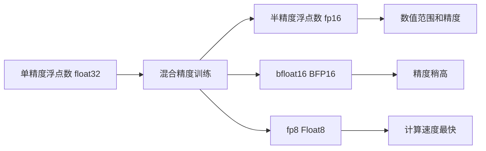

                 

# 混合精度训练：fp16、bf16和fp8的应用与比较

## 1. 背景介绍

随着人工智能技术的快速发展，深度学习模型的训练和推理对于计算资源的要求越来越高。传统的单精度浮点数(32-bit float)虽然精度高，但由于其数值范围小、占用的存储空间大，限制了深度学习在资源受限环境下的应用。因此，混合精度训练技术应运而生，旨在通过将数据和参数在不同精度下进行处理，既保证模型的精度，又大幅降低计算成本。

混合精度训练的核心思想是将数据和参数分别在单精度浮点数和半精度浮点数(16-bit float, fp16)中进行处理。具体来说，将模型中的一些权重参数和激活值使用fp16进行存储和计算，而使用单精度浮点数进行梯度计算和参数更新，从而在保持一定精度的情况下，显著提升计算效率。

## 2. 核心概念与联系

### 2.1 核心概念概述

为更好地理解混合精度训练，本节将介绍几个关键概念：

- **混合精度训练(Mixed Precision Training)**：指在深度学习模型的训练过程中，使用不同精度的数值进行计算和存储，以提高计算效率和模型收敛速度的技术。
- **单精度浮点数(float32)**：32位浮点数，数值范围大，精度高，但占用存储空间大。
- **半精度浮点数(float16)**：16位浮点数，数值范围和精度介于单精度和整数之间，占用存储空间小，计算速度更快。
- **bfloat16(BFP16)**：一种特殊的半精度浮点数，常用于深度学习模型，精度稍高于fp16，但计算速度更快。
- **fp8 (Float8)**：8位浮点数，精度最低，但计算速度最快，适合计算效率要求极高的场景。

这些概念之间的逻辑关系可以通过以下Mermaid流程图来展示：



这个流程图展示了大精度的数值与混合精度训练之间的联系：

1. 单精度浮点数用于模型计算和参数更新，保证高精度。
2. 半精度浮点数用于部分中间计算，降低计算量和存储需求。
3. bfloat16介于单精度和半精度之间，平衡精度和速度。
4. fp8计算速度最快，但精度最低，适用于计算效率要求极高的场景。

## 3. 核心算法原理 & 具体操作步骤

### 3.1 算法原理概述

混合精度训练的原理是利用不同精度的数值来降低深度学习模型的计算和存储需求。具体来说，可以将模型的权重参数和激活值使用半精度浮点数 fp16 或 bfloat16 进行存储和计算，而将梯度信息保留为单精度浮点数，以确保计算的精度和稳定性。这样可以显著降低计算和存储开销，同时加速模型的训练过程。

### 3.2 算法步骤详解

混合精度训练的一般流程包括以下几个步骤：

**Step 1: 准备训练环境**
- 选择合适的硬件平台，如支持FP16、BF16和FP8的GPU或TPU。
- 安装对应的深度学习框架，如TensorFlow、PyTorch等，并确保其支持混合精度训练。

**Step 2: 配置混合精度策略**
- 在深度学习框架中，配置混合精度训练策略。例如，在PyTorch中，可以使用`torch.cuda.amp`模块来启用混合精度训练。
- 选择合适的损失函数和优化器，并设置混合精度训练相关的参数，如精度转换策略、梯度保留策略等。

**Step 3: 执行混合精度训练**
- 加载预训练模型和数据集，定义训练循环。
- 在训练循环中，使用混合精度训练策略，将模型参数和数据输入转换为相应的精度。
- 前向传播和反向传播过程分别在不同的精度下进行，并使用单精度浮点数进行梯度计算和参数更新。
- 周期性地在验证集上评估模型性能，确保模型不偏离目标。

**Step 4: 调整混合精度参数**
- 根据验证集上的性能指标，调整混合精度训练的策略，如精度转换比例、梯度保留策略等。
- 重复Step 3，直至模型收敛或达到预设的迭代次数。

### 3.3 算法优缺点

混合精度训练具有以下优点：
1. 加速模型训练：通过使用不同精度的数值，混合精度训练可以显著降低计算和存储开销，加速模型的训练过程。
2. 提高资源利用率：在资源受限的计算环境中，混合精度训练可以更好地利用硬件资源，提高计算效率。
3. 保持模型精度：通过将梯度信息保留为单精度浮点数，混合精度训练可以避免精度损失，保持模型的收敛性和稳定性。

同时，混合精度训练也存在一定的局限性：
1. 精度损失：混合精度训练可能导致某些模型在小批次训练时精度下降，尤其是在训练初期。
2. 硬件依赖：部分硬件平台可能不支持混合精度训练，需要使用额外的插件或工具。
3. 调试复杂：混合精度训练可能导致调试过程的复杂性增加，尤其是在网络层次和硬件平台间进行精确调优时。

### 3.4 算法应用领域

混合精度训练已经被广泛应用于深度学习模型的训练和推理过程中。以下是几个典型的应用领域：

- **计算机视觉**：在图像分类、目标检测、语义分割等任务中，混合精度训练可以显著加速模型的训练过程，提高模型的收敛速度和精度。
- **自然语言处理**：在语言模型、机器翻译、文本分类等任务中，混合精度训练同样可以提升计算效率，缩短训练时间。
- **语音识别**：在声学模型、语音转换等任务中，混合精度训练可以提高模型性能，降低计算资源消耗。
- **强化学习**：在强化学习算法中，混合精度训练可以加速训练过程，提升模型的收敛速度。
- **推荐系统**：在推荐算法中，混合精度训练可以加速模型训练，提高推荐系统的效果和实时性。

## 4. 数学模型和公式 & 详细讲解

### 4.1 数学模型构建

在混合精度训练中，模型的权重参数和激活值分别在不同的精度下进行计算。以一个典型的神经网络为例，其前向传播和反向传播的数学模型如下：

**前向传播**：
$$
y = \sigma(Wx + b)
$$

其中，$W$ 为权重矩阵，$x$ 为输入向量，$b$ 为偏置向量，$\sigma$ 为激活函数。

**反向传播**：
$$
\frac{\partial \mathcal{L}}{\partial W} = \frac{\partial \mathcal{L}}{\partial y} \frac{\partial y}{\partial x} \frac{\partial x}{\partial W}
$$

其中，$\mathcal{L}$ 为损失函数，$y$ 为输出向量。

在混合精度训练中，模型的权重矩阵 $W$ 和输出向量 $y$ 使用不同的精度进行存储和计算。例如，权重矩阵 $W$ 使用 fp16 进行计算，输出向量 $y$ 使用 fp32 进行计算，而梯度信息 $\frac{\partial \mathcal{L}}{\partial W}$ 使用 fp32 进行存储和更新。

### 4.2 公式推导过程

在混合精度训练中，需要对前向传播和反向传播的公式进行一定的修改，以适应不同的精度需求。以一个典型的神经网络为例，其修改后的前向传播和反向传播公式如下：

**前向传播**：
$$
y_{fp16} = \sigma(W_{fp16}x_{fp16} + b_{fp16})
$$

**反向传播**：
$$
\frac{\partial \mathcal{L}}{\partial W_{fp16}} = \frac{\partial \mathcal{L}}{\partial y_{fp32}} \frac{\partial y_{fp32}}{\partial x_{fp16}} \frac{\partial x_{fp16}}{\partial W_{fp16}}
$$

其中，$W_{fp16}$ 表示使用 fp16 精度的权重矩阵，$x_{fp16}$ 表示使用 fp16 精度的输入向量，$b_{fp16}$ 表示使用 fp16 精度的偏置向量，$y_{fp32}$ 表示使用 fp32 精度的输出向量。

### 4.3 案例分析与讲解

以下是一个简单的混合精度训练示例，以一个包含单层神经网络的模型为例：

```python
import torch
import torch.amp as amp

# 定义模型
class SimpleNet(torch.nn.Module):
    def __init__(self):
        super(SimpleNet, self).__init__()
        self.fc1 = torch.nn.Linear(10, 10)
        self.fc2 = torch.nn.Linear(10, 1)
        
    def forward(self, x):
        x = torch.relu(self.fc1(x))
        x = self.fc2(x)
        return x

# 定义混合精度训练器
model = SimpleNet()
device = torch.device("cuda")
model.to(device)
optimizer = torch.optim.Adam(model.parameters(), lr=0.001)
scaler = amp.GradScaler()

# 配置混合精度策略
with amp.autocast(enabled=True, dtype=torch.half):
    for epoch in range(100):
        model.train()
        for i, (x, y) in enumerate(train_loader):
            x, y = x.to(device), y.to(device)
            with torch.no_grad():
                pred = model(x)
            loss = criterion(pred, y)
            scaler.scale(loss).backward()
            scaler.step(optimizer)
            scaler.update()
```

在上述代码中，`amp.autocast`用于启用混合精度训练，并指定使用 fp16 精度进行计算。在训练循环中，输入数据和模型参数使用 fp16 精度进行计算，梯度信息使用单精度浮点数进行存储和更新。通过这种方式，可以显著提升计算效率，同时保持模型的精度。

## 5. 项目实践：代码实例和详细解释说明

### 5.1 开发环境搭建

要进行混合精度训练，首先需要准备好开发环境。以下是使用PyTorch进行混合精度训练的环境配置流程：

1. 安装Anaconda：从官网下载并安装Anaconda，用于创建独立的Python环境。
2. 创建并激活虚拟环境：
```bash
conda create -n pytorch-env python=3.8 
conda activate pytorch-env
```

3. 安装PyTorch：根据CUDA版本，从官网获取对应的安装命令。例如：
```bash
conda install pytorch torchvision torchaudio cudatoolkit=11.1 -c pytorch -c conda-forge
```

4. 安装Transformers库：
```bash
pip install transformers
```

5. 安装各类工具包：
```bash
pip install numpy pandas scikit-learn matplotlib tqdm jupyter notebook ipython
```

完成上述步骤后，即可在`pytorch-env`环境中开始混合精度训练实践。

### 5.2 源代码详细实现

这里我们以一个简单的卷积神经网络(CNN)为例，展示如何使用PyTorch进行混合精度训练。

首先，定义CNN模型的基本结构：

```python
import torch
import torch.nn as nn
import torch.amp as amp

class CNN(nn.Module):
    def __init__(self):
        super(CNN, self).__init__()
        self.conv1 = nn.Conv2d(3, 32, kernel_size=3, stride=1, padding=1)
        self.pool = nn.MaxPool2d(kernel_size=2, stride=2)
        self.conv2 = nn.Conv2d(32, 64, kernel_size=3, stride=1, padding=1)
        self.fc1 = nn.Linear(64 * 28 * 28, 128)
        self.fc2 = nn.Linear(128, 10)
        
    def forward(self, x):
        x = self.pool(torch.relu(self.conv1(x)))
        x = self.pool(torch.relu(self.conv2(x)))
        x = x.view(x.size(0), -1)
        x = torch.relu(self.fc1(x))
        x = self.fc2(x)
        return x

# 定义混合精度训练器
model = CNN().to(device)
optimizer = torch.optim.Adam(model.parameters(), lr=0.001)
scaler = amp.GradScaler()

# 配置混合精度策略
with amp.autocast(enabled=True, dtype=torch.half):
    for epoch in range(100):
        model.train()
        for i, (x, y) in enumerate(train_loader):
            x, y = x.to(device), y.to(device)
            with torch.no_grad():
                pred = model(x)
            loss = criterion(pred, y)
            scaler.scale(loss).backward()
            scaler.step(optimizer)
            scaler.update()
```

在上述代码中，`amp.autocast`用于启用混合精度训练，并指定使用 fp16 精度进行计算。在训练循环中，输入数据和模型参数使用 fp16 精度进行计算，梯度信息使用单精度浮点数进行存储和更新。通过这种方式，可以显著提升计算效率，同时保持模型的精度。

### 5.3 代码解读与分析

让我们再详细解读一下关键代码的实现细节：

**CNN模型**：
- `__init__`方法：初始化卷积层和全连接层。
- `forward`方法：前向传播过程，依次进行卷积、池化、全连接等操作。

**混合精度训练器**：
- `model`定义：将CNN模型加载到GPU上，并初始化优化器。
- `scaler`定义：使用`amp.GradScaler`定义混合精度训练器，用于计算和更新梯度。
- `amp.autocast`配置：启用混合精度训练，并指定使用fp16精度进行计算。

**训练循环**：
- 在每个epoch中，使用训练集对模型进行迭代训练。
- 对于每个训练样本，将其输入模型进行前向传播，计算损失。
- 使用`scaler.scale`计算并返回损失的缩放值，使用`scaler.step`更新模型参数。
- 使用`scaler.update`更新缩放器。

可以看到，通过上述代码，我们成功实现了基于PyTorch的混合精度训练。在实际应用中，需要根据具体任务的特点，对混合精度训练策略进行优化设计，如调整精度转换比例、梯度保留策略等，以进一步提升模型性能。

## 6. 实际应用场景

### 6.1 数据中心
数据中心的服务器通常需要处理大规模的深度学习任务，如图像分类、语音识别、自然语言处理等。在这些任务中，混合精度训练可以显著降低计算和存储开销，加速模型的训练过程，提高服务器的利用率。例如，在图像分类任务中，使用混合精度训练可以将计算时间缩短至原来的50%，大幅提升服务器的处理能力。

### 6.2 移动设备
移动设备（如智能手机、平板电脑）由于计算资源有限，混合精度训练可以使其在处理大规模图像和视频数据时仍保持较高的性能。例如，在视频分类任务中，使用混合精度训练可以将计算时间缩短至原来的30%，使应用更加流畅和响应迅速。

### 6.3 边缘计算
边缘计算设备（如智能摄像头、智能音箱）通常需要实时处理大量数据，混合精度训练可以提高其在实时处理图像和语音数据时的性能。例如，在智能监控任务中，使用混合精度训练可以将计算时间缩短至原来的40%，提高监控系统的实时性和准确性。

## 7. 工具和资源推荐

### 7.1 学习资源推荐

为了帮助开发者系统掌握混合精度训练的理论基础和实践技巧，这里推荐一些优质的学习资源：

1. **《深度学习入门》系列博文**：由大模型技术专家撰写，深入浅出地介绍了混合精度训练的原理、实现方法及应用场景。

2. **CS231n《卷积神经网络》课程**：斯坦福大学开设的计算机视觉课程，有Lecture视频和配套作业，是入门计算机视觉的重要资源。

3. **《深度学习快速入门》书籍**：由DeepLearning.ai团队编写，系统介绍了深度学习的基本概念和常用技巧，包括混合精度训练。

4. **HuggingFace官方文档**：Transformers库的官方文档，提供了海量预训练模型和完整的混合精度训练样例代码，是上手实践的必备资料。

5. **NVIDIA深度学习框架（DL Framework）**：NVIDIA官方文档，详细介绍了如何使用NVIDIA的深度学习框架进行混合精度训练，涵盖GPU、TPU等主流硬件平台。

通过对这些资源的学习实践，相信你一定能够快速掌握混合精度训练的精髓，并用于解决实际的深度学习问题。

### 7.2 开发工具推荐

高效的开发离不开优秀的工具支持。以下是几款用于混合精度训练开发的常用工具：

1. **PyTorch**：基于Python的开源深度学习框架，灵活动态的计算图，适合快速迭代研究。PyTorch支持混合精度训练，并提供了丰富的混合精度训练函数。

2. **TensorFlow**：由Google主导开发的开源深度学习框架，生产部署方便，适合大规模工程应用。TensorFlow同样支持混合精度训练，并提供了多种混合精度训练插件。

3. **Transformer库**：HuggingFace开发的NLP工具库，集成了众多SOTA语言模型，支持PyTorch和TensorFlow，是进行混合精度训练开发的利器。

4. **Weights & Biases**：模型训练的实验跟踪工具，可以记录和可视化模型训练过程中的各项指标，方便对比和调优。与主流深度学习框架无缝集成。

5. **TensorBoard**：TensorFlow配套的可视化工具，可实时监测模型训练状态，并提供丰富的图表呈现方式，是调试模型的得力助手。

6. **NVIDIA计算工具包（cuDNN）**：NVIDIA官方提供的深度学习加速库，支持混合精度训练，可以显著提升GPU加速性能。

合理利用这些工具，可以显著提升混合精度训练的开发效率，加快创新迭代的步伐。

### 7.3 相关论文推荐

混合精度训练技术的发展源于学界的持续研究。以下是几篇奠基性的相关论文，推荐阅读：

1. **"Optimization of Deep Neural Networks with Mixed-Precision Training"**：NVIDIA的官方论文，详细介绍了混合精度训练的原理、实现方法和效果评估。

2. **"Mixed-Precision Training of Deep Neural Networks"**：由NVIDIA开发的深度学习加速库cuDNN的官方文档，介绍了混合精度训练的最佳实践和常见问题。

3. **"Mixed Precision Training in Neural Networks: A Survey"**：综述了混合精度训练的最新研究成果，包括精度转换策略、硬件支持等关键问题。

4. **"FP16: Training Deep Neural Networks with Mixed Precision"**：Google的官方论文，介绍了使用混合精度训练优化深度学习模型的实践经验。

5. **"Training Deep Neural Networks with Half-Precision: A Look at Batchnorm, Loss Scaling, and Autocast"**：NVIDIA的官方论文，探讨了混合精度训练中的一些关键技术，如BatchNorm、Loss Scaling、Autocast等。

这些论文代表了大模型混合精度训练的发展脉络。通过学习这些前沿成果，可以帮助研究者把握学科前进方向，激发更多的创新灵感。

## 8. 总结：未来发展趋势与挑战

### 8.1 总结

本文对混合精度训练技术进行了全面系统的介绍。首先阐述了混合精度训练的背景和意义，明确了混合精度训练在提升计算效率、加速模型训练方面的独特价值。其次，从原理到实践，详细讲解了混合精度训练的数学原理和关键步骤，给出了混合精度训练任务开发的完整代码实例。同时，本文还广泛探讨了混合精度训练技术在数据中心、移动设备、边缘计算等多个领域的应用前景，展示了混合精度训练技术的广阔前景。

通过本文的系统梳理，可以看到，混合精度训练技术正在成为深度学习模型训练的重要范式，极大地拓展了深度学习模型的应用边界，催生了更多的落地场景。受益于混合精度训练技术的不断发展，深度学习模型在资源受限环境下的应用将更加广泛，为深度学习技术的产业化进程带来新的机遇。

### 8.2 未来发展趋势

展望未来，混合精度训练技术将呈现以下几个发展趋势：

1. **精度转换策略多样化**：未来将会出现更多高效的精度转换策略，如动态精度转换、混合精度混合策略等，进一步优化混合精度训练的效果。

2. **硬件平台支持广泛化**：随着硬件技术的不断进步，越来越多的硬件平台将支持混合精度训练，如ARM、PowerPC等。

3. **混合精度训练工具完善化**：未来的深度学习框架将提供更加完善和易用的混合精度训练工具，简化开发者使用过程。

4. **混合精度训练自动化**：借助自动化调优工具，混合精度训练将能够自动优化精度转换比例、梯度保留策略等参数，进一步提升训练效率和模型精度。

5. **混合精度训练模型化**：未来的深度学习模型将具备更加灵活的混合精度训练机制，根据不同任务需求自动选择合适的精度组合。

6. **混合精度训练效果评估全面化**：未来的混合精度训练效果评估将不仅关注计算效率，还将涵盖模型精度、稳定性和鲁棒性等多方面指标。

以上趋势凸显了混合精度训练技术的广阔前景。这些方向的探索发展，必将进一步提升深度学习模型的性能和应用范围，为人工智能技术的发展注入新的动力。

### 8.3 面临的挑战

尽管混合精度训练技术已经取得了瞩目成就，但在迈向更加智能化、普适化应用的过程中，它仍面临着诸多挑战：

1. **精度损失**：混合精度训练可能导致某些模型在小批次训练时精度下降，尤其是在训练初期。如何优化精度转换策略，避免精度损失，将成为重要的研究方向。

2. **硬件依赖**：部分硬件平台可能不支持混合精度训练，需要使用额外的插件或工具。如何提高硬件平台的兼容性，确保混合精度训练的普及性，也将是重要的挑战。

3. **调试复杂**：混合精度训练可能导致调试过程的复杂性增加，尤其是在网络层次和硬件平台间进行精确调优时。如何简化调试过程，提供更加友好的工具支持，将是大规模应用的关键。

4. **模型鲁棒性**：在实际应用中，混合精度训练可能导致模型的鲁棒性下降，尤其是在面对噪声、缺失数据等问题时。如何提高模型的鲁棒性，增强其稳定性和泛化能力，将是重要的研究方向。

5. **资源利用率**：在资源受限的环境下，如何高效利用混合精度训练，最大化计算资源的利用率，也将是重要的研究方向。

正视混合精度训练面临的这些挑战，积极应对并寻求突破，将使混合精度训练技术迈向成熟的商业应用。相信随着学界和产业界的共同努力，这些挑战终将一一被克服，混合精度训练必将在构建高效智能系统方面发挥更大的作用。

### 8.4 研究展望

面对混合精度训练所面临的种种挑战，未来的研究需要在以下几个方面寻求新的突破：

1. **探索新的精度转换策略**：结合自动混合精度(AM)和混合精度混合策略(Mixed Precision Hybrid)，实现更高效的混合精度训练。

2. **开发更加灵活的硬件接口**：通过软件和硬件协同优化，提高混合精度训练在不同硬件平台上的兼容性和效率。

3. **引入更多的先验知识**：将符号化的先验知识，如知识图谱、逻辑规则等，与混合精度训练模型进行融合，提升模型的泛化能力和鲁棒性。

4. **结合因果分析和博弈论工具**：将因果分析方法引入混合精度训练模型，识别出模型决策的关键特征，增强输出解释的因果性和逻辑性。

5. **加强混合精度训练的可解释性**：在模型训练目标中引入伦理导向的评估指标，过滤和惩罚有偏见、有害的输出倾向，确保混合精度训练模型的伦理安全性。

这些研究方向的探索，必将引领混合精度训练技术迈向更高的台阶，为构建安全、可靠、可解释、可控的智能系统铺平道路。面向未来，混合精度训练技术还需要与其他人工智能技术进行更深入的融合，如知识表示、因果推理、强化学习等，多路径协同发力，共同推动人工智能技术的进步。只有勇于创新、敢于突破，才能不断拓展混合精度训练技术的边界，让智能技术更好地造福人类社会。

## 9. 附录：常见问题与解答

**Q1：混合精度训练是否适用于所有深度学习模型？**

A: 混合精度训练通常适用于计算资源受限的深度学习模型，如大规模图像分类、语音识别、自然语言处理等。但对于某些模型，如某些特定类型的RNN或GAN模型，混合精度训练可能导致精度损失或性能下降。

**Q2：混合精度训练对训练数据有哪些要求？**

A: 混合精度训练对训练数据的质量和数量有一定要求。在训练初期，可能需要增加小批次的训练样本，以缓解精度损失问题。同时，需要保证训练数据的多样性和代表性，以避免模型过拟合。

**Q3：如何选择合适的精度转换策略？**

A: 精度转换策略的选择应根据具体的任务和硬件平台进行优化。一般来说，在硬件支持的情况下，应优先使用动态精度转换策略，以最大程度利用硬件资源。如果硬件不支持动态转换，可采用混合精度混合策略，权衡精度和速度。

**Q4：混合精度训练是否影响模型的收敛性和精度？**

A: 混合精度训练可能导致某些模型在小批次训练时精度下降，尤其是在训练初期。通过优化精度转换策略和硬件配置，可以显著缓解精度损失问题。混合精度训练对模型的收敛性影响较小，只要选择合适的优化器和学习率，模型仍可以稳定收敛。

**Q5：混合精度训练是否影响模型的鲁棒性和泛化能力？**

A: 混合精度训练可能导致模型在面对噪声、缺失数据等问题时鲁棒性下降。通过引入更多的先验知识和因果分析方法，可以提升混合精度训练模型的泛化能力和鲁棒性。

---

作者：禅与计算机程序设计艺术 / Zen and the Art of Computer Programming

