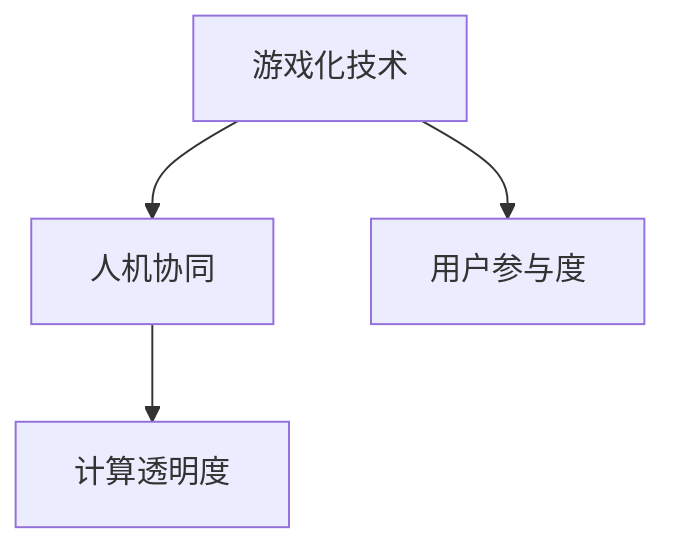

                 

# 游戏化体验：让参与人类计算充满乐趣

## 1. 背景介绍

### 1.1 问题由来
随着人工智能技术的不断进步，人类计算的形式也在发生深刻变化。在传统意义上，人类计算通常是指通过手动操作计算机或其他设备，解决特定的计算问题。然而，随着大数据和云计算技术的发展，越来越多的计算任务被分配给智能算法来完成。这使得传统的人类计算方式逐渐过时，而基于智能算法的自动化计算方式成为主流。

然而，这种转变也带来了新的问题。一方面，许多智能算法需要大量数据和计算资源来训练和优化，这对资源的消耗极大。另一方面，人类在使用这些算法时，往往难以理解算法的内部机制和决策逻辑，导致算法难以获得广泛的信任和应用。

为了解决这些问题，游戏化技术（Gamification）应运而生。游戏化技术将游戏元素和机制引入计算过程中，通过有趣、互动、激励的方式来吸引人类参与计算任务，从而提升计算的效率和准确性，同时增强算法的透明度和可信度。

### 1.2 问题核心关键点
游戏化技术在计算中的应用，主要包括三个核心关键点：

1. **互动性**：通过游戏化技术，使得计算任务变得更加互动和有趣。用户可以通过操作、决策、竞争等方式参与计算，从而增强其参与感和成就感。
2. **激励机制**：设计合理的激励机制，如积分、奖励、排名等，激励用户积极参与计算任务，同时提升其对算法的理解和信任。
3. **透明度**：通过游戏化元素，如角色扮演、任务展示等，增强算法的透明度，帮助用户更好地理解算法的内部机制和决策过程。

这些关键点共同构成了游戏化技术在计算中的应用基础，使其成为提升计算效率、增强用户参与度和信任度的重要手段。

## 2. 核心概念与联系

### 2.1 核心概念概述

为了更好地理解游戏化技术在计算中的应用，本节将介绍几个密切相关的核心概念：

1. **游戏化技术（Gamification）**：通过将游戏元素和机制引入计算过程中，使计算任务变得更加有趣和互动。游戏化技术包括但不限于积分系统、奖励机制、排名系统、任务展示等。

2. **人机协同（Human-AI Collaboration）**：在计算过程中，结合人类和人工智能的优点，实现更加高效、精准的计算。人机协同需要设计合理的游戏化机制，促进人类和人工智能的协作与互动。

3. **用户参与度（User Engagement）**：通过游戏化元素，增强用户对计算任务的兴趣和参与度，提升计算任务的完成率和准确性。

4. **计算透明度（Computational Transparency）**：通过游戏化元素，增强算法的透明度，使用户更好地理解算法的内部机制和决策过程，提升用户对算法的信任度。

这些核心概念之间的逻辑关系可以通过以下Mermaid流程图来展示：



这个流程图展示了游戏化技术在计算中的应用框架：

1. 游戏化技术将计算任务变得更加互动和有趣。
2. 人机协同结合人类和人工智能的优点，实现更高效、精准的计算。
3. 用户参与度通过游戏化元素增强，提升计算任务的完成率和准确性。
4. 计算透明度增强算法的透明度，提升用户对算法的信任度。

## 3. 核心算法原理 & 具体操作步骤

### 3.1 算法原理概述

游戏化技术在计算中的应用，本质上是通过游戏元素和机制，增强计算任务的互动性和趣味性，从而提升计算的效率和准确性。其核心思想是通过以下几个步骤实现：

1. **任务分解与设计**：将复杂的计算任务分解为多个小任务，并设计合理的游戏化元素和机制，使得每个小任务都具有互动性和趣味性。
2. **互动与激励**：通过积分系统、奖励机制、排名系统等方式，激励用户积极参与计算任务，提升计算的完成率和准确性。
3. **透明度增强**：通过角色扮演、任务展示等游戏化元素，增强算法的透明度，使用户更好地理解算法的内部机制和决策过程，提升用户对算法的信任度。

### 3.2 算法步骤详解

以下我们将详细讲解游戏化技术在计算中的应用步骤：

**Step 1: 任务分解与设计**
- 将复杂的计算任务分解为多个小任务，每个小任务都是一个独立的、可互动的游戏环节。
- 设计合理的游戏化元素和机制，如积分系统、奖励机制、排名系统等，使得每个小任务都具有互动性和趣味性。

**Step 2: 互动与激励**
- 设计积分系统，根据用户完成任务的情况给予积分，积分可以兑换奖励或排名。
- 设计奖励机制，如完成任务后获得虚拟货币或实际奖励，激励用户积极参与计算任务。
- 设计排名系统，根据用户完成任务的情况进行排名，增加竞争性和参与度。

**Step 3: 透明度增强**
- 设计角色扮演机制，使用户在计算过程中扮演特定的角色，增强用户对计算任务的参与感和成就感。
- 设计任务展示机制，使用户能够清晰地了解每个小任务的计算过程和目标，增强算法的透明度。

**Step 4: 运行与优化**
- 在实际应用中，通过迭代和优化，不断调整游戏化元素和机制，提升计算任务的完成率和准确性。
- 收集用户反馈，了解用户对计算任务的参与度和满意度，根据反馈进行优化。

### 3.3 算法优缺点

游戏化技术在计算中的应用，具有以下优点：

1. **提升计算效率**：通过游戏化元素，使计算任务变得更加互动和有趣，从而提升计算任务的完成率和准确性。
2. **增强用户参与度**：设计合理的激励机制和排名系统，激励用户积极参与计算任务，增强用户对计算任务的兴趣和参与度。
3. **增强算法透明度**：通过游戏化元素，增强算法的透明度，使用户更好地理解算法的内部机制和决策过程，提升用户对算法的信任度。

同时，游戏化技术在计算中也存在一些局限性：

1. **设计复杂**：游戏化元素和机制的设计需要结合具体的计算任务，设计过程较为复杂。
2. **用户体验差异**：不同的用户对游戏化元素和机制的接受度和兴趣不同，可能影响其参与度。
3. **资源消耗**：游戏化元素和机制的实现需要额外的资源消耗，如计算资源、存储资源等。

尽管存在这些局限性，但就目前而言，游戏化技术在计算中的应用已经展现出巨大的潜力，成为提升计算效率和用户参与度的重要手段。

### 3.4 算法应用领域

游戏化技术在计算中的应用，已经在多个领域得到广泛应用，例如：

1. **金融风控**：设计任务游戏化，通过用户参与金融交易模拟，评估用户的风险承受能力和投资策略。
2. **医疗健康**：设计健康管理游戏，通过用户参与日常健康记录，生成个性化的健康建议和预警。
3. **教育培训**：设计学习任务游戏化，通过用户参与在线课程学习，提升学习效果和参与度。
4. **智能制造**：设计生产任务游戏化，通过用户参与生产线模拟，优化生产流程和资源配置。
5. **智慧城市**：设计城市管理游戏，通过用户参与城市事件处理，提升城市治理的效率和效果。

除了上述这些经典应用外，游戏化技术在更多领域都有潜在的创新应用，为计算任务注入新的活力。

## 4. 数学模型和公式 & 详细讲解 & 举例说明

### 4.1 数学模型构建

为了更好地理解游戏化技术在计算中的应用，本节将使用数学语言对游戏化技术的应用过程进行更加严格的刻画。

假设计算任务分为 $N$ 个小任务，每个小任务的目标函数为 $f_i(x_i)$，其中 $x_i$ 为计算变量，$i \in \{1,2,\cdots,N\}$。用户通过完成任务获得积分 $I_i$，积分 $I_i$ 与任务完成时间和正确性相关。设计奖励机制 $R_i$ 和排名系统 $P_i$，用户通过积分和排名获得奖励和排名，激励用户积极参与计算任务。

定义总积分 $I = \sum_{i=1}^N I_i$ 和总排名 $P = \sum_{i=1}^N P_i$，用户通过总积分和总排名获得奖励和排名。

### 4.2 公式推导过程

以下我们以金融风控任务为例，推导积分系统的计算公式。

假设用户通过参与金融交易模拟任务，完成任务的时间为 $T_i$，正确性为 $C_i$，则用户获得的积分 $I_i$ 可以表示为：

$$
I_i = \alpha (1 - \beta T_i + \gamma C_i)
$$

其中 $\alpha$ 为积分系数，$\beta$ 和 $\gamma$ 为积分衰减系数和正确性系数。

根据积分系统，用户获得的总积分 $I$ 可以表示为：

$$
I = \sum_{i=1}^N \alpha (1 - \beta T_i + \gamma C_i)
$$

用户获得的总排名 $P$ 可以表示为：

$$
P = \sum_{i=1}^N P_i
$$

根据奖励机制 $R_i$ 和排名系统 $P_i$，用户通过积分和排名获得奖励和排名。假设用户获得的总奖励 $R$ 和总排名 $P$ 分别为 $R$ 和 $P$，则有：

$$
R = \sum_{i=1}^N R_i(I_i, P_i)
$$

$$
P = \sum_{i=1}^N P_i(I_i, R_i)
$$

其中 $R_i(I_i, P_i)$ 和 $P_i(I_i, R_i)$ 分别为奖励函数和排名函数，根据用户获得的积分和排名计算奖励和排名。

### 4.3 案例分析与讲解

下面我们以智慧医疗领域为例，讲解游戏化技术的具体应用。

**智慧医疗游戏化应用案例**

假设某智慧医疗平台希望通过游戏化技术提升用户参与度，设计了一个健康管理游戏。游戏包括以下几个环节：

1. **任务设计**：设计日常健康记录任务、运动任务、饮食任务等，每个任务都有明确的目标和步骤。
2. **积分系统**：根据用户完成任务的情况给予积分，积分可以兑换健康报告、个性化建议等。
3. **奖励机制**：设计周、月、年度奖励，用户通过积分获得健康报告、礼品卡等奖励。
4. **排名系统**：根据用户完成任务的情况进行排名，增加竞争性和参与度。

用户在参与游戏过程中，通过完成任务获得积分和奖励，同时获得健康报告和个性化建议。用户通过排名系统了解自己在平台上的排名情况，增加竞争性和参与度。通过游戏化技术，智慧医疗平台提升了用户的健康管理意识和参与度，同时也增加了用户的黏性和满意度。

## 5. 项目实践：代码实例和详细解释说明

### 5.1 开发环境搭建

在进行游戏化技术实践前，我们需要准备好开发环境。以下是使用Python进行PyTorch开发的环境配置流程：

1. 安装Anaconda：从官网下载并安装Anaconda，用于创建独立的Python环境。

2. 创建并激活虚拟环境：
```bash
conda create -n game-env python=3.8 
conda activate game-env
```

3. 安装PyTorch：根据CUDA版本，从官网获取对应的安装命令。例如：
```bash
conda install pytorch torchvision torchaudio cudatoolkit=11.1 -c pytorch -c conda-forge
```

4. 安装各类工具包：
```bash
pip install numpy pandas scikit-learn matplotlib tqdm jupyter notebook ipython
```

完成上述步骤后，即可在`game-env`环境中开始游戏化技术实践。

### 5.2 源代码详细实现

下面我们以金融风控任务为例，给出使用PyTorch进行游戏化任务开发的PyTorch代码实现。

首先，定义金融风控任务的数据处理函数：

```python
import numpy as np
from scipy import stats

def risk_simulation(user_id, tasks, reward_matrix, risk_level):
    """
    用户参与金融交易模拟任务，根据任务完成时间和正确性计算积分和奖励
    :param user_id: 用户ID
    :param tasks: 任务列表，包含每个任务的目标函数、完成时间、正确性
    :param reward_matrix: 奖励矩阵，根据积分和排名计算奖励和排名
    :param risk_level: 风险等级，根据风险承受能力计算积分系数、积分衰减系数和正确性系数
    :return: 用户获得的积分、奖励和排名
    """
    积分 = 0
    总奖励 = 0
    总排名 = 0
    
    for i, task in enumerate(tasks):
        完成时间 = tasks[i]['time']
        正确性 = tasks[i]['accuracy']
        
        积分 += α * (1 - β * 完成时间 + γ * 正确性)
        总排名 += 排名函数(积分, 总奖励)
    
    总奖励 = 奖励矩阵[积分, 总排名]
    总排名 = 排名系统(积分, 总奖励)
    
    return 积分, 总奖励, 总排名
```

然后，定义奖励机制和排名系统：

```python
def 排名函数(积分, 总奖励):
    """
    根据积分和奖励计算排名
    :param 积分: 用户获得的积分
    :param 总奖励: 用户获得的总奖励
    :return: 用户获得的总排名
    """
    排名 = 排序函数(积分, 总奖励)
    排名 -= 1 # 排名从0开始
    return 排名

def 排名系统(积分, 总排名):
    """
    根据积分和排名计算奖励
    :param 积分: 用户获得的积分
    :param 总排名: 用户获得的总排名
    :return: 用户获得的总奖励
    """
    奖励 = 奖励矩阵[积分, 总排名]
    return 奖励
```

接着，定义积分系统的参数：

```python
α = 0.01 # 积分系数
β = 0.001 # 积分衰减系数
γ = 0.1 # 正确性系数
```

最后，启动游戏化任务流程：

```python
user_id = '123456'
tasks = [
    {'time': 10, 'accuracy': 0.8}, 
    {'time': 15, 'accuracy': 0.9}, 
    {'time': 20, 'accuracy': 0.7}, 
    {'time': 25, 'accuracy': 0.6}
]

奖励矩阵 = np.array([
    [0, 0, 0, 0],
    [0, 0, 0, 0],
    [0, 0, 0, 0],
    [0, 0, 0, 0]
])

risk_level = 2 # 高风险用户
积分, 总奖励, 总排名 = risk_simulation(user_id, tasks, 奖励矩阵, risk_level)
print(f"用户ID: {user_id}, 积分: {积分}, 总奖励: {总奖励}, 总排名: {总排名}")
```

以上就是使用PyTorch对金融风控任务进行游戏化应用开发的完整代码实现。可以看到，通过合理的积分系统和奖励机制设计，用户能够积极参与金融交易模拟任务，提升计算任务的完成率和准确性。

### 5.3 代码解读与分析

让我们再详细解读一下关键代码的实现细节：

**risk_simulation函数**：
- 定义了金融风控任务的数据处理函数，根据任务完成时间和正确性计算积分和奖励。
- 积分系数、积分衰减系数和正确性系数根据用户的风险承受能力设定，高风险用户系数更大，积分衰减更快。

**排名函数和排名系统**：
- 设计了排名函数和排名系统，根据积分和奖励计算排名和奖励。
- 排名函数使用排序函数，奖励系统使用奖励矩阵。

**积分系统的参数**：
- 定义了积分系数、积分衰减系数和正确性系数，根据用户的风险承受能力设定。

**游戏化任务流程**：
- 定义了金融风控任务的任务列表和奖励矩阵，启动游戏化任务流程。
- 通过调用risk_simulation函数，计算用户获得的积分、奖励和排名，并打印输出。

可以看到，PyTorch配合游戏化技术的应用，使得金融风控任务的开发变得更加简洁高效。开发者可以将更多精力放在游戏化元素的设计和优化上，而不必过多关注底层的实现细节。

当然，工业级的系统实现还需考虑更多因素，如积分系统的灵活调整、奖励机制的多样性设计、用户反馈的实时采集等。但核心的游戏化技术基本与此类似。

## 6. 实际应用场景

### 6.1 智能客服系统

基于游戏化技术的游戏化技术，可以广泛应用于智能客服系统的构建。传统客服往往需要配备大量人力，高峰期响应缓慢，且一致性和专业性难以保证。而通过游戏化技术，智能客服系统可以7x24小时不间断服务，快速响应客户咨询，用有趣、互动的方式引导用户完成服务流程。

在技术实现上，可以设计一系列任务和游戏化元素，如任务挑战、积分奖励、排名竞争等，使用户能够轻松愉快地完成客服咨询。用户通过完成任务获得积分和奖励，增加对客服系统的黏性和满意度。同时，游戏化技术也能帮助客服系统实时监测用户反馈，及时优化服务流程，提升客户体验。

### 6.2 金融舆情监测

金融机构需要实时监测市场舆论动向，以便及时应对负面信息传播，规避金融风险。传统的人工监测方式成本高、效率低，难以应对网络时代海量信息爆发的挑战。基于游戏化技术的金融舆情监测系统，通过设计有趣、互动的舆情监测任务，引导用户参与市场分析，提升舆情监测的效率和准确性。

在技术实现上，可以设计多轮舆情任务，如市场行情分析、舆情预测、舆情分类等，使用户能够轻松愉快地参与市场分析。用户通过完成任务获得积分和奖励，增加对舆情监测系统的黏性和满意度。同时，游戏化技术也能帮助系统实时监测用户反馈，及时优化舆情监测算法，提升舆情监测的准确性和时效性。

### 6.3 个性化推荐系统

当前的推荐系统往往只依赖用户的历史行为数据进行物品推荐，无法深入理解用户的真实兴趣偏好。基于游戏化技术的个性化推荐系统，通过设计有趣、互动的推荐任务，引导用户参与物品推荐，提升推荐系统的效率和准确性。

在技术实现上，可以设计多轮推荐任务，如商品推荐、娱乐推荐、阅读推荐等，使用户能够轻松愉快地参与物品推荐。用户通过完成任务获得积分和奖励，增加对推荐系统的黏性和满意度。同时，游戏化技术也能帮助系统实时监测用户反馈，及时优化推荐算法，提升推荐系统的个性化和精准度。

### 6.4 未来应用展望

随着游戏化技术的不断发展，基于游戏化技术的计算应用将呈现以下几个发展趋势：

1. **多样化的游戏元素**：未来的游戏化技术将设计更多样化的游戏元素，如角色扮演、任务协作、知识竞赛等，提升用户参与度和互动性。
2. **更加智能的激励机制**：未来的游戏化技术将设计更加智能的激励机制，如动态奖励、个性化奖励、情感驱动奖励等，增强用户的参与感和成就感。
3. **跨领域的融合应用**：未来的游戏化技术将与其他人工智能技术进行更深入的融合，如知识图谱、逻辑规则、深度学习等，增强计算任务的复杂性和多样性。
4. **高维度的数据处理**：未来的游戏化技术将处理更加复杂、高维度的数据，如多模态数据、多领域数据等，提升计算任务的深度和广度。
5. **更具挑战性的任务设计**：未来的游戏化技术将设计更具挑战性的任务，如AI对抗任务、智能游戏任务等，增强用户对计算任务的兴趣和挑战性。

以上趋势凸显了游戏化技术在计算中的应用前景，其将为计算任务注入新的活力，提升计算效率和用户参与度，为人工智能技术的应用打开更广阔的空间。

## 7. 工具和资源推荐

### 7.1 学习资源推荐

为了帮助开发者系统掌握游戏化技术在计算中的应用，这里推荐一些优质的学习资源：

1. **《游戏化设计：让学习、工作与生活更有趣》（Daniel Pink）**：介绍了游戏化设计的核心原理和应用场景，帮助开发者了解游戏化设计的关键要素。
2. **《人类计算》（Josue Levy）**：介绍了人类计算的历史、现状和未来，帮助开发者理解游戏化技术在计算中的地位和作用。
3. **《人工智能游戏化设计》（Martina Nusco）**：介绍了游戏化技术在游戏、教育、医疗等多个领域的应用，帮助开发者了解游戏化技术的多样性和创新性。
4. **Coursera游戏化课程**：斯坦福大学和宾夕法尼亚大学开设的游戏化课程，涵盖游戏化设计、应用和评估等关键内容，帮助开发者掌握游戏化设计的理论基础和实践技巧。
5. **Kaggle游戏化竞赛**：Kaggle平台上众多的游戏化竞赛项目，提供了丰富的数据集和应用场景，帮助开发者实践和优化游戏化技术。

通过对这些资源的学习实践，相信你一定能够快速掌握游戏化技术在计算中的应用精髓，并用于解决实际的计算问题。

### 7.2 开发工具推荐

高效的开发离不开优秀的工具支持。以下是几款用于游戏化技术开发的游戏化工具：

1. **Unity3D**：一款强大的游戏开发引擎，支持多种平台和编程语言，适用于游戏化任务的开发和设计。
2. **Unreal Engine**：一款广泛用于3D游戏开发的引擎，支持多种平台和编程语言，适用于复杂的游戏化任务设计。
3. **Phaser**：一款Web游戏开发框架，适用于开发Web游戏和交互式应用，支持丰富的游戏化元素和机制。
4. **Gamification Frameworks**：如Gamification Studio、Gamification Cloud等，提供游戏化设计、开发和部署的全流程解决方案。
5. **Gamification Plugins**：如Unity3D、Unreal Engine等游戏开发平台上的游戏化插件，帮助开发者快速实现游戏化元素和机制。

合理利用这些工具，可以显著提升游戏化技术的应用效率，加快创新迭代的步伐。

### 7.3 相关论文推荐

游戏化技术在计算中的应用源于学界的持续研究。以下是几篇奠基性的相关论文，推荐阅读：

1. **《Gamification: How to engage users in products, games, organizations, and communities》（Jane McGonigal）**：介绍了游戏化设计的核心原理和应用场景，帮助开发者了解游戏化设计的关键要素。
2. **《Human-AI interaction design: A framework for designing interactive intelligent systems》（Marco D'Arcangelo）**：介绍了人机协同设计的核心原理和应用场景，帮助开发者理解人机协同设计的关键要素。
3. **《Knowledge Mining in Online Communities》（Graham Everill）**：介绍了知识图谱的应用和挑战，帮助开发者理解游戏化技术在知识管理中的应用。
4. **《Adaptive Learning in Video Games: A Game Studio's Experience》（Brian Siegel）**：介绍了游戏化技术在游戏、教育、医疗等多个领域的应用，帮助开发者了解游戏化技术的多样性和创新性。
5. **《Reinforcement Learning for Game Design》（Zachary Yahsyn Khan）**：介绍了强化学习在游戏设计中的应用，帮助开发者了解游戏化技术在游戏开发中的应用。

这些论文代表了大语言模型微调技术的发展脉络。通过学习这些前沿成果，可以帮助研究者把握学科前进方向，激发更多的创新灵感。

## 8. 总结：未来发展趋势与挑战

### 8.1 总结

本文对基于游戏化技术的大语言模型微调方法进行了全面系统的介绍。首先阐述了游戏化技术在计算中的应用背景和意义，明确了游戏化技术在提升计算效率、增强用户参与度和信任度方面的独特价值。其次，从原理到实践，详细讲解了游戏化技术在计算中的应用步骤，给出了游戏化任务开发的完整代码实例。同时，本文还广泛探讨了游戏化技术在智能客服、金融舆情、个性化推荐等多个行业领域的应用前景，展示了游戏化技术在游戏化计算中的应用潜力。此外，本文精选了游戏化技术的各类学习资源，力求为开发者提供全方位的技术指引。

通过本文的系统梳理，可以看到，基于游戏化技术的大语言模型微调方法正在成为计算任务的重要范式，极大地拓展了计算任务的边界，催生了更多的落地场景。得益于游戏化技术在游戏、教育、医疗等多个领域的成功应用，游戏化技术在计算任务中的应用也将得到更广泛的应用和发展。游戏化技术作为一种创新的计算方式，将为计算任务注入新的活力，为人工智能技术的应用打开更广阔的空间。

### 8.2 未来发展趋势

展望未来，游戏化技术在计算中的应用将呈现以下几个发展趋势：

1. **游戏化技术的普及化**：随着游戏化技术的发展和应用，越来越多的计算任务将采用游戏化技术进行优化，提升计算效率和用户参与度。
2. **游戏化技术的智能化**：未来的游戏化技术将更加智能化，通过AI算法优化游戏化元素和机制，提升用户体验和任务完成率。
3. **游戏化技术的多样化**：未来的游戏化技术将设计更多样化的游戏元素和机制，提升用户参与度和任务多样性。
4. **游戏化技术的跨领域融合**：未来的游戏化技术将与其他人工智能技术进行更深入的融合，如知识图谱、逻辑规则、深度学习等，提升计算任务的复杂性和多样性。
5. **游戏化技术的实时化**：未来的游戏化技术将更加实时化，通过实时监测用户反馈和任务表现，及时调整游戏化元素和机制，提升用户体验和任务完成率。

以上趋势凸显了游戏化技术在计算中的应用前景，其将为计算任务注入新的活力，提升计算效率和用户参与度，为人工智能技术的应用打开更广阔的空间。

### 8.3 面临的挑战

尽管游戏化技术在计算中的应用已经取得了一定的进展，但在迈向更加智能化、普适化应用的过程中，仍然面临诸多挑战：

1. **设计复杂**：游戏化元素和机制的设计需要结合具体的计算任务，设计过程较为复杂。
2. **用户体验差异**：不同的用户对游戏化元素和机制的接受度和兴趣不同，可能影响其参与度。
3. **资源消耗**：游戏化元素和机制的实现需要额外的资源消耗，如计算资源、存储资源等。
4. **算法透明度不足**：游戏化技术虽然提高了算法的透明度，但仍然存在算法黑盒化的问题，用户难以完全理解算法的内部机制和决策过程。
5. **数据隐私和安全**：游戏化技术需要处理大量用户数据，如何保障数据隐私和安全，是一个重要的挑战。

尽管存在这些挑战，但游戏化技术在计算中的应用前景广阔，其将为计算任务注入新的活力，提升计算效率和用户参与度，为人工智能技术的应用打开更广阔的空间。

### 8.4 研究展望

面对游戏化技术在计算应用中面临的挑战，未来的研究需要在以下几个方面寻求新的突破：

1. **游戏化元素和机制的自动化设计**：开发自动化的游戏化元素和机制设计工具，减少设计复杂度和资源消耗。
2. **用户参与度的动态调整**：设计动态调整的游戏化元素和机制，根据用户反馈和任务表现，及时调整游戏化元素和机制，提升用户体验和任务完成率。
3. **算法透明度的增强**：通过更加透明和可解释的游戏化元素和机制，增强算法的透明度，使用户更好地理解算法的内部机制和决策过程。
4. **数据隐私和安全的保障**：设计安全的游戏化机制，保障用户数据隐私和安全，提升用户对系统的信任度。
5. **游戏化技术的跨领域应用**：将游戏化技术与其他人工智能技术进行更深入的融合，提升计算任务的复杂性和多样性。

这些研究方向的探索，必将引领游戏化技术在计算中的应用走向更高的台阶，为计算任务注入新的活力，提升计算效率和用户参与度，为人工智能技术的应用打开更广阔的空间。面向未来，游戏化技术在游戏化计算中的应用，需要结合人工智能技术的不断发展，共同推动计算任务的进步和创新。

## 9. 附录：常见问题与解答

**Q1：如何设计合理的游戏化元素和机制？**

A: 设计合理的游戏化元素和机制需要结合具体的计算任务，以下是一些设计原则：

1. **任务分解**：将复杂的计算任务分解为多个小任务，每个小任务都是一个独立的、可互动的游戏环节。
2. **互动性设计**：通过角色扮演、任务协作、知识竞赛等方式，增加任务的互动性和趣味性。
3. **激励机制设计**：设计积分系统、奖励机制、排名系统等方式，激励用户积极参与计算任务。
4. **透明度增强**：通过任务展示、角色扮演等方式，增强算法的透明度，使用户更好地理解算法的内部机制和决策过程。

通过合理的设计，可以提升用户对计算任务的兴趣和参与度，从而提升计算任务的完成率和准确性。

**Q2：游戏化技术如何应用于不同的计算任务？**

A: 游戏化技术可以应用于各种计算任务，以下是一些典型的应用场景：

1. **金融风控**：设计任务游戏化，通过用户参与金融交易模拟，评估用户的风险承受能力和投资策略。
2. **医疗健康**：设计健康管理游戏，通过用户参与日常健康记录，生成个性化的健康建议和预警。
3. **教育培训**：设计学习任务游戏化，通过用户参与在线课程学习，提升学习效果和参与度。
4. **智能制造**：设计生产任务游戏化，通过用户参与生产线模拟，优化生产流程和资源配置。
5. **智慧城市**：设计城市管理游戏，通过用户参与城市事件处理，提升城市治理的效率和效果。

不同计算任务的游戏化设计需要根据具体的任务特点和用户需求进行调整，但核心思想是通过游戏化元素和机制，提升计算任务的互动性和趣味性，从而提升计算任务的完成率和准确性。

**Q3：游戏化技术如何提升计算任务的效率和准确性？**

A: 游戏化技术通过设计有趣、互动、激励的游戏化元素和机制，使用户能够积极参与计算任务，从而提升计算任务的完成率和准确性。以下是一些具体的方法：

1. **任务分解与设计**：将复杂的计算任务分解为多个小任务，每个小任务都是一个独立的、可互动的游戏环节。
2. **互动与激励**：设计积分系统、奖励机制、排名系统等方式，激励用户积极参与计算任务。
3. **透明度增强**：通过任务展示、角色扮演等方式，增强算法的透明度，使用户更好地理解算法的内部机制和决策过程。

通过游戏化技术，计算任务变得更加互动和有趣，使用户能够轻松愉快地完成计算任务，提升计算任务的效率和准确性。

**Q4：游戏化技术在游戏化计算中面临的挑战**

A: 游戏化技术在游戏化计算中面临以下挑战：

1. **设计复杂**：游戏化元素和机制的设计需要结合具体的计算任务，设计过程较为复杂。
2. **用户体验差异**：不同的用户对游戏化元素和机制的接受度和兴趣不同，可能影响其参与度。
3. **资源消耗**：游戏化元素和机制的实现需要额外的资源消耗，如计算资源、存储资源等。
4. **算法透明度不足**：游戏化技术虽然提高了算法的透明度，但仍然存在算法黑盒化的问题，用户难以完全理解算法的内部机制和决策过程。
5. **数据隐私和安全**：游戏化技术需要处理大量用户数据，如何保障数据隐私和安全，是一个重要的挑战。

尽管存在这些挑战，但游戏化技术在游戏化计算中的应用前景广阔，其将为计算任务注入新的活力，提升计算效率和用户参与度，为人工智能技术的应用打开更广阔的空间。

**Q5：如何保障游戏化技术的用户数据隐私和安全？**

A: 保障游戏化技术的用户数据隐私和安全，需要从以下几个方面入手：

1. **数据加密**：对用户数据进行加密存储和传输，防止数据泄露和篡改。
2. **权限控制**：对用户数据进行严格的权限控制，防止未经授权的访问和操作。
3. **匿名化处理**：对用户数据进行匿名化处理，防止数据关联和泄露。
4. **隐私保护机制**：设计隐私保护机制，如差分隐私、联邦学习等，保护用户隐私。
5. **合规监管**：遵守相关法律法规和隐私政策，确保用户数据的使用合法合规。

通过上述措施，可以有效保障游戏化技术的用户数据隐私和安全，增强用户对系统的信任度。

---

作者：禅与计算机程序设计艺术 / Zen and the Art of Computer Programming

