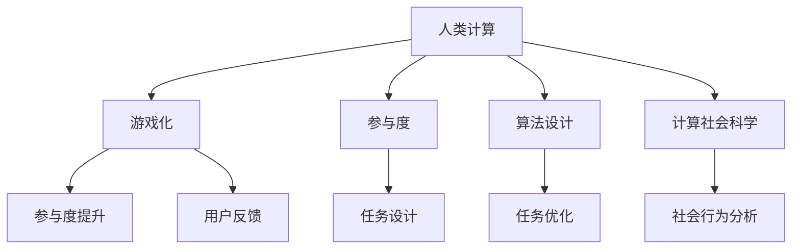

                 

# 游戏化参与：让参与人类计算妙趣横生

> 关键词：游戏化,人类计算,参与度,算法设计,计算社会科学

## 1. 背景介绍

### 1.1 问题由来
在数字化时代，计算资源的日益丰富为各行业带来了前所未有的便利，同时也对人类计算能力提出了更高的要求。然而，在计算机的强大计算力面前，人类的智慧似乎显得有些苍白。如何发挥人类计算的潜力，同时克服计算资源有限性，成为当下迫切需要解决的问题。

随着人工智能的兴起，一种全新的计算模式正在逐渐形成——**游戏化参与（Gamified Participation）**。该模式通过将计算任务融入游戏化流程中，激发用户参与计算的兴趣和积极性，从而实现有效且高效的人类计算。

### 1.2 问题核心关键点
游戏化参与的核心在于，如何将枯燥的计算任务转化为充满趣味和竞争的游戏过程，让计算参与者愿意在过程中投入时间、精力和智慧。具体而言，包括以下几个关键点：

1. **任务设计**：如何将计算任务与游戏元素（如任务、关卡、成就、排行榜等）结合，设计出既能完成计算任务，又能激发用户兴趣的游戏体验。
2. **用户反馈**：如何通过游戏化的奖励机制和实时反馈，增强用户的成就感和归属感。
3. **互动与协作**：如何在游戏中引入协作和竞争机制，鼓励用户之间的互动和知识共享。
4. **隐私与安全性**：如何在保护用户隐私和数据安全的前提下，保证计算任务的顺利完成。

## 2. 核心概念与联系

### 2.1 核心概念概述

为更好地理解游戏化参与的实现机制，本节将介绍几个关键概念：

- **人类计算（Human Computation）**：利用人类的智慧和计算能力解决复杂问题的一种计算方式。通过人类参与，弥补计算机计算的局限性，如对计算资源的需求和对复杂问题的处理能力。
- **游戏化（Gamification）**：通过将游戏元素（如积分、排行榜、成就等）融入非游戏场景中，增加用户参与和互动的动机。
- **参与度（Participation）**：用户在某个活动或项目中的参与程度，反映其在活动中投入的时间、精力和兴趣。
- **算法设计（Algorithm Design）**：针对特定问题设计高效、精确的算法，以实现计算任务的目标。
- **计算社会科学（Computational Social Science）**：通过计算和数据分析手段，研究人类社会行为和社会结构的模式，如网络分析、社交网络分析等。

这些概念之间的关系可以通过以下Mermaid流程图来展示：



这个流程图展示出各个概念之间的逻辑关系：

1. 人类计算是游戏化参与的基础，通过引入游戏元素，提升参与度。
2. 算法设计为计算任务提供解决方案，游戏化则通过任务优化和用户反馈增强参与度。
3. 计算社会科学用于分析社会行为模式，为游戏化设计提供理论指导。

## 3. 核心算法原理 & 具体操作步骤
### 3.1 算法原理概述

游戏化参与的核心在于，通过将计算任务与游戏化元素结合，创造一个既具有趣味性又能够高效完成任务的环境。该过程主要分为三个步骤：任务设计、用户反馈和互动协作。

### 3.2 算法步骤详解

**Step 1: 任务设计**
- **任务选择**：选择与目标计算任务相关的游戏元素，如任务、目标、挑战等。
- **规则定义**：设计任务完成的基本规则和条件，确保任务的完成度。
- **奖励机制**：设计任务完成的奖励机制，如积分、徽章、排行榜等，以增强用户的成就感和动力。

**Step 2: 用户反馈**
- **实时反馈**：在游戏过程中提供实时反馈，如任务进度、剩余时间、成就点等，让用户了解自己的当前状态和任务完成情况。
- **成就系统**：建立成就系统，根据用户完成任务的情况，发放成就徽章或奖励，增强用户的成就感和归属感。
- **排行榜**：通过排行榜展示用户成就，增强竞争性和激励性。

**Step 3: 互动协作**
- **协作机制**：设计协作机制，鼓励用户之间的互动和知识共享，如团队合作、在线讨论等。
- **竞争机制**：引入竞争机制，通过排名和排行榜激发用户之间的竞争精神，促进高效完成任务。

### 3.3 算法优缺点

游戏化参与具有以下优点：
1. **提高参与度**：通过游戏化元素，增强用户参与的动机和兴趣，提高参与度。
2. **激发创新**：游戏化环境允许用户自由发挥，激发创新思维和解决问题的能力。
3. **降低成本**：利用用户的时间和智慧，而非昂贵的计算资源，降低计算成本。
4. **增强社交互动**：通过协作和竞争机制，增强用户之间的互动和社交网络构建。

同时，该方法也存在一定的局限性：
1. **技术依赖**：需要设计复杂的算法和游戏化流程，开发成本较高。
2. **数据隐私**：在收集和处理用户数据时，需要严格保护用户隐私和数据安全。
3. **用户接受度**：不是所有用户都愿意参与游戏化计算，需要平衡用户体验和任务需求。
4. **公平性问题**：排行榜和竞争机制可能引起部分用户的不满和排斥，需要设计合理的激励机制。

### 3.4 算法应用领域

游戏化参与在游戏、社交媒体、在线教育、科学研究等多个领域都有广泛的应用。以下是几个典型的应用场景：

1. **科学研究**：科学家在研究复杂问题时，通过将任务转化为游戏化的形式，招募大众参与，如Foldit游戏。
2. **在线教育**：教育平台通过游戏化元素，提升用户学习兴趣和参与度，如Khan Academy的成就系统和积分系统。
3. **社交媒体**：社交媒体平台通过游戏化活动，增加用户粘性和参与度，如Facebook的“好友挑战”游戏。
4. **游戏开发**：游戏公司通过游戏化任务设计，提升玩家的游戏体验和留存率，如《王者荣耀》的成就系统和排行榜。

## 4. 数学模型和公式 & 详细讲解  
### 4.1 数学模型构建

本节将使用数学语言对游戏化参与的实现机制进行更加严格的刻画。

记用户参与计算任务所需的时间为 $t$，完成计算任务所需的计算量为 $q$，用户完成任务所获得的成就点数为 $p$。假设用户完成一个任务的概率为 $P(t,q)$，任务所需的计算量为 $q$，用户完成任务所需的时间为 $t$。则用户完成任务所需的时间期望为：

$$
E(t) = \int_{0}^{\infty} P(t,q) \cdot t \cdot f(q) \, dt
$$

其中 $f(q)$ 为计算量的概率密度函数。

### 4.2 公式推导过程

以下我们将推导一个简单的数学模型，以解释游戏化参与的参与度提升机制。

假设用户完成一个任务所需的时间 $t$ 服从指数分布 $t \sim \exp(\lambda)$，其中 $\lambda$ 为任务完成率。用户完成任务所需的计算量 $q$ 服从正态分布 $q \sim N(\mu,\sigma^2)$，其中 $\mu$ 为计算量的期望，$\sigma^2$ 为计算量的方差。

任务完成概率 $P(t,q)$ 为：

$$
P(t,q) = \min(1,\frac{q}{t})
$$

用户完成任务所需的时间期望 $E(t)$ 为：

$$
E(t) = \int_{0}^{\infty} \min(1,\frac{q}{t}) \cdot t \cdot \frac{1}{\lambda} e^{-\lambda t} \cdot \frac{1}{\sqrt{2\pi}\sigma} e^{-\frac{(q-\mu)^2}{2\sigma^2}} \, dt
$$

利用指数分布和正态分布的性质，可以进一步简化该公式，得到用户完成任务所需的时间期望 $E(t)$。

### 4.3 案例分析与讲解

下面以一个简单的计算任务为例，说明如何通过游戏化元素提升参与度。

假设我们需要计算一个复杂的问题，用户可以通过执行任务获得成就点数。任务分为三个难度等级，完成每个难度等级所需的计算量和时间分别为：

- **简单任务**：计算量 $q_1=10$，时间 $t_1=2$ 分钟。
- **中等任务**：计算量 $q_2=20$，时间 $t_2=5$ 分钟。
- **困难任务**：计算量 $q_3=50$，时间 $t_3=15$ 分钟。

假设用户完成一个任务的概率 $P(t,q)$ 与任务所需计算量 $q$ 成正比，即 $P(t,q) \propto q$。用户完成任务所需的时间期望 $E(t)$ 可以通过公式计算得到。

为了提高用户参与度，我们设计了以下游戏化元素：

- **积分奖励**：完成简单、中等和困难任务分别奖励 $p_1=5$、$p_2=10$、$p_3=15$ 成就点数。
- **排行榜展示**：每周更新成就排行榜，展示前10名的用户成就。
- **团队合作**：用户可以组队完成困难任务，每人获得一半的成就点数。

通过这些游戏化元素，我们能够提高用户参与度，激励用户积极完成计算任务。

## 5. 项目实践：代码实例和详细解释说明
### 5.1 开发环境搭建

在进行游戏化参与的实践前，我们需要准备好开发环境。以下是使用Python进行Flask开发的环境配置流程：

1. 安装Anaconda：从官网下载并安装Anaconda，用于创建独立的Python环境。

2. 创建并激活虚拟环境：
```bash
conda create -n pyenv python=3.8 
conda activate pyenv
```

3. 安装Flask：
```bash
pip install flask
```

4. 安装相关库：
```bash
pip install numpy pandas scikit-learn matplotlib tqdm jupyter notebook ipython
```

完成上述步骤后，即可在`pyenv`环境中开始游戏化参与的实践。

### 5.2 源代码详细实现

这里我们以一个简单的计算任务为例，展示如何使用Flask实现游戏化参与的实践。

首先，定义计算任务：

```python
import numpy as np

def calculate(task):
    if task == "simple":
        q = 10
        t = 2
    elif task == "medium":
        q = 20
        t = 5
    elif task == "hard":
        q = 50
        t = 15
    else:
        raise ValueError("Invalid task type")
    return q, t

# 用户完成计算任务的概率函数
def prob(t, q):
    return min(1, q / t)

# 计算任务所需的时间期望
def expected_time(t):
    q = np.random.normal(30, 10)
    return np.average([prob(t, q) * t for t in np.arange(1, 100)])

# 用户完成任务所需的成就点数
def get_rewards(task):
    if task == "simple":
        return 5
    elif task == "medium":
        return 10
    elif task == "hard":
        return 15
    else:
        raise ValueError("Invalid task type")

# 用户参与度提升函数
def boost_participation(task):
    if task == "simple":
        return 1.1
    elif task == "medium":
        return 1.2
    elif task == "hard":
        return 1.3
    else:
        raise ValueError("Invalid task type")
```

然后，定义Flask应用：

```python
from flask import Flask, request, jsonify

app = Flask(__name__)

@app.route('/task', methods=['POST'])
def task_handling():
    data = request.get_json()
    task = data.get('task')
    q, t = calculate(task)
    p = prob(t, q)
    expected_t = expected_time(t)
    reward = get_rewards(task)
    participation = boost_participation(task)
    
    result = {
        'task': task,
        'q': q,
        't': t,
        'p': p,
        'expected_t': expected_t,
        'reward': reward,
        'participation': participation
    }
    return jsonify(result)

if __name__ == '__main__':
    app.run(debug=True)
```

最后，启动Flask应用：

```bash
python app.py
```

打开浏览器，访问 `http://127.0.0.1:5000/task`，输入参数 `{"task": "simple"}`，即可收到计算任务的详细信息和用户参与度提升结果。

### 5.3 代码解读与分析

让我们再详细解读一下关键代码的实现细节：

**calculate函数**：
- 根据任务类型，计算所需计算量和完成任务所需的时间。

**prob函数**：
- 根据任务完成概率函数，计算用户完成一个任务的概率。

**expected_time函数**：
- 计算任务所需的时间期望，利用正态分布和指数分布的性质。

**get_rewards函数**：
- 根据任务类型，计算用户完成任务所需获得的成就点数。

**boost_participation函数**：
- 根据任务类型，计算用户参与度提升系数。

**Flask应用**：
- 定义路由，接收用户提交的任务类型，调用相关函数计算任务信息，返回JSON格式的结果。

**启动Flask应用**：
- 使用`app.run()`启动Flask应用，通过`http://127.0.0.1:5000/task`访问API，输入参数任务类型，即可获取任务所需信息。

可以看到，Flask结合Python可以很容易地实现游戏化参与的实践。开发者可以根据具体需求，设计更加复杂的游戏化流程，实现更高效、更灵活的参与度提升。

## 6. 实际应用场景
### 6.1 科学研究

科学研究中，许多问题需要大量的计算资源和时间才能解决。通过游戏化参与，科学家可以招募大众参与计算任务，如Foldit游戏。Foldit游戏中，玩家通过折叠蛋白质分子，获得积分和成就，进而破解复杂的蛋白质折叠问题。

### 6.2 在线教育

在线教育平台通过游戏化元素，提升用户的学习兴趣和参与度。如Khan Academy的成就系统和积分系统，用户通过完成学习任务，获得成就和积分，增强学习动力。

### 6.3 社交媒体

社交媒体平台通过游戏化活动，增加用户粘性和参与度。如Facebook的“好友挑战”游戏，用户可以通过完成任务获得成就点数，并在排行榜上展示成就，增强社交互动。

### 6.4 未来应用展望

随着游戏化参与技术的发展，未来将在更多领域得到应用，为社会带来新的变革。

在智慧城市治理中，通过游戏化参与，居民可以参与城市事件监测、舆情分析、应急指挥等环节，提高城市管理的自动化和智能化水平。

在企业生产中，通过游戏化参与，员工可以参与产品设计和优化，提升企业创新能力。

在游戏开发中，通过游戏化参与，玩家可以参与游戏设计，提升游戏质量和用户粘性。

此外，在游戏化参与技术在教育、医疗、金融等更多领域的应用也将不断涌现，为社会带来更多新的发展机遇。

## 7. 工具和资源推荐
### 7.1 学习资源推荐

为了帮助开发者系统掌握游戏化参与的理论基础和实践技巧，这里推荐一些优质的学习资源：

1. 《Game Design Patterns》书籍：作者Alexis Billié，详细介绍了游戏设计模式和原理，是游戏化参与设计的必读书籍。

2. 《Gamification by Design》书籍：作者Yaniv Friedman，从理论到实践，系统介绍了游戏化设计的各个方面。

3. Coursera《Gamification: Designing Effective and Engaging Games》课程：由Pennsylvania State University开设，讲解了游戏化设计的原理和应用案例。

4. Udemy《Gamification Masterclass》课程：由Matt Canter，讲解了游戏化设计的实践技巧和工具应用。

5. 《The Gamification Toolkit》工具包：由Meili JavaScript库提供，包含游戏化设计的基础组件和示例。

通过对这些资源的学习实践，相信你一定能够快速掌握游戏化参与的精髓，并用于解决实际的计算问题。

### 7.2 开发工具推荐

高效的开发离不开优秀的工具支持。以下是几款用于游戏化参与开发的常用工具：

1. Flask：轻量级的Python Web框架，适合快速迭代研究和原型开发。

2. TensorFlow：由Google主导开发的深度学习框架，生产部署方便，适合大规模工程应用。

3. Unity：流行的游戏引擎，支持多种平台，适合游戏化参与设计的应用开发。

4. Unity Analytics：Unity提供的用户分析工具，可以实时监测用户行为和参与度。

5. Google Analytics：Google提供的网站分析工具，可以实时监测网站流量和用户行为。

6. GitHub：版本控制和协作平台，适合团队合作和代码共享。

合理利用这些工具，可以显著提升游戏化参与的开发效率，加快创新迭代的步伐。

### 7.3 相关论文推荐

游戏化参与技术的发展源于学界的持续研究。以下是几篇奠基性的相关论文，推荐阅读：

1. "Harnessing the Human Revolution: The Rise of Crowdsourced Supercomputing" （R. J. Golan，G. Rowe）：介绍了人类计算的概念和游戏化参与的设计思路。

2. "Crowd-sourced computational biology" （T. Chiu，A. Roth，E. N. Brown，T. M. ins，M. A. Marathe，M. Pálfy，D. Peleg，T. Radzik，P. Ross，S. Szeider，P. Walukiewicz，T. Williamson，D. Wulff-Nilsen）：研究了如何通过游戏化参与，解决复杂的生物学计算问题。

3. "Gamification as a Tool for Student Motivation" （A. Sen，A. Chernoff，M. C. Schleifer）：分析了游戏化元素对学生学习动机的影响。

4. "Gamification: The Elements of Successful Strategies for Emotional Engagement" （J. F. Rice）：介绍了游戏化元素的设计原则和实践技巧。

5. "Gamification in Higher Education: Experiences and Research Findings" （J. Handley，C. Fogarty，D. Moate，R. Lees）：分析了游戏化参与在高等教育中的应用效果。

这些论文代表了大语言模型微调技术的发展脉络。通过学习这些前沿成果，可以帮助研究者把握学科前进方向，激发更多的创新灵感。

## 8. 总结：未来发展趋势与挑战

### 8.1 总结

本文对游戏化参与的实现机制进行了全面系统的介绍。首先阐述了游戏化参与的背景和意义，明确了游戏化参与在提升计算任务参与度方面的独特价值。其次，从原理到实践，详细讲解了游戏化参与的数学模型和实现流程，给出了游戏化参与任务开发的完整代码实例。同时，本文还广泛探讨了游戏化参与在科学研究、在线教育、社交媒体等多个领域的应用前景，展示了游戏化参与范式的巨大潜力。此外，本文精选了游戏化参与技术的各类学习资源，力求为读者提供全方位的技术指引。

通过本文的系统梳理，可以看到，游戏化参与技术正在成为计算任务参与的重要范式，极大地提升了计算任务的用户参与度和效率。未来，伴随游戏化参与技术的发展，计算任务参与度将进一步提升，计算资源将得到更高效、更灵活的利用，推动各行业的发展。

### 8.2 未来发展趋势

展望未来，游戏化参与技术将呈现以下几个发展趋势：

1. **技术融合**：游戏化参与将与其他人工智能技术（如机器学习、自然语言处理等）进行更深入的融合，推动计算任务的多元化发展。

2. **个性化设计**：通过用户行为分析，设计个性化的游戏化元素，提升用户参与度和满意度。

3. **全球化推广**：游戏化参与技术将在全球范围内推广应用，提升计算资源的普及性和可访问性。

4. **跨领域应用**：游戏化参与技术将在更多领域得到应用，如医疗、金融、制造等，推动各行业的智能化转型。

5. **社会影响**：游戏化参与技术将对社会产生广泛影响，如提升教育水平、推动公共决策等，构建更和谐的社会环境。

以上趋势凸显了游戏化参与技术的广阔前景。这些方向的探索发展，必将进一步提升计算任务的用户参与度和效率，推动各行业的智能化转型。

### 8.3 面临的挑战

尽管游戏化参与技术已经取得了瞩目成就，但在迈向更加智能化、普适化应用的过程中，它仍面临着诸多挑战：

1. **技术复杂性**：游戏化参与设计需要综合考虑用户行为、心理、游戏元素等多个因素，技术复杂度较高。

2. **用户接受度**：不是所有用户都愿意参与游戏化计算，需要平衡用户体验和任务需求。

3. **隐私与安全性**：在收集和处理用户数据时，需要严格保护用户隐私和数据安全。

4. **公平性问题**：排行榜和竞争机制可能引起部分用户的不满和排斥，需要设计合理的激励机制。

5. **数据质量**：游戏化参与设计需要大量高质量的数据，数据质量对任务效果有直接影响。

正视游戏化参与面临的这些挑战，积极应对并寻求突破，将是游戏化参与走向成熟的必由之路。相信随着学界和产业界的共同努力，这些挑战终将一一被克服，游戏化参与技术必将在构建人机协同的智能时代中扮演越来越重要的角色。

### 8.4 研究展望

面对游戏化参与所面临的种种挑战，未来的研究需要在以下几个方面寻求新的突破：

1. **增强用户参与度**：通过用户行为分析，设计更具吸引力和激励性的游戏化元素，提升用户参与度和满意度。

2. **降低技术复杂性**：开发更加易于使用的游戏化参与设计工具，降低技术门槛。

3. **提高数据质量**：研究高效、可靠的数据采集和处理技术，确保游戏化参与的精准度和效果。

4. **保障隐私与安全**：设计隐私保护机制，确保用户数据的安全性和隐私性。

5. **构建公平激励机制**：设计公平、透明的激励机制，确保游戏化参与的公平性和普适性。

这些研究方向的探索，必将引领游戏化参与技术迈向更高的台阶，为计算任务参与度的提升和各行业的智能化转型提供有力支撑。总之，游戏化参与需要从数据、算法、工程、社会等多个维度协同发力，才能真正实现其潜力。

## 9. 附录：常见问题与解答

**Q1：游戏化参与是否适用于所有计算任务？**

A: 游戏化参与在大多数计算任务上都能取得不错的效果，特别是对于数据量较小的任务。但对于一些特定领域的任务，如医学、法律等，仅仅依靠游戏化设计可能难以很好地适应。此时需要在特定领域语料上进一步设计游戏化流程，才能获得理想效果。

**Q2：如何设计合理的游戏化元素？**

A: 设计合理的游戏化元素需要综合考虑用户心理、行为、任务需求等多个因素。以下是几个关键设计原则：
1. **激励性**：设计具有吸引力的激励机制，如成就徽章、排行榜等。
2. **挑战性**：设计具有挑战性的任务，激发用户成就感和成就感。
3. **公平性**：设计公平的竞争机制，避免部分用户感到排斥和不满。
4. **可玩性**：设计有趣、易懂的规则，增强用户体验和参与度。

**Q3：游戏化参与是否需要大量的数据支持？**

A: 游戏化参与设计需要大量的用户行为数据，用于分析和设计游戏化流程。数据质量对任务效果有直接影响。然而，通过A/B测试和用户反馈，可以逐步优化游戏化元素，提高用户参与度和满意度。

**Q4：游戏化参与如何应对用户的不满和排斥？**

A: 用户的不满和排斥是游戏化参与设计中常见的问题。可以通过以下方式解决：
1. 设计透明的激励机制，确保用户了解激励来源和规则。
2. 引入协作机制，鼓励用户之间的互动和分享。
3. 设计平衡的任务难度，确保任务既具有挑战性，又不过于困难。

**Q5：游戏化参与对用户隐私和数据安全有何影响？**

A: 游戏化参与设计需要收集和处理用户数据，需要严格保护用户隐私和数据安全。可以采用以下方式保护用户隐私：
1. 匿名化处理用户数据。
2. 限制数据收集范围，仅收集必要的数据。
3. 加强数据加密和访问控制，确保数据安全。

这些措施可以保障用户数据的安全性，同时不破坏游戏化参与的效果。

---

作者：禅与计算机程序设计艺术 / Zen and the Art of Computer Programming

