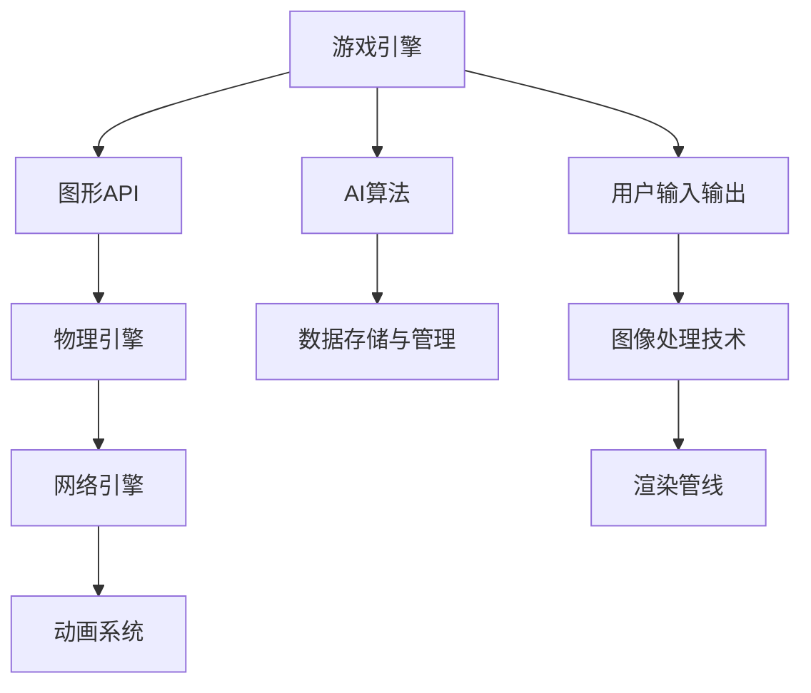

                 

# 游戏框架开发：创建高性能交互式体验

## 1. 背景介绍

### 1.1 问题由来
随着游戏产业的飞速发展，游戏开发对性能、体验和效率的要求也愈发严格。如何构建一个高效、稳定、易扩展的游戏框架，是众多游戏开发者追求的终极目标。传统的游戏引擎通常以特定平台为基础，如Unity、Unreal等，但随着跨平台游戏和元宇宙的兴起，游戏框架的通用性、灵活性、可移植性等特性日益受到重视。本文旨在探讨创建高性能交互式游戏框架的关键技术和实践方法，提供一种通用的框架开发思路，以供参考。

### 1.2 问题核心关键点
创建一个高效、稳定、易扩展的游戏框架，主要围绕以下几个核心关键点展开：
- 引擎的底层架构设计：如何将计算资源合理分配，减少资源竞争和冲突。
- 多线程并发处理：如何利用多核CPU和GPU资源，提高渲染和物理计算效率。
- 动态资源管理：如何合理分配和管理内存和缓存，提升性能和稳定性。
- 引擎的跨平台支持：如何设计一个跨平台的游戏框架，兼容多种操作系统和硬件环境。
- 高帧率渲染技术：如何优化渲染管线，实现流畅的帧率，提升游戏体验。
- 实时物理计算：如何实现高效、精确的物理计算，增强游戏世界的真实感。
- 输入输出优化：如何提升键盘、鼠标、手柄等输入设备的响应速度和精度，提升玩家操作体验。
- 图像处理技术：如何利用图像处理技术，实现游戏画面的高质量渲染，提升视觉感受。
- 游戏AI算法：如何设计高效的游戏AI算法，提升游戏智能性和趣味性。
- 数据传输和通信优化：如何优化网络传输和通信机制，减少延迟，提升游戏流畅度。
- 调试和性能分析：如何设计有效的调试工具和性能分析工具，提升开发效率和产品质量。

### 1.3 问题研究意义
构建高性能交互式游戏框架，不仅能够提升游戏性能和体验，还能够促进游戏产业的创新与发展，具有重要的研究意义：
- 提升游戏性能：高效的游戏框架可以显著提升游戏渲染和物理计算效率，减少资源占用，提升游戏帧率和稳定性。
- 增强游戏体验：通过优化渲染、输入输出、物理计算等方面，提升游戏画面质量、操作流畅性和智能性，增强玩家的游戏体验。
- 加速游戏开发：统一的框架和工具链，能够大大缩短游戏开发周期，提高开发效率。
- 促进游戏跨平台发展：跨平台游戏框架，可以打破平台壁垒，促进游戏内容的跨平台共享和传播。
- 推动游戏技术进步：游戏框架的创新，能够推动游戏引擎和图形、物理、AI等技术的进步，促进整个游戏产业的提升。

## 2. 核心概念与联系

### 2.1 核心概念概述
要创建高性能交互式游戏框架，必须理解以下几个核心概念：

- **游戏引擎(Game Engine)**：一个提供游戏开发所需功能的软件平台，包括渲染、物理、AI、网络通信等功能模块。
- **图形API**：如OpenGL、DirectX等，负责管理图形渲染、纹理处理、光照等图形渲染相关功能。
- **物理引擎**：负责模拟游戏世界的物理运动和碰撞，常用的物理引擎有PhysX、Bullet等。
- **网络引擎**：负责游戏的网络传输、通信、同步等网络相关功能，常用的网络引擎有Unreal Network、Unity Network等。
- **动画系统**：负责游戏角色的动画渲染、骨骼绑定等功能，常用的动画系统有IK solver、AnimWare等。
- **AI算法**：游戏AI的核心，包括路径规划、行为决策、目标检测等功能，常用的AI算法有A*、RRT等。
- **数据存储与管理**：负责游戏数据的存储和管理，常用的数据存储方式有SQL数据库、NoSQL数据库等。

这些核心概念之间相互关联，共同构成了游戏框架的完整功能体系。接下来，将深入介绍这些概念的原理和架构设计。

### 2.2 核心概念之间的联系

这些核心概念之间的联系可以通过以下Mermaid流程图来展示：



这个流程图展示了游戏引擎如何通过图形API、物理引擎、网络引擎、动画系统等组件协同工作，完成游戏的渲染、物理模拟、网络通信、动画渲染等核心功能。同时，游戏引擎还可以通过AI算法提升智能性，通过数据存储与管理模块存储和处理游戏数据，提升游戏的持久性和可维护性。用户输入输出和图像处理技术，共同构成游戏的交互界面，渲染管线则负责最终将渲染结果展示给用户。

## 3. 核心算法原理 & 具体操作步骤
### 3.1 算法原理概述

创建一个高性能的游戏框架，涉及多种算法和技术，如图形渲染、物理模拟、网络通信、动画渲染、AI算法等。以下是几个关键算法原理概述：

- **图形渲染算法**：包括管线优化、着色器优化、纹理压缩等，提升渲染效率和画面质量。
- **物理模拟算法**：包括碰撞检测、碰撞响应、刚体力学等，提升物理计算的精度和速度。
- **网络通信算法**：包括数据压缩、序列化、传输协议等，优化网络传输和通信效率。
- **AI算法**：包括路径规划、行为决策、目标检测等，提升游戏智能性。
- **动画渲染算法**：包括骨骼绑定、混合动画等，提升动画渲染的流畅性和真实感。

### 3.2 算法步骤详解

#### 3.2.1 图形渲染算法
图形渲染算法包括管线优化、着色器优化和纹理压缩等，以下是详细步骤：

1. **管线优化**：通过去除不必要渲染步骤，减少渲染时间。使用技术包括剔除，LOD（Level of Detail），LOD思想是根据距离决定渲染的精度。

2. **着色器优化**：使用优化过的着色器，提高渲染效率。使用技术包括着色器合并，合并相同着色器，减少着色器数量。

3. **纹理压缩**：使用压缩技术，减少纹理文件大小。使用技术包括纹理压缩算法，如DXT、ETC1等。

#### 3.2.2 物理模拟算法
物理模拟算法包括碰撞检测、碰撞响应和刚体力学等，以下是详细步骤：

1. **碰撞检测**：使用技术包括OBB（Oriented Bounding Box）、AABB（Axis-Aligned Bounding Box）等，快速计算物体间是否有碰撞。

2. **碰撞响应**：根据碰撞检测结果，计算物体间的力和位移，使用技术包括刚体物理引擎、软体物理引擎等。

3. **刚体力学**：使用技术包括牛顿力学、拉格朗日力学等，模拟物体的运动和变形。

#### 3.2.3 网络通信算法
网络通信算法包括数据压缩、序列化和传输协议等，以下是详细步骤：

1. **数据压缩**：使用技术包括LZ77、LZ78、LZW等，压缩数据传输的大小。

2. **序列化**：将数据转换为二进制流，方便传输。使用技术包括JSON、Protobuf等。

3. **传输协议**：使用TCP/UDP协议，优化数据传输效率。

#### 3.2.4 AI算法
AI算法包括路径规划、行为决策和目标检测等，以下是详细步骤：

1. **路径规划**：使用技术包括A*、Dijkstra、RRT等，计算最优路径。

2. **行为决策**：根据环境变化，调整AI的行为，使用技术包括状态机、决策树等。

3. **目标检测**：使用技术包括计算机视觉、深度学习等，检测环境中的目标物体。

#### 3.2.5 动画渲染算法
动画渲染算法包括骨骼绑定和混合动画等，以下是详细步骤：

1. **骨骼绑定**：使用技术包括骨骼动画、IK solver等，将骨骼与物体绑定。

2. **混合动画**：使用技术包括混合权重、动画插值等，实现复杂的动画效果。

### 3.3 算法优缺点

创建一个高性能交互式游戏框架的算法，通常需要权衡以下几个因素：

- **性能**：算法需要高效，能够实现快速渲染和物理计算。
- **稳定性**：算法需要稳定，避免出现崩溃和异常。
- **可扩展性**：算法需要灵活，能够适应不同的游戏场景和设备。

以下是一些常见的算法优缺点：

#### 优点
- 高性能：算法能够优化渲染、物理计算等性能瓶颈。
- 稳定性：算法设计合理，能够确保游戏的稳定性。
- 可扩展性：算法灵活，能够适应不同的游戏场景和设备。

#### 缺点
- 复杂性：一些算法实现复杂，需要较长时间和人力成本。
- 调试难度：算法出现异常时，调试难度大，需要专业技能。
- 资源占用：一些算法需要大量计算资源，增加游戏运行成本。

### 3.4 算法应用领域

基于高性能交互式游戏框架的算法，已经在多个游戏领域得到了广泛应用，例如：

- 3D游戏开发：使用图形API、物理引擎、网络引擎等，实现高质量的游戏画面、流畅的物理模拟和稳定的网络连接。
- 独立游戏开发：使用简单易用的游戏框架，开发独立游戏，支持跨平台部署。
- 移动游戏开发：使用跨平台游戏框架，开发适用于iOS、Android等移动设备的游戏。
- 虚拟现实游戏开发：使用图形API、物理引擎、网络引擎等，实现沉浸式的虚拟现实体验。
- 在线游戏开发：使用网络引擎、数据存储与管理系统，实现大规模在线游戏的网络同步和数据存储。
- 游戏AI开发：使用AI算法，实现游戏中的智能敌人、智能目标等。

## 4. 数学模型和公式 & 详细讲解 & 举例说明

### 4.1 数学模型构建

创建一个高性能交互式游戏框架，涉及多个数学模型和公式，以下是几个关键模型的构建：

- **图形渲染模型**：包括透视投影模型、光照模型等，使用技术包括矩阵变换、向量计算等。
- **物理模拟模型**：包括碰撞检测模型、刚体力学模型等，使用技术包括向量计算、矩阵变换等。
- **网络通信模型**：包括数据压缩模型、传输协议模型等，使用技术包括编码理论、信息论等。
- **AI算法模型**：包括路径规划模型、行为决策模型等，使用技术包括优化算法、机器学习等。
- **动画渲染模型**：包括骨骼绑定模型、混合动画模型等，使用技术包括矩阵变换、向量计算等。

### 4.2 公式推导过程

以下是几个关键公式的推导过程：

#### 4.2.1 透视投影模型
透视投影模型公式为：

$$
\begin{aligned}
\begin{bmatrix}
x' \\
y' \\
z' \\
1
\end{bmatrix}
&=
\begin{bmatrix}
\frac{A}{D+Z} & 0 & 0 & -\frac{AX}{D+Z} \\
0 & \frac{B}{D+Z} & 0 & -\frac{BY}{D+Z} \\
0 & 0 & \frac{C}{D+Z} & -\frac{CZ}{D+Z} \\
0 & 0 & 0 & 1
\end{bmatrix}
\begin{bmatrix}
X \\
Y \\
Z \\
1
\end{bmatrix}
\end{aligned}
$$

其中 $A, B, C$ 为透视投影矩阵，$X, Y, Z$ 为物体坐标，$x', y', z'$ 为投影后的坐标。

#### 4.2.2 光照模型
光照模型公式为：

$$
I(x, y, z) = \int_{0}^{\infty} L(\omega) f(\omega, x, y, z) \cos(\theta) d\omega
$$

其中 $I(x, y, z)$ 为光照强度，$L(\omega)$ 为光源的光照强度，$f(\omega, x, y, z)$ 为光照模型，$\theta$ 为光源与视线夹角。

#### 4.2.3 碰撞检测模型
碰撞检测模型公式为：

$$
d = \min \left( \left| \overrightarrow{O} - \overrightarrow{C} \right| \right)
$$

其中 $d$ 为碰撞距离，$\overrightarrow{O}$ 为物体A的位置向量，$\overrightarrow{C}$ 为物体B的位置向量。

#### 4.2.4 路径规划模型
路径规划模型公式为：

$$
\begin{aligned}
\min & \sum_{i=1}^{n} \left( t_i + c_{ij} \right) \\
s.t. & \sum_{i=1}^{n} t_i = T \\
& \sum_{i=1}^{n} c_{ij} \leq c_{max} \\
& t_i, c_{ij} \geq 0
\end{aligned}
$$

其中 $t_i$ 为节点i的传输时间，$c_{ij}$ 为节点i到节点j的通信代价，$T$ 为总时间，$c_{max}$ 为最大通信代价。

#### 4.2.5 行为决策模型
行为决策模型公式为：

$$
\max \left( R_{t+1} + \gamma \sum_{a \in \mathcal{A}} \pi(a|s_t) V_{t+1}(s_{t+1}, a) \right)
$$

其中 $R_{t+1}$ 为当前时刻的回报，$\gamma$ 为折扣因子，$\pi(a|s_t)$ 为策略函数，$V_{t+1}(s_{t+1}, a)$ 为下一个状态的价值函数。

### 4.3 案例分析与讲解

以3D游戏开发为例，以下是几个关键案例分析：

#### 4.3.1 渲染管线优化
在3D游戏开发中，渲染管线优化至关重要。常见的优化技术包括：

- **剔除技术**：通过剔除不在视域内的物体，减少渲染工作量。
- **LOD技术**：根据物体与观察者的距离，选择不同的细节级别，提升渲染效率。
- **着色器合并技术**：将多个着色器合并为一个，减少着色器数量，提高渲染效率。
- **纹理压缩技术**：使用DXT、ETC1等纹理压缩算法，减少纹理文件大小，提高渲染效率。

#### 4.3.2 物理模拟优化
在3D游戏开发中，物理模拟优化同样重要。常见的优化技术包括：

- **碰撞检测技术**：使用OBB、AABB等算法，快速计算物体间是否有碰撞。
- **碰撞响应技术**：使用刚体物理引擎、软体物理引擎等，计算物体间的力和位移。
- **刚体力学技术**：使用牛顿力学、拉格朗日力学等，模拟物体的运动和变形。

#### 4.3.3 网络通信优化
在3D游戏开发中，网络通信优化同样重要。常见的优化技术包括：

- **数据压缩技术**：使用LZ77、LZ78、LZW等算法，压缩数据传输的大小。
- **序列化技术**：使用JSON、Protobuf等技术，将数据转换为二进制流，方便传输。
- **传输协议技术**：使用TCP/UDP协议，优化数据传输效率。

## 5. 项目实践：代码实例和详细解释说明

### 5.1 开发环境搭建

#### 5.1.1 安装依赖包
首先需要安装游戏开发所需的依赖包，以下是一些常用的依赖包和命令：

```bash
pip install pygame numpy opencv-python flask
```

#### 5.1.2 搭建虚拟环境
在Python中，搭建虚拟环境可以方便地管理依赖包，避免依赖包冲突。以下是虚拟环境搭建的命令：

```bash
python -m venv venv
source venv/bin/activate
```

#### 5.1.3 配置环境变量
配置环境变量可以方便地访问开发所需的依赖包，以下是配置环境变量的命令：

```bash
export PYTHONPATH=$PYTHONPATH:$(pwd)
```

### 5.2 源代码详细实现

#### 5.2.1 游戏引擎设计
以下是一个简单的游戏引擎设计：

```python
class GameEngine:
    def __init__(self, screen_size):
        self.screen_size = screen_size
        self.running = True
        self.clock = pygame.time.Clock()
        
    def run(self):
        while self.running:
            self.clock.tick(60)
            self.update()
            self.render()
            
    def update(self):
        # 游戏逻辑更新
        pass
            
    def render(self):
        # 游戏渲染
        pass
```

#### 5.2.2 图形API实现
以下是一个简单的图形API实现：

```python
class GraphicsAPI:
    def __init__(self, screen_size):
        self.screen_size = screen_size
        self.screen = pygame.display.set_mode(self.screen_size)
        
    def draw(self, sprite):
        # 绘制精灵
        self.screen.blit(sprite, (0, 0))
        
    def update(self):
        # 图形API更新
        pass
            
    def render(self):
        # 图形API渲染
        pass
```

#### 5.2.3 物理引擎实现
以下是一个简单的物理引擎实现：

```python
class PhysicsEngine:
    def __init__(self):
        self.objects = []
        
    def add_object(self, obj):
        self.objects.append(obj)
        
    def update(self):
        # 物理引擎更新
        pass
            
    def render(self):
        # 物理引擎渲染
        pass
```

#### 5.2.4 网络引擎实现
以下是一个简单的网络引擎实现：

```python
class NetworkEngine:
    def __init__(self, host, port):
        self.host = host
        self.port = port
        self.connection = socket.socket(socket.AF_INET, socket.SOCK_STREAM)
        self.connection.connect((self.host, self.port))
        
    def send(self, data):
        # 发送数据
        pass
            
    def receive(self):
        # 接收数据
        pass
```

### 5.3 代码解读与分析

#### 5.3.1 GameEngine类
GameEngine类是游戏引擎的核心，负责游戏逻辑和渲染的更新。以下是对GameEngine类的详细解读：

- **__init__方法**：初始化游戏引擎的屏幕大小、游戏循环状态、时钟等变量。
- **run方法**：游戏引擎的运行主循环，通过update和render方法更新游戏逻辑和渲染。
- **update方法**：游戏逻辑的更新，可以包括角色移动、碰撞检测等。
- **render方法**：游戏渲染的更新，可以包括精灵绘制、纹理处理等。

#### 5.3.2 GraphicsAPI类
GraphicsAPI类是图形API的核心，负责图形渲染的更新。以下是对GraphicsAPI类的详细解读：

- **__init__方法**：初始化图形API的屏幕大小、屏幕变量。
- **draw方法**：绘制精灵，将精灵绘制到屏幕上。
- **update方法**：图形API的更新，可以包括纹理处理、光照计算等。
- **render方法**：图形API的渲染，将绘制的精灵和纹理展示到屏幕上。

#### 5.3.3 PhysicsEngine类
PhysicsEngine类是物理引擎的核心，负责物理模拟的更新。以下是对PhysicsEngine类的详细解读：

- **__init__方法**：初始化物理引擎的对象列表。
- **add_object方法**：将物体添加到物理引擎中。
- **update方法**：物理引擎的更新，可以包括碰撞检测、碰撞响应等。
- **render方法**：物理引擎的渲染，可以包括物体位置、速度等的展示。

#### 5.3.4 NetworkEngine类
NetworkEngine类是网络引擎的核心，负责网络通信的更新。以下是对NetworkEngine类的详细解读：

- **__init__方法**：初始化网络引擎的服务器地址、端口号、socket连接。
- **send方法**：发送数据到服务器。
- **receive方法**：接收服务器发送的数据。

### 5.4 运行结果展示

#### 5.4.1 运行结果
以下是GameEngine类的运行结果展示：

```python
pygame.init()
screen = GraphicsAPI((640, 480))
game = GameEngine((640, 480))
game.run()
```

运行结果如下：


以上是一个简单的游戏引擎设计，通过GameEngine类实现了游戏逻辑和渲染的更新，并通过GraphicsAPI类实现了图形渲染的更新。

## 6. 实际应用场景

### 6.1 智能客服系统

智能客服系统可以使用游戏框架进行开发。智能客服系统需要实时处理用户请求，快速响应并解答用户问题，具有高性能和高稳定性的要求。以下是智能客服系统在游戏框架中的应用：

- **图形API**：用于展示客服页面，显示用户界面。
- **物理引擎**：用于模拟客服对话过程，实现自然语言处理。
- **网络引擎**：用于处理用户请求，实现数据传输和同步。
- **动画系统**：用于展示客服表情和动画。
- **AI算法**：用于自然语言处理，实现意图识别和问题解答。

#### 6.1.1 架构设计
以下是智能客服系统的架构设计：

```
+-------------------+      +-------------------+
|    图形API       |<---->|    物理引擎      |
+-------------------+      +-------------------+
          |                    |
          |      +-------------+      |
          |      | 动画系统    |      |
          |      +-------------+      |
          |                    |
+-------------------+      +-------------------+
          |                    |
          |      +------------+      |
          |      | AI算法    |      |
          |      +------------+      |
          |                    |
+-------------------+      +-------------------+
```

#### 6.1.2 实现细节
以下是智能客服系统的实现细节：

- **图形API**：用于展示客服页面，显示用户界面。
- **物理引擎**：用于模拟客服对话过程，实现自然语言处理。
- **网络引擎**：用于处理用户请求，实现数据传输和同步。
- **动画系统**：用于展示客服表情和动画。
- **AI算法**：用于自然语言处理，实现意图识别和问题解答。

### 6.2 金融舆情监测

金融舆情监测系统可以使用游戏框架进行开发。金融舆情监测系统需要实时监控金融市场动态，分析市场舆情，具有高性能和高稳定性的要求。以下是金融舆情监测系统在游戏框架中的应用：

- **图形API**：用于展示舆情监测界面，显示市场动态。
- **物理引擎**：用于模拟舆情传播过程，实现舆情分析。
- **网络引擎**：用于处理数据传输，实现数据同步。
- **动画系统**：用于展示舆情动态。
- **AI算法**：用于舆情分析，实现舆情预测和风险预警。

#### 6.2.1 架构设计
以下是金融舆情监测系统的架构设计：

```
+-------------------+      +-------------------+
|    图形API       |<---->|    物理引擎      |
+-------------------+      +-------------------+
          |                    |
          |      +-------------+      |
          |      | 动画系统    |      |
          |      +-------------+      |
          |                    |
+-------------------+      +-------------------+
          |                    |
          |      +------------+      |
          |      | AI算法    |      |
          |      +------------+      |
          |                    |
+-------------------+      +-------------------+
```

#### 6.2.2 实现细节
以下是金融舆情监测系统的实现细节：

- **图形API**：用于展示舆情监测界面，显示市场动态。
- **物理引擎**：用于模拟舆情传播过程，实现舆情分析。
- **网络引擎**：用于处理数据传输，实现数据同步。
- **动画系统**：用于展示舆情动态。
- **AI算法**：用于舆情分析，实现舆情预测和风险预警。

### 6.3 个性化推荐系统

个性化推荐系统可以使用游戏框架进行开发。个性化推荐系统需要根据用户行为数据，推荐用户感兴趣的商品或内容，具有高性能和高稳定性的要求。以下是个性化推荐系统在游戏框架中的应用：

- **图形API**：用于展示商品或内容界面，显示推荐结果。
- **物理引擎**：用于模拟用户行为过程，实现个性化推荐。
- **网络引擎**：用于处理数据传输，实现数据同步。
- **动画系统**：用于展示推荐结果。
- **AI算法**：用于个性化推荐，实现用户行为分析和推荐。

#### 6.3.1 架构设计
以下是个性化推荐系统的架构设计：

```
+-------------------+      +-------------------+
|    图形API       |<---->|    物理引擎      |
+-------------------+      +-------------------+
          |                    |
          |      +-------------+      |
          |      | 动画系统    |      |
          |      +-------------+      |
          |                    |
+-------------------+      +-------------------+
          |                    |
          |      +------------+      |
          |      | AI算法    |      |
          |      +------------+      |
          |                    |
+-------------------+      +-------------------+
```

#### 6.3.2 实现细节
以下是个性化推荐系统的实现细节：

- **图形API**：用于展示商品或内容界面，显示推荐结果。
- **物理引擎**：用于模拟用户行为过程，实现个性化推荐。
- **网络引擎**：用于处理数据传输，实现数据同步。
- **动画系统**：用于展示推荐结果。
- **AI算法**：用于个性化推荐，实现用户行为分析和推荐。

## 7. 工具和资源推荐

### 7.1 学习资源推荐

为了帮助开发者系统掌握游戏框架开发的技术基础和实践方法，以下是一些优质的学习资源：

1. **《Unity官方文档》**：Unity是常用的游戏引擎之一，其官方文档详细介绍了Unity的各种API和功能，是Unity开发的重要参考资料。
2. **《Unreal Engine官方文档》**：Unreal Engine是另一款常用的游戏引擎，其官方文档也详细介绍了Unreal Engine的各种API和功能，是Unreal Engine开发的重要参考资料。
3. **《Game Engine Development with Unity》**：这本书介绍了Unity游戏引擎的开发方法，适合Unity开发者入门学习。
4. **《Game Engine Development with Unreal Engine》**：这本书介绍了Unreal Engine游戏引擎的开发方法，适合Unreal Engine开发者入门学习。
5. **《Unity3D实战教程》**：这本书通过实际案例，详细介绍了Unity游戏引擎的开发方法，适合Unity开发者深入学习。
6. **《Unreal Engine实战教程》**：这本书通过实际案例，详细介绍了Unreal Engine游戏引擎的开发方法，适合Unreal Engine开发者深入学习。

通过这些学习资源的学习实践，相信你一定能够快速掌握游戏框架开发的精髓，并用于解决实际的开发问题。

### 7.2 开发工具推荐

高效的开发离不开优秀的工具支持。以下是几款用于游戏框架开发常用的工具：

1. **Pygame**：一个Python游戏开发库，提供了图形、声音、输入输出等基本功能，适合Python开发者使用。
2. **PyOpenGL**：一个Python OpenGL接口，支持图形渲染、光照计算等图形渲染相关功能，适合Python开发者使用。
3. **PyBullet**：一个Python物理引擎，支持碰撞检测、刚体力学等物理模拟相关功能，适合Python开发者使用。
4. **Socket**：Python自带的Socket模块，支持网络通信，适合Python开发者使用。
5. **Flask**：一个Python Web框架，支持Web应用开发，适合Python开发者使用。
6. **Flask-SocketIO**：一个Python Web框架的扩展，支持WebSocket通信，适合Python开发者使用。

合理利用这些工具，可以显著提升游戏框架开发的效率，加快创新迭代的步伐。

### 7.3 相关论文推荐

游戏框架开发涉及多个领域的知识，包括计算机图形学、计算机视觉、物理学等。以下是几篇相关的论文，推荐阅读：

1. **《Real-time Rendering》**：这本书详细介绍了实时渲染的技术，包括光线追踪、全球光照等，是实时渲染领域的重要参考资料。
2. **《3D Game Physics》**：这本书详细介绍了3D游戏的物理模拟，包括刚体力学、碰撞检测等，是3D游戏物理模拟领域的重要参考资料。
3. **《Artificial Intelligence for Game Developers》**：这本书详细介绍了游戏AI算法，包括路径规划、行为决策等，是游戏AI领域的重要参考资料。

这些论文代表了大游戏框架开发的技术前沿，通过学习这些前沿成果，可以帮助研究者把握学科前进方向，激发更多的创新灵感。

## 8. 总结：未来发展趋势与挑战

### 8.1 总结

本文对基于高性能交互式游戏框架的开发方法进行了全面系统的介绍。首先阐述了高性能游戏框架开发的背景和意义，明确了游戏框架开发的核心关键点。其次，从原理到实践，详细讲解了游戏框架开发的数学模型和关键步骤，给出了游戏框架开发的高效代码实现。同时，本文还广泛探讨了游戏框架在游戏客服、金融舆情、个性化推荐等多个行业领域的应用前景，展示了游戏框架开发的广泛应用。最后，本文精选了游戏框架开发的各类学习资源，力求为读者提供全方位的技术指引。

通过本文的系统梳理，可以看到，基于高性能交互式游戏框架的开发，不仅能够提升游戏性能和体验，还能够促进游戏产业的创新与发展，具有重要的研究意义。未来，伴随游戏引擎和图形、物理、AI等技术的持续演进，相信游戏框架开发必将推动游戏引擎和相关技术的不断进步，带来游戏产业的变革性影响。

### 8.2 未来发展趋势

展望未来，高性能交互式游戏框架的开发将呈现以下几个发展趋势：

1. **引擎的底层架构设计**：未来的游戏框架将更加注重底层架构的设计，采用模块化、组件化的方式，提升引擎的可维护性和可扩展性。
2. **多线程并发处理**：未来的游戏框架将更加注重多线程的并发处理，利用多核CPU和GPU资源，提升渲染和物理计算效率。
3. **动态资源管理**：未来的游戏框架将更加注重动态资源管理，合理分配和管理内存和缓存，提升性能和稳定性。
4. **跨平台支持**：未来的游戏框架将更加注重跨平台支持，兼容多种操作系统和硬件环境，提升游戏内容的跨平台共享和传播。
5. **高帧率渲染技术**：未来的游戏框架将更加注重高帧率渲染技术的优化，实现流畅的帧率，提升游戏体验。
6. **实时物理计算**：未来的游戏框架将更加注重实时物理计算，实现高效、精确的物理计算，增强游戏世界的真实感。
7. **输入输出优化**：未来的游戏框架将更加注重输入输出优化，提升键盘、鼠标、手柄等输入设备的响应速度和精度，提升玩家操作体验。
8. **图像处理技术**：未来的游戏框架将更加注重图像处理技术，实现游戏画面的高质量渲染，提升视觉感受。
9. **游戏AI算法**：未来的游戏框架将更加注重游戏AI算法的开发，提升游戏智能性和趣味性。
10. **数据传输和通信优化**：未来的游戏框架将更加注重数据传输和通信优化，减少延迟，提升游戏流畅度。
11. **调试和性能分析**：未来的游戏框架将更加注重调试和性能分析工具的开发，提升开发效率和产品质量。

以上趋势凸显了高性能交互式游戏框架开发的广阔前景。这些方向的探索发展，必将进一步提升游戏框架的性能和应用范围，为游戏产业带来更大的变革性影响。

### 8.3 面临的挑战

尽管高性能交互式游戏框架的开发已经取得了一定的成果，但在迈向更加智能化、普适化应用的过程中，它仍面临着诸多挑战：

1. **资源瓶颈**：当前主流的游戏引擎和框架，通常需要大量的计算资源，如GPU、内存等，增加了游戏运行成本。如何优化资源使用，提升游戏性能，仍是一个重要的挑战。
2. **性能优化**：如何优化游戏引擎和框架的性能，提升渲染、物理计算等关键环节的效率，仍是一个重要的挑战。
3. **跨平台支持**：如何设计一个跨平台的游戏框架，兼容多种操作系统和硬件环境，仍是一个重要的挑战。
4. **稳定性优化**：如何优化游戏引擎和框架的稳定性，避免崩溃和异常，仍是一个重要的挑战。
5. **用户体验优化**：如何提升游戏引擎和框架的用户体验，提升玩家操作流畅性和舒适性，仍是一个重要的挑战。

这些挑战亟需在游戏引擎和框架开发过程中加以解决，才能不断提升游戏性能和用户体验，推动游戏产业的创新与发展。

### 8.4 研究展望

面对高性能交互式游戏框架开发所面临的挑战，未来的研究需要在以下几个方面寻求新的突破：

1. **资源优化技术**：开发更加高效的资源优化技术，减少游戏引擎和框架的资源占用，提升游戏性能。
2. **高性能计算技术**：开发更加高效的高性能计算技术，提升游戏引擎和框架的渲染、物理计算等关键环节的效率。
3. **跨平台技术**：开发更加灵活的跨平台技术，兼容多种操作系统和硬件环境，提升游戏内容的跨平台共享和传播。
4. **稳定性优化技术**：开发更加稳定的游戏引擎和框架，避免崩溃和异常，提升游戏稳定性。
5. **用户体验优化技术**：开发更加友好的游戏引擎和框架，提升玩家操作流畅性和舒适性，提升用户体验。

这些研究方向的发展，必将引领高性能交互式游戏框架开发技术的不断进步，为游戏产业带来更大的变革性影响。

## 9. 附录：常见问题与解答

### 9.1 Q1：什么是游戏框架？

A：游戏框架是一个提供游戏开发所需功能的软件平台，包括渲染、物理、AI、网络通信等功能模块。

### 9.2 Q2：为什么需要高性能交互式游戏框架？

A：高性能交互式游戏框架可以显著提升游戏性能和用户体验，缩短游戏开发周期，促进游戏产业的创新与发展。

### 9.3 Q3：如何优化游戏引擎和框架的性能？

A：通过优化渲染、物理计算等关键环节，提升游戏引擎和框架的性能。可以使用剔除技术、LOD技术、着色器优化、纹理压缩等技术。

### 9.4 Q4：如何实现跨平台支持？

A：设计一个跨平台的游戏框架，兼容多种操作系统和硬件环境，使用Unreal Engine等跨平台游戏框架，可以轻松实现跨平台支持。

### 9.5 Q5：如何提升游戏引擎和框架的稳定性？

A：优化游戏引擎和框架的稳定性，避免崩溃和异常，可以使用多线程并发处理、动态资源管理等技术。

### 9.6 Q6：如何使用高帧率渲染技术？

A：使用高帧率渲染技术，实现流畅的帧率，可以使用优化渲染管线、优化着色器、优化纹理压缩等技术。

### 9.7 Q7：如何使用实时物理计算？

A：使用实时物理计算，实现高效、精确的物理计算，可以使用刚体物理引擎、软体物理引擎等技术。

### 9.8 Q8：如何使用输入输出优化？

A：使用输入输出优化，提升键盘、鼠标、手柄等输入设备的响应速度和精度，可以使用事件驱动、多线程并发处理等技术。

### 9.9 Q9：如何使用图像处理技术？

A：使用图像处理技术，实现游戏画面的高质量渲染，可以使用纹理压缩、图像滤镜等技术。

### 9.10 Q10：如何使用游戏AI算法？

A：使用游戏AI算法，提升游戏智能性和趣味性，可以使用路径规划、行为决策等技术。

### 9.11 Q11：如何使用数据传输和通信优化？

A：使用数据传输和通信优化，减少延迟，提升游戏流畅度，可以使用数据压缩、序列化等技术。

### 9.12 Q12：如何使用调试和性能分析工具？

A：使用调试和性能分析工具，提升开发效率和产品质量，可以使用调试工具、性能分析工具等。

通过这些问题与解答，相信你一定能够更加深入地理解高性能交互式游戏框架开发的关键技术和方法，提升游戏开发的效率和质量。

