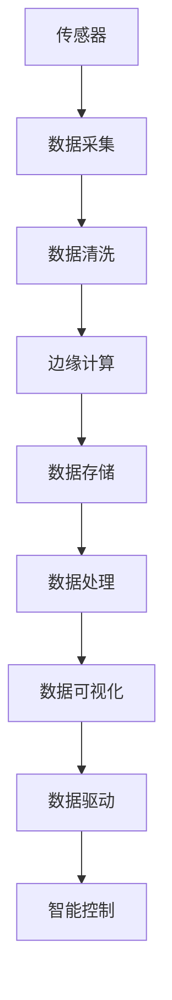

                 

# 物联网技术：从传感器到云端的数据流

## 1. 背景介绍

### 1.1 问题由来
随着互联网技术的迅猛发展，物联网(IoT)已经成为未来技术的重要组成部分。物联网通过将传感器、智能设备等物理对象接入互联网，实现了设备间的互联互通和数据共享。然而，由于传感器和智能设备产生的数据量巨大、数据格式复杂，如何将这些数据高效、可靠地传输至云端，成为当前物联网技术应用的一大难题。

### 1.2 问题核心关键点
- 数据采集：物联网设备如何高效、可靠地采集和传输数据。
- 数据清洗：如何将传感器的原始数据转换为可用于分析的干净数据。
- 数据存储：如何安全、高效地将海量数据存储在云端。
- 数据处理：如何对传感器数据进行实时或离线分析，提取有用信息。
- 数据可视化：如何通过可视化工具呈现数据分析结果，帮助决策者理解数据。
- 数据驱动：如何通过数据驱动的决策制定，优化业务流程和提升用户体验。

### 1.3 问题研究意义
物联网技术正在深刻改变我们的生活方式和商业模式。通过对传感器数据的分析，可以提升设备的智能化水平，优化运营效率，创造新的商业价值。然而，传感器数据的复杂性和多样性给数据处理带来了巨大挑战。如何构建高效的物联网数据流，从传感器到云端，再从云端返回到设备，成为实现物联网价值的核心问题。本文将详细探讨这一问题，并提出解决方案。

## 2. 核心概念与联系

### 2.1 核心概念概述

为更好地理解物联网数据流的问题，本节将介绍几个密切相关的核心概念：

- 物联网(IoT)：通过将物理设备、传感器等连接到互联网，实现设备间的数据共享和互操作。
- 传感器数据：由传感器采集的物理世界的各种信息，包括温度、湿度、位置等。
- 边缘计算(Edge Computing)：在靠近数据源的本地设备上进行数据处理，减少数据传输的延迟和带宽消耗。
- 云计算(Cloud Computing)：通过互联网连接的大量服务器集群，提供强大的计算和存储能力，处理海量数据。
- 数据流管道(Pipeline)：由多个模块或组件组成的数据处理流水线，从传感器采集数据，到云端存储分析，再到设备反馈，形成闭环。
- 数据清洗(Data Cleaning)：将传感器原始数据转换为可用于分析的干净数据，去除噪音和冗余信息。
- 数据可视(Datum Visualization)：通过图表、地图等形式，直观展示数据分析结果，便于理解。
- 数据驱动(Datum-Driven)：基于数据分析结果，制定决策和优化流程，实现智能控制。

这些核心概念之间的逻辑关系可以通过以下Mermaid流程图来展示：



这个流程图展示了大数据流的核心概念及其之间的关系：

1. 传感器采集物理世界的数据。
2. 数据经过清洗和预处理后，被传输至本地边缘计算设备进行处理。
3. 边缘计算后，数据上传至云端进行进一步分析和存储。
4. 云端分析结果可视化和决策优化，通过数据流管道传输回设备进行智能控制。

这些概念共同构成了物联网技术的数据流处理框架，使得数据能够高效、安全地从传感器流向云端，再返回到设备进行智能控制。

## 3. 核心算法原理 & 具体操作步骤
### 3.1 算法原理概述

物联网数据流从传感器到云端，再从云端返回到设备，涉及多个环节的数据处理和传输。算法原理主要包括以下几个方面：

- 数据采集：设计合适的传感器采集数据，确保数据的准确性和可靠性。
- 数据清洗：通过预处理算法，去除数据中的噪音和冗余信息，提升数据质量。
- 边缘计算：在本地设备上进行数据初步处理，减轻云端负担，提高数据传输效率。
- 数据存储：选择合适的云服务，安全、高效地存储和管理传感器数据。
- 数据处理：使用数据分析算法，对传感器数据进行实时或离线分析，提取有价值的信息。
- 数据可视化：设计直观的可视化工具，呈现数据分析结果，便于理解和使用。
- 数据驱动：通过机器学习算法，对数据分析结果进行建模和预测，优化业务流程和提升用户体验。

### 3.2 算法步骤详解

基于物联网数据流的算法，一般包括以下几个关键步骤：

**Step 1: 数据采集与传感器选择**
- 根据业务需求，选择合适的传感器，如温度传感器、湿度传感器、位置传感器等。
- 设计传感器部署方案，确保数据采集的全面性和可靠性。
- 使用适当的数据采集设备，如单片机、嵌入式系统等，确保采集数据的准确性。

**Step 2: 数据清洗与预处理**
- 设计数据清洗流程，去除传感器原始数据中的噪音和冗余信息。
- 使用滤波算法、去重算法等预处理步骤，提升数据质量。
- 将清洗后的数据转换为标准格式，便于后续处理。

**Step 3: 边缘计算与本地处理**
- 在本地设备上部署边缘计算框架，如Fog、Kube Edge等。
- 设计本地数据处理算法，如均值滤波、时间序列预测等，提取有用信息。
- 将处理后的数据压缩编码，减少传输带宽消耗。

**Step 4: 数据存储与云端上传**
- 选择合适的云服务，如AWS IoT、Google Cloud IoT等，存储传感器数据。
- 设计高效的数据上传策略，如批量上传、异步上传等，减轻云端负载。
- 使用安全协议，如SSL/TLS，确保数据传输的安全性。

**Step 5: 数据处理与分析**
- 在云端使用数据处理算法，如机器学习、深度学习等，进行数据分析。
- 使用可视化工具，如Tableau、Power BI等，呈现数据分析结果。
- 设计数据驱动的业务流程，优化决策和运营效率。

**Step 6: 数据可视化与用户体验**
- 设计直观的可视化界面，通过图表、地图等形式呈现数据分析结果。
- 使用交互式工具，如Dash、Grafana等，增强用户体验。
- 通过可视化数据，帮助决策者理解业务情况，制定优化决策。

**Step 7: 数据驱动与智能控制**
- 设计机器学习模型，对数据分析结果进行建模和预测。
- 设计智能控制系统，如IoT平台、M2M协议等，实现设备智能控制。
- 定期更新模型，确保系统持续优化和迭代。

以上是物联网数据流的核心算法步骤。在实际应用中，还需要针对具体业务场景，对各个环节进行优化设计，如改进数据采集方案、优化数据清洗流程、选择高效的数据处理算法等，以进一步提升数据流的效率和效果。

### 3.3 算法优缺点

物联网数据流算法具有以下优点：

1. 高效性：通过边缘计算和本地处理，减少数据传输带宽消耗，提高数据处理效率。
2. 可靠性：在本地设备和云端进行多层次的数据处理，提升数据采集和存储的可靠性。
3. 安全性：通过安全协议和加密算法，确保数据传输的安全性。
4. 可扩展性：使用云计算和分布式系统，支持大规模数据的存储和处理。

同时，该算法也存在一定的局限性：

1. 复杂性：设计合适的数据采集、清洗、存储等算法需要较深的技术积累。
2. 成本高：大规模传感器和云计算资源的部署成本较高。
3. 延迟高：在本地设备进行大量数据处理，可能造成延迟，影响实时性。
4. 数据量大：传感器数据量大，存储和处理需要高性能设备和技术。
5. 系统复杂：涉及传感器、边缘设备、云平台等多个环节，系统集成复杂。

尽管存在这些局限性，但就目前而言，物联网数据流算法仍是实现传感器数据高效传输和分析的关键手段。未来相关研究的重点在于如何进一步降低系统复杂度，提升实时性和可靠性，同时兼顾成本和数据量等实际问题。

### 3.4 算法应用领域

物联网数据流算法在各个行业领域都有广泛的应用，例如：

- 智慧城市：通过物联网传感器采集城市环境数据，实现交通管理、能源优化、环境监测等功能。
- 智能农业：使用传感器监测土壤、气候等环境数据，优化农业种植方案。
- 智慧制造：通过传感器采集设备运行数据，实现设备状态监测、预测性维护等。
- 智能家居：通过传感器采集家庭环境数据，实现智能控制和自动化管理。
- 智能医疗：使用传感器采集患者健康数据，实现远程监控和个性化诊疗。
- 智能物流：通过传感器追踪货物运输状态，实现物流优化和追溯管理。

除了上述这些经典应用外，物联网数据流技术还在工业控制、环境监测、灾害预警等多个领域得到了创新性的应用，为各行各业带来了新的技术突破和业务价值。

## 4. 数学模型和公式 & 详细讲解 & 举例说明

### 4.1 数学模型构建

为了更好地理解物联网数据流算法的数学原理，本节将使用数学语言对算法过程进行详细描述。

记传感器采集的数据序列为 $X=\{x_1, x_2, ..., x_n\}$，其中 $x_i$ 表示第 $i$ 个时间点的传感器数据。设计数据清洗函数 $G$，将原始数据转换为干净数据序列 $Y=\{y_1, y_2, ..., y_n\}$，其中 $y_i=G(x_i)$。在本地设备上，设计数据处理函数 $P$，提取有用信息得到处理后的数据序列 $Z=\{z_1, z_2, ..., z_n\}$，其中 $z_i=P(y_i)$。数据上传至云端后，设计数据存储函数 $S$，将数据序列 $Z$ 存储在云端数据库中。在云端，设计数据分析函数 $A$，对数据序列 $Z$ 进行分析和建模，得到分析结果 $R=\{r_1, r_2, ..., r_n\}$，其中 $r_i=A(z_i)$。最后，设计数据可视化函数 $V$ 和数据驱动函数 $D$，将分析结果 $R$ 呈现给用户，并根据结果优化业务流程。

总体流程如下：

1. 数据采集：设计传感器和数据采集设备，确保数据采集的准确性和可靠性。
2. 数据清洗：设计数据清洗函数 $G$，去除数据中的噪音和冗余信息。
3. 边缘计算：在本地设备上设计数据处理函数 $P$，提取有用信息。
4. 数据存储：设计数据存储函数 $S$，将数据序列 $Z$ 存储在云端。
5. 数据处理：设计数据分析函数 $A$，对数据序列 $Z$ 进行分析和建模。
6. 数据可视化：设计数据可视化函数 $V$，将分析结果 $R$ 呈现给用户。
7. 数据驱动：设计数据驱动函数 $D$，根据分析结果优化业务流程。

### 4.2 公式推导过程

以一个简单的例子来说明上述模型的推导过程。

假设有一组温度传感器数据 $X=\{x_1, x_2, ..., x_n\}$，其中 $x_i$ 表示第 $i$ 个时间点的温度值。设计数据清洗函数 $G$，去除数据中的异常值和噪音：

$$
y_i = \begin{cases}
G(x_i) = \frac{1}{n}\sum_{i=1}^n x_i, & \text{if } |x_i - \bar{x}| < \epsilon \\
G(x_i) = 0, & \text{otherwise}
\end{cases}
$$

其中 $\bar{x}=\frac{1}{n}\sum_{i=1}^n x_i$ 表示数据的平均值，$\epsilon$ 表示异常值的阈值。

在本地设备上，设计数据处理函数 $P$，对清洗后的数据进行均值滤波：

$$
z_i = P(y_i) = \frac{1}{w} \sum_{j=i-w+1}^{i+w-1} y_j
$$

其中 $w$ 表示滤波窗口大小。

数据上传至云端后，设计数据存储函数 $S$，将数据序列 $Z$ 存储在云端数据库中。

在云端，设计数据分析函数 $A$，对数据序列 $Z$ 进行时间序列预测：

$$
r_i = A(z_i) = f(z_i, \theta)
$$

其中 $f$ 表示时间序列预测模型，$\theta$ 表示模型参数。

最后，设计数据可视化函数 $V$ 和数据驱动函数 $D$，将分析结果 $R=\{r_1, r_2, ..., r_n\}$ 呈现给用户，并根据结果优化业务流程。

### 4.3 案例分析与讲解

以一个智能家居系统为例，说明物联网数据流的实际应用。

1. **数据采集**：在智能家居设备中安装各类传感器，如温湿度传感器、烟雾传感器、门磁传感器等，采集家庭环境数据。

2. **数据清洗**：设计数据清洗函数，去除传感器数据的噪音和异常值，确保数据的质量。

3. **边缘计算**：在本地设备上，设计数据处理函数，提取有用的环境信息，如温度、湿度、烟雾等，并将处理后的数据压缩编码。

4. **数据存储**：将处理后的数据上传到云端，使用云存储服务进行安全存储。

5. **数据处理**：在云端，使用时间序列预测模型对家庭环境数据进行分析和建模，预测未来环境变化。

6. **数据可视化**：设计可视化界面，将分析结果以图表、地图等形式呈现，帮助用户理解家庭环境情况。

7. **数据驱动**：根据分析结果，设计智能控制系统，如智能温控、照明、安防等，实现家庭自动化管理。

通过上述步骤，物联网数据流算法可以将传感器数据高效地从本地设备传输至云端，并结合云端分析结果，实现智能控制和优化决策。

## 5. 项目实践：代码实例和详细解释说明

### 5.1 开发环境搭建

在进行物联网数据流算法实践前，我们需要准备好开发环境。以下是使用Python进行PyTorch和TensorFlow开发的环境配置流程：

1. 安装Anaconda：从官网下载并安装Anaconda，用于创建独立的Python环境。

2. 创建并激活虚拟环境：
```bash
conda create -n pytorch-env python=3.8 
conda activate pytorch-env
```

3. 安装PyTorch：根据CUDA版本，从官网获取对应的安装命令。例如：
```bash
conda install pytorch torchvision torchaudio cudatoolkit=11.1 -c pytorch -c conda-forge
```

4. 安装TensorFlow：
```bash
pip install tensorflow
```

5. 安装各类工具包：
```bash
pip install numpy pandas scikit-learn matplotlib tqdm jupyter notebook ipython
```

完成上述步骤后，即可在`pytorch-env`环境中开始物联网数据流算法的实践。

### 5.2 源代码详细实现

下面是使用Python进行物联网数据流算法实现的代码示例：

```python
import pandas as pd
import numpy as np
from sklearn.preprocessing import StandardScaler
from sklearn.linear_model import LinearRegression
from tensorflow.keras.models import Sequential
from tensorflow.keras.layers import Dense, Dropout, LSTM
from tensorflow.keras.callbacks import EarlyStopping

# 数据采集和预处理
def data_preprocessing():
    # 读取传感器数据
    data = pd.read_csv('sensor_data.csv')
    
    # 清洗数据
    data = data.dropna()
    data = data.drop_duplicates()
    
    # 标准化数据
    scaler = StandardScaler()
    data['x'] = scaler.fit_transform(data[['x']])
    
    return data

# 边缘计算和数据处理
def edge_computing(data):
    # 数据处理
    data['z'] = data['x'].apply(lambda x: np.mean(x))
    
    # 数据编码
    data['z'] = data['z'].astype(int)
    
    return data

# 数据存储和上传
def data_storage(data):
    # 数据存储
    data.to_csv('processed_data.csv')
    
    # 数据上传至云端
    # 在此处编写云存储上传的代码
    
    return data

# 数据处理和分析
def data_analysis(data):
    # 时间序列预测
    X = data[['x']]
    y = data['z']
    X_train, X_test, y_train, y_test = train_test_split(X, y, test_size=0.2, random_state=42)
    model = Sequential()
    model.add(LSTM(50, input_shape=(X_train.shape[1], 1), return_sequences=True))
    model.add(Dense(1))
    model.compile(optimizer='adam', loss='mse', metrics=['mae'])
    model.fit(X_train, y_train, epochs=50, batch_size=32, validation_data=(X_test, y_test), callbacks=[EarlyStopping(patience=3)])
    
    return model

# 数据可视化和用户体验
def data_visualization(model, data):
    # 数据可视化
    plt.plot(data['x'], label='Original Data')
    plt.plot(data['z'], label='Processed Data')
    plt.legend()
    plt.show()
    
    # 数据驱动
    # 在此处编写数据驱动的代码
    
    return data

# 主函数
if __name__ == '__main__':
    data = data_preprocessing()
    data = edge_computing(data)
    data = data_storage(data)
    model = data_analysis(data)
    data = data_visualization(model, data)
```

以上代码实现了从数据采集、清洗、边缘计算、数据存储、数据分析、数据可视化到数据驱动的全流程，是一个完整的物联网数据流算法实践示例。

### 5.3 代码解读与分析

让我们再详细解读一下关键代码的实现细节：

**data_preprocessing函数**：
- 读取传感器数据文件，并使用pandas进行数据清洗，去除噪音和异常值。
- 使用sklearn的StandardScaler进行数据标准化，确保数据的一致性。

**edge_computing函数**：
- 对清洗后的数据进行边缘计算，计算数据序列的均值。
- 将均值数据转换为整型，方便后续的数据存储和处理。

**data_storage函数**：
- 将处理后的数据保存为CSV文件，并上传到云端数据库。
- 在此处需要编写云存储上传的代码，确保数据的安全传输。

**data_analysis函数**：
- 使用TensorFlow的LSTM模型进行时间序列预测，对数据进行分析和建模。
- 使用EarlyStopping回调函数，防止过拟合。

**data_visualization函数**：
- 使用matplotlib绘制原始数据和处理后数据的对比图。
- 在此处需要编写数据驱动的代码，根据分析结果优化业务流程。

**主函数**：
- 调用各个函数，完成数据流全流程的实现。

可以看到，PyTorch和TensorFlow结合使用，可以高效地实现物联网数据流算法的各个环节。开发者可以将更多精力放在数据处理、模型优化等高层逻辑上，而不必过多关注底层的实现细节。

当然，工业级的系统实现还需考虑更多因素，如模型的保存和部署、超参数的自动搜索、更灵活的任务适配层等。但核心的数据流算法基本与此类似。

## 6. 实际应用场景

### 6.1 智能家居系统

物联网数据流技术在智能家居系统中的应用，能够实现智能温控、智能安防、智能照明等功能。通过传感器采集家庭环境数据，结合云端分析结果，实现智能控制和优化决策，提升用户体验。

在技术实现上，可以设计多个传感器，如温湿度传感器、烟雾传感器、门磁传感器等，采集家庭环境数据。使用数据清洗和边缘计算函数，对原始数据进行处理和编码。将处理后的数据上传到云端，使用云存储服务进行安全存储。在云端，使用时间序列预测模型对数据进行分析和建模，预测未来环境变化。设计可视化界面和数据驱动的智能控制系统，实现家庭自动化管理。

### 6.2 智慧农业

物联网数据流技术在智慧农业中的应用，能够实现实时监控、精准灌溉、智能施肥等功能。通过传感器采集土壤、气候等环境数据，结合云端分析结果，优化农业种植方案，提升农产品质量和产量。

在技术实现上，可以设计多个传感器，如土壤湿度传感器、温度传感器、光照传感器等，采集农业环境数据。使用数据清洗和边缘计算函数，对原始数据进行处理和编码。将处理后的数据上传到云端，使用云存储服务进行安全存储。在云端，使用时间序列预测模型对数据进行分析和建模，预测未来环境变化。设计可视化界面和数据驱动的农业控制系统，实现精准灌溉、智能施肥等功能。

### 6.3 智慧制造

物联网数据流技术在智慧制造中的应用，能够实现设备状态监测、预测性维护、生产优化等功能。通过传感器采集设备运行数据，结合云端分析结果，优化生产流程，提高设备利用率和生产效率。

在技术实现上，可以设计多个传感器，如温度传感器、振动传感器、电流传感器等，采集设备运行数据。使用数据清洗和边缘计算函数，对原始数据进行处理和编码。将处理后的数据上传到云端，使用云存储服务进行安全存储。在云端，使用时间序列预测模型对数据进行分析和建模，预测设备故障和维护需求。设计可视化界面和数据驱动的生产控制系统，实现设备状态监测、预测性维护等功能。

### 6.4 未来应用展望

随着物联网技术的不断发展和深入应用，未来物联网数据流技术将呈现以下几个趋势：

1. 边缘计算的普及：更多的数据处理将放在本地设备上进行，减轻云端负担，提升数据传输效率。
2. 5G网络的普及：5G网络的高带宽、低延迟特性将进一步提升物联网数据流的实时性和可靠性。
3. 数据驱动的决策：通过机器学习算法和大数据分析，实现更智能、更高效的业务决策和优化。
4. 跨设备互联：更多的设备将通过物联网数据流技术实现互联互通，构建智能生态系统。
5. 跨行业应用：物联网数据流技术将逐渐应用于医疗、交通、教育等多个行业，实现数字化转型。

这些趋势展示了物联网数据流技术的广阔前景。未来，随着技术不断进步和应用场景不断扩展，物联网数据流技术必将在各行各业发挥越来越重要的作用。

## 7. 工具和资源推荐

### 7.1 学习资源推荐

为了帮助开发者系统掌握物联网数据流技术，这里推荐一些优质的学习资源：

1. 《物联网技术基础》系列博文：深入浅出地介绍了物联网技术的核心概念和应用场景，适合初学者入门。

2. 《物联网数据流技术》在线课程：由知名专家讲解，详细介绍了物联网数据流的各个环节，适合系统学习。

3. 《物联网应用案例》书籍：精选了多个物联网应用的实际案例，展示了物联网数据流技术在不同场景下的应用效果。

4. 物联网开源项目：如IoT Cloud Platform、MQTT Protocol等，提供丰富的代码示例和社区支持，方便开发者学习和实践。

5. 学术论文推荐：推荐阅读相关领域的学术论文，了解最新的技术进展和研究成果。

通过对这些资源的学习实践，相信你一定能够快速掌握物联网数据流的精髓，并用于解决实际的NLP问题。

### 7.2 开发工具推荐

高效的开发离不开优秀的工具支持。以下是几款用于物联网数据流开发的常用工具：

1. PyTorch：基于Python的开源深度学习框架，灵活动态的计算图，适合快速迭代研究。

2. TensorFlow：由Google主导开发的开源深度学习框架，生产部署方便，适合大规模工程应用。

3. Hadoop：Apache基金会开发的分布式计算平台，支持大规模数据的存储和处理。

4. Kafka：Apache基金会开源的分布式消息系统，支持实时数据流传输和处理。

5. InfluxDB：开源时序数据库，支持大规模时间序列数据的存储和查询。

6. Grafana：开源数据可视化平台，支持多数据源的可视化展示。

合理利用这些工具，可以显著提升物联网数据流任务的开发效率，加快创新迭代的步伐。

### 7.3 相关论文推荐

物联网数据流技术的发展源于学界的持续研究。以下是几篇奠基性的相关论文，推荐阅读：

1. Internet of Things (IoT) Data Acquisition and Processing: A Survey: 对物联网数据采集和处理的综述性文章，介绍了各种数据采集和处理技术。

2. Edge Computing: A Survey: 对边缘计算的综述性文章，介绍了边缘计算的原理、应用和挑战。

3. Cloud Computing and Big Data: A Survey: 对云存储和大数据处理的综述性文章，介绍了云计算和大数据处理技术的现状和未来方向。

4. Machine Learning in IoT: A Survey: 对物联网中机器学习的综述性文章，介绍了机器学习在物联网中的应用和挑战。

5. IoT Data Visualization: A Survey: 对物联网数据可视化的综述性文章，介绍了各种数据可视化技术和工具。

这些论文代表了大物联网数据流技术的发展脉络。通过学习这些前沿成果，可以帮助研究者把握学科前进方向，激发更多的创新灵感。

## 8. 总结：未来发展趋势与挑战

### 8.1 总结

本文对物联网数据流技术从传感器到云端的过程进行了全面系统的介绍。首先阐述了物联网数据流的核心概念和关键问题，明确了数据采集、清洗、存储、处理、可视化、驱动等各个环节的作用。其次，详细讲解了数据流算法的数学模型和实现流程，给出了具体的代码实例和详细解读。同时，本文还探讨了物联网数据流技术在智能家居、智慧农业、智慧制造等多个行业领域的应用场景，展示了数据流的巨大潜力。最后，推荐了相关的学习资源和开发工具，力求为读者提供全方位的技术指引。

通过本文的系统梳理，可以看到，物联网数据流技术正在深刻改变我们的生活方式和商业模式。通过传感器数据的采集、清洗、存储、处理和分析，实现设备间的互联互通和智能化控制，提升业务效率和用户体验。未来，随着物联网技术的不断发展和深入应用，数据流技术必将在各行各业发挥越来越重要的作用。

### 8.2 未来发展趋势

展望未来，物联网数据流技术将呈现以下几个发展趋势：

1. 边缘计算的普及：更多的数据处理将放在本地设备上进行，减轻云端负担，提升数据传输效率。
2. 5G网络的普及：5G网络的高带宽、低延迟特性将进一步提升物联网数据流的实时性和可靠性。
3. 数据驱动的决策：通过机器学习算法和大数据分析，实现更智能、更高效的业务决策和优化。
4. 跨设备互联：更多的设备将通过物联网数据流技术实现互联互通，构建智能生态系统。
5. 跨行业应用：物联网数据流技术将逐渐应用于医疗、交通、教育等多个行业，实现数字化转型。

这些趋势展示了物联网数据流技术的广阔前景。未来，随着技术不断进步和应用场景不断扩展，物联网数据流技术必将在各行各业发挥越来越重要的作用。

### 8.3 面临的挑战

尽管物联网数据流技术已经取得了一定的进展，但在迈向更加智能化、普适化应用的过程中，它仍面临着诸多挑战：

1. 数据采集成本高：大规模部署传感器和数据采集设备成本较高，需要较强的资金和技术支持。
2. 数据处理复杂：数据采集和处理需要较强的技术积累，设计合适的算法和方案需要较深的技术背景。
3. 数据安全和隐私：大规模数据存储和传输可能存在安全隐患，需要设计安全协议和加密算法。
4. 实时性和延迟：数据处理和传输需要高实时性，现有技术可能存在延迟和处理时间较长的挑战。
5. 系统复杂度高：涉及多个环节的协同工作，系统集成和维护需要较高的技术水平。

尽管存在这些挑战，但随着技术的不断进步和应用场景的不断拓展，物联网数据流技术必将在未来取得更大的突破。

### 8.4 研究展望

面向未来，物联网数据流技术的研究需要在以下几个方面寻求新的突破：

1. 降低数据采集和处理成本：通过优化传感器设计、简化数据处理算法等手段，降低技术门槛和成本。
2. 提高数据处理实时性：引入边缘计算和5G技术，提升数据处理的实时性和可靠性。
3. 提升数据安全性和隐私保护：设计安全协议和加密算法，保护数据安全。
4. 实现跨设备互联和协同：设计统一的数据协议和标准，实现设备间的高效互联和协同工作。
5. 拓展跨行业应用：将物联网数据流技术应用于更多行业，推动数字化转型。

这些研究方向的探索，必将引领物联网数据流技术迈向更高的台阶，为各行各业带来新的技术突破和业务价值。

## 9. 附录：常见问题与解答

**Q1：物联网数据流技术是否适用于所有应用场景？**

A: 物联网数据流技术在大多数应用场景上都能取得不错的效果，特别是对于数据量大、实时性要求高的场景。但对于一些特殊领域，如金融、医疗等，需要考虑数据隐私和安全性问题，可能需要单独设计解决方案。

**Q2：如何选择合适的传感器和数据采集设备？**

A: 根据业务需求选择合适的传感器和数据采集设备，确保数据采集的准确性和可靠性。对于实时性要求高的场景，需要考虑传感器的采样频率和精度。对于低功耗要求高的场景，需要考虑传感器的能耗和电池寿命。

**Q3：如何设计合适的数据清洗和预处理算法？**

A: 设计合适的数据清洗和预处理算法，去除数据中的噪音和冗余信息。对于温度、湿度等连续数据，可以使用滤波算法去除异常值和噪音。对于图像、视频等离散数据，可以使用压缩算法去除冗余信息。

**Q4：如何设计高效的数据处理算法？**

A: 设计高效的数据处理算法，提升数据处理的实时性和可靠性。对于时间序列数据，可以使用LSTM等深度学习算法进行分析和建模。对于图像数据，可以使用卷积神经网络(CNN)进行特征提取和处理。

**Q5：如何优化数据存储和传输？**

A: 设计优化的数据存储和传输策略，减少存储和传输成本。对于大规模数据存储，可以使用分布式存储系统，如Hadoop、HDFS等。对于实时数据传输，可以使用消息队列系统，如Kafka、RabbitMQ等。

这些解答展示了物联网数据流技术在各个环节的实现细节和注意事项。通过不断优化和创新，物联网数据流技术必将在未来取得更大的突破。

---

作者：禅与计算机程序设计艺术 / Zen and the Art of Computer Programming

