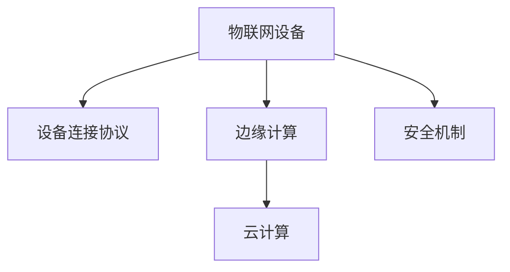

                 

# 物联网（IoT）入门：连接设备

> 关键词：物联网,设备连接,传感器,数据采集,协议栈,安全,云计算

## 1. 背景介绍

### 1.1 问题由来

物联网（IoT），简称为“物联网”，是指通过互联网将传感器、设备、应用等各个独立部分连接起来，从而实现信息交互、数据共享、智能控制等目标的网络技术。在当今社会，随着数字化、网络化、智能化的趋势不断深入，物联网技术的应用已经渗透到工业生产、智能家居、智慧城市、智慧农业等多个领域，极大地提升了生产效率和生活质量。

然而，物联网技术的成功应用，离不开设备之间的有效连接。只有确保设备之间的数据互通、指令互认，才能实现真正的智能化和自动化。因此，如何高效地连接和管理物联网设备，成为了物联网技术发展中的一个重要议题。

### 1.2 问题核心关键点

物联网设备连接的核心关键点主要包括以下几点：

1. **标准化通信协议**：不同设备之间的通信需要遵循统一的标准化协议，以确保数据传输的稳定性和可靠性。
2. **低功耗和高效能**：物联网设备往往需要长时间运行，低功耗设计和高能效管理是设计中的关键考虑因素。
3. **安全性和隐私保护**：物联网设备通常涉及敏感数据，保障数据安全、保护用户隐私是设计中的首要任务。
4. **云计算和大数据分析**：物联网设备生成的海量数据需要借助云计算和大数据技术进行存储、处理和分析，以实现智能决策和优化。
5. **边缘计算和本地处理**：对于一些对实时性和计算要求较高的应用场景，边缘计算和本地处理能力是必不可少的。

### 1.3 问题研究意义

了解物联网设备的连接技术，对于推动物联网技术的发展和应用具有重要意义：

1. **提升设备互操作性**：统一的通信协议和标准化的接口设计，可以大大提升设备之间的互操作性，降低集成和维护成本。
2. **优化能源利用**：通过低功耗设计和高能效管理，可以延长设备的生命周期，降低能源消耗和运营成本。
3. **增强数据安全**：数据加密、身份认证等安全机制的引入，可以保障数据传输的安全性和隐私保护。
4. **促进技术融合**：物联网技术与其他前沿技术（如人工智能、区块链、5G等）的融合，可以拓展物联网应用的边界，提升其智能化水平。
5. **推动产业发展**：物联网技术的应用落地，可以推动智能制造、智能物流、智能家居等新业态的发展，促进经济转型和产业升级。

## 2. 核心概念与联系

### 2.1 核心概念概述

为更好地理解物联网设备连接技术，本节将介绍几个密切相关的核心概念：

- **物联网设备（IoT Device）**：指通过传感器、控制器等设备，可以采集数据、执行指令、实现信息交互的物理实体。
- **设备连接协议（Device Connectivity Protocol）**：指物联网设备之间通信遵循的标准化协议，如MQTT、CoAP、HTTP等。
- **边缘计算（Edge Computing）**：指在靠近数据源（如设备、传感器）的一侧进行数据处理和分析，以实现低延迟、高效能的计算需求。
- **云计算（Cloud Computing）**：指通过互联网提供按需、可扩展的计算资源和数据服务，如数据存储、数据分析、应用程序托管等。
- **安全机制（Security Mechanism）**：指保障物联网设备连接和数据传输安全的各类技术和措施，如数据加密、身份认证、访问控制等。

这些核心概念之间的逻辑关系可以通过以下Mermaid流程图来展示：



这个流程图展示了大语言模型的核心概念及其之间的关系：

1. 物联网设备通过设备连接协议进行通信。
2. 边缘计算对数据进行初步处理和分析，以减少延迟和提高效率。
3. 云计算负责大规模数据存储和处理，为应用提供强大的计算能力。
4. 安全机制确保数据传输和设备连接的稳定性、可靠性。

## 3. 核心算法原理 & 具体操作步骤

### 3.1 算法原理概述

物联网设备连接的核心算法原理主要围绕以下几个方面展开：

1. **标准化协议**：通过定义统一的通信协议，确保不同设备之间的数据交换和指令执行。
2. **数据加密和身份认证**：使用加密技术和身份认证机制，保障数据传输的安全性和设备的唯一性。
3. **数据压缩和传输优化**：通过数据压缩和传输优化技术，降低通信带宽和延迟，提高传输效率。
4. **多跳网络设计**：采用多跳网络设计，通过中间节点进行数据转发，实现更广范围的设备连接。
5. **边缘计算和本地处理**：在靠近数据源的一侧进行数据处理和分析，减少数据传输量和计算负荷。
6. **分布式系统架构**：通过分布式系统架构，实现设备间的协同工作和负载均衡。

### 3.2 算法步骤详解

物联网设备连接的具体操作步骤如下：

1. **设备选择和设计**：选择合适的传感器和控制器，根据应用场景设计设备的通信接口和数据采集功能。
2. **协议栈配置**：为设备配置通信协议栈，确保设备遵循统一的标准化协议。
3. **数据加密和身份认证**：实现数据加密和设备身份认证，保障数据传输和设备连接的私密性和安全性。
4. **数据采集和传输**：通过传感器采集数据，并通过通信协议将数据传输到云平台或边缘计算节点。
5. **数据处理和分析**：在云平台或边缘计算节点，对数据进行存储、处理和分析，提取有价值的信息。
6. **智能决策和优化**：根据数据处理结果，进行智能决策和优化，指导设备执行相应的操作。
7. **监测和维护**：实时监测设备状态和网络性能，及时发现和处理故障，确保系统稳定运行。

### 3.3 算法优缺点

物联网设备连接的核心算法具有以下优点：

1. **提升设备互操作性**：统一的标准化协议和接口设计，使得设备之间的互操作性大大提升，降低了集成和维护成本。
2. **优化数据传输和处理**：数据加密、身份认证、数据压缩等技术的应用，确保了数据传输的安全性和高效性。
3. **降低能耗和运营成本**：低功耗设计和高能效管理，延长了设备的生命周期，降低了能源消耗和运营成本。
4. **增强系统稳定性和可靠性**：多跳网络设计、分布式系统架构和实时监测机制，提升了系统的稳定性和可靠性。

同时，这些算法也存在以下局限性：

1. **协议复杂性**：标准化协议的设计和配置，可能带来一定的复杂性和学习成本。
2. **安全风险**：虽然安全机制可以保障数据传输和设备连接的安全性，但在面对复杂的网络环境和多种攻击手段时，仍需持续优化。
3. **数据存储和处理成本**：大规模数据的存储和处理，需要投入大量计算资源和存储资源。
4. **实时性要求高**：对于对实时性要求较高的应用场景，需要采用边缘计算和本地处理技术，对硬件资源和计算能力有较高要求。

### 3.4 算法应用领域

物联网设备连接的核心算法在多个领域得到广泛应用，例如：

- **智能家居**：通过连接智能家电、智能锁、智能照明等设备，实现家庭自动化和远程控制。
- **智慧城市**：通过连接路灯、传感器、监控摄像头等设备，实现城市交通管理、环境监测、公共安全等功能。
- **智能制造**：通过连接生产线设备、传感器、控制终端，实现生产过程的自动化和智能化。
- **智慧农业**：通过连接土壤传感器、气象站、农田监测设备，实现精准农业和智慧灌溉。
- **智能物流**：通过连接货物追踪器、车辆定位系统、仓储管理系统，实现物流自动化和实时追踪。

除了上述这些典型应用外，物联网设备连接的核心算法还被创新性地应用于医疗健康、工业控制、能源管理等更多领域，为各行各业带来了新的技术突破和发展机遇。

## 4. 数学模型和公式 & 详细讲解 & 举例说明

### 4.1 数学模型构建

本节将使用数学语言对物联网设备连接的核心算法进行更加严格的刻画。

记物联网设备为 $D$，数据采集为 $S$，数据传输为 $T$，数据处理为 $P$，智能决策为 $D$，其中 $S \rightarrow T \rightarrow P \rightarrow D$ 表示数据流向和处理流程。假设 $D$ 由 $n$ 个设备组成，每个设备的状态为 $x_i$，$i \in [1, n]$。

定义设备连接协议为 $C$，数据加密为 $E$，数据压缩为 $Z$，数据传输速率为 $R$，数据处理时间为 $P_i$，$i \in [1, n]$。则物联网设备连接的整体模型可表示为：

$$
M(D, S, T, P, D) = \left\{
\begin{aligned}
&C(D) \\
&E(D) \\
&Z(D) \\
&R(D) \\
&P_i(D) \\
&D(D) \\
\end{aligned}
\right.
$$

其中，$C(D)$ 表示设备连接协议的配置和优化，$E(D)$ 表示数据加密过程，$Z(D)$ 表示数据压缩过程，$R(D)$ 表示数据传输速率，$P_i(D)$ 表示设备 $i$ 的数据处理时间，$D(D)$ 表示智能决策过程。

### 4.2 公式推导过程

以下我们以智能家居系统为例，推导数据采集、传输和处理的具体公式。

假设智能家居系统中包含 $n$ 个设备，每个设备的数据采集速率为 $s_i$，数据传输速率为 $r_i$，数据处理速率为 $p_i$，单位均为MB/s。则数据采集的总速率为：

$$
S = \sum_{i=1}^n s_i
$$

数据传输的总速率为：

$$
T = \sum_{i=1}^n r_i
$$

数据处理的总时间为：

$$
P = \sum_{i=1}^n p_i
$$

数据采集、传输和处理的总时间 $T_{\text{total}}$ 为：

$$
T_{\text{total}} = \frac{S}{R} + P
$$

其中 $R$ 为数据传输速率，$S$ 为数据采集速率，$P$ 为数据处理时间。

### 4.3 案例分析与讲解

以智慧农业为例，分析物联网设备连接的核心算法在实际应用中的具体实现。

智慧农业系统中，通过连接土壤传感器、气象站、农田监测设备等，实时采集农田环境数据，包括土壤湿度、温度、光照强度等。采集到的数据经过初步处理和分析，存储在云端数据库中。根据数据处理结果，智能决策系统可以指导施肥、灌溉、病虫害防治等操作，实现精准农业。

具体实现步骤如下：

1. **设备选择和设计**：选择适合的传感器和控制器，设计设备的通信接口和数据采集功能。
2. **协议栈配置**：为设备配置MQTT协议栈，确保设备遵循统一的标准化协议。
3. **数据加密和身份认证**：实现数据加密和设备身份认证，保障数据传输和设备连接的私密性和安全性。
4. **数据采集和传输**：通过土壤传感器、气象站、农田监测设备采集数据，并通过MQTT协议传输到云端。
5. **数据处理和分析**：在云端，对采集到的数据进行存储和处理，提取有价值的信息，如土壤湿度、温度等。
6. **智能决策和优化**：根据数据处理结果，进行智能决策和优化，指导施肥、灌溉、病虫害防治等操作。
7. **监测和维护**：实时监测设备状态和网络性能，及时发现和处理故障，确保系统稳定运行。

## 5. 项目实践：代码实例和详细解释说明

### 5.1 开发环境搭建

在进行物联网设备连接开发前，我们需要准备好开发环境。以下是使用Python进行开发的环境配置流程：

1. 安装Anaconda：从官网下载并安装Anaconda，用于创建独立的Python环境。

2. 创建并激活虚拟环境：
```bash
conda create -n iot-env python=3.8 
conda activate iot-env
```

3. 安装必要的库：
```bash
pip install paho-mqtt pycurl requests
```

4. 安装物联网相关库：
```bash
pip install pymqtt pyzmq
```

完成上述步骤后，即可在`iot-env`环境中开始物联网设备连接开发。

### 5.2 源代码详细实现

下面以MQTT协议为例，给出使用Python进行设备连接和数据传输的代码实现。

首先，定义MQTT客户端类：

```python
import paho.mqtt.client as mqtt

class MQTTClient(mqtt.Client):
    def __init__(self, broker, topic, on_connect=None, on_message=None):
        super().__init__()
        self.broker = broker
        self.topic = topic
        self.on_connect = on_connect
        self.on_message = on_message
        self.connected = False

    def on_connect(self, client, userdata, flags, rc):
        if rc == 0:
            self.connected = True
            if self.on_connect:
                self.on_connect()
        else:
            print(f"Connection failed with result code {rc}")

    def on_message(self, client, userdata, msg):
        if self.on_message:
            self.on_message(msg.topic, msg.payload)
```

然后，定义设备连接和数据传输的函数：

```python
def connect_device(broker, topic, on_connect=None, on_message=None):
    client = MQTTClient(broker, topic, on_connect=on_connect, on_message=on_message)
    client.connect(broker)
    client.subscribe(topic)
    if on_connect:
        on_connect()
    while not client.connected:
        pass
    return client

def publish_data(client, topic, data):
    client.publish(topic, data)
```

最后，启动设备连接和数据传输：

```python
broker = "iot.example.com"
topic = "temperature"
on_connect = lambda: print("Connected to broker")
on_message = lambda topic, payload: print(f"Received data: {payload}")

client = connect_device(broker, topic, on_connect, on_message)
publish_data(client, topic, "25°C")
```

以上就是使用Python进行MQTT协议的设备连接和数据传输的完整代码实现。可以看到，Python的MQTT库提供了方便的API接口，能够轻松实现设备的连接和数据传输。

### 5.3 代码解读与分析

让我们再详细解读一下关键代码的实现细节：

**MQTTClient类**：
- `__init__`方法：初始化MQTT客户端，设置broker、topic、on_connect和on_message回调函数。
- `on_connect`方法：在连接成功后触发，可以执行一些初始化操作。
- `on_message`方法：在接收到消息后触发，可以对消息进行处理。

**connect_device函数**：
- 创建MQTT客户端，连接broker，订阅topic。
- 在连接成功后触发on_connect回调函数。
- 循环等待连接建立，返回已连接的MQTT客户端。

**publish_data函数**：
- 通过MQTT客户端发布数据到指定topic。

这些代码展示了MQTT协议在Python中的应用，能够实现简单的设备连接和数据传输。在实际应用中，还需要考虑更复杂的数据处理和智能决策逻辑，但基本的连接和传输机制已经足够支撑物联网系统的构建。

## 6. 实际应用场景

### 6.1 智能家居系统

基于MQTT协议的物联网设备连接技术，可以广泛应用于智能家居系统的构建。通过连接智能家电、智能锁、智能照明等设备，实现家庭自动化和远程控制。

具体而言，可以将智能家居设备连接到家庭网关或集中控制器，通过MQTT协议进行数据传输。例如，智能灯泡可以通过MQTT协议将亮度和颜色信息发送给家庭网关，网关再将数据转发到云平台或智能家居App。用户可以通过App控制灯泡，甚至设置定时开启和关闭。

### 6.2 智慧城市

基于MQTT协议的物联网设备连接技术，可以应用于智慧城市的管理和监控。通过连接路灯、传感器、监控摄像头等设备，实现城市交通管理、环境监测、公共安全等功能。

例如，智慧交通系统可以通过传感器采集交通流量、车速、车辆信息等数据，通过MQTT协议传输到城市管理中心。管理中心对数据进行处理和分析，优化交通信号灯的控制策略，实现交通流量均衡和交通事故预防。

### 6.3 智能制造

基于MQTT协议的物联网设备连接技术，可以应用于智能制造的生产线和设备监控。通过连接生产线设备、传感器、控制终端等，实现生产过程的自动化和智能化。

例如，智能制造系统可以通过传感器采集设备运行状态、原料消耗量、产品质量等数据，通过MQTT协议传输到生产管理中心。管理中心对数据进行处理和分析，优化生产流程，提高生产效率和产品质量。

### 6.4 未来应用展望

随着物联网技术的发展，基于MQTT协议的设备连接技术将在更多领域得到应用，为各行各业带来新的变革。

在智慧农业领域，通过连接土壤传感器、气象站、农田监测设备等，实时采集农田环境数据，实现精准农业和智慧灌溉。在医疗健康领域，通过连接健康监测设备、穿戴设备，实时采集用户的健康数据，实现健康管理和远程诊疗。在工业控制领域，通过连接设备传感器、控制系统，实现设备的远程监控和自动化维护。

此外，物联网技术与其他前沿技术的融合，如5G、区块链、人工智能等，将进一步拓展物联网设备连接的应用边界，提升其智能化水平。相信在未来的物联网时代，基于MQTT协议的设备连接技术将发挥越来越重要的作用，为各行各业带来更高效的智能化管理和服务。

## 7. 工具和资源推荐

### 7.1 学习资源推荐

为了帮助开发者系统掌握物联网设备连接技术，这里推荐一些优质的学习资源：

1. MQTT官方文档：MQTT协议的详细文档，提供了协议规范、API接口和示例代码，是理解MQTT协议的重要资料。
2. paho-mqtt库文档：MQTT客户端库的详细文档，提供了库的使用说明和示例代码，是实现MQTT协议的具体工具。
3. IoT学习平台：如IoT For All、SmartThings等，提供了丰富的物联网学习资源和案例，帮助开发者系统学习和实践。
4. 物联网开发者社区：如IoT Stack Exchange、ThingWorx开发者社区，提供问答、技术讨论、资源共享等社区服务，帮助开发者解决技术难题。
5. 物联网相关书籍：如《物联网技术基础》、《IoT设计与实现》等，提供了物联网技术基础和实战案例，是深入学习物联网技术的推荐读物。

通过对这些资源的学习实践，相信你一定能够快速掌握物联网设备连接的核心技术，并用于解决实际的物联网问题。

### 7.2 开发工具推荐

高效的开发离不开优秀的工具支持。以下是几款用于物联网设备连接开发的常用工具：

1. paho-mqtt：Python的MQTT客户端库，提供了简单易用的API接口，支持连接MQTT服务器、订阅和发布消息。
2. PyZMQ：Python的ZMQ客户端库，支持零拷贝通信，适用于高并发和高性能的物联网系统。
3. Eclipse Paho：Java的MQTT客户端库，支持连接MQTT服务器、订阅和发布消息，是Java开发者常用的MQTT工具。
4. Arduino：开源硬件平台，支持嵌入式系统的开发和调试，适用于物联网设备的硬件开发。
5. ESP8266/ESP32：物联网芯片，支持Wi-Fi和蓝牙通信，适用于低功耗物联网设备的开发。

合理利用这些工具，可以显著提升物联网设备连接开发的速度和质量，加快创新迭代的步伐。

### 7.3 相关论文推荐

物联网设备连接的核心技术在学术界也得到了广泛的研究。以下是几篇奠基性的相关论文，推荐阅读：

1. MQTT协议规范：详细描述了MQTT协议的规范和应用场景，是理解MQTT协议的重要基础。
2. MQTT协议的安全性：研究MQTT协议的安全性问题，包括身份认证、数据加密、消息认证等，提出了一些改进方案。
3. 物联网边缘计算：探讨了物联网边缘计算的架构和应用，提出了一些优化方案，如数据压缩、边缘处理等。
4. 物联网设备安全：研究了物联网设备连接的安全性问题，包括数据传输安全、设备身份认证等，提出了一些安全机制和措施。
5. IoT数据处理：研究了物联网设备生成的海量数据存储和处理问题，提出了一些高效的数据处理和分析算法。

这些论文代表了物联网设备连接技术的研究方向和前沿进展，通过学习这些前沿成果，可以帮助研究者把握学科前进方向，激发更多的创新灵感。

## 8. 总结：未来发展趋势与挑战

### 8.1 总结

本文对物联网设备连接的核心技术进行了全面系统的介绍。首先阐述了物联网设备连接技术的研究背景和意义，明确了设备连接技术在提升设备互操作性、优化数据传输和处理、降低能耗和运营成本等方面的独特价值。其次，从原理到实践，详细讲解了设备连接的核心算法和操作步骤，给出了物联网设备连接的完整代码实例。同时，本文还广泛探讨了设备连接技术在智能家居、智慧城市、智能制造等多个行业领域的应用前景，展示了设备连接技术的广阔前景。

通过本文的系统梳理，可以看到，基于MQTT协议的设备连接技术正在成为物联网技术发展中的一个重要范式，极大地提升了设备之间的互操作性，优化了数据传输和处理效率，降低了能耗和运营成本。未来，伴随MQTT协议的持续演进和技术融合，相信物联网设备连接技术将迎来更多的应用场景和发展机遇。

### 8.2 未来发展趋势

物联网设备连接的核心技术将呈现以下几个发展趋势：

1. **协议标准化**：标准化协议的发展和推广，将进一步提升设备之间的互操作性，降低集成和维护成本。
2. **低功耗和高效能**：低功耗设计和高能效管理，将使物联网设备在长时间运行中保持高效稳定的运行状态。
3. **边缘计算的普及**：边缘计算和本地处理能力的应用，将进一步提升数据处理效率和实时性。
4. **云计算与物联网的融合**：云计算和大数据技术将为物联网提供更强大的计算和存储能力，实现更智能的决策和优化。
5. **多模态数据融合**：将物联网与其他技术（如5G、人工智能等）的融合，将拓展物联网应用的边界，提升其智能化水平。

以上趋势凸显了物联网设备连接技术的广阔前景。这些方向的探索发展，必将进一步提升物联网系统的性能和应用范围，为各行各业带来新的技术突破和发展机遇。

### 8.3 面临的挑战

尽管物联网设备连接技术已经取得了瞩目成就，但在迈向更加智能化、普适化应用的过程中，它仍面临着诸多挑战：

1. **协议复杂性**：标准化协议的设计和配置，可能带来一定的复杂性和学习成本。
2. **安全风险**：虽然安全机制可以保障数据传输和设备连接的安全性，但在面对复杂的网络环境和多种攻击手段时，仍需持续优化。
3. **数据存储和处理成本**：大规模数据的存储和处理，需要投入大量计算资源和存储资源。
4. **实时性要求高**：对于对实时性要求较高的应用场景，需要采用边缘计算和本地处理技术，对硬件资源和计算能力有较高要求。

### 8.4 研究展望

面对物联网设备连接技术面临的挑战，未来的研究需要在以下几个方面寻求新的突破：

1. **探索无监督和半监督连接方法**：摆脱对大规模标注数据的依赖，利用自监督学习、主动学习等无监督和半监督范式，最大限度利用非结构化数据，实现更加灵活高效的设备连接。
2. **研究参数高效和计算高效的连接范式**：开发更加参数高效的连接方法，在固定大部分预训练参数的同时，只更新极少量的任务相关参数。同时优化连接模型的计算图，减少前向传播和反向传播的资源消耗，实现更加轻量级、实时性的部署。
3. **引入更多先验知识**：将符号化的先验知识，如知识图谱、逻辑规则等，与神经网络模型进行巧妙融合，引导设备连接过程学习更准确、合理的语言模型。同时加强不同模态数据的整合，实现视觉、语音等多模态信息与文本信息的协同建模。
4. **结合因果分析和博弈论工具**：将因果分析方法引入设备连接模型，识别出模型决策的关键特征，增强输出解释的因果性和逻辑性。借助博弈论工具刻画人机交互过程，主动探索并规避模型的脆弱点，提高系统稳定性。
5. **纳入伦理道德约束**：在模型训练目标中引入伦理导向的评估指标，过滤和惩罚有偏见、有害的输出倾向。同时加强人工干预和审核，建立模型行为的监管机制，确保输出符合人类价值观和伦理道德。

这些研究方向的探索，必将引领物联网设备连接技术迈向更高的台阶，为构建安全、可靠、可解释、可控的智能系统铺平道路。面向未来，物联网设备连接技术还需要与其他人工智能技术进行更深入的融合，如知识表示、因果推理、强化学习等，多路径协同发力，共同推动自然语言理解和智能交互系统的进步。只有勇于创新、敢于突破，才能不断拓展物联网设备的连接边界，让智能技术更好地造福人类社会。

## 9. 附录：常见问题与解答

**Q1：如何选择适合的MQTT服务器？**

A: 选择适合的MQTT服务器，需要考虑以下几个因素：
1. **性能和稳定性**：服务器需要具备较高的性能和稳定性，能够支持大规模的连接和数据传输。
2. **可靠性**：服务器需要具备高可靠性和高可用性，确保数据传输的完整性和一致性。
3. **安全性**：服务器需要具备完善的安全机制，确保数据传输和设备连接的私密性和安全性。
4. **易用性和可扩展性**：服务器需要具备易用性和可扩展性，支持不同设备和应用场景的快速集成和扩展。

常用的MQTT服务器包括HiveMQ、RabbitMQ、IoT Hub等，开发者可以根据自己的需求选择合适的服务器。

**Q2：如何优化MQTT客户端的性能？**

A: 优化MQTT客户端的性能，可以考虑以下几个方面：
1. **减少通信延迟**：通过优化网络配置、使用代理服务器、缩短数据传输周期等方法，减少通信延迟。
2. **减少数据传输量**：通过数据压缩、数据聚合等方法，减少数据传输量，降低传输成本。
3. **使用异步编程**：使用异步编程技术，提升客户端的处理能力和响应速度。
4. **缓存数据**：在客户端缓存数据，减少对服务器的频繁访问，提高系统的稳定性和性能。

通过这些优化措施，可以显著提升MQTT客户端的性能和可靠性。

**Q3：如何在物联网设备之间实现跨平台连接？**

A: 在物联网设备之间实现跨平台连接，需要考虑以下几个因素：
1. **标准化协议**：选择标准化的通信协议，如MQTT、CoAP等，确保设备之间的数据交换和指令执行。
2. **兼容性强**：选择兼容性强的设备，确保设备之间能够互操作。
3. **跨平台支持**：选择支持跨平台开发和部署的开发工具和平台，如Python、Java、Arduino等。

通过这些措施，可以实现跨平台连接的物联网系统，提升系统的灵活性和可扩展性。

**Q4：如何保障物联网设备连接的安全性？**

A: 保障物联网设备连接的安全性，需要考虑以下几个方面：
1. **数据加密**：使用数据加密技术，确保数据传输的私密性和完整性。
2. **身份认证**：使用身份认证机制，确保设备的唯一性和合法性。
3. **访问控制**：使用访问控制策略，限制设备和用户的访问权限，防止非法访问。
4. **安全审计**：使用安全审计工具，记录和监控设备连接和数据传输的过程，及时发现和处理安全问题。

通过这些措施，可以显著提升物联网设备连接的安全性，保障数据传输和设备连接的私密性和安全性。

**Q5：如何优化物联网设备的能耗？**

A: 优化物联网设备的能耗，可以考虑以下几个方面：
1. **低功耗设计**：采用低功耗设计，减少设备的能耗和运行成本。
2. **动态休眠**：在设备不活跃时，进入休眠状态，降低能耗。
3. **节能算法**：使用节能算法，优化设备的运行效率，减少能耗。
4. **多模态融合**：将不同模态的信息进行融合，提升设备的智能化水平，减少能耗。

通过这些优化措施，可以显著降低物联网设备的能耗，延长设备的使用寿命，降低运营成本。

---

作者：禅与计算机程序设计艺术 / Zen and the Art of Computer Programming

