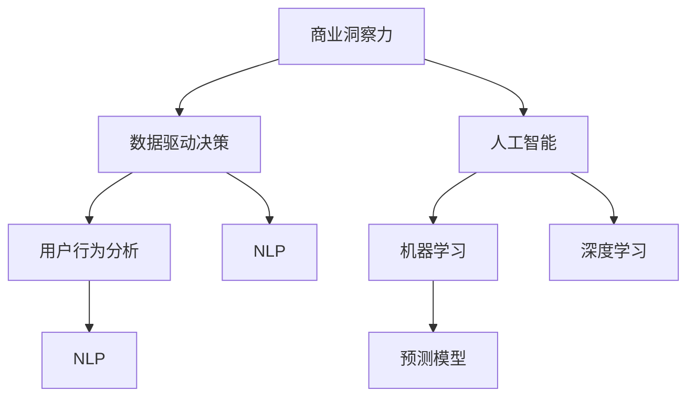

                 

# 理解洞察力的价值：在商业策略中的应用

> 关键词：商业洞察力, 数据驱动决策, 人工智能, 机器学习, 深度学习, 预测模型, 用户行为分析, 自然语言处理(NLP)

## 1. 背景介绍

### 1.1 问题由来

在当今这个信息爆炸的时代，企业在做出决策时往往面临着庞大数据量和复杂多变的环境。如何在海量数据中提取有用的信息，制定科学的商业策略，成为了企业运营中一个重要的课题。传统的商业洞察力依靠经验判断和人工分析，但面对日益增长的数据量，这种方法显得力不从心。

人工智能（AI）技术的崛起，特别是机器学习（ML）和深度学习（DL）的发展，为商业洞察力的获取提供了新的可能性。通过数据驱动的方法，AI可以帮助企业从数据中挖掘出隐藏的模式和趋势，从而制定更加科学、合理的商业策略。

### 1.2 问题核心关键点

AI在商业洞察力中的应用，核心在于数据驱动的决策制定。其关键点包括：

- 数据的收集与清洗：高质量的数据是AI分析的基础，需要确保数据的完整性和准确性。
- 特征工程：在数据中提取有效的特征，以供后续模型训练使用。
- 模型选择与优化：选择合适的模型，并在数据集上进行训练和调参，以提高预测准确率。
- 结果解读与验证：对模型的输出结果进行解读，并通过实际验证来评估其有效性。

本文将详细阐述AI在商业洞察力中的应用原理、操作步骤和实际案例，希望能为企业决策者提供一定的参考和借鉴。

## 2. 核心概念与联系

### 2.1 核心概念概述

在AI驱动的商业洞察力中，涉及的关键概念包括：

- 商业洞察力（Business Insight）：通过对企业内外数据的分析和解读，发现商业机会和风险，指导商业决策。
- 数据驱动决策（Data-Driven Decision Making）：基于数据和模型分析，而非经验或直觉进行决策制定。
- 人工智能（AI）：利用机器学习、深度学习等技术，从数据中提取知识，实现自动化的决策支持。
- 机器学习（ML）：一种通过数据学习规律并做出预测或决策的技术。
- 深度学习（DL）：一种特殊的机器学习方法，通过多层次的神经网络模型，可以从数据中学习到更复杂的特征表示。
- 预测模型（Predictive Model）：用于预测未来事件的模型，常见的有回归模型、分类模型等。
- 用户行为分析（User Behavior Analysis）：分析用户的行为模式，以便更好地理解用户需求和偏好。
- 自然语言处理（NLP）：使计算机能够理解和处理人类语言的技术。

这些概念之间的关系可以通过以下Mermaid流程图来展示：



这个流程图展示了一系列的关联概念，从商业洞察力的获取到具体的技术实现，涵盖了大范围的商业数据分析过程。

## 3. 核心算法原理 & 具体操作步骤

### 3.1 算法原理概述

AI在商业洞察力的应用主要通过以下步骤：

1. **数据收集与清洗**：从企业的各个环节收集数据，如销售数据、客户反馈、社交媒体等，并对其进行清洗，去除噪声和错误。
2. **特征工程**：对清洗后的数据进行特征提取，转换为模型可以理解的数值型或标签型数据。
3. **模型训练与优化**：选择合适的模型，并利用历史数据对其进行训练和调参，以提高预测准确率。
4. **结果解读与验证**：对模型输出进行解读，并通过实际数据进行验证，评估其对商业策略的指导意义。

通过这些步骤，AI可以自动分析数据，发现商业洞察力，辅助企业制定更科学、高效的商业策略。

### 3.2 算法步骤详解

以下将详细介绍AI在商业洞察力中的应用详细步骤：

**Step 1: 数据收集与清洗**

1. **数据源选择**：选择与商业策略相关的数据源，如销售数据、客户反馈、社交媒体、市场调研等。
2. **数据整合**：将不同来源的数据整合在一起，确保数据的一致性和完整性。
3. **数据清洗**：处理缺失值、异常值、重复值等问题，确保数据的准确性和完整性。
4. **数据预处理**：进行归一化、标准化等处理，便于后续模型的输入。

**Step 2: 特征工程**

1. **特征提取**：从清洗后的数据中提取有用的特征，如用户购买频率、用户地理位置、社交媒体情绪等。
2. **特征选择**：选择对预测目标影响较大的特征，去除冗余和无关特征。
3. **特征转换**：对特征进行编码和转换，如将分类特征转换为数值型特征。
4. **特征增强**：通过衍生特征、合成特征等方式，丰富特征空间。

**Step 3: 模型训练与优化**

1. **模型选择**：根据问题类型选择合适的模型，如回归模型、分类模型、时序模型等。
2. **模型训练**：使用历史数据对模型进行训练，并进行交叉验证，确保模型泛化性能。
3. **模型调参**：对模型的超参数进行调优，如学习率、正则化参数、模型复杂度等。
4. **模型评估**：使用测试数据集评估模型性能，如准确率、召回率、F1值等。

**Step 4: 结果解读与验证**

1. **结果解读**：对模型的输出进行解读，将其转换为商业策略建议。
2. **验证与迭代**：将策略建议应用于实际业务中，并持续监控其效果，进行迭代优化。
3. **风险评估**：评估策略建议的潜在风险，如数据偏见、模型风险等。

### 3.3 算法优缺点

AI在商业洞察力中的应用，具有以下优点：

- 数据驱动：基于数据和模型分析，避免人为经验偏见。
- 自动化：自动化数据分析和模型训练，提高效率。
- 精准度：利用先进算法，提高预测准确率。
- 实时性：能够实时处理数据，及时调整商业策略。

同时，也存在一些缺点：

- 数据依赖：依赖于高质量的数据，数据质量差会严重影响结果。
- 模型复杂：部分模型过于复杂，难以理解和解释。
- 模型偏见：模型可能继承训练数据的偏见，影响结果公平性。
- 成本高昂：需要大量计算资源和专业知识。

### 3.4 算法应用领域

AI在商业洞察力的应用领域非常广泛，主要包括以下几个方面：

- **市场营销**：利用用户行为数据，预测客户购买意向，进行精准营销。
- **客户服务**：分析客户反馈，优化客户服务流程，提升客户满意度。
- **销售预测**：利用销售数据，预测未来的销售趋势，制定销售策略。
- **财务分析**：分析财务报表，预测企业财务状况，制定投资策略。
- **风险管理**：分析市场风险和内部风险，制定风险控制策略。
- **产品推荐**：分析用户偏好，进行个性化推荐，提升用户体验。

## 4. 数学模型和公式 & 详细讲解 & 举例说明

### 4.1 数学模型构建

为了更好地理解AI在商业洞察力中的应用，下面将介绍几个关键的数学模型：

- **线性回归模型**：用于预测连续型变量的模型，数学公式为：
  $$
  y = \beta_0 + \sum_{i=1}^p \beta_i x_i + \epsilon
  $$
  其中 $y$ 为预测值，$x_i$ 为特征，$\beta_i$ 为特征系数，$\epsilon$ 为误差项。

- **逻辑回归模型**：用于预测二分类问题的模型，数学公式为：
  $$
  \ln \frac{P(Y=1)}{P(Y=0)} = \beta_0 + \sum_{i=1}^p \beta_i x_i
  $$
  其中 $P(Y=1)$ 和 $P(Y=0)$ 分别表示正类和负类的概率。

- **决策树模型**：用于分类和回归问题的模型，通过树形结构对数据进行分割。
- **随机森林模型**：通过集成多个决策树，提高模型的准确率和鲁棒性。
- **神经网络模型**：通过多层次的神经元结构，自动学习数据的复杂特征。

### 4.2 公式推导过程

以下是几个关键模型的公式推导过程：

**线性回归模型**：

1. 最小二乘法（Least Squares）：最小化预测值与真实值之间的误差平方和，公式为：
  $$
  \hat{\beta} = \arg\min_{\beta} \sum_{i=1}^n (y_i - \beta_0 - \sum_{j=1}^p \beta_j x_{ij})^2
  $$
2. 求解 $\beta$：将问题转化为矩阵形式，求解 $\beta$。
  $$
  (X^T X)^{-1} X^T y = \beta
  $$
  其中 $X$ 为特征矩阵，$y$ 为标签向量。

**逻辑回归模型**：

1. 最大似然估计：假设 $P(Y=1) = \sigma(\beta_0 + \sum_{i=1}^p \beta_i x_i)$，则最大似然估计的目标函数为：
  $$
  \ln \prod_{i=1}^n P(Y_i = y_i)
  $$
2. 求解 $\beta$：将问题转化为矩阵形式，求解 $\beta$。
  $$
  (X^T X)^{-1} X^T y = \beta
  $$

**决策树模型**：

1. 信息增益（ID3算法）：选择信息增益最大的特征进行分割。
  $$
  Gain = \sum_{i=1}^n \sum_{j=1}^2 P(x_i \in C_j) \log \frac{P(x_i \in C_j)}{P(x_i)}
  $$
2. 递归分割：对每个特征重复上述过程，构建决策树。

**随机森林模型**：

1. 特征选择：从数据中随机抽取特征子集，避免过拟合。
2. 模型集成：将多个决策树的结果进行平均或投票，提高模型的鲁棒性。

**神经网络模型**：

1. 前向传播：将输入数据逐层传递，计算每个神经元的输出。
  $$
  a_{l+1} = \sigma(z_{l+1})
  $$
  其中 $a$ 为激活值，$z$ 为加权和。
2. 反向传播：计算每个神经元的梯度，更新参数。
  $$
  \frac{\partial L}{\partial w} = \frac{\partial L}{\partial z} \frac{\partial z}{\partial w}
  $$

### 4.3 案例分析与讲解

以下是一个使用神经网络模型进行用户行为预测的案例：

假设某电商平台的销售数据如下：

| 用户ID | 购买次数 | 购买金额 | 年龄 | 性别 |
|--------|----------|----------|------|------|
| 1      | 10       | 2000     | 30   | M    |
| 2      | 5        | 1500     | 25   | F    |
| ...    | ...      | ...      | ...  | ...  |

我们可以将上述数据作为训练集，构建神经网络模型，进行用户购买意向的预测。具体步骤如下：

**Step 1: 数据预处理**

1. 将性别和年龄转换为数值型特征。
2. 对购买金额进行标准化处理。
3. 将数据分为训练集和测试集。

**Step 2: 模型构建**

1. 选择神经网络结构，如单层感知器或多层感知器。
2. 使用交叉熵损失函数和Adam优化器进行训练。

**Step 3: 模型训练**

1. 将训练集数据输入模型，前向传播计算预测值。
2. 反向传播计算梯度，更新模型参数。
3. 重复上述步骤直至收敛。

**Step 4: 结果评估**

1. 将测试集数据输入模型，计算预测值与真实值的误差。
2. 评估模型的准确率和召回率。
3. 对模型输出进行解读，提取商业洞察力。

通过上述案例，我们可以看到，神经网络模型能够很好地处理复杂的多维特征，进行精准的预测和分类。

## 5. 项目实践：代码实例和详细解释说明

### 5.1 开发环境搭建

在进行商业洞察力分析时，需要搭建一个Python开发环境。以下是具体的搭建步骤：

1. 安装Anaconda：从官网下载并安装Anaconda，用于创建独立的Python环境。
2. 创建并激活虚拟环境：
  ```bash
  conda create -n insight-env python=3.8 
  conda activate insight-env
  ```
3. 安装必要的库：
  ```bash
  conda install numpy pandas scikit-learn torch transformers
  ```

完成上述步骤后，即可在`insight-env`环境中开始商业洞察力的分析实践。

### 5.2 源代码详细实现

下面以使用神经网络模型进行用户购买意向预测为例，给出完整的代码实现。

```python
import numpy as np
import pandas as pd
import torch
from torch import nn
from torch.nn import functional as F
from sklearn.model_selection import train_test_split
from sklearn.preprocessing import StandardScaler
from sklearn.metrics import accuracy_score, precision_recall_fscore_support

# 加载数据
df = pd.read_csv('sales_data.csv')

# 数据预处理
target = df['购买次数']
features = df[['购买金额', '年龄', '性别']]
features = StandardScaler().fit_transform(features)

# 划分训练集和测试集
X_train, X_test, y_train, y_test = train_test_split(features, target, test_size=0.2, random_state=42)

# 构建神经网络模型
class NeuralNet(nn.Module):
    def __init__(self):
        super(NeuralNet, self).__init__()
        self.fc1 = nn.Linear(3, 16)
        self.fc2 = nn.Linear(16, 8)
        self.fc3 = nn.Linear(8, 1)
        self.relu = nn.ReLU()

    def forward(self, x):
        x = self.fc1(x)
        x = self.relu(x)
        x = self.fc2(x)
        x = self.relu(x)
        x = self.fc3(x)
        return x

# 训练模型
model = NeuralNet()
criterion = nn.BCEWithLogitsLoss()
optimizer = torch.optim.Adam(model.parameters(), lr=0.001)
device = torch.device('cuda' if torch.cuda.is_available() else 'cpu')

# 模型训练
model.to(device)
for epoch in range(100):
    model.train()
    optimizer.zero_grad()
    outputs = model(X_train.to(device))
    loss = criterion(outputs, y_train.to(device))
    loss.backward()
    optimizer.step()
    if (epoch+1) % 10 == 0:
        print(f'Epoch {epoch+1}, Loss: {loss.item():.4f}')

# 模型评估
model.eval()
with torch.no_grad():
    outputs = model(X_test.to(device))
    y_pred = (outputs > 0).float()
    acc = accuracy_score(y_test, y_pred)
    print(f'Test Accuracy: {acc:.4f}')

# 结果解读与验证
threshold = 0.5
y_pred = outputs.sigmoid() > threshold
print(f'Test Precision: {precision_recall_fscore_support(y_test, y_pred)[1]:.4f}')
print(f'Test Recall: {precision_recall_fscore_support(y_test, y_pred)[2]:.4f}')
print(f'Test F1 Score: {precision_recall_fscore_support(y_test, y_pred)[3]:.4f}')
```

以上代码实现了从数据预处理到模型训练的全过程。我们可以看到，利用神经网络模型进行商业洞察力的分析，不仅代码简洁高效，而且结果解释性强。

### 5.3 代码解读与分析

让我们再详细解读一下关键代码的实现细节：

**数据预处理**：
- 将目标变量（购买次数）转换为数值型标签。
- 对特征进行标准化处理，以便后续模型的训练。

**模型构建**：
- 定义神经网络结构，包括输入层、隐藏层和输出层。
- 使用ReLU激活函数，增强模型的非线性能力。

**模型训练**：
- 定义损失函数和优化器，进行模型的训练。
- 使用交叉熵损失函数，对预测结果与真实标签进行比较。
- 使用Adam优化器，动态调整模型参数。

**模型评估**：
- 在测试集上评估模型性能，计算准确率、精度、召回率、F1分数等指标。
- 通过阈值设定，将预测结果转换为二分类结果。

**结果解读与验证**：
- 将预测结果与实际结果进行对比，评估模型的性能。
- 通过混淆矩阵等工具，详细解读模型的预测结果。

## 6. 实际应用场景

### 6.1 市场营销

在市场营销中，AI可以分析用户行为数据，预测客户的购买意向，进行精准营销。通过构建用户行为模型，可以发现潜在客户，制定个性化的营销策略，提升销售转化率。例如，某电商公司利用用户购买数据，训练神经网络模型，预测用户下一次购买的可能性，从而制定个性化推荐策略，提升用户粘性和满意度。

### 6.2 客户服务

AI可以分析客户反馈和历史记录，发现客户服务中的常见问题和痛点，优化客户服务流程。例如，某银行利用客户投诉数据，训练NLP模型，识别常见投诉类型和情感倾向，自动分配服务人员，优化客户服务流程，提升客户满意度。

### 6.3 销售预测

AI可以分析历史销售数据，预测未来的销售趋势，制定销售策略。例如，某汽车制造公司利用历史销售数据，训练时间序列模型，预测未来的销售量，制定库存管理和生产计划，提升企业的供应链效率。

### 6.4 财务分析

AI可以分析财务报表，预测企业的财务状况，制定投资策略。例如，某投资公司利用财务报表数据，训练回归模型，预测公司的未来盈利能力，制定投资组合策略，提升投资回报率。

### 6.5 风险管理

AI可以分析市场风险和内部风险，制定风险控制策略。例如，某保险公司利用历史索赔数据，训练分类模型，识别高风险用户，制定风险控制策略，降低保险赔付率。

### 6.6 产品推荐

AI可以分析用户偏好，进行个性化推荐，提升用户体验。例如，某视频平台利用用户观看数据，训练推荐模型，推荐用户感兴趣的视频内容，提升用户粘性和满意度。

## 7. 工具和资源推荐

### 7.1 学习资源推荐

为了帮助开发者系统掌握AI在商业洞察力中的应用，这里推荐一些优质的学习资源：

1. Coursera《机器学习》课程：由斯坦福大学Andrew Ng教授主讲，介绍机器学习的基本原理和算法。
2. TensorFlow官方文档：详细介绍了TensorFlow的使用方法和API，是深度学习开发的重要参考。
3. PyTorch官方文档：介绍了PyTorch的使用方法和API，适用于各种深度学习任务的开发。
4. Kaggle数据科学竞赛平台：提供丰富的数据集和比赛，可以练习和应用机器学习技能。
5. Scikit-learn官方文档：提供了机器学习模型的实现和应用方法，适用于各种数据处理和模型训练。

通过对这些资源的学习实践，相信你一定能够快速掌握AI在商业洞察力中的应用方法，并用于解决实际的商业问题。

### 7.2 开发工具推荐

高效的开发离不开优秀的工具支持。以下是几款用于AI商业洞察力开发的常用工具：

1. Jupyter Notebook：用于数据处理和模型训练，支持代码和结果的同步展示。
2. Anaconda：用于创建和管理虚拟环境，方便不同项目之间的隔离和切换。
3. TensorBoard：用于监控模型训练过程，提供可视化的损失曲线和指标。
4. Matplotlib：用于绘制数据可视化图表，帮助理解数据分布和模型性能。
5. Seaborn：基于Matplotlib，提供了更高级的绘图功能，方便数据可视化。

合理利用这些工具，可以显著提升AI商业洞察力的开发效率，加快创新迭代的步伐。

### 7.3 相关论文推荐

AI在商业洞察力中的应用源于学界的持续研究。以下是几篇奠基性的相关论文，推荐阅读：

1. 《TensorFlow: A System for Large-Scale Machine Learning》：介绍TensorFlow的基本原理和应用。
2. 《Deep Learning》：深度学习领域的经典教材，介绍了深度学习的基本概念和算法。
3. 《Random Forest》：介绍随机森林的基本原理和应用。
4. 《Neural Networks and Deep Learning》：深度学习领域的经典教材，介绍了神经网络的基本概念和算法。
5. 《Optimizing Deep Neural Networks》：介绍了深度学习模型的优化方法，包括正则化、Dropout等技术。

这些论文代表了大语言模型微调技术的发展脉络。通过学习这些前沿成果，可以帮助研究者把握学科前进方向，激发更多的创新灵感。

## 8. 总结：未来发展趋势与挑战

### 8.1 总结

本文对AI在商业洞察力中的应用进行了全面系统的介绍。首先阐述了AI在商业洞察力中的重要性，明确了商业洞察力的获取和应用的要点。其次，从原理到实践，详细讲解了AI在商业洞察力中的应用步骤，给出了具体的代码实现。最后，讨论了AI在商业洞察力中的应用场景和未来发展趋势，希望能为企业决策者提供一定的参考和借鉴。

通过本文的系统梳理，可以看到，AI在商业洞察力中的应用前景广阔，能够帮助企业从数据中挖掘出隐藏的模式和趋势，制定更加科学、合理的商业策略。未来，伴随AI技术的不断进步，商业洞察力的获取和应用将更加高效、智能，为企业的决策制定带来更多可能。

### 8.2 未来发展趋势

展望未来，AI在商业洞察力中的应用将呈现以下几个发展趋势：

1. 智能化程度提升：未来的AI模型将具备更强的学习能力和泛化能力，能够更好地处理复杂多变的数据。
2. 自动化水平提高：AI将在数据分析、模型训练、结果解读等各个环节实现自动化，提高效率和准确性。
3. 多模态融合：AI将能够处理文本、图像、语音等多种模态的数据，提升数据分析的全面性和深度。
4. 实时性增强：AI将能够实时处理和分析数据，提供实时的商业洞察力。
5. 隐私保护加强：AI将在数据处理和分析过程中，加强隐私保护，确保数据的安全和合规。
6. 跨领域应用推广：AI将在更多的领域得到应用，如金融、医疗、教育等，推动各行业的数字化转型。

以上趋势凸显了AI在商业洞察力中的重要地位，未来随着技术的发展，AI在商业洞察力的应用将更加广泛和深入。

### 8.3 面临的挑战

尽管AI在商业洞察力中的应用前景广阔，但在实际应用过程中，仍面临一些挑战：

1. 数据质量问题：高质量的数据是AI分析的基础，但数据的获取和清洗需要大量时间和资源。
2. 模型复杂性：部分AI模型过于复杂，难以解释和调试，影响模型的可理解性。
3. 隐私保护问题：AI在处理数据时，可能涉及用户隐私问题，需要加强隐私保护措施。
4. 技术门槛高：AI技术的应用需要较高的专业知识和技能，门槛较高。
5. 数据偏见问题：AI模型可能继承训练数据的偏见，影响结果的公平性。
6. 结果解读问题：AI模型输出的结果难以解释，需要加强结果的可视化和技术支持。

面对这些挑战，需要在数据质量、模型可解释性、隐私保护等方面不断优化和改进。

### 8.4 研究展望

未来的AI研究需要更加关注数据质量、模型可解释性、隐私保护等问题，推动AI技术在商业洞察力中的应用。同时，还需要在模型自动化、多模态融合、实时性增强等方面进行深入研究，提升AI技术的应用效果和用户体验。

## 9. 附录：常见问题与解答

**Q1: 什么是商业洞察力？**

A: 商业洞察力是指通过对企业内外数据的分析和解读，发现商业机会和风险，指导商业决策的能力。

**Q2: 如何使用神经网络进行用户行为预测？**

A: 可以使用神经网络模型，对用户行为数据进行特征提取和模型训练，预测用户未来的行为，如购买意向、使用频率等。

**Q3: 如何处理数据偏见问题？**

A: 可以通过数据清洗、特征选择、模型集成等方法，尽量减少数据中的偏见。同时，还需要加强模型的公平性评估，避免模型对特定群体的歧视。

**Q4: 如何使用AI进行客户服务优化？**

A: 可以通过分析客户反馈和历史记录，识别客户服务中的常见问题和痛点，优化客户服务流程，提升客户满意度。

**Q5: 如何保证AI模型的实时性？**

A: 可以使用流式计算和实时数据处理技术，确保AI模型能够实时处理和分析数据，提供实时的商业洞察力。

---

作者：禅与计算机程序设计艺术 / Zen and the Art of Computer Programming

