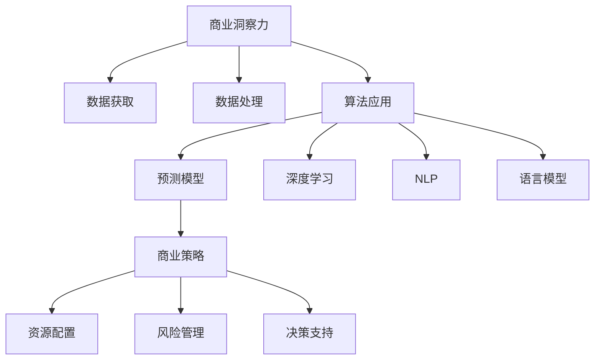

                 

# 理解洞察力的价值：在商业策略中的应用

> 关键词：洞察力,商业策略,数据驱动,预测模型,机器学习,深度学习,自然语言处理,NLP,语言模型,决策支持,业务分析

## 1. 背景介绍

在当今这个信息爆炸的时代，洞察力变得比以往任何时候都更加重要。随着大数据、人工智能、机器学习等技术的发展，商业决策越来越依赖于数据的分析和洞察力的挖掘。深入理解洞察力的价值，以及如何将其应用于商业策略，成为了企业竞争力的关键。

### 1.1 问题由来
商业策略制定和执行历来是一项复杂的任务。传统上，商业决策往往依赖于经验、直觉和专家知识，但这些方法往往缺乏系统性和科学性。在数据驱动的今天，通过技术手段从海量数据中挖掘洞察力，成为提升商业决策科学性的重要途径。

### 1.2 问题核心关键点
商业洞察力源自数据的分析、处理和解释。通过数据分析和机器学习技术，可以从结构化和非结构化数据中提取有价值的信息，支持决策者做出更明智的商业决策。

1. **数据的获取和处理**：数据是商业洞察力的基础。如何高效地获取和处理数据，是商业洞察力挖掘的第一步。
2. **算法的应用和优化**：选择合适的算法和模型，对数据进行处理和分析，提取关键信息，是商业洞察力挖掘的核心。
3. **洞察力的呈现和应用**：如何将挖掘出的洞察力转化为可操作的商业策略，是商业洞察力应用的难点。

### 1.3 问题研究意义
理解洞察力的价值，并将其应用于商业策略，具有重要意义：

1. **提高决策效率**：利用数据和洞察力，可以避免基于经验或直觉的决策带来的不确定性，提高决策的效率和准确性。
2. **降低风险**：通过数据分析，可以识别潜在的风险因素，提前采取预防措施，减少决策带来的风险。
3. **优化资源配置**：洞察力可以帮助企业更合理地配置资源，提高生产效率，降低成本。
4. **创新驱动**：洞察力能够揭示市场趋势、消费者行为等，为企业提供新的商业机会和创新点。
5. **提升竞争力**：在数据驱动的商业环境中，具备强大洞察力的企业更能快速适应市场变化，保持竞争优势。

## 2. 核心概念与联系

### 2.1 核心概念概述

理解商业洞察力，首先需要明确几个关键概念：

- **商业洞察力(Business Insight)**：指从数据中提取的有价值信息，用于支持商业决策和策略制定。
- **商业策略(Business Strategy)**：指企业为实现长期目标，在市场、产品、技术等方面制定的策略和计划。
- **数据驱动(Data-Driven)**：指基于数据的分析、处理和决策，而不是依赖直觉或经验。
- **预测模型(Predictive Model)**：指使用历史数据和算法预测未来趋势的模型。
- **机器学习(Machine Learning)**：指通过算法使计算机从数据中学习和改进的技术。
- **深度学习(Deep Learning)**：指利用多层次神经网络处理复杂数据和问题的技术。
- **自然语言处理(NLP)**：指使计算机能够理解和生成人类语言的技术。
- **语言模型(Language Model)**：指能够基于语言数据预测下一个词或一段话的模型。

这些概念之间存在紧密的联系，共同构成了商业洞察力的框架。

### 2.2 核心概念原理和架构的 Mermaid 流程图



此图展示了从商业洞察力的获取到应用的全流程。

## 3. 核心算法原理 & 具体操作步骤

### 3.1 算法原理概述

商业洞察力的挖掘和应用，通常通过以下几个步骤：

1. **数据收集**：从企业内外获取相关的数据，包括历史销售数据、市场调研数据、社交媒体数据等。
2. **数据预处理**：清洗、标准化和集成数据，确保数据的质量和一致性。
3. **特征工程**：选择和构造对业务洞察力有影响的特征，用于模型训练。
4. **模型训练**：选择合适的算法和模型，对数据进行训练和优化。
5. **结果解释和应用**：将模型输出的洞察力转化为可操作的商业策略。

### 3.2 算法步骤详解

#### 3.2.1 数据收集和预处理

数据收集是商业洞察力挖掘的第一步。数据通常来自企业内部系统、外部数据源或公开数据集。

- **数据源**：企业内部系统（如ERP、CRM）、外部数据源（如社交媒体、电商平台）、公开数据集（如政府统计数据、学术数据）。
- **数据类型**：结构化数据（如SQL数据库）、非结构化数据（如文本、图片、视频）。
- **数据预处理**：清洗数据（处理缺失值、异常值）、标准化数据（归一化、标准化）、集成数据（合并不同数据源的数据）。

#### 3.2.2 特征工程

特征工程是数据挖掘中的关键步骤，目的是从原始数据中提取有意义的特征，以供模型训练。

- **特征选择**：选择对目标变量有较大影响的特征。
- **特征构建**：通过组合和变换原始特征，生成新的特征。
- **特征缩放**：将特征缩放到统一范围内，避免某些特征对模型产生过大影响。

#### 3.2.3 模型训练

模型训练是商业洞察力挖掘的核心步骤。选择合适的模型和算法，对数据进行训练和优化，提取关键信息。

- **算法选择**：回归模型（如线性回归、决策树回归）、分类模型（如逻辑回归、支持向量机）、聚类模型（如K-means、层次聚类）、预测模型（如ARIMA、神经网络）。
- **模型训练**：使用历史数据进行训练，调整模型参数以优化性能。
- **模型评估**：使用验证集或测试集评估模型性能，选择最优模型。

#### 3.2.4 结果解释和应用

将模型输出的洞察力转化为可操作的商业策略，是商业洞察力应用的关键步骤。

- **洞察力解释**：使用可视化工具（如Tableau、Power BI）展示模型结果，解释关键信息。
- **策略制定**：基于洞察力，制定具体的商业策略。
- **策略执行**：在实际操作中应用商业策略，监控效果并调整。

### 3.3 算法优缺点

商业洞察力挖掘和应用主要依赖于数据和算法。

#### 3.3.1 优点

1. **提高决策效率**：数据驱动的决策过程比传统决策方式更为科学和准确。
2. **降低风险**：通过分析历史数据，可以识别潜在的风险因素，提前采取预防措施。
3. **优化资源配置**：洞察力可以帮助企业更合理地配置资源，提高生产效率。
4. **创新驱动**：洞察力能够揭示市场趋势、消费者行为等，为企业提供新的商业机会和创新点。

#### 3.3.2 缺点

1. **数据依赖**：商业洞察力高度依赖于数据的质量和完整性。数据不足或数据质量差，可能导致洞察力不准确。
2. **算法复杂**：选择合适的算法和模型需要一定的专业知识，且算法调优过程复杂。
3. **结果解释困难**：模型输出可能难以解释，需要专业知识才能理解。
4. **成本高**：数据收集、清洗、处理和算法开发需要较高的成本。

### 3.4 算法应用领域

商业洞察力在多个领域有着广泛的应用：

- **市场分析**：通过分析消费者行为、市场趋势等，制定市场策略。
- **产品开发**：利用消费者反馈和市场数据，改进产品设计。
- **供应链管理**：优化库存管理、物流调度，降低成本。
- **客户关系管理**：通过客户行为分析，提升客户满意度。
- **风险管理**：识别潜在的金融风险、操作风险等，提前防范。
- **定价策略**：利用需求预测和竞争分析，制定合理的定价策略。

## 4. 数学模型和公式 & 详细讲解

### 4.1 数学模型构建

商业洞察力挖掘通常使用以下数学模型：

1. **回归模型**：用于预测连续值，如销售预测、价格预测等。
   $$
   Y = \beta_0 + \sum_{i=1}^{p} \beta_i X_i + \epsilon
   $$
   其中，$Y$为预测值，$X_i$为特征变量，$\beta_i$为回归系数，$\epsilon$为误差项。

2. **分类模型**：用于预测离散值，如客户流失预测、信用风险预测等。
   $$
   P(Y=1|X) = \frac{e^{X\beta}}{1 + e^{X\beta}}
   $$
   其中，$X$为特征向量，$\beta$为模型参数。

3. **聚类模型**：用于将数据分为不同的组，如市场细分、客户分群等。
   $$
   V = \sum_{i=1}^{n} ||X_i - \mu_C||^2
   $$
   其中，$X_i$为样本，$\mu_C$为中心点，$V$为簇内平方和。

### 4.2 公式推导过程

#### 4.2.1 回归模型推导

回归模型通过最小化预测值与实际值之间的差距，求出最优回归系数。

1. **最小二乘法**：
   $$
   \beta = (X^TX)^{-1}X^TY
   $$
   其中，$X$为特征矩阵，$Y$为目标变量。

2. **正则化**：
   $$
   \beta = (X^TX + \lambda I)^{-1}X^TY
   $$
   其中，$\lambda$为正则化系数，$I$为单位矩阵。

#### 4.2.2 分类模型推导

分类模型使用逻辑回归或支持向量机等算法，求解最优模型参数。

1. **逻辑回归**：
   $$
   P(Y=1|X) = \frac{e^{X\beta}}{1 + e^{X\beta}}
   $$
   其中，$X$为特征向量，$\beta$为模型参数。

2. **支持向量机**：
   $$
   w^* = \arg\min_{w} \frac{1}{2}||w||^2 + C\sum_{i=1}^{N}(\max(0,1-y_i(w^TX_i+b)))^2
   $$
   其中，$w$为权重向量，$b$为偏置项，$C$为惩罚系数。

#### 4.2.3 聚类模型推导

聚类模型使用K-means算法，通过迭代求解最优中心点。

1. **K-means算法**：
   $$
   \min \sum_{i=1}^{n} ||X_i - \mu_C||^2
   $$
   其中，$X_i$为样本，$\mu_C$为中心点，$n$为样本数量。

### 4.3 案例分析与讲解

假设一家电商公司希望通过数据分析提高销售额。首先，从历史销售数据、市场调研数据和客户反馈数据中提取特征，构建回归模型。然后，使用最小二乘法求出最优回归系数，进行销售预测。最后，将预测结果可视化，制定相应的促销策略。

## 5. 项目实践：代码实例和详细解释说明

### 5.1 开发环境搭建

#### 5.1.1 数据准备

- **数据来源**：从公司内部系统获取历史销售数据，从社交媒体获取客户反馈数据。
- **数据格式**：使用Pandas库进行数据清洗和处理。

#### 5.1.2 环境安装

- **Python环境**：安装Anaconda，创建虚拟环境。
- **依赖库**：安装Scikit-learn、Pandas、Numpy、Matplotlib等库。

### 5.2 源代码详细实现

#### 5.2.1 数据预处理

```python
import pandas as pd
import numpy as np

# 读取数据
df = pd.read_csv('sales_data.csv')

# 数据清洗
df = df.dropna()
df = df.drop_duplicates()

# 数据标准化
from sklearn.preprocessing import StandardScaler
scaler = StandardScaler()
df['features'] = scaler.fit_transform(df[['feature1', 'feature2', 'feature3']])
```

#### 5.2.2 模型训练

```python
from sklearn.linear_model import LinearRegression

# 特征选择
X = df[['feature1', 'feature2', 'feature3']]
y = df['sales']

# 模型训练
model = LinearRegression()
model.fit(X, y)
```

#### 5.2.3 结果解释和应用

```python
# 模型评估
y_pred = model.predict(X)
score = model.score(X, y)

# 结果可视化
import matplotlib.pyplot as plt
plt.scatter(X, y)
plt.plot(X, y_pred, color='red')
plt.show()
```

### 5.3 代码解读与分析

1. **数据预处理**：数据清洗包括去除缺失值、重复值，数据标准化使用scikit-learn库的StandardScaler进行。
2. **模型训练**：使用线性回归模型进行销售预测，通过fit方法进行训练。
3. **结果解释和应用**：使用score方法评估模型性能，使用Matplotlib库可视化预测结果。

## 6. 实际应用场景

### 6.1 市场分析

通过分析市场数据，可以了解市场趋势和消费者偏好。例如，通过分析社交媒体上的品牌提及，可以识别哪些品牌在消费者中有较高的知名度和好感度。

### 6.2 产品开发

利用消费者反馈和市场数据，可以改进产品设计和功能。例如，通过分析用户评论和评分，可以识别产品的不足之处，进行相应的改进。

### 6.3 供应链管理

通过分析物流数据和库存数据，可以优化供应链管理。例如，通过预测未来的需求量，可以提前调整库存，避免缺货或积压。

### 6.4 客户关系管理

通过分析客户行为数据，可以提升客户满意度。例如，通过分析客户的购买历史和偏好，可以提供个性化的推荐和优惠。

### 6.5 风险管理

通过分析金融数据和操作数据，可以识别潜在的风险因素。例如，通过分析交易数据和欺诈记录，可以识别异常交易，预防金融风险。

### 6.6 定价策略

通过分析市场需求和竞争数据，可以制定合理的定价策略。例如，通过分析同行业产品的价格和销量，可以确定最优价格，提高竞争力。

## 7. 工具和资源推荐

### 7.1 学习资源推荐

1. **Coursera**：提供丰富的商业分析课程，包括数据驱动的决策、机器学习等。
2. **Kaggle**：数据科学竞赛平台，提供大量实际数据集和案例分析。
3. **Udacity**：商业数据分析和机器学习课程，结合实战项目。
4. **Harvard Business Review**：提供商业案例分析，涵盖数据分析和商业洞察力应用。

### 7.2 开发工具推荐

1. **Anaconda**：数据科学和机器学习开发的综合平台，提供环境管理和依赖库安装。
2. **Jupyter Notebook**：交互式编程环境，适合数据科学项目开发和可视化。
3. **TensorBoard**：模型训练和调优的可视化工具，帮助优化模型参数。
4. **Tableau**：数据可视化工具，支持复杂的数据分析和可视化展示。
5. **Wealth Analysis**：金融数据处理和分析工具，支持多种金融数据源和算法模型。

### 7.3 相关论文推荐

1. **《数据驱动的商业决策》**：介绍数据驱动的商业策略制定的经典著作。
2. **《机器学习在商业应用中的实践》**：讲解机器学习在商业洞察力挖掘中的应用。
3. **《商业洞察力的数据科学基础》**：从数据科学角度，讲解商业洞察力的构建和应用。

## 8. 总结：未来发展趋势与挑战

### 8.1 研究成果总结

商业洞察力挖掘和应用是数据科学的重要应用之一，为商业决策提供了科学依据。通过数据分析和机器学习技术，可以从海量数据中提取有价值的信息，支持商业决策。

### 8.2 未来发展趋势

1. **自动化**：商业洞察力挖掘将更加自动化，通过机器学习和人工智能技术，自动识别数据中的关键信息。
2. **多模态**：结合视觉、语音、文本等多模态数据，进行更全面、深入的分析。
3. **实时性**：通过实时数据流处理技术，实现商业洞察力的实时分析。
4. **可解释性**：引入可解释性算法，使商业洞察力输出更具解释性，便于理解和应用。
5. **跨领域**：将商业洞察力应用于更多领域，如医疗、教育、政府等，解决跨领域问题。

### 8.3 面临的挑战

1. **数据隐私和安全**：商业洞察力的挖掘和应用涉及到大量的敏感数据，如何保障数据隐私和安全是一个重要挑战。
2. **数据质量和完整性**：数据质量和完整性直接影响到商业洞察力的准确性，数据清洗和处理工作量大。
3. **算法复杂性**：选择合适的算法和模型需要专业知识，算法调优过程复杂。
4. **结果解释困难**：模型输出可能难以解释，需要专业知识才能理解。
5. **成本高**：数据收集、清洗、处理和算法开发需要较高的成本。

### 8.4 研究展望

未来商业洞察力的研究将集中在以下几个方面：

1. **自动化商业洞察力挖掘**：通过机器学习和人工智能技术，实现自动化的商业洞察力挖掘。
2. **多模态数据分析**：结合多种数据类型，进行更全面、深入的商业洞察力分析。
3. **实时商业洞察力分析**：通过实时数据流处理技术，实现商业洞察力的实时分析。
4. **可解释性商业洞察力**：引入可解释性算法，使商业洞察力输出更具解释性。
5. **跨领域商业洞察力应用**：将商业洞察力应用于更多领域，解决跨领域问题。

## 9. 附录：常见问题与解答

**Q1: 什么是商业洞察力？**

A: 商业洞察力是指从数据中提取的有价值信息，用于支持商业决策和策略制定。

**Q2: 商业洞察力在商业策略中的应用有哪些？**

A: 商业洞察力在市场分析、产品开发、供应链管理、客户关系管理、风险管理、定价策略等方面都有广泛应用。

**Q3: 商业洞察力挖掘的主要步骤有哪些？**

A: 商业洞察力挖掘的主要步骤包括数据收集、数据预处理、特征工程、模型训练、结果解释和应用。

**Q4: 商业洞察力挖掘的优缺点有哪些？**

A: 商业洞察力挖掘的优点包括提高决策效率、降低风险、优化资源配置、创新驱动。缺点包括数据依赖、算法复杂、结果解释困难、成本高。

**Q5: 商业洞察力在实际应用中面临哪些挑战？**

A: 商业洞察力在实际应用中面临的数据隐私和安全、数据质量和完整性、算法复杂性、结果解释困难、成本高等挑战。

