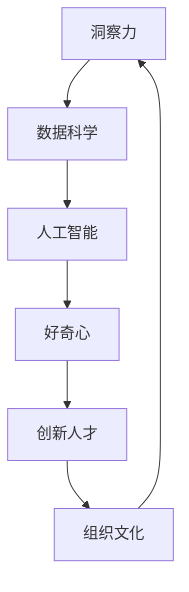

                 

## 1. 背景介绍

### 1.1 问题由来
在当今快速变化的科技和商业环境中，洞察力（Insight）已成为企业竞争力的关键因素。洞察力不仅帮助企业发现新的商机，还能引导创新，推动技术进步。然而，传统的数据分析方法往往滞后于时代需求，难以应对复杂多变的数据形态。而通过培养好奇心和创新人才，利用先进的数据技术，能够有效提升洞察力，助力企业决策优化。

### 1.2 问题核心关键点
洞察力的培养需要结合数据技术、创新人才和组织文化等多方面因素。本文将从技术层面出发，介绍如何利用数据科学和人工智能技术，结合人才发展策略，构建能够支持好奇心和创新人才的洞察力培养环境。

## 2. 核心概念与联系

### 2.1 核心概念概述

为了更好地理解如何培养洞察力，本节将介绍几个密切相关的核心概念：

- **洞察力（Insight）**：通过数据分析、推理等方法，从数据中挖掘出有价值的洞见和规律，支持决策和创新。

- **数据科学（Data Science）**：融合统计学、计算机科学、运筹学等多个学科，通过数据采集、处理、分析等技术，提取和利用数据中的信息。

- **人工智能（AI）**：包括机器学习、深度学习、自然语言处理等，使计算机具备类似人类的智能，能够自主学习和推理。

- **好奇心（Curiosity）**：一种内在驱动，促使人们探索未知、求知欲望，是创新和洞察力的源泉。

- **创新人才（Talent）**：具有跨学科知识、问题解决能力、团队协作精神等特质的人才，能够在复杂环境中提供创造性解决方案。

这些核心概念之间存在紧密的联系：通过数据科学和人工智能技术，可以更好地培养和激发创新人才的好奇心，进而提升企业的洞察力。

### 2.2 核心概念原理和架构的 Mermaid 流程图



这个流程图展示了从洞察力到组织文化的反馈循环，各个环节紧密相连，共同支持企业洞察力的培养。

## 3. 核心算法原理 & 具体操作步骤

### 3.1 算法原理概述

洞察力的培养离不开数据科学和人工智能技术。通过数据科学方法对海量数据进行预处理和分析，使用人工智能算法挖掘数据中的规律和趋势，结合创新人才的直觉和经验，形成对问题的深刻理解。

形式化地，假设原始数据集为 $D$，通过数据预处理得到特征集 $X$，数据标签为 $Y$。洞察力培养过程可以表示为：

$$
Insight = f(X, Y, Algorithm, Personality)
$$

其中，$f$ 为洞察力培养算法，$Algorithm$ 代表使用的数据科学和人工智能算法，$Personality$ 代表创新人才的个人特质。

### 3.2 算法步骤详解

基于数据科学和人工智能的洞察力培养，一般包括以下关键步骤：

**Step 1: 数据收集与预处理**
- 收集与问题相关的数据，确保数据质量和完整性。
- 进行数据清洗、归一化、缺失值处理等预处理操作。

**Step 2: 数据建模与分析**
- 选择合适的数据科学方法，如统计分析、时间序列分析、回归分析等，构建数据模型。
- 使用机器学习或深度学习算法，对数据模型进行训练和预测。
- 结合领域知识，对模型结果进行解读和验证。

**Step 3: 模型评估与迭代**
- 使用交叉验证等方法，评估模型性能和泛化能力。
- 根据评估结果，调整模型参数或优化算法，进行迭代优化。
- 持续更新数据集，保持模型的实时性。

**Step 4: 洞察力形成与应用**
- 结合创新人才的直觉和经验，对模型结果进行解读，形成洞察力。
- 将洞察力应用于决策、战略规划、产品创新等实际问题中。
- 持续跟踪应用效果，优化模型和策略。

### 3.3 算法优缺点

基于数据科学和人工智能的洞察力培养方法具有以下优点：
1. 数据驱动：通过科学方法和技术手段，提升洞察力的客观性和准确性。
2. 自动化和高效性：使用自动化工具和算法，提高洞察力培养的效率。
3. 可解释性：通过数据建模和算法分析，提高洞察力的可解释性。
4. 跨领域应用：适用于多个行业和领域，具有广泛的适用性。

同时，该方法也存在以下局限性：
1. 对数据质量依赖高：数据集的质量和完整性直接影响模型的性能。
2. 对领域知识要求高：需要结合行业知识，才能对模型结果进行正确的解读和应用。
3. 模型复杂度高：部分算法如深度学习模型参数较多，对计算资源有较高要求。
4. 需要跨学科协作：数据科学、人工智能和创新人才需紧密合作，才能产生高效洞察力。

尽管存在这些局限性，但就目前而言，基于数据科学和人工智能的洞察力培养方法仍是提升企业竞争力的有效手段。未来相关研究的重点在于如何进一步降低对数据质量的依赖，提高模型的跨领域迁移能力，同时兼顾可解释性和实际应用效果。

### 3.4 算法应用领域

基于数据科学和人工智能的洞察力培养方法，已经在各行各业中得到了广泛的应用，例如：

- **金融风险管理**：通过分析历史交易数据，识别出高风险的客户和交易行为，提前预警并采取措施。
- **市场营销**：利用客户行为数据分析，精准定位目标市场，优化广告投放策略，提升营销效果。
- **医疗健康**：通过病历数据分析，发现潜在的疾病风险，制定个性化治疗方案，改善患者管理。
- **物流管理**：通过运输数据预测，优化货物配送路线，减少成本，提高效率。
- **人力资源**：通过员工数据挖掘，发现人才流失原因，优化招聘策略，提升团队士气。

除了上述这些经典应用外，洞察力培养技术还在更多领域中得到创新性应用，如智能制造、智慧城市、智能农业等，为各行业的数字化转型提供了新的思路和工具。

## 4. 数学模型和公式 & 详细讲解 & 举例说明

### 4.1 数学模型构建

本节将使用数学语言对基于数据科学和人工智能的洞察力培养过程进行更加严格的刻画。

假设原始数据集为 $D=\{(x_i, y_i)\}_{i=1}^N$，其中 $x_i$ 为输入特征，$y_i$ 为输出标签。通过数据预处理和特征工程，得到特征集 $X=\{x_i\}_{i=1}^N$。

定义洞察力培养算法为 $f$，使用机器学习模型 $M$ 进行训练，得到模型参数 $\theta$。洞察力培养过程可以表示为：

$$
Insight = f(X, \theta)
$$

其中 $f$ 为洞察力培养算法，$M$ 为使用的机器学习模型。

### 4.2 公式推导过程

以下我们以回归任务为例，推导模型的公式及其梯度计算。

假设模型 $M$ 在输入 $x_i$ 上的预测输出为 $\hat{y}_i=M(x_i)$，真实标签为 $y_i$。回归任务的损失函数通常使用均方误差，即：

$$
L(y_i, \hat{y}_i) = \frac{1}{N}\sum_{i=1}^N (y_i - \hat{y}_i)^2
$$

通过链式法则，损失函数对模型参数 $\theta$ 的梯度为：

$$
\frac{\partial L}{\partial \theta} = -2\frac{1}{N}\sum_{i=1}^N \frac{\partial M(x_i)}{\partial \theta}(y_i - \hat{y}_i)
$$

在得到损失函数的梯度后，即可带入参数更新公式，完成模型的迭代优化。

### 4.3 案例分析与讲解

**案例：客户流失预测**

- **数据收集**：收集客户历史行为数据，如购买记录、使用频率、投诉记录等。
- **数据预处理**：对数据进行清洗、归一化、特征选择等预处理操作。
- **模型构建**：使用线性回归或决策树模型，训练客户流失预测模型。
- **模型评估**：使用交叉验证等方法评估模型性能。
- **洞察力形成**：结合业务经验，分析模型结果，发现可能导致客户流失的关键因素。
- **应用优化**：根据洞察力结果，优化客户保留策略，提升客户满意度。

以上案例展示了数据科学和人工智能在洞察力培养中的应用流程，通过科学方法和技术手段，提高洞察力的客观性和可操作性。

## 5. 项目实践：代码实例和详细解释说明

### 5.1 开发环境搭建

在进行洞察力培养的实践前，我们需要准备好开发环境。以下是使用Python进行scikit-learn和TensorFlow开发的环境配置流程：

1. 安装Anaconda：从官网下载并安装Anaconda，用于创建独立的Python环境。

2. 创建并激活虚拟环境：
```bash
conda create -n data-env python=3.8 
conda activate data-env
```

3. 安装必要的Python包：
```bash
conda install scikit-learn numpy pandas matplotlib tensorflow
```

4. 安装TensorFlow和相关依赖：
```bash
pip install tensorflow
```

5. 安装必要的工具包：
```bash
pip install tqdm jupyter notebook ipython
```

完成上述步骤后，即可在`data-env`环境中开始洞察力培养的实践。

### 5.2 源代码详细实现

这里我们以客户流失预测任务为例，给出使用scikit-learn和TensorFlow进行洞察力培养的PyTorch代码实现。

首先，定义数据处理函数：

```python
import pandas as pd
from sklearn.model_selection import train_test_split

def load_data(path):
    data = pd.read_csv(path)
    return data.dropna().values

def preprocess_data(X, y):
    X = X.drop(columns=['customer_id'])
    y = y.astype(str)
    return X, y

def split_data(X, y, test_size=0.2, random_state=42):
    X_train, X_test, y_train, y_test = train_test_split(X, y, test_size=test_size, random_state=random_state)
    return X_train, X_test, y_train, y_test
```

然后，定义模型和评估函数：

```python
from sklearn.linear_model import LogisticRegression
from sklearn.metrics import roc_auc_score
from tensorflow.keras.models import Sequential
from tensorflow.keras.layers import Dense

def train_model(X_train, y_train):
    lr = LogisticRegression(solver='liblinear')
    lr.fit(X_train, y_train)
    return lr

def evaluate_model(X_test, y_test, model):
    y_pred = model.predict_proba(X_test)[:, 1]
    auc = roc_auc_score(y_test, y_pred)
    return auc

def build_model(input_dim):
    model = Sequential()
    model.add(Dense(64, input_dim=input_dim, activation='relu'))
    model.add(Dense(1, activation='sigmoid'))
    model.compile(optimizer='adam', loss='binary_crossentropy', metrics=['auc'])
    return model

def train_and_evaluate(X_train, y_train, X_test, y_test):
    lr = train_model(X_train, y_train)
    model = build_model(X_train.shape[1])
    model.fit(X_train, y_train, epochs=10, batch_size=32, verbose=0)
    auc = evaluate_model(X_test, y_test, model)
    return auc
```

最后，启动训练流程并在测试集上评估：

```python
X_train, X_test, y_train, y_test = split_data(X, y, test_size=0.2, random_state=42)

auc = train_and_evaluate(X_train, y_train, X_test, y_test)
print(f"AUC: {auc}")
```

以上就是使用scikit-learn和TensorFlow进行客户流失预测任务洞察力培养的完整代码实现。可以看到，得益于scikit-learn和TensorFlow的强大封装，我们可以用相对简洁的代码完成模型的训练和评估。

### 5.3 代码解读与分析

让我们再详细解读一下关键代码的实现细节：

**load_data函数**：
- 读取CSV文件，去除缺失值，返回数据集。

**preprocess_data函数**：
- 将客户ID去除，将标签转换为字符串类型。

**split_data函数**：
- 使用train_test_split将数据集划分为训练集和测试集，指定测试集大小和随机种子。

**train_model函数**：
- 使用scikit-learn的LogisticRegression模型，进行线性回归训练。

**evaluate_model函数**：
- 使用roc_auc_score计算模型在测试集上的AUC值，评估模型性能。

**build_model函数**：
- 定义一个包含一层Dense的TensorFlow模型，用于预测二分类问题。

**train_and_evaluate函数**：
- 首先使用scikit-learn训练LogisticRegression模型，然后使用TensorFlow构建神经网络模型。
- 训练TensorFlow模型，并在测试集上评估AUC值。

可以看到，scikit-learn和TensorFlow的结合使用，可以同时利用两者的优点，实现更加灵活高效的数据建模和分析。

当然，工业级的系统实现还需考虑更多因素，如模型的保存和部署、超参数的自动搜索、更灵活的模型适配等。但核心的洞察力培养范式基本与此类似。

## 6. 实际应用场景

### 6.1 智能客服系统

基于数据科学和人工智能的洞察力培养，可以广泛应用于智能客服系统的构建。传统客服往往需要配备大量人力，高峰期响应缓慢，且一致性和专业性难以保证。而使用洞察力培养技术构建的智能客服系统，能够7x24小时不间断服务，快速响应客户咨询，用自然流畅的语言解答各类常见问题。

在技术实现上，可以收集企业内部的历史客服对话记录，将问题和最佳答复构建成监督数据，在此基础上使用Logistic回归等模型进行训练。洞察力培养后的智能客服系统，能够自动理解用户意图，匹配最合适的答案模板进行回复。对于客户提出的新问题，还可以接入检索系统实时搜索相关内容，动态组织生成回答。如此构建的智能客服系统，能大幅提升客户咨询体验和问题解决效率。

### 6.2 金融舆情监测

金融机构需要实时监测市场舆论动向，以便及时应对负面信息传播，规避金融风险。传统的人工监测方式成本高、效率低，难以应对网络时代海量信息爆发的挑战。基于数据科学和人工智能的洞察力培养技术，为金融舆情监测提供了新的解决方案。

具体而言，可以收集金融领域相关的新闻、报道、评论等文本数据，并对其进行主题标注和情感标注。在此基础上使用NLP模型，如BERT或GPT等，进行训练。洞察力培养后的模型能够自动判断文本属于何种主题，情感倾向是正面、中性还是负面。将洞察力培养模型应用到实时抓取的网络文本数据，就能够自动监测不同主题下的情感变化趋势，一旦发现负面信息激增等异常情况，系统便会自动预警，帮助金融机构快速应对潜在风险。

### 6.3 个性化推荐系统

当前的推荐系统往往只依赖用户的历史行为数据进行物品推荐，无法深入理解用户的真实兴趣偏好。基于数据科学和人工智能的洞察力培养技术，个性化推荐系统可以更好地挖掘用户行为背后的语义信息，从而提供更精准、多样的推荐内容。

在实践中，可以收集用户浏览、点击、评论、分享等行为数据，提取和用户交互的物品标题、描述、标签等文本内容。将文本内容作为模型输入，用户的后续行为（如是否点击、购买等）作为监督信号，在此基础上使用Logistic回归等模型进行训练。洞察力培养后的模型能够从文本内容中准确把握用户的兴趣点。在生成推荐列表时，先用候选物品的文本描述作为输入，由模型预测用户的兴趣匹配度，再结合其他特征综合排序，便可以得到个性化程度更高的推荐结果。

### 6.4 未来应用展望

随着数据科学和人工智能技术的不断发展，基于洞察力培养的方法将在更多领域得到应用，为传统行业带来变革性影响。

在智慧医疗领域，基于洞察力培养的医疗问答、病历分析、药物研发等应用将提升医疗服务的智能化水平，辅助医生诊疗，加速新药开发进程。

在智能教育领域，洞察力培养技术可应用于作业批改、学情分析、知识推荐等方面，因材施教，促进教育公平，提高教学质量。

在智慧城市治理中，洞察力培养技术可应用于城市事件监测、舆情分析、应急指挥等环节，提高城市管理的自动化和智能化水平，构建更安全、高效的未来城市。

此外，在企业生产、社会治理、文娱传媒等众多领域，基于洞察力培养的人工智能应用也将不断涌现，为经济社会发展注入新的动力。相信随着技术的日益成熟，洞察力培养方法将成为人工智能落地应用的重要范式，推动人工智能技术向更广阔的领域加速渗透。

## 7. 工具和资源推荐

### 7.1 学习资源推荐

为了帮助开发者系统掌握洞察力培养的理论基础和实践技巧，这里推荐一些优质的学习资源：

1. **《机器学习实战》**：一本经典的机器学习入门书籍，详细介绍了数据科学和人工智能的基础原理和算法实现。

2. **Coursera《数据科学与机器学习》课程**：由斯坦福大学开设的综合性课程，涵盖数据预处理、特征工程、模型训练等关键内容。

3. **Kaggle**：全球最大的数据科学竞赛平台，提供丰富的数据集和案例，助力开发者提升实战能力。

4. **Udacity《机器学习工程师》纳米学位**：由Google和DeepMind等企业联合开设，提供行业前沿的机器学习技术培训。

5. **Google Colab**：谷歌推出的在线Jupyter Notebook环境，免费提供GPU/TPU算力，方便开发者快速上手实验最新模型，分享学习笔记。

通过对这些资源的学习实践，相信你一定能够快速掌握数据科学和人工智能的洞察力培养方法，并用于解决实际的业务问题。

### 7.2 开发工具推荐

高效的开发离不开优秀的工具支持。以下是几款用于洞察力培养开发的常用工具：

1. **scikit-learn**：开源的Python机器学习库，包含多种常用的回归、分类、聚类等算法，适合快速原型开发。

2. **TensorFlow**：由Google主导开发的开源深度学习框架，生产部署方便，适合大规模工程应用。

3. **PyTorch**：由Facebook开发，灵活高效的深度学习框架，适合研究和原型开发。

4. **Jupyter Notebook**：支持Python、R等语言的交互式编程环境，方便数据探索和模型实验。

5. **JupyterLab**：基于Jupyter Notebook的改进版本，支持更丰富的开发环境集成和文件管理。

6. **Python Notebook环境**：谷歌提供的在线Jupyter Notebook环境，方便在线协作和模型共享。

合理利用这些工具，可以显著提升洞察力培养任务的开发效率，加快创新迭代的步伐。

### 7.3 相关论文推荐

数据科学和人工智能的洞察力培养技术的发展源于学界的持续研究。以下是几篇奠基性的相关论文，推荐阅读：

1. **"Deep Learning for Large-Scale Image Recognition"**：提出使用卷积神经网络(CNN)进行大规模图像识别，推动计算机视觉的发展。

2. **"ImageNet Classification with Deep Convolutional Neural Networks"**：提出使用CNN进行大规模图像分类，突破了传统图像处理方法的限制。

3. **"Attention is All You Need"**：提出Transformer结构，开启了NLP领域的预训练大模型时代。

4. **"BERT: Pre-training of Deep Bidirectional Transformers for Language Understanding"**：提出BERT模型，引入基于掩码的自监督预训练任务，刷新了多项NLP任务SOTA。

5. **"Multi-view Evidence Serving as Strong Augmentation in Deep Learning"**：提出多视图证据增强方法，提升深度学习模型的性能。

这些论文代表了大数据和人工智能在洞察力培养技术的发展脉络。通过学习这些前沿成果，可以帮助研究者把握学科前进方向，激发更多的创新灵感。

## 8. 总结：未来发展趋势与挑战

### 8.1 总结

本文对基于数据科学和人工智能的洞察力培养方法进行了全面系统的介绍。首先阐述了洞察力培养的背景和意义，明确了数据科学和人工智能技术在洞察力培养中的核心作用。其次，从原理到实践，详细讲解了洞察力培养的数学原理和关键步骤，给出了洞察力培养任务开发的完整代码实例。同时，本文还广泛探讨了洞察力培养方法在智能客服、金融舆情、个性化推荐等多个行业领域的应用前景，展示了洞察力培养范式的巨大潜力。此外，本文精选了洞察力培养技术的各类学习资源，力求为读者提供全方位的技术指引。

通过本文的系统梳理，可以看到，基于数据科学和人工智能的洞察力培养方法在提升企业决策效率、推动技术创新方面具有重要价值。利用先进的数据技术，结合创新人才的直觉和经验，能够形成高效、科学、跨领域的洞察力，为企业数字化转型和智能化升级提供有力支撑。未来，随着数据科学和人工智能技术的不断进步，洞察力培养技术必将成为各行业发展的核心竞争力。

### 8.2 未来发展趋势

展望未来，基于数据科学和人工智能的洞察力培养技术将呈现以下几个发展趋势：

1. **自动化和智能化**：未来的洞察力培养将更加自动化和智能化，利用机器学习算法和数据驱动方法，自动提取和分析数据中的洞察力，提高工作效率和准确性。

2. **多模态融合**：传统的洞察力培养多依赖单一模态数据，未来将逐步引入多模态数据融合技术，如文本、图像、声音等，提升跨领域洞察力。

3. **实时化和动态化**：洞察力培养将更加注重实时性和动态性，通过实时数据流和动态算法模型，快速响应业务变化和市场需求。

4. **跨领域应用**：洞察力培养技术将逐步拓展到更多行业和领域，如医疗、教育、金融等，提供更加全面和个性化的洞察力服务。

5. **可解释性和透明性**：未来的洞察力培养将更加注重可解释性和透明性，通过解释模型内部机制和决策逻辑，增强用户信任和业务可靠性。

以上趋势凸显了洞察力培养技术的广阔前景。这些方向的探索发展，必将进一步提升企业决策的科学性和智能化水平，推动技术进步和社会发展。

### 8.3 面临的挑战

尽管基于数据科学和人工智能的洞察力培养技术已经取得了瞩目成就，但在迈向更加智能化、普适化应用的过程中，它仍面临着诸多挑战：

1. **数据质量问题**：高质量、多样化的数据是洞察力培养的基础，但实际应用中数据获取和处理往往存在难度，数据质量难以保证。

2. **模型复杂性**：深度学习等复杂模型对计算资源有较高要求，模型训练和推理效率有待提升。

3. **跨领域知识整合**：不同领域的数据和知识体系差异较大，如何实现跨领域知识的有效整合，仍是一个挑战。

4. **数据隐私和安全**：洞察力培养依赖大量敏感数据，数据隐私和安全问题成为关注的焦点。

5. **算法可解释性**：复杂模型如深度学习模型往往被视为“黑盒”，难以解释其内部决策过程，影响用户信任。

6. **人机协作问题**：如何更好地将机器洞察力与人类直觉结合，充分发挥人机协作的优势，仍需深入探索。

尽管存在这些挑战，但通过持续的技术创新和实践积累，这些难题终将逐步得到解决，洞察力培养技术必将在构建智能化业务和优化决策中发挥更大的作用。

### 8.4 研究展望

面对洞察力培养面临的种种挑战，未来的研究需要在以下几个方面寻求新的突破：

1. **自动化和智能化**：进一步提升洞察力培养的自动化水平，利用先进的机器学习算法和数据驱动方法，实现高效、准确的洞察力培养。

2. **多模态融合**：研究多模态数据的融合技术，提升跨领域洞察力，实现更加全面、精准的分析。

3. **实时化和动态化**：开发实时数据流处理和动态算法模型，快速响应业务变化和市场需求，提升洞察力的实时性和动态性。

4. **跨领域知识整合**：研究跨领域知识体系的有效整合方法，通过跨学科协作，提升洞察力培养的全面性和可操作性。

5. **数据隐私和安全**：开发数据隐私保护和安全技术，确保洞察力培养过程中数据的安全性和隐私性。

6. **算法可解释性**：引入解释性方法和工具，提高复杂模型的可解释性和透明性，增强用户信任和业务可靠性。

7. **人机协作**：研究人机协作机制，充分发挥机器洞察力和人类直觉的互补优势，实现高效的业务分析和决策优化。

这些研究方向的探索，必将引领洞察力培养技术迈向更高的台阶，为构建智能化业务和优化决策提供有力的技术支撑。面向未来，洞察力培养技术还需要与其他人工智能技术进行更深入的融合，如知识表示、因果推理、强化学习等，多路径协同发力，共同推动洞察力培养技术的进步。只有勇于创新、敢于突破，才能不断拓展洞察力培养的边界，让数据科学和人工智能技术更好地服务于人类社会的数字化转型。

## 9. 附录：常见问题与解答

**Q1：数据质量对洞察力培养的性能有什么影响？**

A: 数据质量是洞察力培养的基础，高质量的数据能够提高模型的性能和泛化能力。数据质量问题主要体现在以下方面：

1. **数据完整性**：缺失值、异常值等问题会影响模型的训练和预测效果，需要通过数据清洗和预处理解决。

2. **数据多样性**：数据集的多样性和代表性对模型的泛化能力有重要影响，缺乏多样性的数据会导致模型过拟合。

3. **数据偏差**：数据中的偏差会导致模型学习到错误的规律，影响洞察力的客观性和准确性。

为了提升数据质量，需要采取以下措施：

1. **数据清洗**：去除缺失值、异常值等数据噪声，保证数据完整性和准确性。

2. **数据增强**：通过数据扩充和生成技术，增加数据集的多样性和代表性。

3. **数据平衡**：对于不平衡的数据集，进行过采样或欠采样，平衡数据分布，避免模型对少数类别的偏差。

**Q2：如何选择合适的洞察力培养模型？**

A: 选择合适的洞察力培养模型需要考虑多个因素，包括任务类型、数据特性、计算资源等。以下是几个关键点：

1. **任务类型**：不同的任务类型需要使用不同的模型。例如，分类任务可以使用Logistic回归或SVM等模型，回归任务可以使用线性回归或决策树等模型。

2. **数据特性**：数据集的大小、维度和类型会影响模型的选择。对于小规模数据集，使用简单的线性模型可能更合适；对于大规模数据集，可以使用深度学习模型如神经网络等。

3. **计算资源**：模型复杂度越高，需要的计算资源也越多。需要根据实际计算资源，选择合适的模型。

4. **模型性能**：在相同条件下，选择性能更好的模型。可以通过交叉验证等方法评估模型性能。

5. **模型可解释性**：对于需要可解释性的应用，选择更简单的模型或引入可解释性方法，如LIME、SHAP等。

综上所述，选择合适的洞察力培养模型需要综合考虑任务特性、数据特性、计算资源和性能需求，进行多维度评估。

**Q3：如何评估洞察力培养模型的性能？**

A: 评估洞察力培养模型的性能通常使用以下指标：

1. **准确率（Accuracy）**：衡量模型在测试集上的正确预测率，适用于二分类和多分类任务。

2. **精确率（Precision）和召回率（Recall）**：衡量模型在测试集上的精确率和召回率，适用于不平衡数据集和二分类任务。

3. **F1分数（F1 Score）**：精确率和召回率的调和平均数，综合考虑模型的准确性和召回率。

4. **AUC（Area Under Curve）**：衡量模型在不同阈值下的曲线下面积，适用于二分类任务。

5. **RMSE（Root Mean Squared Error）**：衡量模型在测试集上的均方根误差，适用于回归任务。

6. **MAE（Mean Absolute Error）**：衡量模型在测试集上的平均绝对误差，适用于回归任务。

7. **MAPE（Mean Absolute Percentage Error）**：衡量模型在测试集上的平均绝对百分比误差，适用于回归任务。

8. **R^2分数（R^2 Score）**：衡量模型在测试集上的决定系数，适用于回归任务。

以上指标可以根据具体任务选择，使用交叉验证、留出法等方法进行模型评估和选择。

**Q4：如何改进洞察力培养模型的泛化能力？**

A: 为了提升洞察力培养模型的泛化能力，需要采取以下措施：

1. **数据增强**：通过数据扩充和生成技术，增加数据集的多样性和代表性，避免模型对特定数据的过拟合。

2. **正则化技术**：使用L1、L2正则、Dropout等正则化技术，防止模型过度拟合训练数据。

3. **模型集成**：通过模型集成方法，如Bagging、Boosting等，提升模型的泛化能力和稳定性。

4. **交叉验证**：使用交叉验证方法，评估模型在不同数据集上的泛化能力，避免模型对特定数据集的过拟合。

5. **模型参数调优**：通过网格搜索、随机搜索等方法，优化模型参数，提升模型的泛化能力。

6. **学习率调整**：根据模型性能调整学习率，避免学习率过大导致过拟合，或过小导致欠拟合。

7. **提前停止**：在验证集上监测模型性能，一旦性能不再提升，提前停止训练，避免过拟合。

通过以上措施，可以在一定程度上提升洞察力培养模型的泛化能力，避免模型对特定数据集的过拟合。

**Q5：如何优化洞察力培养模型的计算效率？**

A: 为了优化洞察力培养模型的计算效率，需要采取以下措施：

1. **数据预处理**：对数据进行高效预处理，如归一化、降维等，减少计算量。

2. **模型压缩**：使用模型压缩技术，如剪枝、量化等，减少模型参数和计算量。

3. **并行计算**：使用并行计算框架，如TensorFlow、PyTorch等，加速模型训练和推理。

4. **分布式计算**：使用分布式计算框架，如Hadoop、Spark等，加速大规模数据处理和模型训练。

5. **GPU加速**：使用GPU进行计算，加速模型训练和推理。

6. **模型优化**：优化模型结构和算法，提升模型计算效率。

7. **缓存技术**：使用缓存技术，减少计算过程中数据的重复加载，提升计算效率。

通过以上措施，可以在一定程度上优化洞察力培养模型的计算效率，提升模型训练和推理的速度。

通过本文的系统梳理，可以看到，基于数据科学和人工智能的洞察力培养方法在提升企业决策效率、推动技术创新方面具有重要价值。利用先进的数据技术，结合创新人才的直觉和经验，能够形成高效、科学、跨领域的洞察力，为企业数字化转型和智能化升级提供有力支撑。未来，随着数据科学和人工智能技术的不断进步，洞察力培养技术必将成为各行业发展的核心竞争力。

