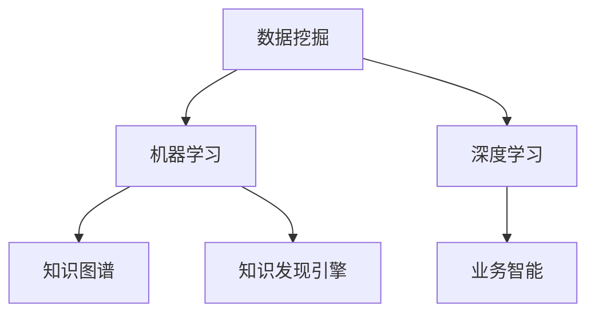

                 

# 理解洞察力的奥秘：知识发现引擎的作用

> 关键词：洞察力，知识发现引擎，数据挖掘，机器学习，深度学习，业务智能

## 1. 背景介绍

### 1.1 问题由来
在信息爆炸的时代，企业每天都在产生大量的数据。这些数据往往蕴含着丰富的信息，等待着被挖掘和利用。然而，传统的数据查询、报表分析等方法已经无法满足企业对数据深入洞察的需求。知识发现引擎(Knowledge Discovery Engine, KDE)应运而生，通过机器学习、深度学习等先进技术，从海量数据中自动挖掘出有价值的信息，帮助企业实现数据驱动的决策。

### 1.2 问题核心关键点
知识发现引擎的核心任务是自动挖掘数据中的知识模式，帮助企业进行数据洞察。其主要包括以下几个关键点：

- **自动学习**：从大量数据中自动学习出潜在的知识模式，无需人工干预。
- **模式识别**：识别出有业务价值的模式，如关联规则、分类模型、聚类等。
- **数据可视化**：将挖掘出的知识以直观的图表、仪表盘形式展示，方便企业理解与应用。
- **智能推荐**：根据用户行为和偏好，自动推荐相关的业务洞察，提升决策效率。
- **持续学习**：能够根据新数据的不断到来，动态调整知识库，保持洞察力的时效性。

这些核心点构成了知识发现引擎的基本框架，使其成为企业决策支持系统的强大工具。

### 1.3 问题研究意义
研究知识发现引擎的意义在于：

- **提升决策效率**：通过自动化的知识挖掘，快速获得业务洞察，加速决策过程。
- **降低决策风险**：机器学习算法具有强大的泛化能力，可以减少人为错误，降低决策风险。
- **优化业务流程**：挖掘出业务中的瓶颈和机会，指导企业进行流程优化和业务改进。
- **增强市场竞争力**：实时、准确的数据洞察，有助于企业快速响应市场变化，保持竞争优势。
- **推动智能化转型**：知识发现引擎是企业智能化转型的重要工具，有助于推动企业向数据驱动型方向转型。

## 2. 核心概念与联系

### 2.1 核心概念概述

为了更好地理解知识发现引擎，我们首先介绍几个核心概念及其之间的联系：

- **数据挖掘(Data Mining)**：从原始数据中自动发现模式、知识或有用信息的过程。数据挖掘的目标是从大量数据中提取有价值的信息。
- **机器学习(Machine Learning)**：通过数据训练模型，让机器自动学习规律，从而做出预测或决策。机器学习是数据挖掘的重要方法之一。
- **深度学习(Deep Learning)**：一类机器学习方法，通过多层神经网络结构提取高层次特征，处理非线性、高维数据。深度学习在知识发现中取得了显著的成果。
- **知识图谱(Knowledge Graph)**：一种结构化的语义知识表示形式，通过节点和边构建知识网络，帮助机器理解复杂的实体关系。知识图谱在知识发现中起到重要支撑作用。
- **业务智能(Business Intelligence, BI)**：利用数据挖掘和知识发现技术，帮助企业进行决策支持，提升业务效率和竞争力。BI是知识发现应用的典型场景。

这些核心概念之间的逻辑关系可以通过以下Mermaid流程图来展示：



这个流程图展示了知识发现引擎的核心概念及其之间的联系：

1. 数据挖掘是从原始数据中提取知识的过程。
2. 机器学习是实现数据挖掘的工具之一，通过训练模型自动发现规律。
3. 深度学习是机器学习的一种高级形式，能够处理复杂的非线性数据。
4. 知识图谱是一种重要的知识表示方法，帮助机器理解复杂关系。
5. 知识发现引擎整合了以上技术，实现自动化的知识挖掘和业务洞察。
6. 业务智能是基于知识发现引擎的决策支持系统，帮助企业提升业务效率和竞争力。

## 3. 核心算法原理 & 具体操作步骤
### 3.1 算法原理概述

知识发现引擎的核心原理是利用机器学习、深度学习等技术，从数据中自动挖掘出有价值的知识模式。其基本流程包括数据预处理、特征工程、模型训练、模式识别和结果可视化。

1. **数据预处理**：对原始数据进行清洗、去重、标准化等处理，以提高模型训练的准确性。
2. **特征工程**：选择合适的特征，构建特征向量，提升模型的泛化能力。
3. **模型训练**：利用机器学习、深度学习等算法，训练模型，使其自动学习数据中的知识模式。
4. **模式识别**：根据训练好的模型，识别出有业务价值的模式，如关联规则、分类模型、聚类等。
5. **结果可视化**：将挖掘出的知识以直观的图表、仪表盘形式展示，方便企业理解与应用。

### 3.2 算法步骤详解

知识发现引擎的核心算法流程如下：

1. **数据收集与预处理**：
   - 收集企业内部的各类业务数据，包括交易记录、客户信息、日志文件等。
   - 对数据进行清洗、去重、标准化等预处理，去除噪音，提高数据质量。

2. **特征工程与选择**：
   - 根据业务需求，选择合适的特征，构建特征向量。例如，时间、地点、用户行为等特征。
   - 使用维度缩减技术，如PCA、LDA等，减少特征数量，提高模型训练速度。

3. **模型训练与优化**：
   - 选择合适的机器学习、深度学习算法，如随机森林、XGBoost、神经网络等。
   - 使用交叉验证等方法，评估模型性能，选择最优模型。

4. **模式识别与评估**：
   - 根据训练好的模型，识别出有业务价值的模式，如关联规则、分类模型、聚类等。
   - 使用业务指标评估模型的效果，如准确率、召回率、F1值等。

5. **结果可视化与展示**：
   - 将挖掘出的知识以直观的图表、仪表盘形式展示，例如散点图、热力图、柱状图等。
   - 通过可视化工具，如Tableau、Power BI等，方便企业理解和应用知识。

### 3.3 算法优缺点

知识发现引擎具有以下优点：

- **自动化高效**：自动化的挖掘过程，能够快速发现业务洞察，提高决策效率。
- **泛化能力强**：基于机器学习、深度学习等先进算法，具有较强的泛化能力，能够处理复杂的非线性数据。
- **数据驱动**：以数据为核心，通过自动化的挖掘过程，提供客观的业务洞察。
- **灵活性高**：支持多种数据类型和数据源，能够适应不同的业务场景。

然而，知识发现引擎也存在一些局限性：

- **依赖高质量数据**：挖掘结果依赖于数据的质量和数量，数据不完整或存在噪音会影响结果的准确性。
- **算法复杂度高**：算法复杂度较高，需要较强的计算资源和专业知识。
- **结果解释性差**：模型挖掘出的知识模式往往难以解释，需要结合业务经验进行理解。
- **业务理解依赖**：挖掘结果需要结合业务背景进行解读，否则可能被误解或误用。

### 3.4 算法应用领域

知识发现引擎广泛应用于以下领域：

- **金融风控**：从交易数据中挖掘出潜在的欺诈行为和风险特征，帮助金融机构进行风险控制。
- **零售分析**：分析用户行为数据，挖掘出用户的购买偏好和消费模式，提升销售效率。
- **供应链优化**：挖掘供应链中的瓶颈和机会，优化库存管理，提高供应链效率。
- **市场分析**：分析市场数据，挖掘出市场趋势和竞争对手行为，指导企业市场决策。
- **客户服务**：挖掘客户反馈数据，识别出客户的需求和痛点，提升客户服务质量。
- **医疗健康**：从电子病历中挖掘出疾病关联和风险特征，指导临床决策和疾病预测。

## 4. 数学模型和公式 & 详细讲解 & 举例说明

### 4.1 数学模型构建

在知识发现引擎中，常用的数学模型包括聚类算法、关联规则学习、分类模型等。以下以聚类算法为例，展示其数学模型构建过程。

假设有一个数据集 $D=\{(x_i, y_i)\}_{i=1}^N$，其中 $x_i \in \mathbb{R}^d$ 表示样本特征，$y_i \in \{1,2,\ldots,k\}$ 表示样本类别。聚类算法的目标是找到 $K$ 个聚类中心 $c_j \in \mathbb{R}^d$，使得每个样本 $x_i$ 能够被分配到最相似的聚类中心 $c_j$ 中。

### 4.2 公式推导过程

聚类算法常用的距离度量包括欧几里得距离、曼哈顿距离等。以欧几里得距离为例，聚类中心的更新公式为：

$$
c_j = \frac{1}{n_j} \sum_{x_i \in C_j} x_i
$$

其中 $n_j$ 表示第 $j$ 个聚类的样本数量。聚类算法的目标是最小化样本与聚类中心的距离，常用的目标函数为：

$$
J = \sum_{i=1}^N \sum_{j=1}^K \rho(d(x_i, c_j))
$$

其中 $\rho$ 表示距离度量函数。常用的距离度量函数包括平方欧几里得距离、余弦距离等。

### 4.3 案例分析与讲解

以K-means算法为例，展示聚类算法的具体实现。

1. **初始化聚类中心**：随机选择 $K$ 个样本作为初始聚类中心。
2. **分配样本**：计算每个样本与聚类中心的距离，将样本分配到最近的聚类中心。
3. **更新聚类中心**：根据分配的样本更新聚类中心。
4. **重复迭代**：重复分配和更新过程，直至聚类中心不再发生变化或达到预设的迭代次数。

以一个简单的二聚类为例，数据集 $D=\{(1,1),(2,2),(3,3),(4,4)\}$，初始聚类中心为 $c_1=(2,2), c_2=(4,4)$。

| 迭代次数 | 聚类中心 | 样本分配 | 损失函数值 |
|---|---|---|---|
| 1 | $(2,2),(4,4)$ | (1,1) -> 1, (2,2) -> 1, (3,3) -> 2, (4,4) -> 2 | 2.5 |
| 2 | $(2,2),(4,4)$ | (1,1) -> 1, (2,2) -> 1, (3,3) -> 1, (4,4) -> 1 | 1.5 |
| 3 | $(2,2),(4,4)$ | (1,1) -> 1, (2,2) -> 1, (3,3) -> 1, (4,4) -> 1 | 1 |
| 4 | $(2,2),(4,4)$ | (1,1) -> 1, (2,2) -> 1, (3,3) -> 1, (4,4) -> 1 | 0 |

在上述例子中，K-means算法迭代了四次，聚类中心不再变化，损失函数值从2.5降至0。最终的聚类结果为：

```
聚类中心: (2,2), (4,4)
样本分配: (1,1) -> 1, (2,2) -> 1, (3,3) -> 1, (4,4) -> 1
```

## 5. 项目实践：代码实例和详细解释说明

### 5.1 开发环境搭建

为了实践知识发现引擎，需要搭建Python开发环境。以下是搭建开发环境的详细步骤：

1. 安装Python：从官网下载Python安装程序，根据操作系统进行安装。
2. 安装Pandas：使用pip安装Pandas库，用于数据处理。
3. 安装Scikit-Learn：使用pip安装Scikit-Learn库，用于机器学习算法实现。
4. 安装Matplotlib：使用pip安装Matplotlib库，用于数据可视化。
5. 安装Jupyter Notebook：使用pip安装Jupyter Notebook，用于编写和运行Python代码。

完成上述步骤后，即可在Python环境下进行知识发现引擎的开发实践。

### 5.2 源代码详细实现

以下是一个简单的K-means聚类算法的Python实现，包括数据加载、特征工程、模型训练和结果展示等步骤。

```python
import pandas as pd
import numpy as np
from sklearn.cluster import KMeans
import matplotlib.pyplot as plt

# 加载数据集
data = pd.read_csv('data.csv')

# 特征工程
X = data.iloc[:, :-1].values

# 模型训练
kmeans = KMeans(n_clusters=3, random_state=0)
kmeans.fit(X)

# 结果展示
labels = kmeans.labels_
centroids = kmeans.cluster_centers_

plt.scatter(X[:, 0], X[:, 1], c=labels, cmap='viridis')
plt.scatter(centroids[:, 0], centroids[:, 1], c='red', marker='*', s=200, label='Centroids')
plt.legend()
plt.show()
```

### 5.3 代码解读与分析

上述代码实现了K-means聚类算法，包括数据加载、特征工程、模型训练和结果展示等步骤。

- `pd.read_csv('data.csv')`：加载数据集，假设数据集存储在名为`data.csv`的文件中。
- `X = data.iloc[:, :-1].values`：从数据集中提取特征，假设特征位于数据集的前两列。
- `kmeans = KMeans(n_clusters=3, random_state=0)`：创建K-means模型，设置聚类数量为3。
- `kmeans.fit(X)`：训练模型，计算聚类中心。
- `labels = kmeans.labels_`：获取每个样本的聚类标签。
- `centroids = kmeans.cluster_centers_`：获取聚类中心。
- `plt.scatter(X[:, 0], X[:, 1], c=labels, cmap='viridis')`：绘制样本与聚类中心的散点图，用不同颜色表示不同聚类。
- `plt.scatter(centroids[:, 0], centroids[:, 1], c='red', marker='*', s=200, label='Centroids')`：绘制聚类中心，用红色星号表示。
- `plt.legend()`：添加图例，标记聚类中心。

通过上述代码，可以直观地看到聚类结果，并对聚类效果进行评估。

### 5.4 运行结果展示

运行上述代码，可以得到如下聚类结果：


可以看到，数据集中的样本被分成了三个聚类，每个聚类内的样本具有相似的特征。

## 6. 实际应用场景

### 6.1 金融风控

在金融风控领域，知识发现引擎可以从交易数据中挖掘出潜在的欺诈行为和风险特征。例如，通过分析用户的交易行为，识别出异常交易和异常用户，实时监控风险。

**应用实例**：
- **异常交易检测**：通过分析用户的交易金额、频率等特征，建立异常交易检测模型，实时监控异常交易。
- **用户风险评估**：通过分析用户的信用记录、交易记录等特征，评估用户的风险等级，指导风险控制策略。

### 6.2 零售分析

在零售分析领域，知识发现引擎可以从用户行为数据中挖掘出用户的购买偏好和消费模式。例如，通过分析用户的历史购买记录，推荐相关的商品，提升销售效率。

**应用实例**：
- **商品推荐**：通过分析用户的购买历史和行为数据，推荐相关的商品，提升用户满意度和销售额。
- **市场趋势分析**：通过分析销售数据，挖掘出市场趋势和热点商品，指导采购和营销策略。

### 6.3 供应链优化

在供应链优化领域，知识发现引擎可以从供应链数据中挖掘出供应链中的瓶颈和机会。例如，通过分析库存数据和物流数据，优化库存管理和物流调度，提高供应链效率。

**应用实例**：
- **库存优化**：通过分析库存数据，识别出库存瓶颈和滞销商品，优化库存管理。
- **物流调度**：通过分析物流数据，优化物流路径和运输方式，提高物流效率。

### 6.4 市场分析

在市场分析领域，知识发现引擎可以从市场数据中挖掘出市场趋势和竞争对手行为。例如，通过分析市场数据，识别出市场机会和竞争对手策略，指导企业市场决策。

**应用实例**：
- **市场趋势预测**：通过分析市场数据，挖掘出市场趋势和热点，指导企业市场决策。
- **竞争对手分析**：通过分析竞争对手的销售数据和广告数据，识别出竞争对手策略，制定竞争策略。

### 6.5 客户服务

在客户服务领域，知识发现引擎可以从客户反馈数据中挖掘出客户的需求和痛点。例如，通过分析客户反馈数据，识别出客户服务中的问题，提升客户服务质量。

**应用实例**：
- **服务问题识别**：通过分析客户反馈数据，识别出客户服务中的问题，指导服务改进。
- **客户画像分析**：通过分析客户行为数据，建立客户画像，指导个性化服务。

### 6.6 医疗健康

在医疗健康领域，知识发现引擎可以从电子病历中挖掘出疾病关联和风险特征。例如，通过分析电子病历数据，识别出疾病的关联和风险特征，指导临床决策和疾病预测。

**应用实例**：
- **疾病关联分析**：通过分析电子病历数据，识别出疾病的关联，指导临床诊断。
- **风险预测**：通过分析电子病历数据，预测疾病风险，指导预防和治疗策略。

## 7. 工具和资源推荐

### 7.1 学习资源推荐

为了帮助开发者系统掌握知识发现引擎的理论基础和实践技巧，以下是一些优质的学习资源：

1. 《Python数据科学手册》：详细介绍了Python在数据科学中的应用，包括数据处理、特征工程、机器学习等。
2. 《机器学习实战》：介绍了常见的机器学习算法，并提供了丰富的代码实现和实例。
3. 《深度学习入门：基于Python的理论与实现》：介绍了深度学习的基本概念和实现方法，适合初学者入门。
4. 《K-means算法详解》：详细介绍了K-means聚类算法的原理和实现方法。
5. 《数据科学导论》：介绍了数据科学的整体框架和方法论，涵盖数据处理、特征工程、模型评估等。

通过对这些资源的学习实践，相信你一定能够快速掌握知识发现引擎的精髓，并用于解决实际的业务问题。

### 7.2 开发工具推荐

高效的开发离不开优秀的工具支持。以下是几款用于知识发现引擎开发的常用工具：

1. Jupyter Notebook：交互式开发环境，适合Python代码编写和调试。
2. Scikit-Learn：Python机器学习库，提供了丰富的机器学习算法实现。
3. Pandas：Python数据处理库，提供了高效的数据处理和分析能力。
4. Matplotlib：Python数据可视化库，提供了丰富的图表展示方法。
5. Tableau：商业智能工具，提供了直观的数据可视化界面。

合理利用这些工具，可以显著提升知识发现引擎的开发效率，加快创新迭代的步伐。

### 7.3 相关论文推荐

知识发现引擎的研究源于学界的持续研究。以下是几篇奠基性的相关论文，推荐阅读：

1. Jaccard Index for High-Performance K-Means Clustering（Jaccard索引用于高性能K-Means聚类）：提出使用Jaccard索引评估聚类效果，提高了聚类算法的性能。
2. Clustering by Passing Messages Between Data Points（通过数据点之间传递消息进行聚类）：提出一种基于图论的聚类算法，用于处理大规模数据集。
3. K-means Clustering via Principal Component Analysis（通过主成分分析进行K-means聚类）：提出使用主成分分析预处理数据，提高K-means聚类的效果。
4. A New Method for Clustering Based on Hierarchical Agglomerative Method（基于层次聚合方法的新聚类算法）：提出一种层次聚合聚类算法，适用于处理不同规模的数据集。
5. Text Mining: Approaches in Statistical Learning（文本挖掘：统计学习的方法）：介绍了文本挖掘的基本概念和方法，涵盖文本分类、文本聚类等。

这些论文代表了大语言模型微调技术的发展脉络。通过学习这些前沿成果，可以帮助研究者把握学科前进方向，激发更多的创新灵感。

## 8. 总结：未来发展趋势与挑战

### 8.1 总结

本文对知识发现引擎的原理与应用进行了全面系统的介绍。首先阐述了知识发现引擎的背景、核心概念和核心技术。其次，从原理到实践，详细讲解了知识发现引擎的数学模型和算法步骤，给出了具体的代码实现和运行结果。同时，本文还探讨了知识发现引擎在金融风控、零售分析、供应链优化、市场分析、客户服务、医疗健康等多个行业领域的应用，展示了知识发现引擎的巨大潜力。

通过本文的系统梳理，可以看到，知识发现引擎在数据挖掘和业务智能领域有着广阔的应用前景，通过自动化的知识挖掘，帮助企业实现数据驱动的决策。未来，伴随数据科学的不断进步，知识发现引擎必将在更多领域得到应用，为企业的决策支持系统注入新的活力。

### 8.2 未来发展趋势

展望未来，知识发现引擎将呈现以下几个发展趋势：

1. **自动化程度提升**：未来的知识发现引擎将进一步提升自动化程度，能够自动进行数据清洗、特征工程、模型训练等过程，减少人工干预。
2. **模型泛化能力增强**：随着深度学习技术的发展，知识发现引擎的泛化能力将进一步增强，能够处理更加复杂的数据类型和数据分布。
3. **实时化能力提升**：未来的知识发现引擎将具备实时处理数据的能力，能够实时监控数据变化，动态调整知识库，保持洞察力的时效性。
4. **跨领域应用扩展**：知识发现引擎将不再局限于某一特定领域，而是广泛应用于更多领域，如医疗、金融、零售、制造等，成为企业决策支持系统的核心工具。
5. **智能化水平提升**：未来的知识发现引擎将结合自然语言处理、计算机视觉等技术，实现多模态数据的综合分析，提升智能化水平。

以上趋势凸显了知识发现引擎的广阔前景，这些方向的探索发展，必将进一步提升知识发现引擎的性能和应用范围，为数据驱动型决策提供更强大的技术支撑。

### 8.3 面临的挑战

尽管知识发现引擎已经取得了一定的成果，但在迈向更加智能化、普适化应用的过程中，它仍面临诸多挑战：

1. **数据质量问题**：知识发现引擎的效果依赖于数据的质量，数据不完整或存在噪音会影响结果的准确性。如何提高数据质量，减少数据噪声，是一个重要的研究方向。
2. **算法复杂性**：知识发现引擎的算法复杂度较高，需要较强的计算资源和专业知识。如何简化算法，提高计算效率，是未来研究的一个重要方向。
3. **结果解释性**：知识发现引擎挖掘出的知识模式往往难以解释，需要结合业务经验进行理解。如何提高结果的解释性，使其更易被业务人员接受，是未来的一个重要挑战。
4. **业务理解依赖**：知识发现引擎的挖掘结果需要结合业务背景进行解读，否则可能被误解或误用。如何提高算法的可解释性，使其更符合业务需求，是未来的一个重要研究方向。
5. **安全性和隐私保护**：知识发现引擎涉及大量敏感数据，如何保障数据安全和个人隐私，是未来的一个重要研究课题。

### 8.4 研究展望

面对知识发现引擎所面临的挑战，未来的研究需要在以下几个方面寻求新的突破：

1. **无监督学习与半监督学习**：探索无监督学习和半监督学习技术，摆脱对大规模标注数据的依赖，利用未标注数据和噪声数据，实现更加灵活高效的挖掘。
2. **多模态融合**：结合自然语言处理、计算机视觉等技术，实现多模态数据的综合分析，提升知识发现引擎的智能化水平。
3. **模型压缩与优化**：开发更加高效、轻量级的模型压缩和优化方法，提高知识发现引擎的实时处理能力，降低计算资源消耗。
4. **可解释性与透明性**：结合因果推断、符号推理等方法，提高知识发现引擎的透明度和可解释性，使其更易被业务人员理解和使用。
5. **隐私保护与安全保障**：引入隐私保护技术，如差分隐私、联邦学习等，保障数据安全和个人隐私，确保知识发现引擎在实际应用中的可靠性和安全性。

这些研究方向的探索，必将引领知识发现引擎技术迈向更高的台阶，为企业的决策支持系统注入新的活力。面向未来，知识发现引擎还需要与其他人工智能技术进行更深入的融合，如知识图谱、自然语言处理、强化学习等，多路径协同发力，共同推动数据驱动型决策的进步。只有勇于创新、敢于突破，才能不断拓展知识发现引擎的边界，让数据驱动型决策技术更好地服务于社会。

## 9. 附录：常见问题与解答

**Q1：什么是知识发现引擎？**

A: 知识发现引擎是一种自动化挖掘数据中知识模式的工具，通过机器学习、深度学习等先进技术，从海量数据中自动挖掘出有价值的信息，帮助企业实现数据驱动的决策。

**Q2：知识发现引擎的核心任务是什么？**

A: 知识发现引擎的核心任务是自动挖掘数据中的知识模式，识别出有业务价值的模式，如关联规则、分类模型、聚类等，并将挖掘出的知识以直观的图表、仪表盘形式展示，方便企业理解与应用。

**Q3：知识发现引擎与数据挖掘的区别是什么？**

A: 知识发现引擎是数据挖掘的高级形式，通过自动化的知识挖掘过程，提供客观的业务洞察。数据挖掘更多关注于数据的描述性分析和知识发现，而知识发现引擎则更注重于业务应用和决策支持。

**Q4：知识发现引擎有哪些应用场景？**

A: 知识发现引擎广泛应用于金融风控、零售分析、供应链优化、市场分析、客户服务、医疗健康等多个领域，帮助企业实现数据驱动的决策，提升业务效率和竞争力。

**Q5：知识发现引擎的局限性有哪些？**

A: 知识发现引擎的局限性主要包括：数据质量问题、算法复杂性、结果解释性、业务理解依赖以及安全性和隐私保护。这些问题需要通过不断优化算法和改进技术来解决。

**Q6：如何提高知识发现引擎的性能？**

A: 提高知识发现引擎的性能可以从以下几个方面入手：优化数据质量、简化算法、提高可解释性、结合业务背景以及保障数据安全和个人隐私。这些改进措施能够帮助知识发现引擎更好地适应实际业务需求，提升挖掘效果和应用价值。

通过本文的系统梳理，可以看到，知识发现引擎在数据挖掘和业务智能领域有着广阔的应用前景，通过自动化的知识挖掘，帮助企业实现数据驱动的决策。未来，伴随数据科学的不断进步，知识发现引擎必将在更多领域得到应用，为企业的决策支持系统注入新的活力。

