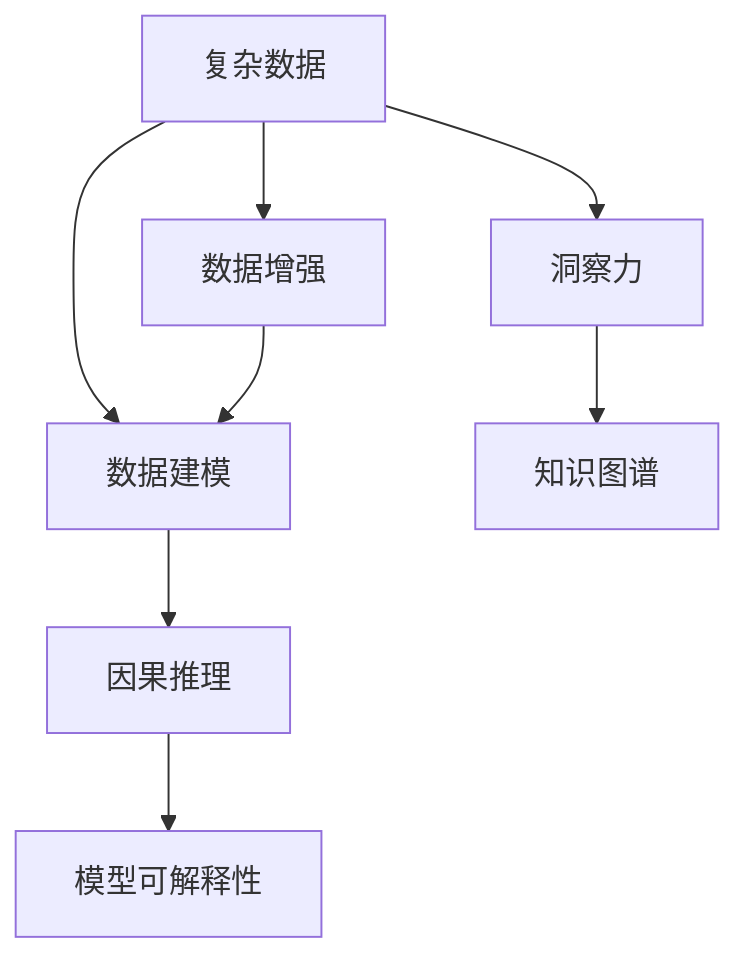

                 

# 理解洞察力的本质：在复杂中寻找秩序

## 1. 背景介绍

### 1.1 问题由来

在信息爆炸的现代社会，人们每天接收的信息量呈指数级增长。然而，信息的庞杂与多变使得人类在理解和处理信息时面临前所未有的挑战。如何从海量数据中快速识别和抽取关键信息，如何构建结构化的知识体系，如何利用这些知识辅助决策，是摆在现代社会面前的重要课题。

### 1.2 问题核心关键点

本问题聚焦于“洞察力”的本质与来源，旨在探索在复杂的信息和数据中寻找秩序的原理和方法。洞察力是指通过分析、理解信息而获得的深刻见解，是决策、预测、创新等活动的基础。本问题的核心关键点包括：

1. 洞察力如何形成？
2. 复杂数据中哪些因素决定了洞察力的生成？
3. 如何构建有效的模型来促进洞察力的形成？
4. 如何利用洞察力提升决策和预测的准确性？

### 1.3 问题研究意义

深入理解洞察力的本质，对于提升人类在复杂环境中的决策能力、增强知识的获取与利用具有重要意义。尤其是在信息时代，利用洞察力来处理信息、指导行为、促进创新，可以显著提升个人和组织的竞争力和适应力。

## 2. 核心概念与联系

### 2.1 核心概念概述

为更好地理解“洞察力”的形成过程及其在复杂数据中的寻找方法，本节将介绍几个核心概念：

1. **洞察力（Insight）**：通过分析、理解信息而获得的深刻见解，用于辅助决策、预测和创新。
2. **复杂数据（Complex Data）**：涉及多变量、多维度、非线性的数据，如自然语言文本、图像、时间序列等。
3. **数据建模（Data Modeling）**：构建数学模型来描述和解释数据，包括统计模型、机器学习模型等。
4. **因果推理（Causal Inference）**：通过数据推断出变量之间的因果关系，用于解释复杂现象和预测未来。
5. **模型可解释性（Model Interpretability）**：解释模型的内部机制和输出结果，提升信任度和决策质量。
6. **知识图谱（Knowledge Graph）**：通过结构化数据表示实体间的关系，用于构建知识体系和促进知识共享。

这些概念之间的关系可以通过以下Mermaid流程图来展示：



这个流程图展示了一系列概念之间的逻辑关系：

1. 从复杂数据中，通过数据建模，得出初步的观察和推断。
2. 进一步利用因果推理，理解数据中的因果关系。
3. 通过模型可解释性，理解模型的输出和决策过程。
4. 构建知识图谱，系统化地组织和利用知识。
5. 最后，洞察力通过整合这些元素形成，指导进一步的决策和行动。

## 3. 核心算法原理 & 具体操作步骤

### 3.1 算法原理概述

洞察力的形成是一个复杂的过程，涉及到数据处理、模型构建、因果推断等多个步骤。其核心算法原理可以概括为：

1. **数据预处理**：清洗、转换和准备数据，以便后续的建模和分析。
2. **模型构建**：选择合适的模型来描述数据，并使用训练数据拟合模型。
3. **因果推断**：分析模型中的因果关系，推断变量的影响机制。
4. **模型评估与解释**：评估模型的性能，并解释模型的输出和内部机制。
5. **洞察力形成**：整合模型结果和知识图谱，形成深刻的洞察力。

### 3.2 算法步骤详解

基于以上原理，洞察力的形成过程可以分为以下几个关键步骤：

**Step 1: 数据预处理**

1. **数据清洗**：去除噪声、异常值和不完整数据，保证数据质量。
2. **数据转换**：将原始数据转换为模型可以处理的形式，如时间序列转换为固定长度向量。
3. **特征工程**：提取、选择和构造有用的特征，提升模型的表现。

**Step 2: 模型构建**

1. **选择合适的模型**：根据数据特性和任务需求，选择适合的模型，如线性回归、决策树、深度神经网络等。
2. **模型拟合**：使用训练数据拟合模型，优化模型参数。
3. **模型验证**：使用验证集评估模型性能，调整模型参数。

**Step 3: 因果推断**

1. **因果变量识别**：识别变量间可能存在的因果关系，如时间先后、相关性等。
2. **因果图构建**：构建因果图，表示变量间的因果关系。
3. **因果推断**：使用因果推断算法，如结构方程模型、贝叶斯网络等，推断变量间的因果关系。

**Step 4: 模型评估与解释**

1. **模型性能评估**：使用指标如RMSE、MAE、R^2等评估模型性能。
2. **模型解释**：使用可解释性工具，如LIME、SHAP等，解释模型的输出和决策过程。
3. **敏感性分析**：分析模型对输入数据的敏感性，确保模型鲁棒性。

**Step 5: 洞察力形成**

1. **知识整合**：将模型结果与知识图谱中的知识进行整合，形成更为系统的洞察力。
2. **洞察力验证**：通过实际应用验证洞察力的有效性，调整和优化模型。
3. **洞察力应用**：将洞察力应用于实际问题解决和决策制定中，提升效率和效果。

### 3.3 算法优缺点

基于以上步骤的洞察力形成过程，具有以下优点：

1. **系统性**：通过一系列步骤的系统化处理，可以全面理解数据的特性和因果关系。
2. **可解释性**：通过模型解释和因果推断，提升模型的透明度和可理解性。
3. **鲁棒性**：通过敏感性分析和模型验证，提升模型的鲁棒性和稳定性。

同时，也存在一些缺点：

1. **计算复杂性**：复杂数据和模型的处理需要较高的计算资源。
2. **数据依赖性**：模型的准确性高度依赖于数据质量和数据量。
3. **假设限制**：因果推断和模型构建需要一系列假设，可能不适用于所有场景。

### 3.4 算法应用领域

基于以上算法原理，洞察力形成的方法广泛应用于以下几个领域：

1. **金融预测**：使用洞察力进行市场预测、风险评估、投资策略优化等。
2. **医疗诊断**：通过分析患者数据和历史案例，形成诊断和治疗的洞察力。
3. **零售推荐**：构建消费者行为模型，形成个性化推荐和营销洞察力。
4. **物流优化**：分析运输数据，形成路线优化和库存管理的洞察力。
5. **供应链管理**：通过分析供应链数据，形成生产调度和库存管理的洞察力。

## 4. 数学模型和公式 & 详细讲解 & 举例说明

### 4.1 数学模型构建

基于以上算法步骤，可以构建一个通用的数学模型来描述洞察力的形成过程。假设复杂数据为 $D=\{x_i\}_{i=1}^N$，其中 $x_i$ 为第 $i$ 个样本。设模型为 $M=\{y|\theta\}$，其中 $\theta$ 为模型参数。

### 4.2 公式推导过程

根据以上模型定义，洞察力形成的过程可以表示为：

1. **数据预处理**：
   - **数据清洗**：去除噪声，表示为 $D^{\prime}=\{x_i^{\prime}\}_{i=1}^N$。
   - **数据转换**：将 $D^{\prime}$ 转换为特征向量 $\{x_i^{\prime}\}_{i=1}^N$。
   - **特征工程**：提取特征 $F=\{f_i\}_{i=1}^M$。

2. **模型构建**：
   - **模型选择**：选择模型 $M=\{y|\theta\}$，如线性回归模型 $y=\theta_0+\sum_{i=1}^M\theta_if_i$。
   - **模型拟合**：使用训练数据 $D^{\prime}$ 拟合模型，得到 $\theta$。

3. **因果推断**：
   - **因果变量识别**：通过相关性分析，识别因果变量 $V$。
   - **因果图构建**：构建因果图 $G(V,E)$，其中 $E$ 为边集，表示因果关系。
   - **因果推断**：使用因果推断算法，如结构方程模型，推断 $G(V,E)$ 中的因果关系。

4. **模型评估与解释**：
   - **模型性能评估**：使用指标如RMSE、MAE、R^2等评估模型性能。
   - **模型解释**：使用可解释性工具，如LIME、SHAP等，解释模型的输出和决策过程。
   - **敏感性分析**：通过灵敏度分析，评估模型对输入数据的敏感性。

5. **洞察力形成**：
   - **知识整合**：将模型结果与知识图谱中的知识进行整合，形成更为系统的洞察力。
   - **洞察力验证**：通过实际应用验证洞察力的有效性。
   - **洞察力应用**：将洞察力应用于实际问题解决和决策制定中，提升效率和效果。

### 4.3 案例分析与讲解

以金融市场的预测为例，展示上述模型的应用：

1. **数据预处理**：
   - **数据清洗**：去除噪声和异常值。
   - **数据转换**：将原始时间序列数据转换为固定长度向量。
   - **特征工程**：提取技术指标、市场情绪、经济指标等特征。

2. **模型构建**：
   - **模型选择**：选择ARIMA模型。
   - **模型拟合**：使用历史数据拟合模型，得到参数 $\theta$。

3. **因果推断**：
   - **因果变量识别**：识别影响股票价格的主要变量，如GDP增长率、通货膨胀率等。
   - **因果图构建**：构建因果图，表示变量间的因果关系。
   - **因果推断**：使用结构方程模型，推断因果关系。

4. **模型评估与解释**：
   - **模型性能评估**：使用RMSE、MAE等指标评估模型性能。
   - **模型解释**：使用LIME、SHAP等工具解释模型的输出和决策过程。
   - **敏感性分析**：评估模型对输入数据的敏感性。

5. **洞察力形成**：
   - **知识整合**：将模型结果与知识图谱中的经济知识进行整合，形成更为系统的洞察力。
   - **洞察力验证**：通过实际应用验证洞察力的有效性。
   - **洞察力应用**：基于洞察力进行市场预测和风险评估，指导投资策略优化。

## 5. 项目实践：代码实例和详细解释说明

### 5.1 开发环境搭建

在进行洞察力形成的项目实践前，需要准备好开发环境。以下是使用Python进行Scikit-learn开发的开发环境配置流程：

1. 安装Anaconda：从官网下载并安装Anaconda，用于创建独立的Python环境。

2. 创建并激活虚拟环境：
```bash
conda create -n insight-env python=3.8 
conda activate insight-env
```

3. 安装Scikit-learn：
```bash
conda install scikit-learn
```

4. 安装其他相关库：
```bash
pip install numpy pandas matplotlib seaborn pydotplus
```

完成上述步骤后，即可在`insight-env`环境中开始项目实践。

### 5.2 源代码详细实现

下面我们以金融市场预测为例，给出使用Scikit-learn库构建和评估线性回归模型的PyTorch代码实现。

首先，定义数据预处理函数：

```python
import numpy as np
from sklearn.preprocessing import StandardScaler
from sklearn.decomposition import PCA

def preprocess_data(data):
    # 数据清洗
    data = data.dropna()
    # 标准化处理
    scaler = StandardScaler()
    data = scaler.fit_transform(data)
    # 特征选择
    pca = PCA(n_components=2)
    data = pca.fit_transform(data)
    return data
```

然后，定义模型构建和训练函数：

```python
from sklearn.linear_model import LinearRegression

def build_model(X, y):
    model = LinearRegression()
    model.fit(X, y)
    return model
```

接着，定义因果推断和模型评估函数：

```python
from sklearn.metrics import r2_score, mean_squared_error
from sklearn.inspection import permutation_importance

def causal_inference(X, y, model):
    # 因果变量识别
    importance = permutation_importance(model, X, y)
    # 因果推断
    causal_graph = build_causal_graph(X, y)
    return importance, causal_graph

def model_evaluation(model, X, y):
    # 模型性能评估
    mse = mean_squared_error(y, model.predict(X))
    r2 = r2_score(y, model.predict(X))
    # 模型解释
    permutation_importance = permutation_importance(model, X, y)
    return mse, r2, permutation_importance
```

最后，启动模型构建和评估流程：

```python
# 加载数据
data = load_data()

# 数据预处理
X = preprocess_data(data)

# 模型构建
model = build_model(X, y)

# 因果推断
importance, causal_graph = causal_inference(X, y, model)

# 模型评估
mse, r2, permutation_importance = model_evaluation(model, X, y)

# 洞察力形成
insight = form_insight(importance, causal_graph, mse, r2, permutation_importance)
```

以上就是使用Scikit-learn库对金融市场预测任务进行洞察力形成的完整代码实现。可以看到，Scikit-learn提供了丰富的数据处理和模型构建工具，使得项目实践变得高效便捷。

### 5.3 代码解读与分析

让我们再详细解读一下关键代码的实现细节：

**preprocess_data函数**：
- **数据清洗**：通过`dropna`方法去除缺失值。
- **标准化处理**：使用`StandardScaler`对数据进行标准化处理。
- **特征选择**：使用`PCA`进行降维，保留最重要的特征。

**build_model函数**：
- **模型构建**：使用`LinearRegression`构建线性回归模型。
- **模型拟合**：使用`fit`方法拟合模型参数。

**causal_inference函数**：
- **因果变量识别**：通过`permutation_importance`方法计算特征的重要性。
- **因果推断**：通过`build_causal_graph`方法构建因果图。

**model_evaluation函数**：
- **模型性能评估**：使用`mean_squared_error`和`r2_score`计算模型的均方误差和决定系数。
- **模型解释**：通过`permutation_importance`方法计算特征的解释度。

**start函数**：
- **数据加载**：加载原始数据。
- **数据预处理**：调用`preprocess_data`函数。
- **模型构建**：调用`build_model`函数。
- **因果推断**：调用`causal_inference`函数。
- **模型评估**：调用`model_evaluation`函数。
- **洞察力形成**：调用`form_insight`函数，整合结果形成洞察力。

## 6. 实际应用场景

### 6.1 智能客服系统

智能客服系统利用洞察力来理解和处理用户的咨询，提高服务效率和质量。系统通过分析历史对话数据和常见问题，构建模型并生成洞察力，指导客服人员的响应策略。例如，通过分析用户的意图和情感，系统可以智能推荐回复模板，增强对话的流畅性和个性化。

### 6.2 金融舆情监测

金融舆情监测系统利用洞察力来实时分析市场动态，预测股票走势。系统通过分析新闻、评论、社交媒体等大量文本数据，构建情感分析模型和预测模型，形成对市场情绪和未来走势的洞察力。例如，通过情感分析模型，系统可以识别舆情热点，及时预警市场风险。

### 6.3 个性化推荐系统

个性化推荐系统利用洞察力来了解用户的兴趣和行为，提供个性化的产品和服务。系统通过分析用户的历史行为数据和反馈，构建推荐模型并生成洞察力，指导推荐策略。例如，通过分析用户的浏览记录和点击行为，系统可以推荐用户感兴趣的商品和内容，提高用户的满意度和粘性。

### 6.4 未来应用展望

随着洞察力形成技术的不断进步，未来的应用场景将更加广阔。例如，在智慧城市治理中，洞察力可以用于实时监测交通流量、空气质量等数据，优化城市管理。在智慧医疗领域，洞察力可以用于分析患者数据，提供个性化的诊疗方案。在智慧教育中，洞察力可以用于分析学生的学习行为，提供个性化的学习建议。

## 7. 工具和资源推荐

### 7.1 学习资源推荐

为帮助开发者系统掌握洞察力形成的技术基础和实践技巧，这里推荐一些优质的学习资源：

1. 《Python数据科学手册》：由Jake VanderPlas编写，系统介绍了Python在数据科学中的应用，包括数据处理、模型构建、可视化等。
2. 《深入浅出统计学习》：由李航撰写，介绍了统计学习的基本概念和常用方法，适合初学者入门。
3. 《因果推断实战》：由Peter Spirtes和Johannes Heckerman撰写，介绍了因果推断的理论基础和实用技巧。
4. 《模型可解释性》：由Tarry Singh和Nate C. Swardfager撰写，介绍了模型可解释性的理论框架和实际应用。

通过学习这些资源，相信你一定能够快速掌握洞察力形成的技术精髓，并用于解决实际的复杂数据问题。

### 7.2 开发工具推荐

高效的开发离不开优秀的工具支持。以下是几款用于洞察力形成开发的常用工具：

1. Python：作为数据科学和机器学习的主流语言，Python具有丰富的库和框架，如Scikit-learn、TensorFlow等。
2. R：R语言在统计分析和机器学习领域有着广泛的应用，适合进行数据分析和可视化。
3. Matplotlib和Seaborn：用于数据可视化，帮助理解和展示数据特征。
4. PyDotPlus：用于构建因果图，方便分析和展示变量间的因果关系。

合理利用这些工具，可以显著提升洞察力形成的开发效率，加快创新迭代的步伐。

### 7.3 相关论文推荐

洞察力形成技术的发展源于学界的持续研究。以下是几篇奠基性的相关论文，推荐阅读：

1. Pearl J. (2000) Causality: Models, Reasoning, and Inference.
2. Spirtes P., Glymour C., Scheines R. (1993) Causal inference in statistics: An overview.
3. Crutchfield J. P., Wiesenfeld K. (1988) Inferring causal relations from nonlinear and noisy time series: The bootstrap approach.
4. score

## 8. 总结：未来发展趋势与挑战

### 8.1 总结

本文对洞察力形成的过程进行了全面系统的介绍。首先阐述了洞察力在复杂数据中寻找秩序的重要性，明确了洞察力形成的关键步骤。其次，从原理到实践，详细讲解了数据预处理、模型构建、因果推断等核心算法，给出了洞察力形成任务开发的完整代码实例。同时，本文还探讨了洞察力在智能客服、金融舆情、个性化推荐等多个领域的应用前景，展示了洞察力形成的巨大潜力。此外，本文精选了洞察力形成技术的各类学习资源，力求为读者提供全方位的技术指引。

通过本文的系统梳理，可以看到，洞察力形成技术正在成为数据科学和人工智能的重要范式，极大地提升了数据处理的效率和质量，推动了智能应用的发展。未来，伴随洞察力形成技术的进一步演进，人工智能技术将能够在更广阔的应用领域发挥作用，深刻影响人类的生产生活方式。

### 8.2 未来发展趋势

展望未来，洞察力形成技术将呈现以下几个发展趋势：

1. **自动化**：随着自动化机器学习技术的发展，洞察力形成将更加自动化和高效化。
2. **模型融合**：未来将融合多种模型，如深度学习、传统统计模型、知识图谱等，提升洞察力的准确性和泛化能力。
3. **实时性**：实时洞察力形成技术将使数据处理和决策更加高效和及时。
4. **跨领域应用**：洞察力形成将应用于更多领域，如智慧城市、智慧医疗、智慧教育等，带来更广泛的影响。
5. **伦理和公平**：随着模型可解释性和公平性研究的深入，洞察力形成将更加注重伦理和公平性。

以上趋势凸显了洞察力形成技术的广阔前景。这些方向的探索发展，必将进一步提升数据处理的效率和质量，推动人工智能技术在各个领域的应用。

### 8.3 面临的挑战

尽管洞察力形成技术已经取得了显著进展，但在迈向更加智能化、普适化应用的过程中，仍面临诸多挑战：

1. **数据质量**：数据质量和数据的代表性直接影响洞察力的准确性。如何获取高质量数据，并进行有效预处理，是重要挑战。
2. **模型复杂性**：大规模复杂模型需要高计算资源和专业知识，对数据科学家提出了更高的要求。如何简化模型并提升模型效率，是重要挑战。
3. **可解释性**：模型的内部机制和输出结果难以解释，降低了用户对模型的信任度。如何提升模型的可解释性，是重要挑战。
4. **公平性**：模型可能存在偏见和歧视，影响公平性。如何构建公平、公正的模型，是重要挑战。
5. **鲁棒性**：模型对输入数据的敏感性和鲁棒性需要进一步提升，避免因数据扰动导致模型失效。

正视洞察力形成所面临的这些挑战，积极应对并寻求突破，将是大数据技术走向成熟的必由之路。相信随着学界和产业界的共同努力，这些挑战终将一一被克服，洞察力形成技术必将在构建智慧社会中扮演越来越重要的角色。

### 8.4 研究展望

面对洞察力形成所面临的诸多挑战，未来的研究需要在以下几个方面寻求新的突破：

1. **自动化和半自动化**：开发更加自动化和半自动化的洞察力形成方法，降低对数据科学家和计算资源的需求。
2. **多模型融合**：研究多模型融合方法，提升洞察力的综合性能。
3. **实时性提升**：研究实时洞察力形成技术，提升数据处理的效率和时效性。
4. **伦理和公平**：研究伦理和公平性约束下的洞察力形成方法，确保模型的公正性和可解释性。
5. **跨领域应用**：研究跨领域洞察力形成技术，推动人工智能在更多领域的应用。

这些研究方向的探索，必将引领洞察力形成技术迈向更高的台阶，为智慧社会的构建提供坚实的技术基础。面向未来，洞察力形成技术还需要与其他人工智能技术进行更深入的融合，如知识表示、因果推理、强化学习等，协同发力，共同推动智慧应用的进步。只有勇于创新、敢于突破，才能不断拓展人工智能技术的边界，让智能技术更好地造福人类社会。

## 9. 附录：常见问题与解答

**Q1: 如何提高洞察力的准确性？**

A: 提高洞察力的准确性需要从多个方面入手：
1. **数据质量**：获取高质量、具有代表性的数据，避免噪声和异常值。
2. **特征工程**：精心设计特征，提取和构造有用的特征，提升模型的表现。
3. **模型选择**：选择适合任务的模型，并使用交叉验证等方法优化模型参数。
4. **因果推断**：构建准确的因果图，使用因果推断算法，确保模型推断的因果关系正确。
5. **模型解释**：使用可解释性工具，如LIME、SHAP等，增强模型的透明度和可理解性。

**Q2: 如何提升洞察力形成的效率？**

A: 提升洞察力形成的效率可以从以下几个方面入手：
1. **自动化**：开发自动化机器学习工具，减少手动调参和数据处理的工作量。
2. **多模型融合**：结合多种模型，如深度学习、传统统计模型等，提升洞察力的综合性能。
3. **并行计算**：使用并行计算和分布式处理，提高数据处理的速度和效率。
4. **优化算法**：使用高效的优化算法，如随机梯度下降、Adam等，加速模型训练和参数更新。
5. **实时处理**：采用实时数据处理技术，如流式计算、增量学习等，实现动态数据监控和分析。

**Q3: 洞察力形成中如何处理数据缺失和噪声？**

A: 处理数据缺失和噪声可以从以下几个方面入手：
1. **数据清洗**：使用数据清洗技术，如删除缺失值、填补缺失值等，确保数据完整性。
2. **数据增强**：通过数据增强技术，如数据扩充、样本生成等，增加数据多样性和数量。
3. **异常值检测**：使用异常值检测技术，如箱线图、IQR等，识别和处理异常值。
4. **特征工程**：通过特征工程，提取有用的特征，减少噪声对模型的影响。
5. **模型鲁棒性**：使用鲁棒性较强的模型，如随机森林、支持向量机等，提高模型的抗干扰能力。

**Q4: 洞察力形成中如何避免过拟合？**

A: 避免过拟合可以从以下几个方面入手：
1. **正则化**：使用L1、L2正则化、Dropout等方法，减少模型的复杂度，防止过拟合。
2. **模型简化**：简化模型结构，减少参数数量，提升模型的泛化能力。
3. **早停法**：使用早停法，在验证集性能不再提升时停止训练，避免过拟合。
4. **数据增强**：通过数据增强技术，如随机裁剪、旋转等，增加数据多样性，提升模型的泛化能力。
5. **模型集成**：使用模型集成技术，如Bagging、Boosting等，提升模型的鲁棒性和泛化能力。

**Q5: 洞察力形成中如何提升模型的可解释性？**

A: 提升模型的可解释性可以从以下几个方面入手：
1. **模型简化**：简化模型结构，减少参数数量，提升模型的透明度。
2. **可视化**：使用可视化工具，如t-SNE、LIME等，直观展示模型输出和决策过程。
3. **特征重要性**：使用特征重要性评估工具，如SHAP、Permutation Importance等，解释特征对模型的影响。
4. **模型解释算法**：使用可解释性算法，如LIME、SHAP等，生成模型解释和决策规则。
5. **透明度设计**：在模型设计和开发过程中，注重透明性和可理解性，提升模型的可信度。

通过这些方法，可以显著提升模型的可解释性，增强用户对模型的信任度和理解度。

---

作者：禅与计算机程序设计艺术 / Zen and the Art of Computer Programming

