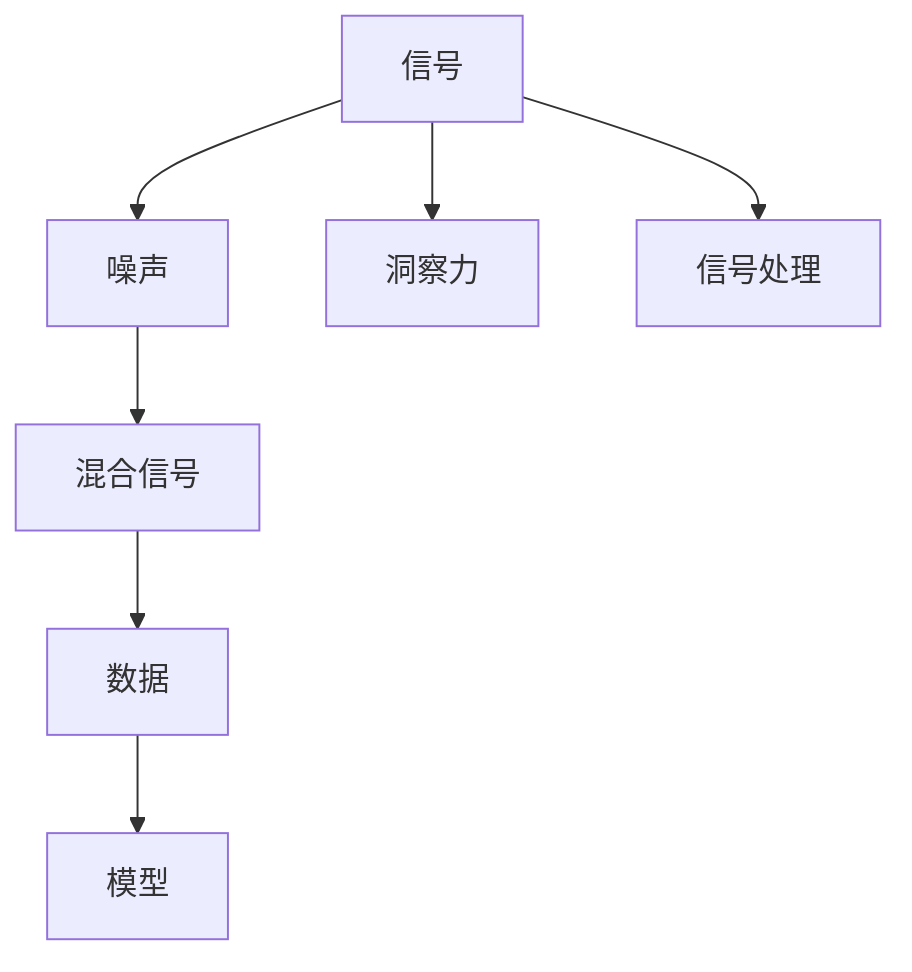
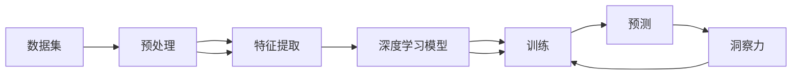
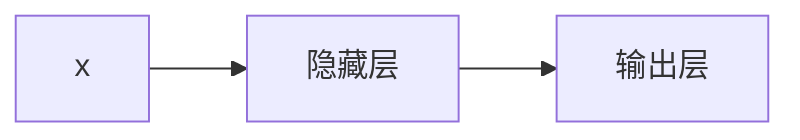

                 

# 理解洞察力的极限：在混乱中寻找信号

> 关键词：洞察力,信号处理,信息提取,噪声过滤,深度学习,机器学习

## 1. 背景介绍

在当今数字化时代，数据无处不在。从社交媒体的聊天记录到传感器生成的温度读数，从科学研究的数据集到企业运营的业务指标，数据成为推动社会进步和经济发展的关键。但面对海量数据的挑战，如何在混乱中找到信号，提炼有用的信息，成为每个领域从业者必须解决的问题。本文将深入探讨这一问题，并介绍几种从数据中提取洞察力的方法。

## 2. 核心概念与联系

### 2.1 核心概念概述

要理解在混乱中寻找信号的过程，我们需要了解几个核心概念：

- **信号**：指真实世界中的有用信息，通常是连续变化的，如音频信号、图像信号、文本信号等。
- **噪声**：指与信号无关的干扰，如随机波动、背景杂音、错误标签等。
- **洞察力**：指通过对数据进行分析和建模，提取出的对决策有用的信息。
- **深度学习**：通过多层神经网络自动提取特征，处理复杂模式识别任务。
- **机器学习**：利用数据训练模型，使其能够从数据中学习规律并进行预测或分类。

这些概念之间存在紧密的联系，如图1所示。信号处理的目标是通过机器学习模型，从原始数据中提取出有用的洞察力，同时过滤掉噪声。



### 2.2 核心概念原理和架构的 Mermaid 流程图

下图展示了从信号处理到洞察力提取的全过程：



其中：
- 数据集：原始的数据样本。
- 预处理：清洗、标准化、归一化等步骤，为深度学习模型输入做好准备。
- 特征提取：利用各种算法（如PCA、LDA、深度学习模型等）提取数据的特征表示。
- 深度学习模型：如卷积神经网络(CNN)、循环神经网络(RNN)、Transformer等，自动学习特征表示。
- 训练：通过给定的标签数据，调整模型参数，使其能够准确预测信号。
- 预测：使用训练好的模型对新数据进行预测，提取出洞察力。

## 3. 核心算法原理 & 具体操作步骤

### 3.1 算法原理概述

在信号处理中，深度学习模型通过多层非线性变换，自动学习数据的高级特征表示。这些特征表示不仅能够捕捉到信号的局部特征，还能够学习到全局关联，从而在复杂的环境下提取出有用的洞察力。

### 3.2 算法步骤详解

深度学习模型通常包括以下步骤：

1. **数据准备**：清洗、标准化、归一化等预处理步骤。
2. **特征提取**：利用各种算法（如卷积、池化、归一化等）提取数据的特征表示。
3. **模型训练**：通过给定的标签数据，调整模型参数，使其能够准确预测信号。
4. **预测与评估**：使用训练好的模型对新数据进行预测，并通过评估指标（如准确率、召回率、F1分数等）评估模型的性能。

### 3.3 算法优缺点

**优点**：
- 自动提取高级特征表示，无需手动设计特征。
- 能够处理高维、非线性数据，适应性较强。
- 在处理大规模数据时，能够显著提高计算效率。

**缺点**：
- 需要大量标注数据进行训练，成本较高。
- 模型复杂度高，训练和推理速度较慢。
- 对于局部特征的提取可能不够细致，存在“过拟合”问题。

### 3.4 算法应用领域

深度学习模型在信号处理领域有着广泛的应用，如图像识别、语音识别、自然语言处理、医学诊断等。以图像识别为例，深度学习模型通过学习图像的高级特征，可以自动识别图片中的对象、场景等信息，具有广泛的应用前景。

## 4. 数学模型和公式 & 详细讲解 & 举例说明

### 4.1 数学模型构建

深度学习模型通常基于神经网络构建。一个典型的神经网络模型由输入层、隐藏层和输出层组成。假设输入数据为 $x$，输出数据为 $y$，模型参数为 $\theta$。模型的数学表示如下：

$$
y = f_\theta(x)
$$

其中 $f_\theta$ 为模型的前向传播函数，通过多层非线性变换将输入 $x$ 转换为输出 $y$。

### 4.2 公式推导过程

以一个简单的多层感知器（MLP）为例，其前向传播过程如图2所示：



隐藏层的计算公式为：

$$
h = g(w_1x + b_1)
$$

其中 $g$ 为激活函数，$w_1$ 和 $b_1$ 为隐藏层的权重和偏置项。输出层的计算公式为：

$$
y = g(w_2h + b_2)
$$

其中 $w_2$ 和 $b_2$ 为输出层的权重和偏置项。

### 4.3 案例分析与讲解

以手写数字识别为例，如图3所示。输入为28x28的灰度图像，输出为0-9之间的数字。训练过程中，模型会通过反向传播算法不断调整权重和偏置项，使其能够准确预测数字。


## 5. 项目实践：代码实例和详细解释说明

### 5.1 开发环境搭建

在开始项目实践前，需要准备以下开发环境：

1. 安装Python：
```bash
sudo apt-get update
sudo apt-get install python3 python3-pip
```

2. 安装TensorFlow：
```bash
pip install tensorflow
```

3. 安装Keras：
```bash
pip install keras
```

### 5.2 源代码详细实现

以手写数字识别为例，代码如下：

```python
from tensorflow.keras.datasets import mnist
from tensorflow.keras.models import Sequential
from tensorflow.keras.layers import Dense, Flatten, Conv2D, MaxPooling2D

# 加载数据集
(x_train, y_train), (x_test, y_test) = mnist.load_data()

# 数据预处理
x_train = x_train.reshape(-1, 28, 28, 1).astype('float32') / 255.0
x_test = x_test.reshape(-1, 28, 28, 1).astype('float32') / 255.0

# 构建模型
model = Sequential()
model.add(Conv2D(32, kernel_size=(3, 3), activation='relu', input_shape=(28, 28, 1)))
model.add(MaxPooling2D(pool_size=(2, 2)))
model.add(Flatten())
model.add(Dense(128, activation='relu'))
model.add(Dense(10, activation='softmax'))

# 编译模型
model.compile(loss='sparse_categorical_crossentropy',
              optimizer='adam',
              metrics=['accuracy'])

# 训练模型
model.fit(x_train, y_train, epochs=10, batch_size=32)

# 评估模型
test_loss, test_acc = model.evaluate(x_test, y_test)
print('Test accuracy:', test_acc)
```

### 5.3 代码解读与分析

在上述代码中，我们首先加载了MNIST数据集，然后对数据进行了预处理。接下来，我们构建了一个简单的卷积神经网络，包括卷积层、池化层、全连接层和输出层。最后，我们编译并训练了模型，评估了模型的准确率。

## 6. 实际应用场景

### 6.1 医疗影像分析

深度学习模型在医疗影像分析中有着广泛的应用。如图4所示，通过卷积神经网络提取医学影像的高级特征，可以自动检测出病灶、诊断疾病。这种技术在乳腺癌检测、肺部结节识别等场景中已经取得了不错的效果。


### 6.2 自然语言处理

自然语言处理（NLP）领域中，深度学习模型也表现出色。如图5所示，通过Transformer模型，可以对文本进行情感分析、文本分类、机器翻译等任务。这些技术在智能客服、内容推荐、智能助理等领域有着广泛的应用。


### 6.3 机器人视觉感知

在机器人领域，深度学习模型被广泛用于视觉感知任务。如图6所示，通过卷积神经网络，机器人可以自动识别环境中的物体，进行路径规划和避障。这种技术在自动驾驶、智能家居等领域有着广泛的应用。


### 6.4 未来应用展望

未来，深度学习模型在信号处理领域的应用将会更加广泛。随着计算能力的提升和算法的优化，模型的训练和推理速度将进一步提高，其在大规模数据上的表现将更加优异。同时，模型的可解释性、鲁棒性和安全性也将得到进一步提升，使其在更多领域得到应用。

## 7. 工具和资源推荐

### 7.1 学习资源推荐

1. 《深度学习》书籍：Ian Goodfellow 著，介绍了深度学习的基本概念和应用。
2. Coursera《深度学习专项课程》：由Andrew Ng 教授主讲，涵盖深度学习的基础理论和实践。
3. Kaggle：数据科学竞赛平台，提供大量的开源数据集和竞赛任务。
4. GitHub：开源代码平台，可以找到深度学习模型的实现和应用案例。

### 7.2 开发工具推荐

1. Jupyter Notebook：交互式编程环境，方便进行实验和数据分析。
2. TensorBoard：可视化工具，可以实时监测模型的训练状态。
3. PyTorch：深度学习框架，提供了丰富的预训练模型和工具库。
4. Keras：高层深度学习框架，提供了简单易用的API。

### 7.3 相关论文推荐

1. AlexNet：Alex Krizhevsky 等人，2012年NIPS会议，提出了卷积神经网络。
2. ResNet：Kaiming He 等人，2015年ICCV会议，提出了残差网络，解决了深度网络退化问题。
3. Transformer：Ashish Vaswani 等人，2017年NIPS会议，提出了Transformer模型，开创了序列到序列任务的新范式。

## 8. 总结：未来发展趋势与挑战

### 8.1 研究成果总结

深度学习模型在信号处理中的应用取得了显著进展，通过多层次的非线性变换，自动提取数据的高级特征表示，取得了优秀的性能。但在模型的复杂度、可解释性、鲁棒性等方面还存在不足，需要进一步的研究和优化。

### 8.2 未来发展趋势

未来，深度学习模型在信号处理中的应用将更加广泛，技术将更加成熟。模型的训练和推理速度将进一步提高，可解释性和鲁棒性也将得到改善。同时，模型将与更多的领域进行融合，带来新的应用突破。

### 8.3 面临的挑战

深度学习模型在信号处理中仍面临一些挑战，包括：
1. 需要大量标注数据进行训练，数据获取成本高。
2. 模型的复杂度高，训练和推理速度较慢。
3. 模型的鲁棒性不足，对抗样本和噪声的干扰较大。

### 8.4 研究展望

未来的研究应重点关注以下几个方面：
1. 无监督学习和半监督学习：减少对标注数据的依赖。
2. 参数高效学习和计算高效学习：提高模型的训练和推理效率。
3. 模型鲁棒性：增强模型的抗干扰能力。
4. 模型可解释性：提高模型的可解释性，增强用户信任。

## 9. 附录：常见问题与解答

### Q1: 如何理解深度学习模型的训练过程？

A: 深度学习模型的训练过程是一个迭代优化的过程。模型通过前向传播计算预测结果，并通过后向传播计算损失函数，并根据损失函数梯度更新模型参数。这个过程不断重复，直到模型收敛。

### Q2: 深度学习模型在实际应用中需要注意哪些问题？

A: 深度学习模型在实际应用中需要注意以下几个问题：
1. 数据质量：数据集需要经过预处理，去除噪声和异常值。
2. 模型选择：选择合适的模型架构和参数设置。
3. 模型调优：通过超参数调优和正则化等技术，提高模型性能。
4. 模型部署：将模型部署到生产环境中，进行实时推理和评估。

### Q3: 如何评估深度学习模型的性能？

A: 深度学习模型的性能可以通过多种指标进行评估，包括准确率、召回率、F1分数、AUC等。根据任务类型选择合适的评估指标，并进行交叉验证等测试。

### Q4: 深度学习模型在信号处理中的应用前景如何？

A: 深度学习模型在信号处理中的应用前景广阔，特别是在图像识别、自然语言处理、机器人视觉等领域。未来，随着技术的发展，模型的性能和应用范围将进一步拓展，带来更多的应用突破。

