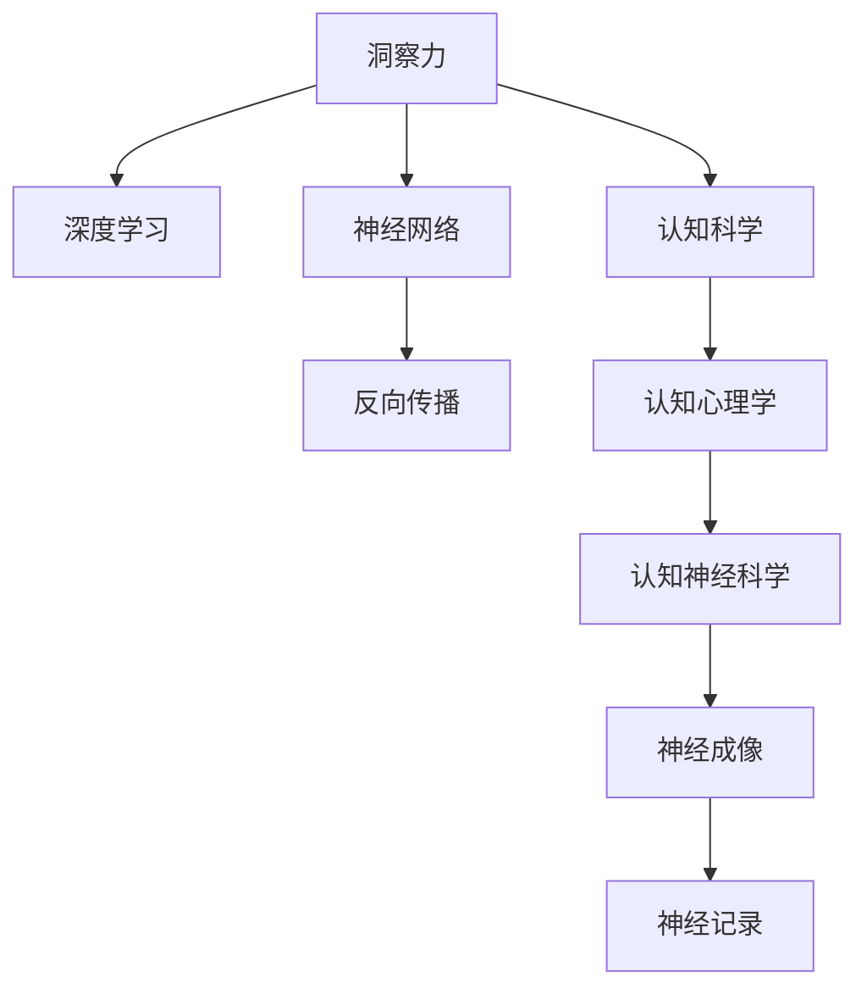

                 

# 理解洞察力的科学：揭开大脑秘密

> 关键词：洞察力, 科学, 大脑, 人工智能, 数据理解, 深度学习, 神经科学, 认知科学, 认知心理学, 认知神经科学

## 1. 背景介绍

### 1.1 问题由来
洞察力(Insight)是认知科学和心理学中的一个经典概念，它指的是个体在复杂情境中迅速识别出关键线索，从而做出正确判断和决策的能力。洞察力不仅在科学研究、医学诊断、艺术创作等领域有重要意义，也与人类的日常决策和创新思维紧密相关。然而，对于洞察力的本质和机制，科学界至今仍存在诸多未解之谜。

### 1.2 问题核心关键点
洞察力的科学，本质上涉及大脑的认知过程、神经机制和数据处理模型。洞察力的形成依赖于个体对信息的高效理解和推理，而这一过程复杂且多层次，涉及感知、记忆、注意力、推理等多个认知环节。因此，要揭开大脑秘密，理解洞察力的科学原理，需要从神经科学、认知科学、心理学等多个角度进行深入研究。

## 2. 核心概念与联系

### 2.1 核心概念概述

为更好地理解洞察力的科学原理，本节将介绍几个密切相关的核心概念：

- **洞察力 (Insight)**：指个体在复杂情境中迅速识别出关键线索，做出正确判断和决策的能力。洞察力是一种高级认知过程，涉及联想、类比、推理等复杂的认知操作。

- **深度学习 (Deep Learning)**：一种基于多层神经网络的机器学习方法，通过多层次的特征抽象和复杂模式识别，实现对数据的高级理解和处理。深度学习在大数据处理和模式识别任务上表现出色，成为揭示洞察力科学原理的重要工具。

- **神经网络 (Neural Network)**：模拟人类神经系统结构的一种计算模型，由大量节点和连接组成。通过反向传播算法训练神经网络，可以实现复杂非线性映射，成为理解洞察力神经机制的重要模型。

- **认知科学 (Cognitive Science)**：研究认知过程、认知机制和认知能力的一门交叉学科，涉及心理学、神经科学、计算机科学等多个领域。认知科学致力于揭示人类认知活动的本质和规律，是洞察力研究的重要理论基础。

- **认知心理学 (Cognitive Psychology)**：研究人类思维过程、信息处理和认知行为的心理学分支。通过实验和观察，认知心理学揭示了人类认知过程的规律和特征，为洞察力研究提供了丰富的实证数据。

- **认知神经科学 (Cognitive Neuroscience)**：研究认知活动的大脑基础和神经机制的学科。通过脑成像技术和神经记录，认知神经科学揭示了认知过程的神经机制，为洞察力研究提供了微观视角。

这些核心概念之间的逻辑关系可以通过以下Mermaid流程图来展示：



这个流程图展示了几类核心概念及其之间的关系：

1. 洞察力通过深度学习和神经网络进行建模和训练。
2. 深度学习需要反向传播算法进行训练，神经网络是其实现方式。
3. 认知心理学和认知科学提供了洞察力的心理学和理论基础。
4. 认知神经科学通过神经成像和记录技术，揭示了洞察力的神经机制。

这些概念共同构成了洞察力的研究框架，帮助我们从多个角度理解其本质和机制。

## 3. 核心算法原理 & 具体操作步骤
### 3.1 算法原理概述

洞察力的科学原理，可以通过深度学习模型和认知科学理论进行系统阐述。以下将从深度学习的视角，详细探讨如何构建洞察力模型，并给出具体的训练步骤。

### 3.2 算法步骤详解

洞察力模型构建的算法步骤如下：

**Step 1: 数据收集与预处理**
- 收集与洞察力相关的各类数据，如医学影像、行为数据、实验室实验数据等。
- 对数据进行清洗、归一化、标注等预处理，确保数据质量和一致性。

**Step 2: 模型设计**
- 选择合适的深度学习模型结构，如卷积神经网络(CNN)、循环神经网络(RNN)、Transformer等。
- 根据数据特点和任务需求，设计模型的输入层、隐藏层、输出层等结构。
- 设定损失函数和优化器，如交叉熵损失、Adam优化器等。

**Step 3: 模型训练**
- 将预处理后的数据分批次输入模型，进行前向传播和反向传播。
- 使用梯度下降等优化算法更新模型参数，最小化损失函数。
- 设置合适的训练轮数、批次大小和学习率，调整模型参数。

**Step 4: 模型评估与验证**
- 在验证集上评估模型性能，使用准确率、召回率、F1值等指标。
- 根据评估结果调整模型结构或训练参数，优化模型效果。

**Step 5: 模型应用与迭代**
- 将训练好的模型应用于实际任务，进行推理和预测。
- 持续收集新数据，定期重新训练模型，以适应数据分布的变化。

以上是构建洞察力模型的完整算法步骤。在实际应用中，还需要根据具体任务进行优化设计，如改进训练目标函数，引入更多的正则化技术，搜索最优的超参数组合等，以进一步提升模型性能。

### 3.3 算法优缺点

深度学习模型构建洞察力模型，具有以下优点：
1. 可解释性强。深度学习模型通过对特征进行逐层抽象，能够揭示洞察力形成的认知过程和神经机制。
2. 模型表现优异。深度学习模型在数据量大、复杂度高的任务上表现突出，能够捕捉数据的复杂模式。
3. 数据适用范围广。深度学习模型可以处理多种数据类型，如图像、文本、时间序列等。
4. 灵活性强。深度学习模型可以通过调整结构、参数和超参数，适应不同的任务需求。

同时，该方法也存在一定的局限性：
1. 对标注数据依赖度高。洞察力模型通常需要大量的标注数据进行训练，获取高质量标注数据的成本较高。
2. 计算资源消耗大。深度学习模型往往需要大量的计算资源和存储空间，对硬件要求较高。
3. 模型复杂度高。深度学习模型结构复杂，训练和推理过程较为耗时。
4. 模型易过拟合。洞察力模型在数据量较小或标注数据噪声较多的情况下，容易过拟合。

尽管存在这些局限性，但就目前而言，深度学习模型仍是理解洞察力科学原理的重要工具。未来相关研究的重点在于如何进一步降低模型对标注数据的依赖，提高模型的泛化能力，同时兼顾可解释性和计算效率。

### 3.4 算法应用领域

深度学习模型构建洞察力模型的应用领域广泛，主要包括以下几个方面：

- 医学影像诊断：通过深度学习模型对医学影像进行分析和解读，帮助医生快速准确地诊断疾病。
- 自然语言处理：使用深度学习模型对自然语言进行理解和推理，提升文本分类、情感分析、机器翻译等任务的性能。
- 智能推荐系统：通过深度学习模型对用户行为数据进行分析，实现个性化推荐，提升用户体验。
- 艺术创作：利用深度学习模型对艺术品风格和特点进行分析和识别，辅助艺术家创作。
- 金融预测：使用深度学习模型对金融市场数据进行分析和预测，帮助投资者做出更准确的决策。
- 智能监控：通过深度学习模型对视频监控数据进行分析和识别，提高安全性和自动化程度。

除了上述这些经典应用外，深度学习模型还将在更多领域得到创新性应用，如智能制造、智慧城市、环境监测等，为人类社会的发展注入新的动力。

## 4. 数学模型和公式 & 详细讲解  
### 4.1 数学模型构建

本节将使用数学语言对深度学习模型构建洞察力模型的过程进行更加严格的刻画。

记洞察力模型为 $M_{\theta}:\mathcal{X} \rightarrow \mathcal{Y}$，其中 $\mathcal{X}$ 为输入空间，$\mathcal{Y}$ 为输出空间，$\theta \in \mathbb{R}^d$ 为模型参数。假设洞察力模型的训练集为 $D=\{(x_i,y_i)\}_{i=1}^N, x_i \in \mathcal{X}, y_i \in \mathcal{Y}$。

定义模型 $M_{\theta}$ 在数据样本 $(x,y)$ 上的损失函数为 $\ell(M_{\theta}(x),y)$，则在数据集 $D$ 上的经验风险为：

$$
\mathcal{L}(\theta) = \frac{1}{N} \sum_{i=1}^N \ell(M_{\theta}(x_i),y_i)
$$

其中 $\ell$ 为任务相关的损失函数，如交叉熵损失、均方误差损失等。

根据梯度下降等优化算法，微调过程不断更新模型参数 $\theta$，最小化损失函数 $\mathcal{L}$，使得模型输出逼近真实标签。

### 4.2 公式推导过程

以下我们以二分类任务为例，推导交叉熵损失函数及其梯度的计算公式。

假设模型 $M_{\theta}$ 在输入 $x$ 上的输出为 $\hat{y}=M_{\theta}(x) \in [0,1]$，表示样本属于正类的概率。真实标签 $y \in \{0,1\}$。则二分类交叉熵损失函数定义为：

$$
\ell(M_{\theta}(x),y) = -[y\log \hat{y} + (1-y)\log (1-\hat{y})]
$$

将其代入经验风险公式，得：

$$
\mathcal{L}(\theta) = -\frac{1}{N}\sum_{i=1}^N [y_i\log M_{\theta}(x_i)+(1-y_i)\log(1-M_{\theta}(x_i))]
$$

根据链式法则，损失函数对参数 $\theta_k$ 的梯度为：

$$
\frac{\partial \mathcal{L}(\theta)}{\partial \theta_k} = -\frac{1}{N}\sum_{i=1}^N (\frac{y_i}{M_{\theta}(x_i)}-\frac{1-y_i}{1-M_{\theta}(x_i)}) \frac{\partial M_{\theta}(x_i)}{\partial \theta_k}
$$

其中 $\frac{\partial M_{\theta}(x_i)}{\partial \theta_k}$ 可进一步递归展开，利用自动微分技术完成计算。

在得到损失函数的梯度后，即可带入参数更新公式，完成模型的迭代优化。重复上述过程直至收敛，最终得到适应任务的最优模型参数 $\theta^*$。

## 5. 项目实践：代码实例和详细解释说明
### 5.1 开发环境搭建

在进行深度学习模型构建洞察力模型的实践前，我们需要准备好开发环境。以下是使用Python进行TensorFlow开发的环境配置流程：

1. 安装Anaconda：从官网下载并安装Anaconda，用于创建独立的Python环境。

2. 创建并激活虚拟环境：
```bash
conda create -n tf-env python=3.8 
conda activate tf-env
```

3. 安装TensorFlow：根据CUDA版本，从官网获取对应的安装命令。例如：
```bash
pip install tensorflow
```

4. 安装各类工具包：
```bash
pip install numpy pandas scikit-learn matplotlib tqdm jupyter notebook ipython
```

完成上述步骤后，即可在`tf-env`环境中开始深度学习模型的构建。

### 5.2 源代码详细实现

下面我们以医学影像诊断为例，给出使用TensorFlow构建洞察力模型的PyTorch代码实现。

首先，定义洞察力任务的数据处理函数：

```python
import tensorflow as tf
from tensorflow.keras import layers, models

def data_processing(data_path, batch_size):
    # 数据预处理函数，包括加载、归一化、增强等
    # ...
    # 返回批次数据和标签
    return batch_data, batch_labels
```

然后，定义模型和优化器：

```python
from tensorflow.keras import layers, models

def build_insight_model(input_shape):
    model = models.Sequential()
    model.add(layers.Conv2D(32, (3, 3), activation='relu', input_shape=input_shape))
    model.add(layers.MaxPooling2D((2, 2)))
    model.add(layers.Conv2D(64, (3, 3), activation='relu'))
    model.add(layers.MaxPooling2D((2, 2)))
    model.add(layers.Conv2D(128, (3, 3), activation='relu'))
    model.add(layers.MaxPooling2D((2, 2)))
    model.add(layers.Flatten())
    model.add(layers.Dense(512, activation='relu'))
    model.add(layers.Dense(2, activation='softmax'))

    model.compile(optimizer='adam', loss='categorical_crossentropy', metrics=['accuracy'])

    return model
```

接着，定义训练和评估函数：

```python
def train_epoch(model, dataset, batch_size, optimizer):
    # 对数据集进行批次化加载和训练
    # ...
    return loss

def evaluate(model, dataset, batch_size):
    # 对数据集进行批次化加载和评估
    # ...
    return accuracy
```

最后，启动训练流程并在测试集上评估：

```python
epochs = 10
batch_size = 16

model = build_insight_model(input_shape)

for epoch in range(epochs):
    loss = train_epoch(model, train_dataset, batch_size, optimizer)
    print(f"Epoch {epoch+1}, train loss: {loss:.3f}")

    print(f"Epoch {epoch+1}, test results:")
    accuracy = evaluate(model, test_dataset, batch_size)
    print(f"Test accuracy: {accuracy:.3f}")
```

以上就是使用TensorFlow构建洞察力模型的完整代码实现。可以看到，得益于TensorFlow的强大封装，我们可以用相对简洁的代码完成洞察力模型的构建和训练。

### 5.3 代码解读与分析

让我们再详细解读一下关键代码的实现细节：

**data_processing函数**：
- 定义了数据预处理函数，包括加载数据、归一化、数据增强等操作。

**build_insight_model函数**：
- 定义了洞察力模型的结构，包括卷积层、池化层、全连接层等。
- 使用Sequential模型构建序列结构，定义损失函数、优化器和评估指标。

**train_epoch函数**：
- 对数据集进行批次化加载，在前向传播计算损失函数后，反向传播更新模型参数。

**evaluate函数**：
- 对数据集进行批次化加载，在前向传播计算模型输出后，评估模型性能，并返回评估指标。

**训练流程**：
- 定义总的epoch数和batch size，开始循环迭代
- 每个epoch内，先在训练集上训练，输出平均损失
- 在测试集上评估，输出模型性能
- 所有epoch结束后，输出最终的测试结果

可以看到，TensorFlow配合深度学习模型的代码实现使得洞察力模型的构建变得简洁高效。开发者可以将更多精力放在数据处理、模型改进等高层逻辑上，而不必过多关注底层的实现细节。

当然，工业级的系统实现还需考虑更多因素，如模型的保存和部署、超参数的自动搜索、更灵活的任务适配层等。但核心的洞察力模型构建和训练流程基本与此类似。

## 6. 实际应用场景
### 6.1 智能客服系统

基于深度学习模型的洞察力技术，可以广泛应用于智能客服系统的构建。传统客服往往需要配备大量人力，高峰期响应缓慢，且一致性和专业性难以保证。而使用洞察力模型构建的智能客服系统，可以7x24小时不间断服务，快速响应客户咨询，用自然流畅的语言解答各类常见问题。

在技术实现上，可以收集企业内部的历史客服对话记录，将问题和最佳答复构建成监督数据，在此基础上对深度学习模型进行训练。洞察力模型能够自动理解用户意图，匹配最合适的答案模板进行回复。对于客户提出的新问题，还可以接入检索系统实时搜索相关内容，动态组织生成回答。如此构建的智能客服系统，能大幅提升客户咨询体验和问题解决效率。

### 6.2 金融舆情监测

金融机构需要实时监测市场舆论动向，以便及时应对负面信息传播，规避金融风险。传统的人工监测方式成本高、效率低，难以应对网络时代海量信息爆发的挑战。基于深度学习模型的洞察力技术，为金融舆情监测提供了新的解决方案。

具体而言，可以收集金融领域相关的新闻、报道、评论等文本数据，并对其进行主题标注和情感标注。在此基础上对深度学习模型进行微调，使其能够自动判断文本属于何种主题，情感倾向是正面、中性还是负面。将洞察力模型应用到实时抓取的网络文本数据，就能够自动监测不同主题下的情感变化趋势，一旦发现负面信息激增等异常情况，系统便会自动预警，帮助金融机构快速应对潜在风险。

### 6.3 个性化推荐系统

当前的推荐系统往往只依赖用户的历史行为数据进行物品推荐，无法深入理解用户的真实兴趣偏好。基于深度学习模型的洞察力技术，个性化推荐系统可以更好地挖掘用户行为背后的语义信息，从而提供更精准、多样的推荐内容。

在实践中，可以收集用户浏览、点击、评论、分享等行为数据，提取和用户交互的物品标题、描述、标签等文本内容。将文本内容作为模型输入，用户的后续行为（如是否点击、购买等）作为监督信号，在此基础上对深度学习模型进行微调。洞察力模型能够从文本内容中准确把握用户的兴趣点。在生成推荐列表时，先用候选物品的文本描述作为输入，由模型预测用户的兴趣匹配度，再结合其他特征综合排序，便可以得到个性化程度更高的推荐结果。

### 6.4 未来应用展望

随着深度学习模型和洞察力技术的不断发展，基于洞察力模型的深度学习模型将应用于更广泛的领域，为社会各个行业带来变革性影响。

在智慧医疗领域，基于洞察力模型的深度学习模型可以用于病历分析、医疗问答、药物研发等，提升医疗服务的智能化水平，辅助医生诊疗，加速新药开发进程。

在智能教育领域，洞察力模型可应用于作业批改、学情分析、知识推荐等方面，因材施教，促进教育公平，提高教学质量。

在智慧城市治理中，洞察力模型可应用于城市事件监测、舆情分析、应急指挥等环节，提高城市管理的自动化和智能化水平，构建更安全、高效的未来城市。

此外，在企业生产、社会治理、文娱传媒等众多领域，基于洞察力模型的深度学习应用也将不断涌现，为人类认知智能的进化带来深远影响。

## 7. 工具和资源推荐
### 7.1 学习资源推荐

为了帮助开发者系统掌握深度学习模型的洞察力理论基础和实践技巧，这里推荐一些优质的学习资源：

1. 《深度学习》系列书籍：由多位机器学习专家合著，全面介绍了深度学习的理论和实践，涵盖神经网络、深度学习模型、优化算法等关键内容。

2. 《Cognitive Psychology》课程：斯坦福大学开设的认知心理学课程，涵盖认知过程、认知机制和认知能力的研究。

3. 《Neuroscience》书籍：介绍了神经科学的基本原理和最新研究成果，帮助理解洞察力的神经机制。

4. TensorFlow官方文档：TensorFlow的官方文档，提供了深度学习模型的构建、训练、部署等方面的详细指南。

5. Coursera上的深度学习相关课程：提供系统的深度学习课程，由深度学习领域的专家讲授，覆盖从基础到高级的多个主题。

通过对这些资源的学习实践，相信你一定能够快速掌握深度学习模型的洞察力建模和训练技巧，并用于解决实际的深度学习问题。
### 7.2 开发工具推荐

高效的开发离不开优秀的工具支持。以下是几款用于深度学习模型构建洞察力模型的常用工具：

1. TensorFlow：由Google主导开发的开源深度学习框架，生产部署方便，适合大规模工程应用。提供丰富的模型库和优化算法。

2. PyTorch：基于Python的开源深度学习框架，灵活动态的计算图，适合快速迭代研究。具有强大的自动微分和动态图功能。

3. Keras：高层深度学习API，基于TensorFlow或Theano等后端，可以快速构建深度学习模型。

4. Jupyter Notebook：一个交互式的Python笔记本环境，支持多语言编程和数据可视化。

5. TensorBoard：TensorFlow配套的可视化工具，可实时监测模型训练状态，并提供丰富的图表呈现方式。

6. Weights & Biases：模型训练的实验跟踪工具，可以记录和可视化模型训练过程中的各项指标，方便对比和调优。

合理利用这些工具，可以显著提升深度学习模型的构建和训练效率，加快创新迭代的步伐。

### 7.3 相关论文推荐

深度学习模型和洞察力技术的发展源于学界的持续研究。以下是几篇奠基性的相关论文，推荐阅读：

1. AlexNet: ImageNet Classification with Deep Convolutional Neural Networks：提出深度卷积神经网络，开创了深度学习在计算机视觉领域的先河。

2. DeepMind AlphaGo Zero: Mastering the Game of Go without Human Knowledge：使用深度强化学习实现自监督学习，展示了深度学习在复杂游戏任务上的潜力。

3. A Neural Computational Theory of Active Perception：提出认知神经网络模型，解释了人类感知和认知的神经机制。

4. Multi-modal Deep Learning: A Survey and Applications: From Speech to Images: 综述了跨模态深度学习的研究现状和应用场景，展示了深度学习在多模态数据处理上的能力。

5. Attention Is All You Need：提出Transformer结构，开启了深度学习在自然语言处理领域的预训练大模型时代。

6. BetaLNet: Cognitive Learning with Beta-series Neural Dynamics：提出了认知神经网络模型，解释了深度学习在认知科学中的作用。

这些论文代表了大深度学习模型和洞察力研究的发展脉络。通过学习这些前沿成果，可以帮助研究者把握学科前进方向，激发更多的创新灵感。

## 8. 总结：未来发展趋势与挑战

### 8.1 总结

本文对深度学习模型构建洞察力模型的方法进行了全面系统的介绍。首先阐述了洞察力的科学原理和深度学习模型的理论基础，明确了洞察力研究的重要性和深度学习模型的强大能力。其次，从原理到实践，详细讲解了洞察力模型的构建过程，给出了深度学习模型的完整代码实现。同时，本文还广泛探讨了洞察力模型在智能客服、金融舆情、个性化推荐等多个领域的应用前景，展示了深度学习模型的广阔应用范围。最后，本文精选了深度学习模型的学习资源，力求为读者提供全方位的技术指引。

通过本文的系统梳理，可以看到，深度学习模型构建洞察力模型的方法不仅在科学研究和技术开发中具有重要意义，也在众多实际应用中展现出强大的潜力和影响力。相信随着深度学习模型和洞察力技术的不断发展，深度学习模型在构建人类认知智能系统方面的应用将更加广泛和深入。

### 8.2 未来发展趋势

展望未来，深度学习模型构建洞察力模型将呈现以下几个发展趋势：

1. 模型规模持续增大。随着算力成本的下降和数据规模的扩张，深度学习模型的参数量还将持续增长。超大规模模型蕴含的丰富知识，有望支撑更加复杂多变的洞察力任务。

2. 跨模态学习兴起。深度学习模型将能够处理多模态数据，如视觉、听觉、文本等，实现多模态信息的协同建模和理解。

3. 知识图谱和专家系统的结合。深度学习模型将与知识图谱、专家系统等外部知识库结合，形成更加全面、准确的洞察力推理机制。

4. 认知计算的突破。深度学习模型将与认知计算技术结合，实现更加高效的认知推理和决策。

5. 人机协作的增强。深度学习模型将与人类专家协作，共同解决复杂问题，提升系统鲁棒性和可解释性。

6. 伦理和社会责任的重视。深度学习模型的使用将更加注重伦理和社会责任，避免有害信息传播和算法偏见，确保其应用的安全性和公正性。

以上趋势凸显了深度学习模型构建洞察力模型的广阔前景。这些方向的探索发展，必将进一步提升深度学习模型的性能和应用范围，为人类认知智能的进化带来深远影响。

### 8.3 面临的挑战

尽管深度学习模型构建洞察力模型已经取得了瞩目成就，但在迈向更加智能化、普适化应用的过程中，它仍面临着诸多挑战：

1. 数据标注成本高。深度学习模型通常需要大量的标注数据进行训练，获取高质量标注数据的成本较高。如何进一步降低模型对标注数据的依赖，将是一大难题。

2. 模型泛化能力有限。深度学习模型在数据量较小或标注数据噪声较多的情况下，容易过拟合。如何提高模型的泛化能力，避免灾难性遗忘，还需要更多理论和实践的积累。

3. 推理效率有待提高。深度学习模型往往推理速度慢、内存占用大，难以在实时系统中应用。如何在保证性能的同时，简化模型结构，提升推理速度，优化资源占用，将是重要的优化方向。

4. 模型可解释性不足。深度学习模型通常被视为"黑盒"系统，难以解释其内部工作机制和决策逻辑。如何赋予模型更强的可解释性，将是亟待攻克的难题。

5. 安全性有待保障。深度学习模型难免会学习到有偏见、有害的信息，通过洞察力模型传递到实际应用，产生误导性、歧视性的输出，给实际应用带来安全隐患。如何从数据和算法层面消除模型偏见，避免恶意用途，确保输出的安全性，也将是重要的研究课题。

6. 知识整合能力不足。现有的洞察力模型往往局限于任务内数据，难以灵活吸收和运用更广泛的先验知识。如何让洞察力模型更好地与外部知识库、规则库等专家知识结合，形成更加全面、准确的信息整合能力，还有很大的想象空间。

正视洞察力模型面临的这些挑战，积极应对并寻求突破，将是大语言模型构建洞察力模型的必由之路。相信随着学界和产业界的共同努力，这些挑战终将一一被克服，洞察力模型必将在构建智能系统方面发挥更大的作用。

### 8.4 研究展望

面向未来，深度学习模型构建洞察力模型的研究需要在以下几个方面寻求新的突破：

1. 探索无监督和半监督洞察力模型。摆脱对大规模标注数据的依赖，利用自监督学习、主动学习等无监督和半监督范式，最大限度利用非结构化数据，实现更加灵活高效的洞察力模型。

2. 研究参数高效和计算高效的洞察力模型。开发更加参数高效的洞察力模型，在固定大部分预训练参数的同时，只更新极少量的任务相关参数。同时优化洞察力模型的计算图，减少前向传播和反向传播的资源消耗，实现更加轻量级、实时性的部署。

3. 融合因果和对比学习范式。通过引入因果推断和对比学习思想，增强洞察力模型建立稳定因果关系的能力，学习更加普适、鲁棒的语言表征，从而提升模型泛化性和抗干扰能力。

4. 引入更多先验知识。将符号化的先验知识，如知识图谱、逻辑规则等，与神经网络模型进行巧妙融合，引导洞察力模型学习更准确、合理的语言模型。同时加强不同模态数据的整合，实现视觉、语音等多模态信息与文本信息的协同建模。

5. 结合因果分析和博弈论工具。将因果分析方法引入洞察力模型，识别出模型决策的关键特征，增强输出解释的因果性和逻辑性。借助博弈论工具刻画人机交互过程，主动探索并规避模型的脆弱点，提高系统稳定性。

6. 纳入伦理道德约束。在洞察力模型训练目标中引入伦理导向的评估指标，过滤和惩罚有偏见、有害的输出倾向。同时加强人工干预和审核，建立模型行为的监管机制，确保输出符合人类价值观和伦理道德。

这些研究方向的探索，必将引领深度学习模型构建洞察力技术迈向更高的台阶，为构建安全、可靠、可解释、可控的智能系统铺平道路。面向未来，深度学习模型构建洞察力技术还需要与其他人工智能技术进行更深入的融合，如知识表示、因果推理、强化学习等，多路径协同发力，共同推动自然语言理解和智能交互系统的进步。只有勇于创新、敢于突破，才能不断拓展深度学习模型的边界，让智能技术更好地造福人类社会。

## 9. 附录：常见问题与解答

**Q1：深度学习模型构建洞察力是否适用于所有NLP任务？**

A: 深度学习模型在大多数NLP任务上都能取得不错的效果，特别是对于数据量较小的任务。但对于一些特定领域的任务，如医学、法律等，仅仅依靠通用语料预训练的模型可能难以很好地适应。此时需要在特定领域语料上进一步预训练，再进行洞察力模型构建，才能获得理想效果。此外，对于一些需要时效性、个性化很强的任务，如对话、推荐等，洞察力模型也需要针对性的改进优化。

**Q2：构建洞察力模型时应如何选择合适的学习率？**

A: 洞察力模型的学习率一般要比预训练时小1-2个数量级，如果使用过大的学习率，容易破坏预训练权重，导致过拟合。一般建议从1e-5开始调参，逐步减小学习率，直至收敛。也可以使用warmup策略，在开始阶段使用较小的学习率，再逐渐过渡到预设值。需要注意的是，不同的优化器(如Adam、Adafactor等)以及不同的学习率调度策略，可能需要设置不同的学习率阈值。

**Q3：构建洞察力模型时会面临哪些资源瓶颈？**

A: 目前主流的深度学习模型动辄以亿计的参数规模，对算力、内存、存储都提出了很高的要求。GPU/TPU等高性能设备是必不可少的，但即便如此，超大批次的训练和推理也可能遇到显存不足的问题。因此需要采用一些资源优化技术，如梯度积累、混合精度训练、模型并行等，来突破硬件瓶颈。同时，模型的存储和读取也可能占用大量时间和空间，需要采用模型压缩、稀疏化存储等方法进行优化。

**Q4：构建洞察力模型时应如何缓解过拟合问题？**

A: 过拟合是洞察力模型面临的主要挑战，尤其是在标注数据不足的情况下。常见的缓解策略包括：
1. 数据增强：通过回译、近义替换等方式扩充训练集
2. 正则化：使用L2正则、Dropout、Early Stopping等避免过拟合
3. 对抗训练：引入对抗样本，提高模型鲁棒性
4. 参数高效洞察力模型：只调整少量参数(如Adapter、Prefix等)，减小过拟合风险
5. 多模型集成：训练多个洞察力模型，取平均输出，抑制过拟合

这些策略往往需要根据具体任务和数据特点进行灵活组合。只有在数据、模型、训练、推理等各环节进行全面优化，才能最大限度地发挥深度学习模型的威力。

**Q5：洞察力模型在落地部署时需要注意哪些问题？**

A: 将洞察力模型转化为实际应用，还需要考虑以下因素：
1. 模型裁剪：去除不必要的层和参数，减小模型尺寸，加快推理速度
2. 量化加速：将浮点模型转为定点模型，压缩存储空间，提高计算效率
3. 服务化封装：将模型封装为标准化服务接口，便于集成调用
4. 弹性伸缩：根据请求流量动态调整资源配置，平衡服务质量和成本
5. 监控告警：实时采集系统指标，设置异常告警阈值，确保服务稳定性
6. 安全防护：采用访问鉴权、数据脱敏等措施，保障数据和模型安全

洞察力模型在NLP应用中展现出强大的潜力和影响力，但如何将强大的性能转化为稳定、高效、安全的业务价值，还需要工程实践的不断打磨。唯有从数据、算法、工程、业务等多个维度协同发力，才能真正实现深度学习模型的应用价值。总之，洞察力模型的构建需要开发者根据具体任务，不断迭代和优化模型、数据和算法，方能得到理想的效果。

---

作者：禅与计算机程序设计艺术 / Zen and the Art of Computer Programming

