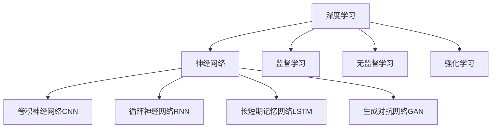

                 

# 理解洞察力：复杂世界中的导航仪

## 1. 背景介绍

### 1.1 问题由来
在当今这个信息爆炸、数据泛滥的时代，人类如何从海量的数据中提取有价值的洞察力，成为了我们面临的一大挑战。传统的统计分析和线性建模方法已经难以应对复杂的非线性关系和高维数据，迫切需要引入更为高级的统计和建模工具。

### 1.2 问题核心关键点
洞察力的获取，本质上是将数据中的信息进行高效转换和提取，从而得到对实际问题有意义的结论和预测。目前，这一过程主要由机器学习模型来完成，而其中最核心的一类模型是深度学习模型，尤其是神经网络。神经网络在图像识别、自然语言处理、推荐系统等领域中已经取得了令人瞩目的成就。

### 1.3 问题研究意义
洞察力作为理解和预测复杂系统的重要工具，对于企业决策、科学研究、医疗诊断等多个领域都具有重大意义。深度学习模型的崛起，使得洞察力的获取变得更加高效和精确，为这些领域带来了革命性的变化。

## 2. 核心概念与联系

### 2.1 核心概念概述

洞察力获取的核心概念主要包括：

- 深度学习(Deep Learning)：一类基于多层神经网络的机器学习方法，能够自动从数据中提取高级特征。
- 神经网络(Neural Network)：深度学习模型的核心，由多个层次的神经元单元组成。
- 监督学习(Supervised Learning)：使用有标签数据训练模型，使其能够预测新数据的标签。
- 无监督学习(Unsupervised Learning)：不使用标签数据，通过数据的内在关系进行特征学习。
- 强化学习(Reinforcement Learning)：通过与环境的交互，学习最优策略以达成目标。

这些概念之间的逻辑关系可以通过以下Mermaid流程图来展示：



这个流程图展示了几类关键概念及其之间的关系：

1. 深度学习通过神经网络模型来实现数据特征提取。
2. 监督学习和无监督学习是深度学习模型训练的主要范式。
3. 强化学习适用于一些需要与环境交互的任务。
4. 不同类型的神经网络模型（如CNN、RNN、LSTM、GAN等）在处理不同类型的数据和任务时各具优势。

## 3. 核心算法原理 & 具体操作步骤

### 3.1 算法原理概述

洞察力的获取，通常是通过深度学习模型在数据上进行训练，学习数据中的内在关系，并最终输出对问题的理解或预测。以监督学习为例，其核心思想是通过已有的标签数据，训练模型使其能够准确预测新数据标签。

形式化地，假设有一组有标签的数据集 $D=\{(x_i,y_i)\}_{i=1}^N$，其中 $x_i$ 为输入，$y_i$ 为对应的标签。我们的目标是通过监督学习训练一个模型 $M$，使得在输入 $x$ 上输出的预测值 $\hat{y}=M(x)$ 尽可能接近真实标签 $y$。

为了最小化预测误差，我们定义损失函数 $L(y,\hat{y})$，常用的有均方误差、交叉熵损失等。通过梯度下降等优化算法，不断更新模型参数，使得损失函数最小化。优化过程通常分为以下几个步骤：

1. 数据准备：收集和预处理数据，划分为训练集、验证集和测试集。
2. 模型选择：选择合适的深度学习模型，如卷积神经网络、循环神经网络等。
3. 模型训练：使用训练集数据训练模型，不断调整模型参数，使得损失函数最小化。
4. 模型验证：在验证集上评估模型性能，调整超参数和模型结构。
5. 模型测试：在测试集上评估最终模型性能。

### 3.2 算法步骤详解

以下是使用PyTorch框架实现深度学习模型训练的一般流程：

1. 导入必要的库：
```python
import torch
import torch.nn as nn
import torch.optim as optim
from torch.utils.data import DataLoader, Dataset
from torchvision import transforms
```

2. 定义数据处理和模型：
```python
class MNISTDataset(Dataset):
    def __init__(self, data, transform=None):
        self.data = data
        self.transform = transform

    def __len__(self):
        return len(self.data)

    def __getitem__(self, idx):
        img, target = self.data[idx]
        img = transforms.ToTensor()(img)
        if self.transform:
            img = self.transform(img)
        return img, target

transform = transforms.Compose([transforms.ToTensor(),
                               transforms.Normalize((0.1307,), (0.3081,))])

train_dataset = MNISTDataset(train_data, transform=transform)
test_dataset = MNISTDataset(test_data, transform=transform)

train_loader = DataLoader(train_dataset, batch_size=64, shuffle=True)
test_loader = DataLoader(test_dataset, batch_size=64, shuffle=False)

model = nn.Sequential(nn.Linear(784, 500),
                      nn.ReLU(),
                      nn.Linear(500, 10),
                      nn.LogSoftmax(dim=1))
```

3. 定义优化器和损失函数：
```python
criterion = nn.NLLLoss()
optimizer = optim.SGD(model.parameters(), lr=0.001, momentum=0.5)
```

4. 模型训练和测试：
```python
for epoch in range(5):
    running_loss = 0.0
    for i, data in enumerate(train_loader, 0):
        inputs, labels = data
        optimizer.zero_grad()
        outputs = model(inputs.view(-1, 784))
        loss = criterion(outputs, labels)
        loss.backward()
        optimizer.step()

        running_loss += loss.item()
        if i % 100 == 99:
            print('[%d, %5d] loss: %.3f' %
                  (epoch + 1, i + 1, running_loss / 100))
            running_loss = 0.0

correct = 0
total = 0
with torch.no_grad():
    for data in test_loader:
        images, labels = data
        outputs = model(images.view(-1, 784))
        _, predicted = torch.max(outputs.data, 1)
        total += labels.size(0)
        correct += (predicted == labels).sum().item()

print('Accuracy of the network on the 10000 test images: %d %%' % (
    100 * correct / total))
```

5. 模型保存和加载：
```python
torch.save(model.state_dict(), 'model.pth')
```

以上就是使用PyTorch实现深度学习模型训练的完整代码流程。

### 3.3 算法优缺点

深度学习模型在洞察力获取方面具有以下优点：

1. 高效性：能够自动从大量数据中提取高级特征，处理复杂关系。
2. 适应性：适用于多种数据类型和复杂任务，如图像识别、自然语言处理、推荐系统等。
3. 可解释性：深度学习模型通常较为复杂，但其前向传播过程透明，可解释性较好。

同时，也存在一些局限性：

1. 数据依赖性：深度学习模型对数据质量、数量和分布要求较高，数据不足可能导致过拟合。
2. 计算资源需求高：训练深度学习模型需要大量的计算资源和存储空间，往往需要高性能的GPU等硬件支持。
3. 可解释性差：深度学习模型的复杂性和非线性特性，使得其决策过程难以解释，无法进行直观的因果分析。
4. 存在模型过拟合风险：深度学习模型参数较多，容易过拟合，需要采取一些正则化策略如Dropout、L2正则化等。
5. 训练过程复杂：深度学习模型训练过程较为繁琐，需要进行超参数调优、模型选择等。

## 4. 数学模型和公式 & 详细讲解

### 4.1 数学模型构建

以监督学习为例，我们定义一个简单的二分类模型 $M$，假设输入数据 $x$ 和标签 $y$ 均是二维向量，模型输出 $h$ 为对输入 $x$ 的表示，损失函数为交叉熵损失 $L$。

形式化地，我们有：
$$
M(x) = [w_1, w_2, \cdots, w_n]^T \cdot h(x)
$$
$$
L(y, M(x)) = -\frac{1}{N}\sum_{i=1}^N(y_i \log M(x_i) + (1-y_i) \log(1-M(x_i)))
$$

其中，$w$ 为模型参数，$h$ 为神经网络的前向传播函数，$N$ 为样本数量。

### 4.2 公式推导过程

我们以二分类为例，推导交叉熵损失函数及其梯度。

假设模型 $M(x)$ 在输入 $x$ 上的输出为 $\hat{y}=M(x)$，真实标签 $y \in \{0,1\}$。则二分类交叉熵损失函数定义为：
$$
L(y, \hat{y}) = -\frac{1}{N}\sum_{i=1}^N [y_i\log \hat{y}_i + (1-y_i)\log(1-\hat{y}_i)]
$$

将其代入经验风险公式，得：
$$
\mathcal{L}(\theta) = -\frac{1}{N}\sum_{i=1}^N [y_i\log M_{\theta}(x_i)+(1-y_i)\log(1-M_{\theta}(x_i))]
$$

根据链式法则，损失函数对参数 $\theta$ 的梯度为：
$$
\frac{\partial \mathcal{L}(\theta)}{\partial \theta_k} = -\frac{1}{N}\sum_{i=1}^N (\frac{y_i}{M_{\theta}(x_i)}-\frac{1-y_i}{1-M_{\theta}(x_i)}) \frac{\partial M_{\theta}(x_i)}{\partial \theta_k}
$$

其中 $\frac{\partial M_{\theta}(x_i)}{\partial \theta_k}$ 可进一步递归展开，利用自动微分技术完成计算。

### 4.3 案例分析与讲解

我们以手写数字识别任务为例，展示深度学习模型的训练和应用过程。

1. 数据准备：
```python
from torchvision import datasets, transforms

train_dataset = datasets.MNIST('mnist/', train=True, download=True,
                               transform=transforms.Compose([
                               transforms.ToTensor(),
                               transforms.Normalize((0.1307,), (0.3081,))
                               ]))

test_dataset = datasets.MNIST('mnist/', train=False, download=True,
                             transform=transforms.Compose([
                               transforms.ToTensor(),
                               transforms.Normalize((0.1307,), (0.3081,))
                             ]))
```

2. 模型定义和训练：
```python
class Net(nn.Module):
    def __init__(self):
        super(Net, self).__init__()
        self.conv1 = nn.Conv2d(1, 10, kernel_size=5)
        self.conv2 = nn.Conv2d(10, 20, kernel_size=5)
        self.conv2_drop = nn.Dropout2d()
        self.fc1 = nn.Linear(320, 50)
        self.fc2 = nn.Linear(50, 10)

    def forward(self, x):
        x = F.relu(F.max_pool2d(self.conv1(x), 2))
        x = F.relu(F.max_pool2d(self.conv2_drop(self.conv2(x)), 2))
        x = x.view(-1, 320)
        x = F.relu(self.fc1(x))
        x = F.dropout(x, training=self.training)
        x = self.fc2(x)
        return F.log_softmax(x, dim=1)

model = Net()

criterion = nn.CrossEntropyLoss()
optimizer = optim.SGD(model.parameters(), lr=0.001, momentum=0.5)

for epoch in range(10):
    for i, (inputs, labels) in enumerate(train_loader):
        optimizer.zero_grad()
        outputs = model(inputs)
        loss = criterion(outputs, labels)
        loss.backward()
        optimizer.step()
```

3. 模型测试和评估：
```python
correct = 0
total = 0
with torch.no_grad():
    for images, labels in test_loader:
        outputs = model(images.view(-1, 28 * 28))
        _, predicted = torch.max(outputs.data, 1)
        total += labels.size(0)
        correct += (predicted == labels).sum().item()

print('Accuracy of the network on the test images: %d %%' % (
    100 * correct / total))
```

## 5. 项目实践：代码实例和详细解释说明

### 5.1 开发环境搭建

在进行深度学习模型训练和应用开发前，我们需要准备好开发环境。以下是使用Python和PyTorch框架进行深度学习项目开发的常见步骤：

1. 安装Python和PyTorch：
```bash
pip install torch torchvision torchtext
```

2. 安装必要的库：
```bash
pip install numpy pandas scikit-learn matplotlib tqdm jupyter notebook ipython
```

3. 设置虚拟环境：
```bash
python -m venv env
source env/bin/activate
```

4. 安装深度学习模型库：
```bash
pip install torch
```

完成上述步骤后，即可在虚拟环境中开始深度学习项目开发。

### 5.2 源代码详细实现

下面以手写数字识别任务为例，展示使用PyTorch框架进行深度学习模型训练的代码实现。

```python
import torch
import torch.nn as nn
import torch.optim as optim
from torchvision import datasets, transforms

# 数据预处理
transform = transforms.Compose([transforms.ToTensor(),
                               transforms.Normalize((0.1307,), (0.3081,))])

# 数据集准备
train_dataset = datasets.MNIST('mnist/', train=True, download=True,
                              transform=transform)
test_dataset = datasets.MNIST('mnist/', train=False, download=True,
                             transform=transform)

# 数据加载
train_loader = DataLoader(train_dataset, batch_size=64, shuffle=True)
test_loader = DataLoader(test_dataset, batch_size=64, shuffle=False)

# 模型定义
class Net(nn.Module):
    def __init__(self):
        super(Net, self).__init__()
        self.conv1 = nn.Conv2d(1, 10, kernel_size=5)
        self.conv2 = nn.Conv2d(10, 20, kernel_size=5)
        self.conv2_drop = nn.Dropout2d()
        self.fc1 = nn.Linear(320, 50)
        self.fc2 = nn.Linear(50, 10)

    def forward(self, x):
        x = F.relu(F.max_pool2d(self.conv1(x), 2))
        x = F.relu(F.max_pool2d(self.conv2_drop(self.conv2(x)), 2))
        x = x.view(-1, 320)
        x = F.relu(self.fc1(x))
        x = F.dropout(x, training=self.training)
        x = self.fc2(x)
        return F.log_softmax(x, dim=1)

# 模型训练
model = Net()
criterion = nn.CrossEntropyLoss()
optimizer = optim.SGD(model.parameters(), lr=0.001, momentum=0.5)

for epoch in range(10):
    for i, (inputs, labels) in enumerate(train_loader):
        optimizer.zero_grad()
        outputs = model(inputs)
        loss = criterion(outputs, labels)
        loss.backward()
        optimizer.step()

    print('Epoch: %d, Loss: %.4f' % (epoch+1, loss.item()))

# 模型测试
correct = 0
total = 0
with torch.no_grad():
    for images, labels in test_loader:
        outputs = model(images.view(-1, 28 * 28))
        _, predicted = torch.max(outputs.data, 1)
        total += labels.size(0)
        correct += (predicted == labels).sum().item()

print('Accuracy: %d %%' % (100 * correct / total))
```

以上就是使用PyTorch进行深度学习模型训练的完整代码流程。

### 5.3 代码解读与分析

让我们再详细解读一下关键代码的实现细节：

**Net类**：
- `__init__`方法：初始化模型结构，包括卷积层、全连接层等。
- `forward`方法：定义前向传播过程，将输入通过卷积层、池化层、全连接层等进行计算，最终输出预测结果。

**数据加载**：
- `DataLoader`：用于批量加载数据集，方便模型训练和推理。

**模型训练**：
- `optimizer`：定义优化器，通常使用SGD或Adam等。
- `loss`：定义损失函数，如交叉熵损失。
- 训练循环：对每个批次数据进行前向传播、损失计算、反向传播和参数更新。

**模型测试**：
- 使用测试集数据加载器，对模型进行测试。
- 统计模型在测试集上的准确率，并进行打印输出。

## 6. 实际应用场景

### 6.1 智能推荐系统

深度学习模型在推荐系统中已经得到了广泛的应用。推荐系统通过分析用户的历史行为数据，预测用户对未曝光商品的偏好，从而提供个性化的推荐服务。

在实践中，可以使用深度学习模型（如协同过滤、矩阵分解等）对用户-商品评分矩阵进行建模，学习用户和商品的潜在特征，并在推荐时进行预测。此外，还可以通过模型训练过程中的正则化策略、对抗样本生成等手段，提高推荐的鲁棒性和多样性。

### 6.2 自然语言处理

深度学习模型在自然语言处理领域也取得了突破性的进展。常见的应用包括文本分类、情感分析、机器翻译、问答系统等。

以情感分析为例，可以使用卷积神经网络、循环神经网络等对文本进行情感分类。模型训练过程中，使用标注数据进行监督学习，从而学习文本中包含的情感信息。模型训练完成后，可以对新文本进行情感分析，帮助企业进行舆情监控和用户反馈分析。

### 6.3 图像识别

深度学习模型在图像识别领域同样表现优异。常见的应用包括物体检测、人脸识别、图像分割等。

以物体检测为例，可以使用卷积神经网络对图像中的物体进行标注，学习物体的边界框和类别信息。模型训练过程中，使用标注数据进行监督学习，从而学习物体的特征表示。模型训练完成后，可以对新图像进行物体检测，帮助企业进行监控识别和质量检测。

### 6.4 未来应用展望

随着深度学习模型的不断演进，其在各个领域的应用前景将更加广阔。未来，深度学习模型有望在自动驾驶、医疗诊断、金融风险控制、智能家居等领域发挥更加重要的作用。

1. 自动驾驶：通过深度学习模型对图像、激光雷达等传感器数据进行融合处理，实现车辆导航和行为决策。
2. 医疗诊断：通过深度学习模型对医学影像、基因数据等进行分析和预测，提高诊断精度和效率。
3. 金融风险控制：通过深度学习模型对市场数据进行分析和预测，评估风险和市场趋势。
4. 智能家居：通过深度学习模型对用户行为数据进行分析和理解，实现智能家居系统的个性化和智能化。

## 7. 工具和资源推荐

### 7.1 学习资源推荐

为了帮助开发者系统掌握深度学习模型的理论基础和实践技巧，这里推荐一些优质的学习资源：

1. 《深度学习》（Ian Goodfellow著）：介绍了深度学习模型的基本原理和应用，是入门深度学习的经典书籍。
2. 《动手学深度学习》（李沐、李稼霜等著）：基于PyTorch实现，涵盖深度学习模型的构建和应用，适合动手实践。
3. 《深度学习入门》（斋藤康毅著）：通过大量实例，深入浅出地介绍了深度学习模型的理论和实践。
4. Coursera深度学习课程：斯坦福大学开设的深度学习课程，由深度学习领域的知名专家授课，涵盖深度学习模型的理论和实践。
5. Kaggle竞赛：参加Kaggle数据科学竞赛，实践深度学习模型在实际问题中的应用。

通过对这些资源的学习实践，相信你一定能够快速掌握深度学习模型的精髓，并用于解决实际的NLP问题。

### 7.2 开发工具推荐

高效的开发离不开优秀的工具支持。以下是几款用于深度学习模型开发和应用开发的常用工具：

1. PyTorch：基于Python的开源深度学习框架，灵活动态的计算图，适合快速迭代研究。
2. TensorFlow：由Google主导开发的开源深度学习框架，生产部署方便，适合大规模工程应用。
3. Keras：基于Python的高级深度学习库，提供了简单易用的API，适合快速搭建和训练深度学习模型。
4. TensorBoard：TensorFlow配套的可视化工具，可实时监测模型训练状态，并提供丰富的图表呈现方式。
5. Jupyter Notebook：开源的交互式笔记本环境，支持Python、R等多种编程语言，适合数据科学和机器学习项目开发。

合理利用这些工具，可以显著提升深度学习模型的开发效率，加快创新迭代的步伐。

### 7.3 相关论文推荐

深度学习模型的发展源于学界的持续研究。以下是几篇奠基性的相关论文，推荐阅读：

1. AlexNet：在2012年ImageNet图像分类比赛中获得冠军，标志着深度学习在图像识别领域的突破。
2. GoogleNet：引入了Inception模块，有效解决了深度卷积神经网络中的梯度消失和过拟合问题。
3. VGGNet：通过大量实验，证明了较深的网络结构可以带来更好的性能。
4. ResNet：通过引入残差连接，解决了深度网络的梯度消失问题，训练更深的网络结构。
5. Transformer：在自然语言处理领域取得了突破性的进展，基于自注意力机制实现语言模型的编码和解码。

这些论文代表了大模型在深度学习领域的发展脉络。通过学习这些前沿成果，可以帮助研究者把握学科前进方向，激发更多的创新灵感。

## 8. 总结：未来发展趋势与挑战

### 8.1 总结

本文对深度学习模型在洞察力获取中的应用进行了全面系统的介绍。首先阐述了深度学习模型的研究背景和意义，明确了其在多个领域的应用价值。其次，从原理到实践，详细讲解了深度学习模型的构建和训练过程，给出了深度学习模型训练的完整代码实例。同时，本文还广泛探讨了深度学习模型在推荐系统、自然语言处理、图像识别等多个行业领域的应用前景，展示了其巨大的潜力和应用价值。最后，本文精选了深度学习模型的各类学习资源，力求为读者提供全方位的技术指引。

通过本文的系统梳理，可以看到，深度学习模型作为洞察力获取的核心工具，在多个领域中已经取得了显著成效，为人类认知智能的进化带来了深远影响。未来，随着深度学习模型的不断演进和优化，其应用场景将更加广泛，带来更多的革命性突破。

### 8.2 未来发展趋势

深度学习模型在洞察力获取方面将呈现以下几个发展趋势：

1. 模型规模不断增大：随着计算资源的不断提升，深度学习模型的规模将进一步扩大，带来更强大的表示能力和泛化性能。
2. 模型结构日益复杂：未来深度学习模型将引入更多先进的设计理念，如多模态融合、跨领域迁移等，提升模型的灵活性和鲁棒性。
3. 模型可解释性增强：随着模型结构和训练过程的透明化，深度学习模型的可解释性将进一步提升，帮助用户理解模型的决策过程。
4. 模型鲁棒性不断增强：未来深度学习模型将引入更多对抗训练、鲁棒正则化等策略，提升模型在面对噪声、攻击等情况下的鲁棒性。
5. 模型泛化能力提升：未来深度学习模型将引入更多自监督学习、半监督学习等方法，提升模型的泛化能力和适应性。
6. 模型训练过程自动化：未来深度学习模型的训练过程将进一步自动化，利用自动机器学习(AutoML)、超参数优化等技术，提升模型的训练效率和性能。

以上趋势凸显了深度学习模型在洞察力获取方面的广阔前景。这些方向的探索发展，必将进一步提升模型的性能和应用范围，为人类认知智能的进化带来新的推动力。

### 8.3 面临的挑战

尽管深度学习模型在洞察力获取方面已经取得了显著成效，但在迈向更加智能化、普适化应用的过程中，仍面临诸多挑战：

1. 数据依赖性：深度学习模型对数据质量、数量和分布要求较高，数据不足可能导致过拟合。如何进一步降低对标注数据的依赖，提高模型的泛化能力，是亟待解决的问题。
2. 模型复杂度：深度学习模型通常较为复杂，难以理解和调试。如何提高模型的可解释性，让用户能够理解其决策过程，是未来的一个重要方向。
3. 模型鲁棒性：深度学习模型面对噪声、攻击等情况时，容易出现鲁棒性不足的问题。如何提升模型的鲁棒性，避免灾难性遗忘，是未来研究的重要课题。
4. 计算资源需求：深度学习模型训练和推理过程中，需要大量的计算资源和存储空间，如何优化模型结构和训练过程，降低资源消耗，是未来研究的重要方向。
5. 模型公平性：深度学习模型存在潜在的偏见和歧视问题，如何设计更加公平、公正的模型，是未来研究的重要方向。
6. 模型隐私保护：深度学习模型在数据处理和应用过程中，涉及大量的用户隐私信息，如何保护用户隐私，避免数据泄露，是未来研究的重要方向。

正视深度学习模型面临的这些挑战，积极应对并寻求突破，将是大模型在洞察力获取领域走向成熟的必由之路。相信随着学界和产业界的共同努力，这些挑战终将一一被克服，深度学习模型必将在构建人机协同的智能系统，推动人类认知智能的进步中发挥更大的作用。

### 8.4 未来突破

面对深度学习模型在洞察力获取所面临的挑战，未来的研究需要在以下几个方面寻求新的突破：

1. 探索无监督和半监督学习：摆脱对大规模标注数据的依赖，利用自监督学习、主动学习等方法，最大限度利用非结构化数据，实现更加灵活高效的洞察力获取。
2. 研究参数高效和计算高效的深度学习模型：开发更加参数高效的深度学习模型，如知识蒸馏、参数共享等，在固定大部分模型参数的情况下，仍可取得不错的洞察力获取效果。
3. 引入因果分析和博弈论工具：通过引入因果推断和博弈论思想，增强深度学习模型的稳定性，学习更加普适、鲁棒的特征表示。
4. 结合符号化知识库：将符号化的先验知识，如知识图谱、逻辑规则等，与深度学习模型进行融合，引导洞察力获取过程学习更准确、合理的特征表示。
5. 引入对抗训练和鲁棒正则化：通过引入对抗训练和鲁棒正则化技术，提升深度学习模型的鲁棒性，避免灾难性遗忘。
6. 纳入伦理道德约束：在模型训练目标中引入伦理导向的评估指标，过滤和惩罚有偏见、有害的输出倾向，确保模型的公平性和伦理性。

这些研究方向的探索，必将引领深度学习模型在洞察力获取领域的进一步演进，为构建安全、可靠、可解释、可控的智能系统铺平道路。面向未来，深度学习模型需要与其他人工智能技术进行更深入的融合，如知识表示、因果推理、强化学习等，多路径协同发力，共同推动深度学习模型的进步。

## 9. 附录：常见问题与解答

**Q1：深度学习模型是否适用于所有洞察力获取任务？**

A: 深度学习模型在大多数洞察力获取任务中都能取得不错的效果，特别是对于数据量较大的任务。但对于一些特定领域的任务，如生物医药、金融风险控制等，仅仅依靠通用数据进行训练的模型可能难以很好地适应。此时需要在特定领域数据上进一步训练，才能获得理想效果。此外，对于一些需要高准确性和实时性的任务，如医疗诊断、自动驾驶等，深度学习模型也需要针对性的改进优化。

**Q2：如何选择合适的深度学习模型？**

A: 选择合适的深度学习模型，需要考虑以下几个因素：
1. 任务类型：不同的任务类型（如分类、回归、生成等）需要选择不同的深度学习模型（如CNN、RNN、GAN等）。
2. 数据类型：不同类型的数据（如图像、文本、序列等）需要选择不同的深度学习模型。
3. 模型复杂度：复杂任务需要较为复杂的深度学习模型，而简单任务可以选择较为简单的模型。
4. 计算资源：需要考虑深度学习模型对计算资源的需求，选择合适的模型结构。
5. 数据量：数据量较小的情况下，可以选择较为简单的模型，而数据量较大的情况下可以选择较为复杂的模型。

**Q3：深度学习模型在实际应用中需要注意哪些问题？**

A: 将深度学习模型转化为实际应用，还需要考虑以下因素：
1. 模型裁剪：去除不必要的层和参数，减小模型尺寸，加快推理速度。
2. 量化加速：将浮点模型转为定点模型，压缩存储空间，提高计算效率。
3. 服务化封装：将模型封装为标准化服务接口，便于集成调用。
4. 弹性伸缩：根据请求流量动态调整资源配置，平衡服务质量和成本。
5. 监控告警：实时采集系统指标，设置异常告警阈值，确保服务稳定性。
6. 安全防护：采用访问鉴权、数据脱敏等措施，保障数据和模型安全。

深度学习模型在实际应用中还需要进行模型优化、调优等环节，以提升模型性能和应用效果。

---

作者：禅与计算机程序设计艺术 / Zen and the Art of Computer Programming

