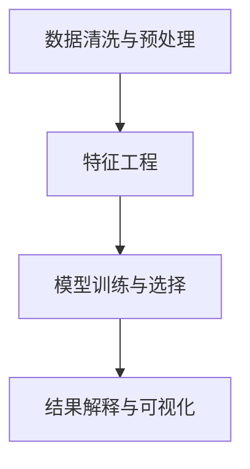

                 

# 理解的深度：从表象到本质的洞察过程

在信息技术飞速发展的今天，数据正以惊人的速度激增，但“数据本身并不产生价值，价值在于对数据的理解和分析”。如何从海量数据中提取洞见，实现从表象到本质的洞察，已成为数据科学家和人工智能专家们的核心任务之一。本文将深入探讨这一问题，并通过具体的算法原理、操作步骤和应用实例，阐述从数据到洞察的全过程。

## 1. 背景介绍

在过去的几十年里，信息技术和大数据技术的发展，极大地改变了我们的生活和工作方式。从社交媒体的广泛使用，到电子商务平台的兴起，再到金融科技的迅猛发展，无一不依赖于数据这一关键资源。数据量的不断增长，对数据分析和挖掘的需求也日益增加。

数据洞察是数据科学的核心。它不仅要求我们能够从数据中提取有用的信息，更要求我们能够洞察数据背后的本质和规律，发现潜在的关联和趋势，从而支持决策制定和问题解决。从简单的统计分析，到复杂的机器学习、深度学习算法，再到新兴的人工智能技术，都是实现数据洞察的重要手段。

然而，技术的进步并没有消除人们对数据洞察准确性和可行性的担忧。数据洞察的目标是发现事物的本质，但这一过程常常受到数据质量和数量的限制，以及算法本身的复杂性和局限性的影响。

本文将系统阐述如何从数据到洞察的全过程，通过核心概念与联系、核心算法原理、操作步骤、数学模型、项目实践等环节，探讨数据洞察的关键方法和技术。

## 2. 核心概念与联系

### 2.1 核心概念概述

在实现数据洞察的过程中，有几个关键的概念：

- **数据清洗与预处理**：数据洞察的基础，包括数据去重、缺失值处理、异常值检测等步骤。
- **特征工程**：从原始数据中提取和构造有意义的特征，为模型训练提供输入。
- **模型训练与选择**：选择合适的模型架构和算法，使用标注数据对模型进行训练和验证。
- **结果解释与可视化**：将模型输出转化为易于理解的洞察结果，通过数据可视化技术呈现。

这些概念构成了数据洞察的基本流程，每个环节都对最终的结果产生重要影响。

### 2.2 核心概念联系

以下是一个简化的数据洞察过程的Mermaid流程图，展示了核心概念之间的联系：



从数据到洞察的全过程，是一个连续的、循环的迭代过程。清洗和预处理保证了数据的准确性和一致性；特征工程将数据转化为模型能够理解和利用的形式；模型训练和选择决定了对数据的理解和分析能力；结果解释和可视化将洞察结果呈现给用户，辅助决策。

## 3. 核心算法原理 & 具体操作步骤

### 3.1 算法原理概述

数据洞察的核心是构建和训练能够自动从数据中提取有意义的特征的模型。这些模型通常包括传统统计学方法、机器学习和深度学习算法等。

以机器学习为例，常用的算法包括线性回归、决策树、随机森林、支持向量机、神经网络等。这些算法通过训练样本数据，学习输入特征和输出结果之间的关系，从而实现对数据的洞察。

### 3.2 算法步骤详解

具体步骤包括：

1. **数据收集与准备**：
   - 收集相关数据，并进行初步的清洗和预处理。
   - 对数据进行划分，分为训练集、验证集和测试集。

2. **特征工程**：
   - 选择或构造有意义的特征，进行特征编码。
   - 进行特征选择和降维，去除冗余或无关特征。

3. **模型训练与选择**：
   - 选择或设计适合的模型架构。
   - 使用训练集对模型进行训练，并在验证集上进行调参和验证。
   - 选择表现最好的模型，用于最终的预测和分析。

4. **结果解释与可视化**：
   - 对模型输出进行解释和解读，理解其背后的含义。
   - 使用图表和可视化工具呈现结果，直观展示数据洞察。

### 3.3 算法优缺点

机器学习算法的优点包括：
- 自动化程度高，可处理大规模数据。
- 适应性强，适用于各种数据类型和任务。
- 模型可解释性较好，便于理解和学习。

缺点包括：
- 需要大量标注数据进行训练，数据获取成本高。
- 模型复杂度高，训练和解释难度大。
- 过度拟合风险高，需要谨慎调参。

### 3.4 算法应用领域

机器学习算法在多个领域都有广泛应用：

- **金融**：风险评估、信用评分、市场预测等。
- **医疗**：疾病诊断、药物研发、健康管理等。
- **零售**：客户细分、推荐系统、库存管理等。
- **制造**：质量控制、设备维护、供应链优化等。
- **社交媒体**：情感分析、舆情监测、用户行为分析等。

## 4. 数学模型和公式 & 详细讲解

### 4.1 数学模型构建

在机器学习中，常见的数学模型包括线性回归、逻辑回归、支持向量机、决策树等。下面以线性回归为例，介绍其数学模型构建。

设 $y$ 为输出，$x$ 为输入特征向量，$\theta$ 为模型参数。线性回归的数学模型为：
$$ y = \theta^T x + \epsilon $$
其中 $\epsilon$ 为误差项。

### 4.2 公式推导过程

线性回归的目标是最小化均方误差（MSE），即：
$$ \min_{\theta} \frac{1}{2N} \sum_{i=1}^N (y_i - \theta^T x_i)^2 $$
通过梯度下降算法，求解最优参数 $\theta$。

### 4.3 案例分析与讲解

以一个简单的房价预测任务为例，使用线性回归模型进行训练。设输入特征为房屋面积 $x_1$、房间数 $x_2$，输出为房价 $y$。收集历史销售数据，分为训练集和测试集。

使用梯度下降算法，求解最优参数 $\theta$，得到房价预测模型。在测试集上评估模型性能，通过MSE和MAE等指标进行评估。

## 5. 项目实践：代码实例和详细解释说明

### 5.1 开发环境搭建

在进行机器学习项目实践前，我们需要准备好开发环境。以下是使用Python进行Scikit-learn开发的流程：

1. 安装Python：从官网下载并安装Python，并创建虚拟环境。
2. 安装Scikit-learn：
```bash
pip install scikit-learn
```

3. 安装其他常用库：
```bash
pip install pandas numpy matplotlib seaborn
```

### 5.2 源代码详细实现

下面以线性回归为例，给出一个完整的项目代码实现。

```python
import pandas as pd
from sklearn.model_selection import train_test_split
from sklearn.linear_model import LinearRegression
from sklearn.metrics import mean_squared_error
import matplotlib.pyplot as plt

# 加载数据
df = pd.read_csv('house_prices.csv')

# 数据预处理
X = df[['area', 'rooms']]
y = df['price']
X_train, X_test, y_train, y_test = train_test_split(X, y, test_size=0.3, random_state=42)

# 训练模型
model = LinearRegression()
model.fit(X_train, y_train)

# 预测和评估
y_pred = model.predict(X_test)
mse = mean_squared_error(y_test, y_pred)

# 结果可视化
plt.scatter(y_test, y_pred)
plt.xlabel('Actual Prices')
plt.ylabel('Predicted Prices')
plt.show()

print(f'Mean Squared Error: {mse}')
```

### 5.3 代码解读与分析

以上代码展示了从数据加载、预处理、模型训练、预测和评估的全流程：

- `pandas`：用于数据读取和处理。
- `train_test_split`：将数据集划分为训练集和测试集。
- `LinearRegression`：实现线性回归模型。
- `mean_squared_error`：计算均方误差。
- `matplotlib`：绘制散点图，可视化预测结果。

这些库和函数共同构成了机器学习项目的核心工具和算法。

## 6. 实际应用场景

### 6.1 金融风险评估

在金融领域，风险评估是核心任务之一。利用机器学习算法，可以对客户的信用评分、贷款风险进行预测，辅助银行和其他金融机构做出更科学的决策。

具体而言，可以收集客户的收入、负债、信用记录等数据，使用机器学习算法进行建模。通过训练集对模型进行训练，并使用测试集评估模型性能。

### 6.2 医疗诊断

在医疗领域，机器学习算法可以用于疾病诊断和预后预测。通过分析患者的病历数据、基因信息、影像数据等，构建疾病诊断模型，辅助医生做出更准确的诊断和治疗决策。

例如，可以使用支持向量机（SVM）构建疾病分类模型，对患者的影像数据进行特征提取，并利用机器学习算法进行训练。在测试集上评估模型性能，最终用于实际临床诊断。

### 6.3 智能推荐系统

在零售和电商领域，推荐系统是提高用户满意度和销售额的关键。通过机器学习算法，可以实现个性化的商品推荐，提高用户粘性和转化率。

具体而言，可以收集用户的行为数据（如浏览、购买、评分等），使用协同过滤、内容推荐等算法进行建模。通过训练集对模型进行训练，并使用测试集评估模型性能。最终，将模型部署到推荐系统，为每个用户提供个性化的推荐商品。

### 6.4 未来应用展望

随着机器学习技术的发展，未来的应用场景将更加广泛和多样化：

- **自动驾驶**：通过机器学习算法，实现车辆的智能感知、决策和控制。
- **工业制造**：使用机器学习算法进行设备故障预测、质量控制、生产优化等。
- **智能家居**：通过机器学习算法，实现家庭环境的智能调控，提高生活便捷性和舒适度。
- **社交媒体分析**：利用机器学习算法，进行舆情分析、用户行为预测、广告推荐等。

## 7. 工具和资源推荐

### 7.1 学习资源推荐

为了帮助开发者系统掌握机器学习技术的理论基础和实践技巧，这里推荐一些优质的学习资源：

1. 《机器学习实战》：介绍机器学习算法的基本原理和实际应用，适合初学者入门。
2. 《统计学习方法》：清华大学李航教授的经典教材，深入讲解统计学习的基本理论和方法。
3. 《深度学习》：Ian Goodfellow等人合著的经典教材，涵盖深度学习算法和实践的全面知识。
4. Coursera《机器学习》课程：由斯坦福大学Andrew Ng教授讲授，是机器学习领域的入门课程。
5. Kaggle：数据科学竞赛平台，提供丰富的数据集和算法实践案例。

通过对这些资源的学习实践，相信你一定能够快速掌握机器学习技术的精髓，并用于解决实际的业务问题。

### 7.2 开发工具推荐

高效的开发离不开优秀的工具支持。以下是几款用于机器学习开发的常用工具：

1. Jupyter Notebook：交互式编程环境，支持代码块执行、数据可视化、文档编写。
2. TensorBoard：TensorFlow配套的可视化工具，可实时监测模型训练状态，并提供丰富的图表呈现方式。
3. Weights & Biases：模型训练的实验跟踪工具，可以记录和可视化模型训练过程中的各项指标。
4. PyTorch：灵活的深度学习框架，支持动态计算图和GPU加速。
5. Scikit-learn：简单易用的机器学习库，涵盖各种经典算法和实用工具。

合理利用这些工具，可以显著提升机器学习项目的开发效率，加快创新迭代的步伐。

### 7.3 相关论文推荐

机器学习技术的发展源于学界的持续研究。以下是几篇奠基性的相关论文，推荐阅读：

1. 《机器学习》：Tom Mitchell教授的经典教材，系统讲解机器学习的原理和算法。
2. 《统计学习方法》：李航教授的机器学习著作，涵盖各种统计学习算法和理论。
3. 《深度学习》：Ian Goodfellow等人合著的经典教材，涵盖深度学习算法和实践的全面知识。
4. 《The Elements of Statistical Learning》：Hastie等人合著的经典教材，深入讲解统计学习的基本理论和算法。
5. 《Pattern Recognition and Machine Learning》：Christopher Bishop的著作，系统讲解模式识别和机器学习的理论和方法。

这些论文代表了大数据和机器学习领域的理论基础和前沿进展，通过学习这些经典著作，可以帮助研究者掌握机器学习技术的精髓。

## 8. 总结：未来发展趋势与挑战

### 8.1 总结

本文对机器学习技术从数据到洞察的全过程进行了系统阐述。通过介绍数据清洗与预处理、特征工程、模型训练与选择、结果解释与可视化等关键步骤，展示了如何构建高效的机器学习模型，实现从数据到洞察的转化。

机器学习技术的不断发展，为各行各业带来了巨大变革。从金融、医疗、零售，到自动驾驶、智能制造，机器学习技术在各个领域都有广泛应用。未来，随着算力、数据和算法技术的不断进步，机器学习技术将进一步推动产业升级和经济社会发展。

### 8.2 未来发展趋势

展望未来，机器学习技术的发展趋势将体现在以下几个方面：

1. **自动化和智能化**：自动化机器学习技术（AutoML）将进一步发展，自动化算法选择和调参，使得非专家也能快速构建高效模型。
2. **数据质量和多样性**：更多非结构化数据的纳入和利用，如文本、语音、图像等，将使得机器学习模型更具普适性。
3. **模型可解释性**：模型解释技术（如LIME、SHAP等）的发展，将使得机器学习模型的决策过程更加透明和可解释。
4. **跨领域融合**：机器学习技术与自然语言处理、计算机视觉等技术的深度融合，将拓展机器学习的应用边界。
5. **人工智能伦理和安全**：人工智能伦理和安全问题将受到更多关注，如何在模型训练和使用过程中保障用户隐私和数据安全，将是一个重要研究方向。

### 8.3 面临的挑战

尽管机器学习技术取得了诸多进展，但在迈向更加智能化和普适化的过程中，仍面临诸多挑战：

1. **数据质量和标注成本**：高质量数据的获取成本高，标注数据的获取成本更高。数据的不平衡和偏差可能影响模型性能。
2. **模型可解释性和透明性**：复杂模型如深度神经网络，其决策过程难以解释，可能影响用户信任和使用意愿。
3. **计算资源和效率**：大规模数据和复杂模型的训练和推理，需要大量的计算资源和高效算法支持。
4. **模型鲁棒性和泛化能力**：模型在面对未知数据和新场景时，可能表现出不稳定的鲁棒性和泛化能力。
5. **人工智能伦理和安全**：在机器学习应用中，如何保障用户隐私和数据安全，避免模型偏见和歧视，将是重要的伦理和安全问题。

### 8.4 研究展望

未来，需要在以下几个方向上进行深入研究：

1. **自动化和智能化**：自动化机器学习技术的发展，将使得机器学习技术更易于普及和应用。
2. **数据质量和多样性**：如何利用和处理更多非结构化数据，提高数据质量和多样性，将拓展机器学习的应用场景。
3. **模型可解释性和透明性**：如何设计可解释性更强的模型，使得模型决策过程更加透明，将增强用户信任。
4. **跨领域融合**：如何实现不同领域的机器学习模型和技术融合，将拓展机器学习的应用边界。
5. **人工智能伦理和安全**：如何在机器学习应用中保障用户隐私和数据安全，避免模型偏见和歧视，将是重要的研究方向。

总之，机器学习技术将继续在各个领域发挥重要作用，推动科技进步和社会发展。未来，机器学习技术的发展将更加依赖于多学科的交叉融合和持续创新。

## 9. 附录：常见问题与解答

**Q1：机器学习算法的优点和缺点有哪些？**

A: 机器学习算法的优点包括：
- 自动化程度高，可处理大规模数据。
- 适应性强，适用于各种数据类型和任务。
- 模型可解释性较好，便于理解和学习。

缺点包括：
- 需要大量标注数据进行训练，数据获取成本高。
- 模型复杂度高，训练和解释难度大。
- 过度拟合风险高，需要谨慎调参。

**Q2：机器学习算法的应用场景有哪些？**

A: 机器学习算法在多个领域都有广泛应用：
- 金融：风险评估、信用评分、市场预测等。
- 医疗：疾病诊断、药物研发、健康管理等。
- 零售：客户细分、推荐系统、库存管理等。
- 制造：质量控制、设备维护、供应链优化等。
- 社交媒体：情感分析、舆情监测、用户行为分析等。

**Q3：如何进行数据清洗和预处理？**

A: 数据清洗和预处理是数据洞察的基础，主要包括以下步骤：
1. 数据去重：去除重复数据。
2. 缺失值处理：处理缺失值，如填充、删除或插值等。
3. 异常值检测：检测和处理异常值，如离群点检测和修正。
4. 特征编码：将文本数据转换为数值型特征，如独热编码、TF-IDF等。
5. 数据归一化：将数据缩放到统一范围，如标准化、归一化等。

这些步骤可以提升数据的质量和一致性，为后续模型训练提供更好的输入。

**Q4：如何选择和设计机器学习模型？**

A: 选择和设计机器学习模型的关键在于理解数据的特性和任务的性质。以下是一些常用步骤：
1. 数据探索：了解数据的分布、特征、样本情况等。
2. 问题建模：明确任务目标和预测变量。
3. 模型选择：根据任务类型选择合适的模型，如回归、分类、聚类等。
4. 特征工程：提取和构造有意义的特征，如特征选择、降维等。
5. 模型调参：通过交叉验证等方法，调整模型参数和超参数。
6. 模型评估：使用测试集评估模型性能，选择最优模型。

合理选择和设计机器学习模型，可以提高模型的准确性和泛化能力。

**Q5：如何解释和可视化机器学习模型的结果？**

A: 结果解释和可视化是数据洞察的重要环节，主要包括以下步骤：
1. 模型输出：使用模型进行预测或分类，得到输出结果。
2. 特征重要性：使用特征重要性分析，了解哪些特征对模型输出有较大影响。
3. 可视化：使用图表和可视化工具，将模型结果和特征重要性呈现出来。

通过结果解释和可视化，可以更好地理解模型的工作机制和决策过程，为后续优化和改进提供依据。

---

作者：禅与计算机程序设计艺术 / Zen and the Art of Computer Programming

