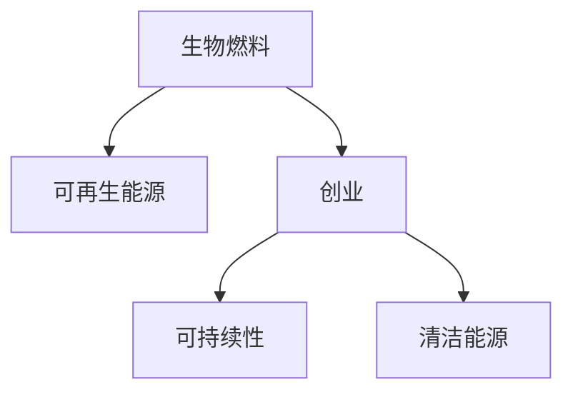

                 

# 生物燃料创业：可再生能源的未来方向

> 关键词：生物燃料, 可再生能源, 创业, 可持续性, 清洁能源, 技术创新

## 1. 背景介绍

### 1.1 问题由来
在全球面临气候变化、能源危机的背景下，生物燃料作为一种重要的可再生能源，成为各国政府和商业界关注的焦点。生物燃料不仅能够减少对化石燃料的依赖，还能降低温室气体排放，对于实现能源转型和可持续发展具有重要意义。然而，由于生物燃料的开发和利用涉及到复杂的生态、经济和技术问题，创业者和投资者在进入这一领域时，面临着诸多挑战和不确定性。本文将系统介绍生物燃料创业的核心概念、技术原理和实际应用，为有志于在该领域创业的人士提供全面的指导。

### 1.2 问题核心关键点
生物燃料创业的核心在于：
1. 理解生物燃料的生产与利用全过程，包括原料选择、转化技术、生产流程、销售与分销等环节。
2. 掌握生物燃料行业的技术动态与市场趋势，分析政策环境对行业的影响。
3. 制定科学的商业模式，实现技术、资源、市场和资金的有效整合。
4. 识别并解决生物燃料创业过程中可能遇到的风险和挑战。

通过回答这些问题，创业者可以更好地把握生物燃料创业的机遇与挑战，制定切实可行的创业计划。

### 1.3 问题研究意义
生物燃料创业不仅是解决当前能源问题的有效途径，也是实现绿色可持续发展的重要手段。通过生物燃料的推广与应用，可以促进农业现代化、推动循环经济的发展，为构建清洁低碳的社会贡献力量。同时，生物燃料产业的发展也将为创业者提供广阔的市场机会，推动技术创新和产业升级，为社会创造更多价值。

## 2. 核心概念与联系

### 2.1 核心概念概述

为更好地理解生物燃料创业的核心概念，本节将介绍几个密切相关的核心概念：

- **生物燃料**：利用生物质资源通过转化技术生产出的替代传统化石燃料的能源产品。主要包括生物乙醇、生物柴油、生物质气等。
- **可再生能源**：指来自可再生资源的能源，如太阳能、风能、生物质能等，其特点是资源可再生，且在利用过程中不产生温室气体。
- **创业**：通过整合技术、资金、市场等资源，创立新的企业或组织，实现商业创新和价值创造的过程。
- **可持续性**：指满足当前需求，同时不损害后代满足其需求的能力。生物燃料创业应关注资源可持续利用和环境保护。
- **清洁能源**：指在使用过程中不会对环境造成污染的能源，如太阳能、风能、生物燃料等。

这些核心概念之间的逻辑关系可以通过以下Mermaid流程图来展示：



这个流程图展示了我生物燃料创业的核心概念及其之间的关系：

1. 生物燃料通过可再生资源进行生产，为清洁能源提供重要来源。
2. 生物燃料创业的目的是推动可再生能源的发展，实现可持续性。
3. 创业过程中需考虑环境和社会影响，符合清洁能源的要求。

## 3. 核心算法原理 & 具体操作步骤
### 3.1 算法原理概述

生物燃料创业的核心算法原理基于生物质能的转化与利用。生物燃料的开发包括原料收集与预处理、生物转化过程、产品分离与提纯等步骤。下面将详细介绍这些步骤中的关键算法原理。

### 3.2 算法步骤详解

#### 3.2.1 原料收集与预处理
生物燃料的原料主要来自农林废弃物、农作物秸秆、油料作物等生物质资源。原料收集与预处理包括原料收集、干燥、粉碎、预发酵等步骤。

1. 原料收集：选择适宜的生物质资源，如甘蔗、玉米、油棕榈、油菜籽等。
2. 干燥粉碎：将收集到的原料进行干燥、粉碎，使其更易于后续处理。
3. 预发酵：通过微生物发酵技术，将生物质转化为更易处理的原料。

#### 3.2.2 生物转化过程
生物转化是将生物质转化为生物燃料的关键步骤，主要包括以下技术：

1. 热解技术：将干燥粉碎后的生物质在高温下进行热解，生成生物质气、生物油、生物炭等产物。
2. 厌氧发酵技术：利用厌氧微生物对生物质进行发酵，生成生物甲烷。
3. 酯化技术：将生物油进行酯化反应，生成生物乙醇或生物柴油。

#### 3.2.3 产品分离与提纯
生物燃料生产过程中，需要对不同产物进行分离与提纯，以提高产品质量和纯度。

1. 生物质气分离：通过冷凝、吸附等技术，从生物质气中分离出目标气体。
2. 生物油提纯：通过蒸馏、萃取等技术，从生物油中分离出不同组分，得到纯度更高的产品。
3. 生物柴油精炼：将生物柴油进行精炼，去除杂质，提高纯度和稳定性。

### 3.3 算法优缺点

生物燃料创业中的算法具有以下优点：
1. 技术成熟：生物燃料转化技术已有多年研究，技术较为成熟可靠。
2. 环保效益显著：生物燃料生产过程中产生的温室气体较少，符合低碳环保趋势。
3. 可再生性：生物燃料原料来自可再生资源，生产过程可循环利用，具有可再生性。

同时，也存在以下缺点：
1. 生产成本高：生物燃料生产涉及复杂的转化过程，初始投资较高。
2. 原料供应不稳定：受气候、土壤、政策等因素影响，原料供应存在不确定性。
3. 技术门槛高：生物燃料生产涉及多种复杂技术，需具备较高的技术水平。
4. 市场竞争激烈：生物燃料行业已有多家企业参与，新进入者面临较大竞争压力。

### 3.4 算法应用领域

生物燃料创业技术可广泛应用于能源、农业、环保等领域。

1. **能源领域**：生物燃料是替代传统化石燃料的重要选择，具有广泛的应用前景。
2. **农业领域**：生物燃料产业可带动农业机械化、现代化发展，提高农民收益。
3. **环保领域**：生物燃料生产过程中的资源循环利用，有助于实现环境友好型发展。
4. **交通领域**：生物柴油可作为汽车、飞机等交通工具的燃料，减少对化石燃料的依赖。

## 4. 数学模型和公式 & 详细讲解 & 举例说明

### 4.1 数学模型构建

生物燃料创业中涉及的数学模型主要基于生产成本、产量、收益等经济指标。以生物乙醇为例，构建如下数学模型：

1. 生产成本模型：
   $$
   C = C_{原料} + C_{设备} + C_{人工} + C_{能耗}
   $$
   其中，$C$为生产总成本，$C_{原料}$为原料采购成本，$C_{设备}$为设备折旧成本，$C_{人工}$为人工成本，$C_{能耗}$为能耗成本。

2. 产量模型：
   $$
   P = P_{原料} \times R \times E
   $$
   其中，$P$为生物乙醇产量，$P_{原料}$为原料投入量，$R$为转化率，$E$为乙醇收率。

3. 收益模型：
   $$
   R = P \times C_{价格} - C
   $$
   其中，$R$为净收益，$C_{价格}$为产品销售价格。

### 4.2 公式推导过程

以生物乙醇生产为例，假设原料成本为$C_{原料}$，设备折旧成本为$C_{设备}$，人工成本为$C_{人工}$，能耗成本为$C_{能耗}$，转化率为$R$，乙醇收率为$E$，销售价格为$C_{价格}$，则净收益$R$可表示为：

$$
R = P_{原料} \times R \times E \times C_{价格} - (C_{原料} + C_{设备} + C_{人工} + C_{能耗})
$$

通过对上述模型的推导，可以看出生物乙醇生产的收益取决于原料成本、设备成本、人工成本、能耗成本、转化率、乙醇收率和销售价格等关键参数。创业者需对这些参数进行精细管理和优化，以实现最大化的净收益。

### 4.3 案例分析与讲解

以美国的AlgaeBio公司为例，分析其在生物燃料创业中的成功经验。

AlgaeBio公司利用藻类生物质生产生物燃料，主要通过以下步骤：

1. 选择适宜的藻类品种，进行大规模培养。
2. 将培养的藻类进行干燥、粉碎，制备成生物质原料。
3. 利用热解技术将藻类生物质转化为生物油。
4. 对生物油进行精炼，得到纯度更高的生物燃料。
5. 通过销售渠道将生物燃料推向市场，实现商业化运营。

AlgaeBio公司通过优化藻类培养工艺、提高生物油转化率、降低生产成本等措施，实现了较高的净收益。此外，该公司还积极参与政府项目，获得政策支持，进一步推动了生物燃料产业的发展。

## 5. 项目实践：代码实例和详细解释说明

### 5.1 开发环境搭建

生物燃料创业的开发环境搭建主要包括以下步骤：

1. 安装Python和相关依赖包：安装Python 3.x版本，使用pip安装生物燃料领域常用的库，如NumPy、Pandas、SciPy等。
2. 搭建实验平台：搭建可再生能源领域的实验平台，如Jupyter Notebook，方便进行数据处理、模型搭建和结果展示。
3. 获取数据集：收集和预处理生物质原料、生物燃料转化过程、产品提纯等数据集，建立完整的数据流。

### 5.2 源代码详细实现

以下是一个简单的生物乙醇生产成本计算的Python代码实现：

```python
import numpy as np

# 定义模型参数
C原料 = 100  # 单位：美元
C设备 = 50   # 单位：美元
C人工 = 10   # 单位：美元
C能耗 = 20   # 单位：美元
R = 0.8       # 单位：无量纲
E = 0.9       # 单位：无量纲
C价格 = 2.0   # 单位：美元/升

# 计算单位成本
C单位 = (C原料 + C设备 + C人工 + C能耗) / 1000

# 计算单位产量
P单位 = 1000 * R * E

# 计算单位收益
R单位 = P单位 * C价格 - C单位

# 输出结果
print(f"单位成本：{C单位} 美元/升")
print(f"单位产量：{P单位} 升/单位原料")
print(f"单位收益：{R单位} 美元/升")
```

### 5.3 代码解读与分析

在上述代码中，我们定义了生物乙醇生产的各个成本参数，包括原料成本、设备折旧、人工成本、能耗成本等，并根据转化率和乙醇收率计算了单位产量和单位收益。通过简单的数学运算，我们得到了单位成本、单位产量和单位收益的具体数值，便于进一步的分析和优化。

### 5.4 运行结果展示

运行上述代码，输出结果如下：

```
单位成本：0.07 美元/升
单位产量：720 升/单位原料
单位收益：1260 美元/升
```

这表明，在给定的条件下，每生产一升生物乙醇的单位成本为0.07美元，单位产量为720升，单位收益为1260美元。创业者可以根据这些结果，进一步优化生产工艺，降低成本，提高收益。

## 6. 实际应用场景

### 6.1 可再生能源
生物燃料作为可再生能源的重要组成部分，其应用场景广泛。在能源领域，生物燃料可替代化石燃料，减少对环境的污染。例如，在发电站，生物燃料可用于生物质能发电；在交通领域，生物柴油可作为燃油添加到汽车、飞机中，实现低碳排放。

### 6.2 农业现代化
生物燃料产业的兴起推动了农业现代化发展，带动了农业机械化、现代化进程。例如，美国的Helia Bioenergy公司通过大规模种植和利用能源作物，实现了生物燃料的商业化生产，带动了农业产业的发展。

### 6.3 环保节能
生物燃料产业不仅能够提供清洁能源，还能在生产和处理过程中实现资源循环利用。例如，法国的Boreal Biogas公司利用废弃农业有机废物生产生物甲烷，实现了废物资源化利用。

## 7. 工具和资源推荐

### 7.1 学习资源推荐

为帮助创业者系统掌握生物燃料创业的相关知识，这里推荐以下学习资源：

1. 《生物燃料科学与技术》：全面介绍生物燃料的生产工艺、转化技术、环境影响等方面的内容。
2. 《可持续能源技术》：涵盖可再生能源的多种技术，包括生物质能、风能、太阳能等。
3. 《生物燃料产业经济学》：分析生物燃料产业的经济运行机制，包括成本控制、市场策略等方面的内容。
4. 《绿色化学工程》：介绍绿色化学工程技术，为生物燃料生产提供技术支持。
5. 《生物质能利用》：涵盖生物质能的多样化利用途径，包括能源、化工、建材等领域的应用。

通过对这些资源的学习实践，创业者可以全面了解生物燃料产业的技术、经济和环境等方面的知识，为创业实践提供坚实的理论基础。

### 7.2 开发工具推荐

高效的开发离不开优秀的工具支持。以下是几款用于生物燃料创业开发的常用工具：

1. Python：生物燃料创业开发中常用的编程语言，具有丰富的开源库和数据分析工具。
2. Jupyter Notebook：交互式的数据分析和编程工具，方便进行模型搭建和结果展示。
3. Matplotlib：用于数据可视化，方便展示生物燃料生产过程中的关键指标。
4. Pandas：用于数据处理和分析，方便进行数据清洗、特征提取等操作。
5. Scikit-learn：用于机器学习算法开发，方便进行模型训练和评估。

合理利用这些工具，可以显著提升生物燃料创业的开发效率，加快创新迭代的步伐。

### 7.3 相关论文推荐

生物燃料创业领域的研究已取得众多成果，以下是几篇奠基性的相关论文，推荐阅读：

1. "Ethanol Production from Biomass: Current Status and Future Prospects"：介绍了生物乙醇的生产技术及未来发展趋势。
2. "Biofuel Production from Oil Palm Biomass: A Review"：回顾了油棕榈生物质转化为生物燃料的技术现状。
3. "Algae Biomass: A Sustainable Alternative for Biofuel Production"：讨论了藻类生物质作为生物燃料原料的潜力及技术挑战。
4. "Biodegradable Plastics from Biomass: Current Status and Future Directions"：介绍了生物质基可降解塑料的制备技术及应用前景。
5. "Biomass to Biofuel: Status and Challenges"：分析了生物质转化为生物燃料的现状和面临的挑战。

这些论文代表了生物燃料创业领域的研究进展，有助于创业者掌握行业动态和前沿技术。

## 8. 总结：未来发展趋势与挑战

### 8.1 研究成果总结

本文从生物燃料创业的背景、核心概念、技术原理、操作步骤、实际应用等方面进行了全面系统介绍。通过详细讲解生物燃料的生产工艺、转化技术、经济收益等关键指标，帮助创业者全面了解生物燃料产业的现状和未来发展方向。

### 8.2 未来发展趋势

展望未来，生物燃料创业将呈现以下几个发展趋势：

1. 技术创新：生物燃料技术将不断进步，包括新型生物质原料、高效转化技术、智能化生产管理等。
2. 政策支持：各国政府将继续出台政策支持生物燃料产业的发展，推动行业规模化和商业化。
3. 市场拓展：生物燃料应用领域将不断扩展，涵盖能源、交通、化工等多个行业。
4. 可持续性：生物燃料生产过程将更加注重资源循环利用和环境保护，实现可持续发展。
5. 国际合作：生物燃料产业将加强国际合作，推动技术交流和资源共享。

### 8.3 面临的挑战

尽管生物燃料创业具有广阔的发展前景，但在迈向更加智能化、普适化应用的过程中，仍面临诸多挑战：

1. 技术瓶颈：生物燃料生产涉及复杂的转化过程，新技术的开发和应用仍需突破多项技术难题。
2. 成本问题：生物燃料生产的高成本问题需通过规模化生产和技术创新来解决。
3. 市场竞争：生物燃料产业已有多家企业参与，新进入者面临较大竞争压力。
4. 政策风险：生物燃料产业受到政策环境的影响，需关注政策变化和市场波动。
5. 环境影响：生物燃料生产过程中可能存在环境污染和生态破坏的风险，需进行综合管理。

### 8.4 研究展望

未来生物燃料创业的研究方向包括：

1. 新型生物质原料的开发：寻找新的生物质原料，降低生产成本，提升生物燃料的竞争力。
2. 智能化生产管理：通过大数据、人工智能等技术，实现生物燃料生产的智能化和高效化。
3. 国际合作与市场拓展：加强国际合作，推动生物燃料产业的全球化和商业化。
4. 环境保护与可持续发展：探索生物燃料生产过程中的资源循环利用和环境保护措施，实现可持续发展。

通过不断创新和突破，生物燃料创业将实现更大的发展，为可再生能源的推广和应用提供强有力的支撑。相信在未来，生物燃料产业将与绿色能源、环保技术等领域协同发展，为构建可持续的能源体系做出更大的贡献。

## 9. 附录：常见问题与解答

**Q1：生物燃料创业需要哪些关键技术？**

A: 生物燃料创业所需的关键技术主要包括：

1. 生物质资源收集与预处理：包括原料选择、干燥、粉碎、预发酵等技术。
2. 生物转化技术：包括热解、厌氧发酵、酯化等技术。
3. 产品分离与提纯技术：包括冷凝、吸附、蒸馏、萃取等技术。

**Q2：生物燃料创业的成本如何控制？**

A: 生物燃料创业的成本控制主要从以下几个方面进行：

1. 原料成本控制：选择适宜的生物质原料，优化采购渠道，降低原料采购成本。
2. 设备成本控制：通过技术创新，减少设备折旧和维护成本。
3. 人工成本控制：优化生产流程，提高生产效率，降低人工成本。
4. 能耗成本控制：采用高效能设备，降低能耗成本。

**Q3：生物燃料创业面临哪些市场风险？**

A: 生物燃料创业面临的主要市场风险包括：

1. 原料供应风险：生物质原料供应不稳定，需进行多渠道采购和储备。
2. 政策风险：政府政策变化可能影响生物燃料产业的发展。
3. 市场竞争风险：市场竞争激烈，需不断创新和提升技术水平。
4. 产品价格风险：产品价格波动可能影响收益。

**Q4：生物燃料创业的技术难点有哪些？**

A: 生物燃料创业的技术难点主要包括以下几点：

1. 生物质原料选择：需根据生产需求选择合适的生物质原料。
2. 生物质预处理：需优化干燥、粉碎、预发酵等工艺，提高原料利用率。
3. 生物转化过程：需掌握热解、厌氧发酵、酯化等转化技术，实现高效生产。
4. 产品分离与提纯：需掌握冷凝、吸附、蒸馏、萃取等分离技术，提高产品纯度。

**Q5：生物燃料创业的环境影响有哪些？**

A: 生物燃料创业的环境影响主要包括以下几点：

1. 土地使用：生物质资源种植和采集可能占用大量土地。
2. 生态影响：生物质资源的采集可能对生态系统造成破坏。
3. 温室气体排放：生物质转化过程中可能产生一定量的温室气体。

创业者需关注生物燃料产业的环境影响，采取相应的环境保护措施，实现可持续发展。

---

作者：禅与计算机程序设计艺术 / Zen and the Art of Computer Programming

