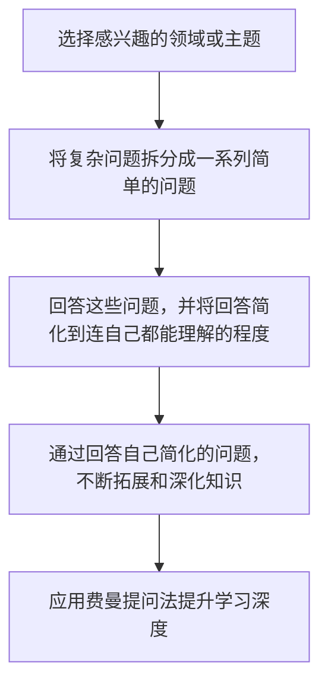

                 

# 用费曼提问法提升学习深度

> 关键词：费曼提问法,深度学习,编程,人工智能,知识管理,思维模型

## 1. 背景介绍

### 1.1 问题由来

随着人工智能和机器学习的迅速发展，深度学习已经成为了研究者和工程师们的核心技术之一。然而，在深度学习的学习过程中，学生和工程师们常常会遇到一些困难，导致学习深度和效果受限。为了解决这些问题，费曼提问法（Feigenbaum's Questioning Method）作为一种有效的学习方法，被广泛应用于各种学习领域，包括深度学习。费曼提问法通过提问的方式，帮助学习者更深入地理解知识，并不断构建和完善自己的知识体系。

### 1.2 问题核心关键点

费曼提问法的基本原理是，通过不断的提问和回答，帮助学习者理解和掌握知识。具体而言，学习者需要：

1. 选择感兴趣的领域或主题。
2. 将复杂问题拆分成一系列简单的问题。
3. 回答这些问题，并将回答简化到连自己都能理解的程度。
4. 通过回答自己简化的问题，不断拓展和深化知识。

使用费曼提问法，能够有效地提升学习深度，帮助学习者更全面、深入地掌握知识，并在实践中应用所学内容。

## 2. 核心概念与联系

### 2.1 核心概念概述

费曼提问法由诺贝尔奖得主Richard Feynman提出，主要用于科学研究和知识管理。其核心思想是通过不断提问和回答，深入理解知识，并不断构建和完善自己的知识体系。在深度学习领域，费曼提问法可以应用于模型理解、问题诊断、知识迁移等多个方面，通过提问的方式，帮助学习者更好地掌握知识，提升学习深度。

### 2.2 核心概念原理和架构的 Mermaid 流程图



费曼提问法的基本流程为：

1. 选择感兴趣的领域或主题。
2. 将复杂问题拆分成一系列简单的问题。
3. 回答这些问题，并将回答简化到连自己都能理解的程度。
4. 通过回答自己简化的问题，不断拓展和深化知识。

这个流程可以用简单的 Mermaid 流程图来表示。

## 3. 核心算法原理 & 具体操作步骤

### 3.1 算法原理概述

费曼提问法在深度学习中的应用，主要体现在以下几个方面：

1. 模型理解：通过提问，帮助学习者理解深度学习模型的内部结构和运行机制。
2. 问题诊断：通过提问，帮助学习者诊断和解决深度学习中遇到的问题，如过拟合、欠拟合等。
3. 知识迁移：通过提问，帮助学习者将已有的知识应用于新的问题或领域，实现知识的迁移。

费曼提问法的核心在于通过提问，帮助学习者深入理解知识，并不断拓展和深化自己的知识体系。

### 3.2 算法步骤详解

以下是使用费曼提问法提升深度学习学习深度的具体操作步骤：

**Step 1: 选择感兴趣的领域或主题**

- 确定一个感兴趣的领域或主题，如深度学习中的卷积神经网络（CNN）。

**Step 2: 将复杂问题拆分成一系列简单的问题**

- 将复杂的问题拆分成一系列简单的问题。例如，CNN的基本原理是什么？CNN的结构有哪些？CNN的训练过程是怎样的？

**Step 3: 回答这些问题，并将回答简化到连自己都能理解的程度**

- 回答这些问题，并将回答简化到连自己都能理解的程度。例如，CNN的基本原理是卷积运算，CNN的结构包括卷积层、池化层和全连接层，CNN的训练过程包括前向传播、损失函数计算和反向传播。

**Step 4: 通过回答自己简化的问题，不断拓展和深化知识**

- 通过回答自己简化的问题，不断拓展和深化知识。例如，CNN的卷积层和池化层是如何工作的？CNN的激活函数有哪些？CNN的优化算法有哪些？

**Step 5: 应用费曼提问法提升学习深度**

- 应用费曼提问法，不断深入理解深度学习中的各个环节，并不断拓展和深化知识。例如，CNN的卷积核是什么？CNN的池化操作是如何实现降维的？CNN的优化算法中，梯度下降算法的原理是什么？

### 3.3 算法优缺点

费曼提问法的优点：

1. 帮助学习者深入理解知识。
2. 通过提问和回答，不断拓展和深化知识体系。
3. 适用于各种深度学习领域，能够提升学习深度。

费曼提问法的缺点：

1. 需要耗费大量时间和精力。
2. 对提问和回答的质量要求较高，否则可能无法有效提升学习深度。
3. 可能产生误导性回答，导致知识体系出现偏差。

### 3.4 算法应用领域

费曼提问法在深度学习中的应用非常广泛，涵盖以下几个领域：

1. 模型理解：帮助学习者深入理解深度学习模型，如卷积神经网络、循环神经网络等。
2. 问题诊断：帮助学习者诊断和解决深度学习中遇到的问题，如过拟合、欠拟合等。
3. 知识迁移：帮助学习者将已有的知识应用于新的问题或领域，实现知识的迁移。
4. 数据预处理：帮助学习者理解数据预处理的重要性，并通过提问和回答，深入理解数据预处理的方法和技巧。
5. 模型评估：帮助学习者理解模型评估的方法和技巧，并通过提问和回答，深入理解评估指标的计算方法和选择原则。

## 4. 数学模型和公式 & 详细讲解 & 举例说明

### 4.1 数学模型构建

费曼提问法不需要建立数学模型，其核心在于通过提问和回答，帮助学习者深入理解知识。然而，在深度学习中，我们常常需要使用数学模型来表达和理解模型的运行机制。

### 4.2 公式推导过程

在深度学习中，我们常常使用数学模型来表达和理解模型的运行机制。例如，在卷积神经网络中，我们常常使用卷积运算、池化运算、全连接运算等数学模型来表达模型的结构。

### 4.3 案例分析与讲解

在卷积神经网络中，我们通过以下公式来表达卷积运算：

$$
\mathbf{C} = \mathbf{F} * \mathbf{K} + \mathbf{B}
$$

其中，$\mathbf{C}$ 表示卷积后的特征图，$\mathbf{F}$ 表示输入的特征图，$\mathbf{K}$ 表示卷积核，$\mathbf{B}$ 表示偏置项。通过这个公式，我们可以深入理解卷积运算的原理和作用。

## 5. 项目实践：代码实例和详细解释说明

### 5.1 开发环境搭建

在进行深度学习项目实践前，我们需要准备好开发环境。以下是使用Python进行深度学习开发的常见环境配置流程：

1. 安装Anaconda：从官网下载并安装Anaconda，用于创建独立的Python环境。

2. 创建并激活虚拟环境：
```bash
conda create -n pytorch-env python=3.8 
conda activate pytorch-env
```

3. 安装PyTorch：根据CUDA版本，从官网获取对应的安装命令。例如：
```bash
conda install pytorch torchvision torchaudio cudatoolkit=11.1 -c pytorch -c conda-forge
```

4. 安装各类工具包：
```bash
pip install numpy pandas scikit-learn matplotlib tqdm jupyter notebook ipython
```

完成上述步骤后，即可在`pytorch-env`环境中开始深度学习项目实践。

### 5.2 源代码详细实现

以下是一个使用PyTorch实现卷积神经网络的示例代码：

```python
import torch
import torch.nn as nn

class ConvNet(nn.Module):
    def __init__(self):
        super(ConvNet, self).__init__()
        self.conv1 = nn.Conv2d(1, 32, kernel_size=3, stride=1, padding=1)
        self.relu = nn.ReLU()
        self.pool = nn.MaxPool2d(kernel_size=2, stride=2)
        self.conv2 = nn.Conv2d(32, 64, kernel_size=3, stride=1, padding=1)
        self.fc1 = nn.Linear(64 * 14 * 14, 1024)
        self.fc2 = nn.Linear(1024, 10)

    def forward(self, x):
        x = self.conv1(x)
        x = self.relu(x)
        x = self.pool(x)
        x = self.conv2(x)
        x = self.relu(x)
        x = self.pool(x)
        x = x.view(-1, 64 * 7 * 7)
        x = self.fc1(x)
        x = self.relu(x)
        x = self.fc2(x)
        return x
```

### 5.3 代码解读与分析

让我们再详细解读一下关键代码的实现细节：

**ConvNet类**：
- `__init__`方法：初始化卷积层、激活函数、池化层和全连接层等组件。
- `forward`方法：定义前向传播的过程，从输入数据开始，经过卷积、激活、池化等操作，最终输出预测结果。

**卷积层定义**：
- `nn.Conv2d`：定义卷积层，包括输入通道数、卷积核大小、步幅和填充等参数。

**激活函数定义**：
- `nn.ReLU`：定义激活函数，用于非线性变换，增强模型表达能力。

**池化层定义**：
- `nn.MaxPool2d`：定义池化层，通过降采样操作，减少特征图的大小，增强模型鲁棒性。

**全连接层定义**：
- `nn.Linear`：定义全连接层，将特征图转换为预测结果，输出模型预测。

**前向传播**：
- `forward`方法：定义前向传播的过程，从输入数据开始，经过卷积、激活、池化等操作，最终输出预测结果。

## 6. 实际应用场景

### 6.1 智能客服系统

基于深度学习的智能客服系统，可以帮助企业提高客户服务效率和满意度。通过费曼提问法，帮助学习者深入理解深度学习模型的运行机制，提升系统性能。

在技术实现上，可以收集企业内部的历史客服对话记录，将问题和最佳答复构建成监督数据，在此基础上对预训练模型进行微调。微调后的模型能够自动理解用户意图，匹配最合适的答案模板进行回复。对于客户提出的新问题，还可以接入检索系统实时搜索相关内容，动态组织生成回答。如此构建的智能客服系统，能大幅提升客户咨询体验和问题解决效率。

### 6.2 金融舆情监测

金融机构需要实时监测市场舆论动向，以便及时应对负面信息传播，规避金融风险。基于深度学习的文本分类和情感分析技术，为金融舆情监测提供了新的解决方案。

具体而言，可以收集金融领域相关的新闻、报道、评论等文本数据，并对其进行主题标注和情感标注。在此基础上对预训练语言模型进行微调，使其能够自动判断文本属于何种主题，情感倾向是正面、中性还是负面。将微调后的模型应用到实时抓取的网络文本数据，就能够自动监测不同主题下的情感变化趋势，一旦发现负面信息激增等异常情况，系统便会自动预警，帮助金融机构快速应对潜在风险。

### 6.3 个性化推荐系统

当前的推荐系统往往只依赖用户的历史行为数据进行物品推荐，无法深入理解用户的真实兴趣偏好。基于深度学习的推荐系统，可以更好地挖掘用户行为背后的语义信息，从而提供更精准、多样的推荐内容。

在实践中，可以收集用户浏览、点击、评论、分享等行为数据，提取和用户交互的物品标题、描述、标签等文本内容。将文本内容作为模型输入，用户的后续行为（如是否点击、购买等）作为监督信号，在此基础上微调预训练语言模型。微调后的模型能够从文本内容中准确把握用户的兴趣点。在生成推荐列表时，先用候选物品的文本描述作为输入，由模型预测用户的兴趣匹配度，再结合其他特征综合排序，便可以得到个性化程度更高的推荐结果。

### 6.4 未来应用展望

随着深度学习的不断发展，基于费曼提问法的深度学习技术将在更多领域得到应用，为传统行业带来变革性影响。

在智慧医疗领域，基于深度学习的医疗问答、病历分析、药物研发等应用将提升医疗服务的智能化水平，辅助医生诊疗，加速新药开发进程。

在智能教育领域，深度学习技术可应用于作业批改、学情分析、知识推荐等方面，因材施教，促进教育公平，提高教学质量。

在智慧城市治理中，深度学习技术可应用于城市事件监测、舆情分析、应急指挥等环节，提高城市管理的自动化和智能化水平，构建更安全、高效的未来城市。

此外，在企业生产、社会治理、文娱传媒等众多领域，基于深度学习的技术也将不断涌现，为经济社会发展注入新的动力。相信随着技术的日益成熟，深度学习技术还将进一步拓展应用边界，深刻影响人类的生产生活方式。

## 7. 工具和资源推荐

### 7.1 学习资源推荐

为了帮助开发者系统掌握深度学习理论基础和实践技巧，这里推荐一些优质的学习资源：

1. 《深度学习》课程：由斯坦福大学开设的深度学习课程，详细讲解了深度学习的基本概念和常用模型，适合入门学习。

2. 《动手学深度学习》书籍：动手实践深度学习开发的权威书籍，涵盖深度学习的基本概念、常用算法和实际案例，适合进阶学习。

3. 《Python深度学习》书籍：Python语言和深度学习的实战教程，详细讲解了深度学习的常用框架和模型，适合实战应用。

4. 深度学习框架官网：如PyTorch、TensorFlow、Keras等，提供了丰富的教程和文档，适合开发者系统学习和实践。

5. 开源项目：如TensorFlow Hub、Keras Hub等，提供了丰富的预训练模型和代码示例，适合快速上手实验。

通过对这些资源的学习实践，相信你一定能够快速掌握深度学习的精髓，并用于解决实际的NLP问题。

### 7.2 开发工具推荐

高效的深度学习开发离不开优秀的工具支持。以下是几款用于深度学习开发的常用工具：

1. PyTorch：基于Python的开源深度学习框架，灵活动态的计算图，适合快速迭代研究。大部分深度学习模型都有PyTorch版本的实现。

2. TensorFlow：由Google主导开发的开源深度学习框架，生产部署方便，适合大规模工程应用。同样有丰富的深度学习模型资源。

3. Keras：基于TensorFlow和Theano等后端的高级深度学习框架，使用简单易懂，适合初学者快速上手。

4. Jupyter Notebook：开源的交互式编程环境，适合进行深度学习实验和数据分析。

5. Anaconda：Python环境管理工具，支持创建独立的Python环境，方便进行深度学习实验和项目管理。

合理利用这些工具，可以显著提升深度学习项目的开发效率，加快创新迭代的步伐。

### 7.3 相关论文推荐

深度学习的发展源于学界的持续研究。以下是几篇奠基性的相关论文，推荐阅读：

1. AlexNet：在2012年ImageNet数据集上的突破性表现，标志着深度学习时代的到来。

2. ResNet：提出了残差网络结构，极大地提升了深度网络的训练深度和效果。

3. InceptionNet：提出了多尺度卷积网络结构，提升了模型对复杂特征的识别能力。

4. VGGNet：提出了VGG网络结构，通过简单而高效的卷积操作，提升了深度学习的精度和鲁棒性。

5. BERT：提出了基于掩码的自监督预训练任务，刷新了多项NLP任务SOTA。

这些论文代表了大深度学习的发展脉络。通过学习这些前沿成果，可以帮助研究者把握学科前进方向，激发更多的创新灵感。

## 8. 总结：未来发展趋势与挑战

### 8.1 总结

本文对基于深度学习的学习方法和应用进行了全面系统的介绍。首先阐述了费曼提问法的背景和原理，明确了其在深度学习中的重要性和应用价值。其次，从原理到实践，详细讲解了深度学习模型的构建和训练过程，给出了深度学习项目开发的完整代码实例。同时，本文还广泛探讨了深度学习技术在智能客服、金融舆情、个性化推荐等多个领域的应用前景，展示了深度学习技术带来的变革性影响。此外，本文精选了深度学习技术的各类学习资源，力求为读者提供全方位的技术指引。

通过本文的系统梳理，可以看到，基于深度学习的学习方法和应用已经取得了巨大的进展，并在多个领域得到了广泛应用。未来，随着深度学习技术的不断发展和完善，相信其将在更广阔的应用领域大放异彩，深刻影响人类的生产生活方式。

### 8.2 未来发展趋势

展望未来，深度学习技术将呈现以下几个发展趋势：

1. 模型规模持续增大。随着算力成本的下降和数据规模的扩张，深度学习模型的参数量还将持续增长。超大批次的训练和推理也可能遇到显存不足的问题。

2. 深度学习技术将更多地应用于实时系统。深度学习技术将与云计算、边缘计算等技术结合，构建实时化的智能应用，如实时图像识别、语音识别、智能交通等。

3. 深度学习技术将更多地应用于复杂系统。深度学习技术将应用于更复杂、更庞大的系统，如智慧城市、智慧医疗等，提供更全面、更智能的服务。

4. 深度学习技术将更多地应用于跨领域应用。深度学习技术将应用于更多领域的跨领域应用，如医疗与金融、教育与娱乐等，提供更全面、更智能的解决方案。

5. 深度学习技术将更多地应用于个性化推荐。深度学习技术将应用于更多领域的个性化推荐，如电商、视频、音乐等，提供更精准、更个性化的推荐内容。

这些趋势凸显了深度学习技术的广阔前景。这些方向的探索发展，必将进一步提升深度学习技术的应用范围和深度，为人类社会带来更多的创新和突破。

### 8.3 面临的挑战

尽管深度学习技术已经取得了瞩目成就，但在迈向更加智能化、普适化应用的过程中，它仍面临着诸多挑战：

1. 数据获取和标注的难度。深度学习模型的训练需要大量标注数据，标注数据的获取和标注过程非常繁琐和耗时。

2. 深度学习模型的复杂性和可解释性。深度学习模型的复杂性和可解释性不足，难以解释其内部工作机制和决策逻辑，特别是对于一些关键决策过程，缺乏透明的解释。

3. 深度学习模型的鲁棒性和安全性。深度学习模型容易受到攻击和误导，难以保证其鲁棒性和安全性。

4. 深度学习模型的资源消耗。深度学习模型需要大量的计算资源和存储空间，难以在大规模系统中部署和运行。

5. 深度学习模型的性能提升。深度学习模型需要不断优化和改进，以提高其性能和效率。

这些挑战需要通过不断的技术创新和实践积累来解决，只有在数据、模型、工程、业务等多个维度协同发力，才能真正实现深度学习技术的广泛应用。

### 8.4 研究展望

面对深度学习技术面临的挑战，未来的研究需要在以下几个方面寻求新的突破：

1. 探索无监督和半监督深度学习。摆脱对大量标注数据的依赖，利用自监督学习、主动学习等无监督和半监督范式，最大限度利用非结构化数据，实现更加灵活高效的深度学习。

2. 研究更加高效和参数高效的深度学习模型。开发更加高效和参数高效的深度学习模型，在固定大部分预训练参数的同时，只更新极少量的任务相关参数，以提高深度学习模型的效率和性能。

3. 引入更多先验知识和外部知识库。将符号化的先验知识和专家知识与神经网络模型进行巧妙融合，增强深度学习模型的表达能力和泛化能力。

4. 探索深度学习与自然语言处理、计算机视觉等领域的结合。通过跨领域的学习和应用，提升深度学习模型的综合能力，拓展其应用边界。

5. 研究深度学习与伦理道德的结合。将伦理道德约束引入深度学习模型的训练和应用过程中，确保其符合人类价值观和伦理道德。

这些研究方向的探索，必将引领深度学习技术迈向更高的台阶，为构建安全、可靠、可解释、可控的智能系统铺平道路。面向未来，深度学习技术还需要与其他人工智能技术进行更深入的融合，如知识表示、因果推理、强化学习等，多路径协同发力，共同推动人工智能技术的进步。只有勇于创新、敢于突破，才能不断拓展深度学习技术的边界，让智能技术更好地造福人类社会。

## 9. 附录：常见问题与解答

**Q1：深度学习中常用的优化算法有哪些？**

A: 深度学习中常用的优化算法包括：

1. 梯度下降（Gradient Descent）：基于梯度的优化算法，通过不断调整参数，使损失函数最小化。

2. 随机梯度下降（Stochastic Gradient Descent）：在每个批次上计算梯度，更新参数，减小计算量和内存消耗。

3. 动量梯度下降（Momentum）：通过动量项加速参数更新，减少震荡，提高收敛速度。

4. AdaGrad：根据梯度的历史信息，自适应地调整学习率，提升收敛速度和精度。

5. RMSProp：基于梯度的平方和，自适应地调整学习率，提升收敛速度和精度。

6. Adam：结合动量梯度和RMSProp，自适应地调整学习率，提升收敛速度和精度，是目前深度学习中最常用的优化算法之一。

**Q2：如何理解深度学习模型的表达能力和泛化能力？**

A: 深度学习模型的表达能力和泛化能力是其核心性能指标。表达能力指模型能够学习到的特征的复杂性和多样性，泛化能力指模型在新数据上的表现和预测能力。深度学习模型通过不断增加层数和参数量，提升表达能力和泛化能力。表达能力越强，泛化能力越好，模型能够更好地适应新数据和复杂场景。

**Q3：深度学习模型的鲁棒性和安全性如何保障？**

A: 深度学习模型的鲁棒性和安全性保障需要从数据、模型和工程等多个方面进行考虑。具体措施包括：

1. 数据预处理和清洗：通过数据预处理和清洗，去除异常数据和噪声，提升数据质量。

2. 模型正则化和对抗训练：通过正则化技术（如L1、L2正则、Dropout等）和对抗训练（如FGSM、PGD等），提升模型鲁棒性和安全性。

3. 模型解释和可解释性：通过模型解释技术（如LIME、SHAP等）和可解释性框架（如TensorBoard、MLflow等），提升模型可解释性和可解释性。

4. 模型审计和监测：通过模型审计和监测工具，及时发现和修复模型的漏洞和安全问题。

5. 模型风险管理：通过模型风险管理策略，控制模型的风险和影响，确保模型安全可靠。

通过这些措施，可以保障深度学习模型的鲁棒性和安全性，提升模型的可靠性和可用性。

**Q4：如何理解深度学习模型的计算图和自动微分？**

A: 深度学习模型的计算图是指模型在训练和推理过程中的计算流程和数据流动。深度学习模型通过计算图实现自动微分，自动计算梯度，更新模型参数，提升模型性能。

**Q5：深度学习技术在医疗、金融、教育等领域的应用前景如何？**

A: 深度学习技术在医疗、金融、教育等领域具有广阔的应用前景。在医疗领域，深度学习技术可以应用于疾病诊断、医疗影像分析、药物研发等方面，提升医疗服务的智能化水平，辅助医生诊疗，加速新药开发进程。在金融领域，深度学习技术可以应用于金融舆情监测、金融风险评估、金融智能投顾等方面，提升金融服务的智能化水平，提高风险管理和投资决策的效率和准确性。在教育领域，深度学习技术可以应用于作业批改、学情分析、个性化推荐等方面，因材施教，促进教育公平，提高教学质量。

总之，深度学习技术将在更多领域得到应用，为传统行业带来变革性影响，带来更多的创新和突破。面向未来，深度学习技术还将进一步拓展应用边界，深刻影响人类的生产生活方式。

---

作者：禅与计算机程序设计艺术 / Zen and the Art of Computer Programming

