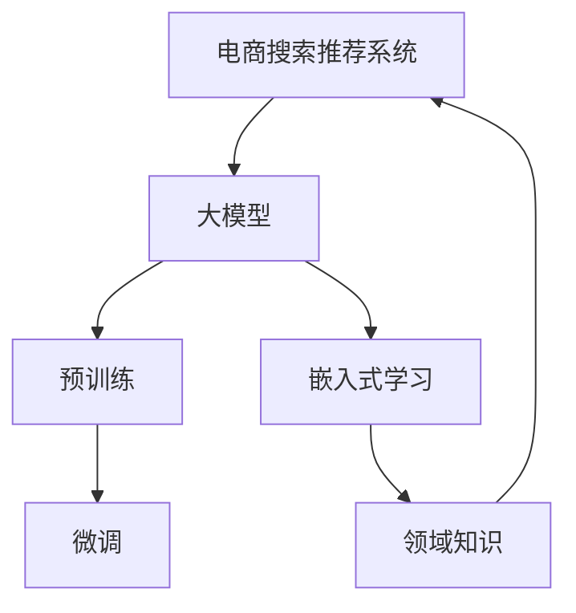

                 

# 电商业务如何利用AI大模型优化搜索推荐

> 关键词：电商搜索, 推荐系统, 大模型, 预训练, 微调, 嵌入式学习

## 1. 背景介绍

在电子商务领域，用户搜索行为和购买决策紧密相关。高效、精准的搜索推荐系统能够显著提升用户体验和电商平台的转化率。传统的搜索推荐系统主要依赖于用户历史行为数据和显式反馈，难以捕捉用户隐式意图和长尾需求。而利用AI大模型，通过预训练-微调的技术路线，能够从海量用户数据中挖掘隐式语义，实现更高效、准确的个性化推荐。

随着深度学习技术和大模型的不断进步，电商搜索推荐系统的技术架构和算法也经历了从基于规则、基于统计到基于深度学习的演进。现阶段，基于深度学习的大模型搜索推荐方法已经成为了电商领域的主流技术。例如，阿里巴巴、京东等大型电商企业都在其推荐系统中大量使用了预训练语言模型，以期提升推荐系统的精准度和泛化能力。

## 2. 核心概念与联系

### 2.1 核心概念概述

为更好地理解电商搜索推荐系统中大模型的应用，本节将介绍几个核心概念及其相互关系：

- **电商搜索推荐系统**：使用AI大模型和深度学习技术，实现用户查询理解、商品检索、个性化推荐等功能，以提升用户购物体验和电商平台的转化率。

- **大模型**：以自回归（如GPT）或自编码（如BERT）模型为代表的大规模预训练语言模型。通过在大规模无标签文本语料上进行预训练，学习通用的语言表示，具备强大的语言理解和生成能力。

- **预训练**：指在大规模无标签文本语料上，通过自监督学习任务训练通用语言模型的过程。常见的预训练任务包括言语建模、遮挡语言模型等。预训练使得模型学习到语言的通用表示。

- **微调**：指在预训练模型的基础上，使用下游任务的少量标注数据，通过有监督地训练来优化模型在该任务上的性能。通常只需要调整顶层分类器或解码器，并以较小的学习率更新全部或部分的模型参数。

- **嵌入式学习**：指在大模型中，直接嵌入业务逻辑和领域知识，提升模型的应用效果和泛化能力。嵌入式学习是大模型在电商领域得到广泛应用的重要手段。

这些核心概念之间的逻辑关系可以通过以下Mermaid流程图来展示：



这个流程图展示了电商搜索推荐系统的核心组件及其相互关系：

1. 电商搜索推荐系统通过大模型获得通用语言表示，用于理解用户查询和商品描述。
2. 大模型通过预训练学习到语言的基础表示，进而通过微调适配电商领域的特定需求。
3. 嵌入式学习在大模型中直接嵌入电商领域的业务逻辑和领域知识，提升模型的应用效果。

## 3. 核心算法原理 & 具体操作步骤
### 3.1 算法原理概述

电商搜索推荐系统中，大模型的应用主要体现在以下几个方面：

1. **用户查询理解**：将用户输入的查询作为自然语言处理任务，使用大模型理解查询的意图和关键信息。
2. **商品检索**：将商品描述作为自然语言处理任务，使用大模型提取商品的关键特征。
3. **个性化推荐**：根据用户历史行为和查询意图，使用大模型预测用户可能感兴趣的商品。

这些任务本质上都可以视为自然语言处理(NLP)的子任务。电商搜索推荐系统的大模型应用过程，就是通过预训练和微调，使得模型能够高效处理NLP任务，提升推荐系统的效果。

### 3.2 算法步骤详解

电商搜索推荐系统的大模型应用一般包括以下关键步骤：

**Step 1: 准备预训练模型和数据集**
- 选择合适的预训练语言模型 $M_{\theta}$ 作为初始化参数，如 BERT、GPT 等。
- 准备电商领域的标注数据集 $D$，包括用户查询、商品描述和用户反馈等，划分为训练集、验证集和测试集。

**Step 2: 添加任务适配层**
- 根据任务类型，在预训练模型顶层设计合适的输出层和损失函数。例如，对于检索任务，通常使用余弦相似度作为评分函数；对于推荐任务，通常使用点击率预测的交叉熵损失函数。
- 将用户查询和商品描述输入模型，计算相似度或预测评分。

**Step 3: 设置微调超参数**
- 选择合适的优化算法及其参数，如 AdamW、SGD 等，设置学习率、批大小、迭代轮数等。
- 设置正则化技术及强度，包括权重衰减、Dropout、Early Stopping 等。
- 确定冻结预训练参数的策略，如仅微调顶层，或全部参数都参与微调。

**Step 4: 执行梯度训练**
- 将训练集数据分批次输入模型，前向传播计算损失函数。
- 反向传播计算参数梯度，根据设定的优化算法和学习率更新模型参数。
- 周期性在验证集上评估模型性能，根据性能指标决定是否触发 Early Stopping。
- 重复上述步骤直到满足预设的迭代轮数或 Early Stopping 条件。

**Step 5: 测试和部署**
- 在测试集上评估微调后模型 $M_{\hat{\theta}}$ 的性能，对比微调前后的效果提升。
- 使用微调后的模型对新商品进行检索，集成到电商搜索推荐系统中。
- 持续收集新的用户反馈和商品信息，定期重新微调模型，以适应数据分布的变化。

### 3.3 算法优缺点

电商搜索推荐系统中使用大模型进行微调，具有以下优点：

1. 通用性强。大模型通过预训练学习到通用的语言表示，适用于多种NLP任务，包括用户查询理解、商品检索和个性化推荐等。
2. 泛化能力强。大模型在通用文本语料上预训练，具有较强的泛化能力，能够更好地适应电商领域的特殊需求。
3. 数据依赖少。预训练模型已经包含了大量的通用知识，通过微调，可以显著减少对标注数据的依赖。
4. 计算高效。大模型通常可以并行计算，在计算效率上具有明显优势。

同时，大模型应用于电商搜索推荐系统也存在一些局限：

1. 模型复杂度高。大模型参数量巨大，需要消耗较高的计算资源和存储空间。
2. 微调效果受标注数据质量影响。标注数据的质量和数量对微调效果有重要影响，标注质量差可能导致模型性能不佳。
3. 学习曲线长。大模型训练和学习曲线较长，微调过程需要较多的迭代次数才能收敛。
4. 模型解释性不足。大模型往往难以解释其内部决策过程，缺乏可解释性。

尽管存在这些局限，但大模型在电商搜索推荐系统中的应用，显著提升了推荐系统的精准度和用户体验。未来，随着大模型的不断演进和优化，这些局限将得到进一步缓解。

### 3.4 算法应用领域

大模型在电商搜索推荐系统中主要应用于以下几个方面：

- **用户查询理解**：将用户输入的查询作为自然语言处理任务，使用大模型提取查询的关键词、意图和情感等信息，辅助生成搜索结果和推荐内容。
- **商品检索**：将商品描述作为自然语言处理任务，使用大模型提取商品的关键特征，匹配用户查询。
- **个性化推荐**：根据用户历史行为和查询意图，使用大模型预测用户可能感兴趣的商品，生成个性化推荐列表。
- **异常检测**：使用大模型识别异常的用户行为或商品描述，及时发现潜在风险。

除了上述应用外，大模型在电商搜索推荐系统中还有更多创新性的应用，如广告定向、用户行为预测、库存管理等，为电商平台的运营带来了全新的解决方案。

## 4. 数学模型和公式 & 详细讲解
### 4.1 数学模型构建

本节将使用数学语言对电商搜索推荐系统中大模型的微调过程进行更加严格的刻画。

记电商领域的标注数据集为 $D=\{(x_i, y_i)\}_{i=1}^N, x_i \in \mathcal{X}, y_i \in \mathcal{Y}$，其中 $\mathcal{X}$ 为输入空间，$\mathcal{Y}$ 为输出空间。假设微调任务的训练集为 $D_{train}$，验证集为 $D_{valid}$，测试集为 $D_{test}$。

定义模型 $M_{\theta}$ 在输入 $x$ 上的输出为 $\hat{y}=M_{\theta}(x) \in \mathcal{Y}$。电商领域常见的微调任务包括用户查询理解、商品检索和个性化推荐。对于这些任务，常见的损失函数包括：

- 用户查询理解：交叉熵损失函数，用于衡量模型输出与真实标签之间的差异。
- 商品检索：余弦相似度损失函数，用于衡量模型预测的商品评分与实际评分之间的差异。
- 个性化推荐：交叉熵损失函数，用于衡量模型预测的用户点击率与实际点击率之间的差异。

微调的优化目标是最小化经验风险，即找到最优参数：

$$
\theta^* = \mathop{\arg\min}_{\theta} \mathcal{L}(\theta)
$$

其中 $\mathcal{L}$ 为针对特定任务设计的损失函数，用于衡量模型预测输出与真实标签之间的差异。常见的损失函数包括交叉熵损失、均方误差损失等。

### 4.2 公式推导过程

以用户查询理解任务为例，推导交叉熵损失函数及其梯度的计算公式。

假设模型 $M_{\theta}$ 在输入 $x$ 上的输出为 $\hat{y}=M_{\theta}(x) \in [0,1]$，表示模型预测用户查询的意图为正的概率。真实标签 $y \in \{0,1\}$。则二分类交叉熵损失函数定义为：

$$
\ell(M_{\theta}(x),y) = -[y\log \hat{y} + (1-y)\log (1-\hat{y})]
$$

将其代入经验风险公式，得：

$$
\mathcal{L}(\theta) = -\frac{1}{N}\sum_{i=1}^N [y_i\log M_{\theta}(x_i)+(1-y_i)\log(1-M_{\theta}(x_i))]
$$

根据链式法则，损失函数对参数 $\theta_k$ 的梯度为：

$$
\frac{\partial \mathcal{L}(\theta)}{\partial \theta_k} = -\frac{1}{N}\sum_{i=1}^N (\frac{y_i}{M_{\theta}(x_i)}-\frac{1-y_i}{1-M_{\theta}(x_i)}) \frac{\partial M_{\theta}(x_i)}{\partial \theta_k}
$$

其中 $\frac{\partial M_{\theta}(x_i)}{\partial \theta_k}$ 可进一步递归展开，利用自动微分技术完成计算。

在得到损失函数的梯度后，即可带入参数更新公式，完成模型的迭代优化。重复上述过程直至收敛，最终得到适应电商领域特定任务的最优模型参数 $\theta^*$。

## 5. 项目实践：代码实例和详细解释说明
### 5.1 开发环境搭建

在进行微调实践前，我们需要准备好开发环境。以下是使用Python进行PyTorch开发的环境配置流程：

1. 安装Anaconda：从官网下载并安装Anaconda，用于创建独立的Python环境。

2. 创建并激活虚拟环境：
```bash
conda create -n pytorch-env python=3.8 
conda activate pytorch-env
```

3. 安装PyTorch：根据CUDA版本，从官网获取对应的安装命令。例如：
```bash
conda install pytorch torchvision torchaudio cudatoolkit=11.1 -c pytorch -c conda-forge
```

4. 安装Transformers库：
```bash
pip install transformers
```

5. 安装各类工具包：
```bash
pip install numpy pandas scikit-learn matplotlib tqdm jupyter notebook ipython
```

完成上述步骤后，即可在`pytorch-env`环境中开始微调实践。

### 5.2 源代码详细实现

下面我们以用户查询理解任务为例，给出使用Transformers库对BERT模型进行微调的PyTorch代码实现。

首先，定义用户查询理解任务的数据处理函数：

```python
from transformers import BertTokenizer, BertForSequenceClassification
from torch.utils.data import Dataset
import torch

class UserQueryDataset(Dataset):
    def __init__(self, texts, labels, tokenizer, max_len=128):
        self.texts = texts
        self.labels = labels
        self.tokenizer = tokenizer
        self.max_len = max_len
        
    def __len__(self):
        return len(self.texts)
    
    def __getitem__(self, item):
        text = self.texts[item]
        label = self.labels[item]
        
        encoding = self.tokenizer(text, return_tensors='pt', max_length=self.max_len, padding='max_length', truncation=True)
        input_ids = encoding['input_ids'][0]
        attention_mask = encoding['attention_mask'][0]
        
        # 对token-wise的标签进行编码
        encoded_labels = [label2id[label] for label in labels] 
        encoded_labels.extend([label2id['O']] * (self.max_len - len(encoded_labels)))
        labels = torch.tensor(encoded_labels, dtype=torch.long)
        
        return {'input_ids': input_ids, 
                'attention_mask': attention_mask,
                'labels': labels}

# 标签与id的映射
label2id = {'O': 0, '查询意图1': 1, '查询意图2': 2, '查询意图3': 3}
id2label = {v: k for k, v in label2id.items()}

# 创建dataset
tokenizer = BertTokenizer.from_pretrained('bert-base-cased')

train_dataset = UserQueryDataset(train_texts, train_labels, tokenizer)
dev_dataset = UserQueryDataset(dev_texts, dev_labels, tokenizer)
test_dataset = UserQueryDataset(test_texts, test_labels, tokenizer)
```

然后，定义模型和优化器：

```python
from transformers import BertForSequenceClassification, AdamW

model = BertForSequenceClassification.from_pretrained('bert-base-cased', num_labels=len(label2id))

optimizer = AdamW(model.parameters(), lr=2e-5)
```

接着，定义训练和评估函数：

```python
from torch.utils.data import DataLoader
from tqdm import tqdm
from sklearn.metrics import classification_report

device = torch.device('cuda') if torch.cuda.is_available() else torch.device('cpu')
model.to(device)

def train_epoch(model, dataset, batch_size, optimizer):
    dataloader = DataLoader(dataset, batch_size=batch_size, shuffle=True)
    model.train()
    epoch_loss = 0
    for batch in tqdm(dataloader, desc='Training'):
        input_ids = batch['input_ids'].to(device)
        attention_mask = batch['attention_mask'].to(device)
        labels = batch['labels'].to(device)
        model.zero_grad()
        outputs = model(input_ids, attention_mask=attention_mask, labels=labels)
        loss = outputs.loss
        epoch_loss += loss.item()
        loss.backward()
        optimizer.step()
    return epoch_loss / len(dataloader)

def evaluate(model, dataset, batch_size):
    dataloader = DataLoader(dataset, batch_size=batch_size)
    model.eval()
    preds, labels = [], []
    with torch.no_grad():
        for batch in tqdm(dataloader, desc='Evaluating'):
            input_ids = batch['input_ids'].to(device)
            attention_mask = batch['attention_mask'].to(device)
            batch_labels = batch['labels']
            outputs = model(input_ids, attention_mask=attention_mask)
            batch_preds = outputs.logits.argmax(dim=2).to('cpu').tolist()
            batch_labels = batch_labels.to('cpu').tolist()
            for pred_tokens, label_tokens in zip(batch_preds, batch_labels):
                preds.append(pred_tokens[:len(label_tokens)])
                labels.append(label_tokens)
                
    print(classification_report(labels, preds))
```

最后，启动训练流程并在测试集上评估：

```python
epochs = 5
batch_size = 16

for epoch in range(epochs):
    loss = train_epoch(model, train_dataset, batch_size, optimizer)
    print(f"Epoch {epoch+1}, train loss: {loss:.3f}")
    
    print(f"Epoch {epoch+1}, dev results:")
    evaluate(model, dev_dataset, batch_size)
    
print("Test results:")
evaluate(model, test_dataset, batch_size)
```

以上就是使用PyTorch对BERT进行用户查询理解任务微调的完整代码实现。可以看到，得益于Transformers库的强大封装，我们可以用相对简洁的代码完成BERT模型的加载和微调。

### 5.3 代码解读与分析

让我们再详细解读一下关键代码的实现细节：

**UserQueryDataset类**：
- `__init__`方法：初始化文本、标签、分词器等关键组件。
- `__len__`方法：返回数据集的样本数量。
- `__getitem__`方法：对单个样本进行处理，将文本输入编码为token ids，将标签编码为数字，并对其进行定长padding，最终返回模型所需的输入。

**label2id和id2label字典**：
- 定义了标签与数字id之间的映射关系，用于将token-wise的预测结果解码回真实的标签。

**训练和评估函数**：
- 使用PyTorch的DataLoader对数据集进行批次化加载，供模型训练和推理使用。
- 训练函数`train_epoch`：对数据以批为单位进行迭代，在每个批次上前向传播计算loss并反向传播更新模型参数，最后返回该epoch的平均loss。
- 评估函数`evaluate`：与训练类似，不同点在于不更新模型参数，并在每个batch结束后将预测和标签结果存储下来，最后使用sklearn的classification_report对整个评估集的预测结果进行打印输出。

**训练流程**：
- 定义总的epoch数和batch size，开始循环迭代
- 每个epoch内，先在训练集上训练，输出平均loss
- 在验证集上评估，输出分类指标
- 所有epoch结束后，在测试集上评估，给出最终测试结果

可以看到，PyTorch配合Transformers库使得BERT微调的代码实现变得简洁高效。开发者可以将更多精力放在数据处理、模型改进等高层逻辑上，而不必过多关注底层的实现细节。

当然，工业级的系统实现还需考虑更多因素，如模型的保存和部署、超参数的自动搜索、更灵活的任务适配层等。但核心的微调范式基本与此类似。

## 6. 实际应用场景
### 6.1 智能客服系统

智能客服系统是大模型在电商领域的一个重要应用。传统客服往往需要配备大量人力，高峰期响应缓慢，且一致性和专业性难以保证。而使用微调后的智能客服模型，可以7x24小时不间断服务，快速响应客户咨询，用自然流畅的语言解答各类常见问题。

在技术实现上，可以收集企业内部的历史客服对话记录，将问题和最佳答复构建成监督数据，在此基础上对预训练客服模型进行微调。微调后的客服模型能够自动理解用户意图，匹配最合适的答复模板进行回复。对于客户提出的新问题，还可以接入检索系统实时搜索相关内容，动态组织生成回答。如此构建的智能客服系统，能大幅提升客户咨询体验和问题解决效率。

### 6.2 商品推荐系统

商品推荐系统是大模型在电商领域的另一个重要应用。传统的推荐系统往往只依赖用户历史行为数据进行物品推荐，难以捕捉用户隐式意图和长尾需求。使用大模型进行微调，可以更好地利用用户输入的查询信息，挖掘用户隐式语义，生成更精准、多样化的推荐内容。

在实践中，可以收集用户浏览、点击、评论、分享等行为数据，提取和用户交互的物品标题、描述、标签等文本内容。将文本内容作为模型输入，用户的后续行为（如是否点击、购买等）作为监督信号，在此基础上微调预训练语言模型。微调后的模型能够从文本内容中准确把握用户的兴趣点。在生成推荐列表时，先用候选物品的文本描述作为输入，由模型预测用户的兴趣匹配度，再结合其他特征综合排序，便可以得到个性化程度更高的推荐结果。

### 6.3 库存管理

大模型还可以应用于电商平台的库存管理。库存管理是电商平台运营中的重要环节，需要实时监控商品库存状态，防止缺货和积压。传统库存管理依赖于人工监控和手动调整，效率低下且易出错。使用大模型进行微调，可以自动分析和预测商品需求，优化库存分配策略，提高库存管理效率和准确性。

在实践中，可以收集历史销售数据、节假日促销活动、用户行为数据等，构建库存管理的数据集。将销售数据作为预测任务，使用大模型进行微调，生成库存优化策略。微调后的模型能够根据预测结果，自动调整商品库存，确保商品供需平衡。

### 6.4 未来应用展望

随着大模型和微调方法的不断发展，其在电商领域的潜力将进一步挖掘。未来，基于大模型的电商搜索推荐系统有望实现更加个性化、实时化的推荐，提升用户体验和平台转化率。

- **跨模态推荐**：结合图像、视频等多模态数据，提高推荐系统的精准度。例如，将商品图片和用户评论文本输入模型，预测用户的购买意向。
- **自监督学习**：利用无标注数据进行预训练，降低微调对标注数据的依赖，提升模型的泛化能力。例如，使用大规模语料库进行预训练，然后使用少量标注数据进行微调。
- **主动学习**：通过主动选择高信息增益的样本进行标注，减少微调数据量，提升标注数据的使用效率。例如，使用主动学习算法，选择最有代表性的样本进行标注，构建更加精准的微调数据集。
- **跨领域迁移**：在大模型中嵌入电商领域的相关知识，提升模型在不同场景下的迁移能力。例如，在通用大模型的预训练阶段加入电商领域的行业知识，提升模型在电商领域的微调效果。

这些方向的探索发展，将进一步提升电商搜索推荐系统的效果，为电商平台带来更大的商业价值。

## 7. 工具和资源推荐
### 7.1 学习资源推荐

为了帮助开发者系统掌握大模型在电商搜索推荐系统中的应用，这里推荐一些优质的学习资源：

1. 《Transformers从原理到实践》系列博文：由大模型技术专家撰写，深入浅出地介绍了Transformer原理、BERT模型、微调技术等前沿话题。

2. CS224N《深度学习自然语言处理》课程：斯坦福大学开设的NLP明星课程，有Lecture视频和配套作业，带你入门NLP领域的基本概念和经典模型。

3. 《Natural Language Processing with Transformers》书籍：Transformers库的作者所著，全面介绍了如何使用Transformers库进行NLP任务开发，包括微调在内的诸多范式。

4. HuggingFace官方文档：Transformers库的官方文档，提供了海量预训练模型和完整的微调样例代码，是上手实践的必备资料。

5. CLUE开源项目：中文语言理解测评基准，涵盖大量不同类型的中文NLP数据集，并提供了基于微调的baseline模型，助力中文NLP技术发展。

通过对这些资源的学习实践，相信你一定能够快速掌握大模型在电商搜索推荐系统中的应用精髓，并用于解决实际的NLP问题。
### 7.2 开发工具推荐

高效的开发离不开优秀的工具支持。以下是几款用于大模型微调开发的常用工具：

1. PyTorch：基于Python的开源深度学习框架，灵活动态的计算图，适合快速迭代研究。大部分预训练语言模型都有PyTorch版本的实现。

2. TensorFlow：由Google主导开发的开源深度学习框架，生产部署方便，适合大规模工程应用。同样有丰富的预训练语言模型资源。

3. Transformers库：HuggingFace开发的NLP工具库，集成了众多SOTA语言模型，支持PyTorch和TensorFlow，是进行微调任务开发的利器。

4. Weights & Biases：模型训练的实验跟踪工具，可以记录和可视化模型训练过程中的各项指标，方便对比和调优。与主流深度学习框架无缝集成。

5. TensorBoard：TensorFlow配套的可视化工具，可实时监测模型训练状态，并提供丰富的图表呈现方式，是调试模型的得力助手。

6. Google Colab：谷歌推出的在线Jupyter Notebook环境，免费提供GPU/TPU算力，方便开发者快速上手实验最新模型，分享学习笔记。

合理利用这些工具，可以显著提升大模型微调的开发效率，加快创新迭代的步伐。

### 7.3 相关论文推荐

大模型在电商搜索推荐系统中的应用源于学界的持续研究。以下是几篇奠基性的相关论文，推荐阅读：

1. Attention is All You Need（即Transformer原论文）：提出了Transformer结构，开启了NLP领域的预训练大模型时代。

2. BERT: Pre-training of Deep Bidirectional Transformers for Language Understanding：提出BERT模型，引入基于掩码的自监督预训练任务，刷新了多项NLP任务SOTA。

3. Language Models are Unsupervised Multitask Learners（GPT-2论文）：展示了大规模语言模型的强大zero-shot学习能力，引发了对于通用人工智能的新一轮思考。

4. Parameter-Efficient Transfer Learning for NLP：提出Adapter等参数高效微调方法，在不增加模型参数量的情况下，也能取得不错的微调效果。

5. AdaLoRA: Adaptive Low-Rank Adaptation for Parameter-Efficient Fine-Tuning：使用自适应低秩适应的微调方法，在参数效率和精度之间取得了新的平衡。

6. Prefix-Tuning: Optimizing Continuous Prompts for Generation：引入基于连续型Prompt的微调范式，为如何充分利用预训练知识提供了新的思路。

这些论文代表了大模型在电商搜索推荐系统中的应用发展脉络。通过学习这些前沿成果，可以帮助研究者把握学科前进方向，激发更多的创新灵感。

## 8. 总结：未来发展趋势与挑战

### 8.1 总结

本文对基于大模型的电商搜索推荐系统进行了全面系统的介绍。首先阐述了大模型在电商搜索推荐系统中的应用背景和意义，明确了微调在提升推荐系统效果、提升用户体验和平台转化率方面的独特价值。其次，从原理到实践，详细讲解了电商搜索推荐系统的大模型应用过程，包括用户查询理解、商品检索和个性化推荐等任务。最后，本文探讨了微调技术在电商领域的实际应用场景，并展望了未来发展的方向。

通过本文的系统梳理，可以看到，大模型在电商搜索推荐系统中的应用前景广阔，不仅能够提升推荐系统的精准度和用户体验，还能通过跨模态推荐、自监督学习等方法，进一步拓展推荐系统的边界，带来更多的商业价值。未来，随着大模型和微调技术的不断进步，这些应用场景将得到更广泛的应用和创新。

### 8.2 未来发展趋势

展望未来，大模型在电商搜索推荐系统中的应用将呈现以下几个发展趋势：

1. **跨模态融合**：结合图像、视频等多模态数据，提升推荐系统的精准度。例如，将商品图片和用户评论文本输入模型，预测用户的购买意向。

2. **自监督学习**：利用无标注数据进行预训练，降低微调对标注数据的依赖，提升模型的泛化能力。例如，使用大规模语料库进行预训练，然后使用少量标注数据进行微调。

3. **主动学习**：通过主动选择高信息增益的样本进行标注，减少微调数据量，提升标注数据的使用效率。例如，使用主动学习算法，选择最有代表性的样本进行标注，构建更加精准的微调数据集。

4. **跨领域迁移**：在大模型中嵌入电商领域的相关知识，提升模型在不同场景下的迁移能力。例如，在通用大模型的预训练阶段加入电商领域的行业知识，提升模型在电商领域的微调效果。

5. **实时化推荐**：通过实时计算和微调，实现动态更新推荐内容，提高推荐系统的时效性。例如，在用户实时查询时，使用微调模型生成实时推荐结果。

6. **安全性保障**：通过在模型训练目标中引入伦理导向的评估指标，过滤和惩罚有偏见、有害的输出倾向。同时加强人工干预和审核，建立模型行为的监管机制，确保输出符合人类价值观和伦理道德。

以上趋势凸显了大模型在电商搜索推荐系统中的广阔前景。这些方向的探索发展，必将进一步提升推荐系统的精准度和用户体验，为电商平台带来更大的商业价值。

### 8.3 面临的挑战

尽管大模型在电商搜索推荐系统中的应用已经取得了显著成效，但在迈向更加智能化、普适化应用的过程中，它仍面临诸多挑战：

1. **标注成本瓶颈**：微调的效果很大程度上取决于标注数据的质量和数量，获取高质量标注数据的成本较高。如何进一步降低微调对标注样本的依赖，将是一大难题。

2. **模型鲁棒性不足**：当前微调模型面对域外数据时，泛化性能往往大打折扣。对于测试样本的微小扰动，微调模型的预测也容易发生波动。如何提高微调模型的鲁棒性，避免灾难性遗忘，还需要更多理论和实践的积累。

3. **计算资源消耗大**：超大批次的训练和推理也可能遇到显存不足的问题。如何优化模型结构，提高推理速度，降低计算资源消耗，将是重要的优化方向。

4. **模型解释性不足**：大模型往往难以解释其内部决策过程，缺乏可解释性。对于医疗、金融等高风险应用，算法的可解释性和可审计性尤为重要。如何赋予微调模型更强的可解释性，将是亟待攻克的难题。

5. **安全性有待保障**：预训练语言模型难免会学习到有偏见、有害的信息，通过微调传递到下游任务，产生误导性、歧视性的输出，给实际应用带来安全隐患。如何从数据和算法层面消除模型偏见，避免恶意用途，确保输出的安全性，也将是重要的研究课题。

6. **知识整合能力不足**：现有的微调模型往往局限于任务内数据，难以灵活吸收和运用更广泛的先验知识。如何让微调过程更好地与外部知识库、规则库等专家知识结合，形成更加全面、准确的信息整合能力，还有很大的想象空间。

正视微调面临的这些挑战，积极应对并寻求突破，将是大模型在电商搜索推荐系统走向成熟的必由之路。相信随着学界和产业界的共同努力，这些挑战终将一一被克服，大模型在电商搜索推荐系统中的应用前景将更加广阔。

### 8.4 研究展望

面对大模型在电商搜索推荐系统中的应用面临的挑战，未来的研究需要在以下几个方面寻求新的突破：

1. **探索无监督和半监督微调方法**。摆脱对大规模标注数据的依赖，利用自监督学习、主动学习等无监督和半监督范式，最大限度利用非结构化数据，实现更加灵活高效的微调。

2. **研究参数高效和计算高效的微调范式**。开发更加参数高效的微调方法，在固定大部分预训练参数的同时，只更新极少量的任务相关参数。同时优化微调模型的计算图，减少前向传播和反向传播的资源消耗，实现更加轻量级、实时性的部署。

3. **融合因果和对比学习范式**。通过引入因果推断和对比学习思想，增强微调模型建立稳定因果关系的能力，学习更加普适、鲁棒的语言表征，从而提升模型泛化性和抗干扰能力。

4. **引入更多先验知识**。将符号化的先验知识，如知识图谱、逻辑规则等，与神经网络模型进行巧妙融合，引导微调过程学习更准确、合理的语言模型。同时加强不同模态数据的整合，实现视觉、语音等多模态信息与文本信息的协同建模。

5. **结合因果分析和博弈论工具**。将因果分析方法引入微调模型，识别出模型决策的关键特征，增强输出解释的因果性和逻辑性。借助博弈论工具刻画人机交互过程，主动探索并规避模型的脆弱点，提高系统稳定性。

6. **纳入伦理道德约束**。在模型训练目标中引入伦理导向的评估指标，过滤和惩罚有偏见、有害的输出倾向。同时加强人工干预和审核，建立模型行为的监管机制，确保输出符合人类价值观和伦理道德。

这些研究方向的探索，必将引领大模型在电商搜索推荐系统中的应用走向更高的台阶，为构建安全、可靠、可解释、可控的智能系统铺平道路。面向未来，大模型在电商搜索推荐系统中的应用将不断探索，融合更多前沿技术和应用场景，提升推荐系统的智能化水平，为电商平台的运营带来更大的商业价值。

## 9. 附录：常见问题与解答

**Q1：电商搜索推荐系统中使用大模型进行微调，有哪些优缺点？**

A: 大模型在电商搜索推荐系统中进行微调，具有以下优点：

1. **通用性强**：大模型通过预训练学习到通用的语言表示，适用于多种NLP任务，包括用户查询理解、商品检索和个性化推荐等。

2. **泛化能力强**：大模型在通用文本语料上预训练，具有较强的泛化能力，能够更好地适应电商领域的特殊需求。

3. **数据依赖少**：预训练模型已经包含了大量的通用知识，通过微调，可以显著减少对标注数据的依赖。

4. **计算高效**：大模型通常可以并行计算，在计算效率上具有明显优势。

同时，大模型应用于电商搜索推荐系统也存在一些局限：

1. **模型复杂度高**：大模型参数量巨大，需要消耗较高的计算资源和存储空间。

2. **微调效果受标注数据质量影响**：标注数据的质量和数量对微调效果有重要影响，标注质量差可能导致模型性能不佳。

3. **学习曲线长**：大模型训练和学习曲线较长，微调过程需要较多的迭代次数才能收敛。

4. **模型解释性不足**：大模型往往难以解释其内部决策过程，缺乏可解释性。

尽管存在这些局限，但大模型在电商搜索推荐系统中的应用，显著提升了推荐系统的精准度和用户体验。未来，随着大模型的不断演进和优化，这些局限将得到进一步缓解。

**Q2：如何缓解微调过程中的过拟合问题？**

A: 微调过程中过拟合是常见的问题，尤其是在标注数据不足的情况下。常见的缓解策略包括：

1. **数据增强**：通过回译、近义替换等方式扩充训练集。

2. **正则化**：使用L2正则、Dropout、Early Stopping等避免过拟合。

3. **对抗训练**：引入对抗样本，提高模型鲁棒性。

4. **参数高效微调**：只调整少量参数，减小过拟合风险。

5. **多模型集成**：训练多个微调模型，取平均输出，抑制过拟合。

这些策略往往需要根据具体任务和数据特点进行灵活组合。只有在数据、模型、训练、推理等各环节进行全面优化，才能最大限度地发挥大模型微调的威力。

**Q3：电商搜索推荐系统中使用大模型进行微调时，如何选择学习率？**

A: 电商搜索推荐系统中使用大模型进行微调时，学习率的选择至关重要。一般建议从1e-5开始调参，逐步减小学习率，直至收敛。如果使用过大的学习率，容易破坏预训练权重，导致过拟合。需要注意的是，不同的优化器(如AdamW、Adafactor等)以及不同的学习率调度策略，可能需要设置不同的学习率阈值。

**Q4：大模型在电商搜索推荐系统中进行微调，有哪些常见问题？**

A: 大模型在电商搜索推荐系统中进行微调时，常见问题包括：

1. **标注成本高**：微调的效果很大程度上取决于标注数据的质量和数量，获取高质量标注数据的成本较高。

2. **模型鲁棒性不足**：当前微调模型面对域外数据时，泛化性能往往大打折扣。

3. **计算资源消耗大**：超大批次的训练和推理也可能遇到显存不足的问题。

4. **模型解释性不足**：大模型往往难以解释其内部决策过程，缺乏可解释性。

5. **安全性有待保障**：预训练语言模型难免会学习到有偏见、有害的信息，通过微调传递到下游任务，产生误导性、歧视性的输出。

6. **知识整合能力不足**：现有的微调模型往往局限于任务内数据，难以灵活吸收和运用更广泛的先验知识。

正视这些问题，积极应对并寻求突破，将是大模型在电商搜索推荐系统走向成熟的必由之路。

---

作者：禅与计算机程序设计艺术 / Zen and the Art of Computer Programming

