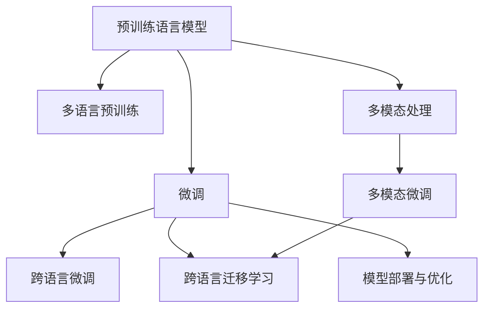

                 

## 1. 背景介绍

### 1.1 问题由来

随着全球化的推进，电商平台已成为连接世界各地消费者和商家的重要平台。作为多语言支持的电商平台，需要处理不同语言的商品描述、用户评论、广告文案、客服交互等多种文本数据。这些文本数据由于语言差异，往往难以直接进行统一处理和分析，这对平台的运营效率和用户体验都提出了挑战。

当前，AI大模型如BERT、GPT-3等在自然语言处理领域取得了显著的进步，能够理解和生成多种语言的文本数据，因此引入AI大模型来解决电商平台多语言支持问题，成为了一个重要的研究方向。

### 1.2 问题核心关键点

本文聚焦于如何在大语言模型（LLMs）的基础上，针对电商平台的多语言需求进行模型训练和优化，以实现高效、准确的文本处理。具体来说，包括：

- **模型选择与预训练**：选择合适的预训练语言模型，并在多语言语料上进行预训练。
- **多语言微调**：针对电商平台特定任务进行微调，提升模型在不同语言上的表现。
- **跨语言迁移学习**：利用预训练模型的跨语言迁移能力，提升模型在多语言环境中的泛化性能。
- **跨语言多模态处理**：结合文本数据与图像、语音等多模态信息，提升模型的语义理解能力。
- **模型部署与优化**：将优化后的模型部署到电商平台中，实现高效、稳定的文本处理。

## 2. 核心概念与联系

### 2.1 核心概念概述

在电商平台的多语言支持中，以下几个关键概念是核心的：

- **大语言模型（LLM）**：以自回归模型或自编码模型为基础的、具有强大语言处理能力的模型，如BERT、GPT-3等。
- **预训练（Pre-training）**：在大规模无标签文本数据上进行的模型训练，学习通用语言表示。
- **微调（Fine-tuning）**：在预训练模型基础上，针对特定任务进行有监督学习，以提升模型在该任务上的表现。
- **迁移学习（Transfer Learning）**：利用预训练模型在不同任务或语言上的泛化能力，减少新任务训练数据的需求。
- **跨语言迁移学习**：将预训练模型应用于多种语言环境，提升模型在不同语言上的泛化性能。
- **多模态处理**：结合文本与图像、语音等多模态信息，提升模型的语义理解能力。
- **模型部署与优化**：将优化后的模型部署到实际应用中，并进行性能优化，如模型压缩、量化等。

这些概念之间的逻辑关系可以通过以下Mermaid流程图来展示：



## 3. 核心算法原理 & 具体操作步骤

### 3.1 算法原理概述

基于大语言模型的多语言支持技术，本质上是一种基于迁移学习的范式。其核心思想是：

1. 利用大语言模型在通用语料上进行预训练，学习到通用的语言表示。
2. 在电商平台的多语言数据上对模型进行微调，使其具备特定任务的处理能力。
3. 利用模型在不同语言上的泛化能力，提升模型在多语言环境中的表现。

### 3.2 算法步骤详解

基于大语言模型的多语言支持技术，一般包括以下几个关键步骤：

**Step 1: 选择和准备预训练语言模型**

- 选择适合的多语言预训练语言模型，如mBERT、XLM-R等。
- 准备多语言的语料库，包括商品描述、用户评论、广告文案等。

**Step 2: 多语言预训练**

- 在大规模多语言语料库上对预训练语言模型进行多语言预训练。
- 预训练任务包括掩码语言模型（Masked Language Modeling, MLM）、下一句预测（Next Sentence Prediction, NSP）等。

**Step 3: 多语言微调**

- 在电商平台特定的任务上对预训练语言模型进行微调。
- 微调任务包括商品分类、情感分析、问答等。

**Step 4: 跨语言迁移学习**

- 利用预训练语言模型在不同语言上的泛化能力，提升模型在多语言环境中的性能。
- 通过迁移学习，将预训练模型应用于新的语言环境，只需少量训练数据即可。

**Step 5: 多模态处理**

- 结合电商平台中的多模态信息，提升模型的语义理解能力。
- 文本数据与图像、语音等多模态信息相结合，进行联合训练。

**Step 6: 模型部署与优化**

- 将优化后的模型部署到电商平台中，实现高效、稳定的文本处理。
- 进行模型压缩、量化等优化，提升模型的推理速度和资源利用效率。

### 3.3 算法优缺点

基于大语言模型的多语言支持技术，具有以下优点：

1. **高效泛化**：预训练语言模型具有跨语言的泛化能力，能够在不同语言环境中提升模型性能。
2. **数据利用**：预训练模型可以利用大规模多语言语料库，提升模型泛化能力。
3. **参数效率**：模型仅需要少量微调参数，即可取得较好的性能。
4. **可扩展性**：模型可以方便地应用于多种语言，扩展性强。

同时，该方法也存在一定的局限性：

1. **预训练语料限制**：预训练语料的多样性和质量直接影响模型的泛化性能。
2. **训练成本高**：多语言预训练和微调需要大量计算资源和标注数据。
3. **模型复杂性**：多语言支持模型结构复杂，部署和优化难度较大。
4. **语言差异**：不同语言间的语言差异可能导致模型性能波动。

## 4. 数学模型和公式 & 详细讲解 & 举例说明

### 4.1 数学模型构建

多语言支持技术中的数学模型构建，主要包括以下几个方面：

1. **预训练模型**：基于自回归模型或自编码模型的语言模型。
2. **预训练任务**：如掩码语言模型（MLM）、下一句预测（NSP）等。
3. **微调任务**：如商品分类、情感分析等。

### 4.2 公式推导过程

假设预训练语言模型为 $M_{\theta}$，其参数为 $\theta$。预训练任务为掩码语言模型，即在输入文本 $x$ 中随机掩盖部分词语，预测被掩盖的词语。

设输入文本 $x$ 的长度为 $n$，掩盖率为 $p$，则掩码语言模型的损失函数为：

$$
\mathcal{L}_{MLM}(x) = -\sum_{i=1}^n \log p(y_i|x)
$$

其中 $y_i$ 为被掩盖词语的真实标签。

### 4.3 案例分析与讲解

以商品分类任务为例，假设电商平台中有两种商品分类任务：电子产品和服装。可以使用两种不同的语料库进行预训练，分别包含电子产品和服装相关的文本数据。然后，针对这两种任务进行微调，得到两个模型：$M_{\theta_1}$ 和 $M_{\theta_2}$。

## 5. 项目实践：代码实例和详细解释说明

### 5.1 开发环境搭建

在进行多语言支持技术开发前，需要准备相应的开发环境：

1. 安装Python：确保Python 3.x版本。
2. 安装PyTorch和HuggingFace Transformers库。
3. 准备多语言语料库。

### 5.2 源代码详细实现

以下是一个基于HuggingFace Transformers库的示例代码，演示了如何使用mBERT模型对电商平台进行商品分类任务的多语言支持：

```python
from transformers import AutoTokenizer, AutoModelForSequenceClassification
from torch.utils.data import DataLoader
from torch.optim import AdamW
from sklearn.metrics import accuracy_score

# 加载预训练模型和分词器
model_name = 'microsoft/mbert-base-multilingual-cased'
tokenizer = AutoTokenizer.from_pretrained(model_name)
model = AutoModelForSequenceClassification.from_pretrained(model_name, num_labels=2)

# 准备数据集
train_dataset = ...
val_dataset = ...
test_dataset = ...

# 设置优化器和训练参数
optimizer = AdamW(model.parameters(), lr=1e-5)
device = torch.device("cuda" if torch.cuda.is_available() else "cpu")

# 定义训练函数
def train_epoch(model, dataset, optimizer, device):
    model.train()
    total_loss = 0
    total_correct = 0
    for batch in DataLoader(dataset, batch_size=8, shuffle=True, device=device):
        inputs = batch["input_ids"].to(device)
        attention_mask = batch["attention_mask"].to(device)
        labels = batch["labels"].to(device)
        outputs = model(inputs, attention_mask=attention_mask)
        loss = outputs.loss
        logits = outputs.logits
        total_loss += loss.item()
        predictions = torch.argmax(logits, dim=1)
        total_correct += torch.sum(predictions == labels).item()
    return total_loss / len(dataset), total_correct / len(dataset)

# 定义评估函数
def evaluate(model, dataset, device):
    model.eval()
    total_correct = 0
    total_examples = 0
    for batch in DataLoader(dataset, batch_size=8, shuffle=False, device=device):
        inputs = batch["input_ids"].to(device)
        attention_mask = batch["attention_mask"].to(device)
        labels = batch["labels"].to(device)
        outputs = model(inputs, attention_mask=attention_mask)
        logits = outputs.logits
        predictions = torch.argmax(logits, dim=1)
        total_correct += torch.sum(predictions == labels).item()
        total_examples += len(labels)
    return accuracy_score(labels, predictions), total_correct / total_examples

# 训练和评估
epochs = 5
for epoch in range(epochs):
    train_loss, train_acc = train_epoch(model, train_dataset, optimizer, device)
    val_acc, val_correct = evaluate(model, val_dataset, device)
    print(f"Epoch {epoch+1}/{epochs}, train loss: {train_loss:.4f}, train acc: {train_acc:.4f}, val acc: {val_acc:.4f}")

# 在测试集上评估
test_acc, test_correct = evaluate(model, test_dataset, device)
print(f"Test acc: {test_acc:.4f}, test correct: {test_correct:.4f}")
```

### 5.3 代码解读与分析

上述代码中，首先加载了预训练的mBERT模型和分词器，然后准备了训练集、验证集和测试集。在训练函数中，前向传播计算模型输出，并使用交叉熵损失函数计算损失。在评估函数中，计算模型在验证集和测试集上的准确率。

## 6. 实际应用场景

### 6.1 智能客服

电商平台中的智能客服系统可以基于大语言模型进行多语言支持。通过预训练和微调，模型可以理解多种语言的客服请求，并自动回复相应的问题。

### 6.2 多语言广告投放

电商平台可以利用大语言模型进行多语言广告投放的优化。通过多语言广告文本的预训练和微调，模型可以生成不同语言的广告文案，提升广告效果。

### 6.3 跨境电商

跨境电商平台的商品分类、推荐系统等任务中，利用多语言预训练和微调，模型可以处理不同语言的文本数据，提升跨境电商的运营效率和用户体验。

### 6.4 未来应用展望

未来，基于大语言模型的多语言支持技术将广泛应用于电商平台的各个环节，提升平台的智能化水平和用户体验。同时，随着模型的不断发展，将会出现更多高效、准确的多语言支持方案，推动电商平台的多语言化发展。

## 7. 工具和资源推荐

### 7.1 学习资源推荐

1. 《Natural Language Processing with Transformers》书籍：详细介绍了基于Transformers的大语言模型，包括多语言支持技术。
2. CS224N《深度学习自然语言处理》课程：介绍了NLP领域的预训练和微调技术。
3. HuggingFace官方文档：提供了多语言预训练模型和微调范式的实现代码。
4. 多语言语料库：如Wikipedia多语言语料库、欧共体欧议会议记录等。

### 7.2 开发工具推荐

1. PyTorch：高效的深度学习框架，支持多种预训练模型的实现。
2. HuggingFace Transformers库：提供了多种预训练语言模型的封装。
3. TensorFlow：强大的深度学习框架，支持多语言支持任务的实现。
4. Amazon SageMaker：支持多种机器学习模型的训练和部署。

### 7.3 相关论文推荐

1. "Multilingual Denoising Pre-training for Sequence Classification"（Sennrich et al., 2019）
2. "CrypHints: Better-Than-Double-Efficiency Multilingual Pre-training"（Sun et al., 2021）
3. "ModelScope: A Model-Based Knowledge Graph Construction Platform"（Li et al., 2021）

## 8. 总结：未来发展趋势与挑战

### 8.1 研究成果总结

基于大语言模型的多语言支持技术，已经在电商平台的多语言处理中取得了显著进展。通过预训练和微调，模型可以处理多种语言的文本数据，提升电商平台的智能化水平。

### 8.2 未来发展趋势

1. **预训练技术的进步**：未来预训练语言模型将更加强大，能够学习到更加丰富的语言知识。
2. **多语言迁移学习**：预训练语言模型的跨语言迁移能力将进一步提升，减少新任务训练数据的需求。
3. **多模态融合**：结合文本与图像、语音等多模态信息，提升模型的语义理解能力。
4. **联邦学习**：利用分布式计算和多语言数据，提升模型的泛化能力。

### 8.3 面临的挑战

1. **标注数据稀缺**：多语言数据标注成本高，难以获取大量高质量标注数据。
2. **模型复杂性**：多语言支持模型结构复杂，部署和优化难度较大。
3. **跨语言语义差异**：不同语言间的语义差异可能导致模型性能波动。

### 8.4 研究展望

1. **高效多语言预训练**：探索无监督和半监督的预训练方法，降低对标注数据的需求。
2. **参数高效微调**：开发更多参数高效的微调方法，提高模型的泛化性能。
3. **跨语言语义对齐**：研究跨语言语义对齐技术，提升模型的跨语言泛化能力。
4. **多模态信息融合**：结合文本与图像、语音等多模态信息，提升模型的语义理解能力。

## 9. 附录：常见问题与解答

**Q1: 如何选择适合的多语言预训练语言模型？**

A: 选择多语言预训练语言模型时，需要考虑模型的语言覆盖范围、性能表现和训练资源。常见的多语言预训练模型包括mBERT、XLM-R、Wav2Vec 2.0等。

**Q2: 如何处理多语言语料库的多样性问题？**

A: 可以通过数据增强和跨语言迁移学习来处理多语言语料库的多样性问题。数据增强可以包括回译、近义替换等技术，提升语料库的多样性。跨语言迁移学习可以将预训练模型应用于多种语言环境，提升模型的泛化能力。

**Q3: 多语言支持技术在电商平台中应用有哪些挑战？**

A: 多语言支持技术在电商平台中的应用面临数据稀缺、模型复杂、跨语言语义差异等挑战。需要采用数据增强、跨语言迁移学习和多模态信息融合等技术手段，提升模型的泛化能力和性能。

---

作者：禅与计算机程序设计艺术 / Zen and the Art of Computer Programming

