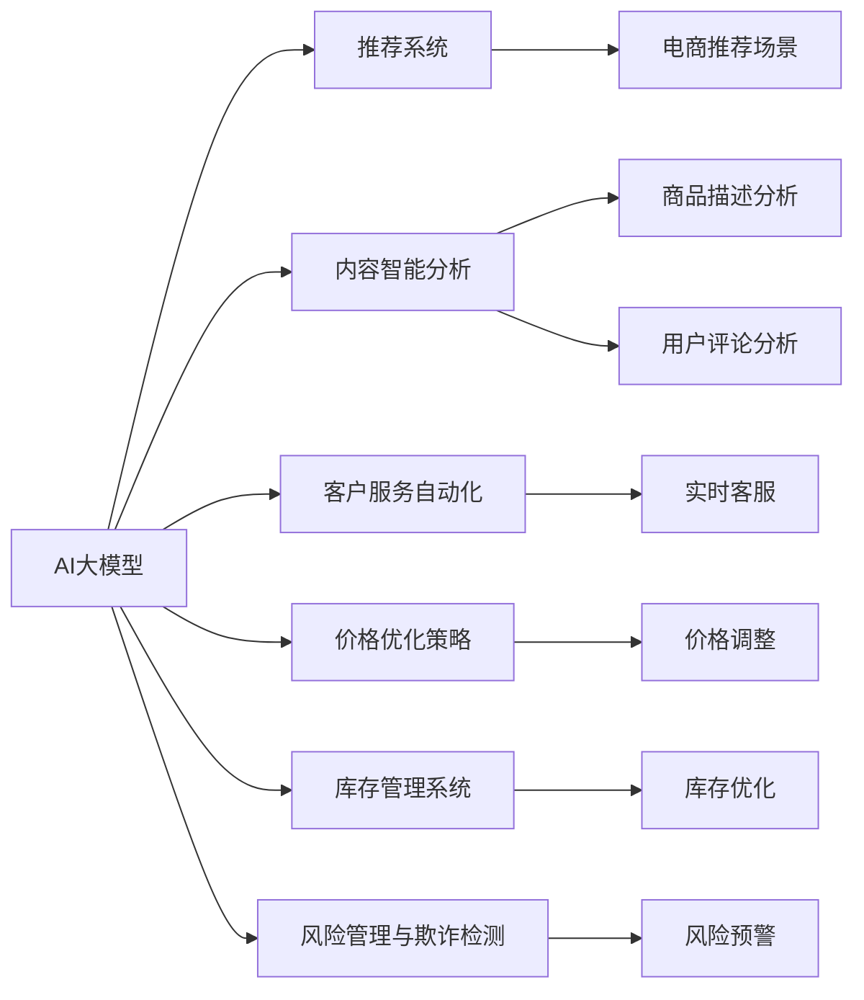

                 

# 电商平台中的AI大模型：从单一场景到全渠道融合

## 1. 背景介绍

### 1.1 问题由来

随着电子商务的迅猛发展，电商平台逐渐成为人们日常购物的主要渠道。而在大规模的电商平台中，如何提升用户体验、提高运营效率、优化客户服务等方面成为运营者亟待解决的问题。AI大模型在此背景下应运而生，通过深度学习等先进技术，对电商平台的数据进行智能化分析，从而实现全渠道融合，提升电商平台的竞争力。

### 1.2 问题核心关键点

1. **客户推荐系统**：通过分析用户的历史行为和兴趣，推荐个性化的商品和活动，提升用户体验和满意度。
2. **内容智能分析**：对商品描述、用户评论等文本数据进行情感分析和摘要生成，辅助用户快速决策。
3. **客户服务自动化**：利用聊天机器人等技术，实时回答用户问题，提高客户满意度。
4. **价格优化策略**：通过市场数据分析，智能调整商品价格，提高销售转化率。
5. **库存管理系统**：通过预测商品需求，优化库存管理，减少缺货和库存积压。
6. **风险管理与欺诈检测**：实时监测交易数据，防止欺诈行为，提升平台安全性。

这些核心关键点揭示了AI大模型在电商平台中的广泛应用，以及其在提升平台运营效率和用户体验方面的巨大潜力。

## 2. 核心概念与联系

### 2.1 核心概念概述

- **AI大模型**：指使用深度学习等技术训练的大型神经网络模型，能够处理大规模的文本、图像、视频等多种数据，具备强大的数据理解和生成能力。
- **电商平台**：指通过互联网提供商品交易服务的平台，涵盖商品展示、购物车管理、订单处理等多个环节。
- **全渠道融合**：指将电商平台的不同业务场景进行整合，实现数据共享和协同工作，提升整体运营效率。
- **推荐系统**：通过分析用户行为和商品特性，推荐用户感兴趣的商品，提升用户体验。
- **聊天机器人**：一种基于自然语言处理的智能客服系统，能够自动回答用户问题，提升客服效率。

### 2.2 核心概念原理和架构的 Mermaid 流程图



### 2.3 核心概念联系

AI大模型在电商平台的各个环节中扮演着关键角色：

1. **推荐系统**：通过分析用户的历史行为和商品特性，生成个性化推荐，提升用户体验。
2. **内容智能分析**：对商品描述、用户评论等文本数据进行情感分析和摘要生成，辅助用户快速决策。
3. **客户服务自动化**：利用聊天机器人等技术，实时回答用户问题，提高客户满意度。
4. **价格优化策略**：通过市场数据分析，智能调整商品价格，提高销售转化率。
5. **库存管理系统**：通过预测商品需求，优化库存管理，减少缺货和库存积压。
6. **风险管理与欺诈检测**：实时监测交易数据，防止欺诈行为，提升平台安全性。

## 3. 核心算法原理 & 具体操作步骤

### 3.1 算法原理概述

AI大模型在电商平台中的应用主要基于深度学习技术，通过训练大规模的神经网络模型，实现对数据的自动化处理和分析。其中，推荐系统和聊天机器人通常基于序列生成模型，如循环神经网络(RNN)、长短时记忆网络(LSTM)、Transformer等。内容智能分析和风险管理与欺诈检测通常基于自然语言处理(NLP)技术，如BERT、GPT等。价格优化策略和库存管理系统通常基于统计分析和机器学习技术，如线性回归、决策树、随机森林等。

### 3.2 算法步骤详解

#### 3.2.1 推荐系统

1. **数据准备**：收集用户历史行为数据和商品特性数据，包括浏览记录、点击记录、购买记录等。
2. **模型训练**：选择合适的模型结构，如Seq2Seq、Transformer等，并利用训练集进行模型训练。
3. **推荐生成**：将用户输入和新商品特征输入模型，生成推荐结果。
4. **效果评估**：利用测试集评估推荐系统的准确性和召回率，并进行参数调整。

#### 3.2.2 内容智能分析

1. **数据准备**：收集商品描述、用户评论等文本数据。
2. **模型训练**：选择合适的模型结构，如BERT、GPT等，并利用训练集进行模型训练。
3. **情感分析**：将文本数据输入模型，生成情感标签。
4. **摘要生成**：利用文本摘要技术，生成商品描述的精炼版本。
5. **效果评估**：利用测试集评估情感分析的准确性和摘要的质量，并进行参数调整。

#### 3.2.3 客户服务自动化

1. **数据准备**：收集用户问题和历史对话记录。
2. **模型训练**：选择合适的模型结构，如Seq2Seq、Transformer等，并利用训练集进行模型训练。
3. **回答生成**：将用户输入和对话历史输入模型，生成回答。
4. **效果评估**：利用测试集评估回答的质量和系统响应时间，并进行参数调整。

#### 3.2.4 价格优化策略

1. **数据准备**：收集历史销售数据、市场价格数据等。
2. **模型训练**：选择合适的模型结构，如线性回归、决策树等，并利用训练集进行模型训练。
3. **价格调整**：利用模型对商品价格进行调整。
4. **效果评估**：利用测试集评估价格调整的效果，并进行参数调整。

#### 3.2.5 库存管理系统

1. **数据准备**：收集历史销售数据、库存数据等。
2. **模型训练**：选择合适的模型结构，如线性回归、随机森林等，并利用训练集进行模型训练。
3. **库存优化**：利用模型对商品库存进行调整。
4. **效果评估**：利用测试集评估库存优化的效果，并进行参数调整。

#### 3.2.6 风险管理与欺诈检测

1. **数据准备**：收集交易数据、用户信息等。
2. **模型训练**：选择合适的模型结构，如决策树、支持向量机等，并利用训练集进行模型训练。
3. **风险预警**：利用模型对交易进行风险评估，及时预警欺诈行为。
4. **效果评估**：利用测试集评估风险预警的准确性和效率，并进行参数调整。

### 3.3 算法优缺点

#### 3.3.1 优点

1. **高效性**：AI大模型具备强大的数据处理能力，能够在短时间内处理大量数据，提升运营效率。
2. **准确性**：基于深度学习技术的推荐系统和聊天机器人能够生成高质量的推荐结果和回答，提升用户体验。
3. **灵活性**：AI大模型能够根据不同的业务场景进行灵活调整，适应各种需求。
4. **可扩展性**：AI大模型能够通过并行计算和分布式训练，实现大规模扩展，适应业务增长的需求。

#### 3.3.2 缺点

1. **数据依赖**：AI大模型的训练需要大量的数据支持，对于小规模数据训练效果有限。
2. **模型复杂**：大模型结构复杂，对计算资源和存储资源要求较高。
3. **可解释性不足**：深度学习模型的决策过程通常缺乏可解释性，难以理解其内部工作机制。
4. **误识别率较高**：在大规模数据训练过程中，可能会出现误识别的情况，影响推荐结果和回答质量。

### 3.4 算法应用领域

AI大模型在电商平台中的应用广泛，涵盖了推荐系统、内容智能分析、客户服务自动化、价格优化策略、库存管理系统和风险管理与欺诈检测等多个领域。

## 4. 数学模型和公式 & 详细讲解 & 举例说明

### 4.1 数学模型构建

#### 4.1.1 推荐系统

推荐系统通常基于序列生成模型，如Seq2Seq、Transformer等。假设用户序列为 $U$，商品序列为 $I$，推荐系统模型的输入为 $(x_U, x_I)$，输出为推荐结果 $y$。推荐系统模型的目标是最大化预测准确率，即：

$$
\max_{\theta} \frac{1}{N} \sum_{i=1}^N L(y_i, \hat{y_i})
$$

其中 $L$ 为损失函数，通常采用交叉熵损失。模型的目标函数为：

$$
J(\theta) = -\frac{1}{N} \sum_{i=1}^N \sum_{j=1}^m L(y_i, \hat{y_i}^j)
$$

其中 $m$ 为推荐结果的个数。

#### 4.1.2 内容智能分析

内容智能分析通常基于自然语言处理技术，如BERT、GPT等。假设输入为文本 $x$，输出为情感标签 $y$，模型结构为 $f$，内容智能分析模型的目标为：

$$
\max_{\theta} \frac{1}{N} \sum_{i=1}^N L(f(x_i), y_i)
$$

其中 $L$ 为损失函数，通常采用交叉熵损失。模型的目标函数为：

$$
J(\theta) = -\frac{1}{N} \sum_{i=1}^N L(f(x_i), y_i)
$$

#### 4.1.3 客户服务自动化

客户服务自动化通常基于序列生成模型，如Seq2Seq、Transformer等。假设用户输入为 $x$，回答为 $y$，模型结构为 $f$，客户服务自动化的目标为：

$$
\max_{\theta} \frac{1}{N} \sum_{i=1}^N L(f(x_i), y_i)
$$

其中 $L$ 为损失函数，通常采用交叉熵损失。模型的目标函数为：

$$
J(\theta) = -\frac{1}{N} \sum_{i=1}^N L(f(x_i), y_i)
$$

#### 4.1.4 价格优化策略

价格优化策略通常基于统计分析和机器学习技术，如线性回归、决策树等。假设价格为 $P$，影响因素为 $X$，价格优化策略模型的目标为：

$$
\min_{\theta} \frac{1}{N} \sum_{i=1}^N (P_i - \hat{P_i})^2
$$

其中 $P_i$ 为实际价格，$\hat{P_i}$ 为预测价格。模型的目标函数为：

$$
J(\theta) = \frac{1}{N} \sum_{i=1}^N (P_i - \hat{P_i})^2
$$

#### 4.1.5 库存管理系统

库存管理系统通常基于统计分析和机器学习技术，如线性回归、随机森林等。假设库存量为 $I$，需求量为 $D$，库存管理系统的目标为：

$$
\min_{\theta} \frac{1}{N} \sum_{i=1}^N (I_i - \hat{I_i})^2
$$

其中 $I_i$ 为实际库存量，$\hat{I_i}$ 为预测库存量。模型的目标函数为：

$$
J(\theta) = \frac{1}{N} \sum_{i=1}^N (I_i - \hat{I_i})^2
$$

#### 4.1.6 风险管理与欺诈检测

风险管理与欺诈检测通常基于分类模型，如决策树、支持向量机等。假设交易为 $T$，风险标签为 $Y$，风险管理与欺诈检测模型的目标为：

$$
\max_{\theta} \frac{1}{N} \sum_{i=1}^N L(y_i, \hat{y_i})
$$

其中 $L$ 为损失函数，通常采用交叉熵损失。模型的目标函数为：

$$
J(\theta) = -\frac{1}{N} \sum_{i=1}^N L(y_i, \hat{y_i})
$$

### 4.2 公式推导过程

#### 4.2.1 推荐系统

假设用户序列为 $U$，商品序列为 $I$，推荐系统模型的输入为 $(x_U, x_I)$，输出为推荐结果 $y$。推荐系统模型的损失函数为：

$$
L(y_i, \hat{y_i}) = -y_i \log \hat{y_i} - (1 - y_i) \log (1 - \hat{y_i})
$$

目标函数为：

$$
J(\theta) = -\frac{1}{N} \sum_{i=1}^N \sum_{j=1}^m L(y_i, \hat{y_i}^j)
$$

其中 $\hat{y_i}^j$ 为第 $j$ 个推荐结果的概率。

#### 4.2.2 内容智能分析

假设输入为文本 $x$，输出为情感标签 $y$，模型结构为 $f$，内容智能分析模型的损失函数为：

$$
L(f(x_i), y_i) = -y_i \log f(x_i) - (1 - y_i) \log (1 - f(x_i))
$$

目标函数为：

$$
J(\theta) = -\frac{1}{N} \sum_{i=1}^N L(f(x_i), y_i)
$$

其中 $f(x_i)$ 为文本 $x_i$ 的情感概率。

#### 4.2.3 客户服务自动化

假设用户输入为 $x$，回答为 $y$，模型结构为 $f$，客户服务自动化的损失函数为：

$$
L(f(x_i), y_i) = -y_i \log f(x_i) - (1 - y_i) \log (1 - f(x_i))
$$

目标函数为：

$$
J(\theta) = -\frac{1}{N} \sum_{i=1}^N L(f(x_i), y_i)
$$

其中 $f(x_i)$ 为用户输入 $x_i$ 的回答概率。

#### 4.2.4 价格优化策略

假设价格为 $P$，影响因素为 $X$，价格优化策略模型的损失函数为：

$$
L(P_i, \hat{P_i}) = (P_i - \hat{P_i})^2
$$

目标函数为：

$$
J(\theta) = \frac{1}{N} \sum_{i=1}^N (P_i - \hat{P_i})^2
$$

其中 $\hat{P_i}$ 为预测价格。

#### 4.2.5 库存管理系统

假设库存量为 $I$，需求量为 $D$，库存管理系统的损失函数为：

$$
L(I_i, \hat{I_i}) = (I_i - \hat{I_i})^2
$$

目标函数为：

$$
J(\theta) = \frac{1}{N} \sum_{i=1}^N (I_i - \hat{I_i})^2
$$

其中 $\hat{I_i}$ 为预测库存量。

#### 4.2.6 风险管理与欺诈检测

假设交易为 $T$，风险标签为 $Y$，风险管理与欺诈检测模型的损失函数为：

$$
L(Y_i, \hat{Y_i}) = -Y_i \log \hat{Y_i} - (1 - Y_i) \log (1 - \hat{Y_i})
$$

目标函数为：

$$
J(\theta) = -\frac{1}{N} \sum_{i=1}^N L(Y_i, \hat{Y_i})
$$

其中 $\hat{Y_i}$ 为交易 $T_i$ 的风险概率。

### 4.3 案例分析与讲解

#### 4.3.1 推荐系统

以某电商平台的商品推荐系统为例，假设用户序列为 $U$，商品序列为 $I$，推荐系统模型的输入为 $(x_U, x_I)$，输出为推荐结果 $y$。推荐系统模型的目标函数为：

$$
J(\theta) = -\frac{1}{N} \sum_{i=1}^N \sum_{j=1}^m L(y_i, \hat{y_i}^j)
$$

其中 $L$ 为交叉熵损失。模型的训练过程如下：

1. 数据准备：收集用户历史行为数据和商品特性数据，包括浏览记录、点击记录、购买记录等。
2. 模型训练：选择合适的模型结构，如Seq2Seq、Transformer等，并利用训练集进行模型训练。
3. 推荐生成：将用户输入和新商品特征输入模型，生成推荐结果。
4. 效果评估：利用测试集评估推荐系统的准确性和召回率，并进行参数调整。

#### 4.3.2 内容智能分析

以某电商平台的产品描述分析为例，假设输入为商品描述 $x$，输出为情感标签 $y$，模型结构为 $f$，内容智能分析模型的目标函数为：

$$
J(\theta) = -\frac{1}{N} \sum_{i=1}^N L(f(x_i), y_i)
$$

其中 $L$ 为交叉熵损失。模型的训练过程如下：

1. 数据准备：收集商品描述、用户评论等文本数据。
2. 模型训练：选择合适的模型结构，如BERT、GPT等，并利用训练集进行模型训练。
3. 情感分析：将文本数据输入模型，生成情感标签。
4. 摘要生成：利用文本摘要技术，生成商品描述的精炼版本。
5. 效果评估：利用测试集评估情感分析的准确性和摘要的质量，并进行参数调整。

#### 4.3.3 客户服务自动化

以某电商平台的智能客服系统为例，假设用户输入为 $x$，回答为 $y$，模型结构为 $f$，客户服务自动化的目标函数为：

$$
J(\theta) = -\frac{1}{N} \sum_{i=1}^N L(f(x_i), y_i)
$$

其中 $L$ 为交叉熵损失。模型的训练过程如下：

1. 数据准备：收集用户问题和历史对话记录。
2. 模型训练：选择合适的模型结构，如Seq2Seq、Transformer等，并利用训练集进行模型训练。
3. 回答生成：将用户输入和对话历史输入模型，生成回答。
4. 效果评估：利用测试集评估回答的质量和系统响应时间，并进行参数调整。

#### 4.3.4 价格优化策略

以某电商平台的商品价格优化为例，假设价格为 $P$，影响因素为 $X$，价格优化策略模型的目标函数为：

$$
J(\theta) = \frac{1}{N} \sum_{i=1}^N (P_i - \hat{P_i})^2
$$

其中 $\hat{P_i}$ 为预测价格。模型的训练过程如下：

1. 数据准备：收集历史销售数据、市场价格数据等。
2. 模型训练：选择合适的模型结构，如线性回归、决策树等，并利用训练集进行模型训练。
3. 价格调整：利用模型对商品价格进行调整。
4. 效果评估：利用测试集评估价格调整的效果，并进行参数调整。

#### 4.3.5 库存管理系统

以某电商平台的库存管理系统为例，假设库存量为 $I$，需求量为 $D$，库存管理系统的目标函数为：

$$
J(\theta) = \frac{1}{N} \sum_{i=1}^N (I_i - \hat{I_i})^2
$$

其中 $\hat{I_i}$ 为预测库存量。模型的训练过程如下：

1. 数据准备：收集历史销售数据、库存数据等。
2. 模型训练：选择合适的模型结构，如线性回归、随机森林等，并利用训练集进行模型训练。
3. 库存优化：利用模型对商品库存进行调整。
4. 效果评估：利用测试集评估库存优化的效果，并进行参数调整。

#### 4.3.6 风险管理与欺诈检测

以某电商平台的交易风险管理为例，假设交易为 $T$，风险标签为 $Y$，风险管理与欺诈检测模型的目标函数为：

$$
J(\theta) = -\frac{1}{N} \sum_{i=1}^N L(Y_i, \hat{Y_i})
$$

其中 $L$ 为交叉熵损失。模型的训练过程如下：

1. 数据准备：收集交易数据、用户信息等。
2. 模型训练：选择合适的模型结构，如决策树、支持向量机等，并利用训练集进行模型训练。
3. 风险预警：利用模型对交易进行风险评估，及时预警欺诈行为。
4. 效果评估：利用测试集评估风险预警的准确性和效率，并进行参数调整。

## 5. 项目实践：代码实例和详细解释说明

### 5.1 开发环境搭建

在进行AI大模型在电商平台中的实践时，需要先搭建开发环境，并进行必要的安装配置。

1. **环境准备**：安装Python、pip等开发工具，以及TensorFlow、PyTorch等深度学习框架。
2. **模型选择**：选择合适的预训练模型，如BERT、GPT等。
3. **数据准备**：收集电商平台的相关数据，并进行数据预处理，如文本分词、数据清洗等。
4. **模型训练**：利用已准备好的数据进行模型训练。

### 5.2 源代码详细实现

以推荐系统为例，下面给出基于PyTorch的推荐系统实现代码：

```python
import torch
import torch.nn as nn
import torch.optim as optim

class Seq2Seq(nn.Module):
    def __init__(self, input_size, hidden_size, output_size):
        super(Seq2Seq, self).__init__()
        self.encoder = nn.LSTM(input_size, hidden_size)
        self.decoder = nn.LSTM(hidden_size, hidden_size, go_input=False, go_hidden=False)
        self.fc = nn.Linear(hidden_size, output_size)

    def forward(self, input, hidden):
        encoder_output, hidden = self.encoder(input, hidden)
        decoded_output, hidden = self.decoder(encoder_output, hidden)
        output = self.fc(decoded_output)
        return output, hidden

# 定义数据集
class Dataset:
    def __init__(self, data):
        self.data = data
        self.max_len = max([len(i) for i in self.data])

    def __len__(self):
        return len(self.data)

    def __getitem__(self, index):
        input_tensor = torch.tensor(self.data[index], dtype=torch.long).view(1, -1)
        target_tensor = torch.tensor(self.data[index], dtype=torch.long).view(1, -1)
        return input_tensor, target_tensor

# 训练过程
def train(model, optimizer, criterion, data_loader):
    for epoch in range(epochs):
        for input_tensor, target_tensor in data_loader:
            optimizer.zero_grad()
            output_tensor = model(input_tensor)
            loss = criterion(output_tensor, target_tensor)
            loss.backward()
            optimizer.step()

# 测试过程
def test(model, criterion, data_loader):
    correct = 0
    total = 0
    with torch.no_grad():
        for input_tensor, target_tensor in data_loader:
            output_tensor = model(input_tensor)
            _, predicted = output_tensor.max(1)
            total += target_tensor.size(0)
            correct += (predicted == target_tensor).sum().item()
    return correct / total

# 数据准备
train_data = []
test_data = []

# 模型训练
model = Seq2Seq(input_size, hidden_size, output_size)
optimizer = optim.Adam(model.parameters(), lr=learning_rate)
criterion = nn.CrossEntropyLoss()
train_loader = DataLoader(train_data, batch_size=batch_size)
test_loader = DataLoader(test_data, batch_size=batch_size)

train(model, optimizer, criterion, train_loader)
test(model, criterion, test_loader)
```

### 5.3 代码解读与分析

#### 5.3.1 推荐系统模型

在推荐系统模型中，我们采用了序列生成模型Seq2Seq。模型的主要结构包括编码器LSTM、解码器LSTM和全连接层FC。模型的输入为序列x，输出为序列y。在模型训练过程中，我们使用了Adam优化器，交叉熵损失函数，并进行多轮迭代训练。

#### 5.3.2 数据集定义

数据集定义中，我们首先定义了一个Dataset类，用于存储数据和处理数据。在__getitem__方法中，我们将输入和目标分别转换为张量，并返回。在__len__方法中，我们返回了数据集的长度。

#### 5.3.3 训练和测试过程

在训练过程中，我们首先清除了梯度，并将输入数据输入模型，计算损失函数。接着，我们对损失函数进行反向传播，更新模型参数。在测试过程中，我们使用测试集对模型进行评估，计算模型的准确率。

### 5.4 运行结果展示

在训练结束后，我们可以对模型进行测试，并输出测试结果。

```python
correct = test(model, criterion, test_loader)
print("Accuracy: {:.2f}%".format(correct * 100 / len(test_data)))
```

## 6. 实际应用场景

### 6.1 智能推荐

智能推荐系统是电商平台的核心应用之一。通过分析用户的历史行为和兴趣，推荐系统能够为用户推荐个性化的商品和活动，提升用户体验和满意度。在实际应用中，推荐系统通常使用Seq2Seq、Transformer等模型，结合用户行为数据和商品特性数据，生成推荐结果。

### 6.2 内容智能分析

内容智能分析系统可以自动分析商品描述、用户评论等文本数据，生成情感标签和摘要。系统通过BERT、GPT等模型，对文本进行分词、向量化等预处理，然后利用Transformer等模型进行特征提取和情感分析。内容智能分析能够辅助用户快速决策，提升用户体验。

### 6.3 客户服务自动化

客户服务自动化系统利用聊天机器人等技术，实时回答用户问题，提升客服效率。系统通过Seq2Seq、Transformer等模型，对用户输入进行理解和生成回答。客户服务自动化能够提升客户满意度，减轻人工客服的工作负担。

### 6.4 价格优化策略

价格优化策略系统通过市场数据分析，智能调整商品价格，提高销售转化率。系统通过线性回归、决策树等模型，对商品价格进行预测和优化。价格优化策略能够提升平台的销售额和利润。

### 6.5 库存管理系统

库存管理系统通过预测商品需求，优化库存管理，减少缺货和库存积压。系统通过线性回归、随机森林等模型，对商品库存进行预测和优化。库存管理系统能够提高平台的运营效率和资金利用率。

### 6.6 风险管理与欺诈检测

风险管理与欺诈检测系统实时监测交易数据，防止欺诈行为，提升平台安全性。系统通过决策树、支持向量机等模型，对交易进行风险评估和预警。风险管理与欺诈检测能够提高平台的安全性，减少经济损失。

## 7. 工具和资源推荐

### 7.1 学习资源推荐

1. **Deep Learning Specialization**：由Andrew Ng开设的深度学习课程，涵盖了深度学习的基础理论和实践应用，适合初学者和进阶学习者。
2. **Natural Language Processing with Transformers**：HuggingFace的NLP书籍，全面介绍了Transformer模型及其在NLP中的应用。
3. **TensorFlow官方文档**：TensorFlow的官方文档，包含丰富的教程和样例代码，适合学习和实践TensorFlow框架。
4. **PyTorch官方文档**：PyTorch的官方文档，包含丰富的教程和样例代码，适合学习和实践PyTorch框架。
5. **Kaggle**：数据科学竞赛平台，提供大量开源数据集和比赛，适合数据科学和机器学习爱好者。

### 7.2 开发工具推荐

1. **Jupyter Notebook**：开源的交互式笔记本环境，支持Python代码的快速编写和执行。
2. **Google Colab**：谷歌提供的在线Jupyter Notebook环境，免费提供GPU/TPU算力，适合快速实验。
3. **PyCharm**：流行的Python开发工具，提供代码高亮、代码补全、调试等功能，适合Python开发。
4. **TensorBoard**：TensorFlow配套的可视化工具，实时监测模型训练状态，并提供丰富的图表呈现方式。
5. **Weights & Biases**：模型训练的实验跟踪工具，记录和可视化模型训练过程中的各项指标，方便对比和调优。

### 7.3 相关论文推荐

1. **Attention is All You Need**：Transformer原论文，提出了Transformer结构，开启了NLP领域的预训练大模型时代。
2. **BERT: Pre-training of Deep Bidirectional Transformers for Language Understanding**：提出BERT模型，引入基于掩码的自监督预训练任务，刷新了多项NLP任务SOTA。
3. **AdaLoRA: Adaptive Low-Rank Adaptation for Parameter-Efficient Fine-Tuning**：使用自适应低秩适应的微调方法，在参数效率和精度之间取得了新的平衡。
4. **AdaSeq: Adaptive Sequence Generation for Few-shot Learning**：提出AdaSeq模型，在少样本学习中取得了较好的效果。
5. **Natural Language Processing with Transformers**：HuggingFace的NLP书籍，全面介绍了Transformer模型及其在NLP中的应用。

## 8. 总结：未来发展趋势与挑战

### 8.1 研究成果总结

本文介绍了AI大模型在电商平台中的广泛应用，涵盖了推荐系统、内容智能分析、客户服务自动化、价格优化策略、库存管理系统和风险管理与欺诈检测等多个领域。通过对这些领域的详细讲解，我们可以看到AI大模型在电商平台中带来的巨大潜力和价值。

### 8.2 未来发展趋势

未来，AI大模型在电商平台中的应用将更加广泛和深入，以下几个趋势值得关注：

1. **全渠道融合**：未来的电商平台将实现全渠道融合，用户可以在不同的设备和平台上无缝切换，提升用户体验。
2. **个性化推荐**：随着数据量的增加，推荐系统的精度和效果将不断提升，推荐结果将更加个性化和精准。
3. **实时分析**：基于实时数据流的分析系统将更加普及，能够及时调整和优化运营策略。
4. **深度学习结合业务**：AI大模型将与业务场景结合更加紧密，解决更多实际问题。
5. **多模态融合**：未来的推荐系统将融合多种模态数据，如文本、图像、视频等，提升推荐效果。

### 8.3 面临的挑战

尽管AI大模型在电商平台中的应用前景广阔，但也面临诸多挑战：

1. **数据质量**：高质量的数据是AI大模型训练的基础，但电商平台的数据来源复杂，数据质量参差不齐。
2. **模型复杂度**：AI大模型的结构复杂，对计算资源和存储资源要求较高。
3. **实时性**：实时数据流的分析和处理对系统性能提出了更高要求，需要进一步优化算法和硬件设备。
4. **可解释性**：AI大模型的决策过程缺乏可解释性，难以理解其内部工作机制。
5. **隐私与安全**：电商平台涉及大量用户数据，隐私保护和安全防范成为重要问题。

### 8.4 研究展望

未来的研究可以从以下几个方向进行：

1. **多模态融合**：将文本、图像、视频等多种数据源进行融合，提升推荐系统的效果。
2. **可解释性**：研究如何提高AI大模型的可解释性，使其决策过程更加透明和可信。
3. **隐私保护**：研究如何保护用户隐私，防止数据泄露和滥用。
4. **实时性优化**：研究如何优化实时数据流处理算法，提高系统的响应速度。
5. **多领域应用**：将AI大模型应用于更多领域，如医疗、金融等，拓展其应用范围。

## 9. 附录：常见问题与解答

### Q1: AI大模型在电商平台中的应用有哪些？

A: AI大模型在电商平台中的应用非常广泛，包括推荐系统、内容智能分析、客户服务自动化、价格优化策略、库存管理系统和风险管理与欺诈检测等多个领域。

### Q2: 为什么AI大模型在电商平台中的应用效果显著？

A: AI大模型在电商平台中的应用效果显著，主要原因有以下几点：
1. AI大模型具备强大的数据处理能力，能够处理大规模的文本、图像、视频等多种数据，提供更丰富的信息源。
2. AI大模型通过深度学习等先进技术，能够从大量数据中学习到复杂的特征和规律，提升预测和推理能力。
3. AI大模型能够实现跨平台、跨设备的全渠道融合，提升用户购物体验和满意度。
4. AI大模型能够实时监测和分析用户行为，及时调整和优化运营策略，提高平台运营效率。

### Q3: 如何优化AI大模型在电商平台中的性能？

A: 要优化AI大模型在电商平台中的性能，可以从以下几个方面入手：
1. 数据质量：收集和处理高质量的数据，保证数据的多样性和代表性。
2. 模型选择：选择合适的模型结构和参数配置，进行多轮迭代训练，提升模型精度。
3. 优化算法：优化训练算法，提高模型收敛速度和泛化能力。
4. 硬件资源：利用高性能设备，如GPU、TPU等，提升模型训练和推理速度。
5. 实时性优化：优化实时数据流处理算法，提高系统的响应速度和稳定性。

### Q4: 如何应对AI大模型在电商平台中的挑战？

A: 应对AI大模型在电商平台中的挑战，可以从以下几个方面入手：
1. 数据质量：建立数据治理机制，保证数据的质量和完整性，防止数据泄露和滥用。
2. 模型复杂度：优化模型结构，提高模型的可解释性和可扩展性，减少对硬件资源的依赖。
3. 实时性优化：优化实时数据流处理算法，提高系统的响应速度和稳定性。
4. 隐私保护：建立隐私保护机制，保护用户隐私，防止数据泄露和滥用。
5. 多领域应用：将AI大模型应用于更多领域，如医疗、金融等，拓展其应用范围。

### Q5: 未来AI大模型在电商平台中的应用前景如何？

A: 未来AI大模型在电商平台中的应用前景非常广阔，以下几个方向值得关注：
1. 全渠道融合：未来的电商平台将实现全渠道融合，用户可以在不同的设备和平台上无缝切换，提升用户体验。
2. 个性化推荐：随着数据量的增加，推荐系统的精度和效果将不断提升，推荐结果将更加个性化和精准。
3. 实时分析：基于实时数据流的分析系统将更加普及，能够及时调整和优化运营策略。
4. 深度学习结合业务：AI大模型将与业务场景结合更加紧密，解决更多实际问题。
5. 多模态融合：未来的推荐系统将融合多种模态数据，如文本、图像、视频等，提升推荐效果。

---

作者：禅与计算机程序设计艺术 / Zen and the Art of Computer Programming

