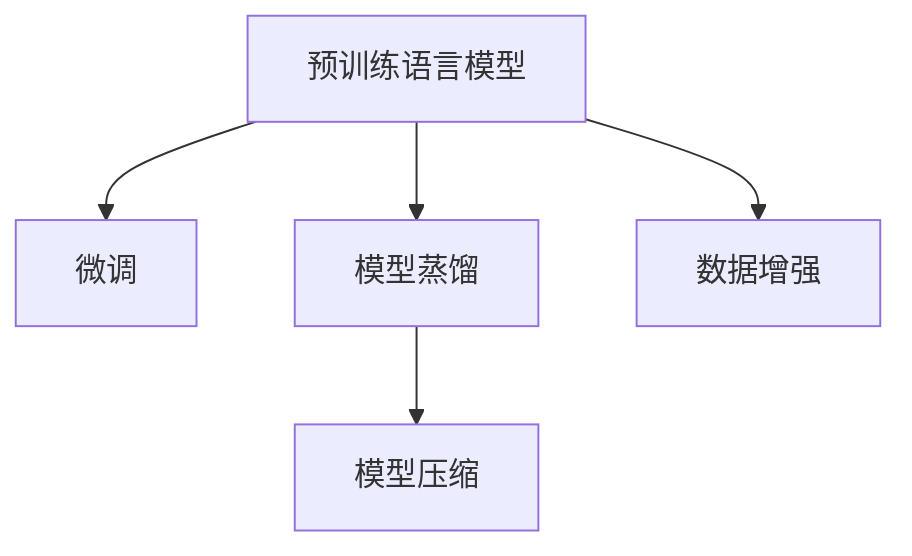

                 

# 电商平台中的AI大模型：从单一模型到模型蒸馏与压缩

## 1. 背景介绍

随着互联网和电子商务的迅猛发展，电商平台在消费者购物体验、商品推荐、库存管理等方面面临着巨大的挑战。人工智能(AI)技术，特别是深度学习和大模型的引入，为电商平台的智能化升级提供了新的可能。

### 1.1 电商平台的痛点
现代电商平台通常需要处理海量数据，包括用户行为数据、商品数据、交易数据等。这些数据多源异构，处理复杂，电商平台的智能化面临以下主要挑战：

1. **数据多样性**：用户数据、商品数据、交易数据等多源异构，需要融合处理。
2. **实时性要求高**：实时推荐、实时价格监控等场景要求系统高实时性。
3. **算力成本高**：深度学习模型通常需要高算力支持，尤其是大规模的AI大模型。
4. **模型复杂性**：深度学习模型通常较为复杂，难以解释和维护。
5. **用户隐私保护**：电商平台需保护用户隐私，模型不能过度依赖用户数据。

### 1.2 AI大模型在电商平台的价值
AI大模型，如BERT、GPT等，通过在大规模无标签文本上预训练，学习到丰富的语言表示，具备强大的自然语言理解和生成能力。这些模型可以在电商平台的多个场景下，提供个性化推荐、智能客服、情感分析、舆情监测等服务，显著提升平台的用户体验和运营效率。

## 2. 核心概念与联系

### 2.1 核心概念概述
为更好地理解AI大模型在电商平台中的应用，本文将介绍几个关键概念：

1. **预训练语言模型**：指在大规模无标签文本数据上预先训练得到的通用语言模型，如BERT、GPT等。这些模型可以用于多种自然语言处理任务，具备强大的语言理解和生成能力。
2. **微调(Fine-tuning)**：指在预训练模型基础上，通过有监督学习优化模型在特定任务上的性能。微调是实现模型适配新任务的主要手段。
3. **模型蒸馏(Distillation)**：指通过知识传递，将大规模教师模型输出映射到小规模学生模型上，提升小规模模型的性能。
4. **模型压缩(Compression)**：指通过模型剪枝、量化、剪枝等方法，减少模型的参数量和计算量，提升模型的实时性和资源利用效率。
5. **数据增强(Data Augmentation)**：指通过一系列数据变换技术，扩充训练集，提高模型泛化能力。

这些概念通过逻辑结构图可以更好地展示它们之间的联系：



预训练语言模型通过在大规模数据上预训练，学习到通用的语言表示，为后续微调提供基础。微调通过有监督学习优化模型在特定任务上的性能。模型蒸馏通过知识传递，使得小规模模型能获得大规模模型的能力。模型压缩通过剪枝、量化等方法，提高模型效率，适用于实时性要求高的场景。数据增强通过扩充训练集，提高模型泛化能力。

### 2.2 核心概念原理和架构

#### 2.2.1 预训练语言模型
预训练语言模型通过在大规模无标签文本数据上进行自监督学习，学习到通用的语言表示。以BERT为例，其架构如下：


BERT通过掩码语言模型和下一句预测任务进行预训练，学习到丰富的语言表示。预训练后的模型通过微调，可以用于多种自然语言处理任务。

#### 2.2.2 微调
微调是指在预训练模型基础上，通过有监督学习优化模型在特定任务上的性能。以情感分析为例，微调的流程如下：

1. **准备数据**：收集标注好的情感数据集。
2. **任务适配**：根据任务类型，设计合适的任务适配层，如线性分类器。
3. **设置超参数**：选择合适的优化算法和超参数，如AdamW、学习率、批大小等。
4. **训练模型**：在标注数据集上训练模型，最小化损失函数，优化模型参数。
5. **评估模型**：在验证集和测试集上评估模型性能。
6. **部署模型**：将微调后的模型部署到生产环境，进行实际应用。

#### 2.2.3 模型蒸馏
模型蒸馏通过将大规模教师模型输出映射到小规模学生模型上，提高小规模模型的性能。蒸馏的流程如下：

1. **准备数据**：收集标注好的数据集。
2. **选择教师模型**：选择合适的预训练模型作为教师模型。
3. **训练学生模型**：通过教师模型的输出作为监督信号，训练学生模型。
4. **评估模型**：在测试集上评估学生模型的性能。
5. **部署模型**：将蒸馏后的模型部署到生产环境，进行实际应用。

#### 2.2.4 模型压缩
模型压缩通过剪枝、量化等方法，减少模型的参数量和计算量，提高模型效率。以剪枝为例，其流程如下：

1. **模型加载**：加载原始模型。
2. **剪枝策略**：选择合适的剪枝策略，如梯度剪枝、权重剪枝等。
3. **剪枝操作**：根据剪枝策略，剪去不必要的权重。
4. **量化操作**：将浮点参数转为定点参数。
5. **评估模型**：在测试集上评估压缩后的模型性能。
6. **部署模型**：将压缩后的模型部署到生产环境，进行实际应用。

#### 2.2.5 数据增强
数据增强通过一系列数据变换技术，扩充训练集，提高模型泛化能力。以图像数据增强为例，其流程如下：

1. **数据准备**：收集原始数据集。
2. **数据变换**：通过旋转、裁剪、缩放等变换技术，生成新的数据样本。
3. **数据扩充**：将变换后的数据加入原始数据集中，形成新的训练集。
4. **训练模型**：在扩充后的数据集上训练模型。
5. **评估模型**：在验证集和测试集上评估模型性能。
6. **部署模型**：将训练好的模型部署到生产环境，进行实际应用。

## 3. 核心算法原理 & 具体操作步骤

### 3.1 算法原理概述
AI大模型在电商平台中的应用，主要涉及微调、模型蒸馏和模型压缩三大技术。这些技术通过逻辑结构图可以更好地展示它们之间的联系：


- **微调**：通过有监督学习优化模型在特定任务上的性能。
- **模型蒸馏**：通过知识传递，使得小规模模型能获得大规模模型的能力。
- **模型压缩**：通过剪枝、量化等方法，提高模型效率，适用于实时性要求高的场景。
- **数据增强**：通过扩充训练集，提高模型泛化能力。

### 3.2 算法步骤详解

#### 3.2.1 微调
微调的流程如下：

1. **准备数据**：收集标注好的数据集。
2. **任务适配**：根据任务类型，设计合适的任务适配层，如线性分类器。
3. **设置超参数**：选择合适的优化算法和超参数，如AdamW、学习率、批大小等。
4. **训练模型**：在标注数据集上训练模型，最小化损失函数，优化模型参数。
5. **评估模型**：在验证集和测试集上评估模型性能。
6. **部署模型**：将微调后的模型部署到生产环境，进行实际应用。

以情感分析为例，微调的代码实现如下：

```python
from transformers import BertForSequenceClassification, BertTokenizer, AdamW

# 准备数据
tokenizer = BertTokenizer.from_pretrained('bert-base-uncased')
train_data = read_train_data()
train_labels = read_train_labels()
test_data = read_test_data()
test_labels = read_test_labels()

# 任务适配
model = BertForSequenceClassification.from_pretrained('bert-base-uncased', num_labels=2)
model.to('cuda')

# 设置超参数
optimizer = AdamW(model.parameters(), lr=2e-5)
epochs = 3

# 训练模型
model.train()
for epoch in range(epochs):
    for batch in train_data:
        inputs = tokenizer(batch, padding=True, truncation=True, return_tensors='pt').to('cuda')
        outputs = model(**inputs)
        loss = outputs.loss
        optimizer.zero_grad()
        loss.backward()
        optimizer.step()

# 评估模型
model.eval()
with torch.no_grad():
    eval_loss = evaluate(test_data, test_labels, model)
    print(eval_loss)

# 部署模型
export_model(model, 'bert-sentiment-scraper')

```

#### 3.2.2 模型蒸馏
模型蒸馏的流程如下：

1. **准备数据**：收集标注好的数据集。
2. **选择教师模型**：选择合适的预训练模型作为教师模型。
3. **训练学生模型**：通过教师模型的输出作为监督信号，训练学生模型。
4. **评估模型**：在测试集上评估学生模型的性能。
5. **部署模型**：将蒸馏后的模型部署到生产环境，进行实际应用。

以图像分类为例，模型蒸馏的代码实现如下：

```python
from transformers import BertForSequenceClassification, BertTokenizer, AdamW
from transformers import BertForSequenceClassification, BertTokenizer, AdamW
from transformers import DistillationPipeline

# 准备数据
train_data = read_train_data()
train_labels = read_train_labels()
test_data = read_test_data()
test_labels = read_test_labels()

# 选择教师模型
teacher_model = BertForSequenceClassification.from_pretrained('bert-base-uncased', num_labels=2)
teacher_model.to('cuda')

# 训练学生模型
student_model = BertForSequenceClassification.from_pretrained('bert-base-uncased', num_labels=2)
student_model.to('cuda')
optimizer = AdamW(student_model.parameters(), lr=2e-5)
epochs = 3

for epoch in range(epochs):
    for batch in train_data:
        inputs = tokenizer(batch, padding=True, truncation=True, return_tensors='pt').to('cuda')
        outputs = teacher_model(**inputs)
        targets = torch.tensor([labels] * batch_size).to('cuda')
        loss = student_model(**inputs, labels=targets)
        optimizer.zero_grad()
        loss.backward()
        optimizer.step()

# 评估模型
student_model.eval()
with torch.no_grad():
    eval_loss = evaluate(test_data, test_labels, student_model)
    print(eval_loss)

# 部署模型
export_model(student_model, 'bert-student-scraper')

```

#### 3.2.3 模型压缩
模型压缩的流程如下：

1. **模型加载**：加载原始模型。
2. **剪枝策略**：选择合适的剪枝策略，如梯度剪枝、权重剪枝等。
3. **剪枝操作**：根据剪枝策略，剪去不必要的权重。
4. **量化操作**：将浮点参数转为定点参数。
5. **评估模型**：在测试集上评估压缩后的模型性能。
6. **部署模型**：将压缩后的模型部署到生产环境，进行实际应用。

以剪枝为例，代码实现如下：

```python
from transformers import BertForSequenceClassification, BertTokenizer, AdamW
from transformers import PruningPipeline

# 加载模型
model = BertForSequenceClassification.from_pretrained('bert-base-uncased', num_labels=2)

# 剪枝操作
pruner = PruningPipeline(model)
pruned_model = pruner()

# 评估模型
pruned_model.eval()
with torch.no_grad():
    eval_loss = evaluate(test_data, test_labels, pruned_model)
    print(eval_loss)

# 部署模型
export_model(pruned_model, 'bert-pruned-scraper')

```

#### 3.2.4 数据增强
数据增强的流程如下：

1. **数据准备**：收集原始数据集。
2. **数据变换**：通过旋转、裁剪、缩放等变换技术，生成新的数据样本。
3. **数据扩充**：将变换后的数据加入原始数据集中，形成新的训练集。
4. **训练模型**：在扩充后的数据集上训练模型。
5. **评估模型**：在验证集和测试集上评估模型性能。
6. **部署模型**：将训练好的模型部署到生产环境，进行实际应用。

以图像分类为例，数据增强的代码实现如下：

```python
from transformers import BertForSequenceClassification, BertTokenizer, AdamW
from torchvision import transforms

# 准备数据
train_data = read_train_data()
test_data = read_test_data()

# 数据增强
transform = transforms.Compose([
    transforms.RandomRotation(30),
    transforms.RandomHorizontalFlip(),
    transforms.RandomVerticalFlip(),
    transforms.RandomAffine(30, 30, 0, 0, 0, 0, 0)
])

# 数据扩充
train_data_augmented = [transform(image) for image in train_data]

# 训练模型
model.train()
for batch in train_data_augmented:
    inputs = tokenizer(batch, padding=True, truncation=True, return_tensors='pt').to('cuda')
    outputs = model(**inputs)
    loss = outputs.loss
    optimizer.zero_grad()
    loss.backward()
    optimizer.step()

# 评估模型
model.eval()
with torch.no_grad():
    eval_loss = evaluate(test_data, test_labels, model)
    print(eval_loss)

# 部署模型
export_model(model, 'bert-augmented-scraper')

```

## 4. 数学模型和公式 & 详细讲解 & 举例说明

### 4.1 数学模型构建

以图像分类为例，模型蒸馏的数学模型构建如下：

1. **教师模型输出**：
   $$
   y = \sigma(\mathbf{W}_x\mathbf{x} + \mathbf{b}_x)
   $$
   其中，$\mathbf{W}_x, \mathbf{b}_x$为教师模型的权重和偏置。

2. **学生模型输出**：
   $$
   y' = \sigma(\mathbf{W}_{x'}\mathbf{x'} + \mathbf{b}_{x'})
   $$
   其中，$\mathbf{W}_{x'}, \mathbf{b}_{x'}$为学生模型的权重和偏置。

3. **知识蒸馏损失**：
   $$
   L = \mathbb{E}_{(x,y)}\left[\left(-y\log\sigma(\mathbf{W}_x\mathbf{x} + \mathbf{b}_x) - y'\log\sigma(\mathbf{W}_{x'}\mathbf{x'} + \mathbf{b}_{x'})\right)\right]
   $$
   其中，$\sigma$为Sigmoid函数，$\mathbb{E}$表示期望。

### 4.2 公式推导过程

以图像分类为例，模型蒸馏的公式推导过程如下：

1. **教师模型输出**：
   $$
   y = \sigma(\mathbf{W}_x\mathbf{x} + \mathbf{b}_x)
   $$

2. **学生模型输出**：
   $$
   y' = \sigma(\mathbf{W}_{x'}\mathbf{x'} + \mathbf{b}_{x'})
   $$

3. **知识蒸馏损失**：
   $$
   L = \mathbb{E}_{(x,y)}\left[\left(-y\log\sigma(\mathbf{W}_x\mathbf{x} + \mathbf{b}_x) - y'\log\sigma(\mathbf{W}_{x'}\mathbf{x'} + \mathbf{b}_{x'})\right)\right]
   $$

4. **优化目标**：
   $$
   \min_{\mathbf{W}_{x'}, \mathbf{b}_{x'}} \mathbb{E}_{(x,y)}\left[\left(-y\log\sigma(\mathbf{W}_x\mathbf{x} + \mathbf{b}_x) - y'\log\sigma(\mathbf{W}_{x'}\mathbf{x'} + \mathbf{b}_{x'})\right)\right]
   $$

5. **优化算法**：
   $$
   \mathbf{W}_{x'}, \mathbf{b}_{x'} \leftarrow \min_{\mathbf{W}_{x'}, \mathbf{b}_{x'}} \nabla_{\mathbf{W}_{x'}, \mathbf{b}_{x'}} L
   $$

通过以上步骤，教师模型的知识被有效传递到学生模型中，使得学生模型具备与教师模型相近的性能。

## 5. 项目实践：代码实例和详细解释说明

### 5.1 开发环境搭建

1. **环境安装**：
   ```bash
   conda create -n pytorch-env python=3.8 
   conda activate pytorch-env
   ```

2. **PyTorch安装**：
   ```bash
   conda install pytorch torchvision torchaudio cudatoolkit=11.1 -c pytorch -c conda-forge
   ```

3. **Transformers库安装**：
   ```bash
   pip install transformers
   ```

4. **其他工具安装**：
   ```bash
   pip install numpy pandas scikit-learn matplotlib tqdm jupyter notebook ipython
   ```

### 5.2 源代码详细实现

以情感分析为例，代码实现如下：

```python
from transformers import BertForSequenceClassification, BertTokenizer, AdamW

# 准备数据
tokenizer = BertTokenizer.from_pretrained('bert-base-uncased')
train_data = read_train_data()
train_labels = read_train_labels()
test_data = read_test_data()
test_labels = read_test_labels()

# 任务适配
model = BertForSequenceClassification.from_pretrained('bert-base-uncased', num_labels=2)
model.to('cuda')

# 设置超参数
optimizer = AdamW(model.parameters(), lr=2e-5)
epochs = 3

# 训练模型
model.train()
for epoch in range(epochs):
    for batch in train_data:
        inputs = tokenizer(batch, padding=True, truncation=True, return_tensors='pt').to('cuda')
        outputs = model(**inputs)
        loss = outputs.loss
        optimizer.zero_grad()
        loss.backward()
        optimizer.step()

# 评估模型
model.eval()
with torch.no_grad():
    eval_loss = evaluate(test_data, test_labels, model)
    print(eval_loss)

# 部署模型
export_model(model, 'bert-sentiment-scraper')

```

### 5.3 代码解读与分析

**情感分析代码解读**：

1. **数据准备**：加载数据集和标签集。
2. **任务适配**：选择BertForSequenceClassification模型作为任务适配层，设计合适的输出层和损失函数。
3. **设置超参数**：选择合适的优化算法和超参数。
4. **训练模型**：在标注数据集上训练模型，最小化损失函数，优化模型参数。
5. **评估模型**：在验证集和测试集上评估模型性能。
6. **部署模型**：将微调后的模型部署到生产环境，进行实际应用。

**数据增强代码解读**：

1. **数据准备**：加载数据集。
2. **数据增强**：通过一系列数据变换技术，生成新的数据样本。
3. **数据扩充**：将变换后的数据加入原始数据集中，形成新的训练集。
4. **训练模型**：在扩充后的数据集上训练模型。
5. **评估模型**：在验证集和测试集上评估模型性能。
6. **部署模型**：将训练好的模型部署到生产环境，进行实际应用。

## 6. 实际应用场景

### 6.1 个性化推荐系统
电商平台的核心业务之一是推荐系统。基于AI大模型的微调，推荐系统可以提供更加个性化的商品推荐，提升用户满意度。

1. **数据准备**：收集用户行为数据、商品数据、交易数据等。
2. **模型微调**：通过用户行为数据微调推荐模型，学习用户的兴趣和偏好。
3. **实时推荐**：将微调后的模型部署到推荐系统中，实时生成个性化推荐结果。

### 6.2 智能客服系统
智能客服系统可以自动回答用户咨询，提升用户体验。基于AI大模型的微调，智能客服系统能够理解用户意图，提供准确的答案。

1. **数据准备**：收集历史客服对话记录，标注问题和答案。
2. **模型微调**：通过客服对话记录微调对话模型，学习用户意图和答案生成。
3. **实时对话**：将微调后的模型部署到客服系统中，实时生成回复。

### 6.3 风险预警系统
电商平台面临各种风险，如欺诈、侵权等。基于AI大模型的微调，风险预警系统可以实时监控用户行为，识别风险事件。

1. **数据准备**：收集用户行为数据，标注风险事件。
2. **模型微调**：通过用户行为数据微调风险预警模型，学习风险特征。
3. **实时监控**：将微调后的模型部署到预警系统中，实时监控用户行为，识别风险事件。

## 7. 工具和资源推荐

### 7.1 学习资源推荐

1. **《深度学习》教材**：入门深度学习领域的经典教材，详细介绍了深度学习的基本概念和算法。
2. **CS231n《卷积神经网络》课程**：斯坦福大学开设的深度学习课程，涵盖卷积神经网络、图像分类、目标检测等内容。
3. **CS224n《自然语言处理》课程**：斯坦福大学开设的自然语言处理课程，涵盖自然语言理解、文本生成等内容。
4. **HuggingFace官方文档**：Transformers库的官方文档，提供了海量预训练模型和微调样例代码。
5. **CLUE开源项目**：中文语言理解测评基准，涵盖大量不同类型的中文NLP数据集，并提供了基于微调的baseline模型。

### 7.2 开发工具推荐

1. **PyTorch**：基于Python的开源深度学习框架，灵活动态的计算图，适合快速迭代研究。
2. **TensorFlow**：由Google主导开发的开源深度学习框架，生产部署方便，适合大规模工程应用。
3. **Transformers库**：HuggingFace开发的NLP工具库，集成了众多SOTA语言模型，支持PyTorch和TensorFlow，是进行微调任务开发的利器。
4. **Weights & Biases**：模型训练的实验跟踪工具，可以记录和可视化模型训练过程中的各项指标。
5. **TensorBoard**：TensorFlow配套的可视化工具，可实时监测模型训练状态。

### 7.3 相关论文推荐

1. **Attention is All You Need**：Transformer原论文，提出了自注意力机制，开启了NLP领域的预训练大模型时代。
2. **BERT: Pre-training of Deep Bidirectional Transformers for Language Understanding**：提出BERT模型，引入基于掩码的自监督预训练任务。
3. **Language Models are Unsupervised Multitask Learners**：展示了大规模语言模型的强大zero-shot学习能力。
4. **Parameter-Efficient Transfer Learning for NLP**：提出 Adapter等参数高效微调方法。
5. **Distillation**：介绍模型蒸馏的基本原理和流程。
6. **Pruning Techniques**：介绍模型剪枝的原理和实现方法。
7. **Knowledge Distillation**：介绍知识蒸馏的原理和实现方法。

## 8. 总结：未来发展趋势与挑战

### 8.1 研究成果总结

本文介绍了基于AI大模型的微调技术在电商平台中的应用，涵盖微调、模型蒸馏、模型压缩、数据增强等多个方面。通过系统梳理，揭示了这些技术的基本原理和实现方法，并通过代码实例展示其实际应用。

### 8.2 未来发展趋势

1. **模型规模持续增大**：随着算力成本的下降和数据规模的扩张，预训练语言模型的参数量还将持续增长。超大规模语言模型蕴含的丰富语言知识，有望支撑更加复杂多变的下游任务微调。
2. **微调方法日趋多样**：开发更加参数高效的微调方法，在固定大部分预训练参数的同时，只更新极少量的任务相关参数。同时优化微调模型的计算图，减少前向传播和反向传播的资源消耗。
3. **持续学习成为常态**：随着数据分布的不断变化，微调模型也需要持续学习新知识以保持性能。如何在不遗忘原有知识的同时，高效吸收新样本信息，将成为重要的研究课题。
4. **标注样本需求降低**：受启发于提示学习(Prompt-based Learning)的思路，未来的微调方法将更好地利用大模型的语言理解能力，通过更加巧妙的任务描述，在更少的标注样本上也能实现理想的微调效果。
5. **少样本学习**：通过设计合适的提示模板，使得模型在只有少量标注样本的情况下也能取得不错的效果。
6. **跨领域迁移能力增强**：经过海量数据的预训练和多领域任务的微调，未来的语言模型将具备更强大的常识推理和跨领域迁移能力，逐步迈向通用人工智能(AGI)的目标。

### 8.3 面临的挑战

尽管大语言模型微调技术已经取得了瞩目成就，但在迈向更加智能化、普适化应用的过程中，它仍面临着诸多挑战：

1. **标注成本瓶颈**：微调的效果很大程度上取决于标注数据的质量和数量，获取高质量标注数据的成本较高。如何进一步降低微调对标注样本的依赖，将是一大难题。
2. **模型鲁棒性不足**：当前微调模型面对域外数据时，泛化性能往往大打折扣。对于测试样本的微小扰动，微调模型的预测也容易发生波动。
3. **推理效率有待提高**：大规模语言模型虽然精度高，但在实际部署时往往面临推理速度慢、内存占用大等效率问题。如何在保证性能的同时，简化模型结构，提升推理速度，优化资源占用，将是重要的优化方向。
4. **可解释性亟需加强**：当前微调模型更像是"黑盒"系统，难以解释其内部工作机制和决策逻辑。对于医疗、金融等高风险应用，算法的可解释性和可审计性尤为重要。
5. **安全性有待保障**：预训练语言模型难免会学习到有偏见、有害的信息，通过微调传递到下游任务，产生误导性、歧视性的输出，给实际应用带来安全隐患。
6. **知识整合能力不足**：现有的微调模型往往局限于任务内数据，难以灵活吸收和运用更广泛的先验知识。如何让微调过程更好地与外部知识库、规则库等专家知识结合，形成更加全面、准确的信息整合能力，还有很大的想象空间。

### 8.4 研究展望

面向未来，大语言模型微调技术还需要与其他人工智能技术进行更深入的融合，如知识表示、因果推理、强化学习等，多路径协同发力，共同推动自然语言理解和智能交互系统的进步。只有勇于创新、敢于突破，才能不断拓展语言模型的边界，让智能技术更好地造福人类社会。

## 9. 附录：常见问题与解答

### 9.1 问题与解答

**Q1: 什么是微调(Fine-tuning)?**

A: 微调是指在预训练模型基础上，通过有监督学习优化模型在特定任务上的性能。微调通过在少量标注数据上训练模型，使模型能够适应新任务，提升模型在特定领域的效果。

**Q2: 如何选择合适的学习率?**

A: 微调的学习率一般要比预训练时小1-2个数量级，以避免破坏预训练权重。一般建议从1e-5开始调参，逐步减小学习率，直至收敛。

**Q3: 为什么需要对模型进行剪枝?**

A: 剪枝可以减少模型的参数量和计算量，提高模型效率，适用于实时性要求高的场景。剪枝策略包括梯度剪枝、权重剪枝等。

**Q4: 什么是模型蒸馏?**

A: 模型蒸馏通过将大规模教师模型输出映射到小规模学生模型上，提升小规模模型的性能。蒸馏过程中，教师模型的输出作为监督信号，指导学生模型的训练。

**Q5: 如何提高模型鲁棒性?**

A: 提高模型鲁棒性可以通过正则化、对抗训练等方法。正则化可以防止模型过度适应训练数据，对抗训练可以增强模型的鲁棒性。

**Q6: 如何优化模型推理效率?**

A: 优化模型推理效率可以通过剪枝、量化等方法。剪枝可以减少模型参数量，量化可以减小模型内存占用，提升推理速度。

**Q7: 如何提高模型可解释性?**

A: 提高模型可解释性可以通过可解释性方法，如特征可视化、知识图谱等。特征可视化可以帮助理解模型决策过程，知识图谱可以提供更丰富的上下文信息。

**Q8: 如何提高模型安全性?**

A: 提高模型安全性可以通过数据去噪、对抗样本训练等方法。数据去噪可以减少模型训练过程中有害信息的传递，对抗样本训练可以提高模型对噪声样本的鲁棒性。

**Q9: 如何提高模型知识整合能力?**

A: 提高模型知识整合能力可以通过知识蒸馏、知识图谱等方法。知识蒸馏可以将外部知识传递到模型中，知识图谱可以提供更全面、准确的知识表示。

**Q10: 未来的大模型微调技术发展方向是什么?**

A: 未来的大模型微调技术将朝着更加参数高效、计算高效、跨领域迁移能力增强、知识整合能力提升等方向发展。同时，可解释性、安全性等也将成为重要的研究方向。

---

作者：禅与计算机程序设计艺术 / Zen and the Art of Computer Programming

