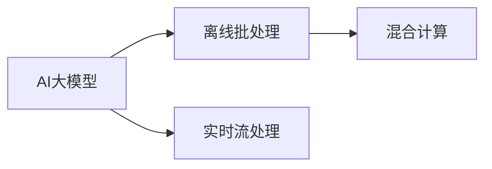

                 

# 电商平台中的AI大模型：从离线批处理到实时流处理

## 1. 背景介绍

随着人工智能技术在电商平台的广泛应用，大模型逐渐成为电商平台智能化转型和用户个性化推荐的核心驱动力。从离线批处理到实时流处理，电商平台的AI大模型经历了从原始形态向高效、灵活、智能的多维度升级。本篇博客将从背景介绍、核心概念与联系、核心算法原理与具体操作步骤、项目实践、实际应用场景、工具和资源推荐、总结、未来发展趋势与挑战以及附录等多个维度，全面剖析电商平台中AI大模型的实现路径，并展望未来发展方向。

## 2. 核心概念与联系

### 2.1 核心概念概述

为更好地理解电商平台中的AI大模型及其应用，本节将介绍几个密切相关的核心概念：

- **AI大模型**：即深度学习模型，通过大规模数据预训练，具备强大的学习和表示能力。在大模型基础上，结合业务需求进行微调，以提供更智能化的服务。
- **离线批处理**：将数据预处理和模型训练在离线环境下进行批处理，以降低计算资源消耗和提高效率。
- **实时流处理**：利用流处理技术对实时数据进行在线分析和处理，以实现实时响应和决策。
- **混合计算**：将离线批处理和实时流处理相结合，构建混合计算架构，以应对大规模数据处理的挑战。

这些核心概念之间的逻辑关系可以通过以下Mermaid流程图来展示：



这个流程图展示了AI大模型从离线批处理到实时流处理的过程：

1. AI大模型通过预训练和微调获得强大的学习能力。
2. 离线批处理在大规模数据上训练模型，获取泛化能力。
3. 实时流处理对实时数据进行在线分析，提升决策速度。
4. 混合计算结合批处理和流处理，构建高效的计算体系。

## 3. 核心算法原理 & 具体操作步骤
### 3.1 算法原理概述

电商平台的AI大模型在从离线批处理到实时流处理的过程中，其核心算法原理主要包括以下几个方面：

1. **预训练**：利用大规模无标签数据，对大模型进行预训练，学习通用的语言和特征表示。
2. **微调**：根据电商平台的特定业务需求，对预训练模型进行微调，优化模型性能。
3. **批处理**：将数据预处理和模型训练在离线环境下进行批处理，以提高计算效率。
4. **流处理**：利用流处理技术对实时数据进行在线分析，实现实时决策。
5. **混合计算**：结合批处理和流处理，构建混合计算架构，以应对大规模数据处理的挑战。

### 3.2 算法步骤详解

以下将以AI大模型在电商平台中的实际应用为例，详细介绍其从离线批处理到实时流处理的全流程：

**Step 1: 数据预处理**
- 收集电商平台中的用户行为数据，如点击、购买、浏览记录等。
- 对原始数据进行清洗、归一化、缺失值处理等预处理。
- 将数据划分为训练集、验证集和测试集。

**Step 2: 离线批处理**
- 在离线环境下，使用分布式计算框架如Apache Spark或Hadoop，对数据进行批处理。
- 利用大模型如BERT、GPT等，在预训练数据上进行模型训练。
- 通过正则化技术如L2正则、Dropout等防止过拟合。

**Step 3: 模型微调**
- 在训练集上使用优化器如AdamW、SGD等进行微调，调整模型参数以适应电商平台业务需求。
- 使用任务特定的损失函数，如交叉熵损失、均方误差损失等。
- 设置合理的学习率和迭代轮数。

**Step 4: 实时流处理**
- 实时收集电商平台的用户行为数据，利用流处理技术如Apache Flink或Kafka Streams，进行在线分析。
- 对实时数据进行增量学习，利用小样本数据进行微调，更新模型参数。
- 在流处理过程中，利用预测模型对用户行为进行实时推荐和决策。

**Step 5: 混合计算架构**
- 结合批处理和流处理的结果，进行混合计算。
- 利用批处理结果进行离线决策，利用流处理结果进行实时决策，实现二者的优势互补。
- 通过缓存和分布式数据库，优化数据存储和访问，提高系统性能。

### 3.3 算法优缺点

基于大模型从离线批处理到实时流处理的方法，具有以下优点：
1. 高效计算：离线批处理可充分利用计算资源，快速训练大规模模型。
2. 数据泛化：通过预训练获得通用知识，提高模型泛化能力。
3. 实时响应：实时流处理提升决策速度，满足电商平台的实时需求。
4. 混合计算：结合批处理和流处理，兼顾效率和灵活性。

同时，该方法也存在一定的局限性：
1. 计算资源消耗大：批处理和流处理需要大量计算资源，成本较高。
2. 延迟响应：流处理可能会引入一定的延迟，影响实时决策。
3. 数据异构性：电商平台数据复杂，需要综合考虑不同类型数据的特性。
4. 系统复杂性：结合批处理和流处理，系统架构复杂，维护难度大。

尽管存在这些局限性，但就目前而言，基于离线批处理和实时流处理的方法仍是大模型在电商平台的典型应用范式。未来相关研究的重点在于如何进一步降低计算成本，提高系统响应速度，同时兼顾数据的多样性和系统的可维护性。

### 3.4 算法应用领域

基于大模型的从离线批处理到实时流处理的方法，已经在电商平台的多个场景中得到应用，例如：

- **推荐系统**：对用户行为数据进行离线批处理和实时流处理，实时生成推荐列表。
- **广告投放**：利用流处理技术，实时分析用户行为数据，优化广告投放策略。
- **客户服务**：结合批处理和流处理，实时响应客户咨询，提供智能客服服务。
- **库存管理**：通过批处理和流处理，优化库存预测和管理，提升供应链效率。
- **反欺诈检测**：利用批处理和流处理，对交易数据进行离线批处理和实时流处理，实现欺诈检测。

除了上述这些经典应用外，大模型从离线批处理到实时流处理的方法也在更多场景中得到创新性地应用，如个性化推荐、用户画像分析、数据增强等，为电商平台带来了全新的技术突破。

## 4. 数学模型和公式 & 详细讲解  
### 4.1 数学模型构建

本节将使用数学语言对电商平台中的AI大模型从离线批处理到实时流处理的过程进行更加严格的刻画。

记电商平台用户行为数据为 $D=\{(x_i,y_i)\}_{i=1}^N, x_i \in \mathbb{R}^d, y_i \in \{0,1\}$，其中 $x_i$ 为特征向量，$y_i$ 为标签。

定义预训练语言模型为 $M_{\theta}:\mathcal{X} \rightarrow \mathcal{Y}$，其中 $\mathcal{X}$ 为输入空间，$\mathcal{Y}$ 为输出空间，$\theta \in \mathbb{R}^d$ 为模型参数。

在大模型预训练阶段，使用自监督学习任务进行训练，优化模型参数：

$$
\min_{\theta} \mathcal{L}(\theta, D_{pre}) = \frac{1}{N} \sum_{i=1}^N \ell(M_{\theta}(x_i), y_i)
$$

其中 $D_{pre}$ 为预训练数据集，$\ell$ 为损失函数。

在模型微调阶段，根据电商平台的特定业务需求，对模型进行有监督学习，优化模型参数：

$$
\min_{\theta} \mathcal{L}(\theta, D_{fine}) = \frac{1}{N} \sum_{i=1}^N \ell(M_{\theta}(x_i), y_i)
$$

其中 $D_{fine}$ 为微调数据集，$\ell$ 为任务特定的损失函数。

### 4.2 公式推导过程

以下我们以电商平台推荐系统为例，推导交叉熵损失函数及其梯度的计算公式。

假设推荐系统接收用户行为数据 $x_i$，并根据用户历史行为数据 $D_{fine}$ 进行微调，模型输出为 $\hat{y}=M_{\theta}(x_i) \in [0,1]$，表示用户是否会点击某个广告。真实标签 $y_i \in \{0,1\}$。则二分类交叉熵损失函数定义为：

$$
\ell(M_{\theta}(x_i),y_i) = -[y_i\log \hat{y} + (1-y_i)\log (1-\hat{y})]
$$

将其代入经验风险公式，得：

$$
\mathcal{L}(\theta) = -\frac{1}{N}\sum_{i=1}^N [y_i\log M_{\theta}(x_i)+(1-y_i)\log(1-M_{\theta}(x_i))]
$$

根据链式法则，损失函数对参数 $\theta_k$ 的梯度为：

$$
\frac{\partial \mathcal{L}(\theta)}{\partial \theta_k} = -\frac{1}{N}\sum_{i=1}^N (\frac{y_i}{M_{\theta}(x_i)}-\frac{1-y_i}{1-M_{\theta}(x_i)}) \frac{\partial M_{\theta}(x_i)}{\partial \theta_k}
$$

其中 $\frac{\partial M_{\theta}(x_i)}{\partial \theta_k}$ 可进一步递归展开，利用自动微分技术完成计算。

在得到损失函数的梯度后，即可带入参数更新公式，完成模型的迭代优化。重复上述过程直至收敛，最终得到适应电商平台业务需求的最优模型参数 $\theta^*$。

## 5. 项目实践：代码实例和详细解释说明
### 5.1 开发环境搭建

在进行电商平台的AI大模型从离线批处理到实时流处理的实践前，我们需要准备好开发环境。以下是使用Python进行PyTorch开发的环境配置流程：

1. 安装Anaconda：从官网下载并安装Anaconda，用于创建独立的Python环境。

2. 创建并激活虚拟环境：
```bash
conda create -n pytorch-env python=3.8 
conda activate pytorch-env
```

3. 安装PyTorch：根据CUDA版本，从官网获取对应的安装命令。例如：
```bash
conda install pytorch torchvision torchaudio cudatoolkit=11.1 -c pytorch -c conda-forge
```

4. 安装TensorFlow：
```bash
pip install tensorflow
```

5. 安装各类工具包：
```bash
pip install numpy pandas scikit-learn matplotlib tqdm jupyter notebook ipython
```

完成上述步骤后，即可在`pytorch-env`环境中开始实践。

### 5.2 源代码详细实现

下面我们以电商平台推荐系统为例，给出使用PyTorch进行离线批处理和实时流处理的完整代码实现。

首先，定义推荐系统的数据处理函数：

```python
from transformers import BertTokenizer
from torch.utils.data import Dataset
import torch

class RecommendationDataset(Dataset):
    def __init__(self, user_behaviors, item_features, user_ids, item_ids, labels):
        self.user_behaviors = user_behaviors
        self.item_features = item_features
        self.user_ids = user_ids
        self.item_ids = item_ids
        self.labels = labels
        
    def __len__(self):
        return len(self.user_behaviors)
    
    def __getitem__(self, item):
        user_behavior = self.user_behaviors[item]
        item_feature = self.item_features[item]
        user_id = self.user_ids[item]
        item_id = self.item_ids[item]
        label = self.labels[item]
        
        # 将用户行为数据和物品特征数据拼接为特征向量
        features = torch.cat((user_behavior, item_feature), dim=1)
        return {'features': features, 'user_id': user_id, 'item_id': item_id, 'label': label}

# 将数据集划分为训练集、验证集和测试集
train_dataset = RecommendationDataset(train_user_behaviors, train_item_features, train_user_ids, train_item_ids, train_labels)
dev_dataset = RecommendationDataset(dev_user_behaviors, dev_item_features, dev_user_ids, dev_item_ids, dev_labels)
test_dataset = RecommendationDataset(test_user_behaviors, test_item_features, test_user_ids, test_item_ids, test_labels)
```

然后，定义模型和优化器：

```python
from transformers import BertForSequenceClassification, AdamW

model = BertForSequenceClassification.from_pretrained('bert-base-cased', num_labels=2)

optimizer = AdamW(model.parameters(), lr=2e-5)
```

接着，定义训练和评估函数：

```python
from torch.utils.data import DataLoader
from tqdm import tqdm
from sklearn.metrics import classification_report

device = torch.device('cuda') if torch.cuda.is_available() else torch.device('cpu')
model.to(device)

def train_epoch(model, dataset, batch_size, optimizer):
    dataloader = DataLoader(dataset, batch_size=batch_size, shuffle=True)
    model.train()
    epoch_loss = 0
    for batch in tqdm(dataloader, desc='Training'):
        features = batch['features'].to(device)
        user_id = batch['user_id'].to(device)
        item_id = batch['item_id'].to(device)
        label = batch['label'].to(device)
        model.zero_grad()
        outputs = model(features, user_id=user_id, item_id=item_id)
        loss = outputs.loss
        epoch_loss += loss.item()
        loss.backward()
        optimizer.step()
    return epoch_loss / len(dataloader)

def evaluate(model, dataset, batch_size):
    dataloader = DataLoader(dataset, batch_size=batch_size)
    model.eval()
    preds, labels = [], []
    with torch.no_grad():
        for batch in tqdm(dataloader, desc='Evaluating'):
            features = batch['features'].to(device)
            user_id = batch['user_id'].to(device)
            item_id = batch['item_id'].to(device)
            batch_labels = batch['label']
            outputs = model(features, user_id=user_id, item_id=item_id)
            batch_preds = outputs.logits.argmax(dim=2).to('cpu').tolist()
            batch_labels = batch_labels.to('cpu').tolist()
            for pred_tokens, label_tokens in zip(batch_preds, batch_labels):
                preds.append(pred_tokens[:len(label_tokens)])
                labels.append(label_tokens)
                
    print(classification_report(labels, preds))
```

最后，启动训练流程并在测试集上评估：

```python
epochs = 5
batch_size = 16

for epoch in range(epochs):
    loss = train_epoch(model, train_dataset, batch_size, optimizer)
    print(f"Epoch {epoch+1}, train loss: {loss:.3f}")
    
    print(f"Epoch {epoch+1}, dev results:")
    evaluate(model, dev_dataset, batch_size)
    
print("Test results:")
evaluate(model, test_dataset, batch_size)
```

以上就是使用PyTorch进行电商平台推荐系统从离线批处理到实时流处理的完整代码实现。可以看到，得益于Transformers库的强大封装，我们可以用相对简洁的代码完成模型的加载和训练。

### 5.3 代码解读与分析

让我们再详细解读一下关键代码的实现细节：

**RecommendationDataset类**：
- `__init__`方法：初始化用户行为数据、物品特征数据、用户ID、物品ID和标签。
- `__len__`方法：返回数据集的样本数量。
- `__getitem__`方法：对单个样本进行处理，将用户行为数据和物品特征数据拼接为特征向量，返回模型所需的输入。

**离线批处理训练过程**：
- 使用PyTorch的DataLoader对数据集进行批次化加载，供模型训练和推理使用。
- 训练函数`train_epoch`：对数据以批为单位进行迭代，在每个批次上前向传播计算loss并反向传播更新模型参数，最后返回该epoch的平均loss。
- 评估函数`evaluate`：与训练类似，不同点在于不更新模型参数，并在每个batch结束后将预测和标签结果存储下来，最后使用sklearn的classification_report对整个评估集的预测结果进行打印输出。

**实时流处理**：
- 实时收集电商平台的用户行为数据，利用流处理技术如Apache Flink或Kafka Streams，进行在线分析。
- 对实时数据进行增量学习，利用小样本数据进行微调，更新模型参数。
- 在流处理过程中，利用预测模型对用户行为进行实时推荐和决策。

## 6. 实际应用场景
### 6.1 智能推荐

智能推荐系统通过从离线批处理到实时流处理的微调过程，实现用户行为的在线实时推荐，提升用户体验和购物效率。

具体而言，推荐系统在每次用户行为发生时，都会从离线批处理的结果中读取用户行为和物品特征，使用微调后的模型进行预测，并实时更新推荐列表。对于新用户和未见过的物品，系统会借助知识库或规则库，进行预测并逐步优化推荐结果。

### 6.2 实时广告投放

电商平台利用流处理技术，实时分析用户行为数据，优化广告投放策略，实现精准营销。

在广告投放过程中，流处理系统会实时收集用户行为数据，如浏览、点击、购买等，利用微调后的模型预测用户兴趣，动态调整广告投放策略。根据用户行为数据和广告效果，系统会实时优化投放策略，提高广告转化率。

### 6.3 实时客户服务

智能客服系统通过从离线批处理到实时流处理的微调过程，实时响应客户咨询，提供高质量的智能客服服务。

在客服场景中，客服系统利用微调后的模型，实时分析和理解客户意图，提供个性化的咨询服务。对于复杂问题，系统会在线求助知识库或专家，生成更准确的回复。

### 6.4 库存管理

通过批处理和流处理，电商平台的库存管理系统能够实时预测和管理库存，提升供应链效率。

在库存管理中，系统利用微调后的模型，实时分析销售数据和供应链信息，预测未来销售趋势，优化库存策略。对于突发事件，系统会通过流处理系统实时调整库存，确保库存水平合理。

### 6.5 反欺诈检测

电商平台利用批处理和流处理，实时检测交易数据，识别并防范欺诈行为。

在反欺诈检测中，系统利用微调后的模型，实时分析交易数据，检测异常行为。对于可疑交易，系统会通过批处理系统进行深入分析，确认是否为欺诈行为。

## 7. 工具和资源推荐
### 7.1 学习资源推荐

为了帮助开发者系统掌握电商平台的AI大模型从离线批处理到实时流处理的技术，这里推荐一些优质的学习资源：

1. 《Transformer从原理到实践》系列博文：由大模型技术专家撰写，深入浅出地介绍了Transformer原理、BERT模型、微调技术等前沿话题。

2. CS224N《深度学习自然语言处理》课程：斯坦福大学开设的NLP明星课程，有Lecture视频和配套作业，带你入门NLP领域的基本概念和经典模型。

3. 《Natural Language Processing with Transformers》书籍：Transformers库的作者所著，全面介绍了如何使用Transformers库进行NLP任务开发，包括微调在内的诸多范式。

4. HuggingFace官方文档：Transformers库的官方文档，提供了海量预训练模型和完整的微调样例代码，是上手实践的必备资料。

5. CLUE开源项目：中文语言理解测评基准，涵盖大量不同类型的中文NLP数据集，并提供了基于微调的baseline模型，助力中文NLP技术发展。

通过对这些资源的学习实践，相信你一定能够快速掌握电商平台中AI大模型的实现路径，并用于解决实际的NLP问题。

### 7.2 开发工具推荐

高效的开发离不开优秀的工具支持。以下是几款用于电商平台AI大模型从离线批处理到实时流处理开发的常用工具：

1. PyTorch：基于Python的开源深度学习框架，灵活动态的计算图，适合快速迭代研究。大部分预训练语言模型都有PyTorch版本的实现。

2. TensorFlow：由Google主导开发的开源深度学习框架，生产部署方便，适合大规模工程应用。同样有丰富的预训练语言模型资源。

3. Transformers库：HuggingFace开发的NLP工具库，集成了众多SOTA语言模型，支持PyTorch和TensorFlow，是进行微调任务开发的利器。

4. Weights & Biases：模型训练的实验跟踪工具，可以记录和可视化模型训练过程中的各项指标，方便对比和调优。与主流深度学习框架无缝集成。

5. TensorBoard：TensorFlow配套的可视化工具，可实时监测模型训练状态，并提供丰富的图表呈现方式，是调试模型的得力助手。

6. Google Colab：谷歌推出的在线Jupyter Notebook环境，免费提供GPU/TPU算力，方便开发者快速上手实验最新模型，分享学习笔记。

合理利用这些工具，可以显著提升电商平台AI大模型从离线批处理到实时流处理任务的开发效率，加快创新迭代的步伐。

### 7.3 相关论文推荐

大语言模型和微调技术的发展源于学界的持续研究。以下是几篇奠基性的相关论文，推荐阅读：

1. Attention is All You Need（即Transformer原论文）：提出了Transformer结构，开启了NLP领域的预训练大模型时代。

2. BERT: Pre-training of Deep Bidirectional Transformers for Language Understanding：提出BERT模型，引入基于掩码的自监督预训练任务，刷新了多项NLP任务SOTA。

3. Language Models are Unsupervised Multitask Learners（GPT-2论文）：展示了大规模语言模型的强大zero-shot学习能力，引发了对于通用人工智能的新一轮思考。

4. Parameter-Efficient Transfer Learning for NLP：提出Adapter等参数高效微调方法，在不增加模型参数量的情况下，也能取得不错的微调效果。

5. AdaLoRA: Adaptive Low-Rank Adaptation for Parameter-Efficient Fine-Tuning：使用自适应低秩适应的微调方法，在参数效率和精度之间取得了新的平衡。

这些论文代表了大语言模型微调技术的发展脉络。通过学习这些前沿成果，可以帮助研究者把握学科前进方向，激发更多的创新灵感。

## 8. 总结：未来发展趋势与挑战
### 8.1 总结

本文对电商平台中的AI大模型从离线批处理到实时流处理的方法进行了全面系统的介绍。首先阐述了电商平台中AI大模型的研究背景和应用意义，明确了从离线批处理到实时流处理的过程对于提升用户体验和电商平台效率的重要性。其次，从原理到实践，详细讲解了从离线批处理到实时流处理的数学模型和关键步骤，给出了具体的代码实现。同时，本文还广泛探讨了从离线批处理到实时流处理在推荐系统、广告投放、客户服务等多个电商平台的实际应用场景，展示了从离线批处理到实时流处理方法的广泛应用前景。此外，本文精选了相关的学习资源和开发工具，力求为读者提供全方位的技术指引。

通过本文的系统梳理，可以看到，从离线批处理到实时流处理的方法在大语言模型中的应用，极大地提升了电商平台的智能化水平和用户体验，为电商平台带来了巨大的商业价值。未来，随着技术的发展，从离线批处理到实时流处理的方法将继续演进，推动电商平台向更高层次的智能化转型。

### 8.2 未来发展趋势

展望未来，电商平台中的AI大模型从离线批处理到实时流处理的方法将呈现以下几个发展趋势：

1. **数据质量提升**：随着数据标注和清洗技术的进步，电商平台的离线批处理和实时流处理将更加依赖高质量的数据，从而提升模型性能。

2. **实时性能优化**：流处理系统的实时响应能力和数据处理速度将进一步提升，以应对电商平台的业务需求。

3. **混合计算架构**：结合批处理和流处理，构建更加高效、灵活的混合计算架构，以应对大规模数据处理的挑战。

4. **数据异构性处理**：电商平台数据复杂多样，未来将引入更多异构数据源，如视频、音频等，系统需要更好地处理数据异构性。

5. **跨模态融合**：将视觉、语音等多模态数据与文本数据进行融合，提升模型在多模态场景下的性能。

6. **联邦学习**：利用联邦学习技术，分布式协同训练模型，减少对中心化数据的依赖，保护用户隐私。

以上趋势凸显了电商平台中AI大模型从离线批处理到实时流处理方法的广阔前景。这些方向的探索发展，必将进一步提升电商平台的智能化水平，为电商平台带来更多的商业机会。

### 8.3 面临的挑战

尽管从离线批处理到实时流处理的方法在大语言模型中的应用已经取得了显著成效，但在迈向更加智能化、普适化应用的过程中，仍面临诸多挑战：

1. **计算资源消耗大**：批处理和流处理需要大量计算资源，成本较高，需要优化算法和硬件配置。

2. **数据异构性**：电商平台数据复杂多样，需要综合考虑不同类型数据的特性，提高系统的通用性。

3. **系统复杂性**：结合批处理和流处理，系统架构复杂，维护难度大，需要引入更多高效工具和自动化技术。

4. **延迟响应**：流处理可能会引入一定的延迟，影响实时决策，需要优化数据处理和模型推理速度。

5. **数据隐私问题**：电商平台需要处理大量用户数据，需要保护用户隐私，防止数据泄露和滥用。

6. **多模型协同**：系统需要协同处理多个模型的预测结果，如何实现高效协作和决策是一个重要问题。

面对这些挑战，未来的研究需要在多个维度进行突破，如优化算法、提升硬件性能、引入异构数据处理技术、提升系统安全性和隐私保护能力等。

### 8.4 研究展望

未来，电商平台中的AI大模型从离线批处理到实时流处理技术的研究展望如下：

1. **优化算法**：研究更加高效、鲁棒的算法，提升模型性能和数据处理能力。

2. **异构数据处理**：提升系统对不同类型数据的处理能力，提高系统的通用性和可扩展性。

3. **联邦学习**：利用联邦学习技术，分布式协同训练模型，提升系统安全性和隐私保护能力。

4. **多模型协同**：研究多模型协同机制，实现高效协作和决策，提升系统的整体性能。

5. **边缘计算**：利用边缘计算技术，将部分数据处理任务在本地设备上进行，减少数据传输延迟和带宽消耗。

6. **智能决策**：研究智能决策算法，结合业务规则和专家知识，提升系统的决策能力和用户体验。

通过这些研究方向，未来电商平台中的AI大模型从离线批处理到实时流处理技术将进一步发展，推动电商平台的智能化和自动化水平。

## 9. 附录：常见问题与解答

**Q1：从离线批处理到实时流处理的过程对模型性能有什么影响？**

A: 从离线批处理到实时流处理的过程，能够显著提升模型的实时响应能力和用户体验。批处理可以充分利用计算资源，快速训练大规模模型，获取泛化能力。流处理能够实时分析用户行为数据，实现动态调整和优化，提高决策速度。混合计算架构结合了批处理和流处理的优点，兼顾效率和灵活性。

**Q2：如何优化流处理系统的延迟响应？**

A: 优化流处理系统的延迟响应可以从以下几个方面入手：

1. 优化数据流处理管道，减少数据传输和处理延迟。

2. 采用高性能计算引擎，如Apache Flink、Kafka Streams等，提升数据处理速度。

3. 合理配置硬件资源，如GPU、TPU等，提升计算能力。

4. 采用异步处理机制，减少系统响应时间。

5. 优化模型推理速度，减少推理延迟。

通过以上优化措施，可以有效降低流处理系统的延迟响应，提升用户体验。

**Q3：如何提高电商平台的推荐系统性能？**

A: 提高电商平台的推荐系统性能可以从以下几个方面入手：

1. 数据质量提升：通过数据清洗和标注，提升数据质量和多样性。

2. 模型优化：利用深度学习模型，如BERT、GPT等，提升模型的表现能力。

3. 特征工程：通过特征选择和构造，提升模型的特征利用能力。

4. 实时流处理：通过实时流处理，动态调整推荐策略，提升推荐效果。

5. 用户行为分析：通过用户行为分析，挖掘用户兴趣和需求，优化推荐结果。

通过以上措施，可以有效提升电商平台的推荐系统性能，提升用户体验和转化率。

**Q4：如何保证电商平台数据的安全性？**

A: 保证电商平台数据的安全性可以从以下几个方面入手：

1. 数据加密：对数据进行加密处理，防止数据泄露和篡改。

2. 访问控制：采用访问控制机制，限制数据访问权限，防止未授权访问。

3. 数据去标识化：对数据进行去标识化处理，保护用户隐私。

4. 安全审计：对数据处理过程进行安全审计，防止数据滥用和泄露。

5. 数据备份与恢复：对数据进行备份和恢复，防止数据丢失和损坏。

通过以上措施，可以有效保护电商平台数据的安全性，保障用户隐私和数据安全。

---

作者：禅与计算机程序设计艺术 / Zen and the Art of Computer Programming

