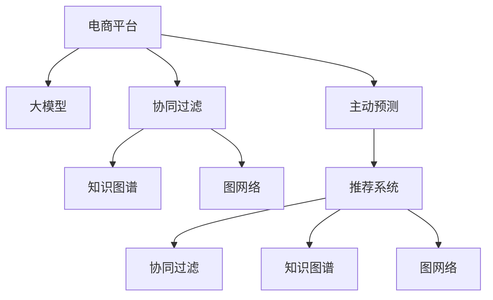

                 

# 电商平台中的AI大模型：从被动响应到主动预测

> 关键词：电商平台, 大模型, 主动预测, 深度学习, 推荐系统, 协同过滤, 图网络, 知识图谱

## 1. 背景介绍

### 1.1 问题由来
近年来，随着电子商务的快速发展，各大电商平台日均交易量急剧增长。如何精准预测用户行为，提升销售转化率，优化库存管理，已成为电商平台运营管理的重要问题。传统的推荐系统主要依赖协同过滤(Collaborative Filtering)技术，通过分析用户历史行为数据，预测用户未来可能感兴趣的商品。但这种方法往往对数据稀疏和冷启动用户处理能力不足，难以适应复杂多变的市场环境。

与此同时，深度学习技术在大数据处理和特征建模方面展现出了显著的优势。特别是在自然语言处理(NLP)和计算机视觉领域，预训练大模型凭借其在处理海量无标签数据和提取深层次语义特征方面的卓越能力，逐步成为AI应用的前沿技术。电商平台能否借鉴这些前沿技术，实现从被动响应到主动预测的跨越，成为当下研究的热点问题。

### 1.2 问题核心关键点
本文聚焦于如何利用深度学习技术，构建高性能的电商平台AI预测系统，以主动预测用户行为，提升用户体验和电商运营效率。具体来说，我们将从以下几个核心关键点出发：

1. 如何在大模型上进行电商特定任务的预训练。
2. 如何设计有效的电商任务适配层，使大模型能够高效地处理电商数据。
3. 如何利用知识图谱等外部知识，增强大模型的语义理解能力。
4. 如何构建高效的主动预测模型，提升电商推荐和预测的精度和实时性。

这些问题不仅具有理论研究价值，而且对电商平台的实际运营具有重要的指导意义。本文将全面系统地介绍相关技术，并通过实例分析，展示其应用效果。

## 2. 核心概念与联系

### 2.1 核心概念概述

为更好地理解电商平台AI大模型的主动预测方法，本节将介绍几个密切相关的核心概念：

- 电商平台：指集商品展示、交易结算、客户服务于一体的在线购物平台。常见的电商平台包括淘宝、京东、亚马逊等。
- 大模型：指基于深度神经网络，经过大规模数据预训练得到的通用模型，如BERT、GPT等。
- 主动预测：指模型不再被动地等待数据，而是通过主动学习新知识，进行预测，提供预测建议，提升用户体验。
- 推荐系统：指根据用户历史行为数据，预测用户可能感兴趣的商品，推荐给用户，提升用户购买转化率的系统。
- 协同过滤：指通过分析用户行为，挖掘用户间的相似性，进行推荐，分为基于用户的协同过滤和基于物品的协同过滤。
- 知识图谱：指用图结构描述实体及其关系的数据库，用于增强模型的语义理解和推理能力。
- 图网络：指基于图结构构建的神经网络，用于处理图数据，挖掘实体间的关系。

这些核心概念之间的逻辑关系可以通过以下Mermaid流程图来展示：



这个流程图展示了大模型在电商平台中的核心概念及其之间的关系：

1. 电商平台通过协同过滤等传统技术，分析用户行为，推荐商品。
2. 大模型在电商平台中进行了电商特定任务的预训练，提升模型在电商场景中的表现。
3. 利用知识图谱和图网络等外部知识，增强模型的语义理解能力。
4. 主动预测技术提升了模型的预测精度和实时性，进一步提升了电商推荐系统的性能。

## 3. 核心算法原理 & 具体操作步骤

### 3.1 算法原理概述

基于深度学习的主动预测方法，其核心思想是通过大模型主动学习电商领域的新知识，结合用户行为数据，预测用户可能感兴趣的商品。具体来说，分为以下几个步骤：

1. **电商数据预处理**：收集电商平台的数据，进行清洗、特征提取等预处理。
2. **电商任务适配层设计**：在大模型顶层设计电商任务适配层，包括分类、排序等任务。
3. **知识图谱融合**：将电商领域知识图谱嵌入模型中，增强模型的语义理解能力。
4. **主动预测模型训练**：利用电商数据和知识图谱，训练主动预测模型，进行商品推荐和预测。

### 3.2 算法步骤详解

以下是具体的算法步骤：

**Step 1: 电商数据预处理**
- 数据收集：从电商平台收集商品、用户、评论等数据。
- 数据清洗：处理缺失值、异常值，去除无用数据。
- 特征提取：对文本数据进行分词、词向量编码，提取商品、用户的关键特征。
- 数据划分：将数据划分为训练集、验证集和测试集。

**Step 2: 电商任务适配层设计**
- 任务定义：根据电商平台需求，定义分类、排序等任务。
- 输出层设计：在大模型顶层添加任务相关的输出层，如softmax层、线性回归层等。
- 损失函数设计：根据任务类型，选择交叉熵损失、均方误差损失等。

**Step 3: 知识图谱融合**
- 图谱构建：构建电商领域的知识图谱，描述商品、用户、评论等实体间的关系。
- 图谱嵌入：将知识图谱中的实体和关系，转化为向量表示，嵌入模型中。
- 联合训练：在电商数据和知识图谱上进行联合训练，提升模型的语义理解能力。

**Step 4: 主动预测模型训练**
- 模型初始化：选择合适的大模型作为初始化参数，如BERT、GPT等。
- 模型微调：在大模型基础上进行电商任务的微调，调整顶层任务适配层。
- 模型测试：在测试集上评估模型性能，调整模型参数和训练策略。
- 在线部署：将训练好的模型部署到生产环境，进行实时预测和推荐。

### 3.3 算法优缺点

基于深度学习的主动预测方法具有以下优点：
1. 数据利用率高：能够充分利用电商平台的海量数据，进行精细化的特征工程。
2. 预测精度高：利用大模型的强大语义理解能力，提升预测精度。
3. 实时性高：在电商平台上进行在线预测，满足用户实时需求。
4. 可解释性强：主动预测模型能够提供明确的预测理由，提升用户信任感。

同时，该方法也存在以下缺点：
1. 模型复杂度高：需要大量的计算资源和存储空间，维护成本高。
2. 数据隐私问题：电商平台的数据涉及用户隐私，需要严格的数据保护措施。
3. 模型鲁棒性不足：在面对突发事件和异常数据时，模型可能会产生误判。
4. 依赖外部知识：需要构建和维护知识图谱，增加了系统复杂度。

尽管存在这些缺点，但就目前而言，基于深度学习的主动预测方法仍然是大模型在电商领域的重要应用范式。未来相关研究的重点在于如何降低模型复杂度，增强模型鲁棒性，同时兼顾隐私保护和可解释性等因素。

### 3.4 算法应用领域

基于深度学习的主动预测方法在电商领域得到了广泛的应用，主要包括以下几个方面：

1. **商品推荐**：根据用户历史行为数据和当前浏览行为，预测用户可能感兴趣的商品，进行个性化推荐。
2. **搜索排序**：对用户输入的搜索词进行预测，提供精准的搜索结果，提升搜索效率。
3. **库存管理**：预测商品的需求量，优化库存配置，避免缺货或积压。
4. **广告投放**：预测用户对广告的反应，优化广告投放策略，提高广告效果。
5. **用户流失预测**：预测用户流失的可能性，提前采取措施，提升用户留存率。

除了以上应用，大模型主动预测方法还可以应用于智能客服、精准营销、个性化定价等电商平台的多个场景，为电商平台带来显著的业务价值。

## 4. 数学模型和公式 & 详细讲解  
### 4.1 数学模型构建

本节将使用数学语言对电商平台AI大模型的主动预测过程进行更加严格的刻画。

记电商平台的数据集为 $D=\{(x_i,y_i)\}_{i=1}^N$，其中 $x_i$ 为输入，$y_i$ 为输出。假设电商任务为分类任务，输出 $y_i$ 为二元标签，输出层为 softmax 层。则主动预测模型的目标是最小化损失函数 $\mathcal{L}(\theta)$，其中 $\theta$ 为模型参数。

定义模型 $M_{\theta}$ 在输入 $x$ 上的输出为 $\hat{y}=M_{\theta}(x)$，则分类任务的交叉熵损失函数为：

$$
\mathcal{L}(\theta) = -\frac{1}{N} \sum_{i=1}^N \log \hat{y}_i
$$

其中 $\hat{y}_i$ 表示模型在输入 $x_i$ 上的预测结果，$y_i$ 表示真实标签。

### 4.2 公式推导过程

以商品推荐任务为例，推导主动预测模型的训练过程。

假设模型 $M_{\theta}$ 在输入 $x$ 上的输出为 $\hat{y}=M_{\theta}(x) \in [0,1]$，表示模型预测用户对商品感兴趣的概率。真实标签 $y \in \{0,1\}$。则二分类交叉熵损失函数定义为：

$$
\mathcal{L}(\theta) = -\frac{1}{N} \sum_{i=1}^N [y_i\log \hat{y}_i+(1-y_i)\log (1-\hat{y}_i)]
$$

将其代入经验风险公式，得：

$$
\mathcal{L}(\theta) = -\frac{1}{N}\sum_{i=1}^N [y_i\log M_{\theta}(x_i)+(1-y_i)\log(1-M_{\theta}(x_i))]
$$

根据链式法则，损失函数对参数 $\theta_k$ 的梯度为：

$$
\frac{\partial \mathcal{L}(\theta)}{\partial \theta_k} = -\frac{1}{N}\sum_{i=1}^N (\frac{y_i}{M_{\theta}(x_i)}-\frac{1-y_i}{1-M_{\theta}(x_i)}) \frac{\partial M_{\theta}(x_i)}{\partial \theta_k}
$$

其中 $\frac{\partial M_{\theta}(x_i)}{\partial \theta_k}$ 可进一步递归展开，利用自动微分技术完成计算。

在得到损失函数的梯度后，即可带入参数更新公式，完成模型的迭代优化。重复上述过程直至收敛，最终得到适应电商任务的主动预测模型。

## 5. 项目实践：代码实例和详细解释说明
### 5.1 开发环境搭建

在进行电商预测系统开发前，我们需要准备好开发环境。以下是使用Python进行PyTorch开发的环境配置流程：

1. 安装Anaconda：从官网下载并安装Anaconda，用于创建独立的Python环境。

2. 创建并激活虚拟环境：
```bash
conda create -n pytorch-env python=3.8 
conda activate pytorch-env
```

3. 安装PyTorch：根据CUDA版本，从官网获取对应的安装命令。例如：
```bash
conda install pytorch torchvision torchaudio cudatoolkit=11.1 -c pytorch -c conda-forge
```

4. 安装各类工具包：
```bash
pip install numpy pandas scikit-learn matplotlib tqdm jupyter notebook ipython
```

完成上述步骤后，即可在`pytorch-env`环境中开始电商预测系统开发。

### 5.2 源代码详细实现

下面我们以电商平台推荐系统为例，给出使用Transformers库对BERT模型进行电商特定任务微调的PyTorch代码实现。

首先，定义电商推荐任务的数据处理函数：

```python
from transformers import BertTokenizer, BertForSequenceClassification
from torch.utils.data import Dataset
import torch

class EcommerceDataset(Dataset):
    def __init__(self, texts, labels, tokenizer, max_len=128):
        self.texts = texts
        self.labels = labels
        self.tokenizer = tokenizer
        self.max_len = max_len
        
    def __len__(self):
        return len(self.texts)
    
    def __getitem__(self, item):
        text = self.texts[item]
        label = self.labels[item]
        
        encoding = self.tokenizer(text, return_tensors='pt', max_length=self.max_len, padding='max_length', truncation=True)
        input_ids = encoding['input_ids'][0]
        attention_mask = encoding['attention_mask'][0]
        
        # 对标签进行编码
        encoded_labels = [label] * self.max_len
        labels = torch.tensor(encoded_labels, dtype=torch.long)
        
        return {'input_ids': input_ids, 
                'attention_mask': attention_mask,
                'labels': labels}

# 标签映射
label2id = {'interest': 1, 'disinterest': 0}
id2label = {v: k for k, v in label2id.items()}

# 创建dataset
tokenizer = BertTokenizer.from_pretrained('bert-base-cased')

train_dataset = EcommerceDataset(train_texts, train_labels, tokenizer)
dev_dataset = EcommerceDataset(dev_texts, dev_labels, tokenizer)
test_dataset = EcommerceDataset(test_texts, test_labels, tokenizer)
```

然后，定义模型和优化器：

```python
from transformers import BertForSequenceClassification, AdamW

model = BertForSequenceClassification.from_pretrained('bert-base-cased', num_labels=2)

optimizer = AdamW(model.parameters(), lr=2e-5)
```

接着，定义训练和评估函数：

```python
from torch.utils.data import DataLoader
from tqdm import tqdm
from sklearn.metrics import classification_report

device = torch.device('cuda') if torch.cuda.is_available() else torch.device('cpu')
model.to(device)

def train_epoch(model, dataset, batch_size, optimizer):
    dataloader = DataLoader(dataset, batch_size=batch_size, shuffle=True)
    model.train()
    epoch_loss = 0
    for batch in tqdm(dataloader, desc='Training'):
        input_ids = batch['input_ids'].to(device)
        attention_mask = batch['attention_mask'].to(device)
        labels = batch['labels'].to(device)
        model.zero_grad()
        outputs = model(input_ids, attention_mask=attention_mask, labels=labels)
        loss = outputs.loss
        epoch_loss += loss.item()
        loss.backward()
        optimizer.step()
    return epoch_loss / len(dataloader)

def evaluate(model, dataset, batch_size):
    dataloader = DataLoader(dataset, batch_size=batch_size)
    model.eval()
    preds, labels = [], []
    with torch.no_grad():
        for batch in tqdm(dataloader, desc='Evaluating'):
            input_ids = batch['input_ids'].to(device)
            attention_mask = batch['attention_mask'].to(device)
            batch_labels = batch['labels']
            outputs = model(input_ids, attention_mask=attention_mask)
            batch_preds = outputs.logits.argmax(dim=2).to('cpu').tolist()
            batch_labels = batch_labels.to('cpu').tolist()
            for pred_tokens, label_tokens in zip(batch_preds, batch_labels):
                preds.append(pred_tokens)
                labels.append(label_tokens)
                
    print(classification_report(labels, preds))
```

最后，启动训练流程并在测试集上评估：

```python
epochs = 5
batch_size = 16

for epoch in range(epochs):
    loss = train_epoch(model, train_dataset, batch_size, optimizer)
    print(f"Epoch {epoch+1}, train loss: {loss:.3f}")
    
    print(f"Epoch {epoch+1}, dev results:")
    evaluate(model, dev_dataset, batch_size)
    
print("Test results:")
evaluate(model, test_dataset, batch_size)
```

以上就是使用PyTorch对BERT进行电商推荐系统微调的完整代码实现。可以看到，得益于Transformers库的强大封装，我们可以用相对简洁的代码完成BERT模型的加载和微调。

### 5.3 代码解读与分析

让我们再详细解读一下关键代码的实现细节：

**EcommerceDataset类**：
- `__init__`方法：初始化文本、标签、分词器等关键组件。
- `__len__`方法：返回数据集的样本数量。
- `__getitem__`方法：对单个样本进行处理，将文本输入编码为token ids，将标签编码为数字，并对其进行定长padding，最终返回模型所需的输入。

**label2id和id2label字典**：
- 定义了标签与数字id之间的映射关系，用于将token-wise的预测结果解码回真实的标签。

**训练和评估函数**：
- 使用PyTorch的DataLoader对数据集进行批次化加载，供模型训练和推理使用。
- 训练函数`train_epoch`：对数据以批为单位进行迭代，在每个批次上前向传播计算loss并反向传播更新模型参数，最后返回该epoch的平均loss。
- 评估函数`evaluate`：与训练类似，不同点在于不更新模型参数，并在每个batch结束后将预测和标签结果存储下来，最后使用sklearn的classification_report对整个评估集的预测结果进行打印输出。

**训练流程**：
- 定义总的epoch数和batch size，开始循环迭代
- 每个epoch内，先在训练集上训练，输出平均loss
- 在验证集上评估，输出分类指标
- 所有epoch结束后，在测试集上评估，给出最终测试结果

可以看到，PyTorch配合Transformers库使得BERT微调的代码实现变得简洁高效。开发者可以将更多精力放在数据处理、模型改进等高层逻辑上，而不必过多关注底层的实现细节。

当然，工业级的系统实现还需考虑更多因素，如模型的保存和部署、超参数的自动搜索、更灵活的任务适配层等。但核心的微调范式基本与此类似。

## 6. 实际应用场景
### 6.1 智能客服系统

电商平台智能客服系统通过大模型的预训练和微调，可以快速响应用户咨询，提供精准的问答服务。智能客服系统可以通过预训练语言模型学习电商领域常见的用户问题和回答，并通过微调进一步适应特定的客服场景。

在技术实现上，可以收集电商平台的客服聊天记录，将问题-回答对作为监督数据，训练模型进行问答。微调后的模型能够根据用户输入的咨询内容，自动匹配最合适的答案，提供实时响应。对于用户提出的新问题，还可以接入检索系统实时搜索相关内容，动态生成回答。如此构建的智能客服系统，能够大幅提升客服服务效率和用户满意度。

### 6.2 个性化推荐系统

电商平台个性化推荐系统通过大模型的预训练和微调，能够根据用户历史行为和实时浏览行为，预测用户可能感兴趣的商品，进行个性化推荐。微调后的模型能够更好地理解用户的真实需求，提供精准的商品推荐。

在技术实现上，可以收集用户浏览、点击、评论等行为数据，提取和商品、用户的关键特征。将文本内容作为模型输入，用户的后续行为（如是否点击、购买等）作为监督信号，在此基础上微调预训练语言模型。微调后的模型能够从文本内容中准确把握用户的兴趣点，结合用户画像和商品特征，生成个性化的推荐列表，提升用户购买转化率。

### 6.3 动态定价系统

电商平台动态定价系统通过大模型的预训练和微调，能够实时预测商品的市场供需关系，进行动态定价，优化商品价格，提升销售收入。微调后的模型能够根据用户行为数据和市场数据，预测商品的市场接受度，实时调整价格策略。

在技术实现上，可以收集用户浏览、点击、评论等行为数据，并结合市场价格数据，作为模型输入。利用电商数据和市场数据进行联合训练，微调大模型进行动态定价。微调后的模型能够根据用户行为和市场供需关系，实时预测商品价格，动态调整价格策略，提升销售收入。

### 6.4 未来应用展望

随着大语言模型微调技术的发展，基于深度学习的主动预测方法将在更多领域得到应用，为电商平台的运营带来更大的效益。

在物流管理中，主动预测技术能够预测商品的配送时间、库存需求，优化物流配置，提升配送效率。

在风险管理中，主动预测技术能够预测用户的违约风险，提前采取措施，降低平台风险。

在内容推荐中，主动预测技术能够预测用户对内容的兴趣，提升内容推荐的效果和用户满意度。

此外，在金融、医疗等电商平台的多个场景中，主动预测方法也将不断涌现，为电商平台带来新的商业价值。相信随着技术的不断进步，电商平台的主动预测系统将更加智能化、精准化，为电商运营带来更高效的业务支撑。

## 7. 工具和资源推荐
### 7.1 学习资源推荐

为了帮助开发者系统掌握电商AI大模型的预测技术，这里推荐一些优质的学习资源：

1. 《深度学习》系列书籍：由Ian Goodfellow、Yoshua Bengio、Aaron Courville三位深度学习领域泰斗合著，全面介绍了深度学习的基本概念和前沿技术。

2. CS248N《深度学习及其应用》课程：斯坦福大学开设的深度学习课程，涵盖NLP、计算机视觉、推荐系统等多个领域，适合初学者和进阶者学习。

3. 《自然语言处理综述》论文：NLP领域的经典综述论文，介绍了NLP技术的最新进展和应用。

4. PyTorch官方文档：PyTorch的官方文档，提供了详细的API文档和示例代码，帮助开发者快速上手深度学习框架。

5. HuggingFace官方文档：Transformers库的官方文档，提供了海量预训练模型和微调样例代码，是系统学习电商AI预测技术的必备资料。

通过对这些资源的学习实践，相信你一定能够快速掌握电商AI大模型的主动预测技术，并用于解决实际的电商预测问题。
###  7.2 开发工具推荐

高效的开发离不开优秀的工具支持。以下是几款用于电商AI大模型开发常用的工具：

1. PyTorch：基于Python的开源深度学习框架，灵活动态的计算图，适合快速迭代研究。大部分预训练语言模型都有PyTorch版本的实现。

2. TensorFlow：由Google主导开发的开源深度学习框架，生产部署方便，适合大规模工程应用。同样有丰富的预训练语言模型资源。

3. Transformers库：HuggingFace开发的NLP工具库，集成了众多SOTA语言模型，支持PyTorch和TensorFlow，是进行电商AI预测开发的利器。

4. Weights & Biases：模型训练的实验跟踪工具，可以记录和可视化模型训练过程中的各项指标，方便对比和调优。与主流深度学习框架无缝集成。

5. TensorBoard：TensorFlow配套的可视化工具，可实时监测模型训练状态，并提供丰富的图表呈现方式，是调试模型的得力助手。

6. Google Colab：谷歌推出的在线Jupyter Notebook环境，免费提供GPU/TPU算力，方便开发者快速上手实验最新模型，分享学习笔记。

合理利用这些工具，可以显著提升电商AI大模型预测系统的开发效率，加快创新迭代的步伐。

### 7.3 相关论文推荐

电商AI大模型和主动预测技术的发展源于学界的持续研究。以下是几篇奠基性的相关论文，推荐阅读：

1. Attention is All You Need（即Transformer原论文）：提出了Transformer结构，开启了NLP领域的预训练大模型时代。

2. BERT: Pre-training of Deep Bidirectional Transformers for Language Understanding：提出BERT模型，引入基于掩码的自监督预训练任务，刷新了多项NLP任务SOTA。

3. Large-Scale Text Classification with Attention-Based Neural Networks：提出LSTM和CNN模型，用于大规模文本分类任务，奠定了NLP领域的基石。

4. A Survey on Deep Learning for Recommendation Systems：综述了深度学习在推荐系统中的应用，介绍了多种深度学习模型和评价指标。

5. Representation Learning with Deep Neural Networks for Recommendations：提出深度神经网络用于推荐系统，利用用户历史行为数据进行推荐。

6. Learning Deep Structured Models for Recommender Systems：提出神经协同过滤方法，利用神经网络进行用户行为建模和推荐。

这些论文代表了大语言模型和电商AI预测技术的发展脉络。通过学习这些前沿成果，可以帮助研究者把握学科前进方向，激发更多的创新灵感。

## 8. 总结：未来发展趋势与挑战

### 8.1 总结

本文对基于深度学习的主动预测方法在电商平台中的应用进行了全面系统的介绍。首先阐述了电商AI大模型的主动预测技术的背景和意义，明确了其在大模型预训练、任务适配层设计、知识图谱融合等方面的研究价值。其次，从原理到实践，详细讲解了电商任务的主动预测模型的构建和训练过程，给出了电商推荐系统的完整代码实例。同时，本文还广泛探讨了主动预测方法在智能客服、个性化推荐、动态定价等电商平台的多个场景中的应用效果，展示了其广泛的应用前景。

通过本文的系统梳理，可以看到，电商AI大模型的主动预测方法正在成为电商平台运营管理的重要技术手段，极大地提升了电商平台的运营效率和用户体验。未来，伴随深度学习技术和电商领域的持续融合，电商AI预测系统必将不断进化，为电商平台的智能化和数字化转型提供强有力的技术支撑。

### 8.2 未来发展趋势

展望未来，电商AI大模型预测技术将呈现以下几个发展趋势：

1. 数据利用率提升。未来电商AI预测系统将更加注重用户行为数据的多样性和实时性，提升预测模型的数据利用率。

2. 模型复杂度降低。随着模型压缩和优化技术的发展，电商AI预测模型将更加轻量级、实时性更强。

3. 跨领域融合增强。电商AI预测系统将更多地与物联网、智能物流等技术进行融合，提升电商平台的运营效率和服务水平。

4. 用户隐私保护加强。随着隐私保护法规的完善，电商AI预测系统将更加注重用户数据的安全和隐私保护。

5. 知识图谱深度应用。利用知识图谱进行电商领域的外部知识融合，提升电商AI预测系统的语义理解能力和推理能力。

6. 多模态融合创新。未来电商AI预测系统将更多地融合语音、图像等多模态数据，提供更全面的用户行为预测。

以上趋势凸显了电商AI大模型预测技术的广阔前景。这些方向的探索发展，必将进一步提升电商平台的业务能力，为用户带来更优质的购物体验。

### 8.3 面临的挑战

尽管电商AI大模型预测技术已经取得了显著成效，但在迈向更加智能化、普适化应用的过程中，它仍面临诸多挑战：

1. 数据稀疏和冷启动问题。对于新用户和新商品，电商AI预测系统往往缺乏足够的数据，难以进行精准预测。

2. 用户隐私保护问题。电商AI预测系统涉及用户行为数据，需要严格的数据保护措施，避免数据泄露和滥用。

3. 模型鲁棒性不足。电商AI预测系统面对异常数据和突发事件时，容易产生误判，影响预测结果的准确性。

4. 动态变化的市场环境。电商平台需要实时响应市场变化，调整预测模型，增加系统维护成本。

5. 用户行为变化不确定性。用户的购买行为受多种因素影响，预测模型难以准确把握用户需求，导致预测偏差。

6. 资源消耗高。电商AI预测系统需要大量的计算资源和存储空间，维护成本较高。

正视电商AI大模型预测面临的这些挑战，积极应对并寻求突破，将是大模型预测技术走向成熟的必由之路。相信随着学界和产业界的共同努力，这些挑战终将一一被克服，电商AI预测技术必将实现更大的商业价值和社会效益。

### 8.4 研究展望

面对电商AI大模型预测所面临的诸多挑战，未来的研究需要在以下几个方面寻求新的突破：

1. 探索无监督和半监督预测方法。摆脱对大规模标注数据的依赖，利用自监督学习、主动学习等方法，最大限度利用非结构化数据，实现更高效、准确的电商AI预测。

2. 研究参数高效和计算高效的预测范式。开发更加参数高效的预测方法，在固定大部分预训练参数的情况下，只更新极少量的任务相关参数，提升预测效率和实时性。

3. 引入因果推断和对比学习思想。通过引入因果推断和对比学习思想，增强电商AI预测模型的稳定性和泛化能力，提升预测精度和鲁棒性。

4. 融合多种外部知识。将知识图谱、逻辑规则等外部知识与神经网络模型进行巧妙融合，引导电商AI预测模型学习更准确、合理的电商领域知识。

5. 结合因果分析和博弈论工具。将因果分析方法引入电商AI预测模型，识别出模型决策的关键特征，增强预测结果的因果性和逻辑性。借助博弈论工具刻画人机交互过程，主动探索并规避模型的脆弱点，提高系统稳定性。

6. 纳入伦理道德约束。在电商AI预测模型的训练目标中引入伦理导向的评估指标，过滤和惩罚有偏见、有害的输出倾向，确保输出符合人类价值观和伦理道德。

这些研究方向将引领电商AI大模型预测技术迈向更高的台阶，为构建安全、可靠、可解释、可控的智能系统铺平道路。面向未来，电商AI大模型预测技术还需要与其他人工智能技术进行更深入的融合，如知识表示、因果推理、强化学习等，多路径协同发力，共同推动智能技术在电商平台的规模化落地。只有勇于创新、敢于突破，才能不断拓展电商AI预测技术的边界，让智能技术更好地造福电商平台和消费者。

## 9. 附录：常见问题与解答

**Q1：电商AI大模型预测是否适用于所有电商任务？**

A: 电商AI大模型预测在大多数电商任务上都能取得不错的效果，特别是对于数据量较大的任务。但对于一些特定领域的任务，如垂直领域、高复杂度任务等，需要进一步优化模型和数据处理流程，才能获得理想的预测结果。

**Q2：电商AI大模型预测的计算资源需求如何？**

A: 电商AI大模型预测对计算资源和存储空间的要求较高。通常需要配备高性能的GPU/TPU设备，同时对模型进行压缩和优化，以减少计算消耗。

**Q3：电商AI大模型预测的实时性如何？**

A: 电商AI大模型预测的实时性主要取决于预测模型的构建和部署方式。采用高性能计算设备、合理的网络架构和算法优化，可以实现较快的预测速度。

**Q4：电商AI大模型预测如何处理用户隐私问题？**

A: 电商AI大模型预测需要严格处理用户隐私问题。可以通过数据匿名化、加密存储、访问控制等措施，保护用户数据的安全和隐私。

**Q5：电商AI大模型预测如何应对冷启动用户和商品？**

A: 电商AI大模型预测可以通过引入用户画像、商品特征等先验知识，对冷启动用户和商品进行预测。同时可以结合多模态数据，利用知识图谱等外部知识，提升预测效果。

这些常见问题及其解答，可以帮助开发者更好地理解和应用电商AI大模型预测技术，解决实际电商运营中的痛点问题。相信随着技术的发展和应用的深入，电商AI大模型预测将带来更广泛的市场价值和社会效益。

---

作者：禅与计算机程序设计艺术 / Zen and the Art of Computer Programming

