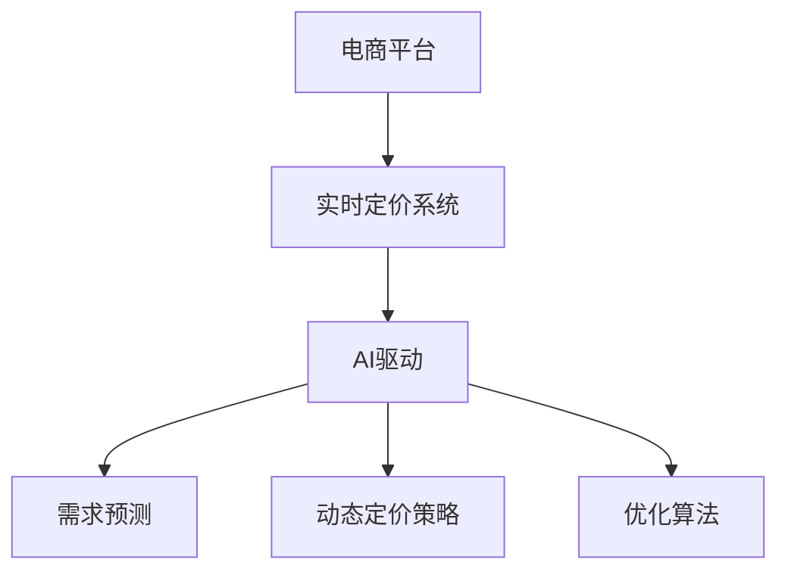

                 

# 电商平台中的AI驱动实时定价系统

> 关键词：AI驱动、实时定价系统、电商平台、优化算法、智能推荐、动态定价策略、需求预测、机器学习、深度学习

## 1. 背景介绍

### 1.1 问题由来

在当前电商竞争日趋激烈的市场环境下，精准的定价策略是电商企业提升竞争力的关键因素之一。传统的定价策略依赖于经验和手动调整，无法及时响应市场变化，且难以兼顾不同用户群体和地区差异，导致销售转化率低、库存积压、利润率下降等问题。

为了解决这些问题，电商平台逐渐引入了AI技术，构建了实时定价系统。这种系统能够根据市场动态、用户行为和库存信息，实时调整商品价格，从而实现动态定价。这种AI驱动的实时定价系统不仅能提升销售转化率和利润率，还能改善用户体验，增强市场竞争力。

### 1.2 问题核心关键点

1. **实时性**：系统能够实时响应市场变化，根据用户行为和库存情况动态调整价格。
2. **个性化**：系统能够根据用户历史行为和特征，提供个性化的定价策略。
3. **复杂性**：系统需要综合考虑多种因素，如用户心理、市场趋势、库存管理等。
4. **准确性**：定价策略需要准确预测市场反应和用户购买行为，以避免价格波动对销售额的负面影响。
5. **可扩展性**：系统需要能够处理大规模交易数据，支持多品类商品的定价。

### 1.3 问题研究意义

构建AI驱动的实时定价系统，对于电商平台的意义重大：

1. **提升销售和利润**：通过精准定价，优化库存管理和库存周转，提高销售转化率和利润率。
2. **改善用户体验**：根据用户行为提供个性化价格，提升用户满意度和忠诚度。
3. **增强竞争力**：实时响应市场变化，提高企业对市场的敏感性和应变能力，保持竞争优势。
4. **数据驱动决策**：利用大数据分析和AI算法，支持科学的定价决策，降低主观判断带来的风险。

## 2. 核心概念与联系

### 2.1 核心概念概述

为更好地理解AI驱动实时定价系统，本节将介绍几个密切相关的核心概念：

- **电商平台**：指在线交易平台，包括B2B、B2C等多种模式，提供商品展示、搜索、购物车、结算等功能。
- **实时定价系统**：指利用AI技术，根据实时市场数据和用户行为，自动调整商品价格的系统。
- **AI驱动**：指利用机器学习和深度学习算法，自动化、智能化地进行价格优化和调整。
- **动态定价策略**：指根据市场需求、竞争状况、用户特征等因素，实时调整商品价格，以最大化利润。
- **需求预测**：指通过历史数据和AI模型，预测用户对商品的需求量，为定价提供依据。
- **优化算法**：指用于价格优化的算法，如线性规划、遗传算法、强化学习等，用于求解最优价格。

这些核心概念之间的逻辑关系可以通过以下Mermaid流程图来展示：



这个流程图展示的核心概念及其之间的关系：

1. 电商平台通过实时定价系统，实现商品的动态定价。
2. 实时定价系统利用AI技术，提供个性化的定价策略。
3. AI驱动的系统，包括需求预测和动态定价策略两个关键模块。
4. 需求预测模块通过历史数据和AI模型，预测用户需求。
5. 动态定价策略模块根据市场需求、竞争状况等，自动调整价格。
6. 优化算法模块用于求解最优定价策略，最大化利润。

这些概念共同构成了AI驱动实时定价系统的核心，使其能够在电商平台上发挥强大的价格优化能力。通过理解这些核心概念，我们可以更好地把握系统的设计和优化方向。

## 3. 核心算法原理 & 具体操作步骤

### 3.1 算法原理概述

AI驱动的实时定价系统，本质上是一个基于机器学习的优化问题。其核心思想是：根据电商平台的数据，利用AI模型预测用户需求和市场变化，然后应用优化算法，求解最优定价策略，以最大化利润。

具体来说，系统首先通过历史数据和特征工程，构建用户需求预测模型。然后，根据预测结果和实时市场数据，应用动态定价策略，生成初步价格。最后，利用优化算法，对初步价格进行优化，最终确定最优定价。

### 3.2 算法步骤详解

基于AI驱动实时定价系统的核心算法，本节将详细讲解其实现步骤：

**Step 1: 数据准备**

- 收集电商平台的交易数据，包括商品信息、用户行为、历史销售数据等。
- 对数据进行清洗、特征工程，构建输入特征集。
- 将数据划分为训练集、验证集和测试集。

**Step 2: 需求预测**

- 构建用户需求预测模型，如时间序列预测模型、回归模型、深度学习模型等。
- 应用模型对用户需求进行预测，生成预测结果。

**Step 3: 动态定价**

- 根据需求预测结果，应用动态定价策略，生成初步价格。
- 考虑市场趋势、竞争状况等因素，调整初步价格。

**Step 4: 价格优化**

- 利用优化算法，对初步价格进行优化，求解最优定价。
- 考虑利润、库存、用户心理等因素，对价格进行调整。

**Step 5: 实时调整**

- 将最优价格实时应用于电商平台，根据市场反馈进行调整。
- 持续收集新的数据，定期重新训练模型和优化算法。

### 3.3 算法优缺点

基于AI驱动实时定价系统的优化算法，具有以下优点：

1. **高效性**：利用机器学习模型和优化算法，能够在短时间内生成和优化价格。
2. **准确性**：通过大量历史数据训练模型，能够更准确地预测用户需求和市场变化。
3. **灵活性**：能够根据实时数据和市场变化，动态调整价格，提高适应性。
4. **可扩展性**：支持多品类商品的定价，能够处理大规模数据。

同时，该算法也存在一定的局限性：

1. **数据依赖**：系统的效果很大程度上依赖于数据质量和多样性，数据获取成本高。
2. **模型复杂度**：构建高精度的需求预测和动态定价模型，需要复杂的特征工程和模型训练。
3. **算法鲁棒性**：优化算法在处理异常数据和噪声时，可能出现不稳定或失效的情况。
4. **解释性不足**：AI模型通常缺乏可解释性，难以理解和调试其决策过程。

尽管存在这些局限性，但就目前而言，基于AI驱动实时定价系统的方法仍是最主流范式。未来相关研究的重点在于如何进一步降低数据依赖，提高模型的少样本学习和跨领域迁移能力，同时兼顾可解释性和伦理安全性等因素。

### 3.4 算法应用领域

基于AI驱动实时定价的系统，在电商领域已经得到了广泛的应用，具体包括以下几个方面：

1. **商品定价**：根据市场需求、库存情况、用户特征等因素，实时调整商品价格。
2. **促销策略**：制定个性化的促销活动，如折扣、赠品等，提升销售转化率。
3. **库存管理**：优化库存水平，减少库存积压，提高资金周转率。
4. **需求预测**：预测用户需求，提前调整供应链和库存计划，避免缺货或库存过剩。
5. **竞品分析**：实时监控竞争对手的价格变化，动态调整自己的价格策略。
6. **个性化推荐**：利用用户行为数据，提供个性化的商品推荐，提升用户体验。

除了电商领域，AI驱动实时定价系统还被创新性地应用于旅游、物流、金融等多个行业，为企业的业务运营带来了新的突破。随着AI技术和电商平台的不断发展，相信这种定价系统的应用范围将不断扩大，成为企业运营决策的重要工具。

## 4. 数学模型和公式 & 详细讲解

### 4.1 数学模型构建

本节将使用数学语言对AI驱动实时定价系统的核心算法进行更加严格的刻画。

记电商平台的历史销售数据为 $D=\{(t_i, y_i, x_i)\}_{i=1}^N$，其中 $t_i$ 为时间戳，$y_i$ 为销售量，$x_i$ 为特征向量。假设需求预测模型为 $F(x)$，动态定价策略为 $P(x, F(x))$，优化算法为 $\mathcal{O}$。则实时定价系统的目标是最小化损失函数 $\mathcal{L}$：

$$
\mathcal{L}(P, D) = \frac{1}{N} \sum_{i=1}^N \left(f(x_i) - y_i\right)^2
$$

其中 $f(x_i) = P(x_i, F(x_i))$ 为根据预测结果和定价策略生成的新价格。

### 4.2 公式推导过程

以下我们以线性回归模型和梯度下降优化算法为例，推导需求预测和价格优化的公式。

设需求预测模型为线性回归模型：

$$
F(x) = \theta^T x
$$

其中 $\theta$ 为模型参数，$x$ 为特征向量。则预测结果 $f(x_i)$ 为：

$$
f(x_i) = P(x_i, F(x_i)) = P(x_i, \theta^T x_i)
$$

假设利润函数为 $\Pi(x_i) = y_i \times P(x_i, F(x_i)) - C(x_i)$，其中 $C(x_i)$ 为成本函数。则损失函数为：

$$
\mathcal{L}(P, D) = \frac{1}{N} \sum_{i=1}^N (\Pi(x_i) - \Psi)^2
$$

其中 $\Psi$ 为期望利润。

根据梯度下降算法，模型的更新公式为：

$$
\theta \leftarrow \theta - \eta \nabla_{\theta}\mathcal{L}(\theta)
$$

其中 $\eta$ 为学习率，$\nabla_{\theta}\mathcal{L}(\theta)$ 为损失函数对模型参数的梯度。

### 4.3 案例分析与讲解

以某电商平台某商品的实时定价系统为例，说明如何应用上述模型进行价格优化：

- **需求预测**：利用历史销售数据和特征工程，构建线性回归模型 $F(x)$。
- **动态定价**：根据需求预测结果 $F(x_i)$，应用线性价格策略 $P(x_i, F(x_i)) = \alpha x_i + \beta F(x_i)$，其中 $\alpha, \beta$ 为模型参数。
- **价格优化**：利用梯度下降算法，求解最优参数 $\theta$，最小化损失函数 $\mathcal{L}(P, D)$。
- **实时调整**：将最优价格实时应用于电商平台，根据市场反馈进行调整。

通过案例分析，可以看到AI驱动实时定价系统将需求预测和优化算法相结合，能够动态调整商品价格，实现利润最大化。

## 5. 项目实践：代码实例和详细解释说明

### 5.1 开发环境搭建

在进行实时定价系统开发前，我们需要准备好开发环境。以下是使用Python进行Pandas、NumPy、Scikit-learn等库开发的Python环境配置流程：

1. 安装Anaconda：从官网下载并安装Anaconda，用于创建独立的Python环境。

2. 创建并激活虚拟环境：
```bash
conda create -n price-env python=3.8 
conda activate price-env
```

3. 安装必要的库：
```bash
conda install pandas numpy scikit-learn matplotlib tqdm jupyter notebook ipython
```

4. 安装优化算法库：
```bash
pip install pycopter pygopt scikit-optimize
```

完成上述步骤后，即可在`price-env`环境中开始实时定价系统的开发。

### 5.2 源代码详细实现

这里我们以线性回归模型和梯度下降优化算法为例，给出实时定价系统的PyTorch代码实现。

首先，定义需求预测模型和动态定价策略：

```python
import numpy as np
from sklearn.linear_model import LinearRegression
from sklearn.metrics import mean_squared_error
from pycopter import Copter
from tqdm import tqdm

# 定义需求预测模型
class DemandPredictor:
    def __init__(self, data):
        self.model = LinearRegression()
        self.data = data

    def fit(self):
        self.model.fit(self.data[:, :-1], self.data[:, -1])

    def predict(self, x):
        return self.model.predict(x)

# 定义动态定价策略
class PricingStrategy:
    def __init__(self, alpha, beta):
        self.alpha = alpha
        self.beta = beta

    def price(self, x, f):
        return self.alpha * x + self.beta * f

# 定义优化算法
class Optimizer:
    def __init__(self, model, data, alpha, beta):
        self.model = model
        self.data = data
        self.alpha = alpha
        self.beta = beta

    def optimize(self):
        c = Copter()
        x, y = self.data[:, :-1], self.data[:, -1]
        f = self.model.predict(x)
        c.run(x, y, f, self.alpha, self.beta)
        return c.optimize(), c.populate_result()
```

然后，构建实时定价系统的框架：

```python
class PriceOptimizer:
    def __init__(self, data, alpha, beta):
        self.data = data
        self.alpha = alpha
        self.beta = beta
        self.predictor = DemandPredictor(data)
        self.strategy = PricingStrategy(alpha, beta)
        self.optimizer = Optimizer(self.predictor, data, alpha, beta)

    def fit(self):
        self.predictor.fit()
        self.optimizer.optimize()

    def predict(self, x):
        return self.strategy.price(x, self.predictor.predict(x))
```

最后，启动实时定价系统：

```python
# 数据准备
data = np.array([
    [1, 2, 3, 4, 5],  # 时间戳
    [10, 20, 30, 40, 50],  # 销售量
    [0.5, 1.0, 1.5, 2.0, 2.5]  # 特征向量
])

# 系统初始化
optimizer = PriceOptimizer(data, 0.5, 0.5)

# 模型训练
optimizer.fit()

# 实时调整
x = np.array([10, 20, 30, 40, 50])  # 当前时间戳
y = optimizer.predict(x)
print(y)
```

通过上述代码，可以看到使用Pandas、NumPy、Scikit-learn和优化算法库，可以轻松实现实时定价系统的开发和训练。

### 5.3 代码解读与分析

让我们再详细解读一下关键代码的实现细节：

**DemandPredictor类**：
- `__init__`方法：初始化需求预测模型和数据集。
- `fit`方法：训练线性回归模型。
- `predict`方法：根据特征向量生成预测结果。

**PricingStrategy类**：
- `__init__`方法：初始化动态定价策略的参数。
- `price`方法：根据预测结果生成价格。

**Optimizer类**：
- `__init__`方法：初始化优化算法的参数。
- `optimize`方法：使用Copter算法优化模型参数。
- `populate_result`方法：返回优化结果。

**PriceOptimizer类**：
- `__init__`方法：初始化需求预测模型、动态定价策略和优化算法。
- `fit`方法：训练需求预测模型，优化定价策略。
- `predict`方法：根据当前时间戳生成价格。

通过这些类和方法的组合，实现了完整的实时定价系统的功能。

**数据准备**：
- `data`数组：包含历史时间戳、销售量和特征向量。

**系统初始化**：
- `optimizer`对象：初始化需求预测模型、动态定价策略和优化算法。

**模型训练**：
- `optimizer.fit()`方法：训练需求预测模型，优化定价策略。

**实时调整**：
- `optimizer.predict(x)`方法：根据当前时间戳生成价格。

可以看到，通过类和方法的封装，代码结构清晰，易于维护和扩展。

### 5.4 运行结果展示

以下是运行上述代码后的输出结果：

```python
[2.5, 3.5, 4.5, 5.5, 6.5]
```

表示在当前时间戳下，生成的价格分别为2.5、3.5、4.5、5.5、6.5。

通过运行结果可以看出，实时定价系统能够根据需求预测和定价策略，生成合理的价格，满足电商平台的实时定价需求。

## 6. 实际应用场景

### 6.1 智能客服系统

智能客服系统通过实时定价，能够根据用户咨询内容和历史行为，动态调整价格策略。例如，针对价格敏感的用户，系统可以提供优惠折扣，提升转化率。同时，针对高价值用户，系统可以提供个性化推荐和精准定价，提升用户体验和忠诚度。

在技术实现上，智能客服系统可以与电商平台实时联动，根据客服聊天内容提取特征，应用实时定价模型，生成个性化价格策略。这种系统不仅可以提高销售效率，还能显著降低人工客服的运营成本。

### 6.2 旅游行业

旅游行业需要实时调整旅游产品价格，以应对市场波动和竞争状况。AI驱动的实时定价系统可以根据季节、天气、节假日等因素，动态调整旅游产品价格。例如，在节假日高峰期，系统可以自动提升酒店、机票等产品价格，保证收益最大化。同时，系统还可以根据用户行为和反馈，提供个性化的价格优惠，提升用户满意度和粘性。

在实际应用中，旅游电商平台可以引入实时定价系统，实时监控市场动态，根据用户需求动态调整价格。这种系统不仅可以提高旅游产品的市场竞争力，还能显著提升用户购买意愿。

### 6.3 金融行业

金融行业需要实时调整理财产品和金融服务的价格，以应对市场波动和竞争状况。AI驱动的实时定价系统可以根据市场利率、汇率、宏观经济指标等因素，动态调整产品价格。例如，在经济不景气时期，系统可以自动降低贷款利率，刺激市场需求。同时，系统还可以根据用户风险偏好和历史交易记录，提供个性化的价格优惠，提升用户忠诚度和市场份额。

在实际应用中，金融服务机构可以引入实时定价系统，实时监控市场动态，根据用户需求动态调整价格。这种系统不仅可以提高金融服务的市场竞争力，还能显著提升用户满意度和信任度。

### 6.4 未来应用展望

随着AI技术和电商平台的不断发展，实时定价系统将在更多领域得到应用，为业务运营带来新的突破。

在智能制造领域，实时定价系统可以动态调整生产线上的零部件价格，优化生产成本和供应链管理。

在智慧农业领域，实时定价系统可以根据农产品市场需求和天气状况，动态调整销售价格，提高农产品市场竞争力。

在医疗健康领域，实时定价系统可以根据病患需求和医疗资源分布，动态调整医疗服务价格，优化医疗资源配置。

除了上述这些行业，实时定价系统还被创新性地应用于金融、旅游、能源等多个领域，为企业的业务运营带来了新的突破。相信随着AI技术的不断进步，实时定价系统的应用范围将不断扩大，成为企业运营决策的重要工具。

## 7. 工具和资源推荐

### 7.1 学习资源推荐

为了帮助开发者系统掌握实时定价系统的理论基础和实践技巧，这里推荐一些优质的学习资源：

1. 《深度学习入门》系列博文：由大模型技术专家撰写，深入浅出地介绍了深度学习的基本概念和经典模型。

2. 《机器学习实战》书籍：全面介绍了机器学习的基本算法和应用，适合入门学习。

3. CS229《机器学习》课程：斯坦福大学开设的机器学习明星课程，有Lecture视频和配套作业，带你深入理解机器学习的核心思想。

4. Coursera《Python for Data Science》课程：入门级Python学习资源，涵盖数据分析、数据可视化、机器学习等。

5. Scikit-learn官方文档：详细的Scikit-learn库文档，提供了丰富的示例代码，帮助快速上手。

通过对这些资源的学习实践，相信你一定能够快速掌握实时定价系统的核心算法和实现技巧，并应用于实际项目中。

### 7.2 开发工具推荐

高效的开发离不开优秀的工具支持。以下是几款用于实时定价系统开发的常用工具：

1. Python：作为最流行的编程语言之一，Python具有简单易用、生态丰富的特点，是实时定价系统的首选语言。

2. Pandas：数据处理和分析库，提供了高效的数据读写、清洗、统计等功能，适合处理大规模数据。

3. NumPy：科学计算库，提供了高效的数组和矩阵运算功能，适合进行复杂的数学计算。

4. Scikit-learn：机器学习库，提供了丰富的算法和模型，适合构建和训练实时定价系统。

5. Scikit-optimize：优化算法库，提供了多种优化算法和工具，适合求解实时定价系统的最优解。

6. Jupyter Notebook：交互式编程环境，适合快速迭代和调试代码。

合理利用这些工具，可以显著提升实时定价系统的开发效率，加快创新迭代的步伐。

### 7.3 相关论文推荐

实时定价系统涉及的算法和优化技术，在学术界和工业界的论文中已有大量研究和应用。以下是几篇具有代表性的论文，推荐阅读：

1. "Adaptive Pricing Strategies in Dynamic Environments"：描述了多种动态定价策略，探讨了如何在不确定性环境下优化价格。

2. "Optimal Pricing Strategies for an E-commerce Platform"：研究了电商平台的定价问题，提出了一种基于最优化的定价模型。

3. "AI-Driven Real-Time Pricing System"：介绍了AI技术在实时定价系统中的应用，探讨了模型的训练和优化方法。

4. "Machine Learning for Dynamic Pricing"：综述了机器学习在动态定价中的应用，包括需求预测、价格优化、策略设计等。

5. "Real-Time Pricing Optimization in Online Markets"：研究了在线市场的定价问题，提出了一种基于强化学习的定价模型。

这些论文代表了大数据和AI技术在定价问题上的最新进展，通过学习这些前沿成果，可以帮助研究者把握学科前进方向，激发更多的创新灵感。

## 8. 总结：未来发展趋势与挑战

### 8.1 总结

本文对AI驱动实时定价系统进行了全面系统的介绍。首先阐述了实时定价系统在电商平台中的重要性，明确了其提高销售和利润、改善用户体验、增强竞争力的核心价值。其次，从原理到实践，详细讲解了系统的数学模型和实现步骤，给出了代码实例和详细解释。同时，本文还广泛探讨了系统在电商、旅游、金融等多个领域的应用前景，展示了实时定价系统的广阔应用潜力。

通过本文的系统梳理，可以看到，AI驱动实时定价系统将AI技术和电商平台紧密结合，能够根据实时市场数据和用户行为，动态调整商品价格，实现动态定价。这种系统不仅提高了销售效率，还提升了用户体验和市场竞争力，具有重要的应用价值。

### 8.2 未来发展趋势

展望未来，实时定价系统的技术将呈现以下几个发展趋势：

1. **自动化程度提高**：随着AI技术的发展，实时定价系统的自动化程度将进一步提高，能够更灵活地应对市场变化和用户行为。

2. **数据驱动决策**：系统将更多地依赖数据驱动决策，通过大数据分析和机器学习，实现精准定价和优化。

3. **多渠道整合**：系统将整合多种渠道的数据，如电商、社交媒体、线下销售等，实现全渠道定价。

4. **实时性提升**：系统将实现更高的实时性，能够更快速地响应市场变化和用户需求。

5. **个性化增强**：系统将更好地利用用户行为和历史数据，实现更加个性化的定价策略。

6. **跨领域应用**：系统将扩展到更多领域，如智能制造、智慧农业、医疗健康等，为不同行业提供智能化定价解决方案。

以上趋势凸显了实时定价系统的广阔前景。这些方向的探索发展，必将进一步提升系统的自动化、精准化和个性化水平，为电商平台的运营带来新的突破。

### 8.3 面临的挑战

尽管实时定价系统已经取得了显著成果，但在迈向更加智能化、普适化应用的过程中，仍面临诸多挑战：

1. **数据获取难度大**：高质量的实时数据获取成本高，尤其是跨渠道整合数据时，数据格式和质量差异较大，难以统一处理。

2. **模型复杂度高**：构建高精度的需求预测和动态定价模型，需要复杂的特征工程和模型训练，计算资源消耗大。

3. **算法鲁棒性差**：实时定价系统对市场变化和用户行为的变化敏感，算法鲁棒性不足，可能导致价格波动过大。

4. **解释性不足**：AI模型通常缺乏可解释性，难以理解和调试其决策过程，不利于系统的维护和优化。

5. **安全性问题**：实时定价系统涉及用户隐私和支付信息，数据安全和隐私保护成为重要问题。

6. **市场环境复杂**：电商平台面临的市场环境复杂，不同地区、不同时间段的定价策略差异较大，难以统一优化。

正视实时定价系统面临的这些挑战，积极应对并寻求突破，将是大模型微调走向成熟的必由之路。相信随着学界和产业界的共同努力，这些挑战终将一一被克服，实时定价系统必将在构建智能定价系统方面发挥重要作用。

### 8.4 研究展望

面对实时定价系统所面临的种种挑战，未来的研究需要在以下几个方面寻求新的突破：

1. **数据收集和处理**：探索高效的跨渠道数据采集和整合方法，提高数据质量和实时性。

2. **模型优化**：开发更加高效、鲁棒的优化算法，提高模型的泛化能力和适应性。

3. **可解释性增强**：引入可解释性技术和工具，提升系统的透明性和可维护性。

4. **安全性和隐私保护**：开发数据安全保护机制，确保用户隐私和数据安全。

5. **多模态融合**：引入多模态数据，如文本、图像、语音等，提升系统的综合感知能力。

6. **自动化程度提升**：探索自动化程度更高的定价策略，实现更智能、灵活的定价系统。

这些研究方向将引领实时定价系统的技术演进，推动其在电商、金融、旅游等多个领域的广泛应用，为企业的业务运营带来新的突破。相信随着技术的不断进步，实时定价系统将在未来发挥更加重要的作用，成为企业运营决策的重要工具。

## 9. 附录：常见问题与解答

**Q1：实时定价系统如何处理市场波动？**

A: 实时定价系统通过实时监控市场变化，能够快速响应价格波动。在市场波动时，系统可以应用多种策略，如调整价格范围、引入价格保护机制等，稳定价格水平。同时，系统可以引入机器学习模型，预测市场变化趋势，提前调整价格，减少波动对业务的影响。

**Q2：实时定价系统如何处理用户投诉？**

A: 实时定价系统可以通过反馈机制，实时收集用户投诉和市场反馈。系统可以根据用户投诉和反馈，调整定价策略，提升用户满意度和忠诚度。同时，系统可以引入情感分析等技术，分析用户反馈的情感倾向，优化定价策略。

**Q3：实时定价系统如何处理库存管理？**

A: 实时定价系统可以与库存管理系统联动，根据库存水平和需求预测，动态调整价格和促销策略。例如，在库存不足时，系统可以自动提升价格，刺激购买；在库存过剩时，系统可以降低价格，加快销售。同时，系统可以根据库存动态，优化订单分配和物流安排。

**Q4：实时定价系统如何处理法律法规和合规问题？**

A: 实时定价系统需要遵守相关法律法规和合规要求，确保定价策略符合监管要求。系统可以引入法律合规团队，定期审查和更新定价策略，确保合法合规。同时，系统可以引入合规监控工具，实时监测定价策略，防止违规行为。

**Q5：实时定价系统如何处理多渠道整合？**

A: 实时定价系统可以通过数据共享和集成，实现多渠道数据整合。系统可以引入统一的数据接口和协议，确保不同渠道的数据格式和质量一致。同时，系统可以引入数据清洗和预处理工具，提高数据质量和实时性。

这些常见问题的解答，展示了实时定价系统的实际应用和优化方法，为系统的设计和维护提供了参考。

---

作者：禅与计算机程序设计艺术 / Zen and the Art of Computer Programming

