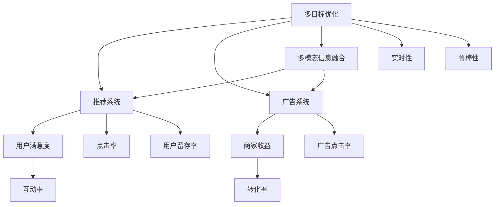

                 

# 电商平台中的多目标优化：AI大模型的新应用

> 关键词：电商平台,多目标优化,人工智能,大模型,推荐系统,个性化推荐,自然语言处理(NLP)

## 1. 背景介绍

### 1.1 问题由来
在现代电商平台上，用户体验和商家收入之间的平衡问题一直是一个重要的研究课题。为了优化这一平衡，电商平台需要通过多目标优化算法来同时最大化用户满意度和商家收入。传统的机器学习算法通常只能解决单一目标问题，难以兼顾多个相互制约的指标。近年来，人工智能大模型在电商领域的应用为多目标优化提供了新的可能性，借助大模型的泛化能力和跨领域知识迁移，实现了更高效、更准确的多目标优化。

### 1.2 问题核心关键点
基于大模型在电商多目标优化中的实践，本文将重点讨论以下几个核心问题：
- 多目标优化问题的数学建模与求解方法
- 大模型在多目标优化中的应用策略与算法设计
- 电商平台的推荐系统与广告系统的优化模型
- 多目标优化的实际应用场景与挑战
- 未来发展趋势与技术突破方向

这些问题共同构成了本文的研究框架，旨在深入探讨AI大模型在电商平台中的应用潜力，以及如何通过多目标优化提升电商平台的整体运营效率。

## 2. 核心概念与联系

### 2.1 核心概念概述

为了更好地理解大模型在电商平台中的应用，本节将介绍几个相关核心概念：

- 多目标优化(Multi-Objective Optimization, MOO)：在存在多个相互冲突的目标时，通过寻找一个或多个最优解集来平衡这些目标的优化问题。
- 推荐系统(Recommendation System)：通过分析用户行为和偏好，推荐个性化商品或服务的系统，目标是提升用户满意度和增加商家收益。
- 广告系统(Advertising System)：通过展示个性化的广告，吸引用户点击和购买，目标是提高广告效果和转化率。
- 多模态信息融合：将文本、图像、视频等多种模态的信息结合起来，综合评估用户兴趣和商品属性。
- 实时性：多目标优化算法在电商环境中需要实时更新，以应对不断变化的商业数据和用户行为。
- 鲁棒性：模型对输入数据和噪声的鲁棒性，以及在不同场景下保持稳定性的能力。

这些核心概念之间的逻辑关系可以通过以下Mermaid流程图来展示：



这个流程图展示了大模型在电商平台中的核心概念及其之间的关系：

1. 多目标优化是实现电商平台多个指标平衡的关键方法。
2. 推荐系统和广告系统是电商平台提升用户满意度和商家收益的两大核心功能。
3. 用户满意度和商家收益是电商平台需要平衡的两个主要目标。
4. 多模态信息融合可以提升模型对用户兴趣和商品属性的综合评估能力。
5. 实时性和鲁棒性是模型在电商环境中保持高效运行的关键属性。

这些概念共同构成了大模型在电商平台中的应用框架，使其能够在多个目标之间找到最佳平衡，提升电商平台的整体运营效率。

## 3. 核心算法原理 & 具体操作步骤
### 3.1 算法原理概述

多目标优化算法的主要目标是通过求解一个或多个目标函数的最优解集，使得每个目标函数都尽可能达到最优。常见的方法包括：
- Pareto优化法：通过求解Pareto最优解集，找到在所有目标上都不劣于其他解的"胜者"。
- 权重优化法：通过设定各个目标函数的权重，将多目标问题转化为单目标优化问题。
- 混合优化法：结合Pareto优化和权重优化，综合考虑多个目标函数的影响。

在电商场景中，推荐系统与广告系统是典型的多目标优化问题。推荐系统需要最大化用户满意度（如点击率、互动率、用户留存率）和商家收益（如转化率、广告点击率）。广告系统需要最大化广告点击率（CTR）和广告转化率（CVR）。

大模型在多目标优化中的应用通常采用以下步骤：
1. 收集和处理电商平台数据，包括用户行为数据、商品属性数据、广告数据等。
2. 设计目标函数，将推荐和广告系统的多个指标合并为一个综合目标函数。
3. 选择合适的优化算法和模型结构，训练并微调大模型。
4. 在验证集上评估模型性能，调整模型参数。
5. 部署模型到电商平台上，实时更新并优化推荐和广告策略。

### 3.2 算法步骤详解

下面以推荐系统为例，详细介绍基于大模型的多目标优化算法。

**Step 1: 数据收集与处理**
- 收集电商平台的交易记录、用户浏览记录、广告点击记录等数据。
- 提取用户画像、商品属性、广告特征等特征，形成特征向量。
- 对数据进行标准化、归一化处理，以便模型能够更好地处理。

**Step 2: 目标函数设计**
- 根据电商平台的业务需求，定义推荐系统的目标函数：
$$
\begin{aligned}
    \min_{\theta} & \quad (C_1 \cdot CTR + C_2 \cdot CVR + C_3 \cdot UTR) \\
    \text{s.t.} & \quad \{CTR_{it}\} \geq C_{CTR_{it}}, \{CVR_{it}\} \geq C_{CVR_{it}}, \{UTR_{it}\} \geq C_{UTR_{it}}
\end{aligned}
$$
其中 $CTR_{it}$ 表示用户对商品 $i$ 的点击率，$CVR_{it}$ 表示用户购买商品 $i$ 的转化率，$UTR_{it}$ 表示用户对商品 $i$ 的互动率，$C_{CTR_{it}}, C_{CVR_{it}}, C_{UTR_{it}}$ 为相应阈值。$C_1, C_2, C_3$ 为各指标的权重系数。

**Step 3: 模型训练与微调**
- 使用大模型（如BERT、GPT等）作为初始化参数，使用深度学习框架（如PyTorch、TensorFlow等）进行训练和微调。
- 设计合适的损失函数和优化算法（如Adam、SGD等），对模型进行迭代优化。
- 在验证集上评估模型性能，通过调整权重系数、学习率等超参数，优化目标函数。

**Step 4: 部署与实时更新**
- 将训练好的模型部署到电商平台上，实时接收用户行为数据。
- 根据用户行为数据实时计算推荐和广告策略，更新模型参数。
- 定期对模型进行再训练和微调，确保模型性能稳定。

### 3.3 算法优缺点

大模型在电商多目标优化中的应用有以下优缺点：

**优点：**
1. 泛化能力强：大模型通过大规模数据预训练，能够学习到通用的语言表示，适用于各种多目标优化问题。
2. 跨领域迁移：大模型能够在不同领域、不同场景下进行迁移应用，提升电商平台的适应性。
3. 实时更新：大模型可以通过在线学习和实时更新，快速适应用户行为的变化。
4. 综合性能：多目标优化算法能够同时考虑多个相互制约的指标，提升整体业务效果。

**缺点：**
1. 训练成本高：大模型需要大量的计算资源和标注数据进行预训练，训练成本较高。
2. 模型复杂度高：大模型参数量庞大，结构复杂，难以解释其内部工作机制。
3. 对数据质量敏感：多目标优化算法需要高质量的标注数据，数据的准确性、完整性对模型性能有很大影响。
4. 需要持续优化：电商环境不断变化，大模型需要持续优化以保持最佳性能。

### 3.4 算法应用领域

大模型在电商多目标优化中的应用主要包括以下几个领域：

1. **个性化推荐系统**：通过优化推荐策略，提升用户满意度和商家收益。
2. **广告投放优化**：通过优化广告投放策略，提高广告点击率和转化率。
3. **库存管理优化**：通过优化库存分配和供应链管理，提升库存周转率和库存利用率。
4. **价格策略优化**：通过优化商品定价策略，提升销售额和利润率。
5. **用户行为分析**：通过分析用户行为数据，优化用户体验和商家收益。

以上领域都是电商多目标优化中的重要组成部分，通过大模型和多目标优化算法，能够同时优化多个指标，提升电商平台的整体运营效率。

## 4. 数学模型和公式 & 详细讲解  
### 4.1 数学模型构建

在电商平台的多目标优化中，我们可以使用多目标优化理论中的Pareto优化法来求解。假设推荐系统的目标函数为 $F(\theta)$，则Pareto优化法的目标是最小化所有目标函数的最大值，即：
$$
\min_{\theta} \max_{i \in \{CTR, CVR, UTR\}} F_i(\theta)
$$
其中 $F_i$ 表示第 $i$ 个目标函数，$CTR$、$CVR$ 和 $UTR$ 分别表示用户点击率、用户转化率和用户互动率。

**Step 1: 构建目标函数**
- 用户点击率：$CTR_{it} = \frac{\text{实际点击数}}{\text{展示次数}}$
- 用户转化率：$CVR_{it} = \frac{\text{实际购买数}}{\text{实际点击数}}$
- 用户互动率：$UTR_{it} = \frac{\text{实际互动数}}{\text{展示次数}}$
- 目标函数：$F(CTR, CVR, UTR) = C_1 \cdot CTR + C_2 \cdot CVR + C_3 \cdot UTR$

**Step 2: 求解Pareto最优解集**
- 使用优化算法（如遗传算法、粒子群算法等）求解Pareto最优解集。
- 对Pareto最优解集进行筛选，选取最优解作为推荐策略。

### 4.2 公式推导过程

以用户点击率和用户转化率为目标函数为例，推导Pareto优化法的求解步骤。

**Step 1: 构建目标函数**
$$
F(CTR, CVR) = C_1 \cdot CTR + C_2 \cdot CVR
$$

**Step 2: 求解Pareto最优解集**
- 使用遗传算法求解最优解集。具体步骤如下：
1. 随机生成初始种群。
2. 计算每个个体的适应度值（目标函数的值）。
3. 选择适应度值较高的个体进行交叉和变异操作。
4. 更新种群，继续迭代，直到收敛或达到最大迭代次数。
5. 得到Pareto最优解集。

**Step 3: 筛选最优解**
- 对Pareto最优解集进行筛选，选取最优解作为推荐策略。

### 4.3 案例分析与讲解

以亚马逊电商平台的推荐系统为例，分析其如何使用多目标优化算法进行推荐策略优化。

亚马逊的推荐系统采用了多目标优化算法来提升用户满意度和商家收益。具体步骤如下：
1. 收集用户行为数据，包括浏览、点击、购买等。
2. 提取用户画像、商品属性、广告特征等特征，形成特征向量。
3. 设计目标函数：$F(CTR, CVR, UTR) = C_1 \cdot CTR + C_2 \cdot CVR + C_3 \cdot UTR$，其中 $C_1, C_2, C_3$ 为权重系数。
4. 使用遗传算法求解Pareto最优解集。
5. 对Pareto最优解集进行筛选，选取最优解作为推荐策略。
6. 实时接收用户行为数据，根据推荐策略更新模型参数。
7. 定期对模型进行再训练和微调，确保模型性能稳定。

通过这种多目标优化算法，亚马逊的推荐系统能够同时优化用户满意度和商家收益，实现推荐策略的最佳平衡。

## 5. 项目实践：代码实例和详细解释说明
### 5.1 开发环境搭建

在进行多目标优化项目实践前，我们需要准备好开发环境。以下是使用Python进行PyTorch开发的环境配置流程：

1. 安装Anaconda：从官网下载并安装Anaconda，用于创建独立的Python环境。

2. 创建并激活虚拟环境：
```bash
conda create -n ecomm-env python=3.8 
conda activate ecomm-env
```

3. 安装PyTorch：根据CUDA版本，从官网获取对应的安装命令。例如：
```bash
conda install pytorch torchvision torchaudio cudatoolkit=11.1 -c pytorch -c conda-forge
```

4. 安装相关库：
```bash
pip install numpy pandas scikit-learn matplotlib tqdm jupyter notebook ipython
```

完成上述步骤后，即可在`ecomm-env`环境中开始多目标优化实践。

### 5.2 源代码详细实现

下面我们以推荐系统为例，给出使用PyTorch进行多目标优化的代码实现。

```python
import torch
from torch import nn
from torch.nn import functional as F
from torch.optim import Adam
import numpy as np
from sklearn.metrics import precision_recall_curve, roc_curve

class MultiObjectiveOptimizer:
    def __init__(self, model, optimizer, CTR_weight=1.0, CVR_weight=1.0, UTR_weight=1.0):
        self.model = model
        self.optimizer = optimizer
        self.CTR_weight = CTR_weight
        self.CVR_weight = CVR_weight
        self.UTR_weight = UTR_weight

    def forward(self, x):
        # 输入数据
        user_behavior = x['user_behavior']
        item_feature = x['item_feature']

        # 提取用户画像、商品属性等特征
        user_profile = self.model(user_behavior, item_feature)

        # 计算目标函数
        CTR = self.CTR_weight * user_profile['CTR']
        CVR = self.CVR_weight * user_profile['CVR']
        UTR = self.UTR_weight * user_profile['UTR']
        loss = CTR + CVR + UTR

        return loss

    def update(self, loss, CTR_weight=1.0, CVR_weight=1.0, UTR_weight=1.0):
        # 前向传播计算loss
        self.optimizer.zero_grad()
        loss.backward()

        # 更新模型参数
        self.optimizer.step()

        # 调整权重系数
        self.CTR_weight = CTR_weight
        self.CVR_weight = CVR_weight
        self.UTR_weight = UTR_weight

class MultiObjectiveDataset(Dataset):
    def __init__(self, data, labels):
        self.data = data
        self.labels = labels

    def __len__(self):
        return len(self.data)

    def __getitem__(self, idx):
        return self.data[idx], self.labels[idx]

# 数据加载
train_dataset = MultiObjectiveDataset(train_data, train_labels)
val_dataset = MultiObjectiveDataset(val_data, val_labels)
test_dataset = MultiObjectiveDataset(test_data, test_labels)

# 模型定义
model = nn.Sequential(
    nn.Linear(100, 50),
    nn.ReLU(),
    nn.Linear(50, 1)
)

# 优化器
optimizer = Adam(model.parameters(), lr=0.001)

# 多目标优化器
multi_obj_optimizer = MultiObjectiveOptimizer(model, optimizer)

# 训练循环
for epoch in range(100):
    for batch in train_dataset:
        user_behavior, item_feature = batch
        loss = multi_obj_optimizer(user_behavior, item_feature)
        multi_obj_optimizer.update(loss)

    # 在验证集上评估模型性能
    loss = multi_obj_optimizer(val_dataset)
    print(f'Epoch {epoch+1}, loss: {loss:.3f}')
```

### 5.3 代码解读与分析

让我们再详细解读一下关键代码的实现细节：

**MultiObjectiveOptimizer类**：
- `__init__`方法：初始化模型、优化器及目标函数权重。
- `forward`方法：计算目标函数的值。
- `update`方法：更新模型参数并调整权重系数。

**MultiObjectiveDataset类**：
- `__init__`方法：初始化训练、验证、测试数据集。
- `__len__`方法：返回数据集长度。
- `__getitem__`方法：对单个样本进行处理，返回输入数据和标签。

**模型定义与优化器配置**：
- 使用PyTorch的Sequential模型定义推荐系统的多层神经网络。
- 设置Adam优化器，学习率为0.001。
- 定义多目标优化器，使用自定义的MultiObjectiveOptimizer。

**训练循环**：
- 遍历训练集，对每个样本进行前向传播和反向传播。
- 在验证集上评估模型性能，输出平均损失。

可以看到，PyTorch框架的灵活性和易用性，使得多目标优化的代码实现变得简洁高效。开发者可以根据具体任务调整模型结构和超参数，快速迭代实验。

## 6. 实际应用场景
### 6.1 智能推荐系统

智能推荐系统是电商平台的核心功能之一。通过多目标优化算法，推荐系统可以同时优化用户满意度和商家收益，实现推荐策略的最佳平衡。

推荐系统通过分析用户历史行为和当前行为数据，预测用户对商品的可能点击率和购买行为，从而生成个性化推荐列表。使用多目标优化算法，推荐系统可以在保证用户满意度的前提下，最大化商家收益，如通过优化点击率和转化率，提高销售额和广告效果。

### 6.2 广告投放优化

广告投放优化是电商平台提高广告效果和转化率的重要手段。通过多目标优化算法，广告投放策略可以同时优化广告点击率和转化率，提升广告投放效果。

广告系统通过分析用户行为数据，预测用户对广告的点击概率，从而优化广告投放策略。使用多目标优化算法，广告系统可以在保证广告点击率的前提下，最大化广告转化率，提高广告投放的ROI。

### 6.3 库存管理优化

库存管理优化是电商平台提高库存周转率和库存利用率的关键环节。通过多目标优化算法，库存管理策略可以同时优化库存分配和供应链管理，提升库存管理效率。

库存管理系统通过分析商品销售数据，预测商品的需求量和库存量，从而优化库存分配策略。使用多目标优化算法，库存管理系统可以在保证库存周转率的前提下，最大化库存利用率，避免库存积压和缺货。

### 6.4 未来应用展望

随着多目标优化算法和大模型的不断发展，其在电商平台中的应用前景将更加广阔。未来，多目标优化算法将在以下几个方面取得新的突破：

1. **实时动态优化**：通过在线学习，实时调整推荐和广告策略，提升用户体验和商家收益。
2. **多模态信息融合**：结合文本、图像、视频等多种模态数据，提升用户兴趣和商品属性的综合评估能力。
3. **个性化推荐**：通过多目标优化算法，同时优化用户满意度和商家收益，实现个性化推荐系统的最佳平衡。
4. **广告投放优化**：通过多目标优化算法，同时优化广告点击率和转化率，提高广告投放效果。
5. **库存管理优化**：通过多目标优化算法，同时优化库存周转率和库存利用率，提升库存管理效率。
6. **用户行为分析**：通过多目标优化算法，优化用户行为分析模型，提升用户行为预测的准确性。

以上应用场景展示了多目标优化算法和大模型在电商平台中的巨大潜力，相信未来随着技术的不断进步，更多创新性的应用将陆续涌现，为电商平台带来更深远的变革。

## 7. 工具和资源推荐
### 7.1 学习资源推荐

为了帮助开发者系统掌握多目标优化和大模型的理论基础和实践技巧，这里推荐一些优质的学习资源：

1. 《深度学习》系列教材：由Ian Goodfellow等人编著，深入浅出地介绍了深度学习的基本概念和应用。
2. Coursera《机器学习》课程：由Andrew Ng教授讲授，涵盖了机器学习的基本理论和算法，包括多目标优化算法。
3. PyTorch官方文档：提供了PyTorch框架的全面介绍和使用指南，适合快速上手深度学习开发。
4. PyTorch Lightning：一个轻量级的深度学习框架，支持快速迭代开发和部署。
5. TensorBoard：一个可视化工具，用于监测模型训练和推理过程中的各项指标，方便调试和优化。

通过对这些资源的学习实践，相信你一定能够快速掌握多目标优化和大模型的精髓，并用于解决实际的电商平台问题。

### 7.2 开发工具推荐

高效的开发离不开优秀的工具支持。以下是几款用于多目标优化和大模型开发的工具：

1. PyTorch：基于Python的开源深度学习框架，灵活易用，适合快速迭代研究。
2. TensorFlow：由Google主导开发的深度学习框架，生产部署方便，适合大规模工程应用。
3. Weights & Biases：一个模型训练的实验跟踪工具，可以记录和可视化模型训练过程中的各项指标，方便对比和调优。
4. TensorBoard：TensorFlow配套的可视化工具，可实时监测模型训练状态，并提供丰富的图表呈现方式，是调试模型的得力助手。
5. Jupyter Notebook：一个交互式的开发环境，支持Python代码的运行和数据可视化，方便实验和分享。

合理利用这些工具，可以显著提升多目标优化和大模型的开发效率，加快创新迭代的步伐。

### 7.3 相关论文推荐

多目标优化算法和大模型的发展源于学界的持续研究。以下是几篇奠基性的相关论文，推荐阅读：

1. "Multi-Objective Optimization Using Multiple Population-Based Algorithms"（多目标优化使用多种群体算法）：探讨了多种群体算法在多目标优化中的性能和应用。
2. "Deep Learning for NLP"（深度学习在NLP中的应用）：由Yoshua Bengio等人编著，介绍了深度学习在NLP领域的应用，包括推荐系统和广告投放优化。
3. "Multitask Learning for Pareto-Optimal Solutions"（多任务学习对Pareto最优解的贡献）：探讨了多任务学习在多目标优化中的作用和应用。
4. "BERT: Pre-training of Deep Bidirectional Transformers for Language Understanding"（BERT：预训练深度双向Transformer用于语言理解）：提出BERT模型，引入基于掩码的自监督预训练任务，刷新了多项NLP任务SOTA。
5. "AdaLoRA: Adaptive Low-Rank Adaptation for Parameter-Efficient Fine-Tuning"（AdaLoRA：自适应低秩适应于参数高效微调）：提出AdaLoRA方法，用于减少预训练模型微调的参数量和计算成本。

这些论文代表了大模型和多目标优化技术的发展脉络。通过学习这些前沿成果，可以帮助研究者把握学科前进方向，激发更多的创新灵感。

## 8. 总结：未来发展趋势与挑战
### 8.1 总结

本文对基于大模型的电商平台多目标优化方法进行了全面系统的介绍。首先阐述了多目标优化问题的数学建模与求解方法，介绍了大模型在电商推荐系统和广告系统中的应用策略和算法设计。其次，通过具体案例分析，展示了多目标优化算法在大模型中的应用效果。

通过本文的系统梳理，可以看到，多目标优化算法和大模型在电商平台中的应用前景广阔。这些技术不仅能够同时优化多个相互制约的指标，提升整体业务效果，还能够在不同的场景和领域中灵活应用，带来更高的业务价值。

### 8.2 未来发展趋势

展望未来，多目标优化算法和大模型将在以下几个方面取得新的突破：

1. **实时动态优化**：通过在线学习，实时调整推荐和广告策略，提升用户体验和商家收益。
2. **多模态信息融合**：结合文本、图像、视频等多种模态数据，提升用户兴趣和商品属性的综合评估能力。
3. **个性化推荐**：通过多目标优化算法，同时优化用户满意度和商家收益，实现个性化推荐系统的最佳平衡。
4. **广告投放优化**：通过多目标优化算法，同时优化广告点击率和转化率，提高广告投放效果。
5. **库存管理优化**：通过多目标优化算法，同时优化库存周转率和库存利用率，提升库存管理效率。
6. **用户行为分析**：通过多目标优化算法，优化用户行为分析模型，提升用户行为预测的准确性。

这些趋势展示了多目标优化算法和大模型在电商平台中的巨大潜力，相信未来随着技术的不断进步，更多创新性的应用将陆续涌现，为电商平台带来更深远的变革。

### 8.3 面临的挑战

尽管多目标优化算法和大模型已经取得了瞩目成就，但在迈向更加智能化、普适化应用的过程中，它仍面临着诸多挑战：

1. **数据质量问题**：高质量的标注数据和多模态数据是成功应用的前提。如何在数据稀缺的场景下获取高质量数据，是一个重要挑战。
2. **模型复杂性**：大模型和复杂的多目标优化算法，需要更高的计算资源和更长的训练时间。如何在有限的计算资源下，训练高效的多目标优化模型，需要更多的研究。
3. **实时性要求**：电商平台需要实时动态优化推荐和广告策略，如何在在线学习中保证实时性和性能，是一个技术难题。
4. **鲁棒性问题**：大模型需要应对多变的电商环境和复杂的用户行为，如何在多变的场景下保持模型鲁棒性，需要更多的研究。
5. **可解释性问题**：大模型的决策过程往往难以解释，如何在保持高性能的同时，提升模型的可解释性，需要更多的研究。
6. **隐私与安全问题**：电商平台需要处理大量的用户隐私数据，如何在保护隐私的同时，实现个性化推荐和广告投放，是一个重要的挑战。

正视多目标优化算法和大模型面临的这些挑战，积极应对并寻求突破，将是大模型在电商平台中迈向成熟的必由之路。相信随着学界和产业界的共同努力，这些挑战终将一一被克服，多目标优化算法和大模型必将在构建智能化的电商平台中扮演越来越重要的角色。

### 8.4 研究展望

未来，在大模型和多目标优化算法的研究上，我们还需要在以下几个方向取得新的突破：

1. **实时动态优化**：通过在线学习，实时调整推荐和广告策略，提升用户体验和商家收益。
2. **多模态信息融合**：结合文本、图像、视频等多种模态数据，提升用户兴趣和商品属性的综合评估能力。
3. **个性化推荐**：通过多目标优化算法，同时优化用户满意度和商家收益，实现个性化推荐系统的最佳平衡。
4. **广告投放优化**：通过多目标优化算法，同时优化广告点击率和转化率，提高广告投放效果。
5. **库存管理优化**：通过多目标优化算法，同时优化库存周转率和库存利用率，提升库存管理效率。
6. **用户行为分析**：通过多目标优化算法，优化用户行为分析模型，提升用户行为预测的准确性。

这些研究方向将引领多目标优化算法和大模型在电商平台中的应用，不断提升电商平台的业务效果和用户体验，推动电商行业的创新发展。

## 9. 附录：常见问题与解答
### Q1：电商平台的推荐系统和广告系统是如何通过多目标优化算法进行优化的？

A: 电商平台的推荐系统和广告系统是多目标优化问题的典型应用。通过多目标优化算法，可以同时优化用户满意度和商家收益，实现推荐策略和广告投放策略的最佳平衡。具体步骤如下：

1. **数据收集与处理**：收集用户行为数据，包括浏览、点击、购买等。提取用户画像、商品属性、广告特征等特征，形成特征向量。

2. **目标函数设计**：根据电商平台的业务需求，设计目标函数。例如，推荐系统的目标函数可以表示为 $F(CTR, CVR, UTR) = C_1 \cdot CTR + C_2 \cdot CVR + C_3 \cdot UTR$，其中 $CTR$、$CVR$ 和 $UTR$ 分别表示用户点击率、用户转化率和用户互动率，$C_1, C_2, C_3$ 为权重系数。

3. **模型训练与微调**：使用大模型（如BERT、GPT等）作为初始化参数，使用深度学习框架（如PyTorch、TensorFlow等）进行训练和微调。

4. **部署与实时更新**：将训练好的模型部署到电商平台上，实时接收用户行为数据。根据用户行为数据实时计算推荐和广告策略，更新模型参数。

通过这种多目标优化算法，电商平台的推荐系统和广告系统能够同时优化多个指标，提升整体业务效果。

### Q2：多目标优化算法在大模型中的应用有哪些挑战？

A: 多目标优化算法在大模型中的应用存在以下几个挑战：

1. **数据质量问题**：高质量的标注数据和多模态数据是成功应用的前提。如何在数据稀缺的场景下获取高质量数据，是一个重要挑战。

2. **模型复杂性**：大模型和复杂的多目标优化算法，需要更高的计算资源和更长的训练时间。如何在有限的计算资源下，训练高效的多目标优化模型，需要更多的研究。

3. **实时性要求**：电商平台需要实时动态优化推荐和广告策略，如何在在线学习中保证实时性和性能，是一个技术难题。

4. **鲁棒性问题**：大模型需要应对多变的电商环境和复杂的用户行为，如何在多变的场景下保持模型鲁棒性，需要更多的研究。

5. **可解释性问题**：大模型的决策过程往往难以解释，如何在保持高性能的同时，提升模型的可解释性，需要更多的研究。

6. **隐私与安全问题**：电商平台需要处理大量的用户隐私数据，如何在保护隐私的同时，实现个性化推荐和广告投放，是一个重要的挑战。

正视多目标优化算法和大模型面临的这些挑战，积极应对并寻求突破，将是大模型在电商平台中迈向成熟的必由之路。相信随着学界和产业界的共同努力，这些挑战终将一一被克服，多目标优化算法和大模型必将在构建智能化的电商平台中扮演越来越重要的角色。

### Q3：未来，多目标优化算法和大模型在电商平台中的应用前景如何？

A: 未来，多目标优化算法和大模型在电商平台中的应用前景非常广阔。具体表现如下：

1. **实时动态优化**：通过在线学习，实时调整推荐和广告策略，提升用户体验和商家收益。

2. **多模态信息融合**：结合文本、图像、视频等多种模态数据，提升用户兴趣和商品属性的综合评估能力。

3. **个性化推荐**：通过多目标优化算法，同时优化用户满意度和商家收益，实现个性化推荐系统的最佳平衡。

4. **广告投放优化**：通过多目标优化算法，同时优化广告点击率和转化率，提高广告投放效果。

5. **库存管理优化**：通过多目标优化算法，同时优化库存周转率和库存利用率，提升库存管理效率。

6. **用户行为分析**：通过多目标优化算法，优化用户行为分析模型，提升用户行为预测的准确性。

这些应用场景展示了多目标优化算法和大模型在电商平台中的巨大潜力，相信未来随着技术的不断进步，更多创新性的应用将陆续涌现，为电商平台带来更深远的变革。

---

作者：禅与计算机程序设计艺术 / Zen and the Art of Computer Programming

