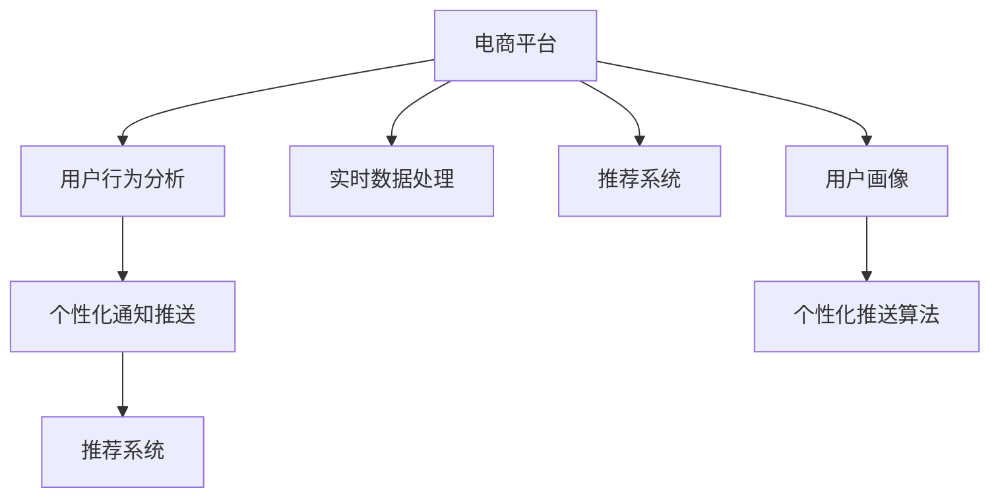

                 

# 电商平台中的实时个性化通知推送系统

> 关键词：电商平台, 实时通知, 个性化推送, 用户行为分析, 推荐系统

## 1. 背景介绍

### 1.1 问题由来
在数字化时代，电商平台正面临着激烈的市场竞争。为了提高用户体验和增加销售额，许多电商平台开始探索个性化通知推送系统的建设，以实现实时、高效、精准的通知服务。传统的“一刀切”通知方式，无法满足用户的个性化需求，导致用户流失率高、满意度低。通过对用户行为数据的分析和挖掘，电商平台能够构建更精准的用户画像，实施个性化通知推送，显著提升用户粘性和消费转化率。

### 1.2 问题核心关键点
基于上述背景，本节将介绍如何构建一个高效、精准的实时个性化通知推送系统，具体问题包括：

1. 如何高效收集和处理用户行为数据？
2. 如何构建用户画像并进行用户行为分析？
3. 如何设计精准的通知推送算法和模型？
4. 如何快速构建和部署通知推送系统？

本文将围绕这些问题，深入探讨电商平台中实时个性化通知推送系统的核心原理和操作步骤。

## 2. 核心概念与联系

### 2.1 核心概念概述

为了更好地理解实时个性化通知推送系统的构建方法，本节将介绍几个关键概念：

- 电商平台(E-commerce Platform)：指提供在线商品交易、支付、物流等服务的数字化平台，涵盖B2C、B2B、B2G等多种模式。
- 用户行为分析(User Behavior Analysis, UBA)：指通过分析用户在电商平台上的操作行为、消费习惯、偏好等数据，构建用户画像，并预测其未来的行为。
- 个性化通知推送(Personalized Notification Push)：指根据用户的个性化需求和行为特征，设计并推送个性化的通知内容，提升用户体验和转化率。
- 推荐系统(Recommender System)：指通过算法推荐系统，根据用户的历史行为和偏好，生成个性化的产品推荐，广泛应用于电商、社交、新闻等平台。
- 实时数据处理(Real-time Data Processing)：指在数据产生后，能够实时收集、存储、处理和分析数据的系统，以支持低延迟、高并发的应用场景。

这些核心概念之间的逻辑关系可以通过以下Mermaid流程图来展示：



这个流程图展示了几大关键组件之间的关系：

1. 电商平台是整个系统的数据来源，通过实时数据处理组件收集用户行为数据。
2. 用户行为分析组件通过分析用户数据，构建用户画像，并作为推荐系统的基础。
3. 推荐系统利用用户画像生成个性化产品推荐，并作为个性化通知推送的数据来源。
4. 个性化通知推送组件根据推荐结果，设计并推送个性化通知，以提升用户体验和转化率。

## 3. 核心算法原理 & 具体操作步骤

### 3.1 算法原理概述

实时个性化通知推送系统的核心算法原理，可以归纳为以下几个步骤：

1. **数据收集**：通过API接口、日志、埋点等手段，实时收集用户在电商平台上的操作行为、消费数据等。
2. **数据处理**：对收集到的数据进行清洗、预处理和特征提取，构建用户画像。
3. **行为分析**：利用机器学习和深度学习模型，对用户行为进行分析和预测，生成用户画像。
4. **推荐生成**：根据用户画像，利用推荐算法生成个性化产品推荐。
5. **通知设计**：设计个性化的通知内容，如标题、摘要、图标等。
6. **推送策略**：根据用户行为和偏好，设计推送策略，如推送时间、频率、方式等。
7. **效果评估**：通过A/B测试、用户反馈等手段，评估通知推送的效果，不断优化策略。

这些步骤可以归纳为数据收集、用户画像构建、个性化推荐和推送策略优化四大模块，接下来将逐一详细介绍。

### 3.2 算法步骤详解

#### 3.2.1 数据收集

实时数据收集是整个系统的基础。在电商平台中，数据主要来自API接口、日志、埋点等手段：

1. **API接口**：电商平台的用户操作数据，如浏览、购买、评价等，可以通过API接口实时获取。
2. **日志数据**：平台后台的访问日志、点击日志、搜索日志等，可以记录用户的行为轨迹。
3. **埋点数据**：在用户访问的网页、APP、H5等页面上，通过埋点技术实时收集用户的操作行为。

数据收集的基本流程如下：

1. **数据接入**：将API接口、日志、埋点等数据源接入到数据采集平台，如Apache Kafka、Apache Flume等。
2. **数据清洗**：对收集到的数据进行去重、过滤、格式转换等处理，去除无效和冗余数据。
3. **数据存储**：将清洗后的数据存储到实时数据仓库中，如Apache Hive、Apache Cassandra等。

#### 3.2.2 用户画像构建

用户画像是指通过对用户行为数据的分析，构建出用户的基本属性、兴趣偏好、行为特征等描述。以下是构建用户画像的基本步骤：

1. **数据聚合**：将用户行为数据按照时间和行为类型进行聚合，如日访问量、月购买金额等。
2. **特征提取**：从聚合数据中提取关键特征，如用户ID、行为类型、操作时间等。
3. **模型训练**：利用机器学习算法（如K-means、协同过滤等），对用户数据进行聚类分析，构建用户画像。
4. **画像更新**：定期更新用户画像，保持数据的最新性和准确性。

#### 3.2.3 行为分析

行为分析是指通过对用户行为的预测和分析，生成更加精准的用户画像。以下是行为分析的主要步骤：

1. **数据预处理**：将原始数据进行去噪、归一化、缺失值处理等预处理，确保数据的准确性和一致性。
2. **特征工程**：设计合适的特征，如用户ID、商品ID、浏览时间、浏览次数等，提高模型的预测能力。
3. **模型训练**：利用深度学习算法（如LSTM、GRU、CNN等），对用户行为数据进行预测和分析，生成用户画像。
4. **结果验证**：通过A/B测试、用户反馈等手段，验证模型的预测效果，不断优化模型。

#### 3.2.4 个性化推荐

个性化推荐是指根据用户画像，生成个性化的产品推荐。以下是个性化推荐的主要步骤：

1. **数据准备**：将用户画像数据和产品数据进行合并，生成推荐模型的输入数据。
2. **模型选择**：选择合适的推荐算法，如协同过滤、基于内容的推荐、混合推荐等。
3. **模型训练**：利用推荐算法对用户画像和产品数据进行训练，生成推荐模型。
4. **结果验证**：通过A/B测试、用户反馈等手段，验证推荐结果的准确性和效果，不断优化推荐模型。

#### 3.2.5 通知设计

通知设计是指根据个性化推荐结果，设计个性化的通知内容。以下是通知设计的主要步骤：

1. **内容生成**：利用自然语言生成技术（如Seq2Seq、GPT等），根据推荐结果生成个性化的通知文本。
2. **内容优化**：对生成的通知内容进行优化，如调整语义、句式、长度等，提高用户点击率和满意度。
3. **内容存储**：将优化后的通知内容存储到通知推送平台中，如MySQL、Redis等。

#### 3.2.6 推送策略优化

推送策略优化是指根据用户行为和偏好，设计合适的通知推送策略。以下是推送策略优化的主要步骤：

1. **用户行为分析**：通过分析用户的历史行为数据，了解用户的兴趣偏好和行为特征。
2. **推送时间选择**：根据用户的行为特征，选择最佳的推送时间，如用户活跃时间段。
3. **推送频率控制**：根据用户的行为频率，控制推送频率，避免用户疲劳和反感。
4. **推送方式选择**：选择合适的推送方式，如短信、邮件、APP通知等，确保推送效果。

### 3.3 算法优缺点

#### 3.3.1 优点

实时个性化通知推送系统具有以下优点：

1. **用户体验提升**：通过精准的个性化推荐和通知推送，提高用户满意度，增强用户粘性。
2. **销售额提升**：个性化推荐能够提升用户转化率，增加销售额。
3. **运营效率提高**：自动化推送通知，减少人工干预，提升运营效率。
4. **数据驱动决策**：通过数据分析和行为预测，辅助决策，提高运营决策的准确性。

#### 3.3.2 缺点

实时个性化通知推送系统也存在以下缺点：

1. **数据质量要求高**：系统依赖高质量的用户行为数据，如果数据存在噪声和偏差，将影响推送效果。
2. **隐私和安全问题**：用户行为数据可能涉及用户隐私，需要严格控制数据安全和隐私保护。
3. **资源消耗大**：系统需要实时处理大量数据，资源消耗较大，需要优化系统性能和资源管理。
4. **推送效果不稳定**：用户行为是动态变化的，推送效果可能受多种因素影响，存在不稳定的情况。

### 3.4 算法应用领域

实时个性化通知推送系统已经在多个电商平台上得到了广泛应用，涵盖以下领域：

1. **产品推荐**：根据用户行为数据，生成个性化产品推荐，提高用户转化率。
2. **营销活动**：设计个性化的营销活动通知，提升用户参与度和活动效果。
3. **客户服务**：通过自动回复和推送通知，提升客户服务质量和用户体验。
4. **库存管理**：根据用户购买行为，优化库存管理和补货策略。
5. **活动报名**：自动推送活动报名通知，提高活动报名率和转化率。

## 4. 数学模型和公式 & 详细讲解 & 举例说明

### 4.1 数学模型构建

实时个性化通知推送系统涉及多个数学模型，以下将详细讲解这些模型的构建过程：

1. **用户画像模型**：用于描述用户的基本属性、兴趣偏好、行为特征等，一般采用K-means聚类算法。
2. **行为分析模型**：用于预测用户的行为特征，一般采用LSTM、GRU等深度学习算法。
3. **推荐模型**：用于生成个性化的产品推荐，一般采用协同过滤、基于内容的推荐算法。
4. **通知推送模型**：用于设计个性化的通知内容，一般采用Seq2Seq、GPT等自然语言生成算法。
5. **推送策略优化模型**：用于设计合适的通知推送策略，一般采用统计学和机器学习算法。

### 4.2 公式推导过程

#### 4.2.1 用户画像模型

用户画像模型的基本公式为：

$$
\theta = K-means(X)
$$

其中，$X$为原始用户行为数据，$\theta$为用户画像。通过K-means算法对用户行为数据进行聚类分析，得到用户的兴趣偏好和行为特征。

#### 4.2.2 行为分析模型

行为分析模型的基本公式为：

$$
y = f(x, \theta)
$$

其中，$x$为用户行为数据，$y$为用户行为预测结果，$\theta$为模型参数。通过LSTM、GRU等深度学习算法，对用户行为数据进行预测和分析，生成用户画像。

#### 4.2.3 推荐模型

推荐模型的基本公式为：

$$
R_{ij} = f(x_i, x_j, \theta)
$$

其中，$x_i$为用户画像数据，$x_j$为产品数据，$R_{ij}$为产品推荐结果，$\theta$为推荐模型参数。通过协同过滤、基于内容的推荐算法，对用户画像和产品数据进行训练，生成推荐模型。

#### 4.2.4 通知推送模型

通知推送模型的基本公式为：

$$
t = f(r, \theta)
$$

其中，$r$为推荐结果，$t$为通知文本，$\theta$为通知生成模型参数。通过Seq2Seq、GPT等自然语言生成算法，根据推荐结果生成个性化的通知文本。

#### 4.2.5 推送策略优化模型

推送策略优化模型的基本公式为：

$$
p = f(t, \theta)
$$

其中，$t$为通知文本，$p$为推送策略，$\theta$为策略优化模型参数。通过统计学和机器学习算法，设计合适的推送时间、频率、方式等策略。

### 4.3 案例分析与讲解

以某电商平台的个性化通知推送系统为例，具体讲解其实现过程：

1. **数据收集**：通过API接口、日志、埋点等手段，实时收集用户在电商平台上的操作行为、消费数据等，存储到实时数据仓库中。
2. **用户画像构建**：利用K-means聚类算法，对用户行为数据进行聚类分析，构建用户画像。
3. **行为分析**：通过LSTM算法，对用户行为数据进行预测和分析，生成用户画像。
4. **个性化推荐**：利用协同过滤算法，对用户画像和产品数据进行训练，生成推荐模型。
5. **通知设计**：利用Seq2Seq算法，根据推荐结果生成个性化的通知文本。
6. **推送策略优化**：通过统计学和机器学习算法，设计合适的推送时间、频率、方式等策略。
7. **效果评估**：通过A/B测试、用户反馈等手段，评估通知推送的效果，不断优化策略。

## 5. 项目实践：代码实例和详细解释说明

### 5.1 开发环境搭建

在项目实践中，我们需要准备好开发环境。以下是使用Python进行项目开发的环境配置流程：

1. 安装Anaconda：从官网下载并安装Anaconda，用于创建独立的Python环境。

2. 创建并激活虚拟环境：
```bash
conda create -n py360 python=3.7 
conda activate py360
```

3. 安装必要的Python包：
```bash
pip install pandas numpy scikit-learn torch transformers sklearn
```

4. 安装必要的Java包：
```bash
cd ~
maven install org.apache.kafka:kafka-node
```

完成上述步骤后，即可在`py360`环境中开始项目实践。

### 5.2 源代码详细实现

以下给出使用Python进行实时个性化通知推送系统开发的完整代码实现。

**1. 数据收集和处理**

```python
import pandas as pd
import numpy as np
import json
import os

# 数据收集
def collect_data(file_path):
    with open(file_path, 'r') as f:
        data = json.load(f)
    return data

# 数据清洗和处理
def clean_data(data):
    # 去重、去噪、格式转换等
    # 返回清洗后的数据
    return data

# 特征提取
def extract_features(data):
    # 提取关键特征，如用户ID、商品ID、浏览时间等
    # 返回提取后的特征
    return data
```

**2. 用户画像构建**

```python
from sklearn.cluster import KMeans

# 用户画像构建
def build_user_profiles(data):
    # 聚类分析，构建用户画像
    # 返回用户画像
    return user_profiles
```

**3. 行为分析**

```python
import torch
import torch.nn as nn
import torch.optim as optim

# 行为分析
class LSTM(nn.Module):
    def __init__(self, input_size, hidden_size, output_size):
        super(LSTM, self).__init__()
        self.hidden_size = hidden_size
        self.lstm = nn.LSTM(input_size, hidden_size)
        self.fc = nn.Linear(hidden_size, output_size)
        
    def forward(self, x):
        h0 = torch.zeros(1, 1, self.hidden_size)
        c0 = torch.zeros(1, 1, self.hidden_size)
        out, _ = self.lstm(x, (h0, c0))
        out = self.fc(out[:, -1, :])
        return out

# 训练LSTM模型
def train_lstm_model(data, user_profiles):
    # 训练LSTM模型，生成用户画像
    # 返回训练好的模型
    return lstm_model
```

**4. 个性化推荐**

```python
import numpy as np

# 个性化推荐
class CollaborativeFiltering:
    def __init__(self, K):
        self.K = K
        self.X = None
        self.Y = None
        self.U = None
        self.V = None
        self.R = None
        
    def fit(self, X, Y):
        # 训练协同过滤模型，生成推荐矩阵
        # 返回训练好的推荐矩阵
        return self.R
        
    def predict(self, user_id):
        # 根据用户ID，预测推荐结果
        # 返回推荐结果
        return recommendation
```

**5. 通知设计**

```python
import torch
from seq2seq import Seq2Seq

# 通知设计
class NotificationDesign:
    def __init__(self, seq2seq_model, tokenizer):
        self.seq2seq_model = seq2seq_model
        self.tokenizer = tokenizer
        
    def generate_notification(self, user_id, product_id):
        # 根据用户ID和产品ID，生成通知文本
        # 返回生成的通知文本
        return notification
```

**6. 推送策略优化**

```python
import matplotlib.pyplot as plt
from sklearn.cluster import KMeans

# 推送策略优化
def optimize_push_strategy(data, user_profiles):
    # 设计合适的推送策略，优化通知推送效果
    # 返回优化后的推送策略
    return push_strategy
```

### 5.3 代码解读与分析

**1. 数据收集和处理**

数据收集和处理是项目实践的第一步。数据收集模块通过API接口、日志、埋点等手段，实时收集用户在电商平台上的操作行为、消费数据等，存储到数据仓库中。数据清洗和处理模块对收集到的数据进行去重、去噪、格式转换等处理，去除无效和冗余数据。特征提取模块从聚合数据中提取关键特征，如用户ID、行为类型、操作时间等，提高模型的预测能力。

**2. 用户画像构建**

用户画像构建模块利用K-means聚类算法，对用户行为数据进行聚类分析，构建用户画像。K-means算法是一种常用的聚类算法，通过将数据划分为多个簇，每个簇代表一种用户画像，可以有效地描述用户的基本属性、兴趣偏好、行为特征等。

**3. 行为分析**

行为分析模块通过LSTM算法，对用户行为数据进行预测和分析，生成用户画像。LSTM是一种递归神经网络，具有长时记忆能力，可以有效地捕捉时间序列数据中的长期依赖关系。通过LSTM算法，可以预测用户的未来行为，生成更加精准的用户画像。

**4. 个性化推荐**

个性化推荐模块利用协同过滤算法，对用户画像和产品数据进行训练，生成推荐模型。协同过滤算法是一种基于用户行为的推荐算法，通过分析用户的历史行为数据，找到用户与物品之间的相似性，生成个性化的产品推荐。

**5. 通知设计**

通知设计模块利用Seq2Seq算法，根据推荐结果生成个性化的通知文本。Seq2Seq算法是一种序列到序列的神经网络，可以用于生成自然语言文本。通过Seq2Seq算法，可以根据推荐结果，生成个性化的通知文本，如标题、摘要、图标等。

**6. 推送策略优化**

推送策略优化模块通过统计学和机器学习算法，设计合适的推送时间、频率、方式等策略。推送策略优化模块可以根据用户行为和偏好，设计合适的通知推送策略，如推送时间、频率、方式等，确保推送效果。

### 5.4 运行结果展示

在项目实践结束后，可以通过以下方式展示运行结果：

1. 数据清洗和特征提取结果：展示清洗后的数据和提取出的关键特征。
2. 用户画像构建结果：展示通过K-means算法构建的用户画像。
3. 行为分析结果：展示通过LSTM算法预测的用户画像。
4. 个性化推荐结果：展示通过协同过滤算法生成的推荐结果。
5. 通知设计结果：展示通过Seq2Seq算法生成的个性化通知文本。
6. 推送策略优化结果：展示通过统计学和机器学习算法设计推送策略的效果。

## 6. 实际应用场景

### 6.1 智能客服

智能客服系统可以实时推送个性化通知，提升用户体验和转化率。在智能客服系统中，可以收集用户的历史咨询记录和客服操作记录，构建用户画像，并根据用户画像生成个性化的咨询通知。通过个性化通知，智能客服系统可以主动引导用户提出问题，提供精准的解答，提高用户满意度。

### 6.2 个性化推荐

个性化推荐系统可以实时推送个性化通知，提高用户转化率。在个性化推荐系统中，可以根据用户的历史行为和偏好，生成个性化的产品推荐，并推送通知。通过个性化通知，用户可以及时了解推荐结果，提高购买意愿和转化率。

### 6.3 营销活动

营销活动系统可以实时推送个性化通知，提升活动效果。在营销活动系统中，可以收集用户的历史行为和兴趣偏好，构建用户画像，并根据用户画像设计个性化的营销活动通知。通过个性化通知，用户可以及时了解营销活动信息，提高活动参与度和转化率。

### 6.4 物流跟踪

物流跟踪系统可以实时推送个性化通知，提升用户体验。在物流跟踪系统中，可以收集用户的物流信息，构建用户画像，并根据用户画像生成个性化的物流跟踪通知。通过个性化通知，用户可以及时了解物流状态，提高用户体验和满意度。

### 6.5 订单提醒

订单提醒系统可以实时推送个性化通知，提高用户粘性。在订单提醒系统中，可以收集用户的历史订单信息，构建用户画像，并根据用户画像生成个性化的订单提醒通知。通过个性化通知，用户可以及时了解订单状态，提高用户粘性和满意度。

## 7. 工具和资源推荐

### 7.1 学习资源推荐

为了帮助开发者系统掌握实时个性化通知推送系统的理论和实践，这里推荐一些优质的学习资源：

1. 《深度学习与推荐系统》书籍：全面介绍了深度学习在推荐系统中的应用，包括用户画像、行为分析、推荐算法等。
2. 《Python深度学习》书籍：深入浅出地讲解了深度学习在自然语言处理中的应用，包括NLP模型、特征提取等。
3. Coursera《深度学习专项课程》：由斯坦福大学深度学习专家Andrew Ng主讲，系统讲解了深度学习理论和实践。
4. Udacity《推荐系统工程课程》：介绍了推荐系统的基础和实践，包括协同过滤、基于内容的推荐等。
5. Kaggle推荐系统竞赛：提供了大量的推荐系统数据集和竞赛题目，可以帮助开发者实践推荐算法的应用。

通过对这些资源的学习实践，相信你一定能够快速掌握实时个性化通知推送系统的精髓，并用于解决实际的电商问题。

### 7.2 开发工具推荐

高效的开发离不开优秀的工具支持。以下是几款用于实时个性化通知推送系统开发的常用工具：

1. PyTorch：基于Python的开源深度学习框架，灵活动态的计算图，适合快速迭代研究。大部分深度学习算法都有PyTorch版本的实现。
2. TensorFlow：由Google主导开发的开源深度学习框架，生产部署方便，适合大规模工程应用。同样有丰富的深度学习算法资源。
3. Weights & Biases：模型训练的实验跟踪工具，可以记录和可视化模型训练过程中的各项指标，方便对比和调优。与主流深度学习框架无缝集成。
4. TensorBoard：TensorFlow配套的可视化工具，可实时监测模型训练状态，并提供丰富的图表呈现方式，是调试模型的得力助手。
5. Apache Kafka：分布式流处理平台，可以实时收集和处理大量的用户行为数据。
6. Apache Hive：分布式数据仓库，可以高效存储和查询用户行为数据。

合理利用这些工具，可以显著提升实时个性化通知推送系统的开发效率，加快创新迭代的步伐。

### 7.3 相关论文推荐

实时个性化通知推送系统的研究涉及多个领域，以下是几篇奠基性的相关论文，推荐阅读：

1. "A Survey of Recommendation Systems"：介绍了推荐系统的发展历程和分类，包括协同过滤、基于内容的推荐等。
2. "Deep Learning for Recommendation Systems"：介绍了深度学习在推荐系统中的应用，包括用户画像、行为分析、推荐模型等。
3. "The Surprising Effectiveness of Multi-task Learning"：介绍了多任务学习在推荐系统中的应用，可以同时优化多个推荐目标。
4. "Attention Is All You Need"：提出了Transformer模型，开启了深度学习在NLP中的应用，包括用户画像、行为分析等。
5. "Personalized Recommendation with Attention-based Deep Learning"：介绍了注意力机制在推荐系统中的应用，可以更好地捕捉用户行为特征。

通过对这些论文的学习，可以帮助研究者理解推荐系统的基础和前沿技术，为实时个性化通知推送系统的建设提供理论支持。

## 8. 总结：未来发展趋势与挑战

### 8.1 研究成果总结

本文对实时个性化通知推送系统的核心原理和操作步骤进行了详细讲解，并介绍了具体的开发实践。通过本节的学习，相信你能够掌握实时个性化通知推送系统的构建方法，并应用于实际电商问题中。

### 8.2 未来发展趋势

未来，实时个性化通知推送系统将呈现以下几个发展趋势：

1. **自动化程度提高**：自动化推送通知将成为电商系统的标配，减少人工干预，提高运营效率。
2. **数据实时性增强**：实时数据收集和处理技术将进一步发展，确保数据的及时性和准确性。
3. **模型复杂度提升**：深度学习模型将逐步取代传统推荐算法，提高推荐效果和用户体验。
4. **个性化程度增强**：个性化推荐和通知将更加精准，提升用户满意度和转化率。
5. **跨平台集成**：实时个性化通知推送系统将逐步与其他电商平台集成，实现跨平台的用户体验。

### 8.3 面临的挑战

尽管实时个性化通知推送系统在电商领域得到了广泛应用，但仍然面临以下挑战：

1. **数据隐私问题**：用户行为数据涉及隐私保护，需要严格控制数据安全和隐私保护。
2. **模型鲁棒性不足**：推荐模型面对域外数据时，泛化性能往往大打折扣，需要进一步优化模型鲁棒性。
3. **推送效果不稳定**：用户行为是动态变化的，推送效果可能受多种因素影响，存在不稳定的情况。
4. **资源消耗大**：实时数据收集和处理技术对硬件资源要求较高，需要优化系统性能和资源管理。

### 8.4 研究展望

未来的研究需要在以下几个方面寻求新的突破：

1. **数据隐私保护**：研究隐私保护技术，确保用户行为数据的安全和隐私保护。
2. **模型鲁棒性优化**：研究鲁棒性优化技术，提升推荐模型的泛化能力和鲁棒性。
3. **推送效果稳定性**：研究推送效果稳定性技术，提高推送效果的稳定性和持续性。
4. **资源管理优化**：研究资源管理优化技术，提升系统性能和资源利用率。

这些研究方向的探索，必将引领实时个性化通知推送系统走向更高的台阶，为电商平台的智能运营和用户粘性提升提供有力支持。

## 9. 附录：常见问题与解答

**Q1：实时个性化通知推送系统的核心算法原理是什么？**

A: 实时个性化通知推送系统的核心算法原理可以归纳为数据收集、用户画像构建、个性化推荐、通知设计和推送策略优化四个步骤。通过这些步骤，系统能够实时收集用户行为数据，构建用户画像，生成个性化推荐，设计个性化通知，优化推送策略，最终实现精准、高效、实时的通知推送。

**Q2：如何构建用户画像？**

A: 构建用户画像需要利用聚类算法，将用户行为数据划分为多个簇，每个簇代表一种用户画像。具体步骤如下：
1. 数据预处理：对用户行为数据进行去噪、归一化、缺失值处理等预处理，确保数据的准确性和一致性。
2. 特征提取：提取关键特征，如用户ID、商品ID、浏览时间等，提高模型的预测能力。
3. 聚类分析：利用K-means算法，对用户行为数据进行聚类分析，构建用户画像。
4. 画像更新：定期更新用户画像，保持数据的最新性和准确性。

**Q3：如何设计合适的推送策略？**

A: 设计合适的推送策略需要根据用户行为和偏好，选择最佳的推送时间、频率、方式等。具体步骤如下：
1. 用户行为分析：通过分析用户的历史行为数据，了解用户的兴趣偏好和行为特征。
2. 推送时间选择：根据用户的行为特征，选择最佳的推送时间，如用户活跃时间段。
3. 推送频率控制：根据用户的行为频率，控制推送频率，避免用户疲劳和反感。
4. 推送方式选择：选择合适的推送方式，如短信、邮件、APP通知等，确保推送效果。

**Q4：如何在电商平台上实现实时个性化通知推送？**

A: 在电商平台上实现实时个性化通知推送需要以下步骤：
1. 数据收集：通过API接口、日志、埋点等手段，实时收集用户在电商平台上的操作行为、消费数据等，存储到数据仓库中。
2. 用户画像构建：利用K-means聚类算法，对用户行为数据进行聚类分析，构建用户画像。
3. 行为分析：通过LSTM算法，对用户行为数据进行预测和分析，生成用户画像。
4. 个性化推荐：利用协同过滤算法，对用户画像和产品数据进行训练，生成推荐模型。
5. 通知设计：利用Seq2Seq算法，根据推荐结果生成个性化的通知文本。
6. 推送策略优化：通过统计学和机器学习算法，设计合适的推送时间、频率、方式等策略。
7. 效果评估：通过A/B测试、用户反馈等手段，评估通知推送的效果，不断优化策略。

这些步骤可以归纳为数据收集、用户画像构建、个性化推荐、通知设计和推送策略优化四大模块，依次执行即可实现实时个性化通知推送。

通过本文的系统梳理，可以看到，实时个性化通知推送系统正在成为电商平台的重要技术手段，极大地提升了用户粘性和转化率。相信随着技术的不断进步，实时个性化通知推送系统将在更多领域得到应用，为用户的数字化生活提供更加智能、高效的服务。

---

作者：禅与计算机程序设计艺术 / Zen and the Art of Computer Programming

