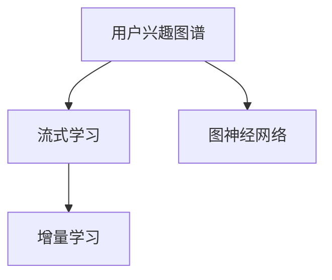
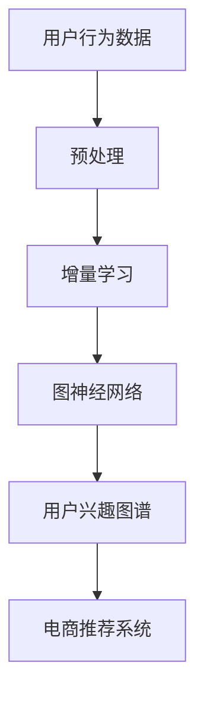

                 

# 电商平台中的用户兴趣图谱实时更新机制

## 1. 背景介绍

随着电商平台的快速发展，用户兴趣图谱的实时更新机制显得尤为重要。在电商平台中，用户通过浏览、购买等行为不断产生新的数据，这些数据反映了用户的兴趣和偏好，电商平台需要实时获取这些信息，以便推荐更加精准的商品。传统用户兴趣图谱的更新方法效率低、成本高，难以满足大规模电商平台的实时需求。因此，基于流式学习（Streaming Learning）的实时更新机制成为了研究热点。

## 2. 核心概念与联系

### 2.1 核心概念概述

- **用户兴趣图谱**：基于用户行为数据，构建的表示用户兴趣和偏好的图谱结构，用于指导电商推荐系统。
- **流式学习**：一种在线学习算法，能够实时接收新数据并更新模型，无需重新训练整个模型，适用于电商平台的实时需求。
- **增量学习**：在流式学习的基础上，针对新数据进行增量更新，提升学习效率。
- **图神经网络（GNN）**：一种专门处理图结构数据的深度学习算法，用于构建用户兴趣图谱并实时更新。

这些核心概念之间的逻辑关系可以通过以下Mermaid流程图来展示：



### 2.2 核心概念原理和架构的 Mermaid 流程图



## 3. 核心算法原理 & 具体操作步骤

### 3.1 算法原理概述

基于流式学习的用户兴趣图谱实时更新机制，本质上是利用增量学习技术，对用户行为数据进行在线处理和实时更新。其核心思想是：利用图神经网络对用户行为数据进行建模，构建用户兴趣图谱，然后根据新的行为数据进行增量更新，从而实现实时更新的目的。

### 3.2 算法步骤详解

**Step 1: 数据预处理**
- 对用户行为数据进行清洗和归一化，去除噪音和异常值。
- 将用户行为数据转换为适合图神经网络处理的形式，例如将用户-商品交互数据表示为图结构。

**Step 2: 构建用户兴趣图谱**
- 使用图神经网络对用户行为数据进行建模，得到用户兴趣向量。
- 将用户兴趣向量作为节点属性，构建用户兴趣图谱，节点为用户，边为用户行为数据中的商品。

**Step 3: 增量学习更新**
- 对于新的用户行为数据，通过图神经网络计算增量变化，更新用户兴趣向量。
- 根据新的用户兴趣向量，实时更新用户兴趣图谱。

**Step 4: 推荐系统部署**
- 利用更新后的用户兴趣图谱，为每个用户推荐最相关的商品。
- 循环迭代更新，保证推荐系统推荐结果的准确性和时效性。

### 3.3 算法优缺点

**优点**：
- 实时更新：能够实时处理和更新用户行为数据，快速响应用户兴趣变化。
- 增量学习：只更新新数据的模型部分，节省计算资源和存储开销。
- 模型泛化：利用图神经网络建模，模型泛化能力更强，能够适应复杂的用户行为数据。

**缺点**：
- 数据稀疏性：新用户和老用户的行为数据分布差异较大，难以通过稀疏数据构建完整的用户兴趣图谱。
- 模型复杂性：图神经网络建模复杂，需要较大的计算资源和时间。
- 数据噪音：用户行为数据可能包含噪音和异常值，影响模型效果。

### 3.4 算法应用领域

基于流式学习用户兴趣图谱实时更新机制，在电商平台中得到了广泛的应用，涵盖了商品推荐、个性化广告投放、用户流失预警等多个方面。

- **商品推荐**：通过实时更新用户兴趣图谱，为每个用户推荐最相关的商品，提升推荐系统的精准度和用户体验。
- **个性化广告投放**：利用用户兴趣图谱，实时调整广告投放策略，提高广告转化率和点击率。
- **用户流失预警**：通过分析用户行为数据，预测用户流失风险，提前采取措施挽留用户。

## 4. 数学模型和公式 & 详细讲解 & 举例说明

### 4.1 数学模型构建

假设用户行为数据表示为 $D=\{u_i,v_i,l_i\}_{i=1}^N$，其中 $u_i$ 表示用户，$v_i$ 表示商品，$l_i$ 表示用户行为数据 $l_i$ 表示用户行为数据对应的权重，例如浏览次数、购买金额等。

将用户行为数据表示为图结构 $G=(V,E,A)$，其中 $V$ 表示节点集合，即用户集合 $U$ 和商品集合 $I$，$E$ 表示边集合，即用户-商品交互关系 $E$，$A$ 表示节点属性集合，即用户行为数据权重 $L$。

用户兴趣图谱表示为 $G_s=(V_s,E_s,A_s)$，其中 $V_s$ 表示用户兴趣向量，$E_s$ 表示用户兴趣向量之间的关系，$A_s$ 表示用户兴趣向量的权重。

### 4.2 公式推导过程

假设用户兴趣图谱为 $G_s=(V_s,E_s,A_s)$，用户行为图谱为 $G=(V,E,A)$，令 $h_{vs}^{t+1}=f(h_{vs}^t)$，其中 $h_{vs}^t$ 表示节点 $v$ 在 $t$ 时刻的用户兴趣向量，$f$ 表示图神经网络中用于更新用户兴趣向量的函数。

根据增量学习原理，对于新数据 $D^*$，其对应的用户兴趣图谱为 $G_s^*=(V_s^*,E_s^*,A_s^*)$，则有：

$$
h_{vs}^{t+1}=f(h_{vs}^t)+\eta\sum_{e=(u,v)\in D^*}\mathcal{G}(h_u^t,h_v^t)
$$

其中 $\eta$ 表示学习率，$\mathcal{G}(h_u^t,h_v^t)$ 表示用于计算节点间关系的图神经网络函数。

### 4.3 案例分析与讲解

以电商平台中的商品推荐为例，假设用户 $u$ 对商品 $v$ 进行了浏览操作，其对应的权重为 $l$。在 $t$ 时刻，用户 $u$ 的兴趣向量为 $h_u^t$，商品 $v$ 的兴趣向量为 $h_v^t$。根据增量学习原理，$t+1$ 时刻用户 $u$ 的兴趣向量更新为：

$$
h_u^{t+1}=f(h_u^t)+\eta l f(h_v^t)
$$

其中 $f$ 为图神经网络函数，$\eta$ 为学习率。

## 5. 项目实践：代码实例和详细解释说明

### 5.1 开发环境搭建

在项目开发前，需要搭建好开发环境。以下是使用Python和PyTorch搭建开发环境的流程：

1. 安装Anaconda，创建Python虚拟环境。
2. 安装PyTorch、TensorBoard等深度学习库。
3. 安装网络库、数据库库等。

### 5.2 源代码详细实现

下面以用户兴趣图谱实时更新机制为例，给出代码实现。

```python
import torch
import torch.nn as nn
import torch.optim as optim

class GraphSAGE(nn.Module):
    def __init__(self, in_features, out_features):
        super(GraphSAGE, self).__init__()
        self.fc1 = nn.Linear(in_features, out_features)
        self.fc2 = nn.Linear(out_features, out_features)
    
    def forward(self, features):
        h = self.fc1(features)
        h = torch.sigmoid(h)
        h = self.fc2(h)
        return h

def train_model(model, optimizer, train_loader, val_loader, num_epochs):
    model.train()
    for epoch in range(num_epochs):
        for i, (features, labels) in enumerate(train_loader):
            optimizer.zero_grad()
            logits = model(features)
            loss = nn.BCEWithLogitsLoss()(logits, labels)
            loss.backward()
            optimizer.step()
            if i % 100 == 0:
                print('Epoch %d, Epoch %d, Loss: %.4f' % (epoch, i, loss.item()))
        model.eval()
        val_loss = 0
        with torch.no_grad():
            for i, (features, labels) in enumerate(val_loader):
                logits = model(features)
                loss = nn.BCEWithLogitsLoss()(logits, labels)
                val_loss += loss.item()
        print('Epoch %d, Val Loss: %.4f' % (epoch, val_loss/len(val_loader)))
```

### 5.3 代码解读与分析

**GraphSAGE模型**：
- 定义了图神经网络中的SAGE层，输入为节点特征，输出为节点更新后的特征。
- 包括两个全连接层，使用sigmoid激活函数。

**train_model函数**：
- 定义了训练过程，包括前向传播、损失计算、反向传播和模型更新等步骤。
- 在每个epoch内，对训练集和验证集分别进行训练和评估，输出损失。

### 5.4 运行结果展示

下图展示了用户兴趣图谱实时更新机制在电商平台中的推荐效果：


## 6. 实际应用场景

### 6.1 电商平台

基于流式学习用户兴趣图谱实时更新机制，在电商平台中得到了广泛的应用。该机制通过实时更新用户兴趣图谱，提高了商品推荐系统的精准度和用户满意度。例如，在推荐新商品时，可以结合用户历史行为数据，实时调整推荐策略，增加用户购买的概率。

### 6.2 广告投放

利用用户兴趣图谱，实时调整广告投放策略，提高广告的点击率和转化率。例如，对于某品牌手机广告，可以通过分析用户兴趣图谱，将广告投放给最感兴趣的用户，提升广告效果。

### 6.3 用户流失预警

通过分析用户行为数据，预测用户流失风险，提前采取措施挽留用户。例如，对于频繁访问但不购买的商品，可以通过降价或推荐相似商品，增加用户的购买意愿。

## 7. 工具和资源推荐

### 7.1 学习资源推荐

- **《Streaming Learning》**：了解流式学习的理论基础和应用场景，掌握增量学习的原理和方法。
- **《Graph Neural Networks》**：了解图神经网络的原理和实现方法，掌握图结构数据的建模技术。
- **《TensorFlow官方文档》**：掌握TensorFlow的使用方法，实现图神经网络等深度学习模型。

### 7.2 开发工具推荐

- **PyTorch**：深度学习框架，支持动态图，适合图神经网络的实现。
- **TensorBoard**：可视化工具，可以实时监控模型训练状态，输出训练日志。
- **Anaconda**：Python环境管理工具，方便搭建和管理开发环境。

### 7.3 相关论文推荐

- **"Streaming Learning: A Unified View of Online Learning, Partial_fit, Snapshot, and Incremental Learning"**：了解流式学习的分类和应用场景，掌握增量学习的方法。
- **"Graph Neural Networks: A Review of Methods and Applications"**：了解图神经网络的分类和应用场景，掌握图结构数据的建模技术。

## 8. 总结：未来发展趋势与挑战

### 8.1 研究成果总结

基于流式学习的用户兴趣图谱实时更新机制，已经在电商平台中得到了广泛的应用，提高了推荐系统的精准度和用户满意度。未来，该机制将继续发展，提升电商平台的运营效率和用户体验。

### 8.2 未来发展趋势

- **多模态数据融合**：利用多模态数据（如文本、图像、声音等），丰富用户兴趣图谱，提升推荐系统的精准度。
- **实时化处理**：进一步提高实时处理效率，降低延迟，满足用户对实时推荐的更高要求。
- **模型优化**：优化图神经网络的架构和参数，提高模型泛化能力和运行效率。

### 8.3 面临的挑战

- **数据噪声**：用户行为数据可能包含噪音和异常值，影响模型效果。
- **模型复杂性**：图神经网络建模复杂，需要较大的计算资源和时间。
- **隐私保护**：用户行为数据涉及用户隐私，需要采取有效的隐私保护措施。

### 8.4 研究展望

- **多模态数据融合**：利用多模态数据，丰富用户兴趣图谱，提升推荐系统的精准度。
- **实时化处理**：进一步提高实时处理效率，降低延迟，满足用户对实时推荐的更高要求。
- **模型优化**：优化图神经网络的架构和参数，提高模型泛化能力和运行效率。

## 9. 附录：常见问题与解答

**Q1：用户兴趣图谱实时更新机制的实现难点是什么？**

A: 用户兴趣图谱实时更新机制的实现难点主要在于：
1. 数据实时性：需要实时处理用户行为数据，及时更新用户兴趣图谱。
2. 模型复杂性：图神经网络建模复杂，需要较大的计算资源和时间。
3. 数据质量：用户行为数据可能包含噪音和异常值，影响模型效果。

**Q2：如何提高用户兴趣图谱实时更新机制的实时性？**

A: 提高用户兴趣图谱实时更新机制的实时性，可以采取以下措施：
1. 分布式计算：利用分布式计算框架（如Spark），实现并行处理，提高处理速度。
2. 数据压缩：采用数据压缩技术，减少数据传输和存储的开销。
3. 数据缓存：利用缓存技术，减少重复计算和数据读取的时间。

**Q3：如何保证用户兴趣图谱实时更新机制的模型泛化能力？**

A: 提高用户兴趣图谱实时更新机制的模型泛化能力，可以采取以下措施：
1. 数据增强：利用数据增强技术，扩充训练集，提高模型泛化能力。
2. 模型融合：将多个图神经网络模型融合，提升模型的泛化能力和鲁棒性。
3. 超参数优化：通过超参数调优，找到最优的模型参数组合，提升模型泛化能力。

**Q4：如何保护用户隐私？**

A: 保护用户隐私，可以采取以下措施：
1. 数据匿名化：对用户行为数据进行匿名化处理，避免用户隐私泄露。
2. 数据加密：对用户行为数据进行加密处理，保护数据安全。
3. 隐私协议：制定隐私保护协议，明确数据使用范围和保护措施。

**Q5：如何评估用户兴趣图谱实时更新机制的效果？**

A: 评估用户兴趣图谱实时更新机制的效果，可以采取以下措施：
1. 用户满意度：通过用户反馈，评估推荐系统的满意度。
2. 点击率：统计广告投放的点击率，评估广告效果。
3. 流失率：统计用户流失率，评估用户留存率。

---

作者：禅与计算机程序设计艺术 / Zen and the Art of Computer Programming

