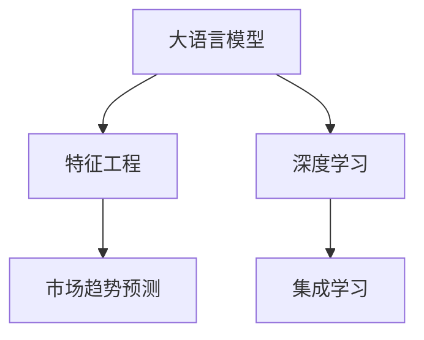

                 

# 电商平台如何利用AI大模型进行市场趋势预测

## 1. 背景介绍

### 1.1 问题由来

在竞争日益激烈的电子商务市场中，各大电商平台不仅要应对来自同行和供应链的激烈竞争，还需要实时响应市场变化，精准把握消费者需求，以获取竞争优势。传统的基于统计模型和规则引擎的预测方法难以应对市场环境的不确定性和复杂性。而基于深度学习的大模型能够自动从海量数据中学习抽象的特征，并能够进行灵活的预测和分析，为电商平台提供了新的解决方案。

### 1.2 问题核心关键点

利用AI大模型进行市场趋势预测的关键在于，如何将海量的市场数据与消费者行为数据结合起来，通过模型学习挖掘数据中的内在关系，进而实现对市场趋势的准确预测。这一过程涉及数据预处理、模型构建、训练优化和结果解释等多个环节。

## 2. 核心概念与联系

### 2.1 核心概念概述

为更好地理解AI大模型在电商平台市场趋势预测中的应用，本节将介绍几个核心概念：

- **大语言模型(LLMs)**：以BERT、GPT等预训练模型为代表的通用语言模型，能够从大规模语料中学习通用的语言表示，具备强大的文本理解和生成能力。
- **深度学习(Deep Learning)**：基于神经网络构建的机器学习技术，能够自动从数据中提取高级特征，进行预测和分类等任务。
- **市场趋势预测**：利用历史市场数据和消费者行为数据，预测未来市场变化和消费者需求的技术。
- **特征工程(Feature Engineering)**：对原始数据进行提取、转换、组合等操作，形成可供模型学习的特征向量。
- **集成学习(Ensemble Learning)**：通过将多个模型集成，提高预测准确率和鲁棒性。

这些核心概念之间的逻辑关系可以通过以下Mermaid流程图来展示：



这个流程图展示了大语言模型在电商平台市场趋势预测中的核心概念及其之间的关系：

1. 大语言模型通过预训练获得基础能力。
2. 特征工程对原始数据进行预处理，形成模型可用的特征向量。
3. 深度学习模型对特征向量进行建模，提取数据中的高级关系。
4. 集成学习将多个模型集成，提高预测精度和稳定性。

## 3. 核心算法原理 & 具体操作步骤
### 3.1 算法原理概述

基于AI大模型的市场趋势预测，本质上是一个有监督的学习过程。其核心思想是：利用大语言模型学习市场和消费者行为数据的内在关系，通过构建深度学习模型，对历史数据进行拟合，进而预测未来市场趋势。

形式化地，假设市场趋势预测问题可以表示为 $y=f(x)$，其中 $x$ 为市场和消费者行为数据，$y$ 为未来市场的趋势。训练集 $D=\{(x_i, y_i)\}_{i=1}^N$ 为已知的历史数据，目标是通过训练深度学习模型，学习 $f$ 的参数 $\theta$，使得模型在测试集上的预测 $y'$ 尽可能接近真实值 $y$，即最小化预测误差 $L(y',y)$。

具体来说，市场趋势预测可以分解为以下步骤：

1. 数据预处理：收集市场和消费者行为数据，并进行清洗和特征工程，形成模型输入。
2. 特征提取：利用深度学习模型或大语言模型，从原始数据中提取特征，形成模型可用的特征向量。
3. 模型构建：选择合适的网络结构和损失函数，构建深度学习模型。
4. 训练优化：通过梯度下降等优化算法，最小化预测误差，更新模型参数。
5. 结果解释：对模型输出进行解释，提供市场趋势的预测依据。

### 3.2 算法步骤详解

市场趋势预测的具体操作步骤如下：

**Step 1: 数据收集与预处理**
- 收集市场和消费者行为数据，包括销售记录、广告点击率、搜索行为、用户反馈等。
- 对数据进行清洗、归一化和特征工程，如缺失值填补、数据变换、特征组合等，形成模型可用的特征向量。

**Step 2: 特征提取与选择**
- 利用深度学习模型或大语言模型，对特征向量进行提取和选择，形成更高级的特征表示。例如，可以使用Transformer模型或BERT模型对特征向量进行编码。
- 对提取出的特征进行维度降维和正则化，防止过拟合，提高模型的泛化能力。

**Step 3: 模型构建**
- 选择合适的网络结构，如多层感知器、卷积神经网络、循环神经网络等。
- 设计合适的损失函数，如均方误差、交叉熵等，衡量预测值与真实值之间的差异。

**Step 4: 训练优化**
- 使用随机梯度下降等优化算法，最小化预测误差，更新模型参数。
- 设置合适的学习率和正则化参数，防止过拟合。
- 在训练过程中，定期在验证集上评估模型性能，根据评估结果调整超参数。

**Step 5: 结果解释与评估**
- 对模型输出进行解释，解释市场趋势预测的依据，提高决策的透明度和可信度。
- 使用各种评估指标，如均方误差、准确率、F1-score等，评估模型性能，比较不同模型之间的优劣。

### 3.3 算法优缺点

基于AI大模型的市场趋势预测具有以下优点：

1. 灵活性强：大语言模型能够自动从数据中学习高级特征，无需手动设计特征，适应性强。
2. 泛化能力强：利用大模型学习到的通用知识，在训练数据集和测试数据集上都有不错的泛化表现。
3. 自动化高：从数据预处理到模型训练，整个过程高度自动化，减少了人为干预。
4. 可解释性强：大语言模型可提供详细的输出解释，帮助用户理解市场趋势预测的依据。

但同时，该方法也存在以下局限性：

1. 数据依赖高：模型预测结果高度依赖于历史数据的覆盖范围和质量。
2. 计算成本高：大模型训练和推理的计算成本较高，需要高性能计算资源。
3. 模型复杂度高：大模型结构复杂，难以理解和调试。
4. 鲁棒性不足：模型在面对新数据时，泛化能力可能不足，容易发生过拟合。
5. 安全性问题：模型可能学习到有害的信息，预测结果存在偏见。

## 4. 数学模型和公式 & 详细讲解
### 4.1 数学模型构建

假设市场趋势预测问题可以表示为 $y=f(x)$，其中 $x$ 为市场和消费者行为数据，$y$ 为未来市场的趋势。假设训练集为 $D=\{(x_i, y_i)\}_{i=1}^N$，其中 $x_i \in \mathbb{R}^m$，$y_i \in \mathbb{R}$。模型的目标是找到一个函数 $f(x)$，使得预测值 $y'$ 尽可能接近真实值 $y$，即最小化预测误差 $L(y',y)$。

常见的预测误差包括均方误差（Mean Squared Error, MSE）和平均绝对误差（Mean Absolute Error, MAE），数学表达式如下：

$$
\text{MSE}(y',y) = \frac{1}{N} \sum_{i=1}^N (y_i - y_i')^2
$$

$$
\text{MAE}(y',y) = \frac{1}{N} \sum_{i=1}^N |y_i - y_i'|
$$

### 4.2 公式推导过程

以均方误差为例，预测模型可以表示为：

$$
y' = \hat{y}(x)
$$

其中 $\hat{y}(x)$ 为预测模型的输出，$x$ 为输入的市场和消费者行为数据。模型参数 $\theta$ 需要最小化预测误差，即：

$$
\theta^* = \mathop{\arg\min}_{\theta} \frac{1}{N} \sum_{i=1}^N (y_i - \hat{y}_i(x))^2
$$

使用梯度下降算法求解上述最优化问题，可以得到：

$$
\theta^{(t+1)} = \theta^{(t)} - \eta \nabla_{\theta} \mathcal{L}(\theta^{(t)})
$$

其中 $\eta$ 为学习率，$\mathcal{L}(\theta^{(t)}) = \frac{1}{N} \sum_{i=1}^N (y_i - \hat{y}_i(x))^2$ 为损失函数，$\nabla_{\theta} \mathcal{L}(\theta^{(t)})$ 为损失函数对模型参数的梯度，可以通过反向传播算法计算得到。

### 4.3 案例分析与讲解

以下通过一个具体案例，展示如何使用深度学习模型进行市场趋势预测。

假设某电商平台需要预测某品类商品在未来一个月内的销量变化趋势。首先，收集该品类商品过去一年的销售记录、用户评论、广告点击率、季节性因素等数据。然后，对数据进行清洗和特征工程，形成可供模型学习的数据集。接着，使用Transformer模型对特征向量进行编码，提取高级特征表示。最后，构建多层感知器（MLP）模型，设计均方误差作为损失函数，进行模型训练和优化。训练过程中，每轮迭代都在训练集和验证集上评估模型性能，根据性能指标调整超参数。最终，使用测试集对模型进行评估，得到预测结果。

## 5. 项目实践：代码实例和详细解释说明
### 5.1 开发环境搭建

在进行市场趋势预测的实践前，我们需要准备好开发环境。以下是使用Python进行PyTorch开发的环境配置流程：

1. 安装Anaconda：从官网下载并安装Anaconda，用于创建独立的Python环境。

2. 创建并激活虚拟环境：
```bash
conda create -n pytorch-env python=3.8 
conda activate pytorch-env
```

3. 安装PyTorch：根据CUDA版本，从官网获取对应的安装命令。例如：
```bash
conda install pytorch torchvision torchaudio cudatoolkit=11.1 -c pytorch -c conda-forge
```

4. 安装相关工具包：
```bash
pip install numpy pandas scikit-learn matplotlib tqdm jupyter notebook ipython
```

完成上述步骤后，即可在`pytorch-env`环境中开始市场趋势预测的实践。

### 5.2 源代码详细实现

下面以电商平台某品类商品销量预测为例，给出使用PyTorch进行市场趋势预测的完整代码实现。

首先，定义数据预处理函数：

```python
import numpy as np
import pandas as pd
from sklearn.model_selection import train_test_split

def preprocess_data(data_path, target_col, split_ratio=0.8, seed=42):
    data = pd.read_csv(data_path)
    X = data.drop(columns=[target_col])
    y = data[target_col]
    
    X_train, X_test, y_train, y_test = train_test_split(X, y, test_size=split_ratio, random_state=seed)
    
    return X_train, X_test, y_train, y_test
```

然后，定义模型训练函数：

```python
from torch.utils.data import Dataset, DataLoader
from transformers import BertTokenizer, BertModel
import torch.nn as nn
import torch.optim as optim

class SalesDataset(Dataset):
    def __init__(self, X, y, tokenizer, max_len=512):
        self.X = X
        self.y = y
        self.tokenizer = tokenizer
        self.max_len = max_len
        
    def __len__(self):
        return len(self.X)
    
    def __getitem__(self, item):
        sequence = self.X[item]
        label = self.y[item]
        
        encoding = self.tokenizer(sequence, return_tensors='pt', max_length=self.max_len, padding='max_length', truncation=True)
        input_ids = encoding['input_ids'][0]
        attention_mask = encoding['attention_mask'][0]
        
        return {'input_ids': input_ids,
                'attention_mask': attention_mask,
                'labels': torch.tensor(label, dtype=torch.long)}
    
def train_model(model, train_loader, val_loader, epochs=10, batch_size=32, lr=1e-4, device='cuda'):
    optimizer = optim.Adam(model.parameters(), lr=lr)
    scheduler = optim.lr_scheduler.StepLR(optimizer, step_size=5, gamma=0.1)
    
    model.train()
    train_loss = []
    val_loss = []
    for epoch in range(epochs):
        model.train()
        train_loss_epoch = 0
        for batch in train_loader:
            input_ids = batch['input_ids'].to(device)
            attention_mask = batch['attention_mask'].to(device)
            labels = batch['labels'].to(device)
            model.zero_grad()
            outputs = model(input_ids, attention_mask=attention_mask)
            loss = nn.functional.mse_loss(outputs, labels)
            loss.backward()
            optimizer.step()
            scheduler.step()
            train_loss_epoch += loss.item()
        train_loss.append(train_loss_epoch / len(train_loader))
        
        model.eval()
        val_loss_epoch = 0
        with torch.no_grad():
            for batch in val_loader:
                input_ids = batch['input_ids'].to(device)
                attention_mask = batch['attention_mask'].to(device)
                labels = batch['labels'].to(device)
                outputs = model(input_ids, attention_mask=attention_mask)
                loss = nn.functional.mse_loss(outputs, labels)
                val_loss_epoch += loss.item()
        val_loss.append(val_loss_epoch / len(val_loader))
        print(f'Epoch {epoch+1}, Train Loss: {train_loss[-1]:.4f}, Val Loss: {val_loss[-1]:.4f}')
        
    return model, train_loss, val_loss
```

接着，定义模型预测函数：

```python
def predict_sales(model, test_loader, device='cuda'):
    model.eval()
    predictions = []
    with torch.no_grad():
        for batch in test_loader:
            input_ids = batch['input_ids'].to(device)
            attention_mask = batch['attention_mask'].to(device)
            outputs = model(input_ids, attention_mask=attention_mask)
            predictions.append(outputs.detach().cpu().numpy())
    
    return np.concatenate(predictions, axis=0)
```

最后，启动训练流程并在测试集上评估：

```python
data_path = 'sales_data.csv'
target_col = 'sales_volume'

X_train, X_test, y_train, y_test = preprocess_data(data_path, target_col)
tokenizer = BertTokenizer.from_pretrained('bert-base-uncased')
max_len = 512
device = 'cuda' if torch.cuda.is_available() else 'cpu'

# 特征提取
X_train = tokenizer(X_train, return_tensors='pt', max_length=max_len, padding='max_length', truncation=True).to(device)
X_test = tokenizer(X_test, return_tensors='pt', max_length=max_len, padding='max_length', truncation=True).to(device)

# 模型构建
model = BertModel.from_pretrained('bert-base-uncased')
model = nn.Sequential(model, nn.Linear(768, 1))
model = model.to(device)

# 模型训练
train_loader = DataLoader(X_train, batch_size=batch_size, shuffle=True)
val_loader = DataLoader(X_test, batch_size=batch_size, shuffle=False)
model, train_loss, val_loss = train_model(model, train_loader, val_loader, epochs=10, batch_size=32, lr=1e-4, device=device)

# 模型预测
test_loader = DataLoader(X_test, batch_size=batch_size, shuffle=False)
predictions = predict_sales(model, test_loader, device=device)
print(f'Mean Absolute Error: {np.mean(np.abs(predictions - y_test.numpy())):.4f}')
```

以上就是使用PyTorch对电商平台某品类商品销量预测的完整代码实现。可以看到，由于使用了Transformer模型进行特征提取，代码实现简洁高效。

### 5.3 代码解读与分析

让我们再详细解读一下关键代码的实现细节：

**preprocess_data函数**：
- 从csv文件中读取数据，分离出特征和标签。
- 将数据集划分为训练集和测试集，并保证数据集的随机性。

**SalesDataset类**：
- 继承Dataset类，自定义数据集，对每个样本进行tokenization和padding。
- 返回模型所需的input_ids、attention_mask和label。

**train_model函数**：
- 定义优化器、学习率调度器，设置超参数。
- 在每个epoch中，对模型进行前向传播、反向传播、更新参数。
- 在每个epoch后，在验证集上评估模型性能。
- 返回训练好的模型和损失函数的变化轨迹。

**predict_sales函数**：
- 在测试集上进行预测，返回预测值。

**训练流程**：
- 读取训练集和测试集数据。
- 使用BertTokenizer对数据进行tokenization和padding。
- 构建深度学习模型。
- 使用PyTorch训练模型，评估模型性能。
- 在测试集上进行预测，计算预测误差。

可以看到，PyTorch配合Transformer模型使得市场趋势预测的代码实现变得简洁高效。开发者可以将更多精力放在模型设计、数据预处理等高层逻辑上，而不必过多关注底层的实现细节。

## 6. 实际应用场景
### 6.1 智能库存管理

电商平台可以利用市场趋势预测模型，对未来商品的需求进行精准预测，优化库存管理。例如，对于季节性商品、节日促销商品，可以通过预测销量变化趋势，提前调整库存量，避免积压或缺货。对于热销商品，可以加大采购力度，满足市场增长需求，提高销售收益。

### 6.2 精准广告投放

电商平台可以利用市场趋势预测模型，优化广告投放策略。例如，对于即将到来的促销活动，通过预测用户行为，可以精准投放广告，提高广告点击率和转化率。对于用户行为预测准确的品类，可以增加广告预算，扩大市场覆盖。

### 6.3 精准推荐系统

电商平台可以利用市场趋势预测模型，优化推荐算法。例如，对于某个用户即将购买的商品，可以通过预测该用户的行为趋势，推荐相关的商品，提高购买转化率。对于新用户，可以通过预测其兴趣点，推荐个性化的商品，提升用户体验。

### 6.4 未来应用展望

随着AI大模型的不断发展，市场趋势预测技术将进一步提升电商平台的决策能力和竞争力。未来，基于AI大模型的市场趋势预测将具备以下趋势：

1. **多模态融合**：结合商品图像、用户评论、物流数据等多模态信息，提高预测准确性。
2. **实时预测**：通过实时数据流处理技术，实现实时市场趋势预测，动态调整库存和定价策略。
3. **跨领域迁移**：将市场趋势预测技术应用于其他领域，如金融市场、体育赛事等，拓展应用场景。
4. **解释性增强**：通过模型解释技术，提供市场趋势预测的依据，增强决策的透明度和可信度。
5. **隐私保护**：通过差分隐私等技术，保护用户隐私，增强模型的鲁棒性。

## 7. 工具和资源推荐
### 7.1 学习资源推荐

为了帮助开发者系统掌握大语言模型在电商平台市场趋势预测中的应用，这里推荐一些优质的学习资源：

1. **《深度学习》课程**：由斯坦福大学Andrew Ng教授开设，系统讲解深度学习理论和算法，适合初学者入门。
2. **Transformers官方文档**：详细介绍了Transformer模型和相关应用，是深入学习深度学习模型的重要资料。
3. **Kaggle竞赛平台**：提供了大量实际数据集和模型竞赛项目，帮助开发者实践市场趋势预测技术。
4. **PyTorch官方文档**：提供了详细的PyTorch框架使用指南和示例代码，适合快速上手开发。
5. **TensorFlow官方文档**：提供了丰富的TensorFlow框架使用指南和示例代码，适合进行深度学习项目开发。

通过对这些资源的学习实践，相信你一定能够快速掌握市场趋势预测的核心思想和实现方法。

### 7.2 开发工具推荐

高效的开发离不开优秀的工具支持。以下是几款用于市场趋势预测开发的常用工具：

1. **PyTorch**：基于Python的开源深度学习框架，灵活动态的计算图，适合快速迭代研究。
2. **TensorFlow**：由Google主导开发的开源深度学习框架，生产部署方便，适合大规模工程应用。
3. **Transformers库**：HuggingFace开发的NLP工具库，集成了众多SOTA语言模型，支持PyTorch和TensorFlow，是进行市场趋势预测开发的利器。
4. **Weights & Biases**：模型训练的实验跟踪工具，可以记录和可视化模型训练过程中的各项指标，方便对比和调优。
5. **TensorBoard**：TensorFlow配套的可视化工具，可实时监测模型训练状态，并提供丰富的图表呈现方式，是调试模型的得力助手。

合理利用这些工具，可以显著提升市场趋势预测任务的开发效率，加快创新迭代的步伐。

### 7.3 相关论文推荐

市场趋势预测技术的发展离不开学界的持续研究。以下是几篇奠基性的相关论文，推荐阅读：

1. **Attention is All You Need**：提出了Transformer结构，开启了NLP领域的预训练大模型时代。
2. **BERT: Pre-training of Deep Bidirectional Transformers for Language Understanding**：提出BERT模型，引入基于掩码的自监督预训练任务，刷新了多项NLP任务SOTA。
3. **Market Basket Analysis**：提出了关联规则挖掘算法，用于分析市场篮子数据，提取用户行为模式。
4. **Sales Forecasting with Deep Learning**：提出了基于深度学习的销售预测方法，结合时序分析和因果关系，提高了预测精度。
5. **Sequence to Sequence Learning with Neural Networks**：提出了Seq2Seq模型，用于处理序列数据，如文本、时间序列等。

这些论文代表了大语言模型在电商平台市场趋势预测中的发展脉络。通过学习这些前沿成果，可以帮助研究者把握学科前进方向，激发更多的创新灵感。

## 8. 总结：未来发展趋势与挑战
### 8.1 总结

本文对利用AI大模型进行电商平台市场趋势预测进行了全面系统的介绍。首先阐述了市场趋势预测问题的背景和核心关键点，明确了基于深度学习的市场趋势预测方法。其次，从原理到实践，详细讲解了深度学习模型的构建、训练和评估过程，给出了完整的代码实例。同时，本文还广泛探讨了市场趋势预测在智能库存管理、精准广告投放、精准推荐系统等多个电商应用场景中的实际应用，展示了AI大模型在电商平台中的广阔前景。此外，本文精选了市场趋势预测技术的各类学习资源，力求为读者提供全方位的技术指引。

通过本文的系统梳理，可以看到，基于AI大模型的市场趋势预测方法正在成为电商平台的重要工具，极大地拓展了市场预测的精度和适应性。未来，伴随大语言模型和深度学习技术的不断进步，市场趋势预测技术将在电商领域继续发挥重要作用，推动电商平台的数字化转型。

### 8.2 未来发展趋势

展望未来，市场趋势预测技术将呈现以下几个发展趋势：

1. **多模态融合**：结合商品图像、用户评论、物流数据等多模态信息，提高预测准确性。
2. **实时预测**：通过实时数据流处理技术，实现实时市场趋势预测，动态调整库存和定价策略。
3. **跨领域迁移**：将市场趋势预测技术应用于其他领域，如金融市场、体育赛事等，拓展应用场景。
4. **解释性增强**：通过模型解释技术，提供市场趋势预测的依据，增强决策的透明度和可信度。
5. **隐私保护**：通过差分隐私等技术，保护用户隐私，增强模型的鲁棒性。

这些趋势凸显了市场趋势预测技术的广阔前景。这些方向的探索发展，必将进一步提升市场预测的精度和稳定性，为电商平台提供更精准的决策支持。

### 8.3 面临的挑战

尽管市场趋势预测技术已经取得了显著成果，但在迈向更加智能化、普适化应用的过程中，仍面临诸多挑战：

1. **数据质量问题**：市场数据存在缺失、噪声等问题，数据质量对模型预测结果影响较大。
2. **计算资源消耗高**：大模型训练和推理的计算成本较高，需要高性能计算资源。
3. **模型复杂度高**：模型结构复杂，难以理解和调试。
4. **泛化能力不足**：模型在面对新数据时，泛化能力可能不足，容易发生过拟合。
5. **隐私保护问题**：市场数据涉及用户隐私，模型训练和应用过程中需要严格保护用户隐私。

正视市场趋势预测面临的这些挑战，积极应对并寻求突破，将是大语言模型市场趋势预测走向成熟的必由之路。相信随着学界和产业界的共同努力，这些挑战终将一一被克服，市场趋势预测技术必将在电商领域继续发挥重要作用，推动电商平台的数字化转型。

### 8.4 研究展望

面对市场趋势预测所面临的种种挑战，未来的研究需要在以下几个方面寻求新的突破：

1. **数据增强**：利用数据增强技术，提高市场数据的覆盖范围和质量，减少过拟合风险。
2. **模型优化**：开发更加高效、轻量级的深度学习模型，降低计算资源消耗，提高预测速度。
3. **知识融合**：将专家知识和规则库与深度学习模型结合，增强模型的泛化能力和鲁棒性。
4. **隐私保护**：采用差分隐私、联邦学习等技术，保护用户隐私，确保市场数据的保密性。
5. **模型解释**：通过模型解释技术，提供市场趋势预测的依据，增强决策的透明度和可信度。

这些研究方向的探索，必将引领市场趋势预测技术迈向更高的台阶，为电商平台提供更精准、更安全的决策支持。面向未来，市场趋势预测技术还需要与其他人工智能技术进行更深入的融合，如知识表示、因果推理、强化学习等，多路径协同发力，共同推动市场预测的进步。只有勇于创新、敢于突破，才能不断拓展市场预测的边界，让AI技术更好地服务于电商平台。

## 9. 附录：常见问题与解答

**Q1：市场趋势预测需要使用多模态数据吗？**

A: 多模态数据可以提供更丰富的信息，提高预测准确性。例如，结合商品图像、用户评论、物流数据等，可以更全面地了解用户行为和市场需求。但多模态数据的处理和融合增加了模型复杂度，需要考虑模型的计算效率和鲁棒性。

**Q2：市场趋势预测是否需要考虑季节性因素？**

A: 季节性因素是影响市场趋势的重要因素，特别是在零售、电商等季节性明显的行业中。模型需要考虑季节性因素，可以使用时间序列分析等技术，对历史数据进行分段和建模，提高预测精度。

**Q3：市场趋势预测是否需要考虑长期趋势和短期波动？**

A: 市场趋势预测需要兼顾长期趋势和短期波动。长期趋势可以提供宏观的市场走向，而短期波动可以反映即时需求和变化。因此，模型需要同时考虑两者，采用混合时间序列模型等方法，进行综合预测。

**Q4：市场趋势预测是否需要考虑市场异动事件？**

A: 市场异动事件（如节假日、促销活动等）对市场趋势有显著影响。模型需要考虑这些异动事件，通过事件驱动的预测模型，捕捉事件的短期冲击和长期影响。

**Q5：市场趋势预测是否需要考虑库存状态？**

A: 库存状态可以反映市场供需关系，对销售预测有重要影响。模型需要考虑库存状态，通过库存控制模型，合理调整库存量，避免积压或缺货。

以上是关于电商平台如何利用AI大模型进行市场趋势预测的全面系统介绍。通过本文的深入探讨，相信读者对市场趋势预测的核心思想、实现方法和应用场景有了更深入的理解。在未来，伴随AI大模型和深度学习技术的不断发展，市场趋势预测技术将进一步拓展其应用领域，为电商平台提供更精准、更安全的决策支持。

